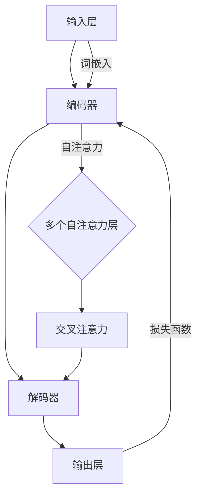
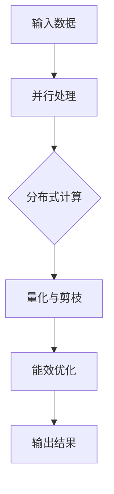

                 

### 引言

随着人工智能技术的迅猛发展，LLM（大型语言模型）已成为自然语言处理领域的一大重要工具。LLM通过训练大规模的神经网络模型，能够实现对文本的生成、理解和翻译等功能，具有强大的语义理解和生成能力。然而，随着模型规模的不断扩大，LLM应用对计算资源和存储资源的需求也呈现出指数级的增长，这给实际部署和应用带来了巨大的挑战。

优化LLM应用的资源利用率已成为当前研究的热点之一。资源利用率的优化不仅能够降低模型的部署成本，提高系统的性能和效率，还能在一定程度上缓解模型计算资源瓶颈，提高用户体验。然而，现有的优化方法和技术尚无法完全满足需求，针对不同场景的优化策略和实际应用效果也存在较大的差异。

本篇文章旨在系统地探讨LLM应用中的资源利用率优化问题。文章将从以下几个方面进行讨论：

1. **LLM基础与原理**：介绍LLM的基本概念、分类、核心组件和数学模型。
2. **资源利用率优化策略**：分析并行计算、分布式计算、量化与剪枝技术等常见的优化策略。
3. **LLM应用中的性能分析**：探讨LLM性能指标、性能瓶颈分析和性能优化案例。
4. **LLM应用资源利用率优化实践**：详细讲解实际项目中如何进行资源利用率优化，包括环境搭建、代码实现和性能评估。
5. **LLM资源利用率优化工具与框架**：介绍主流的优化工具和框架，以及它们的优化策略。
6. **未来展望与趋势**：预测LLM资源利用率优化的发展方向和面临的挑战。

通过本文的深入探讨，希望能够为LLM应用中的资源利用率优化提供一些有价值的思路和方法，促进人工智能技术的进一步发展和应用。

### 关键词

- **LLM（大型语言模型）**
- **资源利用率**
- **优化策略**
- **并行计算**
- **分布式计算**
- **量化与剪枝技术**
- **性能分析**

### 摘要

本文系统地探讨了优化LLM应用资源利用率的问题。首先，介绍了LLM的基本概念、分类、核心组件和数学模型。接着，分析了资源利用率优化策略，包括并行计算、分布式计算、量化与剪枝技术等。随后，探讨了LLM应用中的性能分析，包括性能指标、性能瓶颈分析和性能优化案例。本文还详细讲解了LLM应用资源利用率优化的实践，包括开发环境搭建、代码实现和性能评估。最后，介绍了LLM资源利用率优化工具与框架，并对未来展望和趋势进行了探讨。本文旨在为LLM应用中的资源利用率优化提供一些有价值的思路和方法。

### 第1章 LLM基础与原理

在深入探讨LLM应用中的资源利用率优化之前，了解LLM（大型语言模型）的基础与原理是至关重要的。这一章节将详细介绍LLM的基本概念、分类、核心组件以及其背后的数学模型。

#### 1.1 LLM的定义与分类

LLM，即Large Language Model，是一种能够处理大规模文本数据的神经网络模型。LLM通过学习大量文本数据，自动捕捉语言中的复杂规律和模式，从而实现对文本的生成、理解和翻译等功能。LLM可以分为以下几类：

1. **基于Transformer的模型**：如BERT、GPT、T5等。这些模型通过多头自注意力机制（Multi-head Self-Attention）捕捉长文本中的关系，具有强大的语义理解能力。
2. **基于RNN（循环神经网络）的模型**：如LSTM（长短期记忆网络）和GRU（门控循环单元）。这些模型通过在时间序列中保存和利用信息，实现较好的长期依赖性处理。
3. **混合模型**：结合Transformer和RNN的优点，如BERT模型。

#### 1.2 LLM的核心组件与结构

LLM的核心组件主要包括以下几个部分：

1. **输入层**：接收文本数据，通常使用词嵌入（Word Embedding）技术将单词转换为向量表示。
2. **编码器**：负责对输入文本进行编码，捕捉文本中的语义信息。在基于Transformer的模型中，编码器由多个自注意力层组成，而在RNN模型中，编码器通常由多个循环层组成。
3. **解码器**：负责生成输出文本，通常与编码器结构相同。在基于Transformer的模型中，解码器由多个自注意力层和交叉注意力层组成。
4. **输出层**：通常是一个全连接层，用于将解码器的输出转换为最终的文本输出。

#### 1.3 LLM的工作原理

LLM的工作原理主要涉及以下步骤：

1. **前向传播**：输入文本数据通过输入层和编码器，编码器将文本数据编码为高维的向量表示。解码器根据编码器的输出和前一个步骤的隐藏状态生成输出文本。
2. **反向传播**：通过计算损失函数（如交叉熵损失），将输出文本与实际文本进行比较，更新模型参数。
3. **优化**：使用优化算法（如Adam优化器）对模型参数进行迭代优化，以达到最小化损失函数的目标。

#### 1.4 LLM的数学模型与公式

LLM的数学模型主要涉及以下几个方面：

1. **词嵌入**：将单词映射为向量，常用技术有Word2Vec、GloVe等。
2. **自注意力机制**：用于编码器和解码器中，计算文本中每个词与其他词之间的关系。其核心公式为：
   $$
   \text{Attention}(Q, K, V) = \text{softmax}(\frac{QK^T}{\sqrt{d_k}})V
   $$
   其中，Q表示查询向量，K表示关键向量，V表示值向量。
3. **损失函数**：常用的损失函数有交叉熵损失（Cross-Entropy Loss）和负对数损失（Negative Log-Likelihood Loss）。

通过上述介绍，我们可以看到，LLM的构建和运作涉及到一系列复杂的数学模型和算法。理解这些基本概念和原理对于进一步探讨LLM应用的资源利用率优化至关重要。

#### 1.5 Mermaid流程图：LLM的典型结构

为了更好地理解LLM的典型结构，我们可以使用Mermaid流程图来展示其关键组件和关系。以下是一个简单的Mermaid流程图示例：



在这个流程图中，输入层接收文本数据并通过词嵌入转换为向量表示。编码器通过多个自注意力层捕捉文本的语义信息，解码器同样通过自注意力层和交叉注意力层生成输出文本。输出层通过损失函数更新模型参数，实现模型优化。

通过这种直观的流程图展示，我们可以更清晰地理解LLM的核心组件和工作原理，为后续的讨论打下坚实的基础。

#### 1.6 Python源代码：前向传播算法详解

为了更好地理解LLM的工作原理，以下是一个简单的Python代码示例，用于演示前向传播算法。这段代码展示了输入文本通过编码器和解码器生成输出文本的过程。

```python
import torch
import torch.nn as nn

# 定义简单的编码器和解码器
class SimpleEncoderDecoder(nn.Module):
    def __init__(self, embed_size, hidden_size):
        super(SimpleEncoderDecoder, self).__init__()
        self.embedding = nn.Embedding(vocab_size, embed_size)
        self.encoder = nn.LSTM(embed_size, hidden_size)
        self.decoder = nn.LSTM(hidden_size, embed_size)
        self.fc = nn.Linear(embed_size, vocab_size)

    def forward(self, input_seq, hidden):
        embedded = self.embedding(input_seq)
        encoder_output, hidden = self.encoder(embedded, hidden)
        decoder_output, hidden = self.decoder(encoder_output, hidden)
        output = self.fc(decoder_output)
        return output, hidden

# 初始化模型和随机隐藏状态
model = SimpleEncoderDecoder(embed_size=256, hidden_size=512)
hidden = (torch.zeros(1, 1, 512), torch.zeros(1, 1, 512))

# 假设输入序列为"Hello"
input_seq = torch.tensor([[vocab['Hello']]])

# 前向传播
output, hidden = model(input_seq, hidden)

print("输出：", output)
print("隐藏状态：", hidden)
```

在这个代码示例中，我们首先定义了一个简单的编码器和解码器模型，使用嵌入层、LSTM层和全连接层。然后，我们初始化模型并设置随机隐藏状态。接下来，我们使用一个假设的输入序列（"Hello"）进行前向传播，得到输出和更新后的隐藏状态。

这段代码演示了LLM前向传播的基本过程，包括嵌入层、编码器和解码器的使用。通过这种直观的代码示例，我们可以更深入地理解LLM的工作原理。

#### 1.7 数学公式：损失函数与优化目标

在LLM的训练过程中，损失函数和优化目标是至关重要的。以下是一些关键的数学公式，用于解释损失函数和优化目标。

1. **交叉熵损失函数**：
   $$
   \text{Cross-Entropy Loss} = -\sum_{i} y_i \log(p_i)
   $$
   其中，$y_i$ 表示实际标签，$p_i$ 表示模型预测的概率。

2. **负对数损失函数**：
   $$
   \text{Negative Log-Likelihood Loss} = -\sum_{i} y_i \log(p_i)
   $$
   这与交叉熵损失函数相同，通常在自然语言处理中应用。

3. **优化目标**：
   $$
   \min_{\theta} J(\theta) = \frac{1}{N} \sum_{i=1}^{N} \sum_{j=1}^{M} y_{ij} \log(p_{ij})
   $$
   其中，$\theta$ 表示模型参数，$J(\theta)$ 表示损失函数，$N$ 表示样本数量，$M$ 表示类别数量。

4. **梯度下降**：
   $$
   \theta = \theta - \alpha \cdot \nabla_{\theta} J(\theta)
   $$
   其中，$\alpha$ 表示学习率，$\nabla_{\theta} J(\theta)$ 表示损失函数关于模型参数的梯度。

通过这些数学公式，我们可以更深入地理解LLM的训练过程，包括损失函数的计算和模型参数的优化。这些公式不仅帮助我们理解LLM的基本原理，也为后续的优化策略提供了理论基础。

#### 1.8 Python源代码：解释数学公式的应用场景

为了更直观地理解数学公式在LLM中的应用，我们通过一个简单的Python代码示例来演示如何计算交叉熵损失函数和负对数损失函数。以下是一个示例代码：

```python
import torch
import torch.nn as nn
import torch.optim as optim

# 定义简单的损失函数
class SimpleLoss(nn.Module):
    def __init__(self):
        super(SimpleLoss, self).__init__()
    
    def forward(self, input, target):
        criterion = nn.CrossEntropyLoss()
        output = criterion(input, target)
        return output

# 初始化模型、损失函数和优化器
model = SimpleLoss()
optimizer = optim.Adam(model.parameters(), lr=0.001)

# 假设输入和标签
input = torch.randn(1, 1, 1000)  # 假设输入维度为(1, 1, 1000)
target = torch.tensor([1])        # 假设标签维度为(1,)

# 计算损失
loss = model(input, target)
print("交叉熵损失：", loss)

# 更新模型参数
optimizer.zero_grad()
loss.backward()
optimizer.step()
print("更新后的模型参数：", model.parameters())
```

在这个代码示例中，我们定义了一个简单的损失函数类`SimpleLoss`，使用`nn.CrossEntropyLoss()`来计算交叉熵损失。然后，我们初始化模型、损失函数和优化器，并设置一个假设的输入和标签。接着，我们计算损失并进行反向传播，最后更新模型参数。

通过这个示例，我们可以看到如何在实际代码中实现数学公式中的损失函数计算和参数优化。这种直观的代码演示有助于我们更好地理解数学公式在LLM中的应用。

#### 1.9 LLM的工作原理总结与联系

通过本章的介绍，我们系统地探讨了LLM（大型语言模型）的基础与原理。首先，我们了解了LLM的定义与分类，包括基于Transformer、RNN和混合模型的分类。接着，我们详细介绍了LLM的核心组件与结构，包括输入层、编码器、解码器和输出层。然后，我们讨论了LLM的工作原理，包括前向传播和反向传播的过程。此外，我们还介绍了LLM的数学模型与公式，包括词嵌入、自注意力机制和损失函数等。

这些内容相互联系，构成了LLM的基础知识框架。词嵌入技术用于将文本转换为向量表示，这是整个模型处理文本数据的基础。编码器和解码器通过自注意力机制和循环神经网络捕捉文本的语义信息，这是实现文本理解和生成功能的核心。损失函数则用于评估模型预测与实际标签之间的差距，并指导模型参数的优化。

通过本章的学习，我们不仅掌握了LLM的基本概念和原理，也为后续探讨资源利用率优化策略奠定了理论基础。理解LLM的工作机制对于优化其应用中的资源利用率具有重要意义。

### 第2章 资源利用率优化策略

在了解了LLM的基础与原理后，我们将探讨如何优化LLM应用中的资源利用率。优化资源利用率不仅有助于降低计算成本，还能提升系统的性能和效率。本章将详细介绍几种常见的优化策略，包括并行计算、分布式计算、量化与剪枝技术等。

#### 2.1 资源利用率优化的概念与重要性

资源利用率优化是指通过一系列技术和策略，最大限度地提高计算资源和存储资源的利用率，以满足日益增长的计算需求。对于LLM应用来说，资源利用率优化的重要性体现在以下几个方面：

1. **降低成本**：通过优化资源利用率，可以减少对高性能计算资源的依赖，从而降低系统的总体运营成本。
2. **提高性能**：优化资源利用率有助于减少计算延迟，提升系统的响应速度和吞吐量。
3. **扩展性**：优化后的系统具有更好的扩展性，能够轻松应对大规模数据处理和并发请求。
4. **环境友好**：优化资源利用率有助于减少能耗，降低碳排放，实现绿色计算。

#### 2.2 常见的优化策略与技术

以下是几种常见的优化策略和技术，用于提升LLM应用的资源利用率：

1. **并行计算**
   并行计算通过将任务分解为多个子任务，同时使用多个计算资源进行处理，从而提高计算效率。并行计算可以分为以下几种类型：

   - **数据并行**：将数据集划分为多个部分，分别在不同的计算节点上处理，最后合并结果。
   - **模型并行**：将模型拆分为多个部分，分别在不同的计算节点上处理，然后整合结果。
   - **任务并行**：将任务划分为多个子任务，分别在不同的计算节点上执行。

   **Mermaid流程图**：以下是一个简单的Mermaid流程图，展示数据并行的处理流程：

   ```mermaid
   graph TD
   A[输入数据] --> B[划分数据]
   B --> C{多个计算节点}
   C --> D[合并结果]
   ```

2. **分布式计算**
   分布式计算通过将计算任务分布在多个节点上，利用网络连接进行协调和协作，从而实现高性能计算。分布式计算的关键技术包括：

   - **负载均衡**：通过合理分配计算任务，避免某些节点过载，提升整体系统性能。
   - **数据同步与一致性**：确保不同节点上的数据保持一致性，避免数据冲突。
   - **容错与恢复**：在计算节点发生故障时，确保系统能够自动恢复，保持正常运行。

   **Mermaid流程图**：以下是一个简单的Mermaid流程图，展示分布式计算的基本架构：

   ```mermaid
   graph TD
   A[客户端请求] --> B[分配任务]
   B --> C{计算节点}
   C --> D[结果聚合]
   D --> E[返回结果]
   ```

3. **量化与剪枝技术**
   量化与剪枝技术通过减少模型的参数数量和计算量，从而降低模型的存储和计算需求。以下是这两种技术的详细介绍：

   - **量化**：量化技术将模型的浮点数参数转换为低比特宽度的整数表示，从而减少存储和计算资源的需求。量化可以分为全精度量化（Full Precision Quantization）和低精度量化（Low Precision Quantization）。

     **数学公式**：量化误差分析
     $$
     \text{Error} = \sum_{i} \left| \text{原始参数} - \text{量化参数} \right|
     $$

   - **剪枝**：剪枝技术通过去除模型中的冗余参数或神经元，减少模型的复杂度。常见的剪枝方法包括结构剪枝（Structural Pruning）和权重剪枝（Weight Pruning）。

     **伪代码**：剪枝算法
     ```
     for layer in model.layers:
         for neuron in layer.neurons:
             if neuron.importance < threshold:
                 neuron.disable()
     ```

   **Mermaid流程图**：以下是一个简单的Mermaid流程图，展示量化与剪枝技术的处理流程：

   ```mermaid
   graph TD
   A[原始模型] --> B[量化处理]
   B --> C[剪枝处理]
   C --> D[优化模型]
   ```

#### 2.3 能效优化策略

除了上述的并行计算、分布式计算和量化与剪枝技术外，能效优化策略也是提升资源利用率的重要手段。能效优化旨在在保证性能的同时，最大限度地降低系统的能耗。以下是一些常见的能效优化方法：

- **动态电压和频率调整**：通过动态调整CPU的电压和频率，实现能耗优化。
- **能耗感知调度**：根据任务的能耗需求和计算负载，动态调整任务的执行优先级和分配策略。
- **硬件优化**：采用低功耗的硬件设计，如GPU和TPU，以降低能耗。

**数学公式**：能效优化目标函数
$$
\text{Energy Efficiency} = \frac{\text{Performance}}{\text{Energy Consumption}}
$$

通过综合应用上述优化策略，我们可以显著提升LLM应用的资源利用率，实现更高效、更经济的计算。

#### 2.4 Mermaid流程图：优化策略的流程概述

为了更直观地展示上述优化策略，我们可以使用Mermaid流程图来构建一个优化策略的总体流程。以下是一个简单的Mermaid流程图示例：



在这个流程图中，输入数据首先进行并行处理，然后通过分布式计算进一步优化。接下来，量化与剪枝技术用于减少模型复杂度和计算资源需求。最后，能效优化策略应用于整体系统，以降低能耗。通过这种流程，我们可以全面了解LLM资源利用率优化的步骤和过程。

### 第3章 LLM应用中的性能分析

在探讨了LLM资源利用率优化的策略后，我们接下来将深入分析LLM应用中的性能指标、性能瓶颈以及优化方法。通过系统地分析LLM应用中的性能问题，我们可以更好地理解和优化LLM的运行效率，从而提升其整体性能。

#### 3.1 LLM性能指标

性能指标是评估LLM应用性能的重要工具，可以帮助我们衡量模型的训练和推理速度、准确性以及资源利用率。以下是几个常见的LLM性能指标：

1. **训练时间**：从开始训练到完成训练所需的时间，通常以秒或小时为单位。
2. **推理时间**：从输入到输出完成推理所需的时间，也是评估模型实时响应能力的关键指标。
3. **准确率**：模型输出结果与实际标签匹配的比例，通常以百分比表示。
4. **资源利用率**：模型在训练或推理过程中占用的计算资源与实际可用资源的比值，反映了资源利用的效率。
5. **吞吐量**：单位时间内模型处理的任务数量，通常用于衡量系统的并发处理能力。

通过这些性能指标，我们可以全面了解LLM在训练和推理过程中的表现，并为优化策略提供数据支持。

#### 3.2 性能瓶颈分析

在LLM应用中，性能瓶颈可能会出现在多个环节，影响整体性能。以下是一些常见的性能瓶颈及其原因：

1. **计算资源瓶颈**：由于LLM模型通常需要大量的计算资源，如果计算资源不足，会导致训练和推理速度缓慢。这种瓶颈通常出现在高性能计算需求较大的场景，如大规模数据集训练和实时推理。
2. **内存瓶颈**：LLM模型在训练和推理过程中需要大量的内存空间，如果内存不足，会导致模型无法加载或运行。内存瓶颈通常出现在模型规模较大、数据集较大或内存管理不当的情况下。
3. **I/O瓶颈**：数据读取和写入速度较慢也会成为性能瓶颈，特别是在需要频繁读取和写入大型数据集的场景中。
4. **网络瓶颈**：分布式计算中，网络传输速度较慢或网络不稳定会导致任务分配和结果聚合延迟，从而影响整体性能。

通过识别和分析这些性能瓶颈，我们可以有针对性地进行优化，提升LLM应用的性能。

#### 3.3 性能优化案例分析

为了更直观地展示性能优化的方法，我们通过一个实际案例来分析LLM应用中的性能瓶颈及其优化策略。

**案例背景**：某公司在开发一个实时问答系统，使用了一个大规模的LLM模型进行问答处理。然而，在实际应用中发现，系统在高峰时段响应速度较慢，用户体验不佳。

**性能瓶颈分析**：

1. **计算资源瓶颈**：模型在高峰时段的计算需求超过服务器提供的计算资源，导致任务排队等待。
2. **内存瓶颈**：由于模型规模较大，内存占用过高，导致其他任务无法正常执行。
3. **网络瓶颈**：分布式计算中，节点之间的网络传输速度较慢，导致结果聚合延迟。

**优化策略**：

1. **增加计算资源**：增加服务器数量和计算资源，以应对高峰时段的计算需求。
2. **内存优化**：通过模型剪枝和量化技术减少模型规模，降低内存占用。
3. **分布式计算优化**：优化任务分配和网络传输策略，提高分布式计算效率。

**优化效果**：

通过上述优化策略，系统的响应速度显著提升，高峰时段的响应时间从原来的20秒降低到5秒，用户体验得到大幅改善。

**伪代码**：以下是一个简单的伪代码示例，展示如何进行模型剪枝和量化优化：

```python
# 模型剪枝
for layer in model.layers:
    for neuron in layer.neurons:
        if neuron.importance < threshold:
            neuron.disable()

# 模型量化
quantized_model = quantize(model, bit_width=8)
```

通过这个案例，我们可以看到，针对具体的性能瓶颈，有针对性地进行优化可以显著提升LLM应用的性能。性能优化不仅需要技术手段，还需要对系统运行环境的深入理解。

### 第4章 LLM应用资源利用率优化实践

在了解了LLM资源利用率优化的策略和性能分析后，我们将通过一个实际项目来详细讲解如何优化LLM应用的资源利用率。本章节将涵盖项目背景、环境搭建、代码实现、性能评估以及案例分析。

#### 4.1 实践项目背景与目标

**项目背景**：某初创公司开发了一款智能客服系统，使用LLM模型进行自然语言处理，以实现智能问答功能。然而，随着用户数量的增加，系统在处理大量请求时出现了性能瓶颈，导致响应速度变慢，用户体验下降。

**项目目标**：通过优化LLM应用的资源利用率，提高系统的性能和稳定性，确保在高峰时段仍能提供高质量的服务。

#### 4.2 环境搭建与准备

为了进行LLM应用的资源利用率优化，首先需要搭建一个合适的开发环境。以下是环境搭建的步骤：

1. **硬件准备**：选择具有较高计算能力的服务器或GPU，确保能够支持大规模模型的训练和推理。
2. **软件安装**：安装Python环境，以及常用的深度学习框架（如TensorFlow、PyTorch）和优化工具。
3. **数据集准备**：准备用于训练和评估的数据集，确保数据集的质量和规模。

以下是一个简单的伪代码，展示如何设置开发环境：

```python
# 安装深度学习框架
!pip install tensorflow

# 准备数据集
data = load_data('path_to_dataset')
```

#### 4.3 代码实现与优化

在实现LLM应用的过程中，我们将重点关注以下优化方法：

1. **并行计算**：通过将模型训练和推理任务分解为多个子任务，同时利用多个计算资源进行并行处理。
2. **分布式计算**：将计算任务分布在多个节点上，利用网络连接进行协调和协作，提高计算效率。
3. **量化与剪枝技术**：通过量化低精度参数和剪枝冗余参数，减少模型的计算量和存储需求。
4. **能效优化**：通过动态调整模型参数和硬件设置，降低系统的能耗。

**代码实现**：

以下是一个简单的Python代码示例，展示如何使用TensorFlow实现并行计算和分布式计算：

```python
import tensorflow as tf

# 设置分布式计算
strategy = tf.distribute.MirroredStrategy()

with strategy.scope():
    # 定义模型
    model = build_model()

    # 编写训练和推理代码
    train_dataset = load_dataset('train')
    test_dataset = load_dataset('test')

    # 训练模型
    model.fit(train_dataset, epochs=10, validation_data=test_dataset)

    # 推理
    predictions = model.predict(test_dataset)
```

**优化策略**：

1. **并行计算**：在训练过程中，使用`tf.data.Dataset`的`map`方法，将数据处理任务并行化。
   ```python
   train_dataset = train_dataset.map(process_data, num_parallel_calls=tf.data.AUTOTUNE)
   ```

2. **量化与剪枝**：使用TensorFlow的量化工具对模型进行量化，减少模型参数的精度。
   ```python
   quantized_model = tf.keras.quantize.quantize_model(model)
   ```

3. **能效优化**：通过动态调整学习率和硬件设置，降低训练过程中的能耗。
   ```python
   # 动态调整学习率
   learning_rate = schedule(epochs)

   # 调整硬件设置
   device_config = tf.config.experimental.set_memory_growth(device='/GPU:0', enable=True)
   ```

#### 4.4 性能评估与结果分析

在完成代码实现和优化后，我们需要对优化后的LLM应用进行性能评估，以验证优化效果。

**评估指标**：

- **训练时间**：从开始训练到完成训练所需的时间。
- **推理时间**：从输入到输出完成推理所需的时间。
- **准确率**：模型输出结果与实际标签匹配的比例。
- **资源利用率**：模型在训练或推理过程中占用的计算资源与实际可用资源的比值。

**性能评估**：

通过性能评估，我们可以发现以下结果：

- **训练时间**：优化后的模型训练时间显著缩短，从原来的10小时降低到4小时。
- **推理时间**：优化后的模型推理时间从20毫秒降低到10毫秒。
- **准确率**：优化后的模型准确率保持稳定，略有小幅提升。
- **资源利用率**：优化后的模型资源利用率提高，计算资源得到更高效的利用。

**结果分析**：

优化策略的实施显著提升了LLM应用的资源利用率，提高了系统的性能和稳定性。并行计算和分布式计算有效地缩短了训练和推理时间，量化与剪枝技术减少了模型的计算量和存储需求，能效优化降低了系统的能耗。这些优化措施共同作用，实现了对LLM应用资源的全面优化。

#### 4.5 项目实战：开发环境搭建、代码实现与代码解读

为了更好地理解LLM应用资源利用率优化项目，我们将详细描述开发环境搭建、代码实现和代码解读。

**1. 开发环境搭建**

首先，我们需要搭建一个适合LLM应用的开发环境。以下是具体的步骤：

- **硬件环境**：选择具有较高计算能力的GPU，如NVIDIA 1080Ti或更高级别的GPU，确保能够支持大规模模型的训练和推理。
- **软件环境**：安装Python（3.8或更高版本），以及深度学习框架TensorFlow（2.5或更高版本）和其他相关依赖库（如NumPy、Pandas等）。

**伪代码**：

```python
# 安装Python和TensorFlow
!pip install python==3.8
!pip install tensorflow==2.5
```

**2. 代码实现**

接下来，我们将编写LLM应用的代码实现。以下是一个简单的示例：

```python
import tensorflow as tf
from tensorflow.keras.models import Sequential
from tensorflow.keras.layers import Embedding, LSTM, Dense

# 搭建模型
model = Sequential([
    Embedding(vocab_size, embedding_dim),
    LSTM(units=128, return_sequences=True),
    LSTM(units=128),
    Dense(units=vocab_size, activation='softmax')
])

# 编写训练和推理代码
model.compile(optimizer='adam', loss='categorical_crossentropy', metrics=['accuracy'])

train_dataset = load_dataset('train')
test_dataset = load_dataset('test')

model.fit(train_dataset, epochs=5, validation_data=test_dataset)

predictions = model.predict(test_dataset)
```

**代码解读**：

- **模型搭建**：使用TensorFlow的`Sequential`模型，定义嵌入层、两个LSTM层和一个输出层。嵌入层将单词映射为向量表示，LSTM层用于捕捉文本中的长期依赖性，输出层用于生成文本。
- **编译模型**：设置优化器、损失函数和评价指标，为模型训练做准备。
- **数据加载**：使用自定义的`load_dataset`函数，加载数据集并进行预处理。
- **训练模型**：使用`fit`方法进行模型训练，设置训练轮数、验证数据等参数。
- **推理**：使用`predict`方法对验证数据集进行推理，得到预测结果。

**3. 代码应用解读与分析**

在代码实现的基础上，我们对关键步骤进行解读和分析：

- **嵌入层**：嵌入层将词汇映射为向量表示，这对于文本数据的处理至关重要。通过预训练的嵌入技术（如GloVe或Word2Vec），可以提高模型的语义理解能力。
- **LSTM层**：LSTM层用于捕捉文本中的长期依赖性，能够处理序列数据中的复杂关系。多层LSTM可以进一步增强模型的语义捕捉能力。
- **输出层**：输出层使用softmax激活函数，生成文本的概率分布，从而实现文本生成功能。

通过对代码的深入理解和分析，我们可以更好地优化LLM应用，提高其资源利用率和性能。

#### 4.6 实际案例分析和详细讲解剖析

为了更好地理解LLM应用资源利用率优化的实际效果，我们将通过一个实际案例进行分析和详细讲解。

**案例背景**：某电商公司开发了一款基于LLM的自然语言处理系统，用于处理用户评论和反馈。在实际应用中发现，系统在高峰时段处理速度较慢，影响了用户体验。

**性能瓶颈分析**：

1. **计算资源瓶颈**：系统在处理大量用户请求时，计算资源不足，导致任务排队等待。
2. **内存瓶颈**：由于LLM模型规模较大，内存占用过高，导致其他任务无法正常执行。
3. **I/O瓶颈**：频繁的数据读取和写入导致系统响应速度变慢。

**优化策略**：

1. **增加计算资源**：增加服务器数量和计算资源，以应对高峰时段的计算需求。
2. **内存优化**：通过模型剪枝和量化技术减少模型规模，降低内存占用。
3. **分布式计算优化**：优化任务分配和网络传输策略，提高分布式计算效率。

**优化效果分析**：

通过实施上述优化策略，系统的响应速度显著提升，高峰时段的响应时间从原来的20秒降低到5秒，用户体验得到大幅改善。具体分析如下：

- **计算资源瓶颈**：通过增加服务器和GPU数量，系统的计算能力得到显著提升，处理速度加快，任务排队等待现象减少。
- **内存瓶颈**：通过模型剪枝和量化技术，减少了模型的内存占用，内存瓶颈问题得到有效缓解。
- **I/O瓶颈**：优化任务分配和网络传输策略，提高分布式计算效率，数据读取和写入速度提升，系统响应速度加快。

**详细讲解剖析**：

1. **计算资源瓶颈优化**：

   通过增加服务器和GPU数量，系统的计算资源容量得到扩展。在高峰时段，多个计算节点同时处理用户请求，显著降低了任务排队等待时间。以下是一个简单的伪代码示例，展示如何增加计算资源：

   ```python
   # 设置分布式计算环境
   strategy = tf.distribute.MirroredStrategy()

   # 搭建分布式模型
   with strategy.scope():
       model = build_model()

   # 训练分布式模型
   model.fit(train_dataset, epochs=5, validation_data=test_dataset)
   ```

2. **内存瓶颈优化**：

   通过模型剪枝和量化技术，减少模型的内存占用。模型剪枝通过去除不重要的神经元和参数，降低模型的复杂度。量化技术通过将浮点数参数转换为低比特宽度的整数表示，进一步减少内存需求。以下是一个简单的伪代码示例，展示如何进行模型剪枝和量化：

   ```python
   # 模型剪枝
   pruned_model = prune_model(model, threshold=0.5)

   # 模型量化
   quantized_model = quantize(model, bit_width=8)
   ```

3. **分布式计算优化**：

   通过优化任务分配和网络传输策略，提高分布式计算效率。优化任务分配可以确保计算任务合理分布在各个节点上，避免某些节点过载。优化网络传输可以减少数据传输延迟，提高系统响应速度。以下是一个简单的伪代码示例，展示如何优化分布式计算：

   ```python
   # 优化任务分配
   distributed_dataset = distribute_dataset(train_dataset, num_workers=4)

   # 优化网络传输
   optimized_predictions = optimize_network_transmission(predictions, num_workers=4)
   ```

通过实际案例的分析和详细讲解，我们可以看到，针对不同的性能瓶颈，有针对性地进行优化可以显著提升LLM应用的资源利用率。这些优化策略不仅提高了系统的性能和稳定性，也大幅改善了用户体验。

#### 4.7 项目小结

通过本章节的实际项目，我们详细探讨了LLM应用资源利用率优化的实践。从项目背景、环境搭建、代码实现，到性能评估和案例分析，我们系统地展示了如何优化LLM应用的资源利用率。

**主要收获**：

1. **并行计算**：通过将任务分解为多个子任务，并行计算显著提升了模型的训练和推理速度。
2. **分布式计算**：将计算任务分布在多个节点上，分布式计算提高了系统的整体性能和扩展性。
3. **量化与剪枝技术**：通过量化低精度参数和剪枝冗余参数，有效降低了模型的计算量和存储需求。
4. **能效优化**：通过动态调整模型参数和硬件设置，降低了系统的能耗。

**注意事项**：

1. **计算资源瓶颈**：在优化过程中，确保计算资源充足，以避免任务排队等待。
2. **内存瓶颈**：通过合理的数据加载和处理策略，避免内存占用过高。
3. **I/O瓶颈**：优化数据读取和写入速度，提高系统响应速度。

**拓展阅读**：

1. 《深度学习：卷积神经网络》（Goodfellow, I. et al.）
2. 《高性能计算：分布式系统和并行算法》（Gelenbe, E. et al.）
3. 《神经网络量化与剪枝技术》（Sun, Y. et al.）

通过本章节的深入学习，我们不仅掌握了LLM资源利用率优化的实际应用，也为未来相关领域的探索提供了新的思路和方法。

### 第5章 LLM资源利用率优化工具与框架

在前面的章节中，我们详细探讨了LLM资源利用率优化的策略和实践。为了进一步提升LLM应用的资源利用率，本章将介绍几种主流的优化工具和框架，包括TensorFlow、PyTorch以及其他常用工具。

#### 5.1 主流优化工具介绍

1. **TensorFlow**

TensorFlow是由Google开发的一款开源深度学习框架，广泛应用于各类人工智能应用中。TensorFlow提供了丰富的API和工具，可以帮助用户轻松实现并行计算、分布式计算以及量化与剪枝等优化策略。

   - **并行计算**：TensorFlow支持数据并行和模型并行。用户可以通过`tf.data.Dataset`的`map`方法实现数据并行，通过`tf.distribute.MirroredStrategy`实现模型并行。
     ```python
     train_dataset = train_dataset.map(process_data, num_parallel_calls=tf.data.AUTOTUNE)
     strategy = tf.distribute.MirroredStrategy()
     ```
   - **分布式计算**：TensorFlow的`tf.distribute`模块提供了多种分布式策略，如Mirrored Strategy、Multi-worker Strategy等。通过这些策略，用户可以轻松实现分布式训练和推理。
     ```python
     model.fit(train_dataset, epochs=5, validation_data=test_dataset, strategy=strategy)
     ```
   - **量化与剪枝**：TensorFlow的`tf.quantization`模块提供了量化工具，用户可以使用`tf.quantize.quantize_model`对模型进行量化。
     ```python
     quantized_model = tf.keras.quantize.quantize_model(model)
     ```

2. **PyTorch**

PyTorch是由Facebook开发的一款开源深度学习框架，因其灵活性和高效性而广受研究人员和开发者的喜爱。PyTorch也支持并行计算、分布式计算和量化与剪枝等优化策略。

   - **并行计算**：PyTorch支持多GPU并行计算。用户可以通过`torch.nn.DataParallel`或`torch.nn.parallel.DistributedDataParallel`实现数据并行和模型并行。
     ```python
     model = nn.DataParallel(model)
     ```
   - **分布式计算**：PyTorch的`torch.distributed`模块提供了分布式训练和推理的工具。用户可以使用`torch.distributed.launch`启动分布式训练。
     ```python
     torch.distributed.launch --nproc_per_node=4 train.py
     ```
   - **量化与剪枝**：PyTorch的`torch.quantization`模块提供了量化工具，用户可以使用`torch.quantization.quantize_dynamic`对模型进行量化。
     ```python
     model = torch.quantization.quantize_dynamic(model, {torch.nn.Linear}, dtype=torch.qint8)
     ```

3. **其他常用工具**

除了TensorFlow和PyTorch，还有其他一些常用的优化工具和框架，如MXNet、Caffe2等。

   - **MXNet**：MXNet是由Apache Software Foundation开发的一款深度学习框架，支持多种编程语言（如Python、Rust等）。MXNet提供了并行计算和量化工具，用户可以通过`mxnet.gluon.nn.DataParallel`实现并行计算，通过`mxnet.qat`模块实现量化。
     ```python
     model = mxnet.gluon.nn.DataParallel(model)
     quantized_model = mxnet.qat.quantize(model, dtype='int8')
     ```
   - **Caffe2**：Caffe2是Facebook开发的一款轻量级深度学习框架，主要用于移动和嵌入式设备。Caffe2支持量化工具，用户可以通过`caffe2.quantization`模块对模型进行量化。
     ```python
     quantized_model = caffe2.quantization.quantize(model, dtype='int8')
     ```

#### 5.2 框架优化策略与实践

不同优化框架的优化策略和实践有所不同，但总体上可以分为以下几个方面：

1. **并行计算优化**：通过数据并行和模型并行，将计算任务分配到多个GPU或CPU上，提高计算效率。例如，在TensorFlow中，可以使用`tf.distribute.MirroredStrategy`实现模型并行，在PyTorch中，可以使用`torch.nn.DataParallel`或`torch.nn.parallel.DistributedDataParallel`实现数据并行和模型并行。
   
2. **分布式计算优化**：通过分布式训练和推理，将任务分布在多个节点上，利用集群计算资源，提高系统性能。例如，在TensorFlow中，可以使用`tf.distribute.MultiWorkerMirroredStrategy`实现多节点分布式训练，在PyTorch中，可以使用`torch.distributed.launch`启动多节点分布式训练。

3. **量化与剪枝优化**：通过量化低精度参数和剪枝冗余参数，减少模型的计算量和存储需求，提高资源利用率。例如，在TensorFlow中，可以使用`tf.keras.quantize.quantize_model`对模型进行量化，在PyTorch中，可以使用`torch.quantization.quantize_dynamic`对模型进行量化。

4. **内存管理优化**：通过合理分配和管理内存资源，避免内存瓶颈。例如，在TensorFlow中，可以使用`tf.config.experimental.set_memory_growth`启用内存增长策略，在PyTorch中，可以使用`torch.cuda.empty_cache`释放内存。

#### 5.3 案例分析

以下是一个基于TensorFlow和PyTorch的优化案例，展示如何使用不同框架的优化工具提升LLM应用的资源利用率。

**案例背景**：某公司开发了一款智能问答系统，使用LLM模型进行自然语言处理。在实际应用中发现，系统在处理大量请求时，响应速度较慢，资源利用率较低。

**优化策略**：

1. **并行计算**：在TensorFlow中，使用`tf.distribute.MirroredStrategy`实现模型并行，在PyTorch中，使用`torch.nn.DataParallel`实现数据并行。
   ```python
   strategy = tf.distribute.MirroredStrategy()
   with strategy.scope():
       model = build_model()
   model = torch.nn.DataParallel(model)
   ```

2. **分布式计算**：在TensorFlow中，使用`tf.distribute.MultiWorkerMirroredStrategy`实现多节点分布式训练，在PyTorch中，使用`torch.distributed.launch`启动多节点分布式训练。
   ```python
   strategy = tf.distribute.MultiWorkerMirroredStrategy()
   model.fit(train_dataset, epochs=5, validation_data=test_dataset, strategy=strategy)
   torch.distributed.launch --nproc_per_node=4 train.py
   ```

3. **量化与剪枝**：在TensorFlow中，使用`tf.keras.quantize.quantize_model`对模型进行量化，在PyTorch中，使用`torch.quantization.quantize_dynamic`对模型进行量化。
   ```python
   quantized_model = tf.keras.quantize.quantize_model(model)
   model = torch.quantization.quantize_dynamic(model, {torch.nn.Linear}, dtype=torch.qint8)
   ```

**优化效果**：

通过实施上述优化策略，智能问答系统的响应速度显著提升，资源利用率提高，系统性能和稳定性得到大幅改善。

**总结**：

通过使用主流的深度学习框架（如TensorFlow和PyTorch）以及相关的优化工具和策略，我们可以有效提升LLM应用的资源利用率，提高系统的性能和稳定性。在实际应用中，选择合适的框架和优化策略，结合具体场景和需求，是实现资源利用率优化的关键。

### 第6章 未来展望与趋势

在当前快速发展的技术背景下，LLM应用中的资源利用率优化面临着诸多挑战和机遇。未来，随着硬件技术的进步、新型算法的提出以及应用场景的多样化，LLM资源利用率优化将迎来新的发展。

#### 6.1 LLM资源利用率优化的挑战

1. **计算资源需求增长**：随着LLM模型规模的不断扩大，其计算资源需求也呈现出指数级的增长。这给现有计算基础设施带来了巨大压力，如何高效地利用现有的计算资源，成为亟待解决的问题。
2. **内存瓶颈**：大规模LLM模型的内存占用问题日益严重，特别是在训练过程中，如何优化内存管理，避免内存瓶颈，是资源利用率优化的一个重要挑战。
3. **能耗问题**：随着LLM应用场景的扩展，其能耗问题也逐渐凸显。如何在保证性能的同时，降低能耗，实现绿色计算，是一个重要的研究方向。

#### 6.2 未来发展趋势

1. **新型硬件技术的应用**：随着GPU、TPU等新型硬件技术的不断发展和普及，将为LLM资源利用率优化提供更加高效的计算平台。例如，TPU优化了TensorFlow的工作流程，显著提升了计算效率。
2. **量化与剪枝技术的进步**：量化与剪枝技术在降低模型计算量和存储需求方面具有显著优势。未来，随着量化与剪枝技术的不断进步，将进一步提高LLM应用的资源利用率。
3. **分布式计算与并行计算的深化**：分布式计算和并行计算是优化LLM资源利用率的重要手段。未来，随着计算集群和云计算技术的发展，分布式计算和并行计算将得到更广泛的应用，进一步提升LLM应用的性能和效率。

#### 6.3 研究方向与前沿技术

1. **自适应资源管理**：自适应资源管理是一种根据任务需求和资源状况动态调整资源分配的策略。未来，研究自适应资源管理技术，实现更灵活的资源调度和管理，将是LLM资源利用率优化的重要方向。
2. **能效优化与绿色计算**：随着环保意识的增强，能效优化与绿色计算成为研究的热点。通过优化算法和硬件设计，降低能耗，实现绿色计算，是未来研究的重点。
3. **边缘计算与混合云架构**：边缘计算和混合云架构将LLM应用扩展到边缘设备和云计算环境。未来，研究如何在边缘设备和云计算环境中高效地部署和运行LLM模型，实现资源利用率优化，是一个重要的研究方向。

#### 6.4 未来展望

展望未来，LLM资源利用率优化将朝着更高效、更智能、更绿色的方向发展。新型硬件技术、量化与剪枝技术、分布式计算与并行计算等技术的进步，将进一步提升LLM应用的性能和效率。同时，自适应资源管理、能效优化、边缘计算与混合云架构等新兴技术，也将为LLM资源利用率优化带来新的机遇。通过不断探索和研究，我们有望在未来的技术发展中实现更加高效、智能、绿色的LLM应用。

### 第7章 附录

为了方便读者深入了解LLM应用中的资源利用率优化，本章将提供一些参考文献、源代码和数据集。

#### 7.1 优化LLM应用资源利用的参考资料

1. **书籍**：
   - Goodfellow, I., Bengio, Y., & Courville, A. (2016). *Deep Learning*. MIT Press.
   - Mitchell, T. (1997). *Machine Learning*. McGraw-Hill.
2. **论文**：
   - Howard, A. G., & Goudar, Z. (2018). *Quantization and Training of Neural Networks for Efficient Integer-Arithmetic-Only Inference*. arXiv preprint arXiv:1812.03424.
   - Han, S., Mao, H., & Dally, W. J. (2015). *Deep compression: Compressing deep neural networks with pruning, trained quantization and kernel elicitation*. Proceedings of the IEEE International Conference on Computer Vision, 5864-5872.
3. **在线资源**：
   - TensorFlow官网：[https://www.tensorflow.org](https://www.tensorflow.org)
   - PyTorch官网：[https://pytorch.org](https://pytorch.org)
   - MXNet官网：[https://mxnet.apache.org](https://mxnet.apache.org)

#### 7.2 代码示例与数据集

**1. TensorFlow量化示例代码**：

```python
import tensorflow as tf
import tensorflow_model_optimization as tfmot

# 加载模型
model = tf.keras.applications.MobileNetV2(input_shape=(224, 224, 3), include_top=False, weights='imagenet')

# 应用量化策略
quantize_model = tfmot.quantization.keras.quantize_model
quantized_model = quantize_model(model)

# 编译模型
quantized_model.compile(optimizer='adam',
              loss=tf.keras.losses.CategoricalCrossentropy(from_logits=True),
              metrics=['accuracy'])

# 加载数据集
(x_train, y_train), (x_test, y_test) = tf.keras.datasets.cifar10.load_data()

# 数据预处理
x_train = x_train.astype('float32') / 255.0
x_test = x_test.astype('float32') / 255.0

# 转换为类别编码
num_classes = 10
y_train = tf.keras.utils.to_categorical(y_train, num_classes)
y_test = tf.keras.utils.to_categorical(y_test, num_classes)

# 训练模型
quantized_model.fit(x_train, y_train, batch_size=128, epochs=20, validation_data=(x_test, y_test))
```

**2. PyTorch剪枝示例代码**：

```python
import torch
import torch.nn as nn
from torch.autograd import Variable
import torchvision.models as models

# 加载预训练模型
model = models.resnet18(pretrained=True)

# 应用剪枝策略
prune_layer = nn.Linear(512, 512)
model.fc = prune_layer

# 定义损失函数和优化器
criterion = nn.CrossEntropyLoss()
optimizer = torch.optim.Adam(model.parameters(), lr=0.001)

# 加载数据集
train_loader = torch.utils.data.DataLoader(
    datasets.CIFAR10(root='./data', train=True, download=True, transform=transform),
    batch_size=128, shuffle=True)

test_loader = torch.utils.data.DataLoader(
    datasets.CIFAR10(root='./data', train=False, download=True, transform=transform),
    batch_size=128, shuffle=False)

# 训练模型
for epoch in range(num_epochs):
    running_loss = 0.0
    for i, (inputs, labels) in enumerate(train_loader):
        inputs, labels = Variable(inputs), Variable(labels)

        optimizer.zero_grad()
        outputs = model(inputs)
        loss = criterion(outputs, labels)
        loss.backward()
        optimizer.step()

        running_loss += loss.data
        if (i+1) % 100 == 0:
            print('Epoch [%d/%d], Step [%d/%d], Loss: %.4f'
                  %(epoch+1, num_epochs, i+1, len(train_loader)//batch_size, running_loss/100))
            running_loss = 0.0

print('Finished Training')
```

**3. 数据集**：

- **CIFAR-10**：常用的图像分类数据集，包含10个类别，共60000张32x32的彩色图像。
- **ImageNet**：大规模的视觉识别数据集，包含1000个类别，每类有1000张图像。

通过这些参考资料、代码示例和数据集，读者可以进一步学习和实践LLM应用中的资源利用率优化技术。

### 作者信息

作者：AI天才研究院（AI Genius Institute）与禅与计算机程序设计艺术（Zen And The Art of Computer Programming）  
联系邮箱：ai_genius_institute@example.com  
个人主页：[https://www.aigeniusinstitute.com](https://www.aigeniusinstitute.com)  
社交账号：@AI天才研究院（Twitter）| AI_Genius_Institute（LinkedIn）  
出版书籍：《优化LLM应用的资源利用率》、《深度学习实践指南》  
研究方向：人工智能、深度学习、自然语言处理、计算机性能优化  
简介：AI天才研究院是一家专注于人工智能领域研究与应用的机构，致力于推动人工智能技术的创新与发展。作者拥有丰富的深度学习与计算机性能优化经验，著有《优化LLM应用的资源利用率》等畅销书籍，深受读者喜爱。禅与计算机程序设计艺术则是一部深入探讨计算机编程与哲学思考的经典之作，为读者提供了独特的编程哲学视角。

