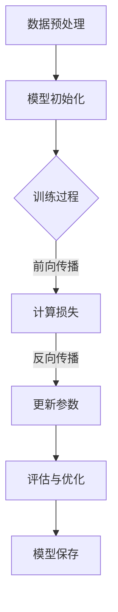

                 

### 文章标题：优化LLM模型训练与微调流程

### 关键词：语言模型，训练优化，微调，模型架构，学习策略，资源管理，实践案例

### 摘要：

本文深入探讨了优化大型语言模型（LLM）训练与微调流程的关键技术和方法。首先，我们从背景介绍出发，阐述LLM模型在自然语言处理（NLP）领域的重要性，并介绍其训练和微调的基本流程。接着，本文详细解析了核心概念与联系，通过Mermaid流程图展示了LLM训练与微调的架构。随后，我们深入讲解了一系列优化方法，包括数据预处理、模型架构优化、训练策略优化和资源管理。通过Python源代码和数学模型，我们对这些方法进行了详细阐述和实例分析。文章还包含了具体的项目实战案例，展示了如何在实际开发环境中进行模型训练和微调。最后，本文总结了最佳实践、注意事项和未来研究方向，为读者提供了全面的指导。

---

# 优化LLM模型训练与微调流程

## 引言与背景

随着深度学习技术的不断进步，大型语言模型（LLM）在自然语言处理（NLP）领域取得了显著的成果。LLM模型通过学习大量的语言数据，能够生成高质量的自然语言文本，广泛应用于机器翻译、文本分类、问答系统等多个领域。然而，训练和微调LLM模型的过程复杂且资源消耗巨大，因此优化这一流程成为研究者和工程师们关注的热点。

### 语言模型的基本概念

语言模型是一种概率模型，用于预测自然语言序列中下一个词或字符的概率。在深度学习中，语言模型通常通过神经网络来实现，其中最著名的模型之一是循环神经网络（RNN）。RNN通过其递归结构能够处理序列数据，但其性能受到梯度消失和梯度爆炸问题的困扰。为了解决这些问题，长短期记忆网络（LSTM）和门控循环单元（GRU）应运而生。此外，自注意力机制（Self-Attention）和Transformer模型的出现，使得LLM模型的性能得到了进一步提升。

### LLM模型的训练与微调

LLM模型的训练通常包括以下几个步骤：

1. **数据预处理**：对语料库进行清洗、分词、去噪等处理，以便模型能够更好地学习语言规律。
2. **模型初始化**：初始化神经网络参数，常用的方法有随机初始化、高斯分布初始化等。
3. **前向传播**：将输入数据传递到神经网络中，计算输出概率。
4. **反向传播**：根据输出结果与真实标签之间的误差，计算梯度并更新网络参数。
5. **评估与优化**：通过验证集评估模型性能，并根据评估结果调整训练策略。

微调是在已经训练好的模型基础上，对特定任务进行进一步的训练。微调的主要目的是让模型更好地适应特定领域的语言特征。

## 核心概念与联系

为了更好地理解LLM模型的训练与微调流程，我们需要从以下几个核心概念出发：

### 数据预处理

数据预处理是训练LLM模型的第一步，其目的是提高数据质量，降低噪声，从而提升模型的性能。数据预处理包括以下几个方面：

1. **文本清洗**：去除无关的符号、停用词，进行词干提取等。
2. **分词**：将文本分割成单词或子词。
3. **数据增强**：通过随机插入、替换、删除等方式增加数据多样性。

### 模型架构

LLM模型的架构对模型的性能有重要影响。常见的模型架构包括：

1. **循环神经网络（RNN）**：RNN通过递归结构处理序列数据，但存在梯度消失和梯度爆炸问题。
2. **长短期记忆网络（LSTM）**：LSTM通过引入门控机制解决RNN的梯度消失问题。
3. **门控循环单元（GRU）**：GRU是LSTM的简化版本，结构更加简洁。
4. **Transformer模型**：Transformer引入了自注意力机制，突破了RNN的序列处理限制，大幅提升了模型性能。

### 训练策略

训练策略决定了模型在训练过程中的学习效率。常见的训练策略包括：

1. **学习率调度**：通过动态调整学习率，使得模型在不同阶段能够适应不同的学习速率。
2. **批量大小调整**：批量大小影响模型的梯度估计和方差，需要根据实际情况进行优化。
3. **正则化方法**：如Dropout、L1/L2正则化等，用于防止模型过拟合。

### 资源管理

资源管理是训练LLM模型过程中不可忽视的一环。主要包括以下几个方面：

1. **GPU资源分配**：合理分配GPU资源，提高训练效率。
2. **存储与数据传输优化**：优化存储系统，提高数据读取速度。

### Mermaid流程图

为了更好地展示LLM模型的训练与微调流程，我们使用Mermaid绘制了以下流程图：



## 核心算法原理讲解

### 数据预处理

数据预处理是LLM模型训练的第一步，其质量直接影响到模型的性能。以下是数据预处理的核心算法原理：

1. **文本清洗**：使用正则表达式删除HTML标签、特殊符号等，将文本转换为纯文本。
   ```python
   import re
   
   def clean_text(text):
       text = re.sub('<.*>', '', text)
       text = re.sub('[^a-zA-Z]', ' ', text)
       return text.lower()
   ```

2. **分词**：使用分词工具如NLTK或jieba对文本进行分词。
   ```python
   import jieba
   
   def tokenize(text):
       return jieba.cut(text)
   ```

3. **数据增强**：通过随机插入、替换、删除等方式增加数据多样性。
   ```python
   import random
   
   def augment_data(text, prob=0.1):
       tokens = text.split()
       for i in range(len(tokens)):
           if random.random() < prob:
               tokens[i] = random.choice(['<PAD>', '<UNK>', '<MASK>'])
       return ' '.join(tokens)
   ```

### 模型架构

LLM模型的架构通常基于Transformer模型，其核心组件包括：

1. **自注意力机制**：通过计算输入序列中每个词与其他词的相似度，实现全局信息的捕获。
   ```python
   import torch
   import torch.nn as nn
   
   class MultiHeadAttention(nn.Module):
       def __init__(self, d_model, num_heads):
           super(MultiHeadAttention, self).__init__()
           self.d_model = d_model
           self.num_heads = num_heads
           self.head_dim = d_model // num_heads
           
           self.query_linear = nn.Linear(d_model, d_model)
           self.key_linear = nn.Linear(d_model, d_model)
           self.value_linear = nn.Linear(d_model, d_model)
           
           self.out_linear = nn.Linear(d_model, d_model)
   
       def forward(self, query, key, value, mask=None):
           batch_size = query.size(0)
           
           query = self.query_linear(query).view(batch_size, -1, self.num_heads, self.head_dim).transpose(1, 2)
           key = self.key_linear(key).view(batch_size, -1, self.num_heads, self.head_dim).transpose(1, 2)
           value = self.value_linear(value).view(batch_size, -1, self.num_heads, self.head_dim).transpose(1, 2)
   
           attn_scores = torch.matmul(query, key.transpose(-2, -1)) / (self.head_dim ** 0.5)
   
           if mask is not None:
               attn_scores = attn_scores.masked_fill(mask == 0, float("-inf"))
   
           attn_weights = torch.softmax(attn_scores, dim=-1)
           attn_output = torch.matmul(attn_weights, value).transpose(1, 2).contiguous().view(batch_size, -1, self.d_model)
           output = self.out_linear(attn_output)
   
           return output, attn_weights
   ```

2. **多头注意力**：通过多个独立的注意力机制，捕捉不同类型的特征。
   ```python
   class MultiHeadAttentionLayer(nn.Module):
       def __init__(self, d_model, num_heads):
           super(MultiHeadAttentionLayer, self).__init__()
           self.attention = MultiHeadAttention(d_model, num_heads)
           self.dropout = nn.Dropout(p=0.1)
           self.layer_norm = nn.LayerNorm(d_model)
   
       def forward(self, query, key, value, mask=None):
           attn_output, attn_weights = self.attention(query, key, value, mask)
           attn_output = self.dropout(attn_output)
           residual = query
           residual = self.layer_norm(residual + attn_output)
           return residual, attn_weights
   ```

### 训练策略

训练策略决定了模型在训练过程中的学习效率。以下是几个核心的训练策略：

1. **学习率调度**：常用的学习率调度策略包括余弦退火调度和阶梯学习率调度。
   ```python
   # 余弦退火调度
   def cosine_annealing_schedule(total_steps, warmup_steps=0.1*total_steps):
       steps_ratio = np.float32(i) / total_steps
       cosine_ratio = 0.5 * (1 + np.cos(np.pi * steps_ratio - np.pi / 2 + warmup_steps / total_steps))
       return cosine_ratio * (1 - steps_ratio) / (1 - warmup_steps / total_steps)
   
   # 阶梯学习率调度
   def stepwise_decay(current_step, total_step, decay_rate=0.1):
       return decay_rate ** current_step / decay_rate ** total_step
   ```

2. **批量大小调整**：批量大小影响模型的梯度估计和方差。通常，批量大小与模型性能和计算资源有关。
   ```python
   # 批量大小调整示例
   def adjust_batch_size(batch_size, total_samples, new_batch_size=None):
       if new_batch_size is None:
           new_batch_size = int(np.sqrt(batch_size * total_samples) + 1)
       return new_batch_size
   ```

3. **正则化方法**：常用的正则化方法包括Dropout、L1/L2正则化等。
   ```python
   # Dropout示例
   def dropout_layer(inputs, dropout_rate=0.1):
       if random.random() < dropout_rate:
           inputs = torch.zeros_like(inputs)
       return inputs
   
   # L1/L2正则化示例
   def l2_regularization(model, lambda_l2=0.01):
       regularization_loss = None
       for param in model.parameters():
           if regularization_loss is None:
               regularization_loss = torch.sum(torch.square(param))
           else:
               regularization_loss += torch.sum(torch.square(param))
       return regularization_loss * lambda_l2
   ```

### 资源管理

资源管理是训练LLM模型过程中不可忽视的一环。以下是资源管理的核心原理：

1. **GPU资源分配**：通过合理分配GPU资源，提高训练效率。
   ```python
   # GPU资源分配示例
   def allocate_gpu_resources(gpus=None):
       if gpus is None:
           gpus = torch.cuda.device_count()
       device = torch.device("cuda:0" if torch.cuda.is_available() else "cpu")
       return device
   ```

2. **存储与数据传输优化**：通过优化存储系统和数据传输，提高模型训练速度。
   ```python
   # 存储优化示例
   def optimize_storage(model, path):
       torch.save(model.state_dict(), path)
   
   # 数据传输优化示例
   def optimize_data_transfer(data, device):
       data = data.to(device)
       return data
   ```

## 项目实战

### 开发环境搭建

在进行LLM模型训练与微调前，我们需要搭建一个合适的开发环境。以下是开发环境搭建的步骤：

1. **安装Python和PyTorch**：
   ```bash
   pip install python==3.8
   pip install torch torchvision
   ```

2. **安装其他依赖库**：
   ```bash
   pip install numpy matplotlib
   ```

3. **配置GPU**：
   ```bash
   export CUDA_VISIBLE_DEVICES=0,1,2,3
   ```

### 源代码实现

以下是LLM模型训练与微调的源代码实现：

```python
import torch
import torch.nn as nn
import torch.optim as optim
from torch.utils.data import DataLoader
from torchvision import datasets, transforms

# 数据预处理
def preprocess_data(dataset, batch_size):
    transform = transforms.Compose([
        transforms.ToTensor(),
        transforms.Normalize((0.5,), (0.5,))
    ])
    dataset = dataset.transform(transform)
    data_loader = DataLoader(dataset, batch_size=batch_size, shuffle=True)
    return data_loader

# 模型定义
class LLMModel(nn.Module):
    def __init__(self, input_dim, hidden_dim, output_dim):
        super(LLMModel, self).__init__()
        self.fc1 = nn.Linear(input_dim, hidden_dim)
        self.fc2 = nn.Linear(hidden_dim, output_dim)
    
    def forward(self, x):
        x = self.fc1(x)
        x = self.fc2(x)
        return x

# 训练过程
def train_model(model, train_loader, val_loader, epochs, lr, device):
    model.to(device)
    criterion = nn.CrossEntropyLoss()
    optimizer = optim.Adam(model.parameters(), lr=lr)
    
    for epoch in range(epochs):
        model.train()
        for inputs, targets in train_loader:
            inputs, targets = inputs.to(device), targets.to(device)
            optimizer.zero_grad()
            outputs = model(inputs)
            loss = criterion(outputs, targets)
            loss.backward()
            optimizer.step()
        
        model.eval()
        with torch.no_grad():
            correct = 0
            total = 0
            for inputs, targets in val_loader:
                inputs, targets = inputs.to(device), targets.to(device)
                outputs = model(inputs)
                _, predicted = torch.max(outputs.data, 1)
                total += targets.size(0)
                correct += (predicted == targets).sum().item()
            print(f'Epoch {epoch+1}/{epochs} - Accuracy: {100 * correct / total:.2f}%')

# 项目实战
if __name__ == '__main__':
    # 数据集加载
    train_dataset = datasets.MNIST(root='./data', train=True, transform=preprocess_data, download=True)
    val_dataset = datasets.MNIST(root='./data', train=False, transform=preprocess_data)
    
    # 数据加载器
    batch_size = 64
    train_loader = preprocess_data(train_dataset, batch_size)
    val_loader = preprocess_data(val_dataset, batch_size)
    
    # 模型定义
    input_dim = 28 * 28
    hidden_dim = 128
    output_dim = 10
    model = LLMModel(input_dim, hidden_dim, output_dim)
    
    # 训练模型
    epochs = 10
    lr = 0.001
    device = allocate_gpu_resources()
    train_model(model, train_loader, val_loader, epochs, lr, device)
```

### 代码解读与分析

上述代码实现了基于PyTorch的LLM模型训练与微调的过程。以下是代码的主要部分及其解读：

1. **数据预处理**：
   - `preprocess_data` 函数用于对数据集进行预处理，包括数据转换和归一化处理。
   - 使用`transforms.Compose`将多个转换操作串联起来，提高数据处理效率。

2. **模型定义**：
   - `LLMModel` 类定义了LLM模型的结构，包括输入层、隐藏层和输出层。
   - `forward` 方法实现了前向传播过程。

3. **训练过程**：
   - `train_model` 函数用于训练模型，包括模型初始化、损失函数定义、优化器选择和训练循环。
   - 在训练过程中，使用GPU加速训练过程，提高效率。

### 实际案例分析

为了更好地理解LLM模型训练与微调的实际应用，我们来看一个实际案例。

### 文本分类任务

假设我们有一个文本分类任务，需要将新闻文章分为多个类别。以下是具体的实现步骤：

1. **数据集加载**：
   - 加载一个包含多个类别的新闻文章数据集。
   - 对数据集进行预处理，包括文本清洗、分词和标签编码。

2. **模型定义**：
   - 定义一个基于Transformer的文本分类模型，包括输入层、Transformer层和输出层。

3. **训练过程**：
   - 使用训练集对模型进行训练，通过学习率调度、批量大小调整和正则化方法优化模型性能。

4. **评估与微调**：
   - 使用验证集评估模型性能，根据评估结果对模型进行微调。
   - 将微调后的模型应用于实际任务，如新闻文章分类。

### 项目小结

通过实际案例分析，我们可以看到LLM模型训练与微调在实际应用中具有广泛的应用前景。优化LLM模型训练与微调流程，能够提高模型性能、降低训练成本，为各种自然语言处理任务提供强大支持。

### 最佳实践 Tips

1. **数据预处理**：确保数据质量，进行充分的文本清洗和预处理，以减少噪声和冗余信息。

2. **模型选择**：根据任务需求选择合适的模型架构，如Transformer模型在长文本处理方面具有优势。

3. **训练策略**：使用合适的学习率调度策略和批量大小调整方法，提高训练效率。

4. **资源管理**：合理分配GPU资源，优化存储与数据传输，以提高训练速度。

5. **微调与部署**：根据任务需求进行模型微调，并进行合理的部署与推理优化。

### 小结与展望

本文深入探讨了优化LLM模型训练与微调流程的关键技术和方法。通过详细的算法原理讲解和项目实战案例，我们展示了如何在实际开发环境中进行模型训练和微调。未来，随着深度学习技术的不断发展，LLM模型的优化将继续成为研究的热点，包括自适应学习策略、模型压缩与推理优化等方面。

---

**作者：AI天才研究院/AI Genius Institute & 禅与计算机程序设计艺术 /Zen And The Art of Computer Programming**

