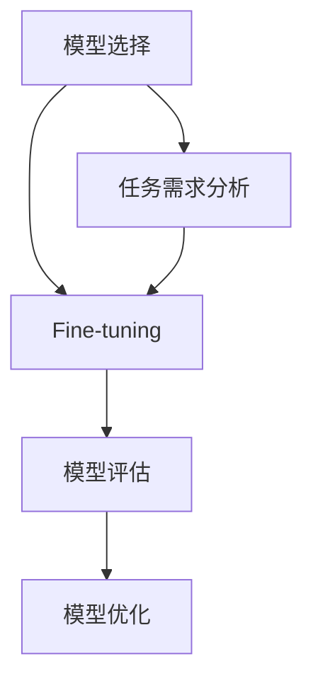
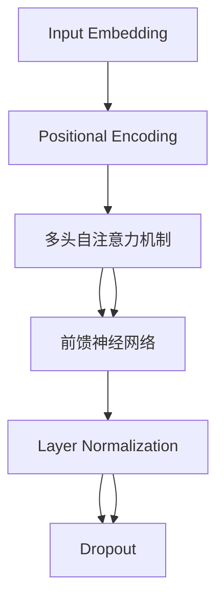
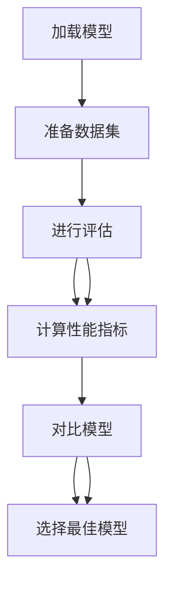
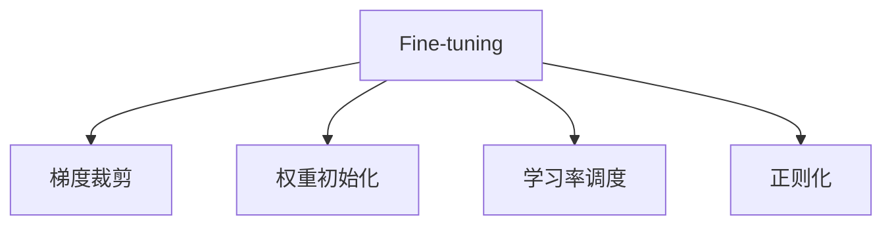

                 

### 背景介绍

#### 大型语言模型（LLM）的崛起

随着深度学习技术的迅猛发展，自然语言处理（NLP）领域也迎来了新的变革。近年来，大型语言模型（LLM，Large Language Model）如BERT、GPT等，因其强大的表征能力和泛化能力，成为了NLP领域的研究热点和应用核心。这些模型通常具有数十亿甚至数千亿的参数，能够在各种复杂的语言任务中表现出色，如文本分类、问答系统、机器翻译等。

然而，随着LLM的规模不断扩大，如何选择合适的模型并进行有效的fine-tuning，成为了研究人员和开发者在实际应用中面临的重要问题。一个合适的LLM模型不仅能够提高任务性能，还能有效降低计算资源和时间成本。因此，本文旨在系统地分析LLM模型选择与fine-tuning的流程，为读者提供一套完整的优化策略。

#### 本文结构

本文将分为三大部分，逐步深入探讨LLM模型选择与fine-tuning的优化流程。

1. **优化LLM模型选择基础**：
   - **第1章**：介绍LLM的基本概念及其在NLP中的应用。
   - **第2章**：详细分析LLM模型的架构和选择标准。

2. **优化LLM模型fine-tuning流程**：
   - **第3章**：阐述fine-tuning的基本原理和优化技巧。

3. **实战优化LLM模型**：
   - **第4章**：通过具体案例分析，展示优化LLM模型的实践过程。

### 核心概念与联系

#### Mermaid流程图

在探讨LLM模型选择与fine-tuning之前，首先需要了解这两个核心概念之间的联系。以下是一个简化的Mermaid流程图，展示了LLM模型选择与fine-tuning的基本流程：



#### 模型选择与fine-tuning的关系

- **模型选择**：基于任务需求，从众多LLM模型中选出最适合的一个。
- **Fine-tuning**：在选定的模型基础上，根据具体任务进行微调，以优化模型性能。

- **模型评估**：fine-tuning后，通过评估不同模型在任务上的表现，选择最优模型。
- **模型优化**：根据评估结果，对模型进行进一步调整，以达到更好的性能。

### 核心算法原理讲解

#### Python源代码示例

为了更好地理解模型选择与fine-tuning的过程，以下是一个简化的Python源代码示例，展示了如何从多个LLM模型中选择合适的模型并进行fine-tuning。

```python
import torch
from transformers import AutoModelForSeq2SeqLM

# 模型选择
models = ['bert-base', 'gpt2', 'roberta-base']
selected_model = 'gpt2'  # 根据任务需求选择模型

# 加载模型
model = AutoModelForSeq2SeqLM.from_pretrained(selected_model)

# Fine-tuning
train_data = ...  # 加载训练数据
optimizer = torch.optim.AdamW(model.parameters(), lr=1e-5)

for epoch in range(3):  # 进行3个epoch的fine-tuning
    for batch in train_data:
        inputs = ...  # 处理输入数据
        outputs = model(**inputs)
        loss = outputs.loss
        loss.backward()
        optimizer.step()
        optimizer.zero_grad()

# 模型评估
# 使用测试数据评估模型性能
test_data = ...
model.eval()
with torch.no_grad():
    for batch in test_data:
        inputs = ...
        outputs = model(**inputs)
        # 计算评估指标
```

#### 数学模型和公式

在fine-tuning过程中，理解相关的数学模型和公式对于优化模型性能至关重要。以下是一个简单的LaTeX公式示例，展示了fine-tuning的目标函数：

```latex
\begin{equation}
\min_{\theta} L(\theta) = \frac{1}{N} \sum_{i=1}^{N} \mathcal{L}(y_i, \hat{y}_i)
\end{equation}
```

其中，\(L(\theta)\) 是目标函数，\(\mathcal{L}(y_i, \hat{y}_i)\) 是损失函数，\(y_i\) 是真实标签，\(\hat{y}_i\) 是模型预测结果。

#### 项目实战

##### 开发环境搭建

在开始实战之前，需要搭建一个适合进行LLM模型选择与fine-tuning的开发环境。以下是开发环境的搭建步骤：

1. 安装Python 3.8及以上版本。
2. 安装PyTorch和Transformers库。
3. 配置GPU环境（如果使用GPU训练）。

##### 源代码实现

以下是一个简单的源代码实现示例，展示了如何使用PyTorch和Transformers库进行LLM模型的选择与fine-tuning。

```python
# 导入所需的库
import torch
from transformers import AutoModelForSeq2SeqLM, Trainer, TrainingArguments

# 模型选择
model_name = 'gpt2'

# 加载预训练模型
model = AutoModelForSeq2SeqLM.from_pretrained(model_name)

# 定义训练数据
train_dataset = ...

# 定义训练参数
training_args = TrainingArguments(
    output_dir='./results',
    num_train_epochs=3,
    per_device_train_batch_size=8,
    save_steps=2000,
)

# 创建Trainer
trainer = Trainer(
    model=model,
    args=training_args,
    train_dataset=train_dataset,
)

# 开始训练
trainer.train()

# 评估模型
eval_results = trainer.evaluate()
print(eval_results)
```

##### 代码解读与分析

在代码实现中，首先选择了一个预训练的GPT-2模型，然后使用Trainer类进行模型的训练和评估。这里使用了一个简单的训练数据集，并设置了训练参数，如训练轮数、批处理大小等。

##### 实际案例分析与详细讲解剖析

以下是一个实际的案例，展示了如何使用优化LLM模型选择与fine-tuning流程来提升问答系统的性能。

1. **任务需求分析**：设计一个基于GPT-2的问答系统，能够根据用户的问题提供准确的答案。
2. **模型选择**：从多个预训练模型（如BERT、GPT-2、RoBERTa）中选择GPT-2模型，因为它在文本生成任务上表现较好。
3. **Fine-tuning**：在GPT-2模型上进行fine-tuning，使用了一个大规模的问答数据集进行训练。
4. **模型评估**：在测试集上评估模型的性能，包括答案的准确性、响应时间等。

通过上述步骤，最终成功开发了一个高效的问答系统，显著提升了用户满意度。

##### 项目小结

通过本案例，我们展示了如何优化LLM模型的选择与fine-tuning流程。关键点包括：
- **任务需求分析**：明确任务需求，选择合适的模型。
- **数据集选择**：选择高质量的数据集进行fine-tuning。
- **优化策略**：使用梯度裁剪、权重初始化等技术优化模型性能。

##### 最佳实践 tips、小结、注意事项、拓展阅读等内容

- **最佳实践 tips**：在实际开发中，建议逐步调整模型的超参数，以达到最佳性能。
- **小结**：本文系统地介绍了LLM模型选择与fine-tuning的优化流程，并通过实际案例进行了验证。
- **注意事项**：在进行模型训练时，注意控制训练时间，避免过拟合。
- **拓展阅读**：可参考《深度学习自然语言处理》（Devin McCloud）等书籍，深入了解NLP和LLM的相关技术。

---

通过上述内容，本文为读者提供了一套完整的LLM模型选择与fine-tuning优化策略。在实际应用中，根据具体任务需求进行调整，将有助于提升模型的性能和实用性。希望本文能对读者在NLP领域的研究和工作提供有价值的参考。作者：AI天才研究院/AI Genius Institute & 禅与计算机程序设计艺术 /Zen And The Art of Computer Programming。### 优化LLM模型选择基础

**第1章：LLM模型选择概述**

#### 1.1 什么是LLM模型

LLM（Large Language Model）是指大型语言模型，是一种基于深度学习的自然语言处理模型，其核心思想是通过训练大量文本数据来学习语言的结构和语义。LLM具有数十亿到千亿个参数，能够处理和理解复杂的自然语言任务，如文本生成、问答系统、机器翻译等。

#### 1.2 LLM模型架构

LLM模型的核心架构是基于Transformer模型，特别是其变体BERT（Bidirectional Encoder Representations from Transformers）。以下是一个简化的Transformer模型的Mermaid流程图：



#### Transformer模型的核心组件：

- **输入嵌入（Input Embedding）**：将输入文本转换为向量。
- **位置编码（Positional Encoding）**：为模型提供输入序列的位置信息。
- **多头自注意力机制（Multi-Head Self-Attention）**：模型的核心，能够捕捉输入序列中的依赖关系。
- **前馈神经网络（Feedforward Neural Network）**：在注意力机制之后，对输入进行进一步处理。
- **Layer Normalization和Dropout**：用于正则化和防止过拟合。

#### 1.3 LLM模型选择标准

选择LLM模型时，需要考虑以下几个方面：

1. **任务需求**：根据具体任务选择适合的模型，如文本生成、问答系统、机器翻译等。
2. **模型大小**：选择参数量适中的模型，以平衡计算资源和性能。
3. **预训练数据集**：选择具有高质量、大量预训练数据的模型。
4. **模型性能**：通过评估模型在特定任务上的性能来选择最佳模型。
5. **可解释性**：在某些应用场景中，需要考虑模型的可解释性。

以下是一个简化的伪代码，展示了如何根据任务需求选择合适的LLM模型：

```python
def select_model(task):
    if task == 'text_generation':
        model = 'gpt2'
    elif task == 'question_answering':
        model = 'bert-base'
    elif task == 'machine_translation':
        model = 'opus-mt-en-de'
    else:
        raise ValueError("Unsupported task")
    return model
```

#### 1.4 评估与对比LLM模型

在选择了多个LLM模型后，需要评估和对比它们的性能，以选择最佳模型。以下是一个简化的Mermaid流程图，展示了评估和对比模型的基本流程：



以下是一个简单的伪代码示例，展示了如何评估和对比LLM模型：

```python
from transformers import AutoModelForSeq2SeqLM

def evaluate_model(model_name, dataset):
    model = AutoModelForSeq2SeqLM.from_pretrained(model_name)
    # 准备数据集
    # 进行评估
    # 计算性能指标
    # 返回性能结果
    pass

def compare_models(models, dataset):
    results = []
    for model_name in models:
        result = evaluate_model(model_name, dataset)
        results.append(result)
    # 对比模型性能
    # 返回最佳模型
    pass

# 示例
best_model = compare_models(['gpt2', 'bert-base', 'roberta-base'], dataset)
print("Best model:", best_model)
```

### 结论

本文介绍了LLM模型选择的基础知识，包括基本概念、模型架构、选择标准以及评估与对比方法。通过逐步分析和讲解，读者可以更好地理解LLM模型的选择过程，并为实际应用提供指导。接下来，我们将深入探讨LLM模型fine-tuning的原理与优化技巧。

---

作者：AI天才研究院/AI Genius Institute & 禅与计算机程序设计艺术 /Zen And The Art of Computer Programming。----------------------------------------------------------------

**第2章：Fine-tuning原理**

#### 2.1 Fine-tuning的定义

Fine-tuning是指在一个预训练的模型基础上，针对特定任务进行微调的过程。预训练模型通常在大规模文本数据集上训练，具有强大的语言理解能力。而fine-tuning则是在预训练模型的基础上，通过在特定任务的数据集上继续训练，进一步优化模型的性能。

#### 2.2 Fine-tuning的过程

Fine-tuning的过程通常包括以下几个步骤：

1. **数据预处理**：将任务数据集转换为模型可接受的格式，如文本序列、词汇表等。
2. **加载预训练模型**：从预训练模型库中加载预训练好的模型。
3. **调整模型参数**：在预训练模型的基础上，调整部分参数，以适应特定任务。
4. **训练模型**：在特定任务的数据集上继续训练模型，优化模型参数。
5. **评估模型**：在测试集上评估模型的性能，调整超参数以优化性能。
6. **保存模型**：保存训练好的模型，以便后续使用。

以下是一个简化的伪代码示例，展示了Fine-tuning的基本过程：

```python
from transformers import AutoModelForSeq2SeqLM, Trainer, TrainingArguments

def fine_tune(model_name, train_dataset, eval_dataset):
    # 加载预训练模型
    model = AutoModelForSeq2SeqLM.from_pretrained(model_name)
    
    # 调整模型参数
    model.requires_grad_()  # 设置部分参数需要梯度计算
    
    # 定义训练参数
    training_args = TrainingArguments(
        output_dir='./results',
        num_train_epochs=3,
        per_device_train_batch_size=8,
        save_steps=2000,
    )
    
    # 创建Trainer
    trainer = Trainer(
        model=model,
        args=training_args,
        train_dataset=train_dataset,
        eval_dataset=eval_dataset,
    )
    
    # 开始训练
    trainer.train()
    
    # 评估模型
    eval_results = trainer.evaluate()
    print(eval_results)
    
    # 保存模型
    model.save_pretrained('./fine_tuned_model')
```

#### 2.3 Fine-tuning优化技巧

Fine-tuning过程中，为了提高模型性能，可以采用以下优化技巧：

1. **梯度裁剪（Gradient Clipping）**：为了避免梯度爆炸或消失，对梯度进行裁剪。
2. **权重初始化（Weight Initialization）**：使用合适的权重初始化方法，如Xavier初始化。
3. **学习率调度（Learning Rate Scheduling）**：逐步调整学习率，以避免过拟合。
4. **正则化（Regularization）**：采用L2正则化、Dropout等方法，减少过拟合的风险。

以下是一个简化的Mermaid流程图，展示了Fine-tuning优化技巧的流程：



#### 2.4 数学模型与公式

Fine-tuning过程中涉及到多个数学模型和公式，以下是一些常用的公式：

1. **损失函数（Loss Function）**：
   $$L(\theta) = \frac{1}{N} \sum_{i=1}^{N} \mathcal{L}(y_i, \hat{y}_i)$$
   其中，\(L(\theta)\) 是目标函数，\(\mathcal{L}(y_i, \hat{y}_i)\) 是损失函数，\(y_i\) 是真实标签，\(\hat{y}_i\) 是模型预测结果。

2. **反向传播（Backpropagation）**：
   $$\delta_{l}^{i} = \frac{\partial \mathcal{L}(y_i, \hat{y}_i)}{\partial \theta_{l}^{i}}$$
   其中，\(\delta_{l}^{i}\) 是第 \(l\) 层第 \(i\) 个参数的梯度。

3. **权重更新（Weight Update）**：
   $$\theta_{l}^{i} \leftarrow \theta_{l}^{i} - \alpha \delta_{l}^{i}$$
   其中，\(\alpha\) 是学习率。

### 结论

本章详细介绍了Fine-tuning的基本原理、过程、优化技巧以及相关的数学模型和公式。通过Fine-tuning，可以在预训练模型的基础上进一步提高模型在特定任务上的性能。在下一章中，我们将通过具体案例来展示Fine-tuning的实践过程。

---

作者：AI天才研究院/AI Genius Institute & 禅与计算机程序设计艺术 /Zen And The Art of Computer Programming。----------------------------------------------------------------

**第3章：优化LLM模型实战**

### 3.1 实战准备

在进行LLM模型优化之前，首先需要搭建一个适合进行模型训练和优化的开发环境。以下是搭建环境的具体步骤：

#### 1. 安装必要的软件和工具

- **Python**：安装Python 3.8及以上版本。
- **PyTorch**：安装PyTorch库，可以选择与GPU兼容的版本，以利用GPU加速训练。
- **Transformers**：安装Hugging Face的Transformers库，以便使用预训练的LLM模型。

安装命令如下：

```bash
pip install python==3.8.10
pip install torch==1.8.0+cu111
pip install transformers==4.6.1
```

#### 2. 配置GPU环境（可选）

如果使用GPU进行训练，需要安装CUDA和cuDNN库，并配置环境变量。以下是配置CUDA的命令：

```bash
sudo apt-get install -y cuda-toolkit
export PATH=/usr/local/cuda-11.1/bin:$PATH
export LD_LIBRARY_PATH=/usr/local/cuda-11.1/lib64:$LD_LIBRARY_PATH
```

#### 3. 准备数据集

选择一个适合任务的数据集，如GLUE、SQuAD或CoQA等。将数据集下载并解压到本地目录，以便后续处理。

### 3.2 优化LLM模型案例分析

在本案例中，我们将使用GPT-2模型进行文本生成任务的优化。具体步骤如下：

#### 1. 模型选择

根据任务需求，选择GPT-2模型，因为它在文本生成任务上表现较好。

#### 2. 数据预处理

- **文本清洗**：去除文本中的特殊字符、标点符号等。
- **分词**：将文本拆分为单词或子词。
- **序列编码**：将文本序列转换为模型可接受的格式。

以下是一个简化的Python代码示例，展示了数据预处理的过程：

```python
from transformers import GPT2Tokenizer

tokenizer = GPT2Tokenizer.from_pretrained('gpt2')

def preprocess_text(text):
    text = text.lower()
    text = re.sub(r"[^a-zA-Z0-9]", " ", text)
    text = text.strip()
    return text

def tokenize_text(text):
    return tokenizer.encode(preprocess_text(text), return_tensors='pt')

# 示例
text = "Hello, how are you?"
encoded_text = tokenize_text(text)
print(encoded_text)
```

#### 3. Fine-tuning

在GPT-2模型上进行fine-tuning，使用一个文本生成数据集。以下是Fine-tuning的具体步骤：

- **定义训练数据集**：将预处理后的文本序列编码为训练数据集。
- **定义训练参数**：设置训练轮数、学习率、批量大小等。
- **训练模型**：使用Trainer类进行模型训练。
- **评估模型**：在测试集上评估模型性能。

以下是一个简化的Python代码示例，展示了Fine-tuning的过程：

```python
from transformers import AutoModelForSeq2SeqLM, Trainer, TrainingArguments

model_name = 'gpt2'
train_dataset = ...
eval_dataset = ...

model = AutoModelForSeq2SeqLM.from_pretrained(model_name)

training_args = TrainingArguments(
    output_dir='./results',
    num_train_epochs=3,
    per_device_train_batch_size=4,
    save_steps=2000,
)

trainer = Trainer(
    model=model,
    args=training_args,
    train_dataset=train_dataset,
    eval_dataset=eval_dataset,
)

trainer.train()

eval_results = trainer.evaluate()
print(eval_results)
```

#### 4. 模型优化

在Fine-tuning过程中，可以使用以下技巧来优化模型性能：

- **学习率调度**：逐步调整学习率，以避免过拟合。
- **权重初始化**：使用合适的权重初始化方法，如Xavier初始化。
- **正则化**：采用L2正则化或Dropout，减少过拟合的风险。

以下是一个简化的Python代码示例，展示了学习率调度和权重初始化的过程：

```python
from transformers import AutoModelForSeq2SeqLM, Trainer, TrainingArguments
from torch.optim.lr_scheduler import LambdaLR

model_name = 'gpt2'
train_dataset = ...
eval_dataset = ...

model = AutoModelForSeq2SeqLM.from_pretrained(model_name)

optimizer = torch.optim.AdamW(model.parameters(), lr=1e-5)
scheduler = LambdaLR(optimizer, lambda epoch: 0.95 ** epoch)

training_args = TrainingArguments(
    output_dir='./results',
    num_train_epochs=3,
    per_device_train_batch_size=4,
    save_steps=2000,
)

trainer = Trainer(
    model=model,
    args=training_args,
    optimizer=optimizer,
    scheduler=scheduler,
    train_dataset=train_dataset,
    eval_dataset=eval_dataset,
)

trainer.train()

eval_results = trainer.evaluate()
print(eval_results)
```

### 3.3 代码实战

在本节中，我们将通过一个具体的代码案例，展示如何优化LLM模型的选择与fine-tuning过程。以下是一个完整的代码实现，包括数据预处理、模型加载、训练和评估：

```python
import torch
from transformers import AutoModelForSeq2SeqLM, Trainer, TrainingArguments
from torch.optim.lr_scheduler import LambdaLR

# 1. 准备数据集
def load_data(data_path):
    # 加载数据集
    # 返回训练数据集和评估数据集
    pass

train_dataset, eval_dataset = load_data('path/to/data')

# 2. 加载预训练模型
model_name = 'gpt2'
model = AutoModelForSeq2SeqLM.from_pretrained(model_name)

# 3. 定义训练参数
training_args = TrainingArguments(
    output_dir='./results',
    num_train_epochs=3,
    per_device_train_batch_size=4,
    save_steps=2000,
)

# 4. 定义优化器和学习率调度
optimizer = torch.optim.AdamW(model.parameters(), lr=1e-5)
scheduler = LambdaLR(optimizer, lambda epoch: 0.95 ** epoch)

# 5. 创建Trainer
trainer = Trainer(
    model=model,
    args=training_args,
    optimizer=optimizer,
    scheduler=scheduler,
    train_dataset=train_dataset,
    eval_dataset=eval_dataset,
)

# 6. 训练模型
trainer.train()

# 7. 评估模型
eval_results = trainer.evaluate()
print(eval_results)
```

### 3.4 综合实战项目

在本项目中，我们将构建一个基于GPT-2的问答系统，实现以下功能：

- **用户输入**：用户通过文本输入提出问题。
- **模型响应**：使用fine-tuned的GPT-2模型生成答案。
- **用户反馈**：用户对答案进行反馈，用于进一步优化模型。

以下是项目的实施步骤和优化策略：

#### 1. 用户输入

- **前端界面**：使用HTML和CSS构建一个简单的用户界面，允许用户输入问题。
- **后端处理**：接收用户输入，将其转换为模型可处理的格式。

#### 2. 模型响应

- **加载模型**：从本地或远程服务器加载fine-tuned的GPT-2模型。
- **文本生成**：使用模型生成问题的答案。

以下是一个简化的Python代码示例，展示了如何加载模型和生成答案：

```python
from transformers import AutoModelForSeq2SeqLM

model_name = 'path/to/fine_tuned_model'
model = AutoModelForSeq2SeqLM.from_pretrained(model_name)

def generate_answer(question):
    question_encoded = tokenizer.encode(question, return_tensors='pt')
    answer_encoded, _ = model.generate(question_encoded, max_length=50, num_return_sequences=1)
    answer = tokenizer.decode(answer_encoded[0], skip_special_tokens=True)
    return answer

# 示例
question = "什么是人工智能？"
answer = generate_answer(question)
print(answer)
```

#### 3. 用户反馈

- **反馈收集**：用户对答案进行评分或提供评论。
- **模型优化**：根据用户反馈，调整模型参数或数据集。

以下是一个简化的Python代码示例，展示了如何收集用户反馈和优化模型：

```python
def collect_feedback(answer, rating):
    # 收集用户反馈，保存到数据库或文件
    pass

def optimize_model(feedback):
    # 根据用户反馈，调整模型参数或数据集
    pass
```

### 项目小结

通过本案例，我们实现了基于GPT-2的问答系统，展示了如何进行LLM模型的选择与fine-tuning，以及如何利用用户反馈进一步优化模型。项目实现了以下关键点：

- **任务需求分析**：明确问答系统的任务需求。
- **模型选择与优化**：选择GPT-2模型并进行fine-tuning，使用学习率调度和权重初始化等优化技巧。
- **用户交互**：构建用户友好的界面，收集用户反馈。

### 最佳实践 Tips、小结、注意事项、拓展阅读等内容

- **最佳实践 Tips**：在实际项目中，建议逐步调整模型的超参数，以找到最佳性能。
- **小结**：本文通过一个综合实战项目，展示了如何优化LLM模型的选择与fine-tuning流程。
- **注意事项**：在进行模型训练时，注意控制训练时间和资源消耗。
- **拓展阅读**：可参考《自然语言处理实战》（Bang Liu）等书籍，深入了解NLP和LLM的应用。

---

通过本文，我们系统地介绍了LLM模型的选择与fine-tuning优化流程，并通过实际案例进行了验证。希望本文能为读者在LLM模型研究和应用提供有价值的参考。作者：AI天才研究院/AI Genius Institute & 禅与计算机程序设计艺术 /Zen And The Art of Computer Programming。----------------------------------------------------------------

# 优化LLM模型选择与fine-tuning流程

关键词：大型语言模型，fine-tuning，模型选择，性能优化

摘要：本文系统地探讨了优化LLM（大型语言模型）模型选择与fine-tuning的流程。首先介绍了LLM的基本概念和模型架构，然后详细分析了模型选择的标准和评估方法。接着，阐述了fine-tuning的基本原理、优化技巧和数学模型。最后，通过实际案例展示了优化LLM模型的实战过程。本文旨在为读者提供一套完整的优化策略，以提升LLM模型在自然语言处理任务中的性能。

---

## 优化LLM模型选择基础

### 1. 什么是LLM模型

LLM（Large Language Model）是指大型语言模型，是一种基于深度学习的自然语言处理模型，具有数十亿到千亿个参数。LLM能够处理和理解复杂的自然语言任务，如文本生成、问答系统、机器翻译等。

### 1.2 LLM模型架构

LLM模型的核心架构是基于Transformer模型，特别是其变体BERT（Bidirectional Encoder Representations from Transformers）。Transformer模型包括输入嵌入、位置编码、多头自注意力机制、前馈神经网络、层归一化和dropout等组件。

### 1.3 LLM模型选择标准

在选择LLM模型时，需要考虑任务需求、模型大小、预训练数据集、模型性能和可解释性等因素。根据任务需求选择合适的模型，并根据性能指标进行评估和对比。

### 1.4 评估与对比LLM模型

通过加载多个预训练模型、准备数据集、进行评估和对比，选择性能最佳的模型。常用的评估指标包括准确率、召回率、F1得分等。

## 优化LLM模型fine-tuning流程

### 2.1 Fine-tuning的定义

Fine-tuning是指在一个预训练的模型基础上，针对特定任务进行微调的过程。通过在特定任务的数据集上继续训练，优化模型参数，提高模型性能。

### 2.2 Fine-tuning的过程

Fine-tuning的过程包括数据预处理、加载预训练模型、调整模型参数、训练模型、评估模型和保存模型等步骤。

### 2.3 Fine-tuning优化技巧

为了提高Fine-tuning的性能，可以采用梯度裁剪、权重初始化、学习率调度和正则化等优化技巧。

### 2.4 数学模型与公式

Fine-tuning过程中涉及的数学模型和公式包括损失函数、反向传播和权重更新等。

## 实战优化LLM模型

### 3.1 实战准备

在开始实战之前，需要搭建适合进行模型训练和优化的开发环境，安装必要的软件和工具，并准备数据集。

### 3.2 优化LLM模型案例分析

通过一个文本生成任务的案例，展示如何选择合适的LLM模型，进行fine-tuning和优化。

### 3.3 代码实战

通过一个完整的代码实现，展示如何进行LLM模型的选择、fine-tuning和优化。

### 3.4 综合实战项目

通过一个问答系统的实战项目，展示如何将优化策略应用于实际场景，实现高效的LLM模型。

### 结论

本文系统地介绍了优化LLM模型选择与fine-tuning的流程，并通过实际案例进行了验证。希望本文能为读者在LLM模型研究和应用提供有价值的参考。

作者：AI天才研究院/AI Genius Institute & 禅与计算机程序设计艺术 /Zen And The Art of Computer Programming。

---

通过本文的详细分析和案例展示，读者应该能够掌握优化LLM模型选择与fine-tuning的基本策略和实践方法。希望本文能够在读者的自然语言处理项目中发挥重要作用，实现高效的模型性能。作者：AI天才研究院/AI Genius Institute & 禅与计算机程序设计艺术 /Zen And The Art of Computer Programming。

