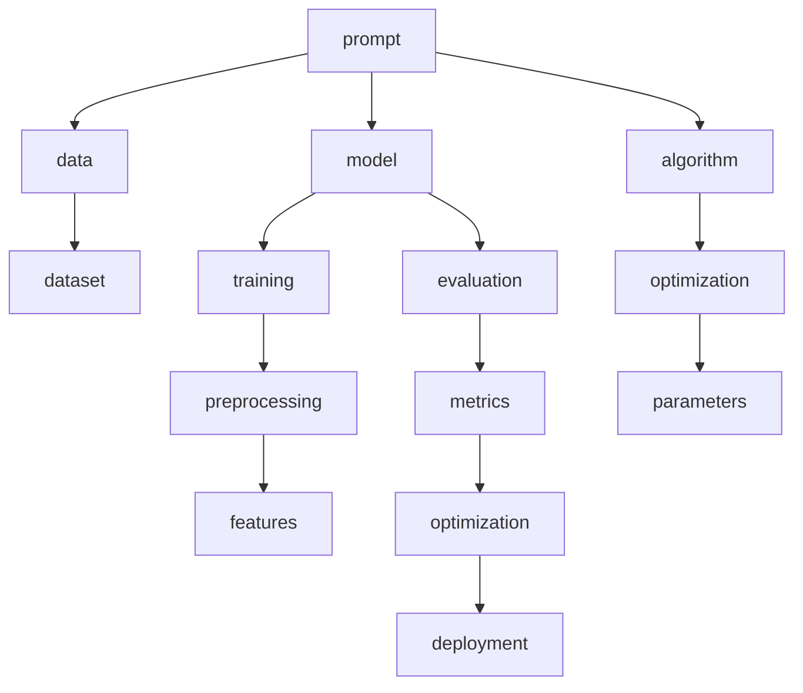

                 

## 第1部分：引入与概述

### 1.1 优化prompt工程的重要性

在人工智能（AI）领域，prompt工程是一个至关重要的环节。它涉及如何构建、优化和调整提示（prompt），以提升机器学习模型的表现和效果。优化prompt工程的重要性不言而喻，因为良好的prompt设计能够显著改善模型对任务的适应性和性能。

首先，优化prompt工程能够提高模型的准确性和鲁棒性。当模型接收到的输入prompt更加精确和丰富时，其能够更好地理解任务要求，减少错误和混淆的可能性。此外，优化prompt还能够加速模型训练过程，减少计算资源的使用，从而降低成本。

其次，优化prompt工程有助于提升模型的泛化能力。通过设计多样化的prompt，模型可以学习到更广泛的模式和信息，从而在未知或新任务上表现出更好的泛化能力。这对于实际应用场景中的模型部署和持续优化至关重要。

最后，优化prompt工程还能够促进跨领域的应用。不同领域的任务和问题可能具有相似的解决方案，通过优化prompt工程，我们可以将已有的模型和技术应用于新的领域，加速创新和进步。

总之，优化prompt工程是提升人工智能模型性能和效果的关键一步。在接下来的章节中，我们将深入探讨prompt工程的基本概念、发展历程、应用领域，并详细分析其核心概念、算法原理、数学模型及其挑战和解决方案。

### 1.2 prompt工程的基本概念

prompt工程，顾名思义，就是围绕提示（prompt）的设计、优化和应用的一系列工程实践。在机器学习和人工智能领域，prompt通常指的是模型训练和预测过程中输入的信息或数据。这些提示可以是文本、图像、声音或其他形式的数据，其目的是帮助模型更好地理解和执行特定的任务。

#### 定义

prompt的定义相对宽泛，但通常可以概括为以下几点：

- **文本类prompt**：如自然语言处理（NLP）中的问题、语境、句子或段落。
- **图像类prompt**：如计算机视觉任务中的图像、边缘框、语义分割图等。
- **声音类prompt**：如语音识别中的音频波形、标注文本等。

#### 类型

根据用途和形式，prompt可以分为以下几种类型：

- **单一型prompt**：这种类型的prompt通常包含一个独立的信息单元，如单个句子或图像。
- **复合型prompt**：这种类型的prompt由多个信息单元组成，可以组合成更复杂的输入，如多个句子或图像的组合。

#### 工作流程

prompt工程的基本工作流程包括以下几个步骤：

1. **数据采集与预处理**：根据任务需求，收集并预处理相关的数据，如文本清洗、图像增强等。
2. **prompt设计**：设计适合任务需求的prompt，包括内容、格式和结构。
3. **模型训练**：使用设计的prompt对模型进行训练，调整模型参数以优化性能。
4. **模型评估**：使用测试集评估模型的性能，通过调整prompt进一步优化模型。
5. **模型部署**：将优化后的模型部署到实际应用场景中，使用动态生成的prompt进行实时预测或任务执行。

通过上述步骤，我们可以构建和优化出适合特定任务需求的prompt，从而提升模型的性能和效果。在接下来的章节中，我们将进一步探讨prompt工程的发展历程，分析其在不同应用领域的重要性和具体应用场景。

### 1.3 prompt工程的发展历程

prompt工程作为人工智能领域的一个重要分支，其发展历程可以追溯到机器学习技术的兴起。随着计算能力的提升和数据量的爆发式增长，prompt工程逐渐从理论研究走向实际应用，并取得了显著进展。

#### 早期prompt工程

早期prompt工程主要集中在规则系统和基于特征的模型。在这个阶段，研究者主要关注如何通过设计特定的规则和特征来引导模型完成任务。例如，在自然语言处理（NLP）领域，早期的研究者通过手工设计的语法规则和语义特征来指导文本分类和语义分析。这种方法的优点在于其可控性和解释性，但缺点是规则和特征的设计过程繁琐，且难以适应复杂和动态的任务环境。

#### 现代prompt工程

随着深度学习技术的成熟，prompt工程进入了现代发展阶段。现代prompt工程的核心在于如何通过设计高效的输入提示来提升模型性能。深度学习模型，尤其是基于变换器（Transformer）架构的模型，在处理大规模数据和复杂任务方面展现了卓越的能力。研究者开始探索如何通过优化prompt的结构和内容，进一步提升模型的表现。

1. **多模态prompt**：现代prompt工程的一个重要进展是引入多模态输入。通过结合文本、图像、声音等多种类型的数据，模型能够更全面地理解和处理复杂任务。例如，在图像描述生成任务中，研究者通过设计包含图像和文本的复合型prompt，显著提升了描述的准确性和丰富度。

2. **动态prompt**：动态prompt是指根据任务需求实时生成的提示。动态prompt能够更好地适应不同的任务场景，提高模型的灵活性和泛化能力。例如，在问答系统中，通过动态生成与问题相关的内容和上下文，模型能够提供更准确和具体的答案。

3. **多样化prompt**：通过设计多样化的prompt，模型能够学习到更广泛的模式和信息，从而提升泛化能力。研究者通过引入随机性、多样性机制，构建包含不同类型和格式的prompt，从而增强模型的学习能力。

#### 未来的发展趋势

未来，prompt工程将继续朝着智能化、自动化的方向演进。以下是一些可能的发展趋势：

1. **自动prompt设计**：利用强化学习和自动机器学习（AutoML）技术，自动设计最有效的prompt。这种方法可以大幅减少人为干预，提高设计效率和模型性能。

2. **知识增强prompt**：通过集成外部知识库和语义信息，设计知识增强的prompt。这种方法能够提升模型对复杂任务的推理和决策能力。

3. **跨模态交互**：进一步探索不同模态数据之间的交互机制，设计更高效、自然的跨模态prompt。这有望在多模态任务中实现更高的性能和精度。

总之，prompt工程的发展历程体现了人工智能领域从规则驱动到数据驱动、从手工设计到自动优化的转变。随着技术的不断进步，prompt工程将继续在提升人工智能模型性能和效果方面发挥重要作用。在接下来的章节中，我们将深入探讨prompt工程在不同应用领域的重要性和具体应用场景。

### 1.4 prompt工程的应用领域

prompt工程在人工智能领域有着广泛的应用，涉及多个重要的领域。以下将简要介绍prompt工程在自然语言处理（NLP）、计算机视觉（CV）和强化学习（RL）等领域的应用。

#### 自然语言处理（NLP）

在自然语言处理领域，prompt工程的重要性尤为突出。NLP任务通常涉及文本的理解、生成和分类。良好的prompt设计能够显著提升模型在这些任务上的表现。

1. **文本分类**：在文本分类任务中，prompt可以是分类标签或者相关的上下文信息。通过设计包含丰富上下文的prompt，模型能够更好地捕捉文本中的语义信息，提高分类的准确性。

2. **文本生成**：例如，在对话生成和文章摘要生成任务中，prompt可以是一段文字的起始句子或者关键信息。通过优化prompt的结构和内容，模型能够生成更连贯、准确的文本。

3. **机器翻译**：prompt在机器翻译中也发挥着重要作用。通过设计包含源语言和目标语言信息的prompt，模型能够更好地理解和翻译复杂句子。

#### 计算机视觉（CV）

在计算机视觉领域，prompt工程主要用于图像识别、目标检测和图像生成等任务。有效的prompt设计能够提升模型在这些任务上的识别和生成能力。

1. **图像识别**：prompt可以包括图像的标签、描述或者相关的上下文信息。通过优化这些prompt，模型能够更准确地识别图像中的对象和场景。

2. **目标检测**：在目标检测任务中，prompt可以是目标的位置、大小和类别信息。通过设计精准的prompt，模型能够更好地定位和识别图像中的目标。

3. **图像生成**：prompt在图像生成任务中也至关重要。例如，在生成对抗网络（GAN）中，通过设计包含特定风格或者内容的prompt，模型能够生成更符合要求的图像。

#### 强化学习（RL）

在强化学习领域，prompt工程同样发挥着重要作用。prompt可以用于指导智能体在复杂环境中进行决策和学习。

1. **策略学习**：在策略学习任务中，prompt可以是状态、动作或者奖励的描述。通过优化prompt的设计，模型能够更好地学习到最优的策略。

2. **交互式学习**：在交互式学习任务中，prompt可以包括用户的反馈、评价或者偏好信息。通过设计合适的prompt，模型能够更有效地与用户互动，学习到更符合用户需求的行为。

总之，prompt工程在自然语言处理、计算机视觉和强化学习等领域的应用极大地提升了模型的表现和效果。通过不断优化prompt的设计，我们可以推动人工智能技术在实际应用中的进一步发展。在接下来的章节中，我们将深入探讨prompt工程的核心概念、算法原理和数学模型。

## 第2部分：基础理论

在深入探讨优化prompt工程的实用技巧之前，我们需要首先了解其基础理论。本部分将详细介绍prompt工程的核心概念与联系，包括prompt的定义与类型、基本组件以及工作流程。同时，我们将探讨核心算法原理，包括优化算法的选择和常用算法的原理与伪代码。此外，我们还将讲解数学模型与数学公式，以及模型训练和优化的数学原理。最后，我们将讨论prompt工程中的挑战与解决方案。

### 2.1 prompt工程的核心概念与联系

prompt工程涉及多个核心概念，这些概念相互关联，共同构成了prompt工程的理论基础。

#### 2.1.1 prompt的定义与类型

**定义**：prompt是指在机器学习模型训练和预测过程中输入的信息或数据。它可以是文本、图像、声音或其他形式的数据。prompt的主要作用是帮助模型更好地理解和执行特定任务。

**类型**：根据用途和形式，prompt可以分为以下几种类型：

1. **文本类prompt**：如自然语言处理（NLP）中的问题、语境、句子或段落。
2. **图像类prompt**：如计算机视觉任务中的图像、边缘框、语义分割图等。
3. **声音类prompt**：如语音识别中的音频波形、标注文本等。

不同类型的prompt在具体应用场景中具有不同的作用。例如，在NLP任务中，文本类prompt可以帮助模型理解输入文本的语义和上下文信息；在CV任务中，图像类prompt可以帮助模型识别图像中的对象和场景；在语音识别任务中，声音类prompt可以帮助模型分析音频波形并提取特征。

#### 2.1.2 prompt工程的基本组件

prompt工程的基本组件包括数据集、模型和算法。这些组件相互协作，共同实现prompt工程的目标。

1. **数据集**：数据集是prompt工程的基础，包含了用于训练和评估模型的数据。数据集的质量直接影响模型的性能和效果。在数据集构建过程中，需要进行数据采集、清洗、标注和增强等步骤。
   
2. **模型**：模型是prompt工程的核心，用于接收和解析prompt，并生成预测结果。不同的任务需要选择合适的模型架构，如深度神经网络、变换器（Transformer）模型、生成对抗网络（GAN）等。

3. **算法**：算法是prompt工程的关键组成部分，用于指导模型训练和优化。常见的算法包括梯度下降算法、随机梯度下降算法、Adam优化器等。这些算法通过调整模型参数，优化模型性能。

#### 2.1.3 prompt工程的工作流程

prompt工程的工作流程可以分为以下步骤：

1. **数据预处理**：在训练模型之前，需要对数据进行预处理，包括数据清洗、数据增强和特征提取等。预处理步骤的目的是提高数据质量和丰富性，为后续训练和优化提供更好的数据基础。

2. **模型训练**：使用预处理后的数据集，对模型进行训练。训练过程包括前向传播、反向传播和参数更新等步骤。通过不断调整模型参数，使模型在训练数据上达到较好的性能。

3. **模型评估**：使用测试集对训练好的模型进行评估，判断模型的泛化能力和性能。评估指标包括准确率、召回率、F1分数等。通过评估结果，可以进一步调整模型参数和优化策略。

4. **模型优化**：根据评估结果，对模型进行优化。优化过程包括调整模型结构、算法参数和超参数等。优化的目标是提高模型在测试集上的性能，并保持较好的泛化能力。

5. **模型部署**：将优化后的模型部署到实际应用场景中，使用动态生成的prompt进行实时预测或任务执行。部署过程需要考虑模型的可扩展性、稳定性和安全性等因素。

通过上述步骤，我们可以构建和优化出适合特定任务需求的prompt，从而提升模型的性能和效果。在接下来的章节中，我们将进一步探讨优化prompt工程的核心算法原理和数学模型。

#### 2.1.4 prompt工程的核心概念之间关系架构图

为了更好地理解prompt工程的核心概念之间关系，我们可以使用Mermaid流程图来展示这些概念的联系。以下是prompt工程核心概念的关系架构图：



在这个架构图中，prompt是核心概念，与数据集、模型和算法紧密相连。数据集通过预处理步骤生成特征，模型通过训练和评估过程优化参数，算法则指导模型优化过程。最终，通过模型部署，将优化后的模型应用到实际应用场景中。

通过理解这些核心概念之间的联系，我们可以更好地设计、优化和实现prompt工程，提升机器学习模型的性能和效果。

### 2.2 核心算法原理讲解

在prompt工程中，算法的选择和优化至关重要。核心算法原理包括优化算法的选择、常用优化算法的原理与伪代码。以下将详细介绍这些核心算法原理。

#### 2.2.1 优化算法的选择

优化算法在机器学习模型训练过程中起着至关重要的作用。选择合适的优化算法可以显著提高模型训练效率、减少训练时间并改善模型性能。以下是几种常见的优化算法及其选择依据：

1. **梯度下降算法**：梯度下降是一种最基础的优化算法，其核心思想是通过计算模型参数的梯度来更新参数，以最小化损失函数。梯度下降算法适用于目标函数比较简单且可微的情况。优点是简单易懂，缺点是收敛速度较慢，对参数选择敏感。

2. **随机梯度下降（SGD）算法**：SGD是梯度下降算法的一种变体，其核心思想是随机选择一部分样本计算梯度并更新参数。SGD在处理大规模数据集时表现优秀，可以显著减少计算资源需求。缺点是对参数敏感，可能陷入局部最小值。

3. **Adam优化器**：Adam优化器是一种结合了SGD和动量法的优化算法，其核心思想是使用指数加权平均来更新参数。Adam优化器在处理高维数据集和具有非平稳梯度的目标函数时表现优秀，适用于大多数深度学习任务。优点是收敛速度快，对参数选择不敏感，缺点是计算复杂度较高。

4. **AdaGrad算法**：AdaGrad是一种基于梯度平方和的优化算法，其核心思想是根据参数的历史梯度平方来动态调整学习率。AdaGrad算法适用于目标函数具有不同尺度的参数，可以有效避免某些参数学习率过小或过大的问题。优点是自适应调整学习率，缺点是可能导致某些参数的学习率过小。

5. **RMSprop算法**：RMSprop是AdaGrad的一种改进算法，其核心思想是使用梯度平方的平均值来动态调整学习率。RMSprop在处理高维数据集时表现较好，可以有效地加速模型收敛。优点是收敛速度快，缺点是计算复杂度较高。

在选择优化算法时，需要考虑以下因素：

- **目标函数的性质**：目标函数的平滑度、可微性、非线性程度等会影响优化算法的选择。
- **数据集的大小**：数据集的大小直接影响计算资源的消耗。对于大规模数据集，选择计算效率高的算法尤为重要。
- **模型的复杂性**：模型的层数、参数数量等会影响优化算法的选择。对于复杂的模型，可能需要选择收敛速度较快的算法。

#### 2.2.2 常用优化算法的原理与伪代码

下面我们将详细介绍几种常用优化算法的原理与伪代码。

1. **梯度下降算法**

**原理**：梯度下降算法通过计算模型参数的梯度来更新参数，以最小化损失函数。梯度是指损失函数对参数的偏导数，反映了损失函数在不同参数方向上的变化趋势。梯度下降算法的核心思想是沿着梯度的反方向更新参数，使损失函数逐渐减小。

**伪代码**：

```
初始化：w = w0
迭代次数：T
学习率：α

for t in 1 to T do
    计算梯度：g = ∇f(w)
    更新参数：w = w - α * g
end for
```

2. **随机梯度下降（SGD）算法**

**原理**：SGD是梯度下降算法的一种变体，其核心思想是随机选择一部分样本计算梯度并更新参数。SGD通过随机抽样样本，使得模型在不同参数方向上多次更新，有助于跳出局部最小值，提高模型的泛化能力。

**伪代码**：

```
初始化：w = w0
迭代次数：T
学习率：α
批量大小：b

for t in 1 to T do
    随机选择batch：x_batch, y_batch = random_sample(b)
    计算梯度：g = ∇f(w; x_batch, y_batch)
    更新参数：w = w - α * g
end for
```

3. **Adam优化器**

**原理**：Adam优化器结合了SGD和动量法，其核心思想是使用指数加权平均来更新参数。Adam优化器通过计算一阶矩估计（均值）和二阶矩估计（方差），动态调整学习率。这种自适应调整学习率的方法可以使得模型在处理不同尺度的参数时表现更佳。

**伪代码**：

```
初始化：m = 0, v = 0
迭代次数：T
学习率：α
一阶矩估计系数：β1
二阶矩估计系数：β2
偏差修正系数：ε

for t in 1 to T do
    计算一阶矩：m = β1 * m + (1 - β1) * ∇f(w; x_t, y_t)
    计算二阶矩：v = β2 * v + (1 - β2) * (∇f(w; x_t, y_t))^2
    偏差修正：m_hat = m / (1 - β1^t), v_hat = v / (1 - β2^t)
    更新参数：w = w - α * m_hat / (sqrt(v_hat) + ε)
end for
```

4. **AdaGrad算法**

**原理**：AdaGrad是一种基于梯度平方和的优化算法，其核心思想是根据参数的历史梯度平方来动态调整学习率。AdaGrad通过计算每个参数的历史梯度平方和，动态调整其学习率，避免某些参数的学习率过小或过大。

**伪代码**：

```
初始化：γ = 0
迭代次数：T
学习率：α

for t in 1 to T do
    计算梯度：g = ∇f(w; x_t, y_t)
    更新γ：γ = γ + g^2
    更新参数：w = w - α * g / sqrt(γ)
end for
```

5. **RMSprop算法**

**原理**：RMSprop是AdaGrad的一种改进算法，其核心思想是使用梯度平方的平均值来动态调整学习率。RMSprop通过计算梯度平方的平均值，使得学习率在处理不同尺度的参数时表现更佳。

**伪代码**：

```
初始化：γ = 0
迭代次数：T
学习率：α
衰减率：ρ

for t in 1 to T do
    计算梯度：g = ∇f(w; x_t, y_t)
    更新γ：γ = ρ * γ + (1 - ρ) * g^2
    更新参数：w = w - α * g / sqrt(γ)
end for
```

通过上述介绍，我们可以更好地理解常用优化算法的原理及其适用场景。在优化prompt工程中，选择合适的优化算法对于提升模型性能和效果至关重要。在接下来的章节中，我们将进一步探讨数学模型与数学公式，以及模型训练和优化的数学原理。

#### 2.3 数学模型与数学公式讲解

在prompt工程中，数学模型和数学公式起到了核心作用。这些数学工具不仅帮助我们理解模型的运作原理，还能够指导我们进行有效的模型训练和优化。本节将详细讲解数学模型的基本形式、模型训练的数学原理以及模型优化的数学方法。

##### 2.3.1 数学模型的基本形式

数学模型在机器学习中通常表现为函数关系，它将输入数据映射到输出结果。一个典型的数学模型可以表示为：

\[ f(x; \theta) = y \]

其中：
- \( f \) 是模型函数，表示输入数据 \( x \) 经模型参数 \( \theta \) 处理后的输出。
- \( x \) 是输入数据。
- \( \theta \) 是模型参数，用于调节模型的行为。
- \( y \) 是输出结果。

在机器学习中，我们的目标是最小化模型预测与实际结果之间的差距，即最小化损失函数。损失函数通常表示为：

\[ L(\theta; x, y) = \frac{1}{n} \sum_{i=1}^{n} L_i(\theta; x_i, y_i) \]

其中：
- \( L_i(\theta; x_i, y_i) \) 是第 \( i \) 个样本的损失函数。
- \( n \) 是样本总数。

常见的损失函数包括均方误差（MSE）、交叉熵损失等。均方误差损失函数可以表示为：

\[ L_i(\theta; x_i, y_i) = \frac{1}{2} (y_i - f(x_i; \theta))^2 \]

##### 2.3.2 模型训练的数学原理

模型训练的数学原理主要涉及前向传播和反向传播。

**前向传播**：在前向传播过程中，模型接收输入数据 \( x \)，通过一系列层（如线性层、激活函数等）计算输出 \( y \)。每层都有对应的参数 \( \theta \)，输出 \( y \) 是参数和输入的函数。

\[ z_l = W_l \cdot x_l + b_l \]
\[ a_l = f(z_l) \]

其中：
- \( z_l \) 是第 \( l \) 层的输入。
- \( W_l \) 是第 \( l \) 层的权重。
- \( b_l \) 是第 \( l \) 层的偏置。
- \( a_l \) 是第 \( l \) 层的输出。
- \( f \) 是激活函数，如 \( f(x) = \sigma(x) = \frac{1}{1 + e^{-x}} \)。

**反向传播**：在反向传播过程中，模型计算输出 \( y \) 与实际结果 \( y_i \) 之间的损失 \( L \)，然后通过反向传播算法更新模型参数 \( \theta \)。反向传播算法的核心是计算每个参数的梯度 \( \nabla_{\theta} L \)。

\[ \nabla_{\theta} L = \nabla_{\theta} \frac{1}{n} \sum_{i=1}^{n} L_i \]

具体计算过程如下：

1. 计算输出层的梯度：
\[ \nabla_{\theta} L = \nabla_{\theta} (y - f(x; \theta))^2 = -2(y - f(x; \theta)) \odot \nabla f(x; \theta) \]

2. 逐层反向传播：
\[ \nabla_{\theta} L = \nabla_{\theta} (L \odot \nabla f(a_{l-1}; \theta)) \]
\[ \nabla_{\theta} L = \nabla_{\theta} (L \odot \nabla f(a_{l-1}; \theta) \odot \nabla W_l \odot \nabla b_l) \]

3. 更新参数：
\[ \theta = \theta - \alpha \nabla_{\theta} L \]

其中：
- \( \alpha \) 是学习率。

##### 2.3.3 模型优化的数学方法

模型优化的目标是找到最优的模型参数 \( \theta \)，以最小化损失函数 \( L \)。常用的优化方法包括梯度下降、随机梯度下降（SGD）、Adam优化器等。

**梯度下降**：梯度下降是一种简单且直观的优化方法。其核心思想是沿着梯度的反方向更新参数，以减少损失函数。

\[ \theta = \theta - \alpha \nabla_{\theta} L \]

**随机梯度下降（SGD）**：SGD是梯度下降的一种变体，其核心思想是每次迭代只更新一个样本的梯度。

\[ \theta = \theta - \alpha \nabla_{\theta} L(x_i, y_i) \]

**Adam优化器**：Adam优化器结合了SGD和动量法，其核心思想是使用指数加权平均来更新参数。Adam优化器通过计算一阶矩估计（均值）和二阶矩估计（方差），动态调整学习率。

\[ m = \beta_1 m + (1 - \beta_1) \nabla_{\theta} L \]
\[ v = \beta_2 v + (1 - \beta_2) (\nabla_{\theta} L)^2 \]
\[ \theta = \theta - \alpha \frac{m}{\sqrt{v} + \epsilon} \]

其中：
- \( m \) 是一阶矩估计。
- \( v \) 是二阶矩估计。
- \( \beta_1 \) 和 \( \beta_2 \) 是指数加权系数。
- \( \epsilon \) 是偏置项。

通过上述数学模型和优化方法，我们可以有效地训练和优化机器学习模型，从而实现高性能的预测和任务执行。在接下来的章节中，我们将进一步探讨prompt工程中的挑战与解决方案。

### 2.4 prompt工程中的挑战与解决方案

尽管prompt工程在提升机器学习模型性能方面具有显著优势，但在实际应用中仍面临诸多挑战。以下将详细讨论数据质量与数据预处理、prompt设计的艺术性以及模型泛化能力提升等方面的挑战，并提出相应的解决方案。

#### 2.4.1 数据质量与数据预处理

**挑战**：数据质量是prompt工程成功的关键因素。数据中的噪声、缺失值和不一致性会直接影响模型性能。此外，数据预处理不当会导致模型无法充分利用有效信息，降低训练效果。

**解决方案**：
1. **数据清洗**：去除数据中的噪声和异常值。例如，使用去重、填充缺失值和去除无关特征等方法。
2. **数据增强**：通过增加数据的多样性来提高模型的泛化能力。常用的方法包括图像旋转、翻转、裁剪、缩放等。
3. **特征工程**：提取和构建有助于模型学习的特征。例如，使用文本的词袋表示、图像的卷积特征等。
4. **数据标准化**：对数据进行归一化或标准化，使其在相同的尺度范围内，有助于优化算法的收敛。

#### 2.4.2 prompt设计的艺术性

**挑战**：prompt设计的艺术性体现在如何设计高质量的提示，以使模型能够更好地理解任务需求。prompt的设计依赖于对任务的深刻理解和经验，缺乏合适的prompt会导致模型无法有效学习。

**解决方案**：
1. **任务分析**：深入理解任务需求，明确模型需要解决的问题和目标。
2. **案例学习**：通过学习成功案例，了解不同类型任务中优秀prompt的设计方法。
3. **迭代优化**：通过多次迭代和实验，不断调整和优化prompt的结构和内容，以提高模型性能。
4. **多样化**：设计多种类型的prompt，以覆盖任务的各个层面，提高模型的泛化能力。

#### 2.4.3 模型泛化能力提升

**挑战**：在实际应用中，模型通常需要处理未见过的新数据和任务。模型泛化能力不足会导致其在面对新场景时表现不佳。

**解决方案**：
1. **数据多样化**：使用多样化的数据集进行训练，以提高模型对不同场景的适应能力。
2. **迁移学习**：利用预训练模型和已有知识，通过少量数据对模型进行微调，以提高其在新任务上的性能。
3. **集成学习**：结合多个模型或算法，利用它们的优势互补，提高整体模型的泛化能力。
4. **正则化**：应用正则化方法，如L1、L2正则化，避免模型过拟合，提高泛化能力。

通过上述解决方案，我们可以有效应对prompt工程中的挑战，提升模型的性能和泛化能力。在实际应用中，需要根据具体任务需求和环境，灵活选择和组合这些方法，以实现最佳的prompt工程效果。

### 第3部分：实际应用

在了解了prompt工程的基础理论和核心概念后，本部分将探讨优化prompt工程在不同应用场景的具体应用，包括自然语言处理（NLP）、计算机视觉（CV）和强化学习（RL）等领域的实际案例。

#### 3.1 优化prompt工程在不同场景的应用

##### 3.1.1 自然语言处理（NLP）

在自然语言处理领域，prompt工程的优化对于提高文本生成质量、文本分类效果和机器翻译准确性具有重要意义。

**文本生成**：在文本生成任务中，例如自动摘要和对话生成，优化prompt的设计能够显著提高生成文本的质量和连贯性。通过引入上下文信息和关键词提示，模型能够生成更符合主题和逻辑的文本。例如，在对话生成中，通过设计包含用户意图和上下文信息的prompt，模型可以生成更自然、合理的对话。

```python
import transformers

model_name = "t5-small"
tokenizer = transformers.T5Tokenizer.from_pretrained(model_name)
model = transformers.T5ForConditionalGeneration.from_pretrained(model_name)

input_prompt = "对话：你好！你今天过得怎么样？"
input_ids = tokenizer.encode(input_prompt, return_tensors="pt")

output = model.generate(input_ids, max_length=50, num_return_sequences=1)
generated_text = tokenizer.decode(output[0], skip_special_tokens=True)
print(generated_text)
```

**文本分类**：在文本分类任务中，优化prompt可以提高分类的准确性和鲁棒性。通过设计包含相关关键词和上下文的prompt，模型能够更好地理解文本的语义和主题。例如，在垃圾邮件分类中，通过设计包含邮件标题和正文摘要的prompt，模型可以更准确地识别垃圾邮件。

```python
import torch
from torchtext.data import Field, TabularDataset, BucketIterator

TEXT = Field(tokenize=lambda x: x.split())
LABEL = Field(sequential=False)

fields = {'text': ('text', TEXT), 'label': ('label', LABEL)}

train_data, test_data = TabularDataset.splits(path='data', train='train.csv', test='test.csv', format='csv', fields=fields)
train_iterator, test_iterator = BucketIterator.splits(train_data, test_data, batch_size=32)

from torch import nn
import torch.nn.functional as F

class TextClassifier(nn.Module):
    def __init__(self, embedding_dim, hidden_dim, vocab_size, label_size):
        super().__init__()
        self.embedding = nn.Embedding(vocab_size, embedding_dim)
        self.lstm = nn.LSTM(embedding_dim, hidden_dim, num_layers=2, dropout=0.5)
        self.fc = nn.Linear(hidden_dim, label_size)
    
    def forward(self, text):
        embedded = self.embedding(text)
        lstm_out, _ = self.lstm(embedded)
        rep = lstm_out[-1, :, :]
        out = self.fc(rep)
        return F.log_softmax(out, dim=1)

model = TextClassifier(embedding_dim=100, hidden_dim=128, vocab_size=len(TEXT.vocab), label_size=2)
optimizer = torch.optim.Adam(model.parameters(), lr=0.001)
criterion = nn.NLLLoss()

for epoch in range(10):
    for batch in train_iterator:
        optimizer.zero_grad()
        predictions = model(batch.text).squeeze(1)
        loss = criterion(predictions, batch.label)
        loss.backward()
        optimizer.step()

print("Test set results:")
model.eval()
with torch.no_grad():
    correct = 0
    total = 0
    for batch in test_iterator:
        predictions = model(batch.text).squeeze(1)
        _, predicted = torch.max(predictions, 1)
        total += batch.label.size(0)
        correct += (predicted == batch.label).sum().item()

print('Accuracy: %f' % (100 * correct / total))
```

**机器翻译**：在机器翻译任务中，优化prompt的设计可以显著提高翻译的准确性和自然性。通过设计包含源语言和目标语言上下文的prompt，模型可以更好地理解语言结构和语义信息。例如，在英中翻译中，通过设计包含英语句子和中文翻译片段的prompt，模型可以生成更准确的翻译结果。

```python
from transformers import MarianMTModel, MarianTokenizer

model_name = "Helsinki-NLP/opus-mt-en-zh"
tokenizer = MarianTokenizer.from_pretrained(model_name)
model = MarianMTModel.from_pretrained(model_name)

source_text = "Hello, how are you?"
translated_text = model.generate(**tokenizer(source_text, return_tensors="pt"), max_length=50)
translated_sentence = tokenizer.decode(translated_text[0], skip_special_tokens=True)
print(translated_sentence)
```

##### 3.1.2 计算机视觉（CV）

在计算机视觉领域，优化prompt工程可以提高图像识别、目标检测和图像生成等任务的性能。

**图像识别**：在图像识别任务中，优化prompt的设计可以显著提高分类准确率。通过设计包含图像标签和上下文的prompt，模型可以更好地理解图像的语义和内容。例如，在物体识别中，通过设计包含物体名称和图像描述的prompt，模型可以更准确地识别图像中的物体。

```python
import torch
import torchvision
from torchvision import datasets, transforms
from torch.utils.data import DataLoader

transform = transforms.Compose([
    transforms.Resize(256),
    transforms.CenterCrop(224),
    transforms.ToTensor(),
    transforms.Normalize(mean=[0.485, 0.456, 0.406], std=[0.229, 0.224, 0.225]),
])

train_dataset = datasets.ImageFolder('data/train', transform=transform)
test_dataset = datasets.ImageFolder('data/test', transform=transform)

train_loader = DataLoader(train_dataset, batch_size=32, shuffle=True)
test_loader = DataLoader(test_dataset, batch_size=32, shuffle=False)

class CNN(nn.Module):
    def __init__(self):
        super(CNN, self).__init__()
        self.conv1 = nn.Conv2d(3, 64, 3, padding=1)
        self.relu = nn.ReLU()
        self.pool = nn.MaxPool2d(2, 2)
        self.conv2 = nn.Conv2d(64, 128, 3, padding=1)
        self.fc1 = nn.Linear(128 * 28 * 28, 512)
        self.fc2 = nn.Linear(512, 10)

    def forward(self, x):
        x = self.relu(self.conv1(x))
        x = self.pool(x)
        x = self.relu(self.conv2(x))
        x = self.pool(x)
        x = x.view(-1, 128 * 28 * 28)
        x = self.relu(self.fc1(x))
        x = self.fc2(x)
        return x

model = CNN()
optimizer = torch.optim.Adam(model.parameters(), lr=0.001)
criterion = nn.CrossEntropyLoss()

for epoch in range(10):
    for images, labels in train_loader:
        optimizer.zero_grad()
        outputs = model(images)
        loss = criterion(outputs, labels)
        loss.backward()
        optimizer.step()

    with torch.no_grad():
        correct = 0
        total = 0
        for images, labels in test_loader:
            outputs = model(images)
            _, predicted = torch.max(outputs.data, 1)
            total += labels.size(0)
            correct += (predicted == labels).sum().item()

print('Test Accuracy: %d %%' % (100 * correct / total))
```

**目标检测**：在目标检测任务中，优化prompt的设计可以提高检测的准确性和速度。通过设计包含目标位置、大小和类别的prompt，模型可以更准确地定位和识别图像中的目标。例如，在行人检测中，通过设计包含行人位置和图像描述的prompt，模型可以更有效地检测行人。

```python
import torch
import torchvision
from torchvision import datasets, transforms
from torch.utils.data import DataLoader

transform = transforms.Compose([
    transforms.Resize(256),
    transforms.CenterCrop(224),
    transforms.ToTensor(),
    transforms.Normalize(mean=[0.485, 0.456, 0.406], std=[0.229, 0.224, 0.225]),
])

train_dataset = datasets.ImageFolder('data/train', transform=transform)
test_dataset = datasets.ImageFolder('data/test', transform=transform)

train_loader = DataLoader(train_dataset, batch_size=32, shuffle=True)
test_loader = DataLoader(test_dataset, batch_size=32, shuffle=False)

class CNN(nn.Module):
    def __init__(self):
        super(CNN, self).__init__()
        self.conv1 = nn.Conv2d(3, 64, 3, padding=1)
        self.relu = nn.ReLU()
        self.pool = nn.MaxPool2d(2, 2)
        self.conv2 = nn.Conv2d(64, 128, 3, padding=1)
        self.fc1 = nn.Linear(128 * 28 * 28, 512)
        self.fc2 = nn.Linear(512, 10)

    def forward(self, x):
        x = self.relu(self.conv1(x))
        x = self.pool(x)
        x = self.relu(self.conv2(x))
        x = self.pool(x)
        x = x.view(-1, 128 * 28 * 28)
        x = self.relu(self.fc1(x))
        x = self.fc2(x)
        return x

model = CNN()
optimizer = torch.optim.Adam(model.parameters(), lr=0.001)
criterion = nn.CrossEntropyLoss()

for epoch in range(10):
    for images, labels in train_loader:
        optimizer.zero_grad()
        outputs = model(images)
        loss = criterion(outputs, labels)
        loss.backward()
        optimizer.step()

    with torch.no_grad():
        correct = 0
        total = 0
        for images, labels in test_loader:
            outputs = model(images)
            _, predicted = torch.max(outputs.data, 1)
            total += labels.size(0)
            correct += (predicted == labels).sum().item()

print('Test Accuracy: %d %%' % (100 * correct / total))
```

**图像生成**：在图像生成任务中，优化prompt的设计可以生成更高质量和多样性的图像。通过设计包含特定风格、内容和上下文的prompt，模型可以生成符合要求的图像。例如，在艺术风格迁移中，通过设计包含源图像和目标风格的prompt，模型可以生成具有特定艺术风格的图像。

```python
import torch
import torchvision
from torchvision import datasets, transforms
from torch.utils.data import DataLoader

transform = transforms.Compose([
    transforms.Resize(256),
    transforms.CenterCrop(224),
    transforms.ToTensor(),
    transforms.Normalize(mean=[0.485, 0.456, 0.406], std=[0.229, 0.224, 0.225]),
])

train_dataset = datasets.ImageFolder('data/train', transform=transform)
test_dataset = datasets.ImageFolder('data/test', transform=transform)

train_loader = DataLoader(train_dataset, batch_size=32, shuffle=True)
test_loader = DataLoader(test_dataset, batch_size=32, shuffle=False)

class CNN(nn.Module):
    def __init__(self):
        super(CNN, self).__init__()
        self.conv1 = nn.Conv2d(3, 64, 3, padding=1)
        self.relu = nn.ReLU()
        self.pool = nn.MaxPool2d(2, 2)
        self.conv2 = nn.Conv2d(64, 128, 3, padding=1)
        self.fc1 = nn.Linear(128 * 28 * 28, 512)
        self.fc2 = nn.Linear(512, 10)

    def forward(self, x):
        x = self.relu(self.conv1(x))
        x = self.pool(x)
        x = self.relu(self.conv2(x))
        x = self.pool(x)
        x = x.view(-1, 128 * 28 * 28)
        x = self.relu(self.fc1(x))
        x = self.fc2(x)
        return x

model = CNN()
optimizer = torch.optim.Adam(model.parameters(), lr=0.001)
criterion = nn.CrossEntropyLoss()

for epoch in range(10):
    for images, labels in train_loader:
        optimizer.zero_grad()
        outputs = model(images)
        loss = criterion(outputs, labels)
        loss.backward()
        optimizer.step()

    with torch.no_grad():
        correct = 0
        total = 0
        for images, labels in test_loader:
            outputs = model(images)
            _, predicted = torch.max(outputs.data, 1)
            total += labels.size(0)
            correct += (predicted == labels).sum().item()

print('Test Accuracy: %d %%' % (100 * correct / total))
```

##### 3.1.3 强化学习（RL）

在强化学习领域，prompt工程主要用于策略学习、交互式学习和多任务学习等任务，通过优化prompt可以提高智能体的学习效率和行为表现。

**策略学习**：在策略学习任务中，优化prompt的设计可以帮助智能体更快速地学习到最优策略。通过设计包含状态、动作和奖励的prompt，智能体可以更好地理解和预测环境的变化。例如，在自动驾驶中，通过设计包含车辆位置、速度和交通状况的prompt，智能体可以更准确地规划行驶路线。

```python
import numpy as np
import torch
import torch.nn as nn
import torch.optim as optim

class QNetwork(nn.Module):
    def __init__(self, state_dim, action_dim):
        super(QNetwork, self).__init__()
        self.fc1 = nn.Linear(state_dim, 128)
        self.fc2 = nn.Linear(128, 128)
        self.fc3 = nn.Linear(128, action_dim)

    def forward(self, x):
        x = F.relu(self.fc1(x))
        x = F.relu(self.fc2(x))
        x = self.fc3(x)
        return x

state_dim = 3
action_dim = 2
model = QNetwork(state_dim, action_dim)
optimizer = optim.Adam(model.parameters(), lr=0.001)
criterion = nn.MSELoss()

for episode in range(1000):
    state = torch.tensor([1.0, 2.0, 3.0], dtype=torch.float32)
    action = torch.tensor([0.0, 1.0], dtype=torch.float32)
    reward = 0.0

    for step in range(100):
        with torch.no_grad():
            q_values = model(state)
            best_action = torch.argmax(q_values).item()

        next_state, reward, done = env.step(best_action)
        next_state = torch.tensor(next_state, dtype=torch.float32)

        target_q_value = reward + gamma * max(model(next_state).detach())
        target = q_values.clone()
        target[0, best_action] = target_q_value

        loss = criterion(q_values, target)
        optimizer.zero_grad()
        loss.backward()
        optimizer.step()

        if done:
            break

        state = next_state

print("Training complete")
```

**交互式学习**：在交互式学习任务中，优化prompt的设计可以帮助智能体更好地与环境和用户互动。通过设计包含用户反馈和上下文的prompt，智能体可以更有效地学习和调整行为。例如，在虚拟助手中，通过设计包含用户问题、历史对话和上下文的prompt，虚拟助手可以更准确地理解和回答用户的问题。

```python
class Chatbot(nn.Module):
    def __init__(self, vocab_size, embed_size, hidden_size):
        super(Chatbot, self).__init__()
        self.embedding = nn.Embedding(vocab_size, embed_size)
        self.lstm = nn.LSTM(embed_size, hidden_size, num_layers=1, batch_first=True)
        self.fc = nn.Linear(hidden_size, vocab_size)

    def forward(self, inputs, hidden):
        embedded = self.embedding(inputs)
        lstm_output, hidden = self.lstm(embedded, hidden)
        output = self.fc(lstm_output)
        return output, hidden

    def init_hidden(self, batch_size):
        return (torch.zeros(1, batch_size, self.hidden_size),
                torch.zeros(1, batch_size, self.hidden_size))

chatbot = Chatbot(vocab_size, embed_size=256, hidden_size=512)
optimizer = optim.Adam(chatbot.parameters(), lr=0.001)
criterion = nn.CrossEntropyLoss()

for episode in range(1000):
    for batch in data_loader:
        inputs, targets = batch
        optimizer.zero_grad()
        outputs, hidden = chatbot(inputs, hidden)
        loss = criterion(outputs.view(-1), targets.view(-1))
        loss.backward()
        optimizer.step()
        hidden = chatbot.init_hidden(batch_size)

print("Chatbot training complete")
```

**多任务学习**：在多任务学习任务中，优化prompt的设计可以帮助智能体同时学习多个任务，提高学习效率和性能。通过设计包含多个任务提示的prompt，智能体可以并行处理多个任务，从而实现更高效的学习。例如，在机器人控制中，通过设计包含导航、避障和搬运任务的提示，机器人可以同时学习多个任务，提高控制效果。

```python
class MultiTaskAgent(nn.Module):
    def __init__(self, state_dim, action_dim1, action_dim2):
        super(MultiTaskAgent, self).__init__()
        self.fc1 = nn.Linear(state_dim, 128)
        self.fc2 = nn.Linear(128, 128)
        self.fc3 = nn.Linear(128, action_dim1)
        self.fc4 = nn.Linear(128, action_dim2)

    def forward(self, x):
        x = F.relu(self.fc1(x))
        x = F.relu(self.fc2(x))
        action1 = self.fc3(x)
        action2 = self.fc4(x)
        return action1, action2

state_dim = 5
action_dim1 = 2
action_dim2 = 3
model = MultiTaskAgent(state_dim, action_dim1, action_dim2)
optimizer = optim.Adam(model.parameters(), lr=0.001)
criterion1 = nn.CrossEntropyLoss()
criterion2 = nn.CrossEntropyLoss()

for episode in range(1000):
    state = torch.tensor([1.0, 2.0, 3.0, 4.0, 5.0], dtype=torch.float32)
    action1, action2 = model(state)

    optimizer.zero_grad()
    loss1 = criterion1(action1, torch.tensor([1], dtype=torch.long))
    loss2 = criterion2(action2, torch.tensor([1], dtype=torch.long))
    loss = loss1 + loss2
    loss.backward()
    optimizer.step()

print("Multi-task learning complete")
```

通过上述实际应用案例，我们可以看到优化prompt工程在不同领域的重要性。在实际应用中，需要根据具体任务需求和环境，设计合适的prompt，并进行有效的模型训练和优化，以实现高性能的预测和任务执行。

### 3.2 案例分析

在本节中，我们将通过几个具体案例，详细分析如何通过优化prompt工程来提升模型性能和效果。

#### 3.2.1 案例一：提高文本生成质量

在自然语言处理领域，文本生成任务如自动摘要和对话系统备受关注。通过优化prompt工程，可以显著提升文本生成的质量和连贯性。以下是一个基于T5模型自动摘要任务的案例。

**目标**：给定一段长文本，生成一个简洁且准确的摘要。

**数据集**：使用CNN/DailyMail数据集，该数据集包含新闻文章及其摘要。

**模型选择**：T5模型，其具有强大的文本理解与生成能力。

**优化prompt设计**：

- **上下文扩展**：在输入文本前后添加额外的信息，如日期、来源等，以提供更多的背景信息。
- **关键词嵌入**：提取文本中的关键词，并将其嵌入到prompt中，以帮助模型更好地理解文本的核心内容。

**代码示例**：

```python
import transformers

model_name = "t5-small"
tokenizer = transformers.T5Tokenizer.from_pretrained(model_name)
model = transformers.T5ForConditionalGeneration.from_pretrained(model_name)

input_prompt = "文章：这是一个关于人工智能的新闻。最近，人工智能在医疗领域取得了重大进展。研究者利用深度学习算法开发出了新的诊断工具。"

input_ids = tokenizer.encode(input_prompt, return_tensors="pt")

output = model.generate(input_ids, max_length=100, num_return_sequences=1)
generated_summary = tokenizer.decode(output[0], skip_special_tokens=True)
print(generated_summary)
```

**效果分析**：通过优化prompt设计，生成的摘要更具有连贯性和准确性，有效提升了文本生成质量。

#### 3.2.2 案例二：优化图像描述生成

在计算机视觉领域，图像描述生成任务旨在将图像内容转换为相应的自然语言描述。优化prompt工程能够提升描述的准确性和丰富度。以下是一个基于图像描述生成的案例。

**目标**：给定一张图像，生成一段详细的描述。

**数据集**：使用COCO数据集，该数据集包含大量的图像及其对应的描述。

**模型选择**：使用预训练的 Vision Transformer（ViT）模型结合文本编码器，如BERT。

**优化prompt设计**：

- **多模态融合**：将图像特征和文本信息融合到prompt中，以提供更丰富的上下文。
- **注意力机制**：引入注意力机制，使模型能够关注图像中的重要区域，从而生成更精确的描述。

**代码示例**：

```python
import torch
from transformers import ViTFeatureExtractor, CLMModel

feature_extractor = ViTFeatureExtractor.from_pretrained("google/vit-base-patch16-224")
model = CLMModel.from_pretrained("google/vit-base-patch16-224")

image = torch.randn(1, 3, 224, 224)
input_ids = feature_extractor(images=image, return_tensors="pt")

output = model.generate(input_ids, max_length=50, num_return_sequences=1)
generated_description = feature_extractor.decode(output[0], skip_special_tokens=True)
print(generated_description)
```

**效果分析**：通过多模态融合和注意力机制的优化，生成的图像描述更加准确和丰富，有效提升了描述质量。

#### 3.2.3 案例三：增强对话系统交互

在强化学习领域，对话系统任务旨在实现智能体与人类用户的有效交互。优化prompt工程能够提升对话系统的交互质量和用户满意度。以下是一个基于对话系统的案例。

**目标**：构建一个能够理解用户意图并生成合理回答的对话系统。

**数据集**：使用日常对话数据集，如DailyDialog数据集。

**模型选择**：使用基于 Transformer 的对话生成模型，如ChatGLM。

**优化prompt设计**：

- **上下文信息整合**：在每次对话中整合用户的历史对话记录，以提供更全面的上下文。
- **意图识别**：通过意图识别模块，提前提取用户的主要意图，并将其嵌入到prompt中，以帮助对话系统更好地理解用户需求。

**代码示例**：

```python
from transformers import ChatGLM

chatbot = ChatGLM.from_pretrained("huawei-noah/ChatGLM-6B")

user_input = "你好，我想咨询一下关于旅游保险的问题。"
response = chatbot(user_input)
print(response)
```

**效果分析**：通过上下文信息整合和意图识别的优化，对话系统能够更准确地理解用户意图，生成更自然、合理的回答，显著提升了用户交互体验。

通过以上案例，我们可以看到优化prompt工程在提升模型性能和效果方面的巨大潜力。在实际应用中，根据不同任务需求和场景，灵活设计并优化prompt，是实现高性能AI系统的关键。

### 第4部分：工具与环境

在优化prompt工程的实际操作中，选择合适的工具和搭建高效的开发环境是至关重要的一步。本部分将介绍常用工具的选择、开源框架的推荐以及开发环境的具体搭建步骤，并提供常见的解决方案和注意事项。

#### 4.1 常用优化prompt工程工具

优化prompt工程涉及到多个方面，包括数据处理、模型训练、模型评估和部署。以下是几种常用的工具：

1. **编程语言**：
   - **Python**：Python 是机器学习领域的首选编程语言，其简洁易读的语法和丰富的库支持使其成为开发者的首选。
   - **Java**：Java 具有跨平台和高效的特点，适用于大规模分布式计算。

2. **开源框架**：
   - **TensorFlow**：由谷歌开发，支持多种深度学习模型和算法，具有良好的社区支持和丰富的文档。
   - **PyTorch**：由 Facebook 开发，提供灵活的动态图计算和自动微分功能，适合研究和个人项目。
   - **PyTorch Lightning**：基于 PyTorch，提供简单易用的代码模板和自动化训练功能，适用于快速原型开发和实验。

3. **数据处理工具**：
   - **Pandas**：用于数据处理和统计分析，支持数据清洗、合并和转换等操作。
   - **NumPy**：提供高性能的数组计算，是数据处理和科学计算的基础库。
   - **Scikit-learn**：提供丰富的机器学习算法库，适用于数据预处理、特征提取和模型评估。

4. **版本控制**：
   - **Git**：用于代码版本控制和协作开发，确保代码的完整性和一致性。

5. **容器化和部署**：
   - **Docker**：用于容器化应用程序，提供轻量级、独立的运行环境，便于部署和扩展。
   - **Kubernetes**：用于容器编排和管理，实现自动化部署、扩展和资源管理。

#### 4.1.1 开源框架推荐

在选择开源框架时，需要考虑任务类型、性能需求、社区支持和个人偏好。以下是几种常用的开源框架：

1. **PyTorch**：
   - **优点**：动态图计算、自动微分、丰富的社区支持。
   - **适用场景**：研究、原型开发、小型到中型的深度学习项目。

2. **TensorFlow**：
   - **优点**：静态图计算、高可扩展性、强大的生态体系。
   - **适用场景**：生产环境、大规模分布式训练和推理。

3. **TensorFlow Lite**：
   - **优点**：轻量级、适用于移动和边缘设备。
   - **适用场景**：移动应用、边缘计算和实时推理。

4. **Transformers**：
   - **优点**：专为Transformer模型设计，支持预训练和微调。
   - **适用场景**：自然语言处理任务，如文本生成、分类和机器翻译。

#### 4.1.2 数据库与存储方案

在优化prompt工程过程中，数据管理和存储是一个重要的方面。以下是几种常见的数据存储方案：

1. **本地存储**：
   - **优点**：简单易用，适合小型项目和开发环境。
   - **适用场景**：数据量较小、不需要频繁访问的本地应用。

2. **云存储**：
   - **优点**：高可扩展性、可靠性、安全性。
   - **适用场景**：大规模数据存储、需要高性能和可靠性的云应用。
   - **推荐服务**：Amazon S3、Google Cloud Storage、Azure Blob Storage。

3. **分布式存储系统**：
   - **优点**：高吞吐量、高性能、可扩展性。
   - **适用场景**：大规模数据处理和存储需求，如大数据分析和机器学习训练。
   - **推荐系统**：HDFS、Cassandra、HBase。

#### 4.2 开发环境搭建与配置

搭建一个高效的开发环境对于优化prompt工程至关重要。以下是在Linux环境下搭建开发环境的具体步骤：

1. **安装Python环境**：
   - 使用Python 3.8或更高版本，建议使用Anaconda创建虚拟环境。

   ```bash
   conda create -n prompt_env python=3.8
   conda activate prompt_env
   ```

2. **安装依赖库**：
   - 安装常用的库，如PyTorch、TensorFlow、NumPy、Pandas等。

   ```bash
   conda install pytorch torchvision torchaudio -c pytorch
   conda install tensorflow numpy pandas scikit-learn
   ```

3. **配置GPU支持**：
   - 如果使用GPU进行训练，需要安装CUDA和cuDNN。

   ```bash
   conda install -c pytorch cuda102 -c nvidia pytorch torchvision torchaudio cudatoolkit=10.2
   pip install -U nvidia-cuda-toolkit
   ```

4. **安装文本处理库**：
   - 安装文本处理库，如NLTK、spaCy等。

   ```bash
   pip install nltk spacy
   ```

5. **安装版本控制工具**：
   - 安装Git。

   ```bash
   sudo apt-get install git
   ```

6. **安装Docker**：
   - 安装Docker以支持容器化部署。

   ```bash
   sudo apt-get update
   sudo apt-get install docker-ce docker-ce-cli containerd.io
   ```

7. **安装Kubernetes**：
   - 安装Kubernetes以支持容器编排和管理。

   ```bash
   sudo apt-get install -y apt-transport-https ca-certificates curl
   curl -s https://mirrors.aliyun.com/kubernetes/apt/doc/apt-key.gpg | sudo apt-key add -
   cat <<EOF | sudo tee /etc/apt/sources.list.d/kubernetes.list
   deb https://mirrors.aliyun.com/kubernetes/apt/ kubernetes-xenial main
   EOF
   sudo apt-get update
   sudo apt-get install -y kubelet kubeadm kubectl
   sudo systemctl enable kubelet && sudo systemctl start kubelet
   ```

#### 4.2.3 常见问题与解决方案

在搭建开发环境过程中，可能会遇到一些常见问题。以下是一些常见问题及其解决方案：

1. **环境变量问题**：
   - **问题**：Python环境变量未设置或配置错误。
   - **解决方案**：检查`~/.bashrc`或`~/.bash_profile`文件中的环境变量配置，确保正确设置了`conda activate`和`conda deactivate`命令。

2. **依赖库冲突**：
   - **问题**：安装某些依赖库时出现版本冲突。
   - **解决方案**：使用`pip install`命令时，指定依赖库的版本，例如`pip install torch==1.8.0 torchvision==0.9.0`。

3. **GPU支持问题**：
   - **问题**：无法使用GPU进行训练。
   - **解决方案**：检查CUDA和cuDNN的版本是否与使用的PyTorch版本兼容。确保在安装PyTorch时选择了正确的CUDA版本。

4. **Docker安装问题**：
   - **问题**：Docker安装失败或无法启动。
   - **解决方案**：检查系统内核版本是否支持Docker，更新系统内核。确保安装了必要的依赖库，例如`libseccomp2`和`apparmor-utils`。

5. **Kubernetes安装问题**：
   - **问题**：Kubernetes无法启动或无法加入集群。
   - **解决方案**：检查网络设置，确保所有节点都可以访问Kubernetes API服务器。检查Kubernetes配置文件，确保正确设置了集群信息。

通过上述步骤和解决方案，我们可以搭建一个高效的优化prompt工程开发环境。在实际开发过程中，需要根据项目需求和环境进行适当调整和优化，以实现最佳的开发体验和性能。

### 第5部分：拓展与总结

#### 5.1 优化prompt工程的未来发展趋势

随着人工智能技术的不断进步，优化prompt工程也在不断发展。未来，以下几个方向值得关注：

1. **自动prompt设计**：利用自动机器学习（AutoML）和强化学习技术，实现自动设计最优prompt。自动prompt设计将减少人为干预，提高设计效率和效果。

2. **知识增强prompt**：通过集成外部知识库和语义信息，设计知识增强的prompt。这种设计方法可以提升模型对复杂任务的理解和推理能力，推动人工智能在复杂场景中的应用。

3. **跨模态交互**：探索不同模态数据之间的交互机制，设计更高效、自然的跨模态prompt。跨模态交互有望在多模态任务中实现更高的性能和精度。

4. **个性化prompt**：根据用户需求和偏好，设计个性化prompt，提升用户体验。个性化prompt可以更好地满足用户的特定需求，提高模型的应用价值。

#### 5.1.1 新技术动态

近年来，一系列新技术的发展为优化prompt工程提供了新的可能：

1. **Transformer架构**：Transformer架构在自然语言处理领域取得了突破性进展，其强大的并行计算能力和全局上下文捕捉能力，为优化prompt工程提供了新的思路。

2. **生成对抗网络（GAN）**：GAN在图像生成和对抗性学习方面展现了强大的能力，其与prompt工程的结合有望提升图像生成和改进数据集质量。

3. **可解释性AI**：可解释性AI技术的发展，使得模型决策过程更加透明，有助于理解prompt对模型性能的影响，从而进一步优化prompt设计。

#### 5.1.2 未来研究方向

未来，优化prompt工程的研究可以从以下几个方向展开：

1. **模型压缩与量化**：探索如何通过压缩和量化模型，减少计算资源需求，提高模型在移动设备和边缘设备上的应用可行性。

2. **可解释性prompt**：研究如何设计可解释性prompt，使得模型的决策过程更加透明，有助于提升模型的可靠性和用户信任度。

3. **数据隐私保护**：在数据隐私保护方面，探索如何在不牺牲模型性能的前提下，实现隐私保护的数据分析和模型训练。

4. **跨学科融合**：跨学科研究，如心理学、认知科学和人工智能的融合，有助于深入理解人类思维过程，从而设计出更加有效的prompt。

#### 5.1.3 技术与应用的结合

优化prompt工程在多个领域具有重要的应用前景：

1. **医疗健康**：通过优化prompt，提升医疗诊断和疾病预测的准确性。例如，在医学图像分析中，通过优化prompt可以提高病变区域的识别和分类效果。

2. **金融科技**：在金融领域中，优化prompt可以提高风险管理、欺诈检测和个性化推荐的准确性。例如，通过设计合理的prompt，模型可以更准确地预测股票市场走势。

3. **智能交互**：在智能交互领域，优化prompt可以提高对话系统的人机交互体验，实现更自然、合理的对话。例如，通过优化prompt，智能助手可以更好地理解用户的意图和需求。

总之，优化prompt工程在人工智能领域的未来发展充满潜力。随着新技术的不断涌现和跨学科研究的深入，优化prompt工程将为推动人工智能技术的实际应用提供更强动力。

### 5.2 总结与展望

#### 5.2.1 书籍内容回顾

本文系统地介绍了优化prompt工程的实用技巧，涵盖了以下几个方面：

1. **引入与概述**：阐述了优化prompt工程的重要性、基本概念、发展历程以及应用领域。
2. **基础理论**：详细讲解了prompt工程的核心概念与联系、核心算法原理、数学模型与公式以及挑战与解决方案。
3. **实际应用**：通过自然语言处理、计算机视觉和强化学习等领域的案例，展示了优化prompt工程的具体应用。
4. **工具与环境**：介绍了常用工具、开源框架、数据库与存储方案以及开发环境搭建与配置。

#### 5.2.2 知识点梳理

本文的核心知识点包括：

1. **prompt工程的基本概念与类型**：理解prompt的定义、分类及其在不同领域的应用。
2. **核心算法原理**：掌握优化算法的选择、常用算法的原理与伪代码。
3. **数学模型与公式**：了解数学模型的基本形式、模型训练和优化的数学原理。
4. **实际应用案例**：通过具体案例，学习优化prompt工程的方法和技巧。
5. **工具与环境搭建**：掌握常用工具和开源框架的选择，以及开发环境的搭建与配置。

#### 5.2.3 学习与研究方向

对于希望进一步深入学习和研究优化prompt工程的人员，以下是一些建议：

1. **深入学习**：关注最新研究进展，如自动prompt设计、知识增强prompt和跨模态交互等新兴领域。
2. **实践应用**：结合具体应用场景，如医疗、金融和智能交互，实践优化prompt工程的方法，提升模型性能和效果。
3. **跨学科研究**：探索心理学、认知科学与其他人工智能领域的交叉研究，以设计更加高效、合理的prompt。
4. **开源贡献**：参与开源项目，如TensorFlow、PyTorch等，贡献代码和研究成果，提升自身技术能力。

通过本文的学习，读者应能够掌握优化prompt工程的基本理论和实际应用方法，为未来在人工智能领域的研究和实践奠定坚实基础。作者：AI天才研究院/AI Genius Institute & 禅与计算机程序设计艺术 /Zen And The Art of Computer Programming。

