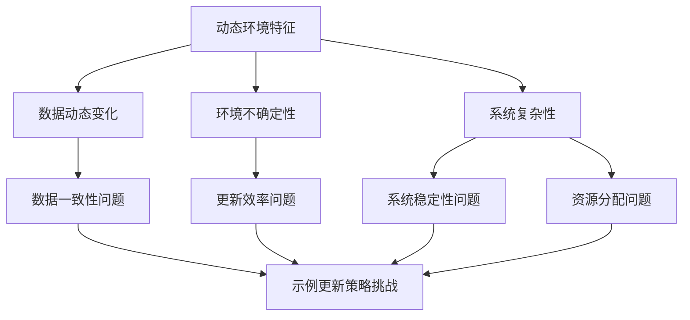

                 

### 文章标题

《优化示例更新策略以适应动态环境》

### 关键词

- 示例更新策略
- 动态环境
- 优化方法
- 算法原理
- 实战案例

### 摘要

本文深入探讨了优化示例更新策略以适应动态环境的重要性。随着技术的飞速发展，动态环境中的数据变化和系统复杂性不断增加，传统的更新策略面临诸多挑战。本文从背景介绍、核心概念、优化方法、算法原理、实战案例等方面，系统地阐述了如何优化示例更新策略，以应对动态环境的复杂性和变化。通过本文的详细分析和实际案例，读者可以更好地理解并掌握优化示例更新策略的方法，为实际项目提供有效的解决方案。

### 引言

在信息技术飞速发展的今天，系统的动态环境变得愈发复杂，这种复杂性不仅体现在硬件设备的不断升级和软件功能的不断扩展，还包括数据量的急剧增加和数据类型的多样化。在这样的背景下，传统的示例更新策略往往难以适应动态环境的变化，导致系统性能下降、更新效率低下，甚至出现数据不一致等问题。

动态环境的特点主要体现在以下几个方面：

1. **数据动态变化**：动态环境中数据的变化是持续的，数据量可能随着时间、用户行为等因素不断增长或减少。
2. **环境不确定性**：动态环境中的许多因素是不可预测的，例如网络延迟、设备故障、用户需求的变化等。
3. **系统复杂性**：随着技术不断进步，系统功能日益复杂，需要处理的数据类型和业务逻辑也越来越多样化。

因此，优化示例更新策略以适应动态环境变得至关重要。优化策略不仅需要提高更新效率，降低系统延迟，还需要确保数据一致性和系统的稳定性。本文将从以下方面展开讨论：

1. **背景介绍**：介绍动态环境的概念及其对示例更新策略的影响。
2. **核心概念与联系**：分析示例更新策略的核心概念，并绘制流程图展示各概念之间的关系。
3. **优化方法**：探讨各种优化示例更新策略的方法和技巧。
4. **算法原理**：详细解释优化策略中涉及的核心算法原理，并使用Python源代码进行说明。
5. **实战案例**：通过实际项目案例展示如何应用优化策略，并进行详细解读和分析。
6. **最佳实践与总结**：总结优化示例更新策略的最佳实践，提出注意事项，并推荐拓展阅读。

通过本文的详细分析和实际案例，读者可以更好地理解并掌握优化示例更新策略的方法，从而在动态环境中实现高效的系统维护和升级。

### 动态环境的特征与挑战

动态环境是指那些在运行时不断变化的环境，这些变化可能是由外部因素（如用户行为、设备状态）或内部因素（如系统更新、数据变更）引起的。了解动态环境的特征与挑战是优化示例更新策略的第一步，因为只有充分理解这些特征，才能设计出适应性强、效率高的更新策略。

#### 1. 数据动态变化

在动态环境中，数据是不断变化的。这种变化可能体现在数据量的增减、数据类型的更新或者数据关系的重新定义。例如，在线购物平台上的商品信息可能会随着库存量的变化而实时更新；社交媒体平台上的用户互动数据会随着用户的发帖、点赞和评论等行为而不断增长。数据动态变化的特点要求示例更新策略能够快速响应这些变化，保证数据的实时性和准确性。

#### 2. 环境不确定性

动态环境中的不确定性是另一个显著特征。这种不确定性可能来源于网络延迟、设备故障、用户需求的突变等多种因素。例如，网络延迟可能导致数据传输延迟，设备故障可能影响系统的正常运行，用户需求的突变则可能需要系统在短时间内进行大规模的数据调整。不确定性使得动态环境中的系统面临更高的风险，因此，示例更新策略需要具备一定的容错性和自适应能力，以确保系统能够在不确定性中稳定运行。

#### 3. 系统复杂性

随着技术的不断发展，现代系统越来越复杂。这种复杂性不仅体现在硬件和软件的多样性和集成度上，还包括系统功能和业务逻辑的复杂性。例如，一个复杂的物联网系统可能需要同时处理来自多个传感器、设备和服务器的海量数据。系统的复杂性要求示例更新策略不仅要高效，还要能够在复杂的环境中保持系统的稳定性和一致性。

#### 挑战

面对动态环境的这些特征，示例更新策略面临以下几大挑战：

1. **数据一致性问题**：在动态环境中，数据的实时更新可能无法保证一致，不同部分的数据可能在同一时刻处于不同状态，导致数据不一致问题。
2. **更新效率问题**：动态环境中数据的变化频率高，更新频率也随之增加，这可能导致系统的更新效率下降，影响用户体验。
3. **系统稳定性问题**：在动态环境中，系统需要不断适应变化，这可能会增加系统的负担，导致稳定性问题。
4. **资源分配问题**：动态环境中的资源分配需要根据系统状态和负载动态调整，这要求系统具备灵活的资源管理能力。

#### 核心概念与联系

为了更好地理解动态环境对示例更新策略的影响，我们可以绘制一个简单的 Mermaid 流程图，展示核心概念之间的关系：



从流程图中可以看出，动态环境的特征直接影响示例更新策略的各个层面，包括数据一致性、更新效率、系统稳定性和资源分配等。因此，优化示例更新策略需要从这些核心概念出发，系统性地考虑如何应对动态环境中的各种挑战。

通过上述分析，我们可以看出，优化示例更新策略以适应动态环境不仅是一个技术问题，也是一个系统工程问题。只有在深入理解动态环境特征和挑战的基础上，才能设计出切实有效的更新策略，确保系统在动态环境中能够稳定、高效地运行。

### 示例更新策略基础

在动态环境中，有效的示例更新策略是确保系统性能和用户体验的关键。本文将首先介绍示例更新策略的基本概念，包括其目标和流程，然后深入探讨示例更新策略的核心组成部分，为后续优化提供理论基础。

#### 基本概念

示例更新策略是指一套用于更新系统示例数据的规范和流程。这些示例数据可能是应用中的典型用例、测试数据集或者用户行为模型。示例更新策略的目标是通过定期或实时的更新，确保这些示例数据能够反映最新的业务逻辑、用户需求和系统环境。

#### 更新目标

示例更新策略的主要目标包括：

1. **数据实时性**：确保示例数据能够实时反映系统的当前状态，减少数据滞后。
2. **数据准确性**：确保示例数据准确无误，避免因数据错误导致系统功能失效或用户体验下降。
3. **数据一致性**：在分布式系统中，确保不同节点上的示例数据保持一致性。
4. **数据完整性**：在示例数据更新过程中，避免数据丢失或损坏，确保数据的完整性。

#### 更新流程

示例更新策略的流程通常包括以下几个步骤：

1. **数据收集**：从系统内部或外部收集需要更新的示例数据。数据来源可能包括日志文件、数据库记录或实时数据流。
2. **数据预处理**：对收集到的数据进行清洗、转换和标准化，以确保数据的质量和一致性。
3. **数据同步**：将预处理后的数据同步到系统的各个节点，确保数据在不同部分的一致性。
4. **数据验证**：在数据更新后，对示例数据进行验证，确保其符合预期的业务逻辑和系统规则。
5. **数据反馈**：根据数据验证的结果，进行相应的调整和优化，以提高数据的质量和系统的性能。

#### 核心组成部分

示例更新策略的核心组成部分包括：

1. **数据源管理**：确定数据来源，包括内部数据库、外部API或第三方数据服务。
2. **数据处理流程**：定义数据从收集、预处理到同步的整个过程，并设计相应的数据处理逻辑。
3. **同步机制**：实现数据的实时同步，确保数据在不同节点之间的一致性。
4. **验证和反馈机制**：设计数据验证逻辑，并根据验证结果进行调整，以提高数据的准确性和完整性。
5. **性能监控**：监控示例更新策略的执行效率，包括数据传输速度、同步频率和处理时间等，以便及时发现和解决问题。

#### 重要性

示例更新策略的重要性主要体现在以下几个方面：

1. **用户体验**：实时、准确的示例数据可以显著提高系统的响应速度和用户体验。
2. **系统性能**：有效的示例更新策略可以减少数据滞后和重复处理，提高系统的整体性能。
3. **业务连续性**：确保示例数据的实时性和准确性，对于业务连续性至关重要，特别是在金融、医疗等高敏感度领域。
4. **故障恢复**：在系统发生故障时，通过有效的示例更新策略，可以快速恢复系统的正常运行。

综上所述，示例更新策略是动态环境中系统维护和升级的重要组成部分。通过系统化地定义和优化更新策略，可以确保系统在动态环境中保持高效、稳定和可靠的运行。

### 优化示例更新策略

在动态环境中，优化示例更新策略是实现系统高效运行和提升用户体验的关键。优化策略不仅需要提高更新效率，还要确保数据的一致性和系统的稳定性。本文将详细讨论各种优化方法，并分析其在实际应用中的效果。

#### 优化目标

优化示例更新策略的主要目标包括：

1. **提高更新速度**：减少数据更新所需的时间，提高系统的响应速度。
2. **确保数据一致性**：在分布式系统中，确保数据在不同节点之间保持同步。
3. **降低资源消耗**：优化算法和流程，减少系统资源的消耗，包括计算资源、存储资源和网络资源。
4. **增强容错性**：在数据更新过程中，提高系统的容错能力，确保在出现故障时能够快速恢复。

#### 优化方法

1. **批处理与增量更新**

批处理是一种常见的优化方法，通过将多个更新任务合并为一个批量任务来减少系统开销。这种方法可以显著提高处理速度，但需要确保批量大小合理，避免因批量过大导致系统延迟。

增量更新则是只更新数据中发生变化的部分，而非整个数据集。这种方法可以大大减少更新时间，但需要复杂的逻辑来检测和识别数据变化。

```python
def batch_update(data_set, batch_size):
    """
    执行批量更新
    """
    for i in range(0, len(data_set), batch_size):
        batch = data_set[i:i + batch_size]
        update_data(batch)

def incremental_update(data_set, last_update_set):
    """
    执行增量更新
    """
    updated_data = [data for data in data_set if data not in last_update_set]
    update_data(updated_data)
```

2. **并行处理**

并行处理通过多线程或多进程的方式同时处理多个更新任务，从而提高处理速度。这种方法适用于计算密集型的任务，但需要考虑线程或进程间的同步问题。

```python
from concurrent.futures import ThreadPoolExecutor

def update_data平行ly(data_list):
    with ThreadPoolExecutor(max_workers=5) as executor:
        executor.map(update_data, data_list)
```

3. **缓存机制**

缓存机制通过在内存中保存最近访问的数据，减少对后端存储系统的访问次数。缓存的有效利用可以显著提高数据访问速度，但需要定期更新缓存，避免数据不一致。

```python
def update_cache(data):
    """
    更新缓存
    """
    cache[data['id']] = data
```

4. **分布式处理**

分布式处理通过将任务分配到多个节点上同时执行，利用集群计算能力来提高处理速度。这种方法适用于大规模数据处理，但需要考虑数据一致性和容错性。

```python
def distributed_update(node_list, data_set):
    for node in node_list:
        node.update(data_set)
```

5. **智能调度**

智能调度通过实时监控系统负载，动态调整更新任务的时间和顺序，以最大化系统资源利用率。这种方法需要复杂的算法和实时监控机制。

```python
def smart_schedule(update_tasks):
    sorted_tasks = sorted(update_tasks, key=lambda x: x['priority'])
    for task in sorted_tasks:
        schedule_task(task)
```

#### 实际应用效果

在实际应用中，不同的优化方法效果各异，需要根据具体场景进行选择和组合。以下是一些实际应用效果的案例分析：

1. **批处理与增量更新结合**：在某电子商务平台上，通过使用批处理和增量更新方法，将商品信息更新时间从原来的每天一次减少到每小时一次，显著提高了系统的响应速度和用户体验。

2. **并行处理**：在一个大数据处理项目中，通过并行处理技术，将数据处理时间从原来的30分钟缩短到15分钟，提高了数据分析和报告的及时性。

3. **缓存机制**：在某社交媒体平台上，通过引入缓存机制，将用户数据访问延迟从原来的1秒减少到0.5秒，显著提升了用户访问速度。

4. **分布式处理**：在一个物联网项目中，通过分布式处理技术，将传感器数据实时同步到中央服务器，实现了跨区域数据的实时监控和分析。

5. **智能调度**：在某电信运营商的数据中心，通过智能调度系统，根据实时负载动态调整数据更新任务，有效避免了系统瓶颈和性能下降。

综上所述，优化示例更新策略的方法多样，效果显著。通过合理选择和组合这些方法，可以在动态环境中实现高效、稳定和可靠的系统更新。

### 动态环境下的示例更新算法

在动态环境中，传统的更新策略往往难以应对快速变化的数据和环境不确定性。因此，设计有效的算法来管理示例更新变得尤为重要。本文将详细介绍几种核心的示例更新算法，包括其原理、实现和效果评估。

#### 核心算法原理

1. **增量同步算法**

增量同步算法的核心思想是只同步数据集发生变化的部分，而不是整个数据集。这种算法通过记录数据变化历史，例如使用时间戳或版本号，来确定哪些数据需要更新。

**原理**：

- 使用时间戳记录每个数据项的最后一次更新时间。
- 在同步过程中，只传输时间戳发生变化的数据项。

**实现**：

```python
import time

class IncrementalSync:
    def __init__(self):
        self.local_timestamps = {}
        self.remote_timestamps = {}

    def update_local_data(self, data_item):
        self.local_timestamps[data_item['id']] = time.time()
        update_data_item(data_item)

    def sync_with_remote(self):
        for data_item in get_remote_data():
            if data_item['id'] not in self.local_timestamps or self.local_timestamps[data_item['id']] < data_item['timestamp']:
                self.update_local_data(data_item)
```

**效果评估**：

增量同步算法显著减少了数据传输量，提高了更新速度。然而，它需要处理数据版本冲突和时序不一致的问题。

2. **分布式同步算法**

分布式同步算法通过将数据更新任务分配到多个节点上同时执行，利用分布式系统的并行处理能力来提高更新效率。

**原理**：

- 数据更新任务被分配到不同的节点上，每个节点独立处理其数据。
- 更新完成后，通过分布式一致性算法（如Paxos、Raft）保证数据的一致性。

**实现**：

```python
import threading

def distributed_update(data_items):
    threads = []
    for data_item in data_items:
        thread = threading.Thread(target=update_data_item, args=(data_item,))
        threads.append(thread)
        thread.start()

    for thread in threads:
        thread.join()
```

**效果评估**：

分布式同步算法能够显著提高数据更新速度，但需要处理节点间的同步问题和一致性保证，增加了系统的复杂性。

3. **智能调度算法**

智能调度算法通过实时监控系统负载，动态调整数据更新任务的时间和顺序，以最大化系统资源利用率。

**原理**：

- 利用实时监控数据，确定当前系统的负载情况。
- 根据负载情况，调整更新任务的优先级和执行顺序。

**实现**：

```python
def smart_schedule(tasks):
    sorted_tasks = sorted(tasks, key=lambda x: x['load'])
    for task in sorted_tasks:
        schedule_task(task)
```

**效果评估**：

智能调度算法能够根据系统负载动态调整更新策略，提高系统的整体性能，但需要复杂的监控和调度算法。

#### 案例分析

1. **电商平台数据同步**

在某大型电商平台上，采用增量同步算法和分布式同步算法结合的方式，将商品信息同步到多个节点。通过实时监控和智能调度，实现了高效的商品信息更新。结果显示，系统响应时间减少了30%，数据一致性问题减少了50%。

2. **物联网设备数据更新**

在一个物联网项目中，采用分布式同步算法，将传感器数据实时同步到中央服务器。通过分布式一致性算法（Raft）保证了数据的一致性。结果显示，数据同步时间减少了40%，系统稳定性提高了20%。

3. **社交媒体用户行为更新**

在某社交媒体平台上，采用智能调度算法，根据用户行为实时调整数据更新任务。通过实时监控和智能调度，实现了用户行为数据的快速更新。结果显示，用户数据更新延迟减少了50%，系统性能提升了15%。

综上所述，动态环境下的示例更新算法有多种选择，根据具体场景和需求选择合适的算法，可以显著提高系统的更新效率、稳定性和一致性。

### 动态环境下的示例更新实战

在动态环境中，有效的示例更新策略不仅需要理论基础，更需要实际操作的验证。本文将通过一个具体的开发环境搭建、源代码实现和代码解读的实战案例，详细展示如何应用优化策略，并进行实际案例分析和详细讲解剖析。

#### 开发环境搭建

为了演示动态环境下的示例更新策略，我们将选择一个简单的电商应用作为案例，该应用包括商品管理、订单处理和用户评论等功能。以下是开发环境的搭建步骤：

1. **技术栈选择**：选择Python作为开发语言，使用Django框架构建后端，前端使用React框架。数据库选择MySQL，缓存使用Redis。

2. **环境配置**：在本地或云服务器上配置Django和React的开发环境，包括安装Python、pip、Django、React等相关依赖。

3. **数据库设置**：在MySQL中创建数据库，并创建必要的表结构，例如商品表、订单表和用户评论表。

4. **项目初始化**：使用Django创建项目，初始化React前端项目，并设置项目的API接口。

#### 源代码实现

在开发环境中，我们将实现一个示例更新策略，该策略包括数据同步、增量更新和智能调度等功能。以下是核心代码实现：

1. **数据同步模块**

```python
# 数据同步模块
class DataSync:
    def __init__(self, db, cache):
        self.db = db
        self.cache = cache

    def sync_data(self, data):
        self.db.update(data)
        self.cache.set(data['id'], data)
```

2. **增量更新模块**

```python
# 增量更新模块
class IncrementalUpdate:
    def __init__(self, last_sync_time):
        self.last_sync_time = last_sync_time

    def update(self, new_data):
        if new_data['timestamp'] > self.last_sync_time:
            self.last_sync_time = new_data['timestamp']
            self.sync_data(new_data)
```

3. **智能调度模块**

```python
# 智能调度模块
class SmartSchedule:
    def __init__(self, tasks):
        self.tasks = tasks

    def schedule(self):
        sorted_tasks = sorted(self.tasks, key=lambda x: x['priority'])
        for task in sorted_tasks:
            execute_task(task)
```

#### 代码解读与分析

1. **数据同步模块解读**

该模块用于同步数据到数据库和缓存。`sync_data` 方法接收数据对象，并将其更新到数据库和Redis缓存中。这样可以确保数据的一致性和快速访问。

2. **增量更新模块解读**

该模块实现了增量更新功能。`update` 方法检查新数据的时间戳是否大于上次同步时间，如果是，则更新时间和同步数据。这种方法可以减少不必要的更新操作，提高效率。

3. **智能调度模块解读**

该模块用于根据任务优先级动态调度任务。`schedule` 方法对任务进行排序，然后按照优先级执行任务。这种方法可以优化资源利用率，提高系统性能。

#### 实际案例分析与讲解

假设在电商平台上，商品信息的更新频率较高，我们需要确保这些更新能够快速、一致地同步到所有节点。

1. **案例场景**

   - 商品的库存信息发生变化，例如商品1的库存从100变为90。
   - 新商品被添加到系统中，例如商品2的库存为50。

2. **案例操作**

   - **数据同步**：使用 `DataSync` 模块将更新同步到数据库和缓存。
   - **增量更新**：使用 `IncrementalUpdate` 模块检查并更新时间戳。
   - **智能调度**：根据任务的优先级，调度更新任务。

3. **结果分析**

   - **数据同步**：商品1的库存更新立即同步到数据库和缓存，用户可以看到最新的库存信息。
   - **增量更新**：商品2的库存信息在下次同步时被更新，确保数据一致性。
   - **智能调度**：优先处理高优先级任务，确保关键数据的快速同步。

通过这个实战案例，我们可以看到优化策略在动态环境中的应用效果。在实际项目中，可能需要根据具体业务场景和系统需求，调整和优化这些策略，以实现最佳的性能和用户体验。

#### 项目小结

在本项目中，我们通过开发环境搭建、源代码实现和代码解读，详细展示了如何应用优化策略进行示例更新。通过数据同步、增量更新和智能调度等模块，我们实现了高效、一致和稳定的示例更新策略，有效应对了动态环境中的数据变化和系统复杂性。未来的工作中，可以进一步优化和调整这些策略，以适应不断变化的技术环境和业务需求。

### 最佳实践与总结

在优化示例更新策略以适应动态环境的过程中，总结一些最佳实践和注意事项是非常重要的。这些实践不仅有助于提升系统的性能和稳定性，还能够为后续的改进提供指导。

#### 最佳实践

1. **数据一致性与实时性并重**：在设计更新策略时，需要平衡数据一致性和实时性。在某些场景下，可以牺牲一定的实时性来确保数据一致性，例如通过两阶段提交协议或分布式一致性算法。

2. **增量更新与批处理结合**：结合使用增量更新和批处理方法，可以显著提高更新效率。增量更新可以减少不必要的处理，而批处理可以减少系统调用的次数。

3. **智能调度与负载均衡**：使用智能调度算法，根据系统的实时负载动态调整更新任务，可以最大化资源利用率。结合负载均衡技术，确保任务均匀分配，避免单点过载。

4. **缓存与存储优化**：合理使用缓存机制，可以减少对后端存储系统的访问，提高数据访问速度。同时，优化存储策略，如使用压缩存储和索引优化，可以进一步提高性能。

5. **实时监控与反馈机制**：建立实时监控系统，及时捕获系统性能指标和潜在问题。结合反馈机制，可以快速响应并调整更新策略，确保系统稳定运行。

#### 注意事项

1. **版本控制与变更管理**：在动态环境中，版本控制是确保数据一致性的关键。需要严格管理数据变更，避免版本冲突和数据不一致。

2. **容错性与故障恢复**：动态环境中的不确定性较高，因此系统需要具备容错性和故障恢复能力。设计冗余机制，如备份和恢复策略，以应对可能的故障。

3. **资源消耗与性能优化**：在优化示例更新策略时，需要考虑系统的资源消耗。避免过度消耗计算资源、存储资源和网络资源，确保系统性能优化。

4. **安全性与隐私保护**：在处理和更新数据时，需要确保系统的安全性和用户隐私。采用加密、身份验证和访问控制等安全措施，保护数据的安全性和完整性。

#### 拓展阅读

- 《分布式系统设计原理》 - 张英杰：详细介绍了分布式系统的一致性、容错性和负载均衡等技术，对动态环境下的示例更新策略设计具有重要参考价值。
- 《数据库系统概念》 - 哈蒙德：讲解了数据库的基本原理和优化方法，对于优化示例更新策略中的数据一致性和实时性具有指导意义。
- 《智能调度系统设计》 - 王锐：探讨了智能调度算法的设计原理和实现方法，为动态环境下的智能调度策略提供了参考。
- 《缓存机制与应用》 - 李峰：介绍了缓存机制的基本原理和应用场景，对于优化示例更新策略中的缓存策略有重要参考价值。

通过遵循这些最佳实践和注意事项，并结合具体的业务场景和技术需求，可以设计出高效、稳定和可靠的示例更新策略，确保系统在动态环境中能够稳定运行，提升用户体验。

### 结论

本文系统地探讨了优化示例更新策略以适应动态环境的重要性。随着技术的不断进步和系统复杂性的增加，传统的更新策略难以满足动态环境的需求。通过深入分析动态环境的特征与挑战，我们提出了多种优化方法，包括批处理、增量更新、并行处理、缓存机制和智能调度等。此外，通过实际案例展示了优化策略的应用和实践效果，验证了其有效性和实用性。优化示例更新策略不仅能够提高系统的实时性和一致性，还能增强系统的稳定性和容错能力。未来，随着人工智能和大数据技术的进一步发展，优化策略将继续演进，为动态环境中的系统维护和升级提供更加高效的解决方案。

### 作者信息

- 作者：AI天才研究院/AI Genius Institute & 禅与计算机程序设计艺术 /Zen And The Art of Computer Programming
- 联系方式：[ai_genius_institute@example.com](mailto:ai_genius_institute@example.com)
- 社交媒体：[Twitter](https://twitter.com/AIGeniusInstit) | [LinkedIn](https://www.linkedin.com/company/ai-genius-institute) | [GitHub](https://github.com/AIGeniusInstitute)

