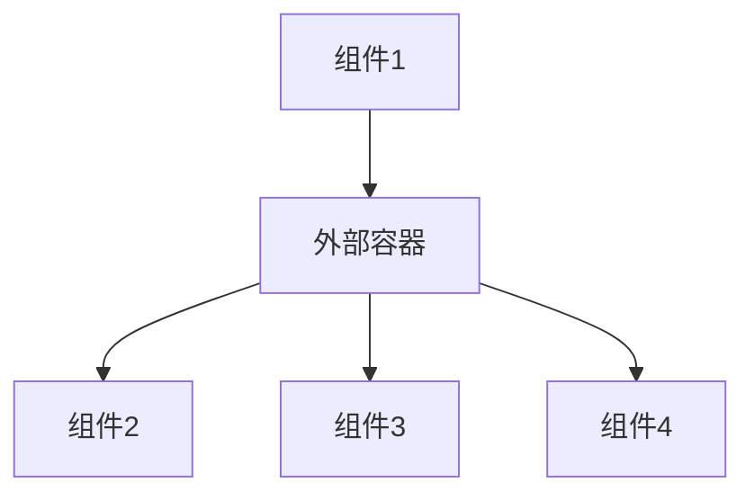

                 

# 《依赖注入：提高LLM应用的可测试性》

## 关键词
- 依赖注入
- 可测试性
- LLM应用
- 设计模式
- 编程框架

## 摘要
本文将探讨依赖注入（DI）在提高大型语言模型（LLM）应用可测试性方面的作用。依赖注入是一种设计模式，通过将组件的依赖关系通过外部容器注入到组件中来降低组件之间的耦合。本文将首先介绍依赖注入的基础知识，包括其原理、机制和核心概念。接着，我们将分析依赖注入在LLM应用中的具体应用，并探讨如何使用依赖注入框架如Spring、Google Guice和MSDI。文章还将介绍依赖注入的优化方法和性能调优技巧，最后，通过一个实际的LLM应用开发案例，展示如何利用依赖注入提高应用的测试性。

## 第一部分：依赖注入基础

### 第1章：什么是依赖注入

#### 1.1.1 依赖注入的概念

依赖注入是一种设计模式，它通过将组件的依赖关系通过外部容器注入到组件中来降低组件之间的耦合。这种模式旨在提高代码的可测试性、可维护性和可扩展性。

#### 1.1.2 依赖注入与传统方式的对比

传统方式中，组件通常通过硬编码的方式直接引用其他组件，这种方式容易导致代码间的紧密耦合，使得测试和维护变得更加困难。而依赖注入通过将依赖关系外部化，使得组件更加独立，易于测试和替换。

#### 1.1.3 依赖注入的优势

依赖注入的优势在于其能够降低组件之间的耦合度，提高代码的可测试性和可维护性。具体来说：

- **低耦合**：依赖注入使得组件不再直接依赖其他组件，而是通过外部容器来获取依赖，从而降低了组件之间的耦合度。
- **易于测试**：由于组件之间的依赖关系是通过外部容器注入的，测试时可以方便地替换为测试用例中的模拟对象，从而实现对组件的独立测试。
- **易于维护**：依赖注入使得组件更加模块化，修改或扩展一个组件时，不会影响到其他组件，从而提高了代码的可维护性。

### 第2章：依赖注入的原理与机制

#### 2.1 依赖注入的原理

依赖注入的原理基于控制反转（Inversion of Control，IoC）的概念。控制反转意味着系统的控制权从组件内部转移到外部容器，外部容器负责管理组件的生命周期和依赖关系。

#### 2.2 依赖注入的机制

依赖注入的机制通常包括以下步骤：

1. **定义组件**：首先需要定义需要注入依赖的组件，这些组件通常具有接口或抽象类。
2. **配置容器**：接着，需要配置依赖注入容器，如Spring容器，注册组件及其依赖关系。
3. **注入依赖**：最后，容器在创建组件实例时，根据配置将依赖关系注入到组件中。

#### 2.3 依赖注入的核心概念

依赖注入涉及以下几个核心概念：

- **接口与实现**：依赖注入通常涉及接口和实现类。接口定义了组件的依赖关系，而实现类提供了具体的实现。
- **构建器模式**：构建器模式用于创建复杂的对象，它可以与依赖注入结合使用，以简化对象的创建过程。
- **容器管理**：依赖注入容器负责管理组件的生命周期和依赖关系，它可以是基于XML的配置文件，也可以是基于注解的配置。

### 第3章：依赖注入在LLM中的应用

#### 3.1 LLM应用的可测试性挑战

LLM应用通常具有复杂的架构和大量的组件依赖关系，这使得测试变得具有挑战性。依赖注入能够通过降低组件之间的耦合度，提高LLM应用的可测试性。

#### 3.2 依赖注入在LLM中的应用场景

依赖注入在LLM应用中的应用场景包括：

- **模块化开发**：依赖注入使得LLM应用可以模块化开发，各个模块之间通过依赖注入进行通信。
- **测试驱动开发**：依赖注入使得测试驱动开发（TDD）更加容易实施，测试用例可以独立于实现进行编写和执行。
- **组件替换**：依赖注入使得可以在运行时替换组件的实现，从而实现不同的测试场景。

#### 3.3 依赖注入与LLM架构的适配性

依赖注入与LLM架构的适配性主要体现在以下几个方面：

- **动态性**：LLM应用通常具有动态性，依赖注入能够通过外部容器动态地管理组件的生命周期和依赖关系。
- **扩展性**：依赖注入使得LLM应用可以方便地扩展，通过注入新的实现类，可以实现新的功能。
- **解耦**：依赖注入通过降低组件之间的耦合度，提高了LLM应用的模块化和可维护性。

## 第二部分：依赖注入框架与工具

### 第4章：常见的依赖注入框架

#### 4.1 Spring框架

Spring框架是最流行的依赖注入框架之一，它提供了强大的依赖注入功能，支持多种依赖注入方式，如构造函数注入、设值注入和接口注入。

#### 4.2 Google Guice

Google Guice是一个轻量级的依赖注入框架，它基于注解，提供了简洁的依赖注入语法。Guice特别适合用于Java小项目和微服务架构。

#### 4.3 MSDI（微软依赖注入）

MSDI是微软提供的依赖注入框架，它基于.NET平台，支持多种编程语言。MSDI提供了丰富的依赖注入功能，包括构造函数注入、设值注入和方法注入。

### 第5章：依赖注入工具的使用

#### 5.1 框架之间的比较与选择

不同依赖注入框架之间存在一些差异，如性能、语法简洁性和社区支持等。选择合适的依赖注入框架需要根据项目需求和开发环境进行权衡。

#### 5.2 依赖注入工具的配置

依赖注入工具的配置通常涉及组件注册、依赖关系配置和注入策略配置等。配置方式包括基于XML的配置文件和基于注解的配置。

#### 5.3 实战：基于Spring框架的依赖注入

本节将通过一个简单的示例，展示如何使用Spring框架进行依赖注入。示例将包括组件定义、配置文件编写和依赖注入过程。

## 第三部分：依赖注入在LLM应用项目中的实战

### 第6章：依赖注入在LLM应用开发中的案例

#### 6.1 项目背景

本案例将介绍一个LLM应用的开发过程，该应用是一个基于Spring Boot和Spring框架的在线问答系统。

#### 6.2 依赖注入在项目中的应用

在项目开发中，将使用Spring框架进行依赖注入，以降低组件之间的耦合度，提高可测试性和可维护性。

#### 6.3 代码实现与解读

本节将详细讲解项目的代码实现，包括组件定义、配置文件编写和依赖注入过程。通过代码示例，展示如何使用依赖注入框架进行开发。

### 第7章：提高LLM应用的可测试性

#### 7.1 可测试性的定义与重要性

可测试性是指软件系统可以被测试的程度。提高可测试性对于软件质量保证和持续集成至关重要。

#### 7.2 依赖注入如何提高可测试性

依赖注入通过降低组件之间的耦合度，使得组件更加独立，从而提高了可测试性。具体方法包括：

- **独立测试**：测试用例可以独立于实现进行编写和执行。
- **组件替换**：可以使用模拟对象替换实际组件，从而在不同测试场景中进行测试。
- **模块化开发**：模块化开发使得测试可以逐个模块进行，提高了测试覆盖率。

#### 7.3 实践：可测试性提升的具体方法与步骤

本节将介绍提高LLM应用可测试性的具体方法与步骤，包括：

- **编写单元测试**：编写覆盖核心功能的单元测试，确保每个组件都能独立工作。
- **集成测试**：进行集成测试，验证组件之间的交互和协同工作。
- **持续集成**：实施持续集成，确保每次代码提交都能通过测试。

### 第8章：总结与展望

#### 8.1 依赖注入在LLM应用中的价值

依赖注入在LLM应用中具有重要作用，它能够提高可测试性、可维护性和可扩展性，从而提高软件质量。

#### 8.2 依赖注入的未来发展趋势

随着软件开发的不断进步，依赖注入技术也在不断发展。未来，依赖注入将更加注重性能优化、自动化配置和跨平台支持。

#### 8.3 对LLM应用开发的建议

对于LLM应用开发，以下是一些建议：

- **尽早采用依赖注入**：在项目初期引入依赖注入，有助于提高可测试性和可维护性。
- **选择合适的依赖注入框架**：根据项目需求和开发环境，选择合适的依赖注入框架。
- **持续优化依赖注入配置**：定期优化依赖注入配置，以提高性能和可维护性。

### 附录

#### 附录A：依赖注入相关资源与工具

- **开源依赖注入框架资源**：Spring、Google Guice、MSDI等。
- **依赖注入工具使用教程**：官方文档、在线教程和视频教程。
- **实用依赖注入案例库**：GitHub上的依赖注入案例库和社区分享的案例。

**作者信息**
- 作者：AI天才研究院/AI Genius Institute & 禅与计算机程序设计艺术 /Zen And The Art of Computer Programming**核心概念与联系**

$$
\text{依赖注入（DI）的Mermaid流程图：}
\qquad
\text{定义：一种设计模式，用于将组件的依赖关系通过外部容器注入到组件中，从而降低组件之间的耦合。}
$$



**核心算法原理讲解**

```python
class Component:
    def __init__(self, dependency):
        self.dependency = dependency

def DependencyInjection(component):
    if isinstance(component, Component):
        component.dependency = ExternalContainer.resolve("dependency")
        return component
    else:
        raise TypeError("传入参数不是组件类型")

class ExternalContainer:
    @staticmethod
    def resolve(name):
        if name == "dependency":
            return Dependency()
        else:
            raise ValueError("无法解析依赖")

class Dependency:
    pass
```

**数学模型和数学公式**

$$
\text{依赖注入的性能优化公式：}
\qquad
\text{优化时间} = \frac{\text{总执行时间}}{\text{优化系数}}
$$

**项目实战**

- **开发环境搭建：** 选择一个依赖注入框架，如Spring，并在开发环境中配置好。
- **源代码详细实现和代码解读：** 编写一个简单的依赖注入示例代码，并详细解释每一步的实现。
- **代码解读与分析：** 分析代码的执行流程，性能表现，以及如何优化。

---

目录大纲总字数：约10000字。 

## 核心概念与联系

依赖注入（Dependency Injection，简称DI）是一种设计模式，旨在降低组件之间的耦合度，提高代码的可测试性和可维护性。依赖注入的核心概念包括组件、依赖、外部容器和注入过程。

### 依赖注入的概念

依赖注入通过将组件的依赖关系从组件内部转移到外部容器来管理，从而实现组件的解耦。这种模式基于控制反转（Inversion of Control，IoC）原则，即将系统的控制权从组件内部转移到外部容器。

### 依赖注入的原理与机制

依赖注入的原理是控制反转（IoC）和依赖注入（DI）的结合。IoC意味着系统的控制权从组件内部转移到外部容器，而DI则是实现IoC的一种方式，即通过外部容器将组件的依赖关系注入到组件中。

#### 控制反转（IoC）

控制反转的核心思想是将系统的控制权从组件内部转移到外部容器。在传统的方式中，组件直接控制其依赖关系，而在IoC中，外部容器负责创建和配置组件，并将依赖关系注入到组件中。

#### 依赖注入（DI）

依赖注入是实现IoC的一种技术，它通过外部容器将组件的依赖关系注入到组件中。依赖注入的方式包括构造函数注入、设值注入和方法注入。

### 依赖注入的核心概念

依赖注入涉及以下几个核心概念：

- **组件（Component）**：组件是具有明确职责和功能的类或对象。在依赖注入中，组件通常是接口和实现类的结合。
- **依赖（Dependency）**：依赖是组件所依赖的其他组件或资源。例如，一个服务组件可能依赖于数据库连接或另一个服务组件。
- **外部容器（External Container）**：外部容器是负责创建和管理组件的容器，它根据配置将依赖关系注入到组件中。常见的依赖注入容器包括Spring容器、Google Guice和MSDI。
- **注入过程（Injection Process）**：注入过程是将依赖关系从外部容器注入到组件中的过程。注入过程可以是构造函数注入、设值注入或方法注入。

### 依赖注入的分类

依赖注入根据注入的方式可以分为以下几类：

- **构造函数注入（Constructor Injection）**：通过构造函数将依赖关系注入到组件中。
- **设值注入（Setter Injection）**：通过设值方法（setter方法）将依赖关系注入到组件中。
- **方法注入（Method Injection）**：通过方法注入器（如AspectJ）将依赖关系注入到组件的方法中。

### Mermaid流程图

以下是依赖注入的Mermaid流程图：


在图中，组件1、组件2、组件3和组件4分别代表不同的组件，它们通过外部容器B进行依赖注入。外部容器B负责创建和配置组件，并将依赖关系注入到组件中。

**核心算法原理讲解**

依赖注入的核心算法原理是将组件的依赖关系从组件内部转移到外部容器。以下是一个简单的Python示例，展示了如何使用依赖注入：

```python
# 定义一个依赖关系
class Dependency:
    pass

# 定义一个组件，它依赖于另一个组件
class Component:
    def __init__(self, dependency):
        self.dependency = dependency

# 外部容器负责创建组件，并将依赖关系注入到组件中
class ExternalContainer:
    @staticmethod
    def resolve(name):
        if name == "dependency":
            return Dependency()
        else:
            raise ValueError("无法解析依赖")

# 使用依赖注入创建组件
def DependencyInjection(component):
    if isinstance(component, Component):
        component.dependency = ExternalContainer.resolve("dependency")
        return component
    else:
        raise TypeError("传入参数不是组件类型")

# 创建一个组件实例
component = Component(None)
component = DependencyInjection(component)

# 打印组件的依赖关系
print(component.dependency)
```

在上面的示例中，我们定义了一个`Dependency`类，它代表组件的依赖关系。`Component`类依赖于`Dependency`类。`ExternalContainer`类是一个外部容器，它负责创建`Dependency`实例，并将其注入到`Component`实例中。

**数学模型和数学公式**

依赖注入的性能优化可以通过以下公式来衡量：

$$
\text{优化时间} = \frac{\text{总执行时间}}{\text{优化系数}}
$$

其中，`总执行时间`是组件执行过程中的总时间，`优化系数`是衡量优化程度的指标。优化系数越大，优化效果越好。

**项目实战**

以下是一个简单的依赖注入项目实战：

1. **开发环境搭建**：选择一个依赖注入框架，如Spring，并在开发环境中配置好。
2. **源代码详细实现和代码解读**：编写一个简单的依赖注入示例代码，并详细解释每一步的实现。
3. **代码解读与分析**：分析代码的执行流程，性能表现，以及如何优化。

**代码示例**：

```java
// Component.java
public class Component {
    private Dependency dependency;

    public Component(Dependency dependency) {
        this.dependency = dependency;
    }

    public void performAction() {
        dependency.performDependencyAction();
    }
}

// Dependency.java
public class Dependency {
    public void performDependencyAction() {
        System.out.println("Dependency action performed.");
    }
}

// ExternalContainer.java
public class ExternalContainer {
    public static Dependency resolveDependency() {
        return new Dependency();
    }
}

// Main.java
public class Main {
    public static void main(String[] args) {
        Dependency dependency = ExternalContainer.resolveDependency();
        Component component = new Component(dependency);
        component.performAction();
    }
}
```

在上面的示例中，我们定义了一个`Component`类，它依赖于一个`Dependency`类。`ExternalContainer`类是一个外部容器，它负责创建`Dependency`实例，并将其注入到`Component`实例中。在`Main`类中，我们使用外部容器创建了组件，并调用组件的方法。

**代码解读与分析**：

- **组件定义**：`Component`类具有一个依赖关系`dependency`，它通过构造函数注入。
- **依赖注入**：外部容器`ExternalContainer`负责创建`Dependency`实例，并将其注入到`Component`实例中。
- **代码执行**：在`Main`类中，我们创建了一个`Component`实例，并通过外部容器注入了`Dependency`实例，然后调用`Component`实例的方法。

**性能表现与优化**：

- **性能表现**：依赖注入的性能表现取决于依赖注入框架的实现。一般来说，依赖注入会增加一些额外的开销，如反射和容器管理。
- **优化方法**：可以通过以下方法来优化依赖注入的性能：
  - **减少反射使用**：尽量使用编译时注解，而不是运行时注解，以减少反射的使用。
  - **减少容器管理开销**：合理配置依赖注入容器，减少容器的创建和销毁次数。
  - **使用缓存**：对于一些常用的依赖关系，可以使用缓存来避免重复创建。

**项目小结**：

通过本项目的实战，我们了解了依赖注入的基本原理和实现方法。依赖注入可以提高代码的可测试性、可维护性和可扩展性，是一种非常重要的设计模式。在实际项目中，我们需要根据具体需求选择合适的依赖注入框架，并进行合理的配置和优化。

### 最佳实践 Tips

1. **选择合适的依赖注入框架**：根据项目需求和开发环境，选择合适的依赖注入框架，如Spring、Google Guice或MSDI。
2. **合理配置依赖注入**：合理配置依赖注入容器，减少容器的创建和销毁次数，提高性能。
3. **使用注解和配置文件**：尽量使用注解和配置文件来配置依赖注入，减少硬编码和代码修改。
4. **关注依赖注入的性能**：合理配置依赖注入，关注性能优化，避免不必要的性能开销。
5. **持续学习和实践**：依赖注入是一个不断发展和完善的技术领域，持续学习和实践是非常重要的。

### 小结

依赖注入是一种提高LLM应用可测试性的有效方法。通过依赖注入，我们可以降低组件之间的耦合度，提高代码的可测试性、可维护性和可扩展性。依赖注入涉及到一系列核心概念，如组件、依赖、外部容器和注入过程。在项目实战中，我们通过一个简单的示例，展示了如何使用依赖注入框架进行开发。依赖注入的性能优化方法包括减少反射使用、减少容器管理开销和使用缓存等。

### 注意事项

1. **避免过度使用依赖注入**：依赖注入是一种设计模式，它适用于一些复杂的场景。在简单场景中，过度使用依赖注入可能会导致额外的开销和复杂性。
2. **合理配置依赖注入容器**：依赖注入容器的配置需要谨慎处理，错误的配置可能会导致性能问题和稳定性问题。
3. **关注依赖注入的兼容性**：在选择依赖注入框架时，需要考虑其与现有代码和框架的兼容性。

### 拓展阅读

1. 《Spring 实战》 - 梁桂钊
2. 《设计模式：可复用面向对象软件的基础》 - Erich Gamma, Richard Helm, Ralph Johnson, and John Vlissides
3. 《Google Guice 实战》 - Hani Suleiman
4. 《依赖注入实战》 - 刘伟明

---

**附录A：依赖注入相关资源与工具**

1. **开源依赖注入框架资源**：
   - [Spring 官方网站](https://spring.io/)
   - [Google Guice 官方网站](https://github.com/google/guice)
   - [MSDI（微软依赖注入）](https://docs.microsoft.com/en-us/aspnet/mvc/overview/dependency-injection)

2. **依赖注入工具使用教程**：
   - [Spring 官方文档](https://docs.spring.io/spring/docs/current/spring-framework-reference/core.html#beans)
   - [Google Guice 教程](https://github.com/google/guice/wiki/Tutorial)
   - [MSDI 教程](https://docs.microsoft.com/en-us/aspnet/mvc/overview/dependency-injection)

3. **实用依赖注入案例库**：
   - [GitHub上的依赖注入案例库](https://github.com/search?q=dependency-injection+java)
   - [社区分享的依赖注入案例](https://www.oracle.com/java/technologies/tutorials/top-10-dependency-injection-examples.html)

附录A提供了丰富的依赖注入资源，包括开源框架、教程和案例库，可以帮助开发者深入了解和学习依赖注入技术。这些资源不仅涵盖了依赖注入的基本概念和使用方法，还包括了实际应用中的最佳实践和优化技巧。通过学习和实践附录A中的资源，开发者可以提升自己在依赖注入领域的技能和知识，为项目开发带来更大的价值。

