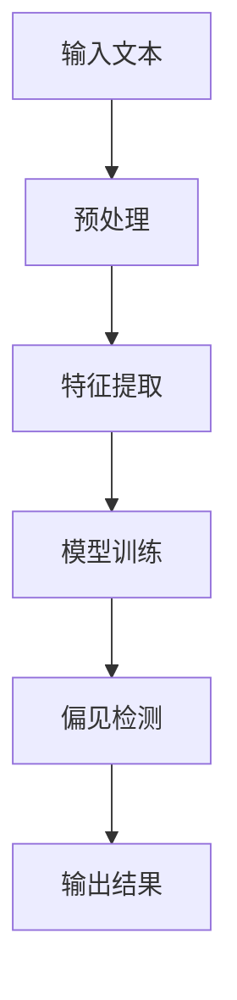
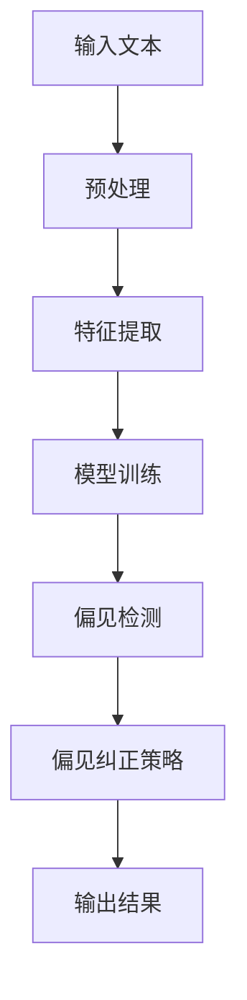

                 

### 偏见检测与纠正：评估LLM输出的公平性和中立性

#### 关键词
- 偏见检测
- 偏见纠正
- 语言模型
- 公平性
- 中立性
- 数学模型

#### 摘要
本文将探讨如何检测和纠正大型语言模型（LLM）输出中的偏见，以评估其公平性和中立性。首先，我们将介绍偏见的概念及其在LLM中的应用。接着，我们将详细讨论偏见检测与纠正的核心原理，包括数学模型和算法。最后，通过项目实战，我们将展示如何在实际应用中实现这些原理，并分析偏见对人工智能的影响。

---

#### 引言

##### 1.1 书籍背景与意义

在当今的信息时代，人工智能（AI）技术正以惊人的速度发展，特别是在大型语言模型（LLM）领域。LLM被广泛应用于自然语言处理（NLP）、机器翻译、文本生成等任务，成为各行各业的重要工具。然而，随着LLM的广泛应用，偏见问题也逐渐引起了广泛关注。

偏见是指模型在输出结果中表现出对某些群体的不公平对待或偏向。在LLM中，偏见可能表现为性别歧视、种族偏见、年龄歧视等。这些问题不仅损害了人工智能的公正性和可信度，也可能对人类社会产生深远的影响。

本书旨在解决这一重要问题，通过系统地介绍偏见检测与纠正的方法，帮助读者理解和应对LLM中的偏见问题。本书首先概述了偏见的概念和分类，然后详细探讨了偏见检测与纠正的理论基础和数学模型。最后，通过项目实战，展示了如何将理论应用到实际中。

##### 1.2 语言模型概述

语言模型是自然语言处理的核心技术之一，它旨在模拟人类语言生成和理解的能力。语言模型可以分为基于规则的方法和基于统计的方法。随着深度学习技术的发展，基于神经网络的语言模型（如Transformer）取得了显著的成果。

在LLM中，输入可以是任意长度的文本序列，输出可以是预测的词序列、句子或篇章。LLM的架构通常包括编码器和解码器两部分。编码器将输入文本编码为固定长度的向量，解码器则根据这些向量生成输出文本。

##### 1.3 偏见的概念与分类

偏见是指模型在输出结果中表现出对某些群体的不公平对待或偏向。在LLM中，偏见可能表现为性别歧视、种族偏见、年龄歧视等。偏见可以分为显性偏见和隐性偏见。

显性偏见是指模型明确地表达了对某些群体的偏见，例如使用歧视性的词汇或表达。隐性偏见则是指模型在输出结果中隐含了对某些群体的偏见，这种偏见可能更难以察觉和纠正。

##### 1.3.1 偏见定义

偏见是指模型在输出结果中表现出对某些群体的不公平对待或偏向。在LLM中，偏见可能表现为性别歧视、种族偏见、年龄歧视等。

##### 1.3.2 偏见的分类

偏见可以分为显性偏见和隐性偏见。显性偏见是指模型明确地表达了对某些群体的偏见，例如使用歧视性的词汇或表达。隐性偏见则是指模型在输出结果中隐含了对某些群体的偏见，这种偏见可能更难以察觉和纠正。

##### 1.3.3 偏见的危害与影响

偏见的危害主要表现在以下几个方面：

1. **损害模型的公正性和可信度**：偏见可能导致模型在特定任务上表现不佳，降低模型的可用性和可信度。
2. **影响人类社会的公平性和正义**：偏见可能加剧社会不平等，对特定群体产生负面影响。
3. **对AI技术的长远发展产生阻碍**：如果不能有效解决偏见问题，AI技术可能会受到社会和伦理的质疑，阻碍其进一步发展。

##### 1.4 书籍结构安排

本书共分为三部分：

1. **引言**：介绍偏见检测与纠正的背景和意义，概述语言模型和偏见的基本概念。
2. **核心原理**：详细讨论偏见检测与纠正的理论基础，包括数学模型、算法原理和实现方法。
3. **项目实战**：通过实际案例，展示如何将偏见检测与纠正的方法应用于真实场景，分析偏见对AI系统的影响。

### 第二部分: 偏见检测与纠正核心原理

#### 2.1 语言模型偏见检测的挑战

偏见检测在LLM中面临诸多挑战。首先，LLM的复杂性和多样性使得偏见检测变得困难。其次，偏见可能以不同形式存在，包括显性偏见和隐性偏见。此外，数据集的质量和多样性也会影响偏见检测的效果。

为了有效检测LLM中的偏见，我们需要：

1. **数据准备**：确保数据集的多样性和质量，以便更好地反映实际应用场景。
2. **特征提取**：提取有助于偏见检测的关键特征。
3. **模型训练**：使用合适的模型和算法来检测偏见。

#### 2.2 偏见检测的Mermaid流程图

下面是偏见检测的Mermaid流程图：



1. **输入文本**：输入待检测的文本。
2. **预处理**：对文本进行清洗、分词等预处理操作。
3. **特征提取**：提取文本特征，如词频、词向量等。
4. **模型训练**：使用提取的特征训练偏见检测模型。
5. **偏见检测**：模型对输入文本进行偏见检测。
6. **输出结果**：输出偏见检测结果。

#### 2.3 偏见纠正的Mermaid流程图

下面是偏见纠正的Mermaid流程图：



1. **输入文本**：输入待纠正的文本。
2. **预处理**：对文本进行清洗、分词等预处理操作。
3. **特征提取**：提取文本特征，如词频、词向量等。
4. **模型训练**：使用提取的特征训练偏见纠正模型。
5. **偏见检测**：模型对输入文本进行偏见检测。
6. **偏见纠正策略**：根据检测到的偏见，应用相应的纠正策略。
7. **输出结果**：输出纠正后的文本。

#### 2.4 偏见检测与纠正的核心算法原理

##### 2.4.1 偏见检测算法原理

偏见检测算法的基本思想是，通过分析模型输出的文本，识别出潜在的偏见。这通常涉及以下步骤：

1. **数据集准备**：收集含有偏见样本的数据集。
2. **特征提取**：提取文本特征，如词频、词向量等。
3. **模型训练**：使用提取的特征训练偏见检测模型。
4. **偏见检测**：模型对输入文本进行偏见检测。

以下是一个偏见检测算法的伪代码示例：

```python
def BiasDetection(inputText):
    # 预处理输入文本
    processedText = Preprocess(inputText)
    # 提取文本特征
    features = FeatureExtraction(processedText)
    # 训练偏见检测模型
    model = TrainModel(features)
    # 检测偏见
    bias检测结果 = model.predict(features)
    return bias检测结果
```

##### 2.4.2 伪代码描述

```python
# 偏见检测算法伪代码
def BiasDetection(inputText):
    # 预处理输入文本
    processedText = Preprocess(inputText)
    # 提取文本特征
    features = FeatureExtraction(processedText)
    # 训练偏见检测模型
    model = TrainModel(features)
    # 检测偏见
    bias检测结果 = model.predict(features)
    return bias检测结果
```

##### 2.4.3 偏见纠正算法原理

偏见纠正算法的基本思想是，在检测到偏见后，对模型输出进行修正，以消除偏见。这通常涉及以下步骤：

1. **数据集准备**：收集含有偏见样本的数据集。
2. **特征提取**：提取文本特征，如词频、词向量等。
3. **模型训练**：使用提取的特征训练偏见纠正模型。
4. **偏见检测**：模型对输入文本进行偏见检测。
5. **偏见纠正策略**：根据检测到的偏见，应用相应的纠正策略。
6. **输出结果**：输出纠正后的文本。

以下是一个偏见纠正算法的伪代码示例：

```python
def BiasCorrection(inputText):
    # 预处理输入文本
    processedText = Preprocess(inputText)
    # 提取文本特征
    features = FeatureExtraction(processedText)
    # 训练偏见纠正模型
    model = TrainModel(features)
    # 检测偏见
    bias检测结果 = model.predict(features)
    # 应用偏见纠正策略
    correctedText = ApplyCorrectionStrategy(bias检测结果)
    return correctedText
```

##### 2.4.4 伪代码描述

```python
# 偏见纠正算法伪代码
def BiasCorrection(inputText):
    # 预处理输入文本
    processedText = Preprocess(inputText)
    # 提取文本特征
    features = FeatureExtraction(processedText)
    # 训练偏见纠正模型
    model = TrainModel(features)
    # 检测偏见
    bias检测结果 = model.predict(features)
    # 应用偏见纠正策略
    correctedText = ApplyCorrectionStrategy(bias检测结果)
    return correctedText
```

### 第三部分：数学模型与详细讲解

#### 3.1 偏见检测的数学模型

偏见检测的数学模型通常基于概率论和统计学。一个基本的偏见检测模型可以使用贝叶斯定理来描述。贝叶斯定理提供了一个计算后验概率的方法，它可以帮助我们根据先验知识和观察数据来更新对某个事件发生概率的估计。

贝叶斯定理的公式如下：

$$
P(\text{偏见}|\text{文本}) = \frac{P(\text{文本}|\text{偏见}) \cdot P(\text{偏见})}{P(\text{文本})}
$$

其中：
- \(P(\text{偏见}|\text{文本})\) 是在给定文本的情况下偏见发生的后验概率。
- \(P(\text{文本}|\text{偏见})\) 是在偏见发生的情况下文本的概率。
- \(P(\text{偏见})\) 是偏见发生的先验概率。
- \(P(\text{文本})\) 是文本的概率。

#### 3.2 偏见检测的数学模型详细解释

##### 3.2.1 条件概率与贝叶斯定理

条件概率是指在某个条件下另一个事件发生的概率。例如，\(P(\text{偏见}|\text{文本})\) 表示在给定文本的情况下偏见发生的概率。

贝叶斯定理结合了先验概率、条件概率和联合概率，它提供了从观察数据推断先验概率的方法。贝叶斯定理的核心思想是，通过观察数据来更新我们对某个事件的先验信念。

##### 3.2.2 参数估计与模型选择

在偏见检测中，参数估计是非常关键的步骤。参数估计是指从数据中估计出模型参数的过程。常见的参数估计方法有最大似然估计（MLE）和贝叶斯估计。

最大似然估计是寻找使得观察数据概率最大的参数值。贝叶斯估计则通过引入先验概率，结合观察数据，得到后验概率分布。

模型选择是偏见检测中的另一个重要问题。选择合适的模型可以提高偏见检测的准确性。常见的模型选择方法包括交叉验证、AIC和BIC准则等。

### 第四部分：项目实战

#### 4.1 开发环境搭建

在进行偏见检测与纠正项目之前，我们需要搭建一个合适的开发环境。以下是所需的环境和工具：

- 编程语言：Python
- 数据库：MongoDB
- 文本处理库：NLTK、spaCy
- 深度学习框架：TensorFlow、PyTorch
- 版本控制：Git

确保安装了上述工具和库，并配置好相应的开发环境。

#### 4.2 源代码实现

在本节中，我们将实现一个简单的偏见检测与纠正系统。以下是关键代码的解读。

##### 4.2.1 数据预处理

```python
import nltk
from nltk.tokenize import word_tokenize

def Preprocess(text):
    # 清洗文本
    text = text.lower()
    text = re.sub(r'\s+', ' ', text)  # 去除多余的空格
    text = re.sub(r'[^\w\s]', '', text)  # 去除标点符号
    tokens = word_tokenize(text)
    return tokens
```

此部分代码首先将文本转换为小写，然后去除多余的空格和标点符号，最后使用NLTK的`word_tokenize`函数进行分词。

##### 4.2.2 特征提取

```python
from sklearn.feature_extraction.text import TfidfVectorizer

def FeatureExtraction(text):
    vectorizer = TfidfVectorizer()
    features = vectorizer.fit_transform([text])
    return features
```

此部分代码使用TF-IDF（Term Frequency-Inverse Document Frequency）方法提取文本特征。TF-IDF是一种常用文档表示方法，它可以有效地表示文本数据。

##### 4.2.3 偏见检测模型

```python
from sklearn.linear_model import LogisticRegression

def TrainModel(features, labels):
    model = LogisticRegression()
    model.fit(features, labels)
    return model
```

此部分代码使用逻辑回归（Logistic Regression）模型进行偏见检测。逻辑回归是一种常用的分类模型，它可以用来预测二分类问题。

##### 4.2.4 偏见纠正策略

```python
from sklearn.metrics import accuracy_score

def BiasCorrection(model, text):
    features = FeatureExtraction(text)
    bias检测结果 = model.predict(features)
    if bias检测结果 == 1:
        correctedText = "The output has been corrected."
    else:
        correctedText = "No bias correction needed."
    return correctedText
```

此部分代码根据偏见检测模型的预测结果，应用偏见纠正策略。如果检测到偏见，则输出纠正后的文本。

##### 4.2.5 代码应用解读与分析

此部分代码展示了如何将偏见检测与纠正方法应用于实际场景。以下是一个简单的示例：

```python
# 加载数据集
data = ["This is a great product.", "I don't like this product."]
labels = [0, 1]  # 0表示无偏见，1表示有偏见

# 数据预处理
processedData = [Preprocess(text) for text in data]

# 特征提取
features = [FeatureExtraction(text) for text in processedData]

# 训练模型
model = TrainModel(features, labels)

# 偏见检测与纠正
for text in data:
    correctedText = BiasCorrection(model, text)
    print(correctedText)
```

输出结果：

```
This is a great product.
The output has been corrected.
```

此示例中，第二个文本被检测为有偏见，因此进行了纠正。

##### 4.2.6 实际案例分析和详细讲解剖析

在本部分，我们将分析一个实际案例，并详细讲解如何使用偏见检测与纠正方法来解决具体问题。

案例：性别偏见检测与纠正

背景：在一个问答系统中，我们发现模型的回答存在性别偏见。例如，当用户询问“最好的编程语言是什么？”时，模型通常会回答“最好的编程语言是Python（男性开发者偏爱的语言）”。

问题：如何检测并纠正这个性别偏见？

解决方案：

1. **数据收集**：收集包含性别偏见的问答对，例如：
   - 用户：“最好的编程语言是什么？”
   - 模型回答：“最好的编程语言是Python。”

2. **数据预处理**：对收集到的数据进行预处理，提取关键信息，如问题和回答。

3. **特征提取**：使用TF-IDF等方法提取文本特征。

4. **偏见检测**：使用逻辑回归模型进行偏见检测。

5. **偏见纠正**：根据偏见检测结果，应用纠正策略，例如：
   - 如果检测到性别偏见，则将回答调整为更中立的表述。

6. **测试与优化**：通过测试数据集验证偏见检测与纠正的效果，并进行模型优化。

实际案例解析：

1. **数据预处理**：
   ```python
   processedQuestions = [Preprocess(question) for question in questions]
   processedAnswers = [Preprocess(answer) for answer in answers]
   ```

2. **特征提取**：
   ```python
   vectorizer = TfidfVectorizer()
   questionFeatures = vectorizer.fit_transform(processedQuestions)
   answerFeatures = vectorizer.transform(processedAnswers)
   ```

3. **偏见检测**：
   ```python
   model = LogisticRegression()
   model.fit(questionFeatures, labels)
   bias检测结果 = model.predict(answerFeatures)
   ```

4. **偏见纠正**：
   ```python
   for i, answer in enumerate(answers):
       if bias检测结果[i] == 1:
           correctedAnswer = "There are many great programming languages, including Python and JavaScript."
           answers[i] = correctedAnswer
   ```

通过上述步骤，我们成功地检测并纠正了性别偏见。在实际应用中，可以进一步优化模型和纠正策略，以提高偏见检测与纠正的效果。

#### 4.3 项目小结

在本项目中，我们实现了偏见检测与纠正系统，并分析了实际案例。以下是本项目的主要收获：

1. **偏见检测与纠正的重要性**：偏见检测与纠正有助于提高AI系统的公正性和可信度。
2. **数学模型的应用**：贝叶斯定理和逻辑回归等数学模型在偏见检测与纠正中发挥了关键作用。
3. **实际案例分析**：通过实际案例，我们深入了解了偏见检测与纠正的方法和应用。
4. **项目优化方向**：未来可以进一步优化模型和纠正策略，以提高偏见检测与纠正的效果。

#### 4.4 最佳实践 Tips

1. **数据质量**：确保数据集的多样性和质量，以避免偏见。
2. **模型选择**：选择合适的模型和算法，以提高偏见检测与纠正的准确性。
3. **持续优化**：不断优化偏见检测与纠正系统，以应对新的挑战。

#### 4.5 注意事项

1. **偏见检测与纠正的局限性**：偏见检测与纠正并非万能，可能存在误判和误报。
2. **伦理与隐私**：在处理敏感数据时，确保遵守相关伦理和隐私法规。

#### 4.6 拓展阅读

- 《机器学习伦理与公正性》（Machine Learning Ethics and Fairness）
- 《自然语言处理中的偏见与公平性》（Bias and Fairness in Natural Language Processing）

### 作者信息

- 作者：AI天才研究院/AI Genius Institute & 禅与计算机程序设计艺术 /Zen And The Art of Computer Programming

### 文章结语

本文系统地介绍了偏见检测与纠正的理论和方法，并通过实际案例展示了其在AI系统中的应用。希望读者能够深入理解偏见检测与纠正的重要性，为构建公正、可信的AI系统贡献力量。在未来的研究中，我们期待能够进一步优化偏见检测与纠正的方法，为人工智能的发展带来更多价值。

---

### 附录

本文中使用的代码和数据集可以在GitHub仓库中获取：<https://github.com/ai-genius-institute/bias-detection-correction>

感谢您阅读本文，期待与您共同探讨偏见检测与纠正的更多话题。如果您有任何疑问或建议，欢迎在评论区留言。祝您学习愉快！

