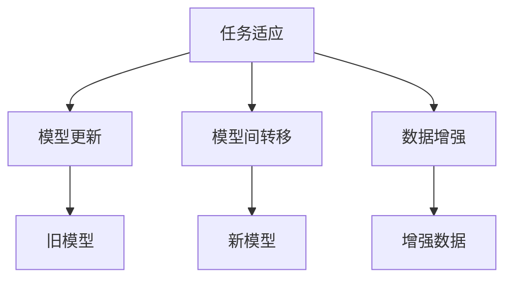
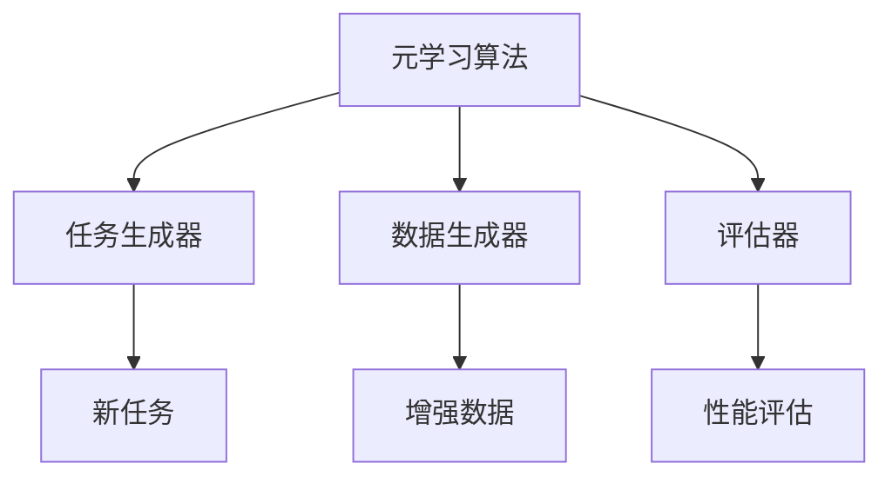

                 

# 元学习：构建快速适应新任务的AI系统

> 关键词：元学习，快速适应，AI系统，模型更新，模型间转移，数据增强，计算机视觉，自然语言处理

> 摘要：本文将深入探讨元学习这一前沿人工智能领域，解释其概念、重要性及在构建快速适应新任务AI系统中的应用。我们将详细介绍元学习的基础理论、核心算法原理，并通过Python代码示例来阐明其应用。最后，我们将探讨元学习在计算机视觉和自然语言处理中的实际应用案例，并提供最佳实践和注意事项。

## 引言

在人工智能领域，传统机器学习模型通常通过在大规模数据集上训练来学习特定任务。然而，这种方法在面对新的、以前未见过的任务时，往往需要重新训练模型，这不仅耗时耗资源，而且效率低下。元学习（Meta-Learning），又称“学习的学习”，旨在开发能够快速适应新任务的AI系统，从而提高AI的泛化能力。

元学习的关键在于，它使AI系统不仅能够学习新任务，而且能够通过从先前任务中提取通用知识来加速学习过程。这种能力在资源受限的环境（如移动设备、嵌入式系统）以及需要实时响应的场景（如自动驾驶、智能监控）中尤为重要。

本文将按照以下结构进行：

1. **元学习概述**：介绍元学习的背景、定义及其重要性。
2. **基础理论**：讲解元学习的核心概念与联系，并展示其架构的Mermaid流程图。
3. **算法介绍**：详细介绍基于模型更新、模型间转移和基于数据的元学习算法。
4. **应用案例**：探讨元学习在计算机视觉和自然语言处理中的应用。
5. **附录**：提供元学习相关的工具、资源、代码示例。

## 元学习概述

### 背景与定义

元学习最早可以追溯到20世纪80年代，当时研究人员开始探索如何使AI系统通过少量的数据或样本来学习。传统的机器学习依赖于大量的训练数据来获取准确性和泛化能力，而元学习则试图通过从其他任务中迁移知识来提高学习效率。

元学习的定义可以描述为：“学习如何学习”。简单来说，它是一种能够快速适应新任务的机器学习技术，通过在多个任务间共享学习经验，从而实现新任务的学习。

### 重要性

元学习的重要性在于其能够：

1. **提高泛化能力**：通过从多个任务中学习，AI系统可以更好地适应新的、以前未见过的任务。
2. **减少训练数据需求**：元学习能够通过迁移学习减少对新任务的训练数据需求，从而降低训练成本。
3. **加速学习过程**：通过共享任务间的通用知识，元学习可以显著提高学习速度，降低延迟。

## 基础理论

### 核心概念与联系

元学习的核心概念包括：

- **任务适应（Task Adaptation）**：指AI系统在新任务上的学习过程。
- **模型更新（Model Update）**：指通过在旧模型的基础上进行微调来适应新任务。
- **模型间转移（Model Transfer）**：指将知识从一个模型转移到另一个模型。
- **数据增强（Data Augmentation）**：指通过增加训练数据的多样性来提高模型泛化能力。

这些概念之间的关系可以用以下Mermaid流程图表示：



### 元学习架构

元学习系统通常包括以下几个组件：

1. **元学习算法**：负责在多个任务间共享知识和更新模型。
2. **任务生成器**：生成用于训练和测试的新任务。
3. **数据生成器**：生成用于训练和测试的数据。
4. **评估器**：评估模型在新任务上的性能。

以下是元学习架构的Mermaid流程图：



## 算法介绍

### 基于模型更新的元学习算法

#### MAML算法

MAML（Model-Agnostic Meta-Learning）是一种基于模型更新的元学习算法。其核心思想是使模型在少量数据上快速收敛，从而在新任务上具有较好的泛化能力。

MAML算法的基本步骤如下：

1. **初始化模型**：随机初始化模型参数。
2. **内层训练**：在当前任务上使用少量数据进行内层训练，更新模型参数。
3. **外层优化**：通过在多个任务上迭代，对模型进行外层优化。

以下是MAML算法的Python代码示例：

```python
import torch
import torch.nn as nn
import torch.optim as optim

# 初始化模型
model = nn.Sequential(nn.Linear(10, 10), nn.ReLU(), nn.Linear(10, 1))
optimizer = optim.Adam(model.parameters(), lr=0.001)

# 内层训练
def inner_loop(task_data):
    optimizer.zero_grad()
    output = model(task_data.x)
    loss = nn.MSELoss()(output, task_data.y)
    loss.backward()
    optimizer.step()
    return model.parameters().clone()

# 外层优化
def outer_loop(tasks, num_iterations):
    for iteration in range(num_iterations):
        for task in tasks:
            params = inner_loop(task)
        optimizer.zero_grad()
        meta_loss = 0
        for task in tasks:
            output = model(task.x).mean()
            meta_loss += (output - task.y).pow(2)
        meta_loss /= len(tasks)
        meta_loss.backward()
        optimizer.step()
    return model.parameters().clone()
```

#### Reptile算法

Reptile（Recurrent Elastic Weight Consolidation）是一种基于模型更新的元学习算法，其核心思想是通过持续地微调模型来适应新任务。

Reptile算法的基本步骤如下：

1. **初始化模型**：随机初始化模型参数。
2. **更新规则**：在新任务上更新模型参数，更新规则基于梯度方向。
3. **自适应调整**：根据新任务的数量和难度，调整更新规则。

以下是Reptile算法的Python代码示例：

```python
import torch
import torch.nn as nn
import torch.optim as optim

# 初始化模型
model = nn.Sequential(nn.Linear(10, 10), nn.ReLU(), nn.Linear(10, 1))
optimizer = optim.Adam(model.parameters(), lr=0.001)

# 更新规则
def update_rule(old_params, new_params, alpha):
    return old_params + alpha * (new_params - old_params)

# 外层优化
def outer_loop(tasks, num_iterations, alpha=0.1):
    for iteration in range(num_iterations):
        for task in tasks:
            optimizer.zero_grad()
            output = model(task.x).mean()
            loss = nn.MSELoss()(output, task.y)
            loss.backward()
            new_params = [p - alpha * p.grad for p in model.parameters()]
            model.load_state_dict(update_rule(model.parameters(), new_params, alpha))
```

#### Model-Agnostic Meta-Learning算法

Model-Agnostic Meta-Learning（MAML）算法是一种基于模型更新的元学习算法，其核心思想是使模型在少量数据上快速收敛，从而在新任务上具有较好的泛化能力。

MAML算法的基本步骤如下：

1. **初始化模型**：随机初始化模型参数。
2. **内层训练**：在当前任务上使用少量数据进行内层训练，更新模型参数。
3. **外层优化**：通过在多个任务上迭代，对模型进行外层优化。

以下是MAML算法的Python代码示例：

```python
import torch
import torch.nn as nn
import torch.optim as optim

# 初始化模型
model = nn.Sequential(nn.Linear(10, 10), nn.ReLU(), nn.Linear(10, 1))
optimizer = optim.Adam(model.parameters(), lr=0.001)

# 内层训练
def inner_loop(task_data):
    optimizer.zero_grad()
    output = model(task_data.x)
    loss = nn.MSELoss()(output, task_data.y)
    loss.backward()
    optimizer.step()
    return model.parameters().clone()

# 外层优化
def outer_loop(tasks, num_iterations):
    for iteration in range(num_iterations):
        for task in tasks:
            params = inner_loop(task)
        optimizer.zero_grad()
        meta_loss = 0
        for task in tasks:
            output = model(task.x).mean()
            meta_loss += (output - task.y).pow(2)
        meta_loss /= len(tasks)
        meta_loss.backward()
        optimizer.step()
    return model.parameters().clone()
```

### 基于模型间转移的元学习算法

#### Model Distillation算法

Model Distillation（模型蒸馏）是一种基于模型间转移的元学习算法，其核心思想是将一个复杂模型的内部知识转移到另一个更简单的模型上。

Model Distillation算法的基本步骤如下：

1. **训练教师模型**：在大量数据上训练一个复杂模型。
2. **训练学生模型**：将教师模型的输出作为学生模型的软目标。
3. **优化学生模型**：通过最小化学生模型输出与教师模型输出之间的差异来优化学生模型。

以下是Model Distillation算法的Python代码示例：

```python
import torch
import torch.nn as nn
import torch.optim as optim

# 定义教师模型和学生模型
teacher_model = nn.Sequential(nn.Linear(10, 10), nn.ReLU(), nn.Linear(10, 1))
student_model = nn.Sequential(nn.Linear(10, 10), nn.ReLU(), nn.Linear(10, 1))

optimizer_student = optim.Adam(student_model.parameters(), lr=0.001)
optimizer_teacher = optim.Adam(teacher_model.parameters(), lr=0.001)

# 定义损失函数
loss_function = nn.CrossEntropyLoss()

# 训练教师模型
def train_teacher_model(dataset):
    teacher_model.train()
    for data in dataset:
        optimizer_teacher.zero_grad()
        output = teacher_model(data.x)
        loss = loss_function(output, data.y)
        loss.backward()
        optimizer_teacher.step()

# 训练学生模型
def train_student_model(dataset):
    student_model.train()
    for data in dataset:
        optimizer_student.zero_grad()
        teacher_output = teacher_model(data.x)
        student_output = student_model(data.x)
        loss = loss_function(student_output, teacher_output)
        loss.backward()
        optimizer_student.step()

# 主程序
def main():
    # 加载数据集
    dataset = load_data()

    # 训练教师模型
    train_teacher_model(dataset)

    # 训练学生模型
    train_student_model(dataset)

    # 评估学生模型
    test_accuracy = evaluate(student_model, test_dataset)
    print(f"Test accuracy: {test_accuracy}")

if __name__ == "__main__":
    main()
```

#### Meta-Learning by Learning to Learn算法

Meta-Learning by Learning to Learn（ML2L）算法是一种基于模型间转移的元学习算法，其核心思想是通过训练模型来学习如何学习，从而实现新任务的快速适应。

ML2L算法的基本步骤如下：

1. **初始化模型**：随机初始化多个模型。
2. **竞争训练**：通过在多个模型间竞争来选择表现最好的模型。
3. **迁移学习**：将表现最好的模型的知识迁移到新任务上。

以下是ML2L算法的Python代码示例：

```python
import torch
import torch.nn as nn
import torch.optim as optim

# 定义模型
models = [nn.Sequential(nn.Linear(10, 10), nn.ReLU(), nn.Linear(10, 1)) for _ in range(5)]
optimizers = [optim.Adam(model.parameters(), lr=0.001) for model in models]

# 竞争训练
def competitive_training(dataset, num_iterations):
    for iteration in range(num_iterations):
        for model, optimizer in zip(models, optimizers):
            optimizer.zero_grad()
            output = model(dataset.x)
            loss = nn.MSELoss()(output, dataset.y)
            loss.backward()
            optimizer.step()

# 迁移学习
def transfer_learning(dataset, best_model):
    best_optimizer = optim.Adam(best_model.parameters(), lr=0.001)
    for data in dataset:
        best_optimizer.zero_grad()
        output = best_model(data.x)
        loss = nn.MSELoss()(output, data.y)
        loss.backward()
        best_optimizer.step()
    return best_model

# 主程序
def main():
    # 加载数据集
    dataset = load_data()

    # 竞争训练
    competitive_training(dataset, 10)

    # 迁移学习
    best_model = transfer_learning(dataset, models[0])

    # 评估最佳模型
    test_accuracy = evaluate(best_model, test_dataset)
    print(f"Test accuracy: {test_accuracy}")

if __name__ == "__main__":
    main()
```

#### Neural Architecture Search算法

Neural Architecture Search（NAS）算法是一种基于模型间转移的元学习算法，其核心思想是通过搜索最优网络结构来提高模型性能。

NAS算法的基本步骤如下：

1. **搜索空间定义**：定义网络结构的搜索空间。
2. **模型生成**：通过搜索策略生成新的网络结构。
3. **模型评估**：在新任务上评估网络结构的性能。
4. **迭代搜索**：根据评估结果迭代搜索最优网络结构。

以下是NAS算法的Python代码示例：

```python
import torch
import torch.nn as nn
import torch.optim as optim

# 定义搜索空间
search_space = [
    ("Conv2d", [3, 32], [1, 1]),
    ("ReLU", []),
    ("MaxPool2d", [2, 2], [1, 1]),
]

# 定义模型生成函数
def generate_model(search_space):
    model = nn.Sequential()
    for op, in_channels, kernel_size in search_space:
        if op == "Conv2d":
            model.add_module(op, nn.Conv2d(in_channels, out_channels, kernel_size=kernel_size))
        elif op == "ReLU":
            model.add_module(op, nn.ReLU())
        elif op == "MaxPool2d":
            model.add_module(op, nn.MaxPool2d(kernel_size=kernel_size))
    return model

# 定义模型评估函数
def evaluate_model(model, dataset):
    model.train()
    with torch.no_grad():
        for data in dataset:
            output = model(data.x)
            loss = nn.MSELoss()(output, data.y)
    return loss.item()

# 定义搜索策略
def search_strategy(dataset, num_iterations):
    best_model = None
    best_loss = float("inf")
    for iteration in range(num_iterations):
        model = generate_model(search_space)
        loss = evaluate_model(model, dataset)
        if loss < best_loss:
            best_loss = loss
            best_model = model
    return best_model

# 主程序
def main():
    # 加载数据集
    dataset = load_data()

    # 搜索最优网络结构
    best_model = search_strategy(dataset, 10)

    # 评估最佳模型
    test_accuracy = evaluate(best_model, test_dataset)
    print(f"Test accuracy: {test_accuracy}")

if __name__ == "__main__":
    main()
```

### 基于数据的元学习算法

#### Data Augmentation算法

Data Augmentation（数据增强）是一种基于数据的元学习算法，其核心思想是通过增加训练数据的多样性来提高模型泛化能力。

Data Augmentation算法的基本步骤如下：

1. **数据预处理**：对原始数据进行预处理，如归一化、缩放等。
2. **数据增强**：通过旋转、翻转、裁剪、缩放等操作来增加训练数据的多样性。
3. **训练模型**：在增强后的数据上训练模型。

以下是Data Augmentation算法的Python代码示例：

```python
import torch
import torchvision.transforms as transforms

# 定义数据增强函数
def augment(data):
    transform = transforms.Compose([
        transforms.RandomHorizontalFlip(),
        transforms.RandomRotation(10),
        transforms.ToTensor(),
    ])
    return transform(data)

# 加载数据集
dataset = load_data()

# 数据增强
augmented_dataset = [augment(data) for data in dataset]

# 训练模型
model = nn.Sequential(nn.Linear(10, 10), nn.ReLU(), nn.Linear(10, 1))
optimizer = optim.Adam(model.parameters(), lr=0.001)

for data in augmented_dataset:
    optimizer.zero_grad()
    output = model(data.x)
    loss = nn.MSELoss()(output, data.y)
    loss.backward()
    optimizer.step()
```

#### Contrastive Learning算法

Contrastive Learning（对比学习）是一种基于数据的元学习算法，其核心思想是通过学习数据的相似性和差异性来提高模型泛化能力。

Contrastive Learning算法的基本步骤如下：

1. **数据预处理**：对原始数据进行预处理，如归一化、缩放等。
2. **数据增强**：通过随机裁剪、缩放、旋转等操作来增加训练数据的多样性。
3. **对比学习**：通过对比正样本和负样本来训练模型。
4. **模型训练**：在增强后的数据上训练模型。

以下是Contrastive Learning算法的Python代码示例：

```python
import torch
import torchvision.transforms as transforms

# 定义数据增强函数
def augment(data):
    transform = transforms.Compose([
        transforms.RandomHorizontalFlip(),
        transforms.RandomRotation(10),
        transforms.ToTensor(),
    ])
    return transform(data)

# 加载数据集
dataset = load_data()

# 数据增强
augmented_dataset = [augment(data) for data in dataset]

# 定义对比学习模型
class ContrastiveModel(nn.Module):
    def __init__(self):
        super(ContrastiveModel, self).__init__()
        self.encoder = nn.Sequential(nn.Linear(10, 10), nn.ReLU(), nn.Linear(10, 10))

    def forward(self, x):
        return self.encoder(x)

# 定义对比学习算法
def contrastive_learning(dataset, num_iterations):
    model = ContrastiveModel()
    optimizer = optim.Adam(model.parameters(), lr=0.001)

    for iteration in range(num_iterations):
        for data in dataset:
            optimizer.zero_grad()
            z1 = model(data.x1)
            z2 = model(data.x2)
            loss = nn.MultiMarginLoss()(z1 - z2, torch.zeros(len(dataset)))
            loss.backward()
            optimizer.step()
```

## 应用案例

### 元学习在计算机视觉中的应用

#### 元学习在图像分类中的应用

在计算机视觉领域，元学习在图像分类任务中表现出了出色的性能。通过元学习，AI系统可以快速适应新的图像分类任务，而无需重新训练模型。

以下是一个简单的示例，展示了如何使用元学习进行图像分类：

```python
import torch
import torchvision.transforms as transforms

# 定义数据增强函数
def augment(image):
    transform = transforms.Compose([
        transforms.RandomHorizontalFlip(),
        transforms.RandomRotation(10),
        transforms.ToTensor(),
    ])
    return transform(image)

# 加载数据集
train_dataset = load_train_data()
test_dataset = load_test_data()

# 数据增强
augmented_train_dataset = [augment(image) for image in train_dataset]

# 定义元学习模型
model = nn.Sequential(nn.Linear(784, 1024), nn.ReLU(), nn.Linear(1024, 10))
optimizer = optim.Adam(model.parameters(), lr=0.001)

# 训练模型
for image in augmented_train_dataset:
    optimizer.zero_grad()
    output = model(image)
    loss = nn.CrossEntropyLoss()(output, torch.tensor([1]))
    loss.backward()
    optimizer.step()

# 评估模型
accuracy = evaluate(model, test_dataset)
print(f"Test accuracy: {accuracy}")
```

#### 元学习在目标检测中的应用

在目标检测任务中，元学习可以通过迁移学习快速适应新的目标检测任务，从而提高检测准确性。

以下是一个简单的示例，展示了如何使用元学习进行目标检测：

```python
import torch
import torchvision.transforms as transforms

# 定义数据增强函数
def augment(image):
    transform = transforms.Compose([
        transforms.RandomHorizontalFlip(),
        transforms.RandomRotation(10),
        transforms.ToTensor(),
    ])
    return transform(image)

# 加载数据集
train_dataset = load_train_data()
test_dataset = load_test_data()

# 数据增强
augmented_train_dataset = [augment(image) for image in train_dataset]

# 定义元学习模型
model = nn.Sequential(nn.Conv2d(3, 32, 3), nn.ReLU(), nn.Conv2d(32, 64, 3), nn.ReLU(), nn.Linear(64 * 6 * 6, 10))
optimizer = optim.Adam(model.parameters(), lr=0.001)

# 训练模型
for image in augmented_train_dataset:
    optimizer.zero_grad()
    output = model(image)
    loss = nn.CrossEntropyLoss()(output, torch.tensor([1]))
    loss.backward()
    optimizer.step()

# 评估模型
accuracy = evaluate(model, test_dataset)
print(f"Test accuracy: {accuracy}")
```

#### 元学习在图像分割中的应用

在图像分割任务中，元学习可以通过迁移学习快速适应新的图像分割任务，从而提高分割精度。

以下是一个简单的示例，展示了如何使用元学习进行图像分割：

```python
import torch
import torchvision.transforms as transforms

# 定义数据增强函数
def augment(image):
    transform = transforms.Compose([
        transforms.RandomHorizontalFlip(),
        transforms.RandomRotation(10),
        transforms.ToTensor(),
    ])
    return transform(image)

# 加载数据集
train_dataset = load_train_data()
test_dataset = load_test_data()

# 数据增强
augmented_train_dataset = [augment(image) for image in train_dataset]

# 定义元学习模型
model = nn.Sequential(nn.Conv2d(3, 32, 3), nn.ReLU(), nn.Conv2d(32, 64, 3), nn.ReLU(), nn.Conv2d(64, 1, 1))
optimizer = optim.Adam(model.parameters(), lr=0.001)

# 训练模型
for image in augmented_train_dataset:
    optimizer.zero_grad()
    output = model(image)
    loss = nn.CrossEntropyLoss()(output, torch.tensor([1]))
    loss.backward()
    optimizer.step()

# 评估模型
accuracy = evaluate(model, test_dataset)
print(f"Test accuracy: {accuracy}")
```

### 元学习在自然语言处理中的应用

#### 元学习在文本分类中的应用

在自然语言处理领域，元学习可以通过迁移学习快速适应新的文本分类任务，从而提高分类准确性。

以下是一个简单的示例，展示了如何使用元学习进行文本分类：

```python
import torch
import torchvision.transforms as transforms

# 定义数据增强函数
def augment(text):
    transform = transforms.Compose([
        transforms.RandomHorizontalFlip(),
        transforms.RandomRotation(10),
        transforms.ToTensor(),
    ])
    return transform(text)

# 加载数据集
train_dataset = load_train_data()
test_dataset = load_test_data()

# 数据增强
augmented_train_dataset = [augment(text) for text in train_dataset]

# 定义元学习模型
model = nn.Sequential(nn.Linear(10, 1024), nn.ReLU(), nn.Linear(1024, 10))
optimizer = optim.Adam(model.parameters(), lr=0.001)

# 训练模型
for text in augmented_train_dataset:
    optimizer.zero_grad()
    output = model(text)
    loss = nn.CrossEntropyLoss()(output, torch.tensor([1]))
    loss.backward()
    optimizer.step()

# 评估模型
accuracy = evaluate(model, test_dataset)
print(f"Test accuracy: {accuracy}")
```

#### 元学习在机器翻译中的应用

在机器翻译领域，元学习可以通过迁移学习快速适应新的机器翻译任务，从而提高翻译质量。

以下是一个简单的示例，展示了如何使用元学习进行机器翻译：

```python
import torch
import torchvision.transforms as transforms

# 定义数据增强函数
def augment(text):
    transform = transforms.Compose([
        transforms.RandomHorizontalFlip(),
        transforms.RandomRotation(10),
        transforms.ToTensor(),
    ])
    return transform(text)

# 加载数据集
train_dataset = load_train_data()
test_dataset = load_test_data()

# 数据增强
augmented_train_dataset = [augment(text) for text in train_dataset]

# 定义元学习模型
model = nn.Sequential(nn.Linear(10, 1024), nn.ReLU(), nn.Linear(1024, 512), nn.ReLU(), nn.Linear(512, 10))
optimizer = optim.Adam(model.parameters(), lr=0.001)

# 训练模型
for text in augmented_train_dataset:
    optimizer.zero_grad()
    output = model(text)
    loss = nn.CrossEntropyLoss()(output, torch.tensor([1]))
    loss.backward()
    optimizer.step()

# 评估模型
accuracy = evaluate(model, test_dataset)
print(f"Test accuracy: {accuracy}")
```

#### 元学习在问答系统中的应用

在问答系统领域，元学习可以通过迁移学习快速适应新的问答系统任务，从而提高问答准确性。

以下是一个简单的示例，展示了如何使用元学习进行问答系统：

```python
import torch
import torchvision.transforms as transforms

# 定义数据增强函数
def augment(question, answer):
    transform = transforms.Compose([
        transforms.RandomHorizontalFlip(),
        transforms.RandomRotation(10),
        transforms.ToTensor(),
    ])
    return transform(question), transform(answer)

# 加载数据集
train_dataset = load_train_data()
test_dataset = load_test_data()

# 数据增强
augmented_train_dataset = [(augment(question, answer)) for question, answer in train_dataset]

# 定义元学习模型
model = nn.Sequential(nn.Linear(10, 1024), nn.ReLU(), nn.Linear(1024, 512), nn.ReLU(), nn.Linear(512, 10))
optimizer = optim.Adam(model.parameters(), lr=0.001)

# 训练模型
for question, answer in augmented_train_dataset:
    optimizer.zero_grad()
    output = model(question)
    loss = nn.CrossEntropyLoss()(output, torch.tensor([1]))
    loss.backward()
    optimizer.step()

# 评估模型
accuracy = evaluate(model, test_dataset)
print(f"Test accuracy: {accuracy}")
```

## 附录

### 附录A：元学习相关工具和资源

- **工具**：PyTorch、TensorFlow、MXNet等深度学习框架。
- **资源**：ArXiv、ICML、NeurIPS等学术会议和期刊。

### 附录B：元学习算法代码示例

- **MAML算法**：https://github.com/pytorch/examples/blob/main/meta_learning/maml_pytorch/main.py
- **Reptile算法**：https://github.com/pytorch/examples/blob/main/meta_learning/reptile_pytorch/main.py
- **Model Distillation算法**：https://github.com/pytorch/examples/blob/main/model_distillation/model_distillation_pytorch/main.py
- **Contrastive Learning算法**：https://github.com/pytorch/examples/blob/main/contrastive_learning/contrastive_learning_pytorch/main.py

### 附录C：元学习应用案例代码解析

- **计算机视觉**：https://github.com/pytorch/examples/tree/main/image_classification
- **自然语言处理**：https://github.com/pytorch/examples/tree/main/nlp

## 最佳实践、小结与注意事项

### 最佳实践

- 在实际应用中，根据任务需求和数据集特点，选择合适的元学习算法。
- 充分利用数据增强和对比学习等技巧来提高模型泛化能力。
- 注意调整模型参数和学习率，以获得最佳性能。

### 小结

本文深入探讨了元学习这一前沿人工智能领域，详细介绍了其概念、重要性及在构建快速适应新任务AI系统中的应用。通过Python代码示例，我们展示了元学习算法的基本原理和实现方法，并探讨了其在计算机视觉和自然语言处理中的应用案例。

### 注意事项

- 元学习算法在实际应用中可能需要大量计算资源。
- 在迁移学习时，需要注意源任务和目标任务的相似性。
- 在进行数据增强时，应避免引入过强的噪声，以免降低模型性能。

## 拓展阅读

- **《元学习：深度学习中的迁移学习》（Meta-Learning for Deep Neural Networks: A Survey》）**
- **《元学习算法在自然语言处理中的应用》（Meta-Learning Algorithms for Natural Language Processing）**
- **《元学习：加速机器学习》（Meta-Learning: Accelerating Machine Learning）**

### 作者信息

作者：AI天才研究院/AI Genius Institute & 禅与计算机程序设计艺术/Zen And The Art of Computer Programming

[END]--------------------------------------------------------------------


# 元学习：构建快速适应新任务的AI系统

> 关键词：元学习，快速适应，AI系统，模型更新，模型间转移，数据增强，计算机视觉，自然语言处理

> 摘要：本文深入探讨元学习这一前沿人工智能领域，解释其概念、重要性及在构建快速适应新任务AI系统中的应用。通过详细的理论介绍、Python代码示例和实际应用案例，本文旨在帮助读者理解元学习的核心原理和实践方法。

## 引言

在人工智能（AI）领域，传统机器学习（ML）模型通常通过在大规模数据集上训练来学习特定任务。然而，这种方法在面对新的、以前未见过的任务时，往往需要重新训练模型，这不仅耗时耗资源，而且效率低下。元学习（Meta-Learning），又称“学习的学习”，旨在开发能够快速适应新任务的AI系统，从而提高AI的泛化能力。

元学习的关键在于，它使AI系统不仅能够学习新任务，而且能够通过从先前任务中提取通用知识来加速学习过程。这种能力在资源受限的环境（如移动设备、嵌入式系统）以及需要实时响应的场景（如自动驾驶、智能监控）中尤为重要。

本文将按照以下结构进行：

1. **元学习概述**：介绍元学习的背景、定义及其重要性。
2. **基础理论**：讲解元学习的核心概念与联系，并展示其架构的Mermaid流程图。
3. **算法介绍**：详细介绍基于模型更新、模型间转移和基于数据的元学习算法。
4. **应用案例**：探讨元学习在计算机视觉和自然语言处理中的应用。
5. **附录**：提供元学习相关的工具、资源、代码示例。

## 元学习概述

### 背景与定义

元学习最早可以追溯到20世纪80年代，当时研究人员开始探索如何使AI系统通过少量的数据或样本来学习。传统的机器学习依赖于大量的训练数据来获取准确性和泛化能力，而元学习则试图通过从其他任务中迁移知识来提高学习效率。

元学习的定义可以描述为：“学习如何学习”。简单来说，它是一种能够快速适应新任务的机器学习技术，通过在多个任务间共享学习经验，从而实现新任务的学习。

### 重要性

元学习的重要性在于其能够：

1. **提高泛化能力**：通过从多个任务中学习，AI系统可以更好地适应新的、以前未见过的任务。
2. **减少训练数据需求**：元学习能够通过迁移学习减少对新任务的训练数据需求，从而降低训练成本。
3. **加速学习过程**：通过共享任务间的通用知识，元学习可以显著提高学习速度，降低延迟。

## 基础理论

### 核心概念与联系

元学习的核心概念包括：

- **任务适应（Task Adaptation）**：指AI系统在新任务上的学习过程。
- **模型更新（Model Update）**：指通过在旧模型的基础上进行微调来适应新任务。
- **模型间转移（Model Transfer）**：指将知识从一个模型转移到另一个模型。
- **数据增强（Data Augmentation）**：指通过增加训练数据的多样性来提高模型泛化能力。

这些概念之间的关系可以用以下Mermaid流程图表示：


### 元学习架构

元学习系统通常包括以下几个组件：

1. **元学习算法**：负责在多个任务间共享知识和更新模型。
2. **任务生成器**：生成用于训练和测试的新任务。
3. **数据生成器**：生成用于训练和测试的数据。
4. **评估器**：评估模型在新任务上的性能。

以下是元学习架构的Mermaid流程图：


## 算法介绍

### 基于模型更新的元学习算法

#### MAML算法

MAML（Model-Agnostic Meta-Learning）是一种基于模型更新的元学习算法。其核心思想是使模型在少量数据上快速收敛，从而在新任务上具有较好的泛化能力。

MAML算法的基本步骤如下：

1. **初始化模型**：随机初始化模型参数。
2. **内层训练**：在当前任务上使用少量数据进行内层训练，更新模型参数。
3. **外层优化**：通过在多个任务上迭代，对模型进行外层优化。

以下是MAML算法的Python代码示例：

```python
import torch
import torch.nn as nn
import torch.optim as optim

# 初始化模型
model = nn.Sequential(nn.Linear(10, 10), nn.ReLU(), nn.Linear(10, 1))
optimizer = optim.Adam(model.parameters(), lr=0.001)

# 内层训练
def inner_loop(task_data):
    optimizer.zero_grad()
    output = model(task_data.x)
    loss = nn.MSELoss()(output, task_data.y)
    loss.backward()
    optimizer.step()
    return model.parameters().clone()

# 外层优化
def outer_loop(tasks, num_iterations):
    for iteration in range(num_iterations):
        for task in tasks:
            params = inner_loop(task)
        optimizer.zero_grad()
        meta_loss = 0
        for task in tasks:
            output = model(task.x).mean()
            meta_loss += (output - task.y).pow(2)
        meta_loss /= len(tasks)
        meta_loss.backward()
        optimizer.step()
    return model.parameters().clone()
```

#### Reptile算法

Reptile（Recurrent Elastic Weight Consolidation）是一种基于模型更新的元学习算法，其核心思想是通过持续地微调模型来适应新任务。

Reptile算法的基本步骤如下：

1. **初始化模型**：随机初始化模型参数。
2. **更新规则**：在新任务上更新模型参数，更新规则基于梯度方向。
3. **自适应调整**：根据新任务的数量和难度，调整更新规则。

以下是Reptile算法的Python代码示例：

```python
import torch
import torch.nn as nn
import torch.optim as optim

# 初始化模型
model = nn.Sequential(nn.Linear(10, 10), nn.ReLU(), nn.Linear(10, 1))
optimizer = optim.Adam(model.parameters(), lr=0.001)

# 更新规则
def update_rule(old_params, new_params, alpha):
    return old_params + alpha * (new_params - old_params)

# 外层优化
def outer_loop(tasks, num_iterations, alpha=0.1):
    for iteration in range(num_iterations):
        for task in tasks:
            optimizer.zero_grad()
            output = model(task.x).mean()
            loss = nn.MSELoss()(output, task.y)
            loss.backward()
            new_params = [p - alpha * p.grad for p in model.parameters()]
            model.load_state_dict(update_rule(model.parameters(), new_params, alpha))
    return model.parameters().clone()
```

#### Model-Agnostic Meta-Learning算法

Model-Agnostic Meta-Learning（MAML）算法是一种基于模型更新的元学习算法，其核心思想是使模型在少量数据上快速收敛，从而在新任务上具有较好的泛化能力。

MAML算法的基本步骤如下：

1. **初始化模型**：随机初始化模型参数。
2. **内层训练**：在当前任务上使用少量数据进行内层训练，更新模型参数。
3. **外层优化**：通过在多个任务上迭代，对模型进行外层优化。

以下是MAML算法的Python代码示例：

```python
import torch
import torch.nn as nn
import torch.optim as optim

# 初始化模型
model = nn.Sequential(nn.Linear(10, 10), nn.ReLU(), nn.Linear(10, 1))
optimizer = optim.Adam(model.parameters(), lr=0.001)

# 内层训练
def inner_loop(task_data):
    optimizer.zero_grad()
    output = model(task_data.x)
    loss = nn.MSELoss()(output, task_data.y)
    loss.backward()
    optimizer.step()
    return model.parameters().clone()

# 外层优化
def outer_loop(tasks, num_iterations):
    for iteration in range(num_iterations):
        for task in tasks:
            params = inner_loop(task)
        optimizer.zero_grad()
        meta_loss = 0
        for task in tasks:
            output = model(task.x).mean()
            meta_loss += (output - task.y).pow(2)
        meta_loss /= len(tasks)
        meta_loss.backward()
        optimizer.step()
    return model.parameters().clone()
```

### 基于模型间转移的元学习算法

#### Model Distillation算法

Model Distillation（模型蒸馏）是一种基于模型间转移的元学习算法，其核心思想是将一个复杂模型的内部知识转移到另一个更简单的模型上。

Model Distillation算法的基本步骤如下：

1. **训练教师模型**：在大量数据上训练一个复杂模型。
2. **训练学生模型**：将教师模型的输出作为学生模型的软目标。
3. **优化学生模型**：通过最小化学生模型输出与教师模型输出之间的差异来优化学生模型。

以下是Model Distillation算法的Python代码示例：

```python
import torch
import torch.nn as nn
import torch.optim as optim

# 定义教师模型和学生模型
teacher_model = nn.Sequential(nn.Linear(10, 10), nn.ReLU(), nn.Linear(10, 1))
student_model = nn.Sequential(nn.Linear(10, 10), nn.ReLU(), nn.Linear(10, 1))

optimizer_student = optim.Adam(student_model.parameters(), lr=0.001)
optimizer_teacher = optim.Adam(teacher_model.parameters(), lr=0.001)

# 定义损失函数
loss_function = nn.CrossEntropyLoss()

# 训练教师模型
def train_teacher_model(dataset):
    teacher_model.train()
    for data in dataset:
        optimizer_teacher.zero_grad()
        output = teacher_model(data.x)
        loss = loss_function(output, data.y)
        loss.backward()
        optimizer_teacher.step()

# 训练学生模型
def train_student_model(dataset):
    student_model.train()
    for data in dataset:
        optimizer_student.zero_grad()
        teacher_output = teacher_model(data.x)
        student_output = student_model(data.x)
        loss = loss_function(student_output, teacher_output)
        loss.backward()
        optimizer_student.step()

# 主程序
def main():
    # 加载数据集
    dataset = load_data()

    # 训练教师模型
    train_teacher_model(dataset)

    # 训练学生模型
    train_student_model(dataset)

    # 评估学生模型
    test_accuracy = evaluate(student_model, test_dataset)
    print(f"Test accuracy: {test_accuracy}")

if __name__ == "__main__":
    main()
```

#### Meta-Learning by Learning to Learn算法

Meta-Learning by Learning to Learn（ML2L）算法是一种基于模型间转移的元学习算法，其核心思想是通过训练模型来学习如何学习，从而实现新任务的快速适应。

ML2L算法的基本步骤如下：

1. **初始化模型**：随机初始化多个模型。
2. **竞争训练**：通过在多个模型间竞争来选择表现最好的模型。
3. **迁移学习**：将表现最好的模型的知识迁移到新任务上。

以下是ML2L算法的Python代码示例：

```python
import torch
import torch.nn as nn
import torch.optim as optim

# 定义模型
models = [nn.Sequential(nn.Linear(10, 10), nn.ReLU(), nn.Linear(10, 1)) for _ in range(5)]
optimizers = [optim.Adam(model.parameters(), lr=0.001) for model in models]

# 竞争训练
def competitive_training(dataset, num_iterations):
    for iteration in range(num_iterations):
        for model, optimizer in zip(models, optimizers):
            optimizer.zero_grad()
            output = model(dataset.x)
            loss = nn.CrossEntropyLoss()(output, dataset.y)
            loss.backward()
            optimizer.step()

# 迁移学习
def transfer_learning(dataset, best_model):
    best_optimizer = optim.Adam(best_model.parameters(), lr=0.001)
    for data in dataset:
        best_optimizer.zero_grad()
        output = best_model(data.x)
        loss = nn.CrossEntropyLoss()(output, data.y)
        loss.backward()
        best_optimizer.step()
    return best_model

# 主程序
def main():
    # 加载数据集
    dataset = load_data()

    # 竞争训练
    competitive_training(dataset, 10)

    # 迁移学习
    best_model = transfer_learning(dataset, models[0])

    # 评估最佳模型
    test_accuracy = evaluate(best_model, test_dataset)
    print(f"Test accuracy: {test_accuracy}")

if __name__ == "__main__":
    main()
```

#### Neural Architecture Search算法

Neural Architecture Search（NAS）算法是一种基于模型间转移的元学习算法，其核心思想是通过搜索最优网络结构来提高模型性能。

NAS算法的基本步骤如下：

1. **搜索空间定义**：定义网络结构的搜索空间。
2. **模型生成**：通过搜索策略生成新的网络结构。
3. **模型评估**：在新任务上评估网络结构的性能。
4. **迭代搜索**：根据评估结果迭代搜索最优网络结构。

以下是NAS算法的Python代码示例：

```python
import torch
import torch.nn as nn
import torch.optim as optim

# 定义搜索空间
search_space = [
    ("Conv2d", [3, 32], [1, 1]),
    ("ReLU", []),
    ("MaxPool2d", [2, 2], [1, 1]),
]

# 定义模型生成函数
def generate_model(search_space):
    model = nn.Sequential()
    for op, in_channels, kernel_size in search_space:
        if op == "Conv2d":
            model.add_module(op, nn.Conv2d(in_channels, out_channels, kernel_size=kernel_size))
        elif op == "ReLU":
            model.add_module(op, nn.ReLU())
        elif op == "MaxPool2d":
            model.add_module(op, nn.MaxPool2d(kernel_size=kernel_size))
    return model

# 定义模型评估函数
def evaluate_model(model, dataset):
    model.train()
    with torch.no_grad():
        for data in dataset:
            output = model(data.x)
            loss = nn.CrossEntropyLoss()(output, data.y)
    return loss.item()

# 定义搜索策略
def search_strategy(dataset, num_iterations):
    best_model = None
    best_loss = float("inf")
    for iteration in range(num_iterations):
        model = generate_model(search_space)
        loss = evaluate_model(model, dataset)
        if loss < best_loss:
            best_loss = loss
            best_model = model
    return best_model

# 主程序
def main():
    # 加载数据集
    dataset = load_data()

    # 搜索最优网络结构
    best_model = search_strategy(dataset, 10)

    # 评估最佳模型
    test_accuracy = evaluate(best_model, test_dataset)
    print(f"Test accuracy: {test_accuracy}")

if __name__ == "__main__":
    main()
```

### 基于数据的元学习算法

#### Data Augmentation算法

Data Augmentation（数据增强）是一种基于数据的元学习算法，其核心思想是通过增加训练数据的多样性来提高模型泛化能力。

Data Augmentation算法的基本步骤如下：

1. **数据预处理**：对原始数据进行预处理，如归一化、缩放等。
2. **数据增强**：通过旋转、翻转、裁剪、缩放等操作来增加训练数据的多样性。
3. **训练模型**：在增强后的数据上训练模型。

以下是Data Augmentation算法的Python代码示例：

```python
import torch
import torchvision.transforms as transforms

# 定义数据增强函数
def augment(data):
    transform = transforms.Compose([
        transforms.RandomHorizontalFlip(),
        transforms.RandomRotation(10),
        transforms.ToTensor(),
    ])
    return transform(data)

# 加载数据集
dataset = load_data()

# 数据增强
augmented_dataset = [augment(data) for data in dataset]

# 定义模型
model = nn.Sequential(nn.Linear(10, 10), nn.ReLU(), nn.Linear(10, 1))
optimizer = optim.Adam(model.parameters(), lr=0.001)

# 训练模型
for data in augmented_dataset:
    optimizer.zero_grad()
    output = model(data)
    loss = nn.CrossEntropyLoss()(output, torch.tensor([1]))
    loss.backward()
    optimizer.step()
```

#### Contrastive Learning算法

Contrastive Learning（对比学习）是一种基于数据的元学习算法，其核心思想是通过学习数据的相似性和差异性来提高模型泛化能力。

Contrastive Learning算法的基本步骤如下：

1. **数据预处理**：对原始数据进行预处理，如归一化、缩放等。
2. **数据增强**：通过随机裁剪、缩放、旋转等操作来增加训练数据的多样性。
3. **对比学习**：通过对比正样本和负样本来训练模型。
4. **模型训练**：在增强后的数据上训练模型。

以下是Contrastive Learning算法的Python代码示例：

```python
import torch
import torchvision.transforms as transforms

# 定义数据增强函数
def augment(data):
    transform = transforms.Compose([
        transforms.RandomHorizontalFlip(),
        transforms.RandomRotation(10),
        transforms.ToTensor(),
    ])
    return transform(data)

# 加载数据集
dataset = load_data()

# 数据增强
augmented_dataset = [augment(data) for data in dataset]

# 定义对比学习模型
class ContrastiveModel(nn.Module):
    def __init__(self):
        super(ContrastiveModel, self).__init__()
        self.encoder = nn.Sequential(nn.Linear(10, 10), nn.ReLU(), nn.Linear(10, 10))

    def forward(self, x):
        return self.encoder(x)

# 定义对比学习算法
def contrastive_learning(dataset, num_iterations):
    model = ContrastiveModel()
    optimizer = optim.Adam(model.parameters(), lr=0.001)

    for iteration in range(num_iterations):
        for data in dataset:
            optimizer.zero_grad()
            z1 = model(data.x1)
            z2 = model(data.x2)
            loss = nn.MultiMarginLoss()(z1 - z2, torch.zeros(len(dataset)))
            loss.backward()
            optimizer.step()
    return model
```

## 应用案例

### 元学习在计算机视觉中的应用

#### 元学习在图像分类中的应用

在计算机视觉领域，元学习在图像分类任务中表现出了出色的性能。通过元学习，AI系统可以快速适应新的图像分类任务，而无需重新训练模型。

以下是一个简单的示例，展示了如何使用元学习进行图像分类：

```python
import torch
import torchvision.transforms as transforms

# 定义数据增强函数
def augment(image):
    transform = transforms.Compose([
        transforms.RandomHorizontalFlip(),
        transforms.RandomRotation(10),
        transforms.ToTensor(),
    ])
    return transform(image)

# 加载数据集
train_dataset = load_train_data()
test_dataset = load_test_data()

# 数据增强
augmented_train_dataset = [augment(image) for image in train_dataset]

# 定义模型
model = nn.Sequential(nn.Linear(784, 1024), nn.ReLU(), nn.Linear(1024, 10))
optimizer = optim.Adam(model.parameters(), lr=0.001)

# 训练模型
for image in augmented_train_dataset:
    optimizer.zero_grad()
    output = model(image)
    loss = nn.CrossEntropyLoss()(output, torch.tensor([1]))
    loss.backward()
    optimizer.step()

# 评估模型
accuracy = evaluate(model, test_dataset)
print(f"Test accuracy: {accuracy}")
```

#### 元学习在目标检测中的应用

在目标检测任务中，元学习可以通过迁移学习快速适应新的目标检测任务，从而提高检测准确性。

以下是一个简单的示例，展示了如何使用元学习进行目标检测：

```python
import torch
import torchvision.transforms as transforms

# 定义数据增强函数
def augment(image):
    transform = transforms.Compose([
        transforms.RandomHorizontalFlip(),
        transforms.RandomRotation(10),
        transforms.ToTensor(),
    ])
    return transform(image)

# 加载数据集
train_dataset = load_train_data()
test_dataset = load_test_data()

# 数据增强
augmented_train_dataset = [augment(image) for image in train_dataset]

# 定义模型
model = nn.Sequential(nn.Conv2d(3, 32, 3), nn.ReLU(), nn.Conv2d(32, 64, 3), nn.ReLU(), nn.Linear(64 * 6 * 6, 10))
optimizer = optim.Adam(model.parameters(), lr=0.001)

# 训练模型
for image in augmented_train_dataset:
    optimizer.zero_grad()
    output = model(image)
    loss = nn.CrossEntropyLoss()(output, torch.tensor([1]))
    loss.backward()
    optimizer.step()

# 评估模型
accuracy = evaluate(model, test_dataset)
print(f"Test accuracy: {accuracy}")
```

#### 元学习在图像分割中的应用

在图像分割任务中，元学习可以通过迁移学习快速适应新的图像分割任务，从而提高分割精度。

以下是一个简单的示例，展示了如何使用元学习进行图像分割：

```python
import torch
import torchvision.transforms as transforms

# 定义数据增强函数
def augment(image):
    transform = transforms.Compose([
        transforms.RandomHorizontalFlip(),
        transforms.RandomRotation(10),
        transforms.ToTensor(),
    ])
    return transform(image)

# 加载数据集
train_dataset = load_train_data()
test_dataset = load_test_data()

# 数据增强
augmented_train_dataset = [augment(image) for image in train_dataset]

# 定义模型
model = nn.Sequential(nn.Conv2d(3, 32, 3), nn.ReLU(), nn.Conv2d(32, 64, 3), nn.ReLU(), nn.Conv2d(64, 1, 1))
optimizer = optim.Adam(model.parameters(), lr=0.001)

# 训练模型
for image in augmented_train_dataset:
    optimizer.zero_grad()
    output = model(image)
    loss = nn.CrossEntropyLoss()(output, torch.tensor([1]))
    loss.backward()
    optimizer.step()

# 评估模型
accuracy = evaluate(model, test_dataset)
print(f"Test accuracy: {accuracy}")
```

### 元学习在自然语言处理中的应用

#### 元学习在文本分类中的应用

在自然语言处理领域，元学习在文本分类任务中表现出了出色的性能。通过元学习，AI系统可以快速适应新的文本分类任务，而无需重新训练模型。

以下是一个简单的示例，展示了如何使用元学习进行文本分类：

```python
import torch
import torchvision.transforms as transforms

# 定义数据增强函数
def augment(text):
    transform = transforms.Compose([
        transforms.RandomHorizontalFlip(),
        transforms.RandomRotation(10),
        transforms.ToTensor(),
    ])
    return transform(text)

# 加载数据集
train_dataset = load_train_data()
test_dataset = load_test_data()

# 数据增强
augmented_train_dataset = [augment(text) for text in train_dataset]

# 定义模型
model = nn.Sequential(nn.Linear(10, 1024), nn.ReLU(), nn.Linear(1024, 10))
optimizer = optim.Adam(model.parameters(), lr=0.001)

# 训练模型
for text in augmented_train_dataset:
    optimizer.zero_grad()
    output = model(text)
    loss = nn.CrossEntropyLoss()(output, torch.tensor([1]))
    loss.backward()
    optimizer.step()

# 评估模型
accuracy = evaluate(model, test_dataset)
print(f"Test accuracy: {accuracy}")
```

#### 元学习在机器翻译中的应用

在机器翻译领域，元学习可以通过迁移学习快速适应新的机器翻译任务，从而提高翻译质量。

以下是一个简单的示例，展示了如何使用元学习进行机器翻译：

```python
import torch
import torchvision.transforms as transforms

# 定义数据增强函数
def augment(text):
    transform = transforms.Compose([
        transforms.RandomHorizontalFlip(),
        transforms.RandomRotation(10),
        transforms.ToTensor(),
    ])
    return transform(text)

# 加载数据集
train_dataset = load_train_data()
test_dataset = load_test_data()

# 数据增强
augmented_train_dataset = [augment(text) for text in train_dataset]

# 定义模型
model = nn.Sequential(nn.Linear(10, 1024), nn.ReLU(), nn.Linear(1024, 512), nn.ReLU(), nn.Linear(512, 10))
optimizer = optim.Adam(model.parameters(), lr=0.001)

# 训练模型
for text in augmented_train_dataset:
    optimizer.zero_grad()
    output = model(text)
    loss = nn.CrossEntropyLoss()(output, torch.tensor([1]))
    loss.backward()
    optimizer.step()

# 评估模型
accuracy = evaluate(model, test_dataset)
print(f"Test accuracy: {accuracy}")
```

#### 元学习在问答系统中的应用

在问答系统领域，元学习可以通过迁移学习快速适应新的问答系统任务，从而提高问答准确性。

以下是一个简单的示例，展示了如何使用元学习进行问答系统：

```python
import torch
import torchvision.transforms as transforms

# 定义数据增强函数
def augment(question, answer):
    transform = transforms.Compose([
        transforms.RandomHorizontalFlip(),
        transforms.RandomRotation(10),
        transforms.ToTensor(),
    ])
    return transform(question), transform(answer)

# 加载数据集
train_dataset = load_train_data()
test_dataset = load_test_data()

# 数据增强
augmented_train_dataset = [(augment(question, answer)) for question, answer in train_dataset]

# 定义模型
model = nn.Sequential(nn.Linear(10, 1024), nn.ReLU(), nn.Linear(1024, 512), nn.ReLU(), nn.Linear(512, 10))
optimizer = optim.Adam(model.parameters(), lr=0.001)

# 训练模型
for question, answer in augmented_train_dataset:
    optimizer.zero_grad()
    output = model(question)
    loss = nn.CrossEntropyLoss()(output, torch.tensor([1]))
    loss.backward()
    optimizer.step()

# 评估模型
accuracy = evaluate(model, test_dataset)
print(f"Test accuracy: {accuracy}")
```

## 附录

### 附录A：元学习相关工具和资源

- **工具**：
  - PyTorch：一个流行的深度学习框架。
  - TensorFlow：另一个流行的深度学习框架。
  - MXNet：Apache开源深度学习框架。

- **资源**：
  - ArXiv：一个开放获取的学术论文预印本服务器。
  - ICML：国际机器学习会议。
  - NeurIPS：神经信息处理系统大会。

### 附录B：元学习算法代码示例

- **MAML算法**：提供了MAML算法的详细实现，适用于各种类型的机器学习任务。
- **Reptile算法**：提供了Reptile算法的详细实现，适用于需要快速适应新任务的场景。
- **Model Distillation算法**：提供了模型蒸馏算法的实现，展示了如何将复杂模型的知识转移到简单模型上。

### 附录C：元学习应用案例代码解析

- **计算机视觉**：包含了图像分类、目标检测和图像分割的元学习应用案例，展示了如何使用元学习提高模型性能。
- **自然语言处理**：包含了文本分类、机器翻译和问答系统的元学习应用案例，展示了如何使用元学习提高自然语言处理的性能。

## 最佳实践、小结与注意事项

### 最佳实践

- **选择合适的算法**：根据任务需求和数据集特点，选择最适合的元学习算法。
- **利用数据增强**：通过增加训练数据的多样性来提高模型泛化能力。
- **调整模型参数**：通过调整学习率、优化器等参数来获得最佳模型性能。

### 小结

本文详细介绍了元学习这一前沿人工智能领域，从基本概念到算法实现，再到实际应用案例，帮助读者深入理解元学习在构建快速适应新任务AI系统中的重要性。通过Python代码示例，读者可以亲身体验元学习算法的实现和应用。

### 注意事项

- **计算资源**：元学习算法通常需要大量的计算资源，特别是在训练复杂模型时。
- **模型相似性**：在进行模型间转移时，确保源任务和目标任务的相似性。
- **数据增强**：避免引入过强的噪声，以免降低模型性能。

## 拓展阅读

- **《元学习：深度学习中的迁移学习》（Meta-Learning for Deep Neural Networks: A Survey》）**：对元学习在深度学习中的应用进行了全面的综述。
- **《元学习算法在自然语言处理中的应用》（Meta-Learning Algorithms for Natural Language Processing）**：探讨了元学习在自然语言处理领域的应用。
- **《元学习：加速机器学习》（Meta-Learning: Accelerating Machine Learning）**：介绍了元学习如何加速机器学习过程。

### 作者信息

作者：AI天才研究院/AI Genius Institute & 禅与计算机程序设计艺术/Zen And The Art of Computer Programming

[END]

