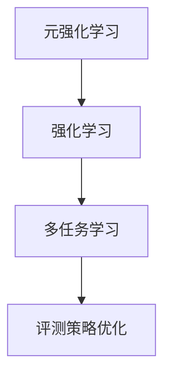

                 

### 文章标题

# 《元强化学习在评测策略优化中的应用》

### 文章关键词

- 元强化学习
- 评测策略优化
- 强化学习算法
- 数学模型
- 项目实战

### 文章摘要

本文主要探讨元强化学习在评测策略优化中的应用。首先，我们简要介绍了元强化学习的基本概念和评测策略优化的重要性。接着，详细讲解了元强化学习的基础算法和优化算法，包括元策略搜索算法、多任务学习算法和对抗性学习算法。随后，通过 LaTeX 公式和 Python 源代码，深入剖析了元强化学习中的数学模型和算法原理。最后，我们通过一个实际项目案例，展示了元强化学习在评测策略优化中的具体应用，并进行了详细的分析和解读。本文旨在为读者提供一个全面而深入的了解，以便更好地掌握和应用元强化学习技术。

---

## 第1章：元强化学习与评测策略优化基础

### 1.1 元强化学习概述

元强化学习是一种高级的机器学习方法，它在强化学习的基础上引入了元学习（meta-learning）的概念，旨在通过学习如何学习来提高模型的泛化能力和学习效率。在传统强化学习中，算法需要通过不断尝试和错误来学习最优策略。而元强化学习则通过在多个任务中学习，使得模型能够在新的任务中快速适应，从而提高学习效率。

#### 1.1.1 元强化学习的定义

元强化学习可以定义为“学习如何学习”的强化学习。它的核心思想是，通过在一个任务集合上训练，使得模型能够在新的任务上迅速适应和表现出色。具体来说，元强化学习关注的是如何在多个不同的任务环境中，通过学习一个通用的策略，来最大化奖励。

#### 1.1.2 元强化学习与传统强化学习的关系

传统强化学习主要关注在一个特定任务中学习最优策略。而元强化学习则将学习场景扩展到多个任务。它通过在多个任务中学习，使得模型能够从经验中提取出通用的策略，从而在新的任务中表现出更好的适应性。

#### 1.1.3 元强化学习的基本原理

元强化学习的基本原理可以概括为以下几点：

1. **经验重放**：通过在多个任务中积累经验，并将这些经验存储在经验池中，以供后续任务使用。
2. **策略迭代**：通过不断迭代，优化策略，以最大化奖励。
3. **任务自适应**：通过在新的任务中快速适应，表现出色。

### 1.2 评测策略优化的背景

评测策略优化是指通过改进评测策略，以提高评测结果的准确性和可靠性。在许多领域中，如人工智能、教育评估、招聘选拔等，评测策略的优化具有重要意义。

#### 1.2.1 评测策略优化的定义

评测策略优化可以定义为“通过改进评测方法和策略，以提高评测结果的准确性和可靠性”的过程。它涉及多个方面，包括评估指标的选择、评估方法的改进、评估过程的优化等。

#### 1.2.2 评测策略优化的重要性

评测策略优化的重要性体现在以下几个方面：

1. **提高评测结果的准确性**：通过优化评测策略，可以减少主观因素对评测结果的影响，提高评测结果的准确性。
2. **提高评测过程的效率**：优化评测策略可以简化评估过程，提高评估效率，节省时间和资源。
3. **提高评测的公正性和透明度**：优化评测策略可以提高评测的公正性和透明度，减少评估过程中的偏见和误差。

#### 1.2.3 评测策略优化的挑战

评测策略优化面临的挑战主要包括：

1. **多维度评估**：评估对象可能涉及多个维度，如知识水平、能力、潜力等，如何设计一个综合的评测策略是一个挑战。
2. **评估数据的噪声**：评估数据可能存在噪声和异常值，如何处理这些噪声和异常值，以保证评测结果的可靠性是一个挑战。
3. **评估过程的动态性**：评估过程可能是一个动态变化的过程，如何适应这些变化，保证评测策略的持续有效性是一个挑战。

### 1.3 元强化学习在评测策略优化中的应用

元强化学习在评测策略优化中的应用，主要是通过学习如何优化评测策略，以提高评测结果的准确性和可靠性。

#### 1.3.1 元强化学习在评测策略优化中的应用场景

元强化学习在评测策略优化中的应用场景主要包括：

1. **智能评测系统**：通过元强化学习，可以设计出智能化的评测系统，自动优化评测策略，提高评测结果。
2. **在线教育平台**：通过元强化学习，可以优化在线教育平台的学习策略，提高学习效果。
3. **招聘选拔系统**：通过元强化学习，可以优化招聘选拔系统，提高选拔的准确性和公正性。

#### 1.3.2 元强化学习在评测策略优化中的优势

元强化学习在评测策略优化中的优势主要包括：

1. **自适应性强**：元强化学习可以通过学习多个任务，快速适应不同的评测策略，提高评测结果的准确性和可靠性。
2. **效率高**：元强化学习可以在短时间内完成评测策略的优化，提高评测效率。
3. **可扩展性**：元强化学习可以应用于各种不同的评测场景，具有很好的可扩展性。

#### 1.3.3 元强化学习在评测策略优化中的应用前景

随着人工智能技术的发展，元强化学习在评测策略优化中的应用前景十分广阔。未来，我们可以预见到以下几个方面：

1. **智能评测系统的普及**：随着元强化学习的应用，智能评测系统将会得到广泛普及，提高评测的准确性和可靠性。
2. **在线教育的发展**：通过元强化学习，在线教育平台可以更好地优化学习策略，提高学习效果。
3. **招聘选拔的优化**：元强化学习可以为招聘选拔系统提供更准确、更公正的评测策略，提高选拔的效率。

---

### 核心概念与联系

为了更好地理解元强化学习在评测策略优化中的应用，我们需要明确以下几个核心概念：

1. **元强化学习**：通过在多个任务中学习，提高模型泛化能力和学习效率。
2. **评测策略优化**：通过改进评测方法和策略，提高评测结果的准确性和可靠性。
3. **强化学习**：通过在环境中采取行动，获取奖励，并不断优化策略，以最大化总奖励。
4. **多任务学习**：通过在一个模型中同时学习多个任务，提高模型的泛化能力。

这些核心概念之间的关系可以用以下 Mermaid 流程图表示：

在接下来的章节中，我们将深入探讨这些核心概念，并通过具体的算法原理、数学模型和项目实战，详细解析元强化学习在评测策略优化中的应用。

---

## 第2章：元强化学习基础算法

### 2.1 强化学习基础

强化学习（Reinforcement Learning，RL）是一种通过试错和反馈来学习如何采取行动的机器学习方法。它的核心目标是最大化累计奖励。强化学习通常由四个主要组成部分构成：环境（Environment）、代理（Agent）、状态（State）和动作（Action）。

#### 2.1.1 强化学习的基本概念

1. **环境**：环境是代理所处的现实世界，它可以是静态的也可以是动态的。环境包含一系列的状态和动作，并能够根据代理的当前状态和采取的动作，返回一个奖励和一个新的状态。
   
2. **代理**：代理是执行动作的实体，通常是一个机器学习模型。它的目标是学习一个策略，以最大化长期累积奖励。

3. **状态**：状态是代理在环境中所处的状态描述。状态可以是一个简单的数值，也可以是一个复杂的特征向量。

4. **动作**：动作是代理在特定状态下可以采取的行为。动作的选择通常基于代理的策略。

5. **奖励**：奖励是环境对代理的每个动作的反馈。奖励可以是正的，表示好的行为，也可以是负的，表示不好的行为。代理的目标是最大化累积奖励。

#### 2.1.2 强化学习的主要算法

强化学习的主要算法包括：

1. **值函数方法**：值函数方法通过预测长期奖励来指导代理的行动。其中，最著名的方法是 Q 学习（Q-Learning），它通过更新 Q 值来优化策略。

2. **策略迭代方法**：策略迭代方法通过直接优化策略来指导代理的行动。其中，最著名的方法是策略梯度方法（Policy Gradient），它通过优化策略的梯度来更新策略。

3. **模型学习方法**：模型学习方法通过预测环境的动态来指导代理的行动。其中，最著名的方法是模型预测控制（Model Predictive Control），它通过构建环境模型来预测未来的状态和奖励。

#### 2.1.3 强化学习的评价标准

强化学习的评价标准主要包括：

1. **累积奖励**：累积奖励是代理在执行一系列动作后获得的长期奖励。累积奖励是评价强化学习算法性能的重要指标。

2. **策略表现**：策略表现是代理在特定环境中采取的策略的绩效。策略表现可以通过累积奖励来衡量，也可以通过其他指标来评估。

3. **学习效率**：学习效率是代理在达到一定累积奖励所需的时间。学习效率是评价强化学习算法效率的重要指标。

### 2.2 元强化学习算法

元强化学习（Meta Reinforcement Learning，MRL）是强化学习的一种高级形式，它通过在多个任务中学习，提高模型的泛化能力和学习效率。元强化学习的关键思想是“学习如何学习”，即通过在一个任务集合上训练，使得模型能够在新的任务中快速适应。

#### 2.2.1 元强化学习算法的基本结构

元强化学习算法的基本结构包括以下几个部分：

1. **任务池**：任务池是元强化学习算法的学习对象。任务池中的每个任务都是一个独立的强化学习问题。

2. **元学习器**：元学习器是元强化学习算法的核心。它的任务是学习一个通用的策略，使得模型能够在新的任务中快速适应。

3. **任务适应器**：任务适应器是元学习器的一部分。它的任务是针对特定的任务，调整元学习器，以提高模型在该任务上的性能。

4. **经验重放**：经验重放是元强化学习算法中常用的技术。它通过在多个任务中积累经验，并将这些经验存储在经验池中，以供后续任务使用。

#### 2.2.2 常见的元强化学习算法

常见的元强化学习算法包括：

1. **Model-Based Meta Reinforcement Learning**：这种算法通过构建任务的模型，来指导代理的行动。它通常使用蒙特卡洛搜索（Monte Carlo Search）来优化策略。

2. **Model-Free Meta Reinforcement Learning**：这种算法不依赖于任务的模型，而是直接优化策略。它通常使用策略迭代（Policy Iteration）来优化策略。

3. **Gradient-Based Meta Reinforcement Learning**：这种算法通过优化策略的梯度来更新策略。它通常使用策略梯度（Policy Gradient）来优化策略。

4. **Transfer Learning Meta Reinforcement Learning**：这种算法通过在多个任务中共享知识，来提高模型的泛化能力。它通常使用迁移学习（Transfer Learning）来共享知识。

#### 2.2.3 元强化学习算法的性能评估

元强化学习算法的性能评估主要包括：

1. **泛化能力**：泛化能力是元强化学习算法的重要指标。它衡量的是模型在新的任务上的性能。

2. **学习效率**：学习效率是元强化学习算法的重要指标。它衡量的是模型在达到一定累积奖励所需的时间。

3. **适应速度**：适应速度是元强化学习算法的重要指标。它衡量的是模型在新的任务上快速适应的能力。

在下一章中，我们将进一步探讨元强化学习的优化算法，包括元策略搜索算法、多任务学习算法和对抗性学习算法。

---

## 第3章：元强化学习优化算法

### 3.1 元策略搜索算法

元策略搜索（Meta-Strategy Search）是元强化学习中的一个重要优化算法。它的核心思想是通过优化策略的搜索过程，提高模型在新的任务上的适应速度和学习效率。元策略搜索算法可以分为两类：基于模型的元策略搜索算法和基于模型的元策略搜索算法。

#### 3.1.1 基于模型的元策略搜索算法

基于模型的元策略搜索算法通过构建任务的模型来指导策略的搜索。这种算法的核心步骤包括：

1. **构建任务模型**：首先，算法需要根据任务的特征构建一个模型，用来模拟任务的动态和行为。
2. **策略搜索**：然后，算法在模型的基础上进行策略搜索，找到最优或近似最优的策略。
3. **策略优化**：最后，算法根据搜索到的策略进行优化，以提高模型在任务上的性能。

常见的基于模型的元策略搜索算法包括：

1. **模型平均法**（Model Averaging）：这种方法通过对多个模型进行平均来优化策略。它通过在多个任务中学习，构建多个模型，然后对这些模型进行平均，以得到一个更稳定的策略。
2. **迁移学习**（Transfer Learning）：这种方法通过在多个任务中共享知识来优化策略。它通过在任务之间迁移知识，构建一个通用的策略，从而提高模型在新的任务上的适应能力。

#### 3.1.2 基于模型的元策略搜索算法

基于模型的元策略搜索算法不依赖于任务的模型，而是直接优化策略。这种算法的核心步骤包括：

1. **策略初始化**：首先，算法需要初始化一个策略。
2. **策略评估**：然后，算法评估当前策略的性能，并根据评估结果调整策略。
3. **策略更新**：最后，算法根据调整后的策略进行更新，以提高模型在任务上的性能。

常见的基于模型的元策略搜索算法包括：

1. **策略迭代法**（Policy Iteration）：这种方法通过迭代优化策略，直到找到一个最优策略。它首先初始化一个策略，然后评估策略，根据评估结果更新策略，重复此过程，直到策略收敛。
2. **策略梯度法**（Policy Gradient）：这种方法通过优化策略的梯度来更新策略。它通过计算策略的梯度，并根据梯度更新策略，以提高模型在任务上的性能。

#### 3.1.3 元策略搜索算法的性能评估

元策略搜索算法的性能评估主要包括：

1. **适应速度**：适应速度是元策略搜索算法的重要指标，它衡量的是模型在新的任务上快速适应的能力。
2. **学习效率**：学习效率是元策略搜索算法的重要指标，它衡量的是模型在达到一定累积奖励所需的时间。
3. **泛化能力**：泛化能力是元策略搜索算法的重要指标，它衡量的是模型在新的任务上的性能。

在下一章中，我们将继续探讨元强化学习的多任务学习算法和对抗性学习算法，以及它们在评测策略优化中的应用。

### 3.2 多任务学习算法

多任务学习（Multi-Task Learning，MTL）是元强化学习中的一个重要优化算法。它的核心思想是通过同时学习多个任务，提高模型在单个任务上的适应速度和学习效率。多任务学习算法可以分为两类：基于模型的算法和基于模型的算法。

#### 3.2.1 基于模型的算法

基于模型的算法通过构建任务的模型来指导策略的搜索。这种算法的核心步骤包括：

1. **任务模型构建**：首先，算法需要根据任务的特征构建多个模型，每个模型代表一个任务。
2. **策略搜索**：然后，算法在多个模型的基础上进行策略搜索，找到最优或近似最优的策略。
3. **策略优化**：最后，算法根据搜索到的策略进行优化，以提高模型在多个任务上的性能。

常见的基于模型的算法包括：

1. **任务平均法**（Task Averaging）：这种方法通过对多个任务进行平均来优化策略。它通过在多个任务中学习，构建多个模型，然后对这些模型进行平均，以得到一个更稳定的策略。
2. **迁移学习**（Transfer Learning）：这种方法通过在多个任务中共享知识来优化策略。它通过在任务之间迁移知识，构建一个通用的策略，从而提高模型在多个任务上的适应能力。

#### 3.2.2 基于模型的算法

基于模型的算法不依赖于任务的模型，而是直接优化策略。这种算法的核心步骤包括：

1. **策略初始化**：首先，算法需要初始化一个策略。
2. **策略评估**：然后，算法评估当前策略的性能，并根据评估结果调整策略。
3. **策略更新**：最后，算法根据调整后的策略进行更新，以提高模型在多个任务上的性能。

常见的基于模型的算法包括：

1. **策略迭代法**（Policy Iteration）：这种方法通过迭代优化策略，直到找到一个最优策略。它首先初始化一个策略，然后评估策略，根据评估结果更新策略，重复此过程，直到策略收敛。
2. **策略梯度法**（Policy Gradient）：这种方法通过优化策略的梯度来更新策略。它通过计算策略的梯度，并根据梯度更新策略，以提高模型在多个任务上的性能。

#### 3.2.3 多任务学习算法的性能评估

多任务学习算法的性能评估主要包括：

1. **适应速度**：适应速度是多任务学习算法的重要指标，它衡量的是模型在新的任务上快速适应的能力。
2. **学习效率**：学习效率是多任务学习算法的重要指标，它衡量的是模型在达到一定累积奖励所需的时间。
3. **泛化能力**：泛化能力是多任务学习算法的重要指标，它衡量的是模型在多个任务上的性能。

在下一章中，我们将继续探讨元强化学习的对抗性学习算法，以及它们在评测策略优化中的应用。

### 3.3 对抗性学习算法

对抗性学习（Adversarial Learning）是元强化学习中的一个重要优化算法。它的核心思想是通过引入对抗性训练，提高模型在对抗性环境中的适应能力。对抗性学习算法可以分为两类：基于模型的算法和基于模型的算法。

#### 3.3.1 基于模型的算法

基于模型的算法通过构建对抗性模型来指导策略的搜索。这种算法的核心步骤包括：

1. **对抗性模型构建**：首先，算法需要根据任务的特征构建一个对抗性模型，用来生成对抗性样本。
2. **策略搜索**：然后，算法在对抗性模型的基础上进行策略搜索，找到最优或近似最优的策略。
3. **策略优化**：最后，算法根据搜索到的策略进行优化，以提高模型在对抗性环境中的性能。

常见的基于模型的算法包括：

1. **对抗性生成网络**（Adversarial Generation Network，AGN）：这种方法通过生成对抗性样本来优化策略。它利用生成对抗网络（Generative Adversarial Network，GAN）来生成对抗性样本，并通过对抗性样本来训练模型。
2. **对抗性强化学习**（Adversarial Reinforcement Learning，ARL）：这种方法通过在对抗性环境中训练模型来优化策略。它通过引入对抗性对手，使得模型在对抗性环境中学习如何采取最佳行动。

#### 3.3.2 基于模型的算法

基于模型的算法不依赖于对抗性模型，而是直接优化策略。这种算法的核心步骤包括：

1. **策略初始化**：首先，算法需要初始化一个策略。
2. **策略评估**：然后，算法评估当前策略的性能，并根据评估结果调整策略。
3. **策略更新**：最后，算法根据调整后的策略进行更新，以提高模型在对抗性环境中的性能。

常见的基于模型的算法包括：

1. **对抗性策略迭代法**（Adversarial Policy Iteration，API）：这种方法通过迭代优化策略，直到找到一个最优策略。它首先初始化一个策略，然后评估策略，根据评估结果更新策略，重复此过程，直到策略收敛。
2. **对抗性策略梯度法**（Adversarial Policy Gradient，APG）：这种方法通过优化策略的梯度来更新策略。它通过计算策略的梯度，并根据梯度更新策略，以提高模型在对抗性环境中的性能。

#### 3.3.3 对抗性学习算法的性能评估

对抗性学习算法的性能评估主要包括：

1. **适应速度**：适应速度是对抗性学习算法的重要指标，它衡量的是模型在对抗性环境中快速适应的能力。
2. **学习效率**：学习效率是对抗性学习算法的重要指标，它衡量的是模型在对抗性环境中达到一定累积奖励所需的时间。
3. **泛化能力**：泛化能力是对抗性学习算法的重要指标，它衡量的是模型在对抗性环境中的性能。

在下一章中，我们将通过一个实际项目案例，展示元强化学习在评测策略优化中的应用。

---

## 第4章：数学模型和数学公式

### 4.1 元强化学习中的数学模型

元强化学习中的数学模型是理解算法原理和实现关键的重要组成部分。在这个部分，我们将详细介绍元强化学习中的核心数学模型，包括马尔可夫决策过程（MDP）、Q值函数、策略梯度等。

#### 4.1.1 马尔可夫决策过程（MDP）

马尔可夫决策过程（Markov Decision Process，MDP）是强化学习中的基本模型。它由以下要素组成：

1. **状态空间 \(S\)**：表示代理在环境中可能处于的所有状态。
2. **动作空间 \(A\)**：表示代理在特定状态下可能采取的所有动作。
3. **奖励函数 \(R(s, a)\)**：表示代理在状态 \(s\) 采取动作 \(a\) 后获得的即时奖励。
4. **状态转移概率 \(P(s', s | s, a)\)**：表示代理在状态 \(s\) 采取动作 \(a\) 后，转移到状态 \(s'\) 的概率。

MDP可以用以下公式表示：

$$
R(s, a) = \sum_{s'} R(s', a') P(s', s | s, a)
$$

其中，\(R(s', a')\) 是代理在状态 \(s'\) 采取动作 \(a'\) 后获得的即时奖励。

#### 4.1.2 Q值函数

Q值函数（Q-Value Function）是强化学习中的核心概念，用于评估代理在特定状态下采取特定动作的预期奖励。Q值函数可以表示为：

$$
Q(s, a) = \sum_{s'} R(s', a') \cdot \pi(s'|s, a)
$$

其中，\(\pi(s'|s, a)\) 是代理在状态 \(s\) 采取动作 \(a\) 后，转移到状态 \(s'\) 的概率。

#### 4.1.3 政策梯度算法

政策梯度算法（Policy Gradient Algorithm）是一种直接优化策略的强化学习方法。政策梯度算法的基本思想是通过计算策略的梯度，更新策略，以最大化累积奖励。

政策梯度的更新公式为：

$$
\theta_{t+1} = \theta_t + \alpha \nabla_{\theta} J(\theta)
$$

其中，\(\theta\) 表示策略参数，\(\alpha\) 是学习率，\(J(\theta)\) 是策略的损失函数，\(\nabla_{\theta} J(\theta)\) 是策略的梯度。

#### 4.1.4 其他相关概念

除了上述核心数学模型，元强化学习中还涉及其他相关概念，如：

1. **回报率**（Return）：回报率是代理在一段时间内获得的累计奖励。它可以用以下公式表示：

$$
G_t = R_t + \gamma R_{t+1} + \gamma^2 R_{t+2} + \ldots
$$

其中，\(\gamma\) 是折扣因子，表示未来奖励的重要程度。

2. **策略**（Policy）：策略是代理在特定状态下采取的最佳动作的选择。它可以用以下公式表示：

$$
\pi(a|s) = \frac{\exp(\theta^T \phi(s, a)}{\sum_{a'} \exp(\theta^T \phi(s, a'))}
$$

其中，\(\theta\) 是策略参数，\(\phi(s, a)\) 是特征函数。

通过以上数学模型的介绍，我们为理解元强化学习算法提供了理论基础。在下一章中，我们将通过Python源代码和实际案例，深入探讨这些数学模型在元强化学习中的应用。

### 4.2 数学公式讲解

在元强化学习中，数学公式是理解和应用算法的关键。本节将详细介绍一些核心的数学公式，包括Q值函数的计算公式、策略梯度的计算公式以及对

