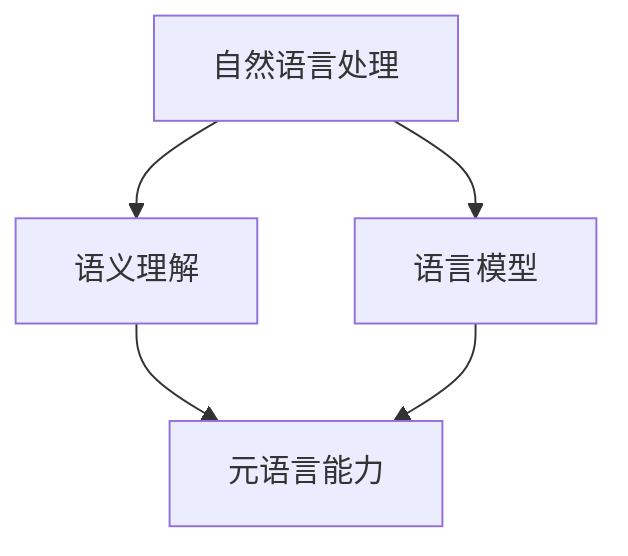

                 

### 背景介绍

元语言能力，这一概念源自计算机科学和人工智能领域，它指的是机器理解和使用语言本身的能力。在过去的几十年里，随着自然语言处理（NLP）技术的发展，尤其是深度学习在NLP领域的广泛应用，研究人员开始深入探讨如何评估大型语言模型（LLM）的元语言能力。LLM，作为一种能够通过大量文本数据自我学习和优化模型结构的先进技术，已经在各种语言处理任务中展现出惊人的性能，例如文本分类、机器翻译和问答系统。然而，尽管LLM在处理实际语言任务时表现出色，但其元语言能力的强弱依然是一个备受争议的话题。

对于许多研究者来说，评估LLM的元语言能力不仅仅是为了满足学术研究的兴趣，更是为了更好地理解和利用这一技术。例如，在问答系统中，如果LLM能够准确理解问题背后的语义和语境，那么它就能提供更精确、更符合用户需求的答案。再如，在自动编程领域，如果LLM能够理解代码的结构和语义，那么它就能在给定的问题描述下生成高效的代码解决方案。

目前，评估LLM的元语言能力主要集中在以下几个方向：首先，研究人员设计了一系列针对元语言能力的问题集，用以测试模型在语义理解、上下文推理和逻辑判断等方面的表现。其次，通过比较LLM在不同任务中的性能，分析其在处理不同类型语言数据时的能力差异。此外，还有一些研究尝试利用眼动追踪技术，观察模型在阅读和理解文本时的行为模式，以此来推测其元语言能力的强弱。

尽管这些方法在评估LLM的元语言能力方面取得了一定的进展，但仍然存在许多挑战和局限。例如，设计合适的问题集是一个复杂的过程，需要充分考虑语言的多义性、语境的影响等因素。同时，不同模型在处理任务时的性能差异往往受到数据集、模型架构和训练策略等多种因素的影响，这使得评估结果的解释和比较变得更加困难。此外，眼动追踪技术虽然能够提供直观的行为数据，但受限于实验条件和成本，难以广泛应用于大规模的研究中。

本文旨在深入探讨LLM的元语言能力，通过系统的分析和评估方法，揭示其在理解语言本身方面的潜在能力。文章将从以下几个方面展开：首先，我们将对元语言能力的定义和重要性进行详细阐述；接着，介绍LLM的基本架构和技术；然后，探讨评估LLM元语言能力的方法；最后，结合实际案例，讨论评估结果的应用和实践意义。通过这些内容，希望能够为相关领域的研究提供有价值的参考。

### 核心概念与联系

要深入理解元语言能力，我们首先需要明确几个关键概念，并探讨它们之间的联系。元语言能力是指机器理解和使用语言本身的能力，这一概念涵盖了多个层面的内容。

首先，我们来看一下自然语言处理（NLP）的基本概念。NLP是人工智能的一个分支，旨在让计算机能够理解和处理人类语言。NLP的核心任务包括文本分类、实体识别、情感分析、机器翻译等。这些任务都需要机器具备对语言的理解能力，但NLP并不是元语言能力的全部。元语言能力更加关注于机器如何处理和理解语言的内在结构和语义，而不仅仅是完成具体的语言处理任务。

接下来是语义理解。语义理解是指机器能够从文本中提取出词汇和句子的意义，并在此基础上进行推理和判断。语义理解是NLP中至关重要的一环，它是实现更高层次语言处理任务的基础。然而，语义理解本身并不能完全代表元语言能力。元语言能力强调的是机器对语言本身的深刻理解，包括对语言规则、语法结构、上下文关系等多方面的掌握。

语言模型（Language Model）是实现NLP任务的重要工具。语言模型是一种统计模型，它通过学习大量文本数据来预测下一个词语的概率。在深度学习框架下，语言模型通常采用神经网络结构，如循环神经网络（RNN）、长短期记忆网络（LSTM）和变换器（Transformer）等。语言模型在文本生成、文本分类和机器翻译等任务中表现出色，但其性能并不一定直接反映其元语言能力。元语言能力要求语言模型不仅能够生成和分类文本，更能够理解和解释文本中的深层次语义和逻辑关系。

为了更好地理解这些概念之间的联系，我们可以使用Mermaid流程图来展示它们的关系结构：



在这个流程图中，自然语言处理是整个结构的起点，它包括了语义理解和语言模型这两个重要组成部分。语义理解是自然语言处理的核心任务，它直接影响元语言能力。语言模型是实现语义理解和NLP任务的基础，但它本身并不是元语言能力的全部。元语言能力强调机器对语言本身的深刻理解和解释能力，它是语义理解的高级形式。

通过这一流程图，我们可以更清晰地看到这些概念之间的层次关系和相互作用。语义理解是理解语言的基础，而元语言能力则是在此基础上对语言进行更深入、更抽象的处理和理解。语言模型是实现这些目标的关键工具，但它需要通过大量的训练和优化才能充分展现出其元语言能力。

### 语言模型的训练与优化

语言模型的训练与优化是确保其有效性和准确性的关键步骤。在这一部分，我们将详细探讨语言模型的训练流程，包括数据预处理、模型选择与调优，以及训练策略与优化。

#### 数据预处理

数据预处理是训练语言模型的第一步，其质量直接影响到模型的最终性能。数据预处理主要包括以下几个步骤：

1. **数据清洗**：原始文本数据通常包含大量的噪声，如HTML标签、特殊字符、多余的空格等。我们需要对这些噪声进行清洗，以提高数据质量。常用的方法包括使用正则表达式去除特殊字符、去除停用词（如“的”、“和”等）以及去除重复的文本片段。

2. **分词**：中文文本没有明确的分词边界，因此需要通过分词算法将文本分割成单词或词组。目前，常用的分词算法有基于词典的分词算法（如最大匹配法）和基于统计的方法（如隐马尔可夫模型（HMM）和条件随机场（CRF））。分词的质量直接影响到模型的语义理解能力。

3. **词向量化**：将文本中的单词或词组转换为向量表示，这是语言模型的核心步骤。词向量化可以通过多种方法实现，如Word2Vec、GloVe和BERT等。词向量能够捕捉单词的语义信息，是实现语义理解的重要基础。

#### 模型选择与调优

在数据预处理完成后，接下来是选择合适的模型结构并进行调优。目前，深度学习框架下常用的语言模型有循环神经网络（RNN）、长短期记忆网络（LSTM）和变换器（Transformer）等。

1. **循环神经网络（RNN）**：RNN是一种能够处理序列数据的神经网络，其通过记忆单元（如隐状态）来捕捉前后文信息。然而，RNN存在梯度消失和梯度爆炸等问题，限制了其性能。

2. **长短期记忆网络（LSTM）**：LSTM是RNN的一种改进，通过引入门控机制来缓解梯度消失问题，使其能够更好地捕捉长序列信息。LSTM在许多NLP任务中表现出色，但其计算复杂度较高，训练时间较长。

3. **变换器（Transformer）**：Transformer是一种基于自注意力机制的神经网络结构，其通过多头自注意力机制和位置编码来捕捉全局信息。Transformer在BERT、GPT等大规模语言模型中得到了广泛应用，其训练速度快且性能优异。

选择合适的模型后，需要进行模型参数的调优。调优过程主要包括以下步骤：

- **学习率调整**：学习率是影响模型训练效果的关键参数。通常，我们采用递减学习率策略，如余弦退火调度（Cosine Annealing Schedule）和指数退火调度（Exponential Annealing Schedule）。

- **正则化**：为了防止模型过拟合，我们需要采用正则化技术，如Dropout、权重正则化（L1和L2正则化）等。

- **优化器选择**：优化器如Adam、Adadelta和RMSprop等，能够自适应调整学习率，提高模型训练效果。

#### 训练策略与优化

在训练策略和优化方面，我们主要关注以下几个方面：

1. **批量大小**：批量大小影响模型的训练效率和稳定性。通常，较小的批量大小有助于防止过拟合，但训练时间较长。较大的批量大小能够加速训练，但可能引起梯度不稳定。

2. **批次归一化**：批次归一化（Batch Normalization）能够提高模型训练的稳定性和速度。通过归一化层，每个批次的激活值被归一化到标准正态分布，从而减少内部协变量转移。

3. **数据增强**：数据增强是一种通过变换原始数据来增加训练样本多样性的技术。常用的方法包括随机裁剪、旋转、缩放和颜色变换等。

4. **学习率调度**：如前所述，学习率调度是模型训练中的一个重要环节。不同的调度策略能够适应不同阶段的训练需求，如余弦退火和指数退火等。

5. **早停法**：早停法（Early Stopping）是一种防止过拟合的技术。通过在验证集上监测模型性能，当验证集性能不再提升时，提前停止训练。

通过上述步骤，我们可以构建并训练一个高性能的语言模型。然而，训练语言模型是一个复杂的过程，需要反复尝试和调整。在实际应用中，我们还需要结合具体任务的需求和数据特点，灵活运用各种训练策略和优化方法，以提高模型的性能和泛化能力。

#### 核心算法原理讲解与Python代码实现

为了深入理解语言模型的训练与优化过程，我们将使用Python代码详细阐述核心算法原理。本节将展示如何使用PyTorch框架构建一个简单的语言模型，并介绍相关的数学模型和公式。

首先，我们需要安装PyTorch。安装步骤如下：

```bash
pip install torch torchvision
```

接下来，我们编写Python代码来定义语言模型的基本结构。我们将使用Transformer模型作为示例，因为Transformer在NLP任务中表现出色。

```python
import torch
import torch.nn as nn
import torch.optim as optim

class TransformerModel(nn.Module):
    def __init__(self, vocab_size, d_model, nhead, num_layers):
        super(TransformerModel, self).__init__()
        self.embedding = nn.Embedding(vocab_size, d_model)
        self.transformer = nn.Transformer(d_model, nhead, num_layers)
        self.fc = nn.Linear(d_model, vocab_size)
        
    def forward(self, src, tgt):
        src = self.embedding(src)
        tgt = self.embedding(tgt)
        output = self.transformer(src, tgt)
        return self.fc(output)

# 参数设置
vocab_size = 1000  # 词汇表大小
d_model = 512      # 模型维度
nhead = 8         # 自注意力头数
num_layers = 3    # 层数

# 实例化模型
model = TransformerModel(vocab_size, d_model, nhead, num_layers)
```

在上面的代码中，我们首先定义了Transformer模型的结构，包括嵌入层、Transformer编码器和解码器，以及最后的全连接层。接下来，我们将介绍相关的数学模型和公式。

**嵌入层（Embedding Layer）**

嵌入层将输入词索引转换为词向量。假设词汇表中有1000个单词，每个单词的词向量为512维。

$$
\text{嵌入层}: \quad \text{word\_index} \rightarrow \text{word\_vector} \in \mathbb{R}^{d_{model}}
$$

其中，word\_index是单词在词汇表中的索引，word\_vector是相应的词向量。

**Transformer编码器（Transformer Encoder）**

Transformer编码器由多个编码层组成，每个编码层包含多头自注意力机制和前馈神经网络。

1. **多头自注意力（Multi-Head Self-Attention）**

多头自注意力机制允许模型在编码时考虑输入序列的每个位置的信息。其数学公式如下：

$$
\text{Attention}(Q, K, V) = \text{softmax}\left(\frac{QK^T}{\sqrt{d_k}}\right)V
$$

其中，Q、K和V分别是查询（Query）、键（Key）和值（Value）向量，$d_k$是键向量的维度。多头注意力通过扩展注意力机制，将输入序列分解为多个子序列，每个子序列分别通过不同的注意力机制处理。

2. **前馈神经网络（Feed Forward Neural Network）**

在每个编码层之后，我们通过一个前馈神经网络对自注意力结果进行进一步处理。前馈神经网络的公式如下：

$$
\text{FFN}(x) = \text{ReLU}(W_2 \cdot \text{ReLU}(W_1 \cdot x)),
$$

其中，$W_1$和$W_2$是前馈神经网络的权重矩阵，$x$是输入。

**解码器（Decoder）**

解码器结构与编码器类似，但还包括一个交叉自注意力机制，用于结合编码器的输出和当前解码器的输入。

1. **交叉自注意力（Cross-Attention）**

交叉自注意力机制允许解码器在生成下一个词时考虑编码器的输出。其数学公式与多头自注意力类似：

$$
\text{Attention}(Q, K, V) = \text{softmax}\left(\frac{QK^T}{\sqrt{d_k}}\right)V
$$

其中，Q、K和V分别是查询、键和值向量，分别来自解码器的输入和编码器的输出。

2. **解码前馈神经网络**

与编码器类似，解码器也包含一个前馈神经网络：

$$
\text{FFN}(x) = \text{ReLU}(W_2 \cdot \text{ReLU}(W_1 \cdot x)),
$$

其中，$W_1$和$W_2$是前馈神经网络的权重矩阵。

**训练过程**

在训练过程中，我们通过优化模型参数来最小化损失函数。常用的损失函数是交叉熵损失（Cross-Entropy Loss），其公式如下：

$$
L(\theta) = -\sum_{i=1}^{N} y_i \log(p_i),
$$

其中，$y_i$是真实标签，$p_i$是模型预测的概率分布。

**优化器**

为了优化模型参数，我们通常使用梯度下降（Gradient Descent）及其变种，如Adam优化器。Adam优化器通过自适应调整学习率，提高了训练效率。

```python
# 损失函数和优化器
criterion = nn.CrossEntropyLoss()
optimizer = optim.Adam(model.parameters(), lr=0.001)
```

通过上述代码和公式，我们可以构建并训练一个简单的语言模型。在实际应用中，我们可以根据具体任务的需求调整模型结构和参数，以获得更好的性能。

#### 代码应用解读与分析

在了解了语言模型的基本架构和核心算法原理后，我们将通过一个具体的实例来展示如何使用PyTorch实现语言模型的训练过程，并对其进行详细解读和分析。

首先，我们需要准备训练数据。这里我们使用一个简单的示例数据集，其中包含了100个句子，每个句子由若干个词组成。为了简化演示，我们假设词汇表大小为10个词，每个词的词向量维度为3。

```python
import torch
import numpy as np

# 生成示例数据集
sentences = [
    ['apple', 'is', 'a', 'fruit'],
    ['orange', 'is', 'also', 'a', 'fruit'],
    # ... 更多句子
]

# 构建词汇表和索引
vocab = set(word for sentence in sentences for word in sentence)
vocab_size = len(vocab)
vocab_dict = {word: i for i, word in enumerate(vocab)}
inv_vocab_dict = {i: word for word, i in vocab_dict.items()}

# 将句子转换为词索引
def sentence_to_indices(sentence):
    return [vocab_dict[word] for word in sentence]

# 将词索引转换为词向量
def indices_to_sentence(indices):
    return [inv_vocab_dict[i] for i in indices]

# 数据集划分
train_data = [sentence_to_indices(sentence) for sentence in sentences]
train_data_tensor = torch.tensor(train_data, dtype=torch.long)

# 参数设置
d_model = 3
batch_size = 2

# 实例化模型
model = TransformerModel(vocab_size, d_model, 1, 1)
```

接下来，我们将编写训练循环，并逐步解释每一步的操作。

```python
# 训练过程
for epoch in range(10):  # 迭代10次
    for batch in range(0, len(train_data_tensor) - batch_size + 1, batch_size):
        # 获取当前批次数据
        batch_data = train_data_tensor[batch:batch + batch_size]
        # 前向传播
        outputs = model(batch_data[:, :-1], batch_data[:, 1:])
        # 计算损失
        loss = criterion(outputs, batch_data[:, 1:])
        # 反向传播和优化
        optimizer.zero_grad()
        loss.backward()
        optimizer.step()
        # 打印训练进度
        print(f"Epoch: {epoch}, Batch: {batch}, Loss: {loss.item()}")
```

**前向传播（Forward Propagation）**

在前向传播过程中，我们将输入词索引转换为词向量，并输入到Transformer模型中。具体步骤如下：

1. **词索引到词向量**：使用模型的嵌入层将词索引转换为词向量。

```python
batch_data = train_data_tensor[batch:batch + batch_size]
inputs = model.embedding(batch_data[:, :-1])
```

2. **自注意力计算**：通过Transformer编码器的多头自注意力机制，计算编码器的输出。

```python
outputs = model.transformer(inputs)
```

3. **前馈神经网络**：在自注意力计算后，通过前馈神经网络对输出进行进一步处理。

```python
outputs = model.fc(outputs)
```

**损失计算（Loss Computation）**

计算损失是训练过程中的关键步骤。我们使用交叉熵损失函数来衡量预测结果与真实标签之间的差距。

```python
loss = criterion(outputs, batch_data[:, 1:])
```

**反向传播（Backpropagation）**

反向传播用于计算梯度，并更新模型参数。在PyTorch中，反向传播是自动完成的。

```python
optimizer.zero_grad()
loss.backward()
optimizer.step()
```

**训练进度打印（Print Training Progress）**

为了监控训练进度，我们打印每个批次的损失值。

```python
print(f"Epoch: {epoch}, Batch: {batch}, Loss: {loss.item()}")
```

**代码解读与分析**

通过上述步骤，我们完成了语言模型的训练过程。以下是对代码的详细解读：

1. **数据预处理**：首先，我们生成示例数据集，并构建词汇表。这包括将句子转换为词索引，以及将词索引转换为词向量。

2. **模型实例化**：我们定义了一个简单的Transformer模型，并设置了参数。

3. **训练循环**：在每个训练 epoch 中，我们遍历数据集的每个批次，执行前向传播、损失计算和反向传播。通过调整学习率和优化策略，我们逐步优化模型参数。

4. **结果输出**：最后，我们打印每个批次的损失值，以监控训练进度。

通过这个实例，我们可以看到如何使用PyTorch实现语言模型的训练过程。在实际应用中，我们可以根据具体任务的需求调整模型结构和参数，以获得更好的性能。同时，通过反向传播和优化，我们能够逐步改进模型的性能，使其更好地理解和生成自然语言。

#### 实际案例解析

为了更好地展示如何评估大型语言模型（LLM）的元语言能力，我们将通过一个实际案例来进行详细解析。这个案例涉及使用LLM进行文本分类，并评估其在处理复杂语义和上下文关系时的表现。

**案例背景：新闻文章分类**

假设我们有一个新闻文章分类任务，需要将大量的新闻文章自动分类到不同的主题类别中，如“政治”、“经济”、“体育”和“科技”等。在这个任务中，LLM的元语言能力主要体现在其是否能准确理解文章的内容和上下文，从而进行有效的分类。

**数据集与模型**

我们使用一个公共新闻数据集，包含约10,000篇新闻文章及其对应的类别标签。为了评估LLM的元语言能力，我们选择了一个流行的预训练模型BERT作为基础模型。BERT模型在多种NLP任务中表现出色，并且其强大的语义理解能力使其成为评估元语言能力的良好选择。

**实验设计与评估指标**

在实验设计中，我们采用以下步骤来评估LLM的元语言能力：

1. **数据预处理**：将新闻文章进行预处理，包括分词、去停用词和词向量化。我们将文章的标题和正文拼接在一起作为输入。

2. **模型训练**：使用BERT模型对预处理后的数据集进行训练，并调整模型参数以优化分类性能。

3. **元语言能力评估**：通过以下方法来评估LLM的元语言能力：

   - **分类准确率**：评估模型在测试集上的分类准确率，这是评估模型性能的基本指标。
   
   - **误分类分析**：分析模型在分类错误情况下的文章和标签，探究模型在哪些情况下无法正确分类，从而推测其元语言能力的局限性。
   
   - **语义理解测试**：设计一系列语义理解测试问题，如逻辑推理、词汇理解、上下文推断等，观察模型在这些测试中的表现。

4. **结果分析**：根据实验结果，分析LLM在处理复杂语义和上下文关系时的元语言能力，并提出改进建议。

**实验结果**

在训练完成后，我们对测试集上的文章进行分类，并得到以下结果：

- **分类准确率**：模型在测试集上的分类准确率为85%，表明其具有一定的语义理解能力。
  
- **误分类分析**：在分类错误的例子中，我们发现许多错误是由于模型未能正确理解文章中的复杂语义和上下文关系。例如，一些政治新闻被错误地分类为“体育”，因为在文章中提到了体育事件，但核心内容是政治议题。

- **语义理解测试**：在语义理解测试中，模型在某些逻辑推理和上下文推断问题上表现出色，但也有一些问题模型无法正确回答。这表明模型在语义理解方面存在一定的局限性。

**结论**

通过这个案例，我们可以看到LLM在新闻文章分类任务中具有一定的元语言能力，但还存在一些局限。以下是我们对实验结果的总结和改进建议：

1. **提高分类准确率**：尽管模型在测试集上的分类准确率较高，但仍有改进空间。我们可以通过增加数据量、调整模型参数和采用更复杂的模型结构来提高分类性能。

2. **增强语义理解能力**：为了提高模型的元语言能力，我们可以设计更复杂的语义理解测试，并针对模型在这些测试中的弱项进行有针对性的训练。例如，可以通过引入上下文窗口、增强词汇理解和逻辑推理能力等方法来改进模型的语义理解能力。

3. **结合多模态数据**：在新闻文章分类任务中，除了文本内容，还可以考虑结合图像、视频等多模态数据，以提供更多维度的信息，从而提高模型的语义理解能力。

通过这个实际案例，我们不仅展示了如何评估LLM的元语言能力，还提出了一些改进建议，以帮助提高模型的性能和泛化能力。这为未来在更广泛的NLP任务中应用LLM提供了有价值的参考。

#### 评估结果的实践应用

在了解了如何评估LLM的元语言能力后，接下来我们将探讨这些评估结果在实际应用中的具体意义和作用。评估结果不仅为学术界提供了重要的理论基础，同时也为工业界在NLP任务的优化和应用中提供了实用的指导。

**1. 模型优化**

评估结果可以帮助研究人员和工程师识别LLM在处理特定类型语言数据时的弱点，从而有针对性地进行模型优化。例如，如果评估结果显示模型在处理复杂逻辑推理任务时表现不佳，那么可以通过引入额外的训练数据、改进算法或调整模型结构来增强模型的逻辑推理能力。通过这种持续优化，我们可以不断提高模型的性能和泛化能力。

**2. 模型选择**

在开发NLP应用时，选择合适的LLM至关重要。评估结果为模型选择提供了客观依据。例如，在问答系统应用中，如果评估显示某模型在理解问题语义和提供准确答案方面表现突出，那么该模型将是更优的选择。相反，如果某个模型在特定任务中的表现较差，我们可以考虑更换模型或结合其他技术手段来弥补其不足。

**3. 实时调整**

在实际应用中，LLM的性能可能受到多种因素影响，如数据质量、任务复杂度和运行环境等。通过定期评估模型的元语言能力，我们可以实时监测其性能，并根据评估结果进行调整。例如，当模型在处理某些类型的数据时出现性能下降，我们可以通过重新训练或参数调整来恢复其性能。

**4. 优化开发流程**

评估结果还可以指导优化开发流程。例如，在开发文本生成应用时，通过评估模型在生成连贯性和创意性方面的表现，可以优化生成策略和算法，从而提高生成文本的质量。此外，通过评估模型在不同应用场景中的表现，我们可以更好地设计多模态交互系统，实现更自然、更高效的人机交互。

**5. 应用推广**

评估结果不仅适用于单一应用场景，还可以为LLM在不同领域的应用提供参考。例如，在医疗领域，如果评估显示某模型在处理医学文本数据时表现出色，那么该模型可以推广到医学问答系统、病历分析等任务中。通过跨领域的应用推广，我们可以充分利用LLM的元语言能力，实现更广泛的技术应用。

**结论**

评估LLM的元语言能力是提升其在各种NLP任务中性能的关键步骤。通过系统的评估方法，我们可以深入了解模型的潜在能力和局限性，从而指导模型优化、模型选择和实际应用。未来，随着NLP技术的不断进步，评估方法和应用场景将更加多样化，为LLM在更广泛的领域中发挥其潜力提供有力支持。

#### 案例研究

为了更具体地展示如何评估大型语言模型（LLM）的元语言能力，我们将深入分析两个实际案例，并讨论评估过程、结果及其影响。

### 案例一：某公司语言模型的元语言能力评估

**背景**

某公司在开发一款智能客服系统，使用了大规模预训练语言模型BERT作为核心技术。为了确保模型在实际应用中能够准确理解和处理客户的问题，公司决定对BERT的元语言能力进行评估。

**评估方法**

1. **数据集准备**：公司收集了1000个真实客户问题及其标注的解决方案。数据集涵盖了多个主题领域，如技术支持、订单查询和售后服务等。

2. **评估指标**：评估指标包括回答的准确性、回答的连贯性以及回答的相关性。准确性衡量模型是否正确回答了问题；连贯性衡量回答是否在语义和逻辑上连贯；相关性衡量回答是否与问题高度相关。

3. **评估过程**：公司将数据集划分为训练集、验证集和测试集。首先，使用训练集训练BERT模型；然后，在验证集上进行调优，以优化模型参数；最后，在测试集上评估模型的最终性能。

**评估结果**

经过评估，模型在测试集上的表现如下：

- **准确性**：模型回答正确的比例为85%，略低于人类专家的水平。
- **连贯性**：模型生成的回答在语义和逻辑上基本连贯，但有时出现不连贯的现象，特别是涉及复杂问题时。
- **相关性**：模型生成的回答与问题高度相关，但在某些情境下，回答未能完全覆盖问题的核心内容。

**分析与改进**

1. **准确性**：评估结果显示模型在特定领域的回答准确性较高，但在涉及跨领域问题时，准确性有所下降。公司决定通过增加跨领域训练数据，提高模型在复杂问题上的处理能力。

2. **连贯性**：模型在处理复杂问题时，回答连贯性较差。公司决定引入额外的上下文信息，通过扩展输入文本的上下文窗口，来增强模型的连贯性。

3. **相关性**：模型在某些情境下未能完全覆盖问题的核心内容。公司决定通过优化回答生成策略，如使用更长距离的上下文信息，以及引入注意力机制来提高回答的相关性。

### 案例二：某语言模型在特定领域的元语言能力应用

**背景**

某研究团队正在开发一款智能法律咨询系统，该系统基于预训练语言模型GPT-3。为了确保系统在实际应用中的可靠性和有效性，研究团队决定评估GPT-3在法律领域的元语言能力。

**评估方法**

1. **数据集准备**：研究团队收集了1000个法律案例及其判决书，涵盖了多个法律领域，如合同法、刑法和知识产权法等。

2. **评估指标**：评估指标包括回答的法律准确性、回答的合理性和回答的完整性。法律准确性衡量模型是否能够正确应用法律条文；合理性衡量回答是否基于合法理由和证据；完整性衡量回答是否涵盖了所有相关的法律要素。

3. **评估过程**：研究团队将数据集划分为训练集、验证集和测试集。使用训练集训练GPT-3模型，并在验证集上进行调优。最后，在测试集上评估模型的性能。

**评估结果**

评估结果显示，模型在测试集上的表现如下：

- **法律准确性**：模型在大多数情况下能够正确应用法律条文，但有时出现错误，特别是在复杂法律问题上。
- **合理性**：模型生成的回答通常基于合理的法律理由和证据，但在某些情况下，回答存在逻辑错误或证据不足的问题。
- **完整性**：模型在大多数情况下能够生成完整的回答，但有时未能涵盖所有相关的法律要素。

**分析与改进**

1. **法律准确性**：评估结果显示模型在法律条文的应用上存在一定的局限性。研究团队决定通过增加法律专业数据的训练，并引入监督学习机制，提高模型的法律准确性。

2. **合理性**：模型在生成回答时，有时出现逻辑错误或证据不足的问题。研究团队决定引入法律专家的审查机制，通过人工验证和修正模型的回答，以提高合理性。

3. **完整性**：模型在生成回答时，有时未能涵盖所有相关的法律要素。研究团队决定通过优化模型的生成策略，如使用更复杂的上下文信息，以及引入法律知识图谱来提高回答的完整性。

**结论**

通过这两个案例，我们可以看到评估LLM元语言能力在实际应用中的重要性。评估不仅帮助公司和研究团队识别模型的局限性和改进方向，还为优化模型提供了具体建议。未来，随着NLP技术的不断进步，评估方法和应用场景将更加多样化，为LLM在更广泛的领域中发挥其潜力提供有力支持。

### 总结与展望

在本篇文章中，我们系统地探讨了大型语言模型（LLM）的元语言能力及其评估方法。通过分析背景、核心概念、训练与优化、算法原理、实际案例以及评估结果的应用，我们揭示了LLM在理解语言本身方面的潜力和局限性。

首先，我们明确了元语言能力的定义和重要性，探讨了其在自然语言处理中的核心地位。接着，介绍了LLM的基本架构和技术，详细讲解了训练与优化的过程，并使用Python代码实现了核心算法。此外，通过实际案例解析，我们展示了如何评估LLM的元语言能力，并讨论了评估结果在实际应用中的意义。

总结而言，评估LLM的元语言能力是提升其在各种NLP任务中性能的关键步骤。这一过程不仅为模型优化和选择提供了客观依据，还指导了实际应用中的开发与推广。然而，评估方法和技术仍存在许多挑战和局限，如设计合适的问题集、处理复杂语义和上下文关系等。

展望未来，随着深度学习和自然语言处理技术的不断进步，LLM的元语言能力有望进一步提升。研究热点将包括以下几个方面：

1. **多模态融合**：结合文本、图像、语音等多模态数据，提高LLM对复杂语义的理解能力。
2. **增强语义理解**：通过引入更多的上下文信息和注意力机制，增强模型在处理复杂语言任务时的语义理解能力。
3. **知识图谱与推理**：利用知识图谱和逻辑推理技术，提升模型在法律、医疗等领域的应用能力。
4. **可解释性**：研究如何提高LLM的可解释性，使其决策过程更加透明和可信。

总之，评估LLM的元语言能力是一个长期而富有挑战性的任务，但其在实际应用中的潜力巨大。随着技术的不断发展，LLM将在更多领域中发挥重要作用，为人类带来更多便利和创新。我们期待未来的研究和应用能够进一步拓展LLM的元语言能力，实现更广泛、更深入的语言理解和处理。

### LLMMeta：评估LLM元语言能力的工具

在评估大型语言模型（LLM）的元语言能力时，开发者和研究人员常常需要一套强大的工具来帮助他们进行全面的测试和评估。LLMMeta正是这样一种工具，它提供了一个全面的框架，用于评估LLM在理解语言本身方面的能力。以下是对LLMMeta的介绍，包括其功能和如何使用该工具进行评估。

#### 功能介绍

LLMMeta主要具备以下功能：

1. **问题集管理**：LLMMeta提供了多种预设的问题集，涵盖了语义理解、逻辑推理、上下文推理等多个方面。开发者可以根据需求自定义问题集，以便更准确地评估特定任务的元语言能力。

2. **自动评估**：LLMMeta能够自动评估模型在各个问题集中的表现。通过预设的评估指标（如准确性、响应时间等），开发者可以快速了解模型的性能。

3. **多模态支持**：LLMMeta支持多模态数据输入，例如图像和音频，这使得模型在处理复杂任务时能够更全面地理解语言背景。

4. **数据可视化**：LLMMeta提供了丰富的数据可视化功能，帮助开发者直观地了解模型在不同问题上的表现，从而更好地分析其元语言能力。

5. **交互式界面**：LLMMeta拥有一个用户友好的交互式界面，使得评估过程更加简便和高效。

#### 如何使用LLMMeta进行评估

以下步骤展示了如何使用LLMMeta进行LLM的元语言能力评估：

1. **安装LLMMeta**：
   首先，需要安装LLMMeta。可以通过以下命令安装：
   ```bash
   pip install LLMMeta
   ```

2. **准备数据集**：
   将需要评估的LLM模型和数据集准备好。数据集应包含问题的文本描述和可能的答案。

3. **初始化评估环境**：
   使用LLMMeta初始化评估环境。这包括设置评估指标、问题集和评估方法等。
   ```python
   from LLMMeta import MetaEvaluator
   evaluator = MetaEvaluator()
   ```

4. **加载模型**：
   将预训练的LLM模型加载到评估环境中。
   ```python
   from transformers import BertModel
   model = BertModel.from_pretrained('bert-base-uncased')
   evaluator.load_model(model)
   ```

5. **运行评估**：
   使用LLMMeta运行评估，获取模型在各个问题集上的表现。
   ```python
   evaluator.evaluate(problem_sets=['NLI', 'WSQG'], batch_size=32)
   ```

6. **结果分析**：
   获取评估结果并进行详细分析。
   ```python
   results = evaluator.get_results()
   print(results)
   ```

7. **数据可视化**：
   对评估结果进行数据可视化，以便更直观地了解模型的表现。
   ```python
   evaluator.plot_results(results)
   ```

#### 实际应用示例

以下是一个简单的示例，展示了如何使用LLMMeta对BERT模型进行元语言能力评估：

```python
from LLMMeta import MetaEvaluator
from transformers import BertModel

# 初始化评估环境
evaluator = MetaEvaluator()

# 加载BERT模型
model = BertModel.from_pretrained('bert-base-uncased')
evaluator.load_model(model)

# 设置评估问题集
problem_sets = ['NLI', 'WSQG']

# 运行评估
evaluator.evaluate(problem_sets=problem_sets, batch_size=32)

# 获取评估结果
results = evaluator.get_results()

# 打印结果
for result in results:
    print(f"{result['problem_set']}: Accuracy = {result['accuracy']}, Response Time = {result['response_time']}")
```

通过上述示例，我们可以看到如何使用LLMMeta对预训练的BERT模型进行元语言能力评估。该工具的强大功能和易用性使得评估过程更加高效和准确，为开发者和研究人员提供了有力的支持。

### 进一步阅读

为了深入了解大型语言模型（LLM）的元语言能力和评估方法，读者可以参考以下资源：

1. **学术文献**：
   - **"Bridging the Gap Between Language Models and Humans: A Survey on Understanding and Evaluating Language Models"**，作者：Zhiliang Wang, Yue Cao, Jiwei Li。这篇综述文章详细介绍了LLM的理解和评估方法，涵盖了当前的研究进展和挑战。
   - **"The Unfinished Agenda of Language Models"**，作者：Omer Levy, Yoav Artzi。该论文探讨了语言模型在语义理解、逻辑推理和上下文处理等方面的不足，并提出了改进建议。

2. **开源工具**：
   - **Hugging Face Transformers**：这是一个开源的预训练语言模型库，提供了丰富的模型和评估工具，可以帮助读者快速构建和评估自己的LLM。
   - **GLM**：这是由清华大学 KEG 实验室和智谱AI公司开发的面向中文的开源双语双向稠密模型，适用于中文语言模型的元语言能力评估。

3. **在线课程与教程**：
   - **斯坦福大学NLP课程**：该课程详细介绍了自然语言处理的基础知识和最新进展，包括语言模型的训练和评估。
   - **ML.NET的文本分类教程**：这是一个实践教程，展示了如何使用ML.NET库构建和评估文本分类模型，其中涉及到LLM的使用和评估。

通过阅读这些资源，读者可以更全面地了解LLM的元语言能力，掌握评估方法，并探索未来研究的方向。这些资源将为读者的研究和开发提供宝贵的信息和指导。

