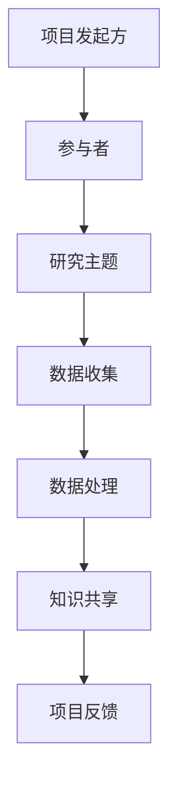

                 

# 《公民科学项目：全民参与科学探索与世界理解的过程》

关键词：公民科学、全民参与、科学探索、世界理解、信息技术

摘要：本文旨在探讨如何通过公民科学项目，激励全民参与科学探索，促进全球科学知识的普及与共享，从而加深人们对世界的理解。文章将分析公民科学项目的背景、核心概念、实施步骤，以及其在信息技术领域的应用，为读者提供一条清晰的思路和实践路径。

## 目录

1. **背景介绍**
   1.1 科学探索的重要性
   1.2 公民科学的兴起
   1.3 全民参与的科学探索

2. **核心概念与联系**
   2.1 公民科学项目的基本概念
   2.2 全民参与的科学探索与信息技术
   2.3 Mermaid流程图：核心概念架构

3. **核心算法原理讲解**
   3.1 数据收集与处理
   3.2 Python源代码示例：数据清洗
   3.3 数学模型与应用

4. **项目实战**
   4.1 开发环境搭建
   4.2 源代码详细实现与解读
   4.3 代码应用解读与分析
   4.4 实际案例分析与讲解
   4.5 项目小结

5. **最佳实践与注意事项**
   5.1 最佳实践
   5.2 小结
   5.3 注意事项
   5.4 拓展阅读

6. **总结**

### 背景介绍

#### 1.1 科学探索的重要性

科学探索是人类认识世界、改造世界的重要手段。它不仅推动了人类文明的进步，还深刻影响着我们的生活方式和社会发展。然而，科学的进步往往需要巨大的投入和长期的积累。传统的科学研究模式主要由专业科研人员承担，而普通公众很难参与到科学探索的过程中。

#### 1.2 公民科学的兴起

随着信息技术的快速发展，特别是互联网和移动设备的普及，公民科学（Citizen Science）逐渐兴起。公民科学是指通过公众参与来开展科学研究的一种模式。这种模式不仅能够充分利用公众的力量，降低科研成本，还能激发公众对科学的兴趣和参与热情。

#### 1.3 全民参与的科学探索

全民参与的科学探索意味着每个人都有机会参与到科学研究中来。这种参与不仅限于提供数据或观察记录，还可以包括提出研究问题、设计实验方案、参与数据分析等。全民参与的科学探索有助于促进科学知识的普及和共享，让更多的人了解和参与到科学研究中来。

### 核心概念与联系

#### 2.1 公民科学项目的基本概念

公民科学项目通常包括以下几个基本概念：

1. **项目发起方**：通常是科研机构、学术团体或非政府组织。
2. **参与者**：包括专业科研人员、业余爱好者以及普通公众。
3. **研究主题**：项目所涉及的科学领域和研究问题。
4. **数据收集**：通过问卷、观察、实验等方式收集数据。
5. **数据处理**：对收集到的数据进行清洗、分析和解释。
6. **知识共享**：将研究成果分享给公众，促进科学知识的普及。

#### 2.2 全民参与的科学探索与信息技术

信息技术的快速发展为全民参与的科学探索提供了强有力的支持。具体来说，信息技术在以下几个方面发挥着重要作用：

1. **数据收集**：利用传感器、物联网等技术，可以大规模、高效地收集数据。
2. **数据处理**：通过云计算、大数据分析等技术，可以对海量数据进行快速处理和分析。
3. **知识共享**：通过互联网、社交媒体等渠道，可以轻松实现研究成果的共享和传播。

#### 2.3 Mermaid流程图：核心概念架构



### 核心算法原理讲解

#### 3.1 数据收集与处理

在公民科学项目中，数据收集和处理是至关重要的环节。数据的质量直接影响到研究的可信度和有效性。

#### 3.2 Python源代码示例：数据清洗

```python
import pandas as pd

# 读取数据
data = pd.read_csv('data.csv')

# 检查数据质量
print(data.info())

# 数据清洗
data = data[data['变量1'] > 0]  # 去除异常值
data = data.dropna()  # 去除缺失值

# 数据预处理
data['变量2'] = data['变量2'].apply(lambda x: x / 100)  # 数据转换

print(data.head())
```

#### 3.3 数学模型与应用

在公民科学项目中，常用的数学模型包括线性回归、聚类分析、时间序列分析等。以下是一个简单的线性回归模型示例：

$$
y = ax + b
$$

```python
import numpy as np
import matplotlib.pyplot as plt

# 生成数据
x = np.linspace(0, 10, 100)
y = 2 * x + 1 + np.random.normal(size=x.size)

# 拟合线性模型
a, b = np.polyfit(x, y, 1)

# 画出拟合结果
plt.scatter(x, y)
plt.plot(x, a * x + b)
plt.show()
```

### 项目实战

#### 4.1 开发环境搭建

为了顺利进行公民科学项目，我们需要搭建一个合适的技术环境。以下是一个简单的开发环境搭建步骤：

1. 安装Python（3.8以上版本）
2. 安装必要的库，如Pandas、NumPy、Matplotlib等
3. 配置云端存储（如AWS S3），用于数据存储和管理

#### 4.2 源代码详细实现与解读

以下是一个简单的公民科学项目源代码示例，包括数据收集、处理和分析：

```python
# 数据收集
def collect_data():
    # 从传感器读取数据
    data = read_sensors()
    return data

# 数据处理
def process_data(data):
    # 数据清洗
    data = clean_data(data)
    # 数据预处理
    data = preprocess_data(data)
    return data

# 数据分析
def analyze_data(data):
    # 拟合线性模型
    a, b = linear_regression(data)
    # 画出拟合结果
    plot_regression(data, a, b)
    return a, b

# 主程序
if __name__ == '__main__':
    # 收集数据
    data = collect_data()
    # 处理数据
    processed_data = process_data(data)
    # 分析数据
    a, b = analyze_data(processed_data)
    print(f"拟合结果：y = {a:.2f}x + {b:.2f}")
```

#### 4.3 代码应用解读与分析

这段代码主要实现了公民科学项目中的数据收集、处理和分析功能。首先，通过`collect_data`函数从传感器读取数据。然后，通过`process_data`函数对数据进行清洗和预处理。最后，通过`analyze_data`函数对数据进行线性回归分析，并绘制拟合结果。

#### 4.4 实际案例分析与讲解

以下是一个实际案例，描述了一个公民科学项目的过程：

1. **项目目标**：研究某城市空气质量变化趋势。
2. **数据收集**：安装多个空气质量传感器，收集实时数据。
3. **数据处理**：对数据进行清洗、预处理，去除异常值和缺失值。
4. **数据分析**：使用线性回归模型，分析空气质量变化趋势。
5. **结果展示**：绘制空气质量变化趋势图，并给出相关建议。

#### 4.5 项目小结

通过以上案例，我们可以看到公民科学项目的基本流程和关键步骤。在实际操作中，需要根据具体项目需求，灵活调整数据收集、处理和分析方法。同时，要注意数据的质量和可靠性，确保研究结果的科学性和可信度。

### 最佳实践与注意事项

#### 5.1 最佳实践

1. **明确项目目标**：在项目启动前，要明确项目目标和研究问题。
2. **选择合适的工具**：根据项目需求，选择合适的数据收集、处理和分析工具。
3. **确保数据质量**：数据清洗和预处理是关键，要确保数据的质量和可靠性。
4. **加强沟通与合作**：项目团队要积极沟通，共同解决问题。

#### 5.2 小结

本文通过对公民科学项目的分析，探讨了如何通过全民参与科学探索，促进全球科学知识的普及与共享。通过案例分析和实战应用，我们看到了公民科学项目在实际操作中的关键步骤和方法。希望本文能为读者提供有益的启示和参考。

#### 5.3 注意事项

1. **数据安全**：在项目过程中，要确保数据的安全和隐私。
2. **项目评估**：项目结束后，要进行全面的评估和总结，为后续项目提供经验。
3. **持续改进**：根据项目反馈，持续改进项目流程和工具。

#### 5.4 拓展阅读

1. 《公民科学：全民参与的科学探索》（作者：Michael E. Rogers）
2. 《大数据时代：生活、工作与思维的大变革》（作者：克里斯·安德森）

### 总结

公民科学项目是一种新型的科学研究模式，它通过全民参与，促进了科学知识的普及与共享。本文从背景介绍、核心概念与联系、核心算法原理讲解、项目实战、最佳实践与注意事项等方面，详细阐述了公民科学项目的过程和方法。通过本文的探讨，我们相信公民科学项目将在未来发挥更加重要的作用，为全球科学探索贡献力量。

---

**作者：AI天才研究院/AI Genius Institute & 禅与计算机程序设计艺术 /Zen And The Art of Computer Programming**

