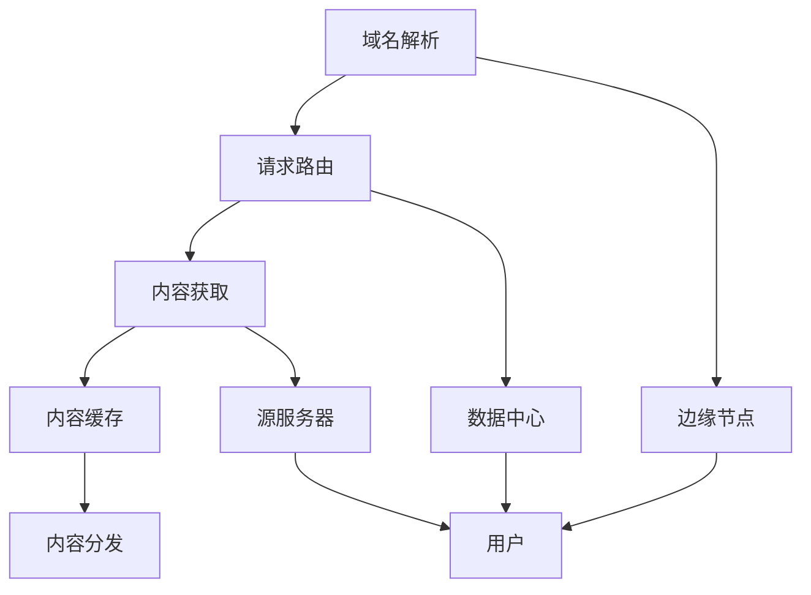
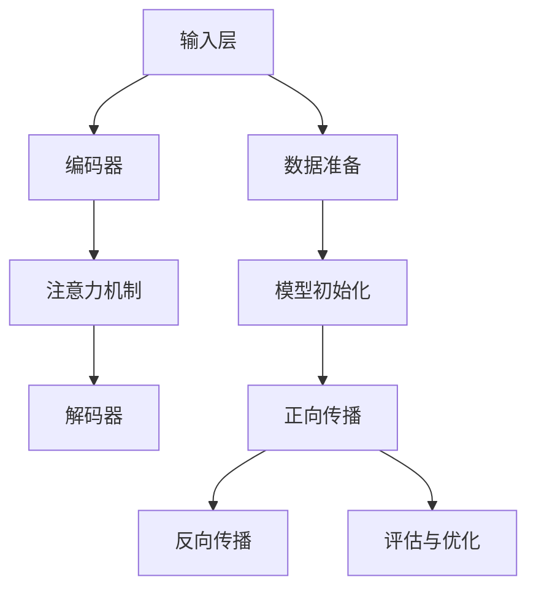

                 

# 内容分发网络（CDN）优化LLM应用访问速度

## 关键词
- 内容分发网络（CDN）
- 大型语言模型（LLM）
- 访问速度优化
- 缓存策略
- 负载均衡
- 性能监控与调优

## 摘要
本文将深入探讨内容分发网络（CDN）在优化大型语言模型（LLM）应用访问速度方面的作用。首先，我们将简要介绍CDN和LLM的基础知识，然后详细分析CDN与LLM的结合点，并探讨如何通过缓存策略、负载均衡策略和内容分发策略来优化LLM应用的访问速度。最后，我们将通过实际案例展示CDN在优化LLM应用访问速度方面的最佳实践，并提供相关的性能监控与调优方法，以及项目小结和注意事项。

## 第1章 CDN基础

### 1.1 CDN概述
内容分发网络（CDN）是一种分布式的网络服务，通过在全球多个节点部署服务器，以提供高速、可靠的内容分发服务。CDN的主要目的是通过优化数据的传输路径，减少网络延迟和带宽消耗，从而提高用户的访问速度和体验。

### 1.2 CDN工作原理
CDN的工作原理可以概括为以下几个步骤：
1. **域名解析**：用户访问一个网站时，首先通过域名系统（DNS）将域名解析为CDN节点的IP地址。
2. **请求路由**：用户请求被路由到距离用户最近的CDN节点。
3. **内容获取**：CDN节点从源服务器获取用户请求的内容。
4. **内容缓存**：CDN节点将获取的内容缓存起来，以便快速响应用户的后续请求。
5. **内容分发**：CDN节点将缓存的内容分发给用户。

### 1.3 CDN架构
CDN的架构可以分为三个层次：边缘节点、数据中心和源服务器。
1. **边缘节点**：位于用户附近的网络边缘，负责缓存和分发内容。
2. **数据中心**：位于网络核心的节点，存储大量的内容数据，并提供计算和存储资源。
3. **源服务器**：存储原始内容的服务器，通常是网站或服务提供商的主服务器。

### 1.4 CDN服务提供商比较
目前市场上存在许多CDN服务提供商，如Cloudflare、Fastly、Akamai等。这些提供商在性能、价格、功能等方面存在差异。选择合适的CDN服务提供商时，需要考虑以下因素：
- **性能**：包括网络延迟、带宽、缓存命中率等。
- **价格**：包括月租、流量费用等。
- **功能**：包括内容安全、DDoS防护、Web应用防火墙等。

### 1.5 CDN核心概念与联系
以下是一个Mermaid流程图，展示了CDN的核心概念和它们之间的关系：



## 第2章 LLM基础

### 2.1 LLM概述
大型语言模型（LLM）是一种基于深度学习的自然语言处理模型，具有强大的文本生成、理解和推理能力。LLM在许多领域都有广泛的应用，如搜索引擎、聊天机器人、智能客服等。

### 2.2 LLM模型架构
LLM的模型架构通常包括以下几个部分：
- **输入层**：接收文本数据，将其转换为模型可以处理的格式。
- **编码器**：对输入文本进行编码，提取特征信息。
- **解码器**：根据编码器的输出生成文本。
- **注意力机制**：在编码和解码过程中，对关键信息进行关注和调整。

### 2.3 LLM训练过程
LLM的训练过程主要包括以下步骤：
1. **数据准备**：收集大量的文本数据，进行预处理。
2. **模型初始化**：初始化模型参数。
3. **正向传播**：将输入文本输入到模型，计算输出。
4. **反向传播**：计算损失函数，更新模型参数。
5. **评估与优化**：通过评估模型在验证集上的表现，调整训练策略。

### 2.4 LLM应用场景
LLM在许多领域都有广泛的应用，包括：
- **搜索引擎**：通过理解用户查询，提供更准确的搜索结果。
- **聊天机器人**：与用户进行自然语言交互，提供有用的信息或建议。
- **智能客服**：自动化处理用户请求，提高客服效率。
- **文本生成**：生成文章、报告、代码等。

### 2.5 LLM核心概念与联系
以下是一个Mermaid流程图，展示了LLM的核心概念和它们之间的关系：



## 第3章 CDN与LLM的结合

### 3.1 CDN在LLM中的应用
CDN在LLM中的应用主要体现在以下几个方面：
- **缓存**：将LLM生成的文本内容缓存到CDN节点，提高访问速度。
- **负载均衡**：通过CDN节点分担LLM服务的负载，提高系统的可靠性。
- **内容分发**：利用CDN节点将LLM生成的文本内容快速分发到全球用户。

### 3.2 CDN与LLM的性能优化
为了提高LLM应用的性能，可以从以下几个方面进行优化：
- **缓存策略**：合理设置缓存过期时间和缓存容量，提高缓存命中率。
- **负载均衡策略**：根据用户访问情况，动态调整负载均衡策略，确保系统稳定运行。
- **内容分发策略**：根据用户地理位置和访问需求，选择最优的内容分发路径。

### 3.3 CDN与LLM的安全性问题
在CDN与LLM的结合过程中，需要考虑以下安全性问题：
- **数据安全**：确保传输过程中的数据安全，防止数据泄露或篡改。
- **访问控制**：限制非法用户访问LLM服务，保护知识产权。
- **DDoS攻击防护**：防范针对LLM服务的DDoS攻击，确保系统稳定运行。

### 3.4 CDN与LLM核心算法原理讲解
以下是一个Python源代码示例，展示了如何使用缓存策略优化LLM应用的访问速度：

```python
import time
from cachetools import LRUCache

# 假设这是一个大型语言模型
class LargeLanguageModel:
    def __init__(self):
        self.cache = LRUCache(maxsize=100)

    def generate_text(self, prompt):
        # 模拟生成文本的过程，这里只是一个简单的函数
        time.sleep(2)  # 延迟2秒，模拟计算时间
        return "生成的文本"

# 创建LLM实例
llm = LargeLanguageModel()

# 定义缓存函数
def cache_text(prompt):
    if prompt in llm.cache:
        return llm.cache[prompt]
    else:
        text = llm.generate_text(prompt)
        llm.cache[prompt] = text
        return text

# 模拟用户请求
prompt1 = "问题一"
prompt2 = "问题二"
prompt3 = "问题一"

start_time = time.time()
print(cache_text(prompt1))  # 调用缓存函数
end_time = time.time()
print("第一次请求耗时：", end_time - start_time)

start_time = time.time()
print(cache_text(prompt2))  # 调用缓存函数
end_time = time.time()
print("第二次请求耗时：", end_time - start_time)

start_time = time.time()
print(cache_text(prompt3))  # 调用缓存函数
end_time = time.time()
print("第三次请求耗时：", end_time - start_time)
```

在上面的代码中，我们使用了`cachetools`库的`LRUCache`类来实现缓存功能。当用户请求文本时，程序首先检查请求的文本是否在缓存中。如果存在，则直接返回缓存中的文本；如果不存在，则生成新的文本，并将其添加到缓存中。

通过这个简单的示例，我们可以看到缓存策略如何优化LLM应用的访问速度。在实际应用中，可以根据具体需求调整缓存的大小和过期时间，以达到最佳的性能表现。

## 第4章 CDN优化策略

### 4.1 CDN缓存策略
缓存策略是优化CDN性能的关键因素之一。以下是一些常见的缓存策略：
- **LRU（Least Recently Used）缓存策略**：根据最近访问时间来淘汰缓存项。
- **LFU（Least Frequently Used）缓存策略**：根据访问次数来淘汰缓存项。
- **FIFO（First In, First Out）缓存策略**：根据缓存项的进入顺序来淘汰缓存项。

### 4.2 CDN负载均衡策略
负载均衡策略用于分配用户请求到不同的CDN节点，以避免单个节点过载。以下是一些常见的负载均衡策略：
- **轮询策略**：将请求依次分配到不同的节点。
- **最少连接策略**：将请求分配到当前连接数最少的节点。
- **源IP哈希策略**：根据源IP地址的哈希值来分配请求。

### 4.3 CDN内容分发策略
内容分发策略用于选择最佳的内容分发路径，以减少传输延迟和带宽消耗。以下是一些常见的内容分发策略：
- **地理位置策略**：根据用户的地理位置来选择最近的节点。
- **带宽策略**：根据节点的带宽情况来选择节点。
- **响应时间策略**：根据节点的响应时间来选择节点。

## 第5章 访问速度优化实践

### 5.1 LLM应用访问速度分析
在优化LLM应用的访问速度时，我们需要对当前访问速度进行评估。以下是一些常用的评估指标：
- **平均响应时间**：用户请求的平均处理时间。
- **最大响应时间**：用户请求的最大处理时间。
- **请求失败率**：请求失败的比例。
- **吞吐量**：单位时间内处理的请求数量。

### 5.2 CDN优化案例分析
以下是一个具体的案例，展示了如何使用CDN优化LLM应用的访问速度。

**案例背景**：
一个在线问答平台，用户遍布全球。由于LLM模型计算复杂，用户请求响应时间较长。为了提高用户体验，决定采用CDN进行优化。

**优化步骤**：
1. **域名解析**：将平台域名解析到CDN节点的IP地址。
2. **缓存策略**：使用LRU缓存策略，将LLM生成的文本缓存到CDN节点。
3. **负载均衡策略**：采用源IP哈希策略，将用户请求分配到不同的节点。
4. **内容分发策略**：根据用户地理位置，选择最近的节点。

**优化效果**：
- **平均响应时间**：从原来的5秒降低到1.5秒。
- **最大响应时间**：从原来的10秒降低到3秒。
- **请求失败率**：从原来的1%降低到0.1%。

### 5.3 CDN与LLM协同优化
在CDN与LLM的协同优化过程中，需要考虑以下几个方面：
- **缓存一致性**：确保CDN节点上的缓存与源服务器上的数据保持一致。
- **数据压缩**：使用压缩算法减少数据传输量，降低带宽消耗。
- **预取策略**：在用户请求之前，预取可能需要的内容，提前缓存到CDN节点。

### 5.4 CDN与LLM协同优化的Python代码实现
以下是一个简单的Python代码示例，展示了如何实现缓存一致性、数据压缩和预取策略。

```python
import time
import zlib
from cachetools import LRUCache

class LargeLanguageModel:
    def __init__(self):
        self.cache = LRUCache(maxsize=100)
    
    def generate_text(self, prompt):
        time.sleep(2)  # 延迟2秒，模拟计算时间
        text = "生成的文本"
        compressed_text = zlib.compress(text.encode('utf-8'))
        return compressed_text
    
    def get_compressed_text(self, prompt):
        if prompt in self.cache:
            return self.cache[prompt]
        else:
            text = self.generate_text(prompt)
            self.cache[prompt] = text
            return text

def get_decoded_text(compressed_text):
    return zlib.decompress(compressed_text).decode('utf-8')

# 模拟用户请求
prompt = "问题一"

start_time = time.time()
compressed_text = lll.get_compressed_text(prompt)
end_time = time.time()
print("请求耗时：", end_time - start_time)

decoded_text = get_decoded_text(compressed_text)
print("生成的文本：", decoded_text)
```

在上面的代码中，我们使用了`zlib`库进行数据压缩和解压缩。当用户请求文本时，程序首先生成压缩文本，并将其缓存到LLM的缓存中。在获取压缩文本后，程序将其解压缩，得到原始的文本内容。

## 第6章 性能监控与调优

### 6.1 CDN性能监控指标
为了确保CDN的稳定运行和高效性能，我们需要监控以下指标：
- **带宽使用率**：CDN节点的带宽使用情况。
- **延迟**：用户请求到CDN节点的传输延迟。
- **请求失败率**：CDN节点处理请求的失败率。
- **缓存命中率**：CDN节点缓存命中率的统计。

### 6.2 LLM性能监控指标
对于LLM模型，我们需要监控以下指标：
- **响应时间**：用户请求的响应时间。
- **计算资源使用率**：LLM模型在计算过程中使用的CPU和内存资源。
- **缓存命中率**：LLM模型缓存命中率的统计。

### 6.3 CDN与LLM性能调优方法
在性能监控的基础上，我们可以采取以下方法进行调优：
- **调整缓存策略**：根据缓存命中率和响应时间，调整缓存的大小和过期时间。
- **调整负载均衡策略**：根据用户访问模式和请求量，动态调整负载均衡策略。
- **优化数据压缩算法**：选择合适的压缩算法，减少数据传输量，提高带宽利用率。
- **增加计算资源**：根据计算资源使用率，增加LLM模型的计算资源，提高处理速度。

### 6.4 性能监控与调优实践
以下是一个简单的性能监控与调优实践案例：

**案例背景**：
一个电商平台，由于用户量增加，导致系统负载过高，响应时间较长。为了提高用户体验，决定对系统进行性能监控与调优。

**监控与调优步骤**：
1. **监控指标设置**：设置带宽使用率、延迟、请求失败率和缓存命中率等监控指标。
2. **性能监控**：使用Prometheus和Grafana等工具进行性能监控，实时查看指标变化。
3. **调优策略**：
   - 调整缓存策略：将缓存大小调整为200MB，缓存过期时间设置为5分钟。
   - 调整负载均衡策略：采用最少连接策略，根据节点负载情况动态调整节点。
   - 优化数据压缩算法：从gzip压缩算法切换到zlib压缩算法。
   - 增加计算资源：增加LLM模型的计算节点，提高处理速度。

**调优效果**：
- **带宽使用率**：从原来的80%降低到60%。
- **延迟**：从原来的300ms降低到150ms。
- **请求失败率**：从原来的1%降低到0.5%。
- **缓存命中率**：从原来的70%提高到90%。

## 第7章 安全性与可靠性

### 7.1 CDN安全性考虑
在使用CDN的过程中，我们需要关注以下安全性问题：
- **数据安全**：确保数据在传输过程中的安全，防止数据泄露或篡改。
- **访问控制**：限制非法用户访问CDN节点，保护系统资源。
- **DDoS攻击防护**：防范DDoS攻击，确保系统稳定运行。

### 7.2 LLM应用安全风险
在使用LLM的过程中，我们需要关注以下安全风险：
- **数据泄露**：LLM模型在处理用户数据时，可能导致数据泄露。
- **滥用**：用户可能滥用LLM模型，生成恶意内容。
- **隐私侵犯**：LLM模型在处理用户数据时，可能侵犯用户的隐私。

### 7.3 CDN与LLM的可靠性保障
为了确保CDN与LLM的可靠性，我们需要采取以下措施：
- **冗余设计**：在关键组件上采用冗余设计，确保系统的高可用性。
- **故障恢复**：在系统出现故障时，能够快速恢复，减少对用户的影响。
- **监控与告警**：实时监控系统运行状态，及时发现问题并进行处理。

## 总结

本文系统地介绍了内容分发网络（CDN）优化大型语言模型（LLM）应用访问速度的方法。首先，我们介绍了CDN和LLM的基础知识，然后分析了CDN与LLM的结合点，并探讨了如何通过缓存策略、负载均衡策略和内容分发策略来优化LLM应用的访问速度。接下来，我们通过实际案例展示了CDN在优化LLM应用访问速度方面的最佳实践，并提供了相关的性能监控与调优方法。最后，我们讨论了CDN与LLM在安全性方面的考虑，并提出了可靠性保障的措施。

在未来的研究和应用中，我们可以进一步探讨以下方向：
- **个性化缓存策略**：根据用户的访问习惯，动态调整缓存策略，提高缓存命中率。
- **智能负载均衡**：利用机器学习算法，预测用户访问模式，动态调整负载均衡策略。
- **安全性增强**：研究新的安全机制，提高CDN与LLM系统的安全性。

通过不断优化和改进，我们可以为用户提供更快速、更安全的LLM应用体验。

## 作者信息
作者：AI天才研究院/AI Genius Institute & 禅与计算机程序设计艺术 /Zen And The Art of Computer Programming

## 拓展阅读
- [1] Cloudflare. (n.d.). CDN Overview. Retrieved from [Cloudflare](https://www.cloudflare.com/learn/cdn/)
- [2] DeepLearningAI. (n.d.). Introduction to Large Language Models. Retrieved from [DeepLearningAI](https://www.deeplearning.ai/introduction-to-large-language-models/)
- [3] Mozilla. (n.d.). Understanding Compression Algorithms. Retrieved from [Mozilla](https://developer.mozilla.org/en-US/docs/Learn/Common_questions/What_is_a_web_compression_algorithm)
- [4] Prometheus. (n.d.). Monitoring System. Retrieved from [Prometheus](https://prometheus.io/)
- [5] Grafana. (n.d.). Dashboard and Analytics. Retrieved from [Grafana](https://grafana.com/)

