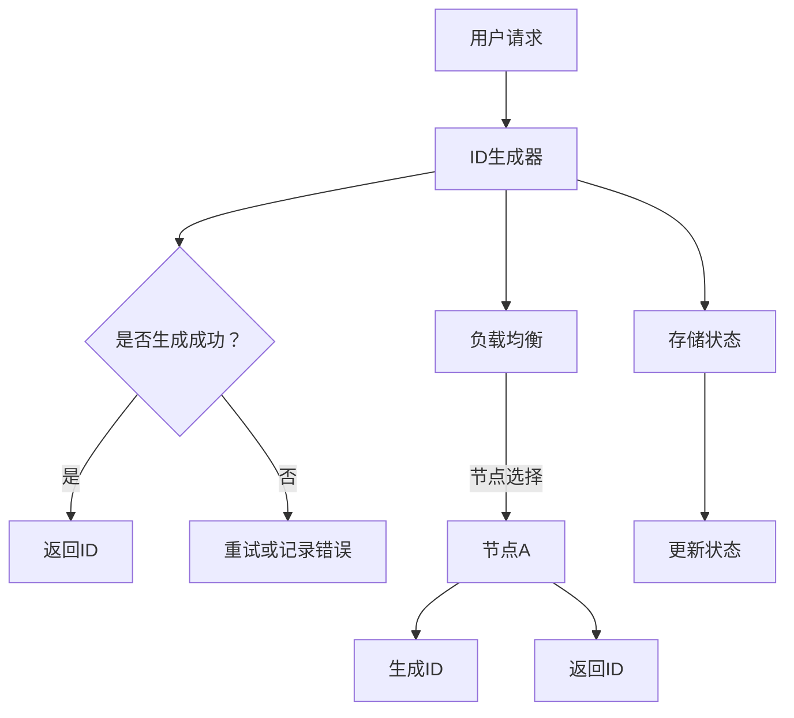

                 

### 分布式ID生成器的基本概念

#### 分布式ID的定义

分布式ID（Distributed ID）是一种用于标识分布式系统中实体对象的数据。在分布式系统中，由于各个节点独立运行，传统的ID生成方式（如数据库自增ID、UUID等）难以满足全局唯一性和性能要求。因此，分布式ID生成器应运而生，旨在确保在分布式环境中高效生成全局唯一的ID。

#### 分布式ID的必要性

在分布式系统中，由于系统规模不断扩大，单个节点难以满足全局唯一性和高性能的需求。分布式ID生成器能够解决以下问题：

1. **全局唯一性**：分布式ID生成器能够在多个节点之间生成全局唯一的ID，避免ID碰撞。
2. **高性能**：分布式ID生成器通过负载均衡和分布式计算，提高ID生成的速度。
3. **可扩展性**：分布式ID生成器能够适应系统规模的扩展，无需改变现有的ID生成策略。

#### 分布式ID的挑战

分布式ID生成器面临的主要挑战包括：

1. **全局唯一性保障**：如何在分布式环境中保证ID的全局唯一性，是分布式ID生成器需要解决的问题。
2. **高性能生成**：如何在高并发环境下快速生成ID，同时保证系统的稳定性。
3. **数据一致性**：分布式系统中的多个节点需要保持数据一致性，分布式ID生成器需要设计合理的数据一致性保障机制。

### Mermaid 流程图

以下是一个简单的分布式ID生成器的基本架构的Mermaid流程图：

### 总结

分布式ID生成器是分布式系统中的关键技术，解决了全局唯一性和高性能需求。然而，实现分布式ID生成器需要克服诸多挑战，如全局唯一性保障、高性能生成和数据一致性等。在下一章中，我们将进一步探讨分布式ID生成器的体系结构和实现方法。

---

## 关键词

- 分布式ID生成器
- 分布式系统
- 全局唯一性
- 高性能
- 负载均衡
- 数据一致性

## 摘要

本文主要介绍了分布式ID生成器的基本概念、必要性以及面临的挑战。首先，定义了分布式ID以及其必要性，随后阐述了分布式ID生成器所面临的挑战，如全局唯一性保障、高性能生成和数据一致性等。文章末尾通过Mermaid流程图展示了分布式ID生成器的基本架构。在后续章节中，将详细探讨分布式ID生成器的体系结构和实现方法。

