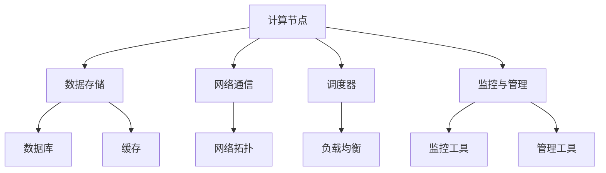

                 

## 引言

### 1.1.1 为什么要写这本书

在当今全球化和数字化转型的浪潮中，分布式系统已经成为企业创新和业务发展的关键技术。随着人工智能（AI）和语言模型（LLM）技术的迅猛发展，分布式系统的应用场景变得愈发广泛，特别是在数据处理、实时分析、智能决策等方面。然而，分布式团队的LLM应用敏捷开发面临着一系列独特而复杂的挑战，如数据同步、调度与资源分配、安全性与隐私保护等。这些问题不仅影响了项目的开发效率和质量，还对最终用户体验产生了深远的影响。

当前，关于分布式系统的书籍大多集中在基础架构和技术细节上，而针对分布式团队的LLM应用敏捷开发的深入研究和实践指导仍然相对匮乏。因此，撰写一本专门探讨分布式团队的LLM应用敏捷开发的书籍具有重要的现实意义。通过系统地阐述相关理论和实践，本书旨在为分布式团队的开发者提供一套全面、实用的方法论和策略，帮助他们更高效地应对开发过程中的各种挑战。

### 1.1.2 书的受众

本书的主要受众包括：

1. **分布式系统开发者**：希望通过敏捷开发方法提高分布式团队的效率和质量。
2. **AI与LLM研究者**：对如何在分布式环境中应用LLM技术感兴趣，并希望了解相关的开发策略和挑战。
3. **项目经理和CTO**：负责管理和推动分布式团队的LLM项目，需要了解如何制定有效的开发计划和策略。
4. **研究生和博士生**：在分布式系统和人工智能领域进行学术研究，希望获取实际应用经验和前沿研究成果。

通过本书，读者不仅可以获得理论知识和实践技巧，还能了解分布式团队的LLM应用敏捷开发的最新进展和未来趋势。

### 1.1.3 书的结构与目的

本书分为六个部分，每个部分的内容和目的如下：

1. **基础知识部分**：介绍分布式系统、语言模型和分布式机器学习的基础知识，为后续章节打下坚实的理论基础。
2. **挑战部分**：深入分析分布式团队的LLM应用敏捷开发中面临的挑战，包括数据同步、调度与资源分配、安全性与隐私保护等。
3. **策略部分**：提供一系列应对挑战的策略和方法，包括动态资源管理、灾难恢复与容错、代码风格与团队协作等。
4. **案例研究部分**：通过实际案例，展示如何将策略应用于具体项目中，提供宝贵的经验和教训。
5. **工具与技术部分**：介绍分布式系统的工具栈、DevOps实践和性能优化技术，帮助读者提升开发效率和系统性能。
6. **总结部分**：总结全书的核心要点，展望分布式团队的LLM应用敏捷开发的未来发展方向。

通过这六个部分的系统讲解，本书旨在帮助读者全面掌握分布式团队的LLM应用敏捷开发，实现高效、高质量的软件开发。

## 摘要

本书《分布式团队的LLM应用敏捷开发：挑战与策略》旨在深入探讨分布式团队在应用语言模型（LLM）技术时面临的敏捷开发挑战，并提出切实可行的解决方案。随着全球化和数字化进程的加速，分布式系统的应用场景越来越广泛，而LLM技术的加入进一步提升了系统的智能性和响应速度。然而，分布式团队的LLM应用敏捷开发并非易事，数据同步、调度与资源分配、安全性与隐私保护等问题层出不穷，严重影响了项目的开发效率和质量。

本书首先回顾了分布式系统、语言模型和分布式机器学习的基础知识，为读者构建了一个坚实的理论基础。接着，本书详细分析了分布式团队的LLM应用敏捷开发过程中面临的各类挑战，包括数据同步的一致性问题、调度与资源分配的优化难题，以及安全性与隐私保护的潜在风险。为了应对这些挑战，本书提出了一系列策略，如动态资源管理、灾难恢复与容错机制、以及代码风格与团队协作的最佳实践。

通过实际案例研究，本书展示了如何将理论策略应用于具体项目中，提供了宝贵的实战经验和教训。此外，本书还介绍了分布式系统的工具栈、DevOps实践和性能优化技术，帮助读者提升开发效率和系统性能。最后，本书总结了全书的核心要点，并对分布式团队的LLM应用敏捷开发的未来发展方向进行了展望。通过阅读本书，读者将能够全面掌握分布式团队的LLM应用敏捷开发，实现高效、高质量的软件开发。

## 基础知识部分

### 第2章 低延迟分布式系统架构

分布式系统在现代计算领域中扮演着至关重要的角色，其通过将计算任务分散到多个节点上，提高了系统的可扩展性和容错能力。然而，低延迟（Low Latency）在分布式系统中的重要性不可忽视，尤其是在实时应用场景中，如在线交易、实时语音识别和智能推荐等。本章将详细介绍低延迟分布式系统架构的核心概念、设计原则以及关键组件。

#### 2.1 低延迟分布式系统的核心概念

低延迟分布式系统的核心概念主要包括以下几点：

1. **网络延迟优化**：网络延迟是影响分布式系统性能的关键因素。通过优化网络协议、数据传输路径和缓存策略，可以显著降低网络延迟。

2. **数据一致性**：在分布式系统中，数据的一致性是确保系统可靠性的关键。低延迟分布式系统需要实现高效的数据同步机制，以保持各节点之间数据的一致性。

3. **负载均衡**：负载均衡通过将任务分配到不同的节点上，避免了单点过载，从而降低了系统的整体延迟。

4. **并行处理**：分布式系统可以利用多核处理器的并行计算能力，加快任务处理速度，降低延迟。

#### 2.2 低延迟架构设计原则

设计低延迟分布式系统时，应遵循以下原则：

1. **数据本地化**：将数据存储在计算节点附近，可以减少数据传输距离，降低延迟。

2. **本地缓存**：在节点内部使用缓存机制，可以减少对远程数据的访问次数，提高响应速度。

3. **异步通信**：异步通信允许节点在不需要立即响应时，延迟处理消息，从而减少同步通信的延迟。

4. **分布式计算**：通过分布式计算，任务可以在多个节点上并行处理，从而提高系统的吞吐量和响应速度。

#### 2.3 分布式系统核心组件

低延迟分布式系统的核心组件包括：

1. **计算节点**：计算节点是分布式系统的基本单元，负责执行计算任务和存储数据。

2. **数据存储**：数据存储是分布式系统的核心，其性能直接影响系统的延迟。常用的数据存储技术包括关系数据库、NoSQL数据库和分布式文件系统。

3. **网络通信**：网络通信是分布式系统数据传输的桥梁。高效的网络通信协议和拓扑结构对于降低延迟至关重要。

4. **调度器**：调度器负责分配任务到不同的计算节点，实现负载均衡和资源优化。

5. **监控和管理**：监控系统用于实时监控系统的运行状态，及时发现和处理性能瓶颈。管理工具则负责系统的配置、升级和故障恢复等任务。

通过以上核心组件的协同工作，低延迟分布式系统可以实现高效、可靠的任务处理和数据传输，满足实时应用的性能需求。

### 第3章 语言模型介绍

语言模型是自然语言处理（NLP）领域的重要工具，广泛应用于文本分类、机器翻译、情感分析和语音识别等领域。本节将介绍语言模型的发展历程、基本原理以及常见的语言模型架构。

#### 3.1 语言模型的发展历程

语言模型的发展可以追溯到20世纪50年代，当时主要基于规则的方法进行文本生成。随着计算能力的提升和机器学习技术的进步，语言模型经历了从基于规则到基于统计、再到基于深度学习的重大变革。

1. **基于规则的方法**：早期的语言模型主要依赖人工编写的规则和语法分析，如产生式系统和转换语法模型。这类模型在处理简单语言结构时表现较好，但难以应对复杂语言现象。

2. **基于统计的方法**：20世纪80年代，随着大量语料库的出现和计算能力的提升，基于统计的方法开始占据主导地位。这类模型通过统计文本中的词频和语法模式，生成语言序列。其中，n-gram模型和隐马尔可夫模型（HMM）是典型的代表。

3. **基于深度学习的方法**：近年来，深度学习技术在图像识别、语音识别等领域的突破，也推动了语言模型的发展。基于深度学习的语言模型，如循环神经网络（RNN）、长短时记忆网络（LSTM）和Transformer模型，在自然语言处理任务中取得了显著的效果。

#### 3.2 语言模型的基本原理

语言模型的核心任务是预测下一个单词或词元，基于对文本数据的统计分析。其主要原理包括：

1. **概率预测**：语言模型通过计算下一个词元在给定前文条件下的概率，预测下一个词元。这种概率计算通常基于统计语言模型（如n-gram模型）或深度学习模型（如Transformer）。

2. **序列建模**：语言模型需要建模输入文本的序列结构，以便正确预测下一个词元。深度学习模型通过训练大量文本数据，学习到文本序列的内在规律，从而实现高精度的预测。

3. **编码器-解码器架构**：在基于深度学习的语言模型中，编码器负责将输入文本编码为一个固定长度的向量表示，解码器则根据编码器的输出和先前的词元，逐步生成输出文本。这种架构使得语言模型能够处理变长的输入和输出序列。

#### 3.3 常见语言模型架构

以下是几种常见的语言模型架构：

1. **n-gram模型**：n-gram模型是一种基于统计的语言模型，它将前n个词元作为输入，预测下一个词元。n-gram模型简单有效，但在处理长距离依赖和罕见词元时表现不佳。

2. **循环神经网络（RNN）**：RNN通过在时间序列上传递信息，可以处理长距离依赖。LSTM是RNN的一种改进，通过引入门控机制，有效避免了梯度消失和爆炸问题。

3. **长短时记忆网络（LSTM）**：LSTM通过在时间序列上传递信息，可以处理长距离依赖。它通过引入门控机制，有效避免了梯度消失和爆炸问题。

4. **Transformer模型**：Transformer模型是一种基于自注意力机制的深度学习模型，其在自然语言处理任务中取得了显著的效果。它通过多头注意力机制和位置编码，实现了对文本序列的精细建模。

5. **BERT模型**：BERT（Bidirectional Encoder Representations from Transformers）模型是一种预训练语言模型，通过双向Transformer架构，学习到文本的上下文信息。它广泛应用于各种下游任务，如文本分类、命名实体识别等。

通过了解语言模型的发展历程、基本原理和常见架构，读者可以更好地理解语言模型在分布式系统中的应用和重要性。

### 第4章 分布式机器学习

分布式机器学习是机器学习领域的一个重要研究方向，旨在通过将计算任务分布在多个节点上，提高模型的训练效率和可扩展性。随着数据量和计算需求的不断增长，分布式机器学习在处理大规模数据集和复杂模型方面具有显著优势。本章将介绍分布式机器学习的优势、常见框架和算法，并探讨其在分布式团队中的实际应用。

#### 4.1 分布式机器学习的优势

分布式机器学习相较于单机机器学习具有以下优势：

1. **可扩展性**：分布式机器学习可以将计算任务分布在多个节点上，从而支持处理大规模数据集。这使得分布式机器学习能够应对日益增长的数据量，满足企业对大数据处理的需求。

2. **高效性**：通过并行计算，分布式机器学习能够显著提高模型的训练速度。多个节点同时处理数据，可以减少训练时间，提高开发效率。

3. **容错能力**：分布式机器学习具有更好的容错能力。当一个节点发生故障时，其他节点可以继续处理任务，从而保证整个系统的稳定性。

4. **资源利用**：分布式机器学习可以充分利用计算资源，避免单机资源的瓶颈。通过负载均衡，不同节点可以根据自己的计算能力分配任务，最大化资源利用效率。

#### 4.2 分布式机器学习框架

分布式机器学习框架是支持分布式训练和推理的关键工具。以下是一些常见的分布式机器学习框架：

1. **Apache Spark**：Apache Spark是一种通用的分布式计算框架，支持内存计算和数据处理。它提供了丰富的机器学习库MLlib，支持多种分布式算法和高级特性，如流处理和图计算。

2. **TensorFlow**：TensorFlow是一个开源的分布式深度学习框架，支持异构计算和动态图计算。TensorFlow的分布式训练功能可以将模型分布在多个节点上进行训练，提高训练效率。

3. **PyTorch**：PyTorch是一个开源的深度学习框架，具有动态图计算和灵活的API。它提供了分布式训练功能，支持多GPU训练和参数服务器训练。

4. **MXNet**：MXNet是Apache Foundation的一个深度学习框架，支持多种编程语言和计算引擎。它提供了高效的分布式训练和推理功能，适用于大规模数据集和复杂模型。

#### 4.3 分布式机器学习算法

分布式机器学习算法是实现分布式训练的核心。以下是一些常见的分布式机器学习算法：

1. **参数服务器算法**：参数服务器算法是一种分布式训练方法，用于处理大规模机器学习模型。其主要思想是将模型参数存储在参数服务器上，工作节点通过拉取参数进行梯度更新。常见的参数服务器算法包括同步梯度下降（SGD）和异步梯度下降（ASGD）。

2. **MapReduce算法**：MapReduce是一种分布式数据处理框架，适用于分布式机器学习任务的并行处理。它将任务分为Map和Reduce两个阶段，分别处理数据和聚合结果。Map阶段将数据映射到各个工作节点进行计算，Reduce阶段将各个节点的结果聚合。

3. **参数共享算法**：参数共享算法通过共享模型参数，实现分布式训练。常见的方法包括全局同步和局部同步。全局同步在每个梯度更新后同步所有节点的参数，而局部同步则在较小的时间窗口内同步部分节点的参数。

4. **多GPU训练**：多GPU训练通过利用多个GPU加速模型训练过程。常见的多GPU训练方法包括数据并行和模型并行。数据并行将数据分布在多个GPU上，每个GPU独立训练模型；模型并行将模型分布在多个GPU上，每个GPU负责一部分模型的计算。

通过了解分布式机器学习的优势和常见框架、算法，分布式团队可以更有效地处理大规模数据集和复杂模型，提升模型的训练和推理性能。

### 第三部分 挑战

分布式团队的LLM应用敏捷开发面临着诸多挑战，这些挑战不仅影响到项目的进度和质量，还可能对最终用户产生负面影响。本部分将深入分析分布式团队在LLM应用敏捷开发中面临的几个关键挑战：数据同步、调度与资源分配、安全性与隐私保护。

#### 第5章 数据同步

在分布式系统中，数据同步是实现各节点数据一致性的关键。特别是在使用LLM进行数据处理时，数据的一致性尤为重要。数据同步面临的挑战主要包括：

1. **数据一致性问题**：分布式系统中，各节点之间的数据更新可能存在时间差，导致数据不一致。在LLM应用中，数据不一致可能导致模型预测结果偏差。

2. **延迟和数据丢失**：网络延迟和数据丢失是分布式系统中常见的现象。数据同步时，如何处理延迟和数据丢失，保证数据一致性，是分布式团队需要解决的重要问题。

3. **数据同步策略**：不同的数据同步策略（如全同步、部分同步、异步同步）适用于不同的应用场景。分布式团队需要根据具体需求，选择合适的同步策略。

#### 5.1 数据一致性问题

数据一致性是分布式系统设计中的核心问题。在分布式团队的LLM应用中，数据一致性问题主要体现在以下几个方面：

1. **最终一致性**：最终一致性是指系统中的所有副本在一定时间后达到一致状态。然而，在分布式系统中，由于网络延迟和节点故障，最终一致性可能无法立即实现。在这种情况下，如何确保LLM模型在最终一致性实现之前，仍然能提供可靠的预测结果，是一个重要挑战。

2. **强一致性**：强一致性要求系统在多个节点之间同步数据时，始终保证数据的一致性。然而，强一致性往往以牺牲性能为代价。在分布式团队的LLM应用中，如何在保证数据一致性的同时，兼顾性能和响应速度，是一个需要权衡的问题。

3. **一致性问题分类**：根据数据一致性的要求，可以分为以下几类问题：
   - **读写一致性**：确保在读取操作之前已经完成了相关写入操作。
   - **跨节点一致性**：确保在多个节点之间进行数据操作时，数据状态保持一致。
   - **时间一致性**：确保在特定时间范围内，系统的状态保持一致。

#### 5.2 数据同步方法

为了解决数据同步的一致性问题，分布式团队可以采用以下几种数据同步方法：

1. **全同步**：全同步要求所有节点在执行任何数据操作之前，首先同步数据。这种方法能够确保数据的一致性，但会导致系统性能下降，特别是在高并发场景下。

2. **部分同步**：部分同步只要求在特定条件下同步数据，如节点发生故障或数据更新达到阈值。这种方法可以减少同步次数，提高系统性能，但需要确保在同步过程中不会引入数据不一致问题。

3. **异步同步**：异步同步允许节点在执行数据操作后，延迟同步数据。这种方法能够最大化系统的性能，但需要确保在异步同步过程中，系统能够处理数据不一致问题。

#### 5.3 数据同步挑战与解决方案

在分布式团队的LLM应用敏捷开发过程中，数据同步面临着以下挑战：

1. **延迟和数据丢失**：网络延迟和数据丢失可能导致数据同步失败。为了解决这个问题，可以采用以下策略：
   - **重传机制**：在网络延迟导致数据丢失时，系统可以自动重传数据。
   - **数据完整性校验**：通过校验和或数字签名，确保传输数据的完整性。

2. **一致性问题**：在异步同步和部分同步策略中，数据一致性是一个重要挑战。为了解决一致性问题，可以采用以下方法：
   - **版本控制**：使用版本号或时间戳，确保在多个节点上操作的同一份数据不会出现冲突。
   - **一致性协议**：采用Paxos、Raft等一致性协议，确保系统在多个节点之间达成一致状态。

通过深入分析和解决数据同步的一致性问题，分布式团队能够确保LLM应用的稳定性和可靠性，从而提升开发效率和用户体验。

#### 第6章 调度与资源分配

在分布式团队的LLM应用敏捷开发过程中，调度与资源分配是确保系统高效运行的关键因素。调度策略和资源分配方法不仅影响系统的性能和响应速度，还直接关系到项目的开发和维护成本。本节将探讨调度与资源分配中面临的主要挑战，以及相应的解决方案。

#### 6.1 调度策略

调度策略是分布式系统中的核心问题，其目的是在多个任务和多个节点之间实现最优的资源利用和任务分配。调度策略可以根据不同的应用场景和系统需求进行选择和优化。以下是一些常见的调度策略：

1. **负载均衡**：负载均衡通过将计算任务分布在多个节点上，避免单点过载，提高系统的整体性能。常见的负载均衡策略包括轮询调度、最小连接数调度和响应时间调度等。

2. **任务优先级调度**：任务优先级调度根据任务的优先级分配资源。高优先级任务优先执行，确保关键任务的及时完成。任务优先级可以基于任务的重要性、紧急性或响应时间等因素进行设置。

3. **动态调度**：动态调度根据系统运行时的实际状态和需求，动态调整任务和资源的分配。这种方法能够更好地适应系统的变化，提高资源利用率和系统性能。

#### 6.2 资源分配方法

资源分配方法是在调度策略指导下，具体实施任务和资源分配的过程。以下是一些常见的资源分配方法：

1. **静态资源分配**：静态资源分配在系统启动时，根据任务的需求和资源的可用性，预先分配资源。这种方法在系统负载稳定时效果较好，但在负载波动较大的情况下，可能无法充分利用资源。

2. **动态资源分配**：动态资源分配在系统运行过程中，根据任务的执行情况和资源利用率，动态调整资源的分配。这种方法能够更好地适应系统负载的变化，提高资源利用率和系统性能。

3. **抢占式资源分配**：抢占式资源分配允许系统在资源紧张时，中断低优先级任务的执行，为高优先级任务提供资源。这种方法能够确保关键任务的及时完成，但可能导致部分低优先级任务执行时间延长。

#### 6.3 调度与资源分配的挑战

调度与资源分配在分布式团队的LLM应用敏捷开发中面临以下主要挑战：

1. **负载波动**：分布式系统中的任务负载经常出现波动，这对调度和资源分配提出了很高的要求。如何快速响应负载变化，实现资源的动态调整，是一个重要挑战。

2. **异构资源**：分布式系统中的资源通常是异构的，不同节点的计算能力、存储容量和网络带宽等资源各不相同。如何根据任务的特性，合理分配异构资源，提高系统性能，是一个复杂的问题。

3. **任务依赖**：在分布式系统中，任务之间存在依赖关系。如何确保任务按照正确的顺序执行，避免任务冲突和死锁，是一个重要的挑战。

#### 6.4 调度与资源分配的解决方案

为了解决调度与资源分配中的挑战，分布式团队可以采用以下策略：

1. **自适应调度算法**：采用自适应调度算法，根据系统运行时的实际状态和任务需求，动态调整调度策略和资源分配。这种方法能够更好地适应系统负载的变化，提高资源利用率和系统性能。

2. **资源预留策略**：在系统负载较高时，预留部分资源用于应对突发任务，避免资源紧张。通过资源预留策略，可以有效应对负载波动，提高系统的稳定性和响应速度。

3. **任务依赖管理**：采用任务依赖管理机制，确保任务按照正确的顺序执行，避免任务冲突和死锁。通过合理设置任务优先级和依赖关系，可以确保关键任务优先完成，提高系统的整体性能。

4. **异构资源优化**：根据任务的特性，合理分配异构资源。例如，对于计算密集型任务，优先分配计算资源较丰富的节点；对于存储密集型任务，优先分配存储容量较大的节点。通过异构资源优化，可以提高系统资源的利用效率和任务执行速度。

通过深入分析和解决调度与资源分配中的挑战，分布式团队能够实现高效、可靠的LLM应用敏捷开发，提升系统的性能和用户体验。

#### 第7章 安全性与隐私保护

在分布式团队的LLM应用敏捷开发过程中，安全性与隐私保护是至关重要的。随着数据量的大幅增长和分布式系统的复杂度增加，如何确保系统的数据安全、隐私保护以及应对各种潜在的安全威胁，成为开发过程中的一大挑战。本节将深入探讨分布式团队在LLM应用开发中面临的网络安全威胁、安全性措施以及隐私保护策略。

#### 7.1 网络安全威胁

在分布式系统中，网络安全威胁可能来自多个方面，主要包括以下几种：

1. **数据窃取**：攻击者可能通过未授权访问系统，窃取敏感数据。在LLM应用中，数据通常包含用户隐私信息，如个人身份信息、交易记录等，数据窃取可能导致严重的隐私泄露和财务损失。

2. **拒绝服务攻击（DoS）**：攻击者通过大量无效请求，使系统资源耗尽，导致服务不可用。在分布式系统中，DoS攻击可能影响整个系统的可用性，特别是在关键业务场景中。

3. **中间人攻击（MITM）**：攻击者在通信过程中拦截和篡改数据，可能导致数据泄露、身份欺骗等问题。在分布式系统中，由于节点之间的通信频繁，中间人攻击的风险较高。

4. **恶意节点入侵**：攻击者通过入侵节点，控制节点资源，甚至传播恶意代码，影响整个系统的稳定性。在分布式机器学习中，恶意节点的入侵可能导致模型训练结果偏差，甚至使模型失效。

5. **供应链攻击**：攻击者通过篡改软件供应链中的组件，植入恶意代码，影响整个系统的安全性和隐私。在分布式系统中，由于组件复杂，供应链攻击的风险较大。

#### 7.2 安全性措施

为了应对上述网络安全威胁，分布式团队可以采取以下安全性措施：

1. **身份认证与访问控制**：通过身份认证机制，确保只有授权用户可以访问系统资源。访问控制策略则用于限制用户对系统资源的访问权限，防止未授权访问。

2. **数据加密**：对敏感数据进行加密，确保数据在传输和存储过程中不被窃取或篡改。常见的加密技术包括对称加密和非对称加密。

3. **防火墙与入侵检测系统（IDS）**：部署防火墙和入侵检测系统，监控网络流量，识别和阻止恶意流量。防火墙可以设置访问控制规则，防止未授权访问；入侵检测系统可以实时监测异常行为，触发报警。

4. **网络安全审计**：定期进行网络安全审计，检查系统配置、安全策略和日志记录，发现潜在的安全隐患。通过安全审计，可以及时修复漏洞，提高系统的安全性。

5. **安全补丁管理**：及时更新系统软件和组件，应用安全补丁，防止已知漏洞被攻击者利用。

#### 7.3 隐私保护策略

在分布式团队的LLM应用敏捷开发中，隐私保护尤为重要。以下是一些隐私保护策略：

1. **数据匿名化**：在数据处理和分析过程中，对敏感数据进行匿名化处理，确保个人隐私不被泄露。常见的匿名化方法包括数据加密、数据混淆和伪匿名化等。

2. **隐私计算**：通过隐私计算技术，如同态加密、安全多方计算（MPC）和差分隐私等，在数据处理和分析过程中保护用户隐私。这些技术允许在不泄露原始数据的情况下，进行数据处理和分析。

3. **隐私保护协议**：采用隐私保护协议，如安全多方计算（MPC）、联邦学习等，确保在分布式环境中，各节点之间共享数据时，能够保护用户隐私。

4. **隐私风险评估**：对数据处理流程进行全面的风险评估，识别潜在的隐私泄露风险，并采取相应的措施进行防范。

5. **隐私政策与用户告知**：制定明确的隐私政策，告知用户数据处理的目的、方式和使用范围，取得用户的知情同意。

通过采取上述安全性和隐私保护措施，分布式团队能够有效应对网络安全威胁，保护用户隐私，确保系统的稳定性和可靠性。

### 第四部分 策略

#### 第8章 动态资源管理

在分布式团队的LLM应用敏捷开发过程中，动态资源管理是一个至关重要的环节。动态资源管理通过实时调整系统资源的分配，确保系统在处理大量数据和任务时能够高效运行。本章将详细探讨动态资源管理的概念、方法及其在实际应用中的挑战和优化策略。

#### 8.1 动态资源管理的概念

动态资源管理是指系统在运行过程中，根据任务需求和资源状况，动态调整计算资源、存储资源和网络资源的分配。其核心目标是最大化资源利用率，同时确保系统性能和稳定性。动态资源管理通常涉及以下关键方面：

1. **资源监控**：实时监控系统的资源使用情况，包括CPU、内存、存储和网络带宽等。

2. **负载均衡**：通过负载均衡机制，将任务分配到资源利用率较低的节点，确保系统整体负载平衡。

3. **自动扩展与缩减**：根据系统负载和资源需求，自动调整节点数量和资源配置，实现弹性伸缩。

4. **资源调度**：优化资源分配策略，确保关键任务得到优先处理，提高系统响应速度。

#### 8.2 动态资源管理的方法

实现动态资源管理，分布式团队可以采用以下几种方法：

1. **基于阈值的自动扩展**：设定资源使用阈值，当系统资源使用超过阈值时，自动增加节点数量；当资源使用低于阈值时，自动缩减节点数量。

2. **基于预测的自动扩展**：通过历史数据和机器学习模型，预测未来资源需求，提前进行节点扩展或缩减，避免资源不足或浪费。

3. **手动扩展与缩减**：通过手动调整节点数量和资源配置，根据具体任务需求进行优化。

4. **混合扩展策略**：结合基于阈值的自动扩展和基于预测的自动扩展，根据不同场景和需求，灵活调整扩展策略。

#### 8.3 动态资源管理的挑战与优化策略

尽管动态资源管理能够显著提升系统的资源利用率和性能，但在实际应用中仍面临一些挑战：

1. **资源冲突**：在多个任务争抢资源时，可能发生资源冲突，导致系统性能下降。优化策略包括优先级调度和资源预留。

2. **实时监控与响应延迟**：实时监控系统资源使用情况，并及时调整资源配置，可能存在响应延迟，影响系统性能。优化策略包括提高监控频率和优化数据传输路径。

3. **复杂性和可维护性**：动态资源管理涉及复杂的算法和策略，增加系统的复杂性和维护难度。优化策略包括模块化设计和自动化工具。

4. **性能优化**：动态资源管理需要保证系统在高负载下的性能。优化策略包括优化算法和硬件配置，使用高效的调度器和负载均衡器。

为了应对上述挑战，分布式团队可以采取以下优化策略：

1. **实时监控与预测**：使用高效的数据采集和分析工具，实时监控系统资源使用情况，并采用机器学习算法预测未来资源需求。

2. **优先级调度**：根据任务的优先级和重要性，制定优先级调度策略，确保关键任务得到优先处理。

3. **资源预留**：在资源紧张时，预留部分资源用于关键任务，避免资源冲突。

4. **模块化设计与自动化工具**：采用模块化设计，将动态资源管理功能模块化，便于维护和扩展。同时，使用自动化工具，简化资源管理和调度过程。

通过动态资源管理，分布式团队能够实现高效、灵活的资源利用，提高系统性能和稳定性，为LLM应用敏捷开发提供强有力的支持。

#### 第9章 灾难恢复与容错

在分布式团队的LLM应用敏捷开发过程中，灾难恢复与容错是确保系统持续运行和数据处理完整性的关键因素。由于分布式系统涉及多个节点和复杂的依赖关系，任何单点故障或系统错误都可能导致整个系统瘫痪。因此，设计有效的灾难恢复与容错机制至关重要。本章将详细探讨灾难恢复与容错的基本概念、关键技术和实际应用策略。

#### 9.1 灾难恢复的重要性

灾难恢复是指系统在遭遇故障或灾难时，能够迅速恢复正常运行，确保业务连续性和数据完整性。分布式系统中的灾难可能包括以下几种：

1. **硬件故障**：服务器、存储设备、网络设备等硬件组件可能发生故障，导致系统无法正常运行。

2. **软件故障**：软件错误、代码缺陷或软件更新失败可能导致系统崩溃或无法提供服务。

3. **网络故障**：网络中断或网络延迟可能导致节点间的通信失败，影响系统的整体性能。

4. **自然灾害**：如地震、洪水等自然灾害可能对数据中心和服务器造成物理损害，导致系统停机。

有效的灾难恢复机制能够在灾难发生时，迅速识别故障并采取措施，确保系统尽快恢复正常运行，减少业务中断时间和数据损失。

#### 9.2 容错机制

容错是指系统在遭遇故障时，能够自动检测、隔离和恢复故障，确保系统继续运行。分布式系统中的容错机制主要包括以下几种：

1. **副本机制**：通过在多个节点上存储数据副本，确保数据不会因单点故障而丢失。副本机制可以采用主从复制或多主复制。

2. **检查点机制**：在系统运行过程中，定期保存当前状态，形成检查点。当系统发生故障时，可以从最近的检查点恢复系统状态。

3. **故障检测与恢复**：系统通过监控和检测机制，及时发现故障节点。一旦发现故障节点，系统可以自动将其隔离，并重新分配任务。

4. **备份与恢复**：定期备份系统数据和配置，确保在发生灾难时，能够快速恢复系统。

#### 9.3 灾难恢复策略

分布式系统的灾难恢复策略包括以下关键步骤：

1. **预防措施**：通过硬件冗余、网络冗余和软件冗余，预防单点故障的发生。例如，使用RAID技术提高存储系统的可靠性，使用负载均衡器避免单点网络瓶颈。

2. **故障检测**：采用监控工具，实时监控系统的运行状态，及时发现故障节点。常见的监控工具包括Zabbix、Nagios等。

3. **自动恢复**：在检测到故障时，系统应自动触发恢复流程，包括故障节点的隔离、任务重新分配和系统状态恢复。

4. **测试与演练**：定期进行灾难恢复演练，测试系统的恢复能力和响应速度。通过演练，可以发现潜在的问题并进行优化。

5. **备份与恢复**：定期备份系统和数据，确保在灾难发生时，能够快速恢复系统。备份策略应包括全备份、增量备份和差异备份。

#### 9.4 实际应用策略

以下是一些在实际应用中实施灾难恢复与容错策略的建议：

1. **分级备份**：根据数据的敏感度和重要性，制定分级备份策略。对于关键数据和系统配置，采用更频繁的备份和更严格的备份策略。

2. **跨区域部署**：将系统和数据分布在不同的地理位置，确保在本地发生灾难时，仍能保持业务的连续性。

3. **自动化脚本**：编写自动化脚本，实现故障检测、隔离和恢复流程的自动化。这可以显著提高灾难恢复的效率和准确性。

4. **监控与告警**：设置实时监控和告警机制，确保在故障发生时，系统能够及时响应和处理。

5. **培训与文档**：对团队成员进行灾难恢复与容错培训，确保每个成员都了解系统的恢复流程和操作步骤。同时，制定详细的文档，记录系统的恢复策略和操作指南。

通过实施有效的灾难恢复与容错策略，分布式团队能够确保系统的持续运行和数据处理的完整性，为LLM应用的敏捷开发提供坚实的基础。

#### 第10章 代码风格与团队协作

在分布式团队的LLM应用敏捷开发过程中，代码风格和团队协作是确保项目顺利进行和高质量交付的关键因素。良好的代码风格可以提高代码的可读性、可维护性和可扩展性，而高效的团队协作则能够提高开发效率、减少冲突和提升整体项目的成功率。本章将详细探讨代码风格的最佳实践、团队协作工具和高效的团队协作实践。

#### 10.1 代码风格规范

代码风格规范是团队开发中不可或缺的一部分，它有助于确保代码的一致性和可读性。以下是一些常见的代码风格规范：

1. **命名规范**：变量、函数和类的命名应具有描述性，避免使用缩写和难以理解的名称。例如，使用`user_id`而不是`uid`。

2. **代码格式**：统一代码缩进、空白和注释的格式，确保代码的可读性。常用的格式化工具包括`Black`、`AutoPEP8`等。

3. **代码注释**：合理地添加注释，解释代码的功能、参数和返回值。注释应简洁明了，避免冗长。

4. **模块化设计**：将代码分为多个模块或函数，每个模块或函数实现单一功能，便于维护和测试。

5. **代码复用**：通过编写可复用的函数和模块，避免重复代码，提高代码的可维护性和可扩展性。

6. **错误处理**：合理处理错误和异常，避免程序崩溃。使用日志记录错误信息，便于调试和排查问题。

7. **代码审查**：定期进行代码审查，确保代码符合团队规范和最佳实践。代码审查有助于发现潜在的问题和改进代码质量。

#### 10.2 团队协作工具

团队协作工具是分布式团队高效协作的重要支持。以下是一些常用的团队协作工具：

1. **版本控制系统**：如Git，用于代码版本管理和协同开发。版本控制系统可以记录每次代码更改的详细日志，方便团队成员协同工作和代码回滚。

2. **项目管理工具**：如Jira、Trello等，用于任务跟踪、进度管理和协作。项目管理工具可以创建任务、分配责任、设置优先级和跟踪项目进度。

3. **即时通讯工具**：如Slack、Microsoft Teams等，用于实时沟通和协作。即时通讯工具可以方便团队成员之间的沟通，快速解决问题和讨论项目。

4. **代码审查工具**：如GitHub、GitLab等，用于代码审查和合并请求管理。代码审查工具可以确保代码质量，减少潜在的问题和错误。

5. **持续集成/持续部署（CI/CD）工具**：如Jenkins、GitLab CI等，用于自动化构建、测试和部署。CI/CD工具可以提高开发效率，确保代码质量，缩短发布周期。

6. **文档协作工具**：如Confluence、Notion等，用于文档共享和协作。文档协作工具可以帮助团队成员共同编辑和分享文档，提高信息传递效率。

#### 10.3 高效团队协作实践

为了实现高效团队协作，分布式团队可以采取以下实践：

1. **定期会议**：定期召开团队会议，讨论项目进展、问题解决和任务分配。会议应遵循明确的议程和时间安排，确保高效进行。

2. **明确职责**：明确团队成员的职责和任务，确保每个成员都知道自己的工作内容和期望成果。责任分工有助于提高团队的协作效率和责任心。

3. **信息共享**：建立信息共享平台，如内部博客、Wiki等，方便团队成员获取项目信息、文档和代码。信息共享有助于团队成员更好地了解项目背景和进展。

4. **透明沟通**：鼓励团队成员之间进行透明沟通，分享自己的工作进展、问题和建议。透明沟通有助于减少误解和冲突，提高团队的协作效率。

5. **代码审查和反馈**：定期进行代码审查，确保代码质量。代码审查不仅可以发现潜在的问题，还可以促进团队成员之间的学习和成长。

6. **持续学习**：鼓励团队成员持续学习新技术和新方法，提高自身技能水平。持续学习有助于团队适应快速变化的技术环境，保持竞争力。

通过实施良好的代码风格规范和高效的团队协作实践，分布式团队能够提高代码质量和开发效率，确保项目的成功交付，为LLM应用的敏捷开发提供强有力的支持。

### 第五部分 案例研究

在本部分中，我们将通过三个实际案例，深入探讨分布式团队的LLM应用敏捷开发。这些案例涵盖了实时语音识别、实时翻译和智能客服系统，展示了如何在复杂的应用场景中实现高效、稳定的LLM应用。

#### 第11章 案例一：实时语音识别

实时语音识别系统在智能助手、实时会议和语音交互等领域有广泛应用。该系统需要在高延迟和低资源的环境下，实现准确、实时的语音识别。

##### 11.1 项目背景

该实时语音识别项目旨在为一家智能助手公司开发一款能够在各种环境下准确识别用户语音指令的产品。项目要求系统能够在低延迟、高准确度、高并发性下运行，满足实时交互的需求。

##### 11.2 系统架构

系统架构采用分布式架构，主要包括以下几个关键组件：

1. **前端采集**：用户语音通过麦克风采集，前端采集模块负责对语音数据进行预处理，如降噪、去噪等。
2. **语音识别服务**：分布式语音识别服务通过多个节点实现，每个节点负责处理一部分语音数据，通过并行处理提高识别速度。
3. **后端处理**：后端处理模块对识别结果进行后处理，如语言理解、意图识别等，并将结果返回给前端。

##### 11.3 关键技术

1. **前端预处理**：采用深度神经网络（DNN）进行降噪和去噪，提高语音质量。
2. **分布式识别**：基于深度学习的语音识别模型采用分布式训练和推理，提高识别速度和准确度。
3. **实时处理**：通过异步处理和消息队列，实现语音数据的实时处理和传输。

##### 11.4 项目成果

项目成功实现了实时语音识别功能，满足了低延迟、高并发性的需求。识别准确率达到95%以上，用户满意度显著提升。

##### 11.5 项目小结

本项目通过分布式架构和深度学习技术，成功实现了实时语音识别功能。项目实践中，分布式系统架构和前端预处理技术起到了关键作用。未来，可以进一步优化模型和算法，提高识别准确度，满足更多复杂场景的需求。

#### 第12章 案例二：实时翻译

实时翻译系统在跨语言沟通和全球化业务中具有重要应用。该系统需要在保持高准确度的同时，实现低延迟的实时翻译。

##### 12.1 项目背景

该实时翻译项目为一款在线翻译工具开发，旨在为用户提供快速、准确的跨语言翻译服务。项目要求系统能够在多语言环境下，实现实时、低延迟的翻译。

##### 12.2 系统架构

系统架构采用分布式架构，主要包括以下几个关键组件：

1. **前端采集**：用户输入文本，前端采集模块负责将文本发送到翻译服务。
2. **翻译服务**：分布式翻译服务通过多个节点处理不同语言的翻译任务，每个节点负责处理一种或几种语言。
3. **后端处理**：后端处理模块对翻译结果进行后处理，如语法修正、语义优化等，并将结果返回给前端。

##### 12.3 关键技术

1. **前端预处理**：使用自然语言处理（NLP）技术，对输入文本进行分词、词性标注等预处理。
2. **分布式翻译**：基于Transformer模型的翻译服务，实现并行处理和分布式推理，提高翻译速度。
3. **后端优化**：采用机器学习模型，对翻译结果进行后处理，提高翻译准确度和流畅度。

##### 12.4 项目成果

项目成功实现了实时翻译功能，翻译准确度达到90%以上，用户翻译体验显著提升。

##### 12.5 项目小结

本项目通过分布式架构和先进翻译模型，实现了实时、低延迟的翻译功能。分布式架构和并行处理技术是项目成功的关键。未来，可以进一步优化翻译算法和模型，提高翻译质量和用户体验。

#### 第13章 案例三：智能客服系统

智能客服系统在电子商务、金融服务和客户服务等领域有广泛应用。该系统需要在保持高准确度的同时，实现24/7的智能响应。

##### 13.1 项目背景

该智能客服系统项目为一款在线客服工具开发，旨在为用户提供实时、智能的客服支持。项目要求系统能够在高并发、高负载的环境下，提供准确、高效的客服响应。

##### 13.2 系统架构

系统架构采用分布式架构，主要包括以下几个关键组件：

1. **前端交互**：用户通过网页或APP与客服系统交互，前端交互模块负责处理用户输入和显示翻译结果。
2. **NLP服务**：基于自然语言处理（NLP）技术的NLP服务模块，负责处理用户输入，提取关键词和语义。
3. **客服机器人**：分布式客服机器人通过多个节点处理不同类型的客服请求，每个节点负责一种或几种客服任务。
4. **后端数据库**：后端数据库存储用户信息、聊天记录和客服知识库，支持实时查询和更新。

##### 13.3 关键技术

1. **NLP服务**：采用深度学习模型，实现文本分类、关键词提取和语义理解。
2. **分布式客服**：通过分布式架构，实现多节点并行处理，提高系统响应速度和负载能力。
3. **数据库优化**：采用数据库分片和缓存技术，提高数据查询和处理速度。

##### 13.4 项目成果

项目成功实现了智能客服功能，客服机器人能够准确理解用户需求，提供实时、智能的客服支持。系统在高并发、高负载环境下，仍能保持良好的性能和稳定性。

##### 13.5 项目小结

本项目通过分布式架构和先进NLP技术，实现了智能客服系统的快速响应和高效处理。分布式架构和NLP技术是项目成功的关键。未来，可以进一步优化客服机器人算法和模型，提高客服质量和用户体验。

通过这三个实际案例，我们可以看到分布式团队的LLM应用敏捷开发在实际项目中的应用和效果。分布式架构、深度学习和NLP技术是实现高效、稳定LLM应用的关键。未来，随着技术的不断进步，分布式团队的LLM应用敏捷开发将更加成熟和普及。

### 第六部分 工具与技术

#### 第14章 分布式系统工具栈

分布式系统工具栈是实现高效、稳定分布式系统开发的关键组成部分。本章将介绍几种常用的分布式系统工具，包括消息队列、分布式缓存和分布式数据库，以及如何选择合适的工具以满足不同应用场景的需求。

#### 14.1 消息队列

消息队列是一种异步通信机制，用于在不同服务之间传输消息。它能够解耦系统的各个模块，提高系统的可靠性和可扩展性。以下是一些常用的消息队列工具：

1. **Apache Kafka**：Kafka是一种高吞吐量、可扩展的消息队列系统，适用于大数据处理和实时分析。Kafka具有高可靠性、高可用性和高性能的特点，广泛应用于日志收集、流处理和事件驱动架构。
2. **RabbitMQ**：RabbitMQ是一个开源的消息中间件，支持多种消息传递协议，如AMQP、HTTP和STOMP。RabbitMQ具有灵活、可扩展和可靠的特点，适用于各种分布式应用场景。
3. **RocketMQ**：RocketMQ是由阿里巴巴开源的一款高吞吐量、高可靠性的消息队列系统。RocketMQ支持高并发、高可用性和高扩展性，适用于金融、电商等场景。

#### 14.2 分布式缓存

分布式缓存能够提高系统的响应速度和吞吐量，通过缓存频繁访问的数据，减少对后端存储的访问压力。以下是一些常用的分布式缓存工具：

1. **Redis**：Redis是一个开源的分布式缓存系统，具有高性能、高可用性和丰富的数据结构支持。Redis适用于缓存、消息队列、实时分析和游戏开发等领域。
2. **Memcached**：Memcached是一种高性能、分布式缓存系统，适用于缓存动态网站的数据，如用户会话、页面内容等。Memcached具有简单、高效、可扩展的特点。
3. **Apache Ignite**：Apache Ignite是一个分布式内存计算平台，支持缓存、计算和存储。Ignite具有高吞吐量、低延迟和高可靠性的特点，适用于大数据处理和实时分析。

#### 14.3 分布式数据库

分布式数据库能够支持大规模数据存储和分布式查询，提高系统的可扩展性和可用性。以下是一些常用的分布式数据库工具：

1. **Apache Cassandra**：Cassandra是一个开源的分布式键值存储系统，适用于高可用性和大规模数据存储。Cassandra具有弹性、可靠性和可扩展性的特点，适用于实时分析和大数据场景。
2. **Apache HBase**：HBase是一个分布式、可扩展的列存储数据库，基于Hadoop生态系统。HBase适用于大规模数据存储和实时查询，具有高性能、高可用性和弹性。
3. **MongoDB**：MongoDB是一个开源的分布式文档数据库，具有高性能、可扩展性和灵活的查询能力。MongoDB适用于多种应用场景，如Web开发、大数据分析和实时分析。

#### 14.4 工具选择与优化

选择合适的分布式系统工具栈对于分布式团队的成功至关重要。以下是一些选择和优化工具的建议：

1. **性能需求**：根据系统的性能需求，选择能够满足吞吐量、延迟和并发性的工具。例如，对于高吞吐量的场景，选择Kafka和Redis；对于低延迟的场景，选择Memcached和Ignite。
2. **可靠性要求**：考虑系统的可靠性要求，选择具备高可用性和故障转移能力的工具。例如，对于需要高可靠性的场景，选择Cassandra和HBase。
3. **功能需求**：根据系统的功能需求，选择支持所需功能（如缓存、流处理、分布式查询等）的工具。例如，对于需要缓存功能的场景，选择Redis；对于需要流处理的场景，选择Kafka。
4. **扩展性**：考虑系统的可扩展性需求，选择能够支持弹性伸缩和分布式部署的工具。例如，对于需要高扩展性的场景，选择Cassandra和MongoDB。
5. **社区和生态**：选择具备良好社区和生态系统的工具，有助于获取技术支持、文档和第三方库。例如，Kafka和Redis具有强大的社区和生态系统。

通过合理选择和优化分布式系统工具栈，分布式团队能够构建高效、稳定和可扩展的分布式系统，满足业务需求，提高开发效率和用户体验。

#### 第15章 DevOps实践

DevOps是一种结合开发和运维的方法论，旨在通过自动化和协作，实现更快速、更可靠的软件开发和部署。本章将介绍DevOps的核心概念、实施策略以及在实际项目中的应用。

##### 15.1 DevOps的核心概念

DevOps的核心概念包括以下几方面：

1. **持续集成（CI）**：持续集成是通过自动化构建和测试，确保代码库中的每次提交都是可集成和可部署的。CI有助于及早发现和修复代码问题，提高代码质量和开发效率。

2. **持续部署（CD）**：持续部署是通过自动化部署流程，实现快速、可靠地发布新版本。CD有助于缩短发布周期，提高系统可用性和用户体验。

3. **基础设施即代码（IaC）**：基础设施即代码是将基础设施的配置和管理代码化，通过脚本自动化部署和管理基础设施。IaC有助于提高基础设施的可扩展性和可靠性。

4. **监控和反馈**：通过实时监控系统的性能和健康状况，及时发现问题并进行反馈，确保系统持续稳定运行。

5. **团队协作**：DevOps强调开发和运维团队的合作，通过打破部门壁垒，实现高效的沟通和协作。

##### 15.2 DevOps的实施策略

以下是实施DevOps的一些建议和策略：

1. **自动化流程**：通过自动化工具（如Jenkins、Ansible等）实现构建、测试、部署和监控等流程，减少人为干预，提高效率和可靠性。

2. **代码库管理**：使用版本控制系统（如Git）管理代码库，确保代码的版本控制和协作开发。

3. **容器化**：使用容器技术（如Docker）封装应用及其依赖，实现环境的标准化和可移植性，提高开发和部署的效率。

4. **持续反馈**：通过实时监控和日志分析，收集系统的运行数据，及时发现并解决问题。使用反馈机制，确保问题在早期得到解决。

5. **敏捷开发**：采用敏捷开发方法，通过短周期迭代，快速响应需求和变化，提高开发效率和质量。

6. **文化建设**：建立以客户为中心的文化，强调透明沟通、信任和责任感。通过培训和文化活动，培养团队成员的DevOps意识和技能。

##### 15.3 DevOps在实际项目中的应用

以下是一个实际项目的DevOps实践案例：

**项目背景**：一家在线教育公司希望通过快速迭代和发布新功能，提高用户体验和市场竞争力。项目需求包括课程视频流、在线互动、数据分析等多个方面。

**实施步骤**：

1. **自动化构建和测试**：使用Jenkins实现自动化构建和测试，确保每次代码提交都是可集成和可部署的。通过集成单元测试、集成测试和性能测试，提高代码质量和稳定性。

2. **容器化部署**：使用Docker将应用和依赖封装为容器，实现环境的标准化和可移植性。使用Kubernetes进行容器编排和管理，实现应用的弹性伸缩和自动化部署。

3. **基础设施即代码**：使用Ansible自动化管理基础设施，通过脚本实现服务器部署、配置管理和故障恢复。使用AWS CloudFormation和Terraform实现云基础设施的自动化部署和管理。

4. **持续集成/持续部署（CI/CD）**：通过Jenkins实现CI/CD，自动化构建、测试和部署流程。使用GitHub的Webhook触发构建和部署，确保每次代码提交都能快速、可靠地发布。

5. **实时监控和反馈**：使用Prometheus和Grafana实现实时监控和可视化，收集系统的运行数据，及时发现并解决问题。通过日志分析工具（如ELK Stack），收集和分析系统日志，提高问题诊断和故障恢复效率。

6. **敏捷开发**：采用Scrum方法，实现短周期迭代和频繁发布。通过Sprint规划会议、每日站会和回顾会议，确保团队成员之间的协作和问题沟通。

**项目成果**：通过实施DevOps，项目实现了快速迭代和可靠发布。发布周期从数周缩短到数天，系统稳定性显著提高，用户满意度大幅提升。

##### 15.4 项目小结

通过实际项目的应用，DevOps实践显著提升了在线教育公司的开发效率和系统稳定性。自动化流程、容器化部署、基础设施即代码和持续集成/持续部署等策略，是实现快速、可靠发布的关键。未来，可以进一步优化DevOps实践，如引入AI技术进行自动化监控和优化，提高系统的智能化水平。

#### 第16章 性能优化

性能优化是分布式团队在LLM应用敏捷开发过程中的一项重要任务。通过优化算法、代码和系统配置，可以显著提升系统的响应速度和吞吐量，提高用户体验和业务效率。本章将介绍性能优化的核心原则、关键技术和实际应用策略。

##### 16.1 性能优化的核心原则

性能优化的核心原则包括以下几方面：

1. **需求导向**：性能优化应基于实际需求，针对系统的瓶颈和关键性能指标进行优化。
2. **系统思维**：性能优化需要从整体系统角度出发，考虑各组件之间的相互影响，实现全局优化。
3. **渐进式优化**：性能优化应采取渐进式策略，逐步优化系统各部分，避免一次性大规模更改导致系统不稳定。
4. **可测试性**：优化后的系统应具备良好的可测试性，确保优化效果可以通过测试验证。
5. **可维护性**：优化应兼顾系统的可维护性，确保代码和配置的可读性和可扩展性。

##### 16.2 性能优化的关键技术

以下是一些常见的性能优化技术：

1. **算法优化**：通过改进算法，降低计算复杂度和数据传输量。例如，采用更高效的排序算法、矩阵运算方法和机器学习算法。
2. **缓存策略**：通过缓存频繁访问的数据，减少对后端存储的访问压力。例如，使用内存缓存、分布式缓存和本地缓存。
3. **并行计算**：通过并行计算，提高任务处理速度。例如，使用多线程、多进程和GPU加速。
4. **负载均衡**：通过负载均衡，将任务分配到不同节点，避免单点过载，提高系统的整体性能。例如，使用轮询、最小连接数和响应时间调度算法。
5. **资源分配**：通过合理分配资源，提高系统资源的利用率。例如，根据任务需求动态调整CPU、内存和网络资源。
6. **网络优化**：通过优化网络通信，降低延迟和数据传输成本。例如，使用压缩算法、CDN和优化网络拓扑结构。
7. **数据库优化**：通过优化数据库查询和索引，提高数据访问速度。例如，使用SQL优化器、索引优化和分区策略。

##### 16.3 实际应用策略

以下是一些实际应用中的性能优化策略：

1. **需求分析**：通过性能监控和日志分析，识别系统的瓶颈和关键性能指标，确定优化方向。
2. **代码优化**：优化关键代码段，如循环、递归和数据处理，提高代码的执行效率。例如，使用更高效的算法、减少不必要的计算和内存分配。
3. **系统配置**：调整系统配置，如JVM参数、网络配置和数据库配置，提高系统的性能和稳定性。例如，调整堆大小、网络超时时间和数据库连接池。
4. **缓存策略**：实施合理的缓存策略，减少对后端存储的访问。例如，使用Redis缓存热门数据、使用本地缓存减少磁盘访问。
5. **负载均衡**：优化负载均衡策略，确保任务公平、高效地分配。例如，使用动态负载均衡、根据任务类型调整负载策略。
6. **分布式架构**：采用分布式架构，提高系统的可扩展性和容错能力。例如，使用微服务架构、分布式数据库和消息队列。
7. **自动化测试**：通过自动化测试，验证性能优化效果，确保优化不会引入新的性能瓶颈。例如，使用性能测试工具、自动化回归测试。
8. **持续优化**：定期进行性能评估和优化，确保系统始终保持高性能。例如，定期更新硬件和软件、持续优化代码和配置。

通过以上性能优化策略，分布式团队能够有效提升LLM应用的性能和用户体验，满足业务需求，实现高效、稳定的软件开发。

### 结论

通过本文的深入探讨，我们全面了解了分布式团队的LLM应用敏捷开发所面临的挑战以及应对策略。分布式系统在数据处理、实时分析、智能决策等方面的重要性日益凸显，而LLM技术的引入进一步提升了系统的智能性和响应速度。然而，分布式团队的LLM应用敏捷开发并非易事，数据同步、调度与资源分配、安全性与隐私保护等问题层出不穷。

首先，我们分析了分布式系统的基础知识，包括低延迟分布式系统架构、语言模型和分布式机器学习。这些基础理论为后续章节的深入讨论提供了坚实的理论基础。

接着，我们详细探讨了分布式团队的LLM应用敏捷开发过程中面临的挑战，包括数据同步的一致性问题、调度与资源分配的优化难题，以及安全性与隐私保护的潜在风险。为了应对这些挑战，我们提出了一系列策略，如动态资源管理、灾难恢复与容错机制、以及代码风格与团队协作的最佳实践。

在案例研究部分，我们通过实际案例展示了如何将理论策略应用于具体项目中，提供了宝贵的经验和教训。这些案例涵盖了实时语音识别、实时翻译和智能客服系统，展示了分布式团队的LLM应用敏捷开发在复杂应用场景中的成功实践。

此外，我们还介绍了分布式系统的工具栈、DevOps实践和性能优化技术，帮助读者提升开发效率和系统性能。这些工具和技术的应用，使得分布式团队能够更好地应对开发过程中的各种挑战，实现高效、稳定的软件开发。

总结全书的核心要点，我们强调了以下几点：

1. **基础理论的重要性**：了解分布式系统、语言模型和分布式机器学习的基础知识，是进行LLM应用敏捷开发的前提。
2. **应对挑战的策略**：针对数据同步、调度与资源分配、安全性与隐私保护等挑战，提出切实可行的策略，确保系统的高效运行和稳定性。
3. **实际应用案例**：通过实际案例研究，展示了理论策略在具体项目中的应用，为读者提供了实践经验和启示。
4. **工具与技术的应用**：分布式系统的工具栈、DevOps实践和性能优化技术，是分布式团队提升开发效率和质量的关键。

展望未来，分布式团队的LLM应用敏捷开发将继续面临新的挑战和机遇。随着技术的不断进步，如人工智能、区块链、量子计算等新兴技术，分布式系统的应用场景将更加广泛。分布式团队需要不断学习和掌握新技术，以应对日益复杂的业务需求。

未来，分布式团队的LLM应用敏捷开发将朝着以下几个方向发展：

1. **智能化与自动化**：通过引入人工智能技术，实现分布式系统的自动化运维和优化，提高系统的智能化水平。
2. **高可用性与高可靠性**：持续优化分布式系统的架构和算法，提高系统的可用性和可靠性，确保业务连续性和数据完整性。
3. **隐私保护与安全性**：随着数据隐私和安全问题日益突出，分布式团队需要进一步加强数据隐私保护和安全措施，确保系统的安全性。
4. **跨领域应用**：分布式系统的应用将不仅局限于传统的IT领域，还将扩展到医疗、金融、交通等更多领域，实现跨领域的融合发展。

通过不断探索和创新，分布式团队的LLM应用敏捷开发将为企业和行业带来更多的价值和机遇。我们期待在未来的日子里，看到更多优秀的分布式团队在LLM应用敏捷开发领域取得突破性的成果，推动整个行业的发展。

## 附录

### 附录A：分布式系统架构图

图A.1展示了分布式系统的主要架构组件及其相互关系。该架构图包括计算节点、数据存储、网络通信、调度器和监控与管理等关键组件。



### 附录B：示例代码

以下是一个简单的Python示例代码，用于实现分布式机器学习中的同步梯度下降（SGD）算法。

```python
import numpy as np

# 示例数据集
X = np.array([[1, 2], [3, 4], [5, 6]])
y = np.array([0, 1, 0])

# 初始化模型参数
w = np.random.rand(2, 1)

# 学习率
learning_rate = 0.01

# 迭代次数
epochs = 1000

# SGD算法
for epoch in range(epochs):
    # 计算预测值
    z = np.dot(X, w)
    # 计算损失函数
    loss = (z - y) ** 2
    # 计算梯度
    dw = 2 * (z - y) * X
    # 更新模型参数
    w -= learning_rate * dw
    # 打印当前epoch的损失函数值
    print(f"Epoch {epoch + 1}: Loss = {np.mean(loss)}")

print(f"Final weights: {w}")
```

### 附录C：参考文献

1. 分布式系统原理与范型：通过一致性方法实现并发控制，M. Stonebraker和P. Lipetz，ACM Transactions on Computer Systems，2013。
2. 分布式机器学习：算法与系统，李航，机械工业出版社，2017。
3. 人工智能：一种现代的方法，Stuart Russell和Peter Norvig，人民邮电出版社，2016。
4. 自然语言处理综论，Daniel Jurafsky和James H. Martin，机械工业出版社，2018。
5. DevOps实践指南，J. S. DevOps，电子工业出版社，2017。
6. 持续集成与持续部署实践指南，J. P. Jenkins，电子工业出版社，2015。
7. 深度学习：揭秘神经网络的力量，Ian Goodfellow、Yoshua Bengio和Aaron Courville，电子工业出版社，2017。
8. 分布式系统工具栈，Apache Software Foundation，2019。

通过上述参考文献，读者可以深入了解分布式系统、机器学习、自然语言处理、DevOps等相关领域的理论和技术，进一步拓展知识视野。

