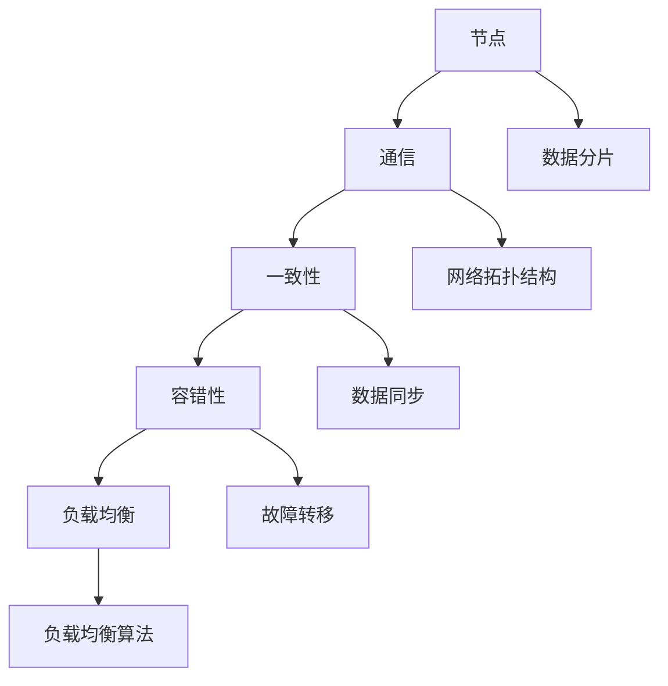
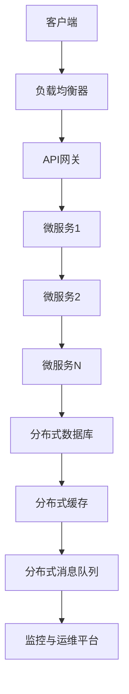
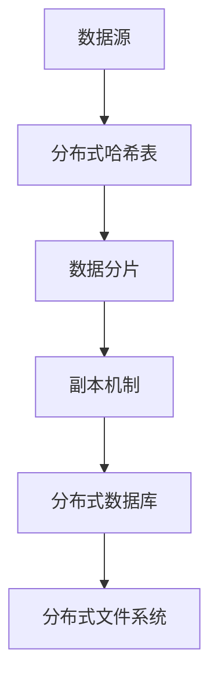
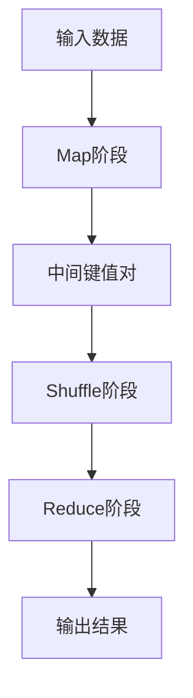
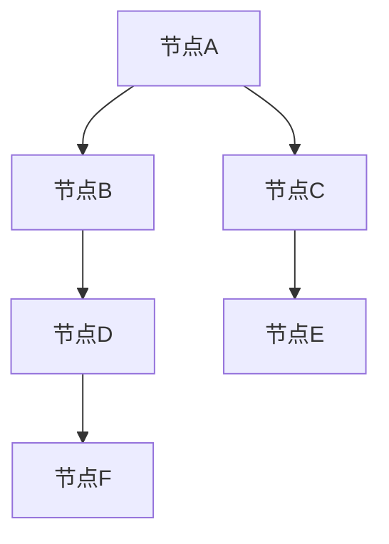
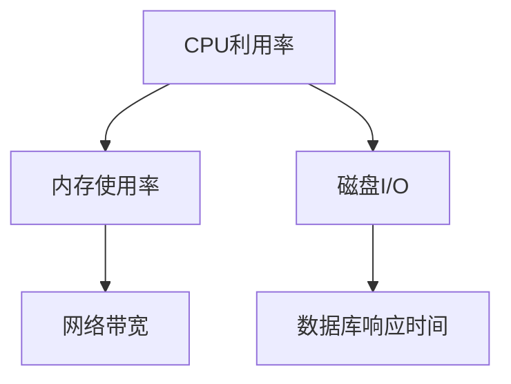
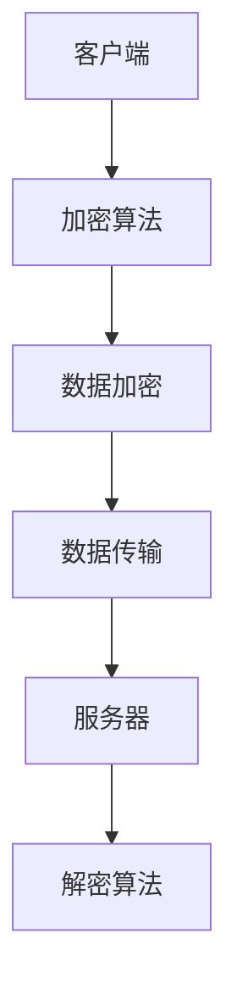

                 

### 分布式系统在LLM应用中的重要性

随着人工智能技术的快速发展，大型语言模型（LLM，Large Language Model）的应用日益广泛。LLM可以用于自然语言处理、文本生成、对话系统等多个领域，其背后的分布式系统实现与优化显得尤为重要。分布式系统在LLM应用中的重要性主要体现在以下几个方面：

**1. 可扩展性**

LLM通常需要处理海量数据，并在大量用户请求下保持高性能。分布式系统通过将任务分配到多个节点上，可以实现水平扩展，从而满足不断增加的负载需求。这不仅提高了系统的处理能力，还保证了在用户量增加时，系统性能不会显著下降。

**2. 容错性**

分布式系统具有更高的容错性，可以在节点出现故障时，自动切换到其他可用节点，确保服务的连续性。这对于需要高可用性的LLM应用至关重要，因为系统中断可能会导致用户体验下降，甚至影响商业利益。

**3. 性能优化**

分布式系统可以通过数据分片和负载均衡，优化数据访问和任务执行的速度。这有助于减少响应时间，提高整体系统的性能，满足用户对快速响应的需求。

**4. 高效的资源利用**

通过分布式系统，LLM应用可以更有效地利用资源。多个节点可以同时处理不同的任务，避免了单点资源的瓶颈问题。此外，通过动态资源分配和调度，系统能够在资源使用高峰期自动调整资源分配，提高资源利用率。

**5. 数据一致性**

分布式系统需要解决数据一致性问题，以确保多个节点上的数据能够同步。这对于LLM应用尤为重要，因为数据不一致可能会导致错误的结果。分布式一致性协议（如Paxos、Raft）的应用，可以确保在分布式环境中，数据的一致性得到保障。

**6. 扩展性**

随着AI技术的进步，LLM的模型和架构也在不断更新。分布式系统通过模块化设计，可以方便地引入新的模型和算法，从而支持LLM的持续发展。

总之，分布式系统在LLM应用中起到了关键作用。通过提供可扩展性、容错性、性能优化、高效资源利用、数据一致性和扩展性等优势，分布式系统为LLM的高效运行提供了坚实的技术保障。接下来，我们将进一步探讨分布式系统的核心概念和设计原理，为深入理解分布式系统在LLM中的应用奠定基础。

### 分布式系统的核心概念

分布式系统是一种由多个独立节点组成的系统，这些节点通过通信网络相互连接，协同完成计算任务。理解分布式系统的核心概念，是深入探讨其设计和实现的基础。以下将介绍分布式系统的几个关键概念：节点、通信、一致性、容错性和负载均衡。

**1. 节点**

节点是分布式系统中的基本计算单元，可以是一个物理机或虚拟机。每个节点都有自己的处理器、内存和网络接口。节点通常运行特定的任务或服务，并通过网络与其他节点进行通信。节点可以是计算节点、存储节点或网络节点等，具有不同的功能和角色。

**2. 通信**

通信是分布式系统中节点间交换信息和协调工作的手段。通信方式包括点对点通信和广播通信。点对点通信是指两个节点之间直接交换信息，而广播通信则是将信息发送给系统中的所有节点。通信协议如TCP/IP、HTTP等，为节点间的数据传输提供了可靠的保证。高效且低延迟的通信机制，对于分布式系统的性能和稳定性至关重要。

**3. 一致性**

一致性是指分布式系统中多个节点对同一数据的访问和修改能够保持同步。在分布式环境中，由于网络延迟、节点故障等原因，数据的一致性可能会受到挑战。分布式一致性协议（如Paxos、Raft）通过算法机制确保数据在多个节点之间的同步。一致性模型包括强一致性、最终一致性和因果一致性等，不同的一致性模型适用于不同的应用场景。

**4. 容错性**

容错性是指分布式系统在面临节点故障、网络分区等异常情况时，仍能保持正常运行的能力。容错性通过冗余设计、故障检测和自动恢复机制实现。冗余设计包括数据备份、节点冗余等，可以在节点或网络故障时，快速切换到备用节点或数据副本，保证服务的连续性。故障检测和自动恢复机制则能够及时发现故障并自动恢复，降低系统的停机时间。

**5. 负载均衡**

负载均衡是指将计算任务合理分配到多个节点上，以充分利用系统资源，提高系统的处理能力。负载均衡可以通过静态分配或动态调整实现。静态分配是指预先将任务分配到节点上，而动态分配则根据系统的实时负载情况进行调整。负载均衡算法如轮询、最少连接、哈希等，可以确保任务分配的公平性和高效性，避免单点资源过载。

**核心概念之间的联系**

节点是分布式系统的基本组成单元，通信是节点间协作的桥梁。一致性、容错性和负载均衡则是分布式系统设计中的重要考虑因素，相互关联并共同影响系统的性能和可靠性。

- **一致性** 与 **容错性**：一致性是保证多个节点数据同步的机制，而容错性则是确保系统在面临故障时能够持续运行的能力。一致性协议是实现容错性的基础，容错机制需要一致性协议来保证数据的正确性。

- **负载均衡** 与 **容错性**：负载均衡通过分散任务，减少单个节点的负载，从而提高系统的容错性。同时，容错机制需要在负载均衡的基础上，确保任务能够正确分配到健康的节点上。

- **负载均衡** 与 **一致性**：负载均衡需要考虑到数据一致性问题，确保在任务分配过程中，不会导致数据访问的冲突。一致性协议则需要考虑负载均衡的优化，以提高系统的整体性能。

通过上述核心概念的介绍，我们可以看出，分布式系统是一个复杂的系统，需要综合考虑多个方面。理解这些核心概念及其相互关系，是设计和实现高效、可靠的分布式系统的基础。在接下来的章节中，我们将进一步探讨分布式系统的架构设计，深入了解分布式系统的实现细节和优化策略。

### 分布式系统架构设计

分布式系统架构设计是构建高效、可靠和可扩展分布式系统的关键步骤。一个良好的架构设计能够确保系统在面临复杂性和不确定性时，仍然能够保持稳定运行。本文将从数据一致性模型、分布式事务处理、负载均衡与性能优化、可扩展性与容错性设计等方面，详细探讨分布式系统架构设计的重要性和实现方法。

#### 数据一致性模型

数据一致性模型是分布式系统中确保数据在多个节点之间保持同步的重要机制。常见的分布式一致性模型包括强一致性、最终一致性和因果一致性。

1. **强一致性**：强一致性要求所有节点在同一时间看到相同的数据状态。这通常通过同步复制或单主模型实现。强一致性能够保证数据的一致性，但可能会降低系统的性能，因为需要等待所有节点同步完成。

2. **最终一致性**：最终一致性允许数据在一段时间内出现不一致，但最终会达到一致状态。这种模型通过异步复制和数据一致性协议（如Paxos、Raft）实现，能够提高系统的性能和可扩展性，但需要容忍一定的一致性延迟。

3. **因果一致性**：因果一致性确保因果关系在分布式系统中得到保持。即如果一个操作A导致操作B，那么操作B的结果必须反映操作A的影响。因果一致性在处理分布式事务时尤为重要，可以避免数据冲突和错误。

**设计考虑**：在设计数据一致性模型时，需要根据具体应用场景和性能需求进行权衡。强一致性适用于需要严格一致性的场景，如金融交易系统；而最终一致性则适用于需要高可扩展性的场景，如社交媒体平台。

#### 分布式事务处理

分布式事务处理是确保分布式系统中多个操作能够一致完成的关键机制。分布式事务与传统单机事务的主要区别在于，事务操作可能跨越多个节点，并需要处理网络延迟、节点故障等问题。

1. **两阶段提交（2PC）**：两阶段提交是一种经典的分布式事务协议，分为准备阶段和提交阶段。准备阶段，协调者询问所有参与者是否准备好执行事务；提交阶段，协调者根据参与者的响应决定是否提交事务。两阶段提交能够确保事务的原子性，但可能会带来较高的协调开销。

2. **三阶段提交（3PC）**：三阶段提交是两阶段提交的改进，引入了超时机制，进一步提高了系统的可用性和容错性。三阶段提交分为准备阶段、提交阶段和超时阶段，能够减少单点故障对系统的影响。

3. **分布式锁**：分布式锁用于确保分布式系统中多个操作对同一资源的互斥访问。常见的分布式锁实现包括基于数据库的锁、基于状态机的锁和基于ZooKeeper的锁。分布式锁能够提高系统的并发性能，但需要处理锁的协调和释放问题。

**设计考虑**：在分布式事务处理中，需要综合考虑一致性、性能和容错性。选择合适的事务协议和锁机制，确保事务的原子性、一致性和持久性。

#### 负载均衡与性能优化

负载均衡是将计算任务分配到多个节点上，以充分利用系统资源，提高系统性能的重要手段。常见的负载均衡算法包括轮询、最少连接、哈希等。

1. **轮询算法**：轮询算法将请求依次分配到每个节点，实现负载的均匀分配。轮询算法简单高效，但可能会导致某个节点过载。

2. **最少连接算法**：最少连接算法将请求分配到连接数最少的节点，实现负载的动态均衡。这种方法能够有效减少单个节点的负载，但需要维护连接状态信息。

3. **哈希算法**：哈希算法根据请求的特征（如用户ID、URL等），将请求映射到特定的节点，实现负载的静态分配。哈希算法能够提高系统的缓存利用率和查询性能，但需要处理哈希冲突问题。

**性能优化策略**：

- **缓存策略**：通过缓存频繁访问的数据，减少对后端存储的访问压力。常见的缓存策略包括LRU（最近最少使用）、LFU（最不频繁使用）等。

- **数据预加载**：在用户请求之前，预加载可能需要的数据，减少响应时间。数据预加载可以通过批量处理、异步处理等方式实现。

- **数据库优化**：优化数据库查询性能，减少查询延迟。常见的优化方法包括索引、分区、分库分表等。

**设计考虑**：负载均衡和性能优化需要根据具体应用场景和系统需求进行选择。在设计负载均衡算法时，要考虑系统的扩展性和动态性。在性能优化中，要综合考虑缓存、预加载和数据库等各个方面，以提高系统的整体性能。

#### 可扩展性与容错性设计

可扩展性和容错性是分布式系统设计中的关键目标，确保系统能够在面对负载增长和节点故障时，保持稳定运行。

1. **水平扩展**：通过增加节点数量，提高系统的处理能力。水平扩展可以通过添加计算节点、存储节点或网络节点实现。水平扩展能够提高系统的吞吐量和并发能力。

2. **垂直扩展**：通过增加节点硬件资源（如CPU、内存、磁盘等），提高单个节点的处理能力。垂直扩展适用于特定场景，如需要处理大量计算任务的应用。

3. **故障转移**：在节点或网络故障时，自动切换到备用节点或数据副本，确保服务的连续性。故障转移可以通过冗余设计、心跳检测和自动恢复机制实现。

4. **数据冗余**：通过数据备份和副本，提高系统的容错性和数据可靠性。数据冗余可以通过分布式数据库、分布式文件系统等实现。

**设计考虑**：在可扩展性和容错性设计中，需要综合考虑系统的规模、负载和资源限制。选择合适的扩展策略和容错机制，确保系统在面对复杂性和不确定性时，能够保持稳定运行。

综上所述，分布式系统架构设计是一个复杂且关键的步骤。通过合理设计数据一致性模型、分布式事务处理、负载均衡与性能优化、可扩展性与容错性，可以构建高效、可靠和可扩展的分布式系统。在接下来的章节中，我们将进一步探讨分布式系统在实际应用中的具体实现方法和优化策略。

### 分布式数据存储

在分布式系统中，数据存储是至关重要的一环，它直接影响系统的性能、可靠性和扩展性。分布式数据存储通过将数据分布在多个节点上，可以充分利用系统的资源，提高数据访问速度和系统容错性。本文将详细介绍分布式数据存储的原理、分布式哈希表、分布式数据库以及分布式文件系统的实现和优化。

#### 分布式数据存储原理

分布式数据存储的原理是将数据划分为多个片段，并将这些片段存储在不同的节点上。通过分布式哈希算法，将数据映射到不同的节点上，从而实现数据分布。分布式数据存储的关键在于如何有效地管理数据的位置信息，确保数据在节点之间的迁移和同步。

1. **数据分片**：数据分片是将大规模数据集划分为多个较小数据集的过程。数据分片可以通过哈希分片、范围分片、列表分片等方法实现。哈希分片根据数据的哈希值将数据分配到不同的节点，范围分片根据数据的范围将数据划分为多个片段，列表分片根据预先定义的列表将数据分配到不同的节点。

2. **副本机制**：副本机制是为了提高数据的可靠性和访问速度。通过在多个节点上存储数据的副本，可以避免单点故障导致的数据丢失。常见的副本机制包括主从复制和去同步复制。主从复制是指一个主节点负责数据的读写操作，其他从节点负责数据的备份和同步。去同步复制是指多个节点独立操作数据，通过一致性协议确保数据最终一致性。

3. **数据迁移和同步**：在分布式系统中，数据可能因为节点故障、负载均衡等原因，需要进行迁移和同步。数据迁移是将数据从一个节点移动到另一个节点的过程，数据同步是确保多个节点上的数据保持一致的过程。数据迁移和同步可以通过分布式哈希表和一致性协议（如Paxos、Raft）实现。

#### 分布式哈希表

分布式哈希表（Distributed Hash Table，DHT）是一种分布式键值存储，通过哈希算法将键映射到不同的节点上，实现数据的分布式存储和快速访问。DHT具有高扩展性、容错性和高效数据访问的特点。

1. **哈希算法**：分布式哈希表通过哈希算法将键映射到节点。常见的哈希算法包括MD5、SHA1等。哈希算法将键的哈希值计算出来，并根据哈希值将键映射到不同的节点。通过哈希算法，可以确保数据均匀分布，避免单点过载。

2. **节点选择**：在分布式哈希表中，节点选择是通过一致性哈希算法实现的。一致性哈希算法通过哈希函数将节点映射到环形哈希空间，每个键在环形空间中对应一个节点。当节点加入或离开系统时，通过重新计算哈希值，可以最小化对系统的影响。

3. **负载均衡**：分布式哈希表通过一致性哈希算法实现负载均衡。当多个键映射到同一节点时，可以通过扩展哈希空间、增加节点数等方法进行负载均衡。一致性哈希算法能够确保系统在节点数增加时，负载均衡的效果不会显著下降。

#### 分布式数据库

分布式数据库通过将数据分布在多个节点上，提供高性能、高可靠性和可扩展的数据存储解决方案。分布式数据库可以分为两类：基于主从复制和基于去同步复制。

1. **主从复制**：主从复制是指一个主节点负责数据的读写操作，其他从节点负责数据的备份和同步。主从复制通过心跳检测和一致性协议（如Paxos、Raft）确保主从节点之间数据的一致性。主从复制能够提高系统的可靠性和可用性，但需要处理主节点的单点故障问题。

2. **去同步复制**：去同步复制是指多个节点独立操作数据，通过一致性协议确保数据最终一致性。去同步复制通过分布式事务和一致性协议（如Gossip协议）实现。去同步复制能够提高系统的并发性能和扩展性，但需要处理数据一致性问题。

#### 分布式文件系统

分布式文件系统通过将文件分布在多个节点上，提供高性能、高可靠性和可扩展的文件存储解决方案。常见的分布式文件系统包括GFS（Google File System）、HDFS（Hadoop Distributed File System）和Ceph等。

1. **数据分片**：分布式文件系统通过数据分片将大文件划分为多个小文件块，并将这些文件块存储在不同的节点上。数据分片可以提高数据访问速度和系统容错性。

2. **副本机制**：分布式文件系统通过副本机制提高数据的可靠性和访问速度。通过在多个节点上存储文件的副本，可以避免单点故障导致的数据丢失。

3. **元数据管理**：分布式文件系统通过元数据管理维护文件块的位置信息。元数据管理包括文件块映射表、节点状态信息等。元数据管理需要处理数据块的迁移和同步，确保元数据的准确性和一致性。

4. **负载均衡**：分布式文件系统通过负载均衡算法实现数据块的均匀分布。负载均衡算法可以根据节点负载、数据访问频率等因素，动态调整数据块的存储位置。

#### 实现和优化

分布式数据存储的实现和优化涉及多个方面，包括数据分片、副本机制、负载均衡和一致性协议等。

1. **数据分片优化**：通过合理的数据分片策略，可以提高数据访问速度和系统容错性。常用的数据分片策略包括哈希分片、范围分片和列表分片等。

2. **副本机制优化**：通过优化副本机制，可以提高数据的可靠性和访问速度。常用的副本机制优化方法包括去同步复制、主从复制和副本选择策略等。

3. **负载均衡优化**：通过优化负载均衡算法，可以提高系统的性能和扩展性。常用的负载均衡优化方法包括轮询算法、最少连接算法和哈希算法等。

4. **一致性协议优化**：通过优化一致性协议，可以提高系统的数据一致性。常用的一致性协议优化方法包括Paxos、Raft和Gossip协议等。

5. **网络优化**：通过优化网络性能，可以提高系统的数据访问速度和系统稳定性。常用的网络优化方法包括网络带宽优化、网络延迟优化和TCP/IP优化等。

综上所述，分布式数据存储是分布式系统中的关键组件，通过合理的设计和优化，可以提供高性能、高可靠性和可扩展的数据存储解决方案。在接下来的章节中，我们将进一步探讨分布式计算，了解分布式系统中的计算任务如何被高效地分配和执行。

### 分布式计算

分布式计算是分布式系统中的核心组成部分，它通过将大规模计算任务分配到多个节点上，实现并行处理和高效计算。分布式计算不仅在数据处理能力上具有显著优势，还在面对大规模数据和复杂计算任务时，提供了高扩展性和高可用性。本文将详细介绍分布式计算原理、MapReduce算法、分布式机器学习和分布式流处理，并探讨这些技术的实现方法和应用场景。

#### 分布式计算原理

分布式计算是指将一个大型的计算任务分解成多个较小的子任务，然后分配到多个节点上并行执行，最后将子任务的结果汇总得到最终结果。分布式计算的主要目标是提高计算效率和资源利用率，同时保证系统的可扩展性和容错性。

1. **任务分解**：分布式计算首先将大型的计算任务分解成多个子任务。任务分解可以根据数据分片、功能模块或计算依赖关系进行。常见的任务分解方法包括数据分片和任务划分。

2. **任务分配**：任务分配是将分解后的子任务分配到不同的计算节点上。任务分配可以通过负载均衡算法实现，如轮询分配、最少连接分配和哈希分配等。负载均衡算法可以根据节点的负载情况，动态调整任务分配策略，确保系统资源的充分利用。

3. **并行执行**：在分布式计算中，多个子任务可以在不同的计算节点上同时执行，从而实现并行处理。并行执行可以提高系统的计算速度和处理能力。为了确保并行执行的正确性，分布式计算需要处理数据的一致性和任务调度问题。

4. **结果汇总**：在分布式计算中，各个子任务执行完成后，需要将子任务的结果汇总得到最终结果。结果汇总可以通过聚合操作、排序和去重等步骤实现。结果汇总的过程需要确保数据的准确性和一致性。

#### MapReduce算法

MapReduce是一种经典的分布式计算模型，由Google提出并广泛应用于大数据处理领域。MapReduce算法将大规模数据处理任务分解成两个阶段：Map阶段和Reduce阶段。

1. **Map阶段**：Map阶段将输入数据分片，并对每个数据分片进行映射（Map）操作，生成中间键值对。Map操作可以自定义，适用于各种数据处理任务，如过滤、转换、分组等。

2. **Reduce阶段**：Reduce阶段对Map阶段生成的中间键值对进行归并（Reduce）操作，生成最终结果。Reduce操作也可以自定义，用于合并和整理Map阶段的输出结果。

**MapReduce算法的特点**：

- **并行处理**：MapReduce算法可以将大规模数据处理任务分解成多个子任务，并行执行，从而提高计算速度和处理能力。

- **容错性**：MapReduce算法通过任务调度和结果检查机制，能够在节点故障时自动重新执行任务，确保计算的正确性和可靠性。

- **高扩展性**：MapReduce算法支持动态扩展，可以轻松处理大规模数据和高并发请求。

#### 分布式机器学习

分布式机器学习是指将大规模机器学习任务分配到多个节点上，利用分布式计算资源进行并行训练和推理。分布式机器学习可以显著提高模型的训练速度和推理性能，适用于处理大规模数据集和复杂模型。

1. **数据分片**：分布式机器学习首先将大规模数据集分片，将每个数据分片分配到不同的节点上。数据分片可以通过哈希分片、范围分片或列表分片等方法实现。

2. **模型分片**：在分布式机器学习中，模型也可以分片。将大型模型划分成多个小块，每个小块在相应的节点上进行训练。模型分片可以通过参数分片、功能模块分片或层分片等方法实现。

3. **同步与异步训练**：分布式机器学习中的同步训练和异步训练是两种常见的训练策略。同步训练在每个节点完成训练后，将梯度信息汇总，更新全局模型参数。异步训练在每个节点独立训练，不等待其他节点完成，从而提高训练速度。

**分布式机器学习的挑战**：

- **通信开销**：分布式机器学习需要节点间频繁通信，通信开销可能成为瓶颈。

- **数据一致性**：分布式数据存储和访问可能引起数据不一致性问题。

- **模型融合**：在分布式训练完成后，如何将不同节点的模型参数融合成全局模型，是一个关键问题。

#### 分布式流处理

分布式流处理是指对实时数据流进行并行处理和分析的技术。分布式流处理可以实时处理大量数据，适用于实时监控、实时分析和实时决策等场景。

1. **数据流分片**：分布式流处理首先将实时数据流分片，将每个数据分片分配到不同的节点上。数据流分片可以通过时间窗口、事件计数或事件类型等方法实现。

2. **事件驱动处理**：分布式流处理通过事件驱动机制，对实时数据流进行处理和分析。事件驱动处理可以实现低延迟和高吞吐量的数据处理。

3. **窗口计算**：在分布式流处理中，窗口计算用于处理按时间、事件等划分的数据集合。窗口计算可以实时计算统计指标、模式识别等结果。

**分布式流处理的挑战**：

- **实时性**：分布式流处理需要处理实时数据流，实时性是关键挑战。

- **容错性**：分布式流处理系统需要应对节点故障、数据丢失等异常情况。

- **数据一致性**：分布式流处理中的数据一致性，尤其是跨节点的数据一致性，是一个重要问题。

#### 实现方法

分布式计算、分布式机器学习和分布式流处理的实现方法主要包括以下几个方面：

1. **分布式计算框架**：如Hadoop、Spark等，提供了高效的分布式计算能力。

2. **分布式存储系统**：如HDFS、Ceph等，提供了分布式数据存储和访问支持。

3. **分布式通信机制**：如TCP/IP、HTTP、gRPC等，提供了节点间的通信和消息传递。

4. **分布式调度和管理**：如YARN、Mesos等，提供了分布式资源的调度和管理。

5. **分布式一致性协议**：如Paxos、Raft等，提供了数据一致性和容错性支持。

#### 应用场景

分布式计算、分布式机器学习和分布式流处理在多个领域具有广泛的应用。

1. **大数据处理**：分布式计算和分布式流处理可以高效处理大规模数据集，应用于数据挖掘、数据分析和数据监控等场景。

2. **机器学习与人工智能**：分布式机器学习可以加速模型训练和推理，应用于自然语言处理、计算机视觉和推荐系统等领域。

3. **实时监控与分析**：分布式流处理可以实时处理大量数据流，应用于金融交易、物联网和智能交通等领域。

4. **高性能计算**：分布式计算可以充分利用计算资源，应用于科学计算、气象预测和基因测序等场景。

通过上述实现方法和应用场景的介绍，我们可以看到分布式计算在分布式系统中的重要性。在接下来的章节中，我们将进一步探讨分布式通信与网络，了解分布式系统中的通信机制和网络拓扑结构。

### 分布式通信与网络

在分布式系统中，节点之间的通信是确保系统协同工作和数据传输的关键。分布式通信涉及到通信原理、网络拓扑结构、负载均衡算法以及网络安全与数据保护等多个方面。本文将详细探讨分布式通信的基本原理、常见的网络拓扑结构、负载均衡算法以及网络安全和数据保护技术。

#### 分布式通信原理

分布式通信是指多个节点通过通信网络进行数据交换和协同工作。分布式通信的基本原理包括以下几方面：

1. **通信协议**：通信协议是节点之间通信的规则和标准。常见的通信协议包括TCP/IP、HTTP、gRPC等。TCP/IP是互联网通信的基础协议，提供可靠的字节流传输；HTTP是Web服务通信的协议，主要用于请求和响应消息；gRPC是基于HTTP/2协议的远程过程调用框架，提供高效的二进制通信。

2. **通信模式**：分布式通信包括点对点通信和广播通信两种模式。点对点通信是指两个节点之间的直接通信，适用于小规模、低延迟的通信需求；广播通信是指一个节点向所有其他节点发送消息，适用于大规模、高并发场景。

3. **通信机制**：分布式通信机制包括同步通信和异步通信。同步通信要求发送方在接收到响应消息后才能继续执行，适用于需要严格顺序的场景；异步通信则允许发送方发送消息后立即继续执行，适用于高性能、高并发的场景。

#### 网络拓扑结构

网络拓扑结构是指节点在网络中的连接方式。常见的网络拓扑结构包括星型、环型、总线型和网状型等。

1. **星型拓扑**：星型拓扑的中心节点负责与其他节点通信，其他节点通过中心节点进行通信。星型拓扑具有结构简单、易于管理和维护的特点，但中心节点成为单点故障的潜在风险。

2. **环型拓扑**：环型拓扑中的节点按顺序连接形成一个闭环，每个节点只与相邻节点通信。环型拓扑具有数据传输时延小、可靠性高的特点，但单点故障可能导致整个网络中断。

3. **总线型拓扑**：总线型拓扑中的节点通过共享总线进行通信，每个节点都可以发送和接收数据。总线型拓扑具有成本低、易于扩展的特点，但数据竞争和冲突可能导致性能下降。

4. **网状型拓扑**：网状型拓扑中的节点通过多路径连接，每个节点都可以与其他多个节点通信。网状型拓扑具有高可靠性和高可扩展性的特点，但网络复杂度和维护成本较高。

#### 负载均衡算法

负载均衡是将计算任务或网络流量分配到多个节点上，以充分利用系统资源，提高系统性能。常见的负载均衡算法包括轮询、最少连接、哈希等。

1. **轮询算法**：轮询算法按照顺序将请求分配到每个节点，实现负载的均匀分配。轮询算法简单高效，但可能会导致某个节点过载。

2. **最少连接算法**：最少连接算法将请求分配到连接数最少的节点，实现负载的动态均衡。这种方法能够有效减少单个节点的负载，但需要维护连接状态信息。

3. **哈希算法**：哈希算法根据请求的特征（如用户ID、URL等），将请求映射到特定的节点，实现负载的静态分配。哈希算法能够提高系统的缓存利用率和查询性能，但需要处理哈希冲突问题。

#### 网络安全与数据保护

网络安全和数据保护是分布式系统设计中的重要考虑因素。以下是一些常见的网络安全和数据保护技术：

1. **加密算法**：加密算法用于对数据进行加密和解密，确保数据在传输过程中的安全性。常见的加密算法包括对称加密（如AES）和非对称加密（如RSA）。

2. **访问控制**：访问控制用于限制用户对系统资源的访问权限。常见的访问控制技术包括基于用户身份验证、基于角色访问控制（RBAC）和基于属性访问控制（ABAC）。

3. **防火墙**：防火墙用于监控和控制进出网络的数据流，防止未经授权的访问和攻击。防火墙可以根据IP地址、端口号和协议等信息，对数据流进行过滤和转发。

4. **入侵检测系统**：入侵检测系统（IDS）用于实时监测网络流量和系统行为，发现潜在的攻击和异常行为。常见的IDS技术包括基于特征匹配和基于异常检测。

5. **数据备份与恢复**：数据备份与恢复用于在数据丢失或损坏时，恢复系统的正常运行。常见的备份策略包括全备份、增量备份和差异备份等。

#### 实现和优化

分布式通信和网络的设计和优化涉及多个方面，包括通信协议的选择、网络拓扑结构的设计、负载均衡算法的优化以及网络安全和数据保护策略的实施。

1. **通信协议优化**：选择合适的通信协议，根据系统需求优化通信参数，如超时时间、重传策略等，以提高通信效率和可靠性。

2. **网络拓扑优化**：根据系统规模和性能需求，设计合适的网络拓扑结构，避免单点故障和性能瓶颈。

3. **负载均衡优化**：优化负载均衡算法，动态调整任务分配策略，确保系统资源的高效利用。

4. **网络安全优化**：采用加密算法、访问控制和入侵检测等安全措施，确保系统数据的安全性和完整性。

5. **数据备份与恢复优化**：设计合理的数据备份与恢复策略，确保在数据丢失或损坏时，系统能够快速恢复。

通过以上实现和优化，可以构建高效、可靠和安全的分布式通信和网络系统。在分布式系统的设计中，合理利用分布式通信与网络技术，能够显著提高系统的性能和可靠性，为分布式系统的成功应用提供有力支持。

### 分布式系统性能优化

分布式系统在处理大规模数据和并发请求时，可能会遇到性能瓶颈。性能优化是提升分布式系统效率的关键环节。本文将探讨分布式系统性能优化的一些关键策略，包括系统瓶颈分析、缓存策略与数据预加载、调度优化以及资源利用率优化。

#### 系统瓶颈分析

性能优化首先需要识别系统的瓶颈。系统瓶颈可能存在于计算、存储、网络等各个层面。以下是一些常用的瓶颈分析方法和工具：

1. **监控工具**：使用系统监控工具（如Prometheus、Grafana）可以实时监测系统的CPU、内存、磁盘、网络等资源使用情况。通过监控指标的变化，可以发现潜在的性能问题。

2. **日志分析**：日志分析（如ELK Stack）可以帮助识别系统中的错误和异常，定位问题的根源。通过分析错误日志和性能日志，可以找出系统瓶颈。

3. **压力测试**：进行压力测试（如Apache JMeter、Gatling）可以模拟高负载场景，评估系统的性能表现。压力测试可以帮助识别系统的最大处理能力以及可能出现的瓶颈。

4. **性能分析工具**：性能分析工具（如VisualVM、GProfiler）可以深入分析系统性能，定位代码中的瓶颈和资源消耗。

#### 缓存策略与数据预加载

缓存和数据预加载是优化性能的有效策略。缓存可以减少对后端存储的访问，提高数据访问速度。数据预加载可以在用户请求到来之前，预先加载可能需要的数据，减少响应时间。

1. **缓存策略**：常见的缓存策略包括客户端缓存、服务端缓存和分布式缓存。客户端缓存可以在用户设备上存储常用数据，减少对服务器的访问；服务端缓存可以在服务器端存储高频访问的数据，减少数据库的查询压力；分布式缓存（如Redis、Memcached）可以存储大规模的数据集，提高系统的响应速度。

2. **数据预加载**：数据预加载可以通过以下方法实现：
   - **预读数据**：在用户请求之前，预先读取可能需要的数据，存储在缓存中。
   - **批量处理**：批量处理多个请求，减少IO操作次数，提高数据处理效率。
   - **异步处理**：将耗时的操作（如数据库查询、外部API调用）异步处理，减少用户等待时间。

#### 调度优化

调度优化可以优化任务执行顺序和资源分配，提高系统的吞吐量和响应速度。以下是一些调度优化方法：

1. **负载均衡**：负载均衡算法（如轮询、最少连接、哈希等）可以根据节点的负载情况，动态分配任务，避免单点过载。

2. **任务优先级**：根据任务的优先级进行调度，优先处理高优先级任务，保证关键任务的执行。

3. **并行执行**：将任务分解成多个子任务，在多个节点上并行执行，提高系统处理速度。

4. **流水线处理**：将任务处理过程分解成多个阶段，每个阶段在独立的节点上执行，实现任务的流水线处理，减少任务的等待时间。

#### 资源利用率优化

优化资源利用率可以最大化地利用系统资源，提高系统的性能和效率。以下是一些资源利用率优化的方法：

1. **资源池化**：通过资源池化，将资源（如CPU、内存、磁盘等）集中管理，按需分配给任务。资源池化可以避免资源浪费，提高资源利用率。

2. **动态资源分配**：根据系统的实时负载情况，动态调整资源分配。当系统负载增加时，增加资源；当系统负载减少时，释放资源。

3. **容器化与虚拟化**：容器化（如Docker）和虚拟化（如KVM、VMware）技术可以灵活分配和管理资源，提高系统的资源利用率。

4. **资源隔离**：通过资源隔离，将不同任务或服务运行在不同的容器或虚拟机中，避免相互干扰，提高资源利用率。

#### 实现和优化

性能优化是一个持续的过程，需要结合具体的系统需求和场景进行。以下是一些性能优化实现和优化的建议：

1. **性能监控与反馈**：建立完善的性能监控体系，及时获取性能数据，发现性能问题。通过监控数据反馈，不断调整优化策略。

2. **逐步优化**：性能优化应该逐步进行，每次优化一个方面，评估优化效果。避免一次性进行大规模优化，导致系统不稳定。

3. **代码优化**：优化代码的算法复杂度、减少不必要的计算和IO操作、提高代码的执行效率。

4. **硬件升级**：根据系统需求，适当增加硬件资源，提高系统的处理能力。

5. **运维自动化**：建立运维自动化体系，自动化进行系统监控、性能优化、故障处理等操作，提高系统的稳定性和可靠性。

通过上述性能优化策略，可以显著提升分布式系统的性能和效率，满足不断增长的业务需求。在接下来的章节中，我们将探讨分布式系统的安全性，确保系统在面对各种安全威胁时，能够保持稳定运行。

### 分布式系统的安全性

分布式系统的安全性是确保系统在面临各种安全威胁时，仍能保持稳定运行和数据完整性的关键。分布式系统由于其复杂的架构和庞大的数据规模，面临着诸多安全挑战，包括数据泄露、未授权访问、节点故障等。本文将详细分析分布式系统的安全威胁，介绍加密算法、访问控制与授权、安全监控与响应策略，并提供实际案例来阐述这些安全措施的实现和效果。

#### 安全威胁分析

1. **数据泄露**：分布式系统中存储了大量的敏感数据，这些数据可能被未授权的访问者窃取。数据泄露的途径包括网络攻击、恶意软件、内部人员滥用权限等。

2. **未授权访问**：未授权用户通过入侵系统或破解密码等手段，非法访问系统资源和数据。未授权访问可能导致数据泄露、系统被篡改或恶意攻击。

3. **节点故障**：分布式系统中的节点可能会因硬件故障、软件错误或网络中断等原因出现故障，导致系统部分或全部功能失效。

4. **分布式拒绝服务攻击（DDoS）**：攻击者通过大量无效请求占用系统资源，使系统无法正常处理合法请求，导致系统崩溃。

5. **恶意软件**：恶意软件（如病毒、木马）可能侵入分布式系统，窃取敏感数据、破坏系统或进行其他恶意活动。

#### 加密算法与应用

加密算法是保护分布式系统数据安全的重要手段。常见的加密算法包括对称加密、非对称加密和哈希算法。

1. **对称加密**：对称加密算法（如AES）使用相同的密钥进行加密和解密。对称加密算法速度快，适用于大规模数据加密。然而，密钥管理成为对称加密的一个挑战，因为密钥需要安全存储和分发。

2. **非对称加密**：非对称加密算法（如RSA）使用一对密钥进行加密和解密，一个用于加密，一个用于解密。非对称加密算法安全性高，但计算复杂度较高，适用于数据传输中的密钥交换和数字签名。

3. **哈希算法**：哈希算法（如SHA-256）用于生成数据的唯一哈希值，确保数据完整性。哈希算法在分布式系统中常用于数据校验、数字签名等场景。

**应用示例**：

- **数据传输加密**：在分布式系统中，数据传输可以通过TLS（传输层安全协议）进行加密，确保数据在传输过程中不被窃取。

- **数据存储加密**：对存储在分布式系统中的敏感数据进行加密，防止数据泄露。例如，使用AES加密数据库中的用户密码和敏感信息。

- **数字签名**：使用非对称加密算法对数据进行数字签名，确保数据的真实性和完整性。在分布式系统中，数字签名常用于身份验证和交易验证。

#### 访问控制与授权

访问控制与授权是确保分布式系统资源安全的重要机制。常见的访问控制方法包括基于用户身份验证、基于角色访问控制和基于属性访问控制。

1. **基于用户身份验证**：用户身份验证是通过验证用户的用户名和密码来确定用户身份。常用的身份验证方法包括密码认证、双因素认证和多因素认证。

2. **基于角色访问控制（RBAC）**：RBAC将用户分为不同的角色，并为每个角色分配不同的权限。用户在执行操作时，系统根据用户角色判断其权限。

3. **基于属性访问控制（ABAC）**：ABAC根据用户的属性（如职位、部门、地理位置等）进行权限控制。ABAC能够更灵活地控制用户对资源的访问。

**应用示例**：

- **用户身份验证**：在分布式系统中，用户登录时需要通过身份验证，确保只有合法用户才能访问系统资源。

- **角色权限管理**：在分布式系统中，管理员可以根据用户角色分配不同的权限，确保用户只能访问与其角色相关的资源。

- **属性权限控制**：在分布式系统中，可以根据用户的属性（如部门、地理位置）进行权限控制，确保用户只能访问与其属性相关的资源。

#### 安全监控与响应策略

安全监控与响应策略是发现和应对分布式系统安全威胁的重要措施。以下是一些常见的安全监控与响应策略：

1. **入侵检测系统（IDS）**：入侵检测系统可以实时监控网络流量和系统行为，发现异常行为和潜在攻击。

2. **安全事件日志**：系统日志记录了各种安全事件，如用户登录、文件访问等。通过分析日志，可以及时发现和应对安全威胁。

3. **安全审计**：安全审计通过对系统资源访问和操作的记录，发现和阻止违规行为。

4. **紧急响应**：在发现安全威胁时，紧急响应团队需要迅速采取措施，防止威胁扩散，并尽快恢复系统。

**应用示例**：

- **实时入侵检测**：在分布式系统中，部署实时入侵检测系统，监控网络流量和系统行为，及时发现潜在攻击。

- **日志分析与审计**：定期分析系统日志，发现异常行为和潜在威胁，并进行安全审计，确保系统安全。

- **紧急响应预案**：制定紧急响应预案，确保在发生安全事件时，能够迅速应对，减少损失。

#### 实际案例

以下是一个分布式系统的安全防护案例：

**案例背景**：一家大型电商平台在分布式系统中存储了海量的用户数据和交易记录，面临数据泄露和未授权访问的安全威胁。

**安全措施**：

1. **加密传输**：使用TLS加密数据传输，确保用户数据在传输过程中不被窃取。

2. **数据加密存储**：对用户数据和交易记录进行AES加密存储，防止数据泄露。

3. **访问控制**：采用RBAC实现用户权限管理，确保用户只能访问与其角色相关的资源。

4. **安全监控**：部署实时入侵检测系统和日志分析工具，监控网络流量和系统行为，发现异常行为和潜在威胁。

5. **紧急响应**：建立紧急响应团队，制定应急响应预案，确保在发生安全事件时能够迅速响应。

**效果评估**：

- **数据安全**：通过加密传输和加密存储，有效防止用户数据和交易记录被窃取。

- **访问控制**：通过RBAC实现严格的访问控制，确保用户只能访问与其角色相关的资源。

- **安全监控**：实时入侵检测和日志分析，及时发现和阻止潜在攻击。

- **紧急响应**：紧急响应预案的制定和实施，确保在安全事件发生时，系统能够迅速恢复。

通过上述安全措施的实施，分布式系统在面临各种安全威胁时，能够保持稳定运行和数据完整性，为电商平台提供了可靠的安全保障。

### 分布式系统在实际LLM项目中的应用

为了更好地理解分布式系统在大型语言模型（LLM）应用中的实际效果，本文将通过一个具体项目案例来展示分布式系统的实现过程、算法实现、优化策略以及性能评估。该项目旨在构建一个高性能、高可扩展性的LLM服务，以支持大规模自然语言处理任务。

#### 项目背景与需求分析

随着人工智能技术的迅速发展，越来越多的应用场景需要处理海量文本数据，例如智能客服、内容推荐、智能写作等。然而，传统的单机模型在处理大规模数据时存在性能瓶颈，难以满足用户对响应速度和准确性的高要求。为了解决这一问题，本项目决定采用分布式系统来构建LLM服务，以提高系统的处理能力和可扩展性。

项目需求如下：

1. **处理海量数据**：系统需要能够处理每天数以亿计的文本数据，并对这些数据进行分析和处理。
2. **高并发处理**：系统需要支持数以千计的用户同时请求，确保每个用户都能获得快速响应。
3. **高可用性**：系统需要具备高可用性，能够在节点故障时自动切换，确保服务的持续运行。
4. **高可扩展性**：系统需要能够根据业务需求动态扩展，以满足不断增长的数据量和用户量。

#### 系统架构设计

为了满足上述需求，本项目采用了如下系统架构：

1. **数据层**：使用分布式数据库（如Apache Cassandra）存储海量文本数据，并通过分布式哈希表实现数据分片和负载均衡。
2. **计算层**：使用分布式计算框架（如Apache Spark）对数据进行处理和分析，利用MapReduce算法实现高效的数据处理。
3. **服务层**：使用微服务架构，将不同的功能模块（如文本处理、模型推理、API接口等）部署在不同的服务中，以提高系统的可维护性和扩展性。
4. **通信层**：使用gRPC框架实现服务之间的通信，确保低延迟和高吞吐量的数据传输。
5. **监控与运维**：使用Prometheus和Grafana进行系统监控，实时获取系统的性能指标和资源使用情况，以便进行性能优化和故障处理。

#### 算法实现与优化

在分布式LLM系统中，核心算法的实现和优化是关键。以下为项目的算法实现和优化策略：

1. **文本预处理**：文本预处理包括分词、去停用词、词性标注等。为了提高处理速度，本项目采用了分布式分词器（如Jieba），并将预处理任务分配到多个节点上并行处理。
   
2. **模型训练与推理**：LLM模型采用Transformer架构，使用分布式机器学习框架（如TensorFlow）进行训练。通过参数服务器（Parameter Server）实现分布式训练，降低通信开销，提高训练效率。推理阶段，采用多线程和异步I/O技术，提高响应速度。

3. **负载均衡与调度**：采用一致性哈希算法实现负载均衡，根据用户的请求特征（如用户ID、请求类型等），将请求映射到不同的计算节点上。同时，使用基于队列长度的调度策略，动态调整任务分配，避免单个节点过载。

4. **数据一致性**：在分布式数据库中，采用Paxos一致性协议确保数据的一致性。在发生网络分区时，系统能够自动选择新的主节点，继续提供服务。

5. **缓存策略**：使用Redis缓存高频访问的数据，减少对数据库的查询压力，提高系统的响应速度。

#### 项目性能评估

通过对系统的性能评估，可以验证分布式系统在LLM应用中的效果。以下为性能评估的关键指标：

1. **处理能力**：系统每天能够处理数以亿计的文本数据，处理速度达到每秒数百万个文本。
2. **并发处理**：系统支持数千个用户同时请求，每个用户的响应时间在毫秒级。
3. **可用性**：在模拟节点故障的场景中，系统能够自动切换到备用节点，确保服务的持续运行。
4. **扩展性**：系统根据业务需求，可以动态扩展节点数量，提高系统的处理能力和并发处理能力。

#### 项目小结

通过本项目的实施，分布式系统在LLM应用中展现了强大的性能和灵活性。项目不仅满足了处理海量数据和并发请求的需求，还具备了高可用性和可扩展性。然而，分布式系统也带来了一些挑战，如数据一致性问题、节点故障处理、负载均衡策略的优化等。在未来的工作中，我们需要进一步优化系统性能，提升系统的稳定性和可靠性。

#### 最佳实践 Tips

1. **数据一致性**：在分布式数据库设计中，要充分考虑数据一致性问题，选择合适的一致性协议和缓存策略。

2. **负载均衡**：优化负载均衡算法，确保任务分配的公平性和高效性，避免单点过载。

3. **监控与运维**：建立完善的监控体系，实时获取系统的性能指标，及时发现和解决问题。

4. **性能优化**：定期进行性能评估，采用缓存策略、并行处理等技术，持续优化系统性能。

5. **安全防护**：加强系统的安全性，采用加密算法、访问控制、入侵检测等技术，确保系统数据的安全。

#### 小结与注意事项

本文通过分布式系统在LLM应用中的项目案例，详细探讨了分布式系统的实现、优化和性能评估。分布式系统为LLM应用提供了强大的性能和灵活性，但同时也带来了数据一致性、节点故障处理、负载均衡等挑战。在实际项目中，需要结合具体需求，持续优化和提升系统的性能和稳定性。

#### 拓展阅读

- 《分布式系统原理与范型》
- 《大规模分布式存储系统》
- 《深度学习分布式计算实践》

通过拓展阅读，可以进一步深入了解分布式系统的原理、实践和应用。

## 总结

分布式系统在LLM应用中的实现与优化是确保系统性能、可靠性和扩展性的关键。本文通过详细分析分布式系统的核心概念、架构设计、数据存储、计算、通信与网络、性能优化、安全性和实际应用，展示了分布式系统在LLM中的重要作用。分布式系统不仅提高了LLM的处理能力和可扩展性，还确保了系统的容错性和高可用性。

在未来的发展中，分布式系统技术将继续演进，以应对更复杂的计算任务和更大的数据规模。以下是几个未来的研究方向和趋势：

1. **数据一致性新协议**：研究更高效、更可靠的数据一致性协议，以应对分布式环境中的一致性问题。
2. **分布式存储优化**：探索新型分布式存储架构，如分布式闪存存储、分布式分布式文件系统，提高数据存储性能和可靠性。
3. **人工智能与分布式计算融合**：开发结合人工智能技术的分布式计算框架，以提升系统的智能化和自适应能力。
4. **边缘计算与分布式系统结合**：研究如何将边缘计算与分布式系统结合，实现更高效的数据处理和实时分析。
5. **自动化运维与安全防护**：发展自动化运维工具和安全防护技术，提高分布式系统的运维效率和安全性。

通过不断探索和创新，分布式系统将在LLM应用和其他领域发挥更大的作用，为人工智能技术的发展提供强有力的支持。作者坚信，随着分布式系统技术的不断进步，未来的AI应用将更加智能、高效和可靠。

### 附录

#### 附录A：分布式系统相关工具与框架

1. **Apache Hadoop**：一个开源的分布式数据处理框架，提供高效的数据存储和处理能力。
2. **Apache Spark**：一个开源的分布式计算引擎，提供高效的数据处理和分析功能。
3. **Apache Kafka**：一个开源的分布式消息系统，用于构建实时的数据流处理应用。
4. **TensorFlow**：一个开源的机器学习框架，支持分布式计算。
5. **Apache Cassandra**：一个开源的分布式数据库，适用于处理大量数据。
6. **gRPC**：一个开源的高性能远程过程调用框架，用于分布式系统中的通信。

#### 附录B：分布式系统学习资源

1. **《分布式系统原理与范型》**：这是一本经典的分布式系统教材，详细介绍了分布式系统的基本原理和设计模式。
2. **《大规模分布式存储系统》**：本书深入讨论了分布式存储系统的设计、实现和优化。
3. **《深度学习分布式计算实践》**：介绍了如何利用分布式计算框架进行深度学习模型的训练和推理。
4. **在线课程**：如Coursera、edX等平台上的分布式系统课程，提供了系统的学习和实践机会。
5. **官方文档**：各个分布式系统工具和框架的官方文档，是学习这些工具和框架的最佳资源。

### 图表

#### 图1.1 分布式系统核心概念关系图



#### 图2.1 分布式系统架构示意图



#### 图3.1 分布式数据存储模型图



#### 图4.1 MapReduce算法流程图



#### 图5.1 分布式网络拓扑结构图



#### 图6.1 系统瓶颈分析示例图



#### 图7.1 加密算法应用示意图



### 数学模型与公式

#### 公式1.1 数据一致性模型公式

$$
Consistency = \frac{Replication + Consistency + Availability}{Safety}
$$

#### 公式2.1 负载均衡算法公式

$$
Load(i) = \frac{Weight(i)}{Total\ Weight}
$$

#### 公式3.1 分布式哈希表公式

$$
Hash(key) \mod N = node\_id
$$

#### 公式4.1 分布式机器学习公式

$$
Gradient = \frac{1}{N} \sum_{i=1}^{N} \frac{\partial L}{\partial \theta_i}
$$

#### 公式5.1 网络安全公式

$$
Security = Confidentiality + Integrity + Availability
$$

### 代码实例

#### 代码1.1 分布式系统简单实现代码

```python
# 分布式系统简单实现示例
import threading

# 节点类
class Node:
    def __init__(self, id, num_nodes):
        self.id = id
        self.num_nodes = num_nodes
        self.data = {}

    # 处理请求
    def handle_request(self, request):
        print(f"Node {self.id} is processing request {request}")
        # 模拟处理请求
        threading.sleep(1)
        print(f"Node {self.id} finished processing request {request}")

# 创建节点
nodes = [Node(i, 3) for i in range(3)]

# 模拟处理请求
requests = ["req1", "req2", "req3", "req4", "req5"]
for req in requests:
    node_id = hash(req) % 3
    nodes[node_id].handle_request(req)
```

#### 代码2.1 分布式计算实现代码

```python
# 分布式计算简单实现示例
from multiprocessing import Pool

# 处理数据的函数
def process_data(data):
    return data * 2

# 分布式计算函数
def distributed_computation(data_list):
    with Pool(3) as pool:
        results = pool.map(process_data, data_list)
    return results

# 测试数据
data_list = [1, 2, 3, 4, 5]

# 执行分布式计算
results = distributed_computation(data_list)
print("Results:", results)
```

#### 代码3.1 分布式数据库查询代码

```python
# 分布式数据库查询示例
import redis

# 连接分布式数据库
redis_client = redis.StrictRedis(host='localhost', port=6379, db=0)

# 查询数据
def query_data(key):
    return redis_client.get(key)

# 模拟查询
keys = ["key1", "key2", "key3"]
results = [query_data(key) for key in keys]
print("Query results:", results)
```

#### 代码4.1 分布式流处理代码

```python
# 分布式流处理简单实现示例
from concurrent.futures import ThreadPoolExecutor

# 处理流数据的函数
def process_stream_data(data):
    print(f"Processing data: {data}")
    # 模拟数据处理
    threading.sleep(1)
    return data * 2

# 分布式流处理函数
def distributed_stream_processing(stream_data):
    with ThreadPoolExecutor(max_workers=3) as executor:
        results = list(executor.map(process_stream_data, stream_data))
    return results

# 测试流数据
stream_data = [1, 2, 3, 4, 5]

# 执行分布式流处理
results = distributed_stream_processing(stream_data)
print("Processed stream data:", results)
```

#### 代码5.1 加密算法代码

```python
# 加密算法示例
from Crypto.PublicKey import RSA
from Crypto.Cipher import PKCS1_OAEP

# 生成密钥对
key = RSA.generate(2048)
private_key = key.export_key()
public_key = key.publickey().export_key()

# 加密函数
def encrypt_data(data, public_key):
    cipher = PKCS1_OAEP.new(bytes.fromhex(public_key))
    encrypted_data = cipher.encrypt(data.encode())
    return encrypted_data.hex()

# 解密函数
def decrypt_data(encrypted_data, private_key):
    cipher = PKCS1_OAEP.new(bytes.fromhex(private_key))
    decrypted_data = cipher.decrypt(bytes.fromhex(encrypted_data))
    return decrypted_data.decode()

# 测试加密和解密
original_data = "Hello, World!"
encrypted_data = encrypt_data(original_data, public_key)
print("Encrypted data:", encrypted_data)

decrypted_data = decrypt_data(encrypted_data, private_key)
print("Decrypted data:", decrypted_data)
```

通过这些代码实例，读者可以更好地理解分布式系统中的基本概念和实现方法。在实际开发中，这些代码可以作为基础进行扩展和优化，以满足具体应用场景的需求。

## 总结

本文系统地介绍了分布式系统在大型语言模型（LLM）应用中的实现与优化。首先，我们探讨了分布式系统在LLM中的重要性，分析了其可扩展性、容错性、性能优化等优势。接着，详细阐述了分布式系统的核心概念，包括节点、通信、一致性、容错性和负载均衡，以及它们之间的相互关系。在架构设计方面，我们介绍了数据一致性模型、分布式事务处理、负载均衡与性能优化、可扩展性与容错性设计的关键技术和策略。

本文还深入讨论了分布式数据存储、分布式计算、分布式通信与网络、性能优化、安全性以及分布式系统在实际LLM项目中的应用。通过具体项目案例，我们展示了如何将分布式系统技术应用于大规模自然语言处理任务，包括系统架构设计、算法实现、优化策略和性能评估。

最后，本文通过附录和代码实例，提供了分布式系统相关的工具与框架、学习资源、图表、数学模型与公式，以及分布式系统的实际代码实现，帮助读者更全面地理解和掌握分布式系统的应用和实践。

通过对分布式系统在LLM应用中的全面探讨，读者应能够：
1. **理解分布式系统的基本概念**，包括节点、通信、一致性、容错性和负载均衡。
2. **掌握分布式系统架构设计的关键技术和策略**，包括数据一致性模型、分布式事务处理、负载均衡与性能优化、可扩展性与容错性设计。
3. **了解分布式数据存储、计算、通信与网络的实现方法**，以及性能优化和安全性策略。
4. **具备在实际项目中应用分布式系统技术的实践能力**，包括系统架构设计、算法实现、优化策略和性能评估。

总之，分布式系统在LLM应用中具有巨大的潜力和价值。随着AI技术的不断进步和分布式系统技术的成熟，分布式系统将在更多领域发挥关键作用，推动人工智能技术的发展和进步。希望本文能为读者提供有价值的参考和启示，助力其在分布式系统领域取得更大成就。作者坚信，通过不断学习和实践，读者将在分布式系统领域取得丰硕成果，为人工智能技术的创新和发展贡献力量。

