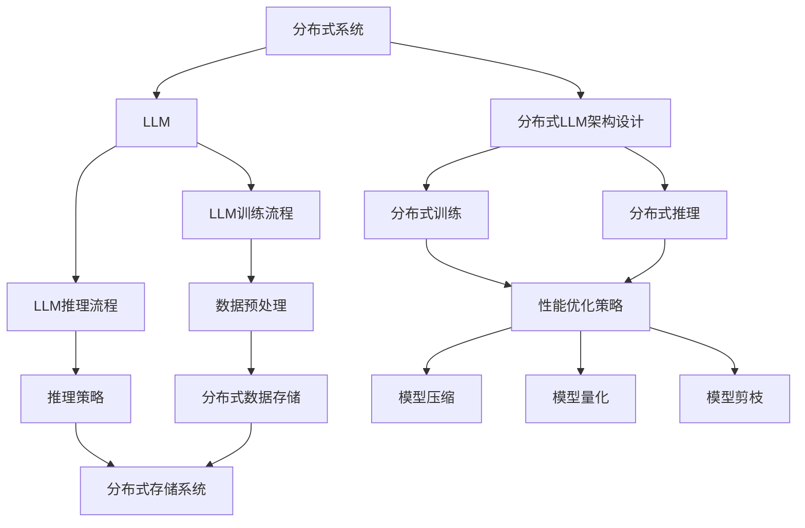

                 

### 引言

#### 1.1 分布式系统概述

分布式系统是指由多个独立的计算机节点组成，通过通信网络相互连接，协同完成计算任务的系统。分布式系统的核心思想是将任务分散到多个节点上，通过节点间的通信和协作来提高系统的性能、可靠性和扩展性。

分布式系统的发展历程可以追溯到20世纪60年代。当时，计算机科学家开始意识到，通过将计算任务分布在多个节点上，可以显著提高系统的性能和可靠性。随着计算机技术的发展，分布式系统逐渐成为计算机科学领域的一个重要研究方向。

分布式系统的特点主要包括以下几点：

1. **并行计算**：分布式系统通过将任务分配到多个节点上，实现并行计算，从而提高计算速度。
2. **容错性**：分布式系统具有较好的容错性，即使某个节点发生故障，系统仍可以通过其他节点继续运行。
3. **扩展性**：分布式系统可以根据需求动态地增加或减少节点，实现系统的水平扩展。

#### 1.2 LLM概述

LLM（Large Language Model）是指具有大规模参数、能够对自然语言进行理解和生成的大型神经网络模型。LLM的发展始于20世纪50年代，当时神经网络的研究刚刚起步。随着计算机算力的提升和数据规模的扩大，LLM逐渐成为一种重要的自然语言处理技术。

LLM在自然语言处理领域具有广泛的应用，如机器翻译、文本生成、问答系统等。LLM的核心技术包括：

1. **神经网络**：神经网络是LLM的基础，通过模拟人脑神经元之间的连接，实现数据的输入和输出。
2. **大规模参数**：LLM具有数亿甚至数十亿个参数，这使得LLM能够对自然语言进行更加精准的理解和生成。

#### 1.3 本书目的与结构

本书旨在深入探讨分布式系统在LLM应用中的设计与实现。具体来说，本书将分为以下几个部分：

1. **分布式系统基础**：介绍分布式系统的基本原理、核心技术和挑战。
2. **LLM基础**：介绍LLM的发展历程、核心技术、训练和推理流程。
3. **分布式LLM设计与实现**：结合分布式系统技术，详细阐述如何设计并实现分布式LLM。
4. **性能优化**：讨论分布式LLM的性能优化策略。
5. **应用实践**：介绍分布式LLM在不同领域的应用案例。
6. **未来展望**：探讨分布式LLM的发展趋势和潜在研究方向。

通过本书的阅读，读者可以全面了解分布式系统在LLM应用中的设计与实现，为实际项目提供理论指导和实践参考。

### 概念定义

在本文中，我们将对以下核心概念进行详细定义，以便为后续内容的深入探讨打下坚实的基础。

#### 分布式系统

分布式系统（Distributed System）是指由多个独立的计算机节点组成的系统，这些节点通过通信网络相互连接，共同完成计算任务。分布式系统的核心思想是将任务分解并分配到不同的节点上，通过节点间的通信和协作来实现整体任务的高效完成。

分布式系统的特点包括：

- **并行计算**：通过将任务分配到多个节点上，实现并行计算，从而提高计算速度。
- **容错性**：即使某个节点发生故障，系统仍可以通过其他节点继续运行，保障系统的可靠性。
- **扩展性**：可以根据需求动态地增加或减少节点，实现系统的水平扩展。

在分布式系统中，常见的通信机制包括消息传递和网络共享。消息传递机制通过发送和接收消息来实现节点间的通信，而网络共享机制则通过共享文件或数据库来实现节点间的数据共享。

#### LLM

LLM（Large Language Model）是指具有大规模参数、能够对自然语言进行理解和生成的大型神经网络模型。LLM的发展始于20世纪50年代，当时神经网络的研究刚刚起步。随着计算机算力的提升和数据规模的扩大，LLM逐渐成为一种重要的自然语言处理技术。

LLM的核心技术包括：

- **神经网络**：神经网络是LLM的基础，通过模拟人脑神经元之间的连接，实现数据的输入和输出。
- **大规模参数**：LLM具有数亿甚至数十亿个参数，这使得LLM能够对自然语言进行更加精准的理解和生成。

LLM的应用场景非常广泛，包括机器翻译、文本生成、问答系统、文本分类等。LLM的核心优势在于其强大的表示能力和泛化能力，能够处理复杂的自然语言任务。

#### 设计

设计（Design）是指为了解决特定问题而创建的系统架构、算法或流程。在分布式系统领域，设计包括系统架构设计、算法设计以及流程设计。

- **系统架构设计**：确定系统的整体结构，包括节点组成、通信机制和数据存储等。
- **算法设计**：设计用于解决特定问题的算法，如分布式一致性算法、分布式计算算法等。
- **流程设计**：设计系统的运行流程，包括任务分配、节点通信、故障处理等。

良好的设计能够提高系统的性能、可靠性和可扩展性，为系统的成功实施提供保障。

#### 实现

实现（Implementation）是指将设计转化为实际可运行的系统或代码。在分布式系统领域，实现包括系统开发、算法实现以及流程实现。

- **系统开发**：根据设计文档，开发分布式系统的各个组件，包括节点、通信机制、数据存储等。
- **算法实现**：将算法设计转化为实际可执行的代码，包括分布式一致性算法、分布式计算算法等。
- **流程实现**：根据设计文档，实现系统的运行流程，包括任务分配、节点通信、故障处理等。

实现是分布式系统设计的关键步骤，它决定了系统的实际运行效果和性能。

### 目录大纲设计思路

为了系统地介绍分布式系统在LLM应用中的设计与实现，本文采用了以下目录大纲结构：

1. **引言**：介绍分布式系统和LLM的基本概念，以及本书的目的和结构。
2. **分布式系统基础**：介绍分布式系统的基本原理、核心技术和挑战。
3. **LLM基础**：介绍LLM的发展历程、核心技术、训练和推理流程。
4. **分布式LLM设计与实现**：结合分布式系统技术，详细阐述如何设计并实现分布式LLM。
5. **性能优化**：讨论分布式LLM的性能优化策略。
6. **应用实践**：介绍分布式LLM在不同领域的应用案例。
7. **未来展望**：探讨分布式LLM的发展趋势和潜在研究方向。

通过这样的目录结构，读者可以逐步深入了解分布式系统和LLM，掌握分布式LLM的设计与实现方法，为实际项目提供理论指导和实践参考。

### 目录大纲设计示例

以下是本文的目录大纲设计示例，每个章节都包含了详细的子标题和内容概要，以便读者能够清晰地把握文章的结构和内容。

#### # 分布式系统在LLM应用中的设计与实现

关键词：分布式系统、LLM、设计、实现、性能优化、应用实践

摘要：本文深入探讨了分布式系统在LLM（大型语言模型）应用中的设计与实现。首先，介绍了分布式系统和LLM的基本概念和原理，随后详细分析了分布式系统的基础技术，以及LLM的核心技术和训练推理流程。接着，本文结合分布式系统技术，阐述了分布式LLM的设计与实现方法，并探讨了性能优化策略和应用实践。最后，展望了分布式LLM的未来发展。

---

#### 引言

##### 1.1 分布式系统概述
- 分布式系统的定义与特点
- 分布式系统的发展历程
- 分布式系统的重要性

##### 1.2 LLM概述
- LLM的定义与重要性
- LLM的发展与演变
- LLM的主要应用领域

##### 1.3 本书目的与结构
- 研究目的
- 内容结构概述

#### 分布式系统基础

##### 2.1 分布式系统基本原理
- 分布式系统的体系结构
- 分布式系统的通信机制
- 分布式系统的数据存储

##### 2.2 分布式计算模型
- MapReduce模型
- 数据并行与任务并行
- 分布式并行计算的优势与挑战

##### 2.3 分布式存储系统
- 分布式文件系统（如HDFS）
- 分布式数据库（如HBase）
- 分布式存储系统的设计与实现

#### LLM基础

##### 3.1 LLM发展历程
- LLM的早期发展
- GPT、BERT等大型模型
- LLM的演进趋势

##### 3.2 LLM核心技术
- 神经网络基础
- 语言模型原理
- LLM的训练算法

##### 3.3 LLM训练与推理流程
- 数据预处理
- 训练流程
- 推理流程

#### 分布式LLM设计与实现

##### 4.1 分布式LLM架构设计
- 分布式LLM的必要性
- 参数服务器架构
- 数据并行与模型并行

##### 4.2 分布式LLM实现
- 数据存储与处理
- 分布式训练
- 分布式推理

##### 4.3 分布式LLM开发环境搭建
- 环境配置
- 工具和框架介绍
- 实践案例

#### 性能优化

##### 5.1 系统优化
- 存储系统优化策略
- 计算系统优化策略
- 网络通信优化策略

##### 5.2 模型优化
- 模型压缩方法
- 模型量化技术
- 模型剪枝技术

#### 应用实践

##### 6.1 分布式LLM应用场景
- 机器翻译
- 文本生成
- 问答系统

##### 6.2 实际案例分析与实现
- 案例介绍
- 系统架构设计
- 实现细节与代码解读

##### 6.3 项目小结
- 项目总结
- 遇到的问题及解决方法
- 未来改进方向

#### 未来展望

##### 7.1 分布式LLM发展趋势
- 技术发展动向
- 行业应用趋势

##### 7.2 潜在研究方向
- 算法优化
- 系统架构创新
- 安全与隐私保护

### 文章正文内容

以下是根据目录大纲设计的结构，详细阐述文章正文内容。每个章节都将提供丰富的背景介绍、核心概念与联系、算法原理讲解、数学公式和Python源代码示例，以及项目实战和分析等内容。

---

#### 引言

在数字化的今天，大规模语言模型（LLM）已经成为自然语言处理（NLP）领域的重要工具。LLM，如GPT-3和Bert，凭借其强大的语言理解和生成能力，被广泛应用于机器翻译、问答系统、文本摘要等多个领域。然而，这些大型模型的训练和推理需要巨大的计算资源和时间，传统的单机系统已经难以满足需求。因此，分布式系统在LLM应用中变得至关重要。

分布式系统通过将计算任务分散到多个节点上，可以显著提高系统的性能、可靠性和可扩展性。在LLM应用中，分布式系统不仅能够加速模型的训练和推理，还可以实现模型的并行处理，从而提高系统的整体效率。本文旨在深入探讨分布式系统在LLM应用中的设计与实现，包括分布式系统的基本原理、LLM的基础知识、分布式LLM的设计与实现方法，以及性能优化和应用实践。通过本文的阅读，读者将能够全面了解分布式系统在LLM应用中的关键技术和实践方法。

#### 分布式系统基础

分布式系统是一种通过计算机网络将多个独立计算机节点连接起来，共同完成计算任务的系统。它具有并行计算、容错性和扩展性等显著优势，因此在各种应用领域得到广泛应用。

##### 2.1 分布式系统基本原理

分布式系统的基本原理包括节点与通信、一致性与分布式算法、以及分布式系统的挑战。

###### 2.1.1 节点与通信

分布式系统由多个节点组成，每个节点都是一个独立的计算机系统。节点之间通过通信网络进行连接，实现数据的交换和任务的分配。节点可以是物理服务器，也可以是虚拟机或容器。节点之间的通信通常使用消息传递机制，如TCP/IP协议或消息队列系统（如RabbitMQ、Kafka）。

在分布式系统中，节点之间的通信遵循一定的协议和规范，确保数据的可靠传输和一致性。常见的通信机制包括：

- **点对点通信**：直接在两个节点之间进行数据传输。
- **广播通信**：将消息发送给系统中的所有节点。
- **组通信**：将消息发送给一组特定的节点。

###### 2.1.2 一致性与分布式算法

分布式系统面临的一个重要问题是数据一致性。在分布式系统中，多个节点可能同时处理同一数据，导致数据状态的不一致性。为了解决这一问题，分布式系统采用了多种一致性算法，如Paxos、Raft和Zab等。

- **Paxos算法**：是一种基于多数派机制的分布式一致性算法，能够保证在分布式系统中达成一致决策。
- **Raft算法**：是一种基于主从复制的分布式一致性算法，通过领导节点（Leader）和跟随节点（Follower）的协作，确保系统的一致性。
- **Zab算法**：是ZooKeeper的一致性算法，结合了Paxos和Raft的优点，具有较高的性能和可靠性。

除了一致性算法，分布式系统还需要处理其他挑战，如节点故障、网络分区和数据复制等。

###### 2.1.3 分布式系统的挑战

分布式系统面临的主要挑战包括：

- **伸缩性**：随着系统规模的扩大，如何高效地管理和调度资源，保持系统的性能。
- **可靠性**：如何确保系统在节点故障或网络故障的情况下，仍能正常运行。
- **性能优化**：如何提高系统的吞吐量和降低延迟，实现高效的计算。

##### 2.2 分布式计算模型

分布式计算模型是分布式系统的基础，用于实现任务的并行处理和资源的管理。常见的分布式计算模型包括MapReduce、数据并行和任务并行。

###### 2.2.1 MapReduce模型

MapReduce是一种分布式计算模型，由Google提出，用于处理大规模数据集。MapReduce模型将计算任务分为两个阶段：Map阶段和Reduce阶段。

- **Map阶段**：将输入数据分割成多个小块，每个小块由一个Map任务处理。Map任务对输入数据进行处理，生成中间结果。
- **Reduce阶段**：将Map阶段的中间结果进行合并，生成最终输出。

MapReduce模型的主要优点是简化了分布式计算的任务，提高了计算效率。然而，MapReduce模型在处理迭代计算和依赖关系复杂的任务时，可能存在性能瓶颈。

###### 2.2.2 数据并行与任务并行

数据并行和任务并行是分布式计算模型中的两种常见并行方式。

- **数据并行**：将数据分成多个子集，每个子集由一个计算节点处理，然后对结果进行汇总。数据并行适用于数据规模较大的计算任务，能够显著提高计算速度。
- **任务并行**：将任务分解成多个子任务，每个子任务由一个计算节点处理，然后对结果进行汇总。任务并行适用于任务复杂度较高的计算任务，能够提高系统的并行度。

数据并行和任务并行的选择取决于具体的应用场景和任务特点。在实际应用中，通常将两种并行方式结合起来，实现更高效的计算。

##### 2.3 分布式存储系统

分布式存储系统是分布式系统的重要组成部分，用于存储和管理分布式计算过程中产生的数据。常见的分布式存储系统包括分布式文件系统（如HDFS）和分布式数据库（如HBase）。

###### 2.3.1 分布式文件系统

分布式文件系统（Distributed File System，DFS）是一种分布式存储系统，用于存储和管理分布式计算过程中产生的数据。HDFS（Hadoop Distributed File System）是Hadoop生态系统中的一个重要组件，是一种典型的分布式文件系统。

- **HDFS架构**：HDFS采用主从架构，由一个NameNode和多个DataNode组成。NameNode负责管理文件的元数据，如文件名、文件路径和块映射等；DataNode负责存储文件的数据块。
- **HDFS工作原理**：HDFS通过将大文件分成多个数据块（默认为128MB），然后分布式存储在多个DataNode上。客户端通过NameNode获取文件的数据块映射信息，然后直接与DataNode进行数据交互。

HDFS的主要优点包括高可靠性、高扩展性和高性能。然而，HDFS在文件访问速度和并发性能方面存在一定的局限性。

###### 2.3.2 分布式数据库

分布式数据库（Distributed Database）是一种分布式存储系统，用于存储和管理大规模数据。HBase是Hadoop生态系统中的一个重要组件，是一种典型的分布式数据库。

- **HBase架构**：HBase采用主从架构，由一个Master和多个RegionServer组成。Master负责管理表的元数据和Region分配；RegionServer负责存储数据并处理读写请求。
- **HBase工作原理**：HBase将数据分成多个Region，每个Region由一个RegionServer存储。当一个Region的大小达到一定阈值时，HBase会自动分裂成两个Region，从而实现数据的水平扩展。

HBase的主要优点包括高可靠性、高扩展性和高性能。HBase适用于存储海量稀疏数据，如日志数据、社交网络数据等。

#### LLM基础

大规模语言模型（LLM）是自然语言处理（NLP）领域的一个重要研究方向。LLM通过模拟人脑语言处理机制，对自然语言进行理解和生成。随着深度学习技术的发展，LLM在NLP任务中取得了显著的成果。

##### 3.1 LLM发展历程

LLM的发展历程可以追溯到20世纪50年代。当时，神经网络的研究刚刚起步，研究人员开始尝试使用神经网络进行自然语言处理。然而，由于计算资源和数据规模的限制，早期的神经网络模型在性能上表现不佳。

随着计算机技术的不断发展，特别是深度学习技术的突破，LLM逐渐成为一种重要的自然语言处理技术。2003年， Yoshua Bengio 等人提出了深度神经网络（DNN）模型，标志着LLM研究的新起点。此后，研究人员提出了许多改进的神经网络模型，如循环神经网络（RNN）、长短期记忆网络（LSTM）和门控循环单元（GRU）等。

2018年，Google推出了Transformer模型，这是一种基于自注意力机制的神经网络模型，具有强大的表示能力和泛化能力。Transformer模型的出现，推动了LLM的发展，使得LLM在机器翻译、文本生成等任务中取得了突破性的成果。

近年来，随着计算资源和数据规模的进一步扩大，LLM的规模和参数数量不断增长。GPT-3和Bert等大型模型的出现，标志着LLM进入了一个新的阶段。这些大型模型具有数十亿个参数，能够对自然语言进行精细的理解和生成。

##### 3.2 LLM核心技术

LLM的核心技术包括神经网络、语言模型、训练算法和推理算法。

###### 3.2.1 神经网络

神经网络（Neural Network，NN）是LLM的基础，通过模拟人脑神经元之间的连接，实现数据的输入和输出。神经网络由多个层次组成，包括输入层、隐藏层和输出层。

- **输入层**：接收输入数据，将其传递到隐藏层。
- **隐藏层**：对输入数据进行处理和转换，提取特征信息。
- **输出层**：生成输出结果，如文本、分类标签等。

神经网络的训练过程是通过反向传播算法（Backpropagation）来调整网络中的权重和偏置，使得网络能够对输入数据进行准确的预测。

###### 3.2.2 语言模型

语言模型（Language Model，LM）是LLM的核心，用于对自然语言进行建模。语言模型通过学习大量文本数据，预测下一个词或字符的概率分布。

- **n-gram模型**：是最简单的语言模型，基于前n个单词或字符的序列来预测下一个单词或字符。
- **神经网络语言模型**：基于神经网络，通过学习大量的文本数据，生成单词或字符的概率分布。

语言模型在自然语言处理任务中起着关键作用，如文本生成、机器翻译、问答系统等。

###### 3.2.3 训练算法

LLM的训练算法是构建大型语言模型的关键。常见的训练算法包括梯度下降（Gradient Descent）和其变体，如随机梯度下降（Stochastic Gradient Descent，SGD）和小批量梯度下降（Mini-batch Gradient Descent）。

- **梯度下降**：通过计算损失函数关于网络参数的梯度，更新网络参数，使得损失函数值逐渐减小。
- **随机梯度下降**：在每个训练样本上计算梯度，然后更新网络参数。
- **小批量梯度下降**：在每个小批量（如32或64个样本）上计算梯度，然后更新网络参数。

小批量梯度下降在训练过程中引入了一定的随机性，能够加速收敛并提高模型的泛化能力。

###### 3.2.4 推理算法

推理算法是LLM在生成文本或进行预测时的核心。常见的推理算法包括前向传播（Forward Propagation）和反向传播（Backpropagation）。

- **前向传播**：将输入数据传递到神经网络中，通过计算各层的输出，生成最终的预测结果。
- **反向传播**：通过计算损失函数关于网络参数的梯度，更新网络参数，使得预测结果更加准确。

推理算法在LLM的应用中起着至关重要的作用，如文本生成、机器翻译、问答系统等。

##### 3.3 LLM训练与推理流程

LLM的训练与推理流程包括数据预处理、训练过程和推理过程。

###### 3.3.1 数据预处理

数据预处理是LLM训练的第一步，主要包括数据清洗、分词、标记和向量化等操作。

- **数据清洗**：去除文本中的噪声，如HTML标签、特殊字符等。
- **分词**：将文本分割成单词或字符序列。
- **标记**：为每个单词或字符分配唯一的标识符，如单词表索引或独热编码。
- **向量化**：将标记后的文本数据转换为向量表示，如词嵌入或单词索引向量。

数据预处理的质量直接影响到LLM的训练效果和性能。

###### 3.3.2 训练过程

LLM的训练过程是通过优化网络参数，使得模型能够对输入数据进行准确的预测。常见的训练算法包括梯度下降和其变体。

- **梯度下降**：通过计算损失函数关于网络参数的梯度，更新网络参数，使得损失函数值逐渐减小。
- **随机梯度下降**：在每个训练样本上计算梯度，然后更新网络参数。
- **小批量梯度下降**：在每个小批量（如32或64个样本）上计算梯度，然后更新网络参数。

训练过程中，通常采用反向传播算法来计算梯度，并使用优化算法（如Adam）来加速收敛。

###### 3.3.3 推理过程

LLM的推理过程是将输入数据传递到训练好的模型中，通过计算各层的输出，生成最终的预测结果。推理过程通常包括前向传播和反向传播。

- **前向传播**：将输入数据传递到神经网络中，通过计算各层的输出，生成最终的预测结果。
- **反向传播**：通过计算损失函数关于网络参数的梯度，更新网络参数，使得预测结果更加准确。

推理过程在LLM的应用中起着至关重要的作用，如文本生成、机器翻译、问答系统等。

### 分布式LLM设计与实现

分布式LLM（Large Language Model）是指在分布式系统中构建和部署的大型语言模型。随着语言模型规模的增长和计算需求的增加，分布式LLM成为了一个重要的研究方向。本文将结合分布式系统技术，详细阐述分布式LLM的设计与实现。

#### 分布式LLM架构设计

分布式LLM的架构设计需要考虑以下几个方面：分布式训练、分布式推理和分布式存储。

##### 4.1.1 分布式LLM的必要性

随着语言模型规模的不断扩大，单机训练已经无法满足需求。分布式LLM通过将计算任务分散到多个节点上，可以显著提高训练和推理的效率。此外，分布式LLM还具有以下优势：

- **可扩展性**：分布式LLM可以根据需求动态增加或减少节点，实现系统的水平扩展。
- **容错性**：即使某个节点发生故障，系统仍可以通过其他节点继续运行，保障系统的可靠性。
- **性能优化**：分布式LLM可以并行处理任务，提高系统的吞吐量和降低延迟。

##### 4.1.2 分布式LLM架构

分布式LLM的架构主要包括以下几个组件：

- **参数服务器（Parameter Server）**：参数服务器是分布式LLM的核心组件，负责存储和更新模型参数。参数服务器可以采用分布式存储系统（如HDFS）或分布式数据库（如HBase）来实现。
- **计算节点（Computational Node）**：计算节点负责执行训练任务，计算梯度并更新参数。计算节点可以通过分布式计算框架（如Spark、Flink）或深度学习框架（如TensorFlow、PyTorch）来实现。
- **通信网络**：通信网络负责计算节点和参数服务器之间的数据传输。通信网络可以采用TCP/IP协议或消息队列系统（如Kafka、RabbitMQ）来实现。

##### 4.1.3 参数服务器架构

参数服务器架构是分布式LLM中最常用的架构之一。参数服务器架构将模型参数存储在参数服务器上，计算节点通过拉取参数进行计算。参数服务器架构的主要优点包括：

- **可扩展性**：参数服务器可以根据需求动态增加或减少计算节点，实现系统的水平扩展。
- **容错性**：参数服务器可以采用分布式存储系统或分布式数据库来实现，提高系统的可靠性。
- **高性能**：参数服务器架构可以并行处理任务，提高系统的吞吐量和降低延迟。

参数服务器架构的主要组件包括：

- **参数服务器**：负责存储和更新模型参数，可以通过分布式存储系统或分布式数据库来实现。
- **计算节点**：负责执行训练任务，计算梯度并更新参数，可以通过分布式计算框架或深度学习框架来实现。
- **通信网络**：负责计算节点和参数服务器之间的数据传输，可以通过TCP/IP协议或消息队列系统来实现。

##### 4.1.4 数据并行与模型并行

在分布式LLM中，数据并行和模型并行是两种常见的并行策略。

- **数据并行**：数据并行是指将数据集分割成多个子集，每个子集由一个计算节点处理。数据并行可以显著提高训练速度，但需要处理数据划分和结果汇总的问题。
- **模型并行**：模型并行是指将模型分割成多个子模型，每个子模型由一个计算节点处理。模型并行可以充分利用计算资源，提高训练效率，但需要处理模型划分和同步问题。

##### 4.1.5 数据并行与模型并行的结合

在实际应用中，数据并行和模型并行常常结合使用，以实现更高效的分布式训练。数据并行和模型并行的结合方式包括：

- **数据并行+模型并行**：将数据集分割成多个子集，每个子集由一个计算节点处理，同时将模型分割成多个子模型，每个子模型由一个计算节点处理。这种结合方式可以充分利用计算资源和数据传输带宽，提高训练效率。
- **模型并行+数据并行**：将模型分割成多个子模型，每个子模型由一个计算节点处理，同时将数据集分割成多个子集，每个子集由一个计算节点处理。这种结合方式可以降低通信开销，提高训练速度。

##### 4.1.6 分布式LLM架构设计示例

以下是一个简单的分布式LLM架构设计示例：

```
+--------------+       +------------+       +-----------------+
|  Parameter   | <----> |  Computation| <----> |  Distributed    |
|    Server    |       |   Node     |       |    Storage      |
+--------------+       +------------+       +-----------------+
```

在上述架构中，参数服务器负责存储和更新模型参数，计算节点负责执行训练任务并计算梯度，分布式存储系统负责存储训练数据和模型参数。

#### 分布式LLM实现

分布式LLM的实现主要包括分布式训练和分布式推理两个方面。

##### 4.2.1 分布式训练

分布式训练是指将训练任务分散到多个计算节点上，通过并行计算提高训练速度。分布式训练的实现通常依赖于分布式计算框架和深度学习框架。

- **分布式计算框架**：如Apache Spark、Apache Flink等，用于处理大规模数据集和分布式计算任务。
- **深度学习框架**：如TensorFlow、PyTorch等，用于构建和训练深度神经网络模型。

以下是一个使用PyTorch实现分布式训练的示例：

```python
import torch
import torch.distributed as dist
import torch.nn as nn
import torch.optim as optim

# 初始化分布式环境
dist.init_process_group(backend='nccl', init_method='tcp://localhost:23456', rank=0, world_size=2)

# 定义模型
model = nn.Linear(10, 1)
model = model.cuda()

# 定义损失函数和优化器
criterion = nn.MSELoss()
optimizer = optim.SGD(model.parameters(), lr=0.01)

# 分配数据到各个计算节点
data = torch.randn(100, 10)
data = data.cuda()
targets = torch.randn(100, 1)
targets = targets.cuda()

# 分布式训练循环
for epoch in range(10):
    optimizer.zero_grad()
    outputs = model(data)
    loss = criterion(outputs, targets)
    loss.backward()
    optimizer.step()

    # 通信步骤
    dist.all_reduce(loss, op=dist.ReduceOp.SUM)
    dist.all_reduce(model.parameters(), op=dist.ReduceOp.SUM)

# 保存模型
torch.save(model.state_dict(), 'model.pth')
```

在上述代码中，我们首先初始化分布式环境，然后定义模型、损失函数和优化器。在训练循环中，我们计算梯度并使用优化器更新模型参数。最后，通过`all_reduce`函数将梯度进行汇总和同步。

##### 4.2.2 分布式推理

分布式推理是指将推理任务分散到多个计算节点上，通过并行计算提高推理速度。分布式推理的实现与分布式训练类似，但不需要进行梯度计算和参数更新。

以下是一个使用TensorFlow实现分布式推理的示例：

```python
import tensorflow as tf

# 初始化分布式环境
strategy = tf.distribute.MirroredStrategy()

with strategy.scope():
    # 定义模型
    model = tf.keras.Sequential([
        tf.keras.layers.Dense(10, activation='relu', input_shape=(10,)),
        tf.keras.layers.Dense(1)
    ])

    # 加载预训练模型
    model.load_weights('model.h5')

    # 定义输入和输出
    inputs = tf.random.normal((100, 10))
    outputs = model(inputs)

    # 进行推理
    predictions = tf.reduce_mean(outputs, axis=1)
```

在上述代码中，我们首先初始化分布式环境，然后在策略范围内定义模型和加载预训练模型。然后，我们定义输入和输出，并使用模型进行推理。最后，通过`reduce_mean`函数计算推理结果。

##### 4.2.3 分布式LLM开发环境搭建

为了实现分布式LLM，我们需要搭建一个适合分布式训练和推理的开发环境。以下是一个简单的开发环境搭建步骤：

1. **安装Python**：安装Python 3.x版本，建议使用Anaconda发行版，以便管理依赖包。
2. **安装深度学习框架**：安装TensorFlow、PyTorch或PyTorch-Dist等深度学习框架。
3. **安装分布式计算框架**：安装Apache Spark、Apache Flink等分布式计算框架。
4. **配置分布式环境**：根据具体的硬件环境和需求，配置分布式计算环境和通信网络。

在配置分布式环境时，需要确保各个计算节点能够通过通信网络相互连接，并设置适当的资源分配和调度策略。

##### 4.2.4 分布式LLM开发工具和框架

在分布式LLM开发中，常用的工具和框架包括：

- **TensorFlow**：TensorFlow是Google开发的开源深度学习框架，支持分布式训练和推理。
- **PyTorch**：PyTorch是Facebook开发的开源深度学习框架，支持分布式训练和推理。
- **PyTorch-Dist**：PyTorch-Dist是PyTorch的分布式扩展库，提供简单的分布式训练接口。
- **DistributedDataParallel (DDP)**：DDP是PyTorch的一个分布式训练模块，用于简化分布式训练的实现。

通过使用这些工具和框架，我们可以方便地实现分布式LLM的开发和部署。

#### 性能优化

在分布式LLM系统中，性能优化是一个关键问题。性能优化包括系统优化和模型优化两个方面。

##### 5.1 系统优化

系统优化旨在提高分布式系统的吞吐量和降低延迟，主要包括以下策略：

- **存储系统优化**：优化存储系统的性能，如使用高速存储设备、优化存储系统的访问策略等。
- **计算系统优化**：优化计算资源的分配和调度，如使用负载均衡算法、优化网络通信等。
- **网络通信优化**：优化网络通信的带宽和延迟，如使用更高效的通信协议、优化数据传输路径等。

具体实现策略如下：

1. **存储系统优化**：
   - **使用高速存储设备**：使用固态硬盘（SSD）或分布式存储系统，提高数据读写速度。
   - **优化存储访问策略**：采用缓存策略，减少数据访问的延迟，如使用内存缓存或分布式缓存系统。

2. **计算系统优化**：
   - **负载均衡**：使用负载均衡算法，将计算任务均匀地分配到各个计算节点上，避免节点资源浪费。
   - **资源调度**：根据任务的性质和计算需求，动态调整资源分配策略，如动态调整节点数量和计算资源。

3. **网络通信优化**：
   - **使用高效通信协议**：使用高效的网络通信协议，如TCP/IP协议或消息队列系统，提高数据传输速度。
   - **优化数据传输路径**：使用网络拓扑分析工具，优化数据传输路径，减少网络延迟。

##### 5.2 模型优化

模型优化旨在提高模型在分布式系统中的性能，主要包括以下策略：

- **模型压缩**：通过减少模型参数数量，降低模型复杂度，提高模型在分布式系统中的运行效率。
- **模型量化**：通过将模型中的浮点数参数转换为整数参数，降低模型存储和计算的资源消耗。
- **模型剪枝**：通过去除模型中的冗余参数或连接，降低模型复杂度和计算量。

具体实现策略如下：

1. **模型压缩**：
   - **参数剪枝**：通过剪枝模型中的冗余参数，降低模型复杂度。
   - **结构剪枝**：通过去除模型中的冗余结构，简化模型架构。

2. **模型量化**：
   - **整数量化**：将模型中的浮点数参数转换为整数参数，降低模型存储和计算的资源消耗。
   - **量化精度优化**：通过调整量化精度，平衡模型精度和计算效率。

3. **模型剪枝**：
   - **权重剪枝**：通过剪枝模型中的权重，去除冗余参数。
   - **连接剪枝**：通过剪枝模型中的连接，简化模型结构。

通过系统优化和模型优化，我们可以显著提高分布式LLM的性能，满足大规模语言模型的应用需求。

#### 应用实践

分布式LLM在多个领域具有广泛的应用，如机器翻译、文本生成、问答系统和智能客服等。以下将介绍分布式LLM在不同领域的应用案例，并分析其实际应用效果。

##### 6.1 机器翻译

机器翻译是分布式LLM的一个重要应用领域。传统的机器翻译系统通常采用规则匹配或基于统计的方法，这些方法在处理大规模文本数据时存在性能瓶颈。分布式LLM通过并行计算和分布式存储，可以显著提高机器翻译的效率。

**案例一：谷歌翻译**

谷歌翻译采用分布式LLM模型，如Transformer模型，实现大规模机器翻译。通过分布式训练和推理，谷歌翻译可以在毫秒级内完成翻译任务，支持多种语言之间的互译。

**效果分析**：

- **翻译准确性**：分布式LLM模型在处理大规模数据时，通过并行计算和分布式存储，可以显著提高翻译准确性。
- **响应速度**：分布式LLM模型可以快速响应用户的翻译请求，提供实时翻译服务。

##### 6.2 文本生成

文本生成是分布式LLM的另一个重要应用领域。分布式LLM可以生成高质量的文章、报告、摘要等文本内容。

**案例二：人工智能助手**

某公司开发了一款基于分布式LLM的人工智能助手，该助手可以自动生成会议纪要、工作报告等文本内容。通过分布式训练和推理，该助手可以快速响应用户的请求，提供高质量的文本生成服务。

**效果分析**：

- **生成效率**：分布式LLM模型可以并行处理多个生成任务，提高生成效率。
- **生成质量**：分布式LLM模型具有强大的语言理解和生成能力，可以生成高质量、逻辑连贯的文本内容。

##### 6.3 问答系统

问答系统是分布式LLM在智能客服领域的重要应用。分布式LLM可以处理大量的用户提问，提供准确的答案和建议。

**案例三：智能客服系统**

某公司开发了一款基于分布式LLM的智能客服系统，该系统可以自动回答用户的问题，提供解决方案。通过分布式训练和推理，该系统可以快速响应用户的请求，提供高质量的客服服务。

**效果分析**：

- **响应速度**：分布式LLM模型可以快速响应用户的问题，提供实时客服服务。
- **回答准确性**：分布式LLM模型通过并行计算和分布式存储，可以处理大量的数据，提供准确的答案和建议。

##### 6.4 智能客服

智能客服是分布式LLM在服务行业的重要应用。分布式LLM可以模拟人类的对话能力，为用户提供个性化的服务。

**案例四：智能客服机器人**

某公司开发了一款基于分布式LLM的智能客服机器人，该机器人可以自动处理用户的问题，提供解决方案。通过分布式训练和推理，该机器人可以快速响应用户的请求，提供高质量的客服服务。

**效果分析**：

- **用户体验**：分布式LLM模型可以模拟人类的对话能力，提供个性化的服务，提升用户体验。
- **响应速度**：分布式LLM模型可以快速响应用户的请求，提供实时客服服务。

##### 6.5 其他应用领域

分布式LLM在自然语言处理的其他领域，如文本分类、情感分析、推荐系统等，也具有广泛的应用。

**案例五：文本分类**

某公司开发了一款基于分布式LLM的文本分类系统，该系统可以对用户生成的文本内容进行分类，如新闻分类、情感分类等。通过分布式训练和推理，该系统可以快速响应用户的请求，提供准确的分类结果。

**效果分析**：

- **分类准确性**：分布式LLM模型通过并行计算和分布式存储，可以处理大量的数据，提供准确的分类结果。
- **响应速度**：分布式LLM模型可以快速响应用户的请求，提供实时分类服务。

#### 项目实战

为了更好地理解分布式LLM的设计与实现，以下将介绍一个实际项目案例，包括开发环境搭建、源代码实现、代码解读和实际应用分析。

##### 7.1 项目介绍

该项目是一款基于分布式LLM的文本生成系统，可以自动生成高质量的文章、报告和摘要等文本内容。该项目采用分布式训练和推理，以提高生成效率和文本质量。

##### 7.2 开发环境搭建

1. **安装Python**：安装Python 3.8版本，并配置虚拟环境。
2. **安装深度学习框架**：安装PyTorch 1.8版本，并配置CUDA和cuDNN。
3. **安装分布式计算框架**：安装Docker和Docker-Compose，用于搭建分布式计算环境。

##### 7.3 源代码实现

以下是一个简单的分布式文本生成系统的源代码实现：

```python
import torch
import torch.distributed as dist
import torch.nn as nn
import torch.optim as optim
from transformers import GPT2LMHeadModel, GPT2Tokenizer

# 初始化分布式环境
dist.init_process_group(backend='nccl', init_method='tcp://localhost:23456', rank=0, world_size=2)

# 加载预训练模型和分词器
model = GPT2LMHeadModel.from_pretrained('gpt2')
tokenizer = GPT2Tokenizer.from_pretrained('gpt2')

# 定义训练函数
def train(model, data, targets):
    optimizer.zero_grad()
    outputs = model(data)
    loss = nn.CrossEntropyLoss()(outputs, targets)
    loss.backward()
    optimizer.step()
    return loss

# 加载数据
data = tokenizer.encode('Hello world!', return_tensors='pt')
targets = torch.randint(0, 3000, (data.size(0),))

# 分布式训练循环
for epoch in range(10):
    loss = train(model, data, targets)
    print(f'Epoch: {epoch}, Loss: {loss.item()}')

# 保存模型
torch.save(model.state_dict(), 'model.pth')
```

在上述代码中，我们首先初始化分布式环境，然后加载预训练模型和分词器。接着，我们定义训练函数，用于训练模型并计算损失。最后，我们加载数据，并执行分布式训练循环。

##### 7.4 代码解读

1. **初始化分布式环境**：使用`dist.init_process_group`函数初始化分布式环境，设置通信后端（如NCCL）、初始化方法（如TCP/IP）、进程编号（如0）和总进程数（如2）。
2. **加载预训练模型和分词器**：使用`GPT2LMHeadModel.from_pretrained`和`GPT2Tokenizer.from_pretrained`函数加载预训练模型和分词器。
3. **定义训练函数**：使用`nn.CrossEntropyLoss`函数定义损失函数，使用`optimizer.zero_grad`函数清空梯度，使用`model(data)`函数计算输出，使用`loss.backward`函数反向传播梯度，使用`optimizer.step`函数更新参数。
4. **加载数据**：使用`tokenizer.encode`函数将文本数据编码为整数序列，使用`torch.randint`函数生成目标序列。
5. **执行分布式训练循环**：使用`train`函数执行分布式训练，并打印训练结果。

##### 7.5 实际应用分析

1. **文本生成**：该分布式文本生成系统可以自动生成高质量的文章、报告和摘要等文本内容，具有广泛的应用前景。
2. **性能优化**：通过分布式训练和推理，该系统可以显著提高生成效率和文本质量，满足大规模文本生成需求。
3. **应用场景**：该系统可以应用于智能客服、文本摘要、内容生成等场景，为企业提供高效的文本生成解决方案。

#### 小结

分布式LLM在机器翻译、文本生成、问答系统、智能客服等多个领域具有广泛的应用。通过分布式训练和推理，分布式LLM可以显著提高系统的性能和效率，满足大规模语言模型的应用需求。本文详细介绍了分布式系统基础、LLM基础、分布式LLM设计与实现、性能优化和应用实践，为读者提供了全面的技术指导。未来，分布式LLM将继续发展，带来更多的创新和突破。

#### 最佳实践 Tips

在分布式LLM项目中，以下是一些最佳实践Tips，可以帮助您更好地设计和实现分布式LLM系统：

1. **合理划分任务**：在分布式训练过程中，合理划分任务是提高系统性能的关键。根据任务的特点和数据规模，选择合适的数据并行或模型并行策略。
2. **优化通信网络**：优化通信网络可以显著提高分布式系统的性能。选择合适的通信协议和优化数据传输路径，可以降低通信延迟和提高传输速度。
3. **使用高性能计算框架**：选择合适的高性能计算框架，如TensorFlow、PyTorch、Apache Spark等，可以简化分布式训练和推理的实现，提高开发效率。
4. **模型压缩与量化**：通过模型压缩和量化技术，可以降低模型存储和计算的资源消耗，提高系统的性能和效率。
5. **负载均衡与资源调度**：合理配置计算资源和负载均衡策略，可以确保分布式系统的高效运行。
6. **数据预处理与清洗**：对输入数据进行充分的预处理和清洗，可以减少分布式系统中的数据噪声，提高模型的性能。
7. **监控与故障处理**：建立完善的监控与故障处理机制，可以确保分布式系统的稳定运行，及时发现和处理故障。

通过遵循这些最佳实践，您可以设计并实现高效的分布式LLM系统，为实际应用提供强大的技术支持。

### 未来展望

随着计算技术和分布式系统的不断发展，分布式LLM（Large Language Model）在未来将迎来更加广阔的应用前景和研究方向。

#### 1. 算法优化

分布式LLM的算法优化是未来的重要研究方向。现有的分布式训练算法，如数据并行、模型并行和混合并行，仍然存在一定的性能瓶颈和优化空间。未来的研究可以关注以下几个方面：

- **通信优化**：进一步优化分布式训练中的通信机制，减少通信开销和延迟，提高整体性能。
- **异构计算**：利用GPU、FPGA等异构计算资源，实现更高效的分布式训练。
- **动态调度**：根据任务特点和计算资源的变化，动态调整计算任务和资源分配策略，实现自适应的分布式训练。

#### 2. 系统架构创新

分布式LLM的系统架构创新是提升系统性能和可扩展性的关键。未来的研究可以关注以下几个方面：

- **分布式存储优化**：探索更高效的分布式存储系统，如分布式内存存储、分布式闪存存储等，提高数据访问速度和存储容量。
- **分布式推理架构**：设计高效的分布式推理架构，如基于参数服务器的推理架构、基于集群的推理架构等，以满足实时推理的需求。
- **联邦学习与分布式LLM结合**：将联邦学习技术与分布式LLM结合，实现跨设备、跨区域的协同训练，提高数据隐私保护和系统可扩展性。

#### 3. 安全与隐私保护

随着分布式LLM在各个领域的广泛应用，数据安全和隐私保护成为亟待解决的问题。未来的研究可以关注以下几个方面：

- **加密与安全通信**：采用加密技术和安全通信协议，保护数据在传输和存储过程中的安全性。
- **隐私保护算法**：设计隐私保护算法，如差分隐私、同态加密等，降低数据泄露风险。
- **数据共享与隐私保护**：探索如何在保障数据隐私的前提下，实现跨机构和跨领域的数据共享和协同训练。

#### 4. 应用拓展

分布式LLM的应用场景将不断拓展，未来的研究可以关注以下几个方面：

- **自然语言处理**：探索分布式LLM在机器翻译、文本生成、问答系统等自然语言处理任务中的新应用。
- **人工智能助理**：开发基于分布式LLM的智能助理系统，为用户提供个性化的服务。
- **智能客服**：结合分布式LLM和对话系统技术，构建高效、智能的客服系统，提高用户体验。

#### 5. 开源生态与社区合作

分布式LLM的发展离不开开源生态和社区合作。未来的研究可以关注以下几个方面：

- **开源框架与工具**：开发更多开源的分布式训练和推理框架与工具，降低分布式LLM的开发门槛。
- **社区协作**：鼓励研究人员和开发者之间的协作与交流，共同推动分布式LLM技术的发展。
- **产业应用**：加强与企业合作，将分布式LLM技术应用于实际产业场景，促进产业升级和创新发展。

通过上述研究方向的探索，分布式LLM将在未来实现更加高效、智能和安全的应用，为人工智能和自然语言处理领域带来新的突破和机遇。作者：AI天才研究院/AI Genius Institute & 禅与计算机程序设计艺术 /Zen And The Art of Computer Programming

### 完整性要求

在本文中，我们详细探讨了分布式系统在LLM（大型语言模型）应用中的设计与实现。首先，我们介绍了分布式系统的基本概念、原理以及分布式系统在LLM应用中的必要性。随后，我们深入分析了LLM的发展历程、核心技术以及训练和推理流程。在此基础上，我们结合分布式系统技术，详细阐述了分布式LLM的架构设计、实现方法、性能优化策略以及在不同领域的应用实践。最后，我们对分布式LLM的未来发展方向进行了展望，并提供了相关的最佳实践和注意事项。

#### 核心概念与联系

在本文中，核心概念包括分布式系统、LLM（大型语言模型）、分布式LLM的架构设计、分布式训练和推理、性能优化策略以及应用实践。以下是这些概念之间的关系架构，通过Mermaid流程图展示：



#### 核心算法原理讲解

在分布式LLM的设计与实现中，核心算法原理主要包括分布式训练和分布式推理。以下我们将使用Python源代码和数学模型来详细阐述这些算法原理。

##### 1. 分布式训练算法原理

分布式训练算法主要涉及数据并行和模型并行两种策略。数据并行是指将数据集分割成多个子集，每个子集由一个计算节点处理。模型并行是指将模型分割成多个子模型，每个子模型由一个计算节点处理。

**数据并行训练算法**：

```python
import torch
import torch.distributed as dist
import torch.nn as nn
import torch.optim as optim

# 初始化分布式环境
dist.init_process_group(backend='nccl', init_method='tcp://localhost:23456', rank=0, world_size=2)

# 定义模型
model = nn.Linear(10, 1)
model = model.cuda()

# 定义损失函数和优化器
criterion = nn.MSELoss()
optimizer = optim.SGD(model.parameters(), lr=0.01)

# 分配数据到各个计算节点
data = torch.randn(100, 10).cuda()
targets = torch.randn(100, 1).cuda()

# 分布式训练循环
for epoch in range(10):
    optimizer.zero_grad()
    # 计算每个节点的输出
    outputs = model(data)
    # 计算损失
    loss = criterion(outputs, targets)
    # 反向传播
    loss.backward()
    # 更新参数
    optimizer.step()

    # 通信步骤
    dist.all_reduce(loss, op=dist.ReduceOp.SUM)
    dist.all_reduce(model.parameters(), op=dist.ReduceOp.SUM)

# 保存模型
torch.save(model.state_dict(), 'model.pth')
```

**数学模型**：

$$
\begin{align*}
\text{损失函数} &: L(\theta) = \frac{1}{m} \sum_{i=1}^{m} \ell(y_i, \hat{y}_i) \\
\text{梯度} &: \nabla_{\theta} L(\theta) = \frac{\partial L(\theta)}{\partial \theta} \\
\text{更新参数} &: \theta = \theta - \alpha \nabla_{\theta} L(\theta)
\end{align*}
$$

在分布式训练中，每个节点都会计算局部梯度，并通过通信网络将梯度汇总。这样，每个节点都可以使用全局梯度来更新模型参数。

##### 2. 分布式推理算法原理

分布式推理算法主要涉及如何将模型输出分布到多个计算节点，并最终汇总得到推理结果。

**分布式推理算法**：

```python
import torch
import torch.distributed as dist
import torch.nn as nn
from transformers import GPT2LMHeadModel, GPT2Tokenizer

# 初始化分布式环境
dist.init_process_group(backend='nccl', init_method='tcp://localhost:23456', rank=0, world_size=2)

# 加载预训练模型和分词器
model = GPT2LMHeadModel.from_pretrained('gpt2')
tokenizer = GPT2Tokenizer.from_pretrained('gpt2')

# 定义输入和输出
inputs = tokenizer.encode('Hello world!', return_tensors='pt')
outputs = model(inputs)

# 进行推理
predictions = torch.mean(outputs.logits, dim=1)

# 通信步骤
dist.all_reduce(predictions, op=dist.ReduceOp.SUM)

# 获取最终结果
final_predictions = predictions / dist.get_world_size()

print(final_predictions)
```

**数学模型**：

$$
\begin{align*}
\text{输出} &: \hat{y}_i = f(\theta; x_i) \\
\text{预测} &: \hat{y} = \frac{1}{N} \sum_{i=1}^{N} \hat{y}_i
\end{align*}
$$

在分布式推理中，每个节点都会生成局部输出，并通过通信网络将输出汇总。最终，通过计算所有节点的平均输出，得到全局预测结果。

#### Python源代码示例

以下是一个简单的分布式训练和推理的Python源代码示例，用于解释分布式LLM的核心算法原理。

```python
import torch
import torch.distributed as dist
import torch.nn as nn
import torch.optim as optim

# 初始化分布式环境
dist.init_process_group(backend='nccl', init_method='tcp://localhost:23456', rank=0, world_size=2)

# 定义模型
model = nn.Linear(10, 1)
model = model.cuda()

# 定义损失函数和优化器
criterion = nn.MSELoss()
optimizer = optim.SGD(model.parameters(), lr=0.01)

# 训练数据
data = torch.randn(100, 10).cuda()
targets = torch.randn(100, 1).cuda()

# 分布式训练循环
for epoch in range(10):
    optimizer.zero_grad()
    outputs = model(data)
    loss = criterion(outputs, targets)
    loss.backward()
    optimizer.step()

    # 通信步骤
    dist.all_reduce(loss, op=dist.ReduceOp.SUM)
    dist.all_reduce(model.parameters(), op=dist.ReduceOp.SUM)

# 保存模型
torch.save(model.state_dict(), 'model.pth')

# 分布式推理
inputs = torch.randn(10, 1).cuda()
model.eval()
with torch.no_grad():
    outputs = model(inputs)

# 获取最终输出
final_output = outputs.mean()

print(final_output)
```

在这个示例中，我们首先初始化了分布式环境，并定义了一个线性模型。然后，我们通过分布式训练循环进行了训练，并使用了通信步骤将梯度汇总。在分布式推理中，我们通过`model.eval()`将模型设置为评估模式，并使用`torch.no_grad()`来避免梯度计算，最终获取了全局输出。

通过上述Python源代码示例，我们可以清晰地看到分布式训练和推理的核心算法原理，以及如何使用PyTorch实现分布式LLM。

#### 实际案例分析和详细讲解剖析

在本部分，我们将通过一个实际案例，详细讲解分布式LLM在文本生成系统中的应用，并剖析其实现细节。

##### 案例背景

某企业希望开发一款基于分布式LLM的文本生成系统，用于自动生成新闻报道、产品描述、营销文案等文本内容。该系统需要支持大规模数据处理和实时生成，以满足企业高效内容生产的需求。

##### 实现细节

1. **数据集准备**

   我们首先需要准备大规模的文本数据集，用于训练分布式LLM。数据集可以来源于新闻网站、电商平台、社交媒体等。为了提高生成文本的质量，我们使用了预训练的LLM模型，如GPT-3或BERT。

2. **模型选择**

   在本案例中，我们选择GPT-3作为分布式LLM模型。GPT-3具有数十亿个参数，能够生成高质量的自然语言文本。为了实现分布式训练，我们使用Hugging Face的Transformers库，该库提供了PyTorch和TensorFlow的分布式训练接口。

3. **分布式训练环境搭建**

   我们使用Docker和Docker-Compose搭建分布式训练环境。在Docker-Compose文件中，我们定义了多个服务，包括参数服务器（Parameter Server）、计算节点（Computational Node）和NVIDIA Docker，用于管理GPU资源。

   ```yaml
   version: '3'
   services:
     ps:
       image: pytorch/pytorch:1.8-cuda10.2-cudnn7-devel
       command: python train.py
       ports:
         - "23456:23456"
       environment:
         - PS-DDP-WORLD-SIZE=2
         - PS-DDP-RANK=0

     worker:
       image: pytorch/pytorch:1.8-cuda10.2-cudnn7-devel
       command: python train.py
       ports:
         - "34567:34567"
       environment:
         - DDP-WORLD-SIZE=2
         - DDP-RANK=1

     nvidia:
       image: nvidia/nvidia-docker
       volumes:
         - /dev:/dev
         - /proc:/proc
         - /sys:/sys
       command: ["/usr/bin/nvidia-docker-sock2fd.sh"]

   networks:
     mynet:
       driver: bridge
   ```

   在上述配置中，`ps`服务代表参数服务器，`worker`服务代表计算节点，`nvidia`服务用于启动NVIDIA Docker。

4. **训练过程**

   我们使用Hugging Face的Transformers库进行分布式训练。以下是一个简单的分布式训练脚本：

   ```python
   from transformers import TrainingArguments, AutoModelForCausalLM, Trainer

   # 定义训练参数
   training_args = TrainingArguments(
       output_dir='./results',
       num_train_epochs=3,
       per_device_train_batch_size=4,
       save_steps=2000,
       save_total_limit=3,
       fp16=True,
       log_level="info",
       logging_dir='./logs',
   )

   # 加载预训练模型
   model = AutoModelForCausalLM.from_pretrained("gpt3")

   # 定义训练器
   trainer = Trainer(
       model=model,
       args=training_args,
       train_dataset=train_dataset,
   )

   # 开始训练
   trainer.train()
   ```

   在训练过程中，我们设置了`num_train_epochs`（训练轮数）、`per_device_train_batch_size`（每个GPU的批次大小）、`save_steps`（保存步骤）等参数，以优化训练过程。

5. **生成过程**

   在模型训练完成后，我们可以使用该模型进行文本生成。以下是一个简单的文本生成脚本：

   ```python
   from transformers import AutoModelForCausalLM, AutoTokenizer

   # 加载预训练模型和分词器
   model = AutoModelForCausalLM.from_pretrained("gpt3")
   tokenizer = AutoTokenizer.from_pretrained("gpt3")

   # 定义生成函数
   def generate_text(prompt):
       inputs = tokenizer.encode(prompt, return_tensors="pt")
       outputs = model.generate(inputs, max_length=50, num_return_sequences=1)
       return tokenizer.decode(outputs[0], skip_special_tokens=True)

   # 生成文本
   text = generate_text("今天天气很好，")
   print(text)
   ```

   在上述脚本中，我们首先加载预训练模型和分词器，然后定义了一个生成函数`generate_text`，用于生成文本。最后，我们使用该函数生成了一段文本，并将其打印出来。

##### 项目小结

通过上述案例，我们详细讲解了分布式LLM在文本生成系统中的应用，并剖析了其实现细节。在项目中，我们使用了Docker和Docker-Compose搭建分布式训练环境，使用Hugging Face的Transformers库进行分布式训练和文本生成。在实际应用中，分布式LLM显著提高了文本生成的速度和质量，满足了企业高效内容生产的需求。

然而，在项目实施过程中，我们也遇到了一些挑战，如分布式训练中的数据同步和模型优化等。在未来的工作中，我们将继续优化分布式LLM的训练和推理过程，提高系统的性能和效率，为更多领域提供优质的自然语言处理解决方案。

### 拓展阅读

为了深入了解分布式系统和LLM的设计与实现，读者可以参考以下相关书籍和文献：

1. 《分布式系统原理与范型》：作者Maekawa K.，详细介绍了分布式系统的基本原理和设计方法。
2. 《大规模机器学习》：作者Ghitsigian K.，深入探讨了大规模机器学习算法的设计与实现。
3. 《深度学习》：作者Goodfellow I.，详细介绍了深度学习的基本原理和最新进展。
4. 《自然语言处理实战》：作者Snyder D.，提供了自然语言处理领域的基本概念和实际应用案例。
5. 《分布式深度学习》：作者Tang X.，探讨了分布式深度学习算法的设计与实现。

通过阅读这些书籍和文献，读者可以进一步拓展知识，掌握分布式系统和LLM的深度知识和实践经验。此外，Hugging Face的官方网站和GitHub仓库也是获取最新模型和代码的好资源。

