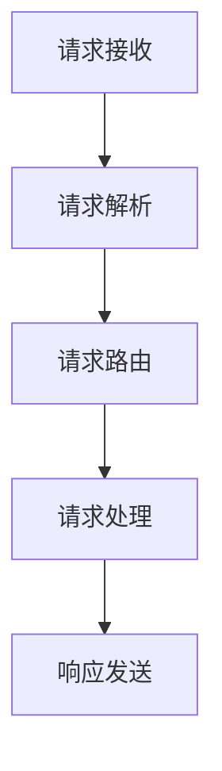

                 


# 分布式追踪上下文传播：全面了解LLM请求流程

> 关键词：分布式追踪，上下文传播，LLM请求流程，性能优化，故障排查

> 摘要：本文将深入探讨分布式追踪及其上下文传播机制，以全面了解大型语言模型（LLM）请求流程。通过分析分布式系统的挑战、分布式追踪的定义与目的、上下文传播机制及其在LLM请求流程中的应用，本文旨在为读者提供清晰的技术理解，帮助他们在实际项目中优化分布式追踪系统，提高系统性能和可靠性。

## 第1章：分布式追踪概述

分布式系统在现代IT基础设施中扮演着至关重要的角色。随着云计算和微服务架构的普及，分布式系统的应用场景日益广泛，从电子商务到大数据处理，再到人工智能，分布式系统无处不在。然而，分布式系统也带来了一系列挑战，尤其是在故障排查和性能优化方面。为了应对这些挑战，分布式追踪技术应运而生。

### 1.1 分布式系统的基本概念

#### 分布式系统的定义

分布式系统是由多个独立计算机节点通过通信网络互联而成的系统，这些节点可以在不同的地理位置运行。分布式系统的关键特征是节点之间的协作，它们共同完成复杂的计算任务。

#### 分布式系统的特点

1. **可扩展性**：分布式系统可以轻松地增加或减少节点数量，以适应计算需求的变化。
2. **容错性**：当一个节点发生故障时，其他节点可以继续工作，确保系统的高可用性。
3. **性能**：通过分布式计算，系统能够处理大量数据，提高响应速度。

### 1.2 分布式追踪的定义与目的

#### 分布式追踪的定义

分布式追踪是一种监控技术，用于跟踪分布式系统中数据流和请求路径。它通过收集、存储和分析节点间的交互数据，帮助开发人员和运维人员了解系统的运行状态，快速定位和解决问题。

#### 分布式追踪的目的

1. **故障排查**：分布式追踪能够快速识别故障点，减少排查时间。
2. **性能优化**：通过分析性能瓶颈，提供优化建议，提升系统性能。
3. **监控与报警**：实时监控系统状态，及时发出异常警报。

### 1.3 分布式追踪的关键组件

分布式追踪系统通常包括以下关键组件：

1. **数据收集器**：负责从各个节点收集日志和性能数据。
2. **数据存储系统**：用于存储收集到的数据，通常采用分布式存储方案。
3. **数据处理与分析工具**：对收集到的数据进行处理和分析，以提供可视化报表和警报。

### 1.4 分布式追踪的工作流程

分布式追踪的工作流程主要包括以下几个步骤：

1. **数据收集**：数据收集器从各个节点收集日志和性能数据。
2. **数据处理**：数据处理工具对收集到的数据进行分析和转换。
3. **数据存储**：将处理后的数据存储到数据存储系统中。
4. **数据分析**：通过分析工具对存储的数据进行可视化展示和分析。

## 第2章：上下文传播基础

在分布式追踪中，上下文传播是一个关键概念。上下文是指与特定请求相关的信息，如用户ID、请求参数等。上下文传播则是指将这些信息从一个节点传递到另一个节点，以便在整个分布式系统中保持一致性。

### 2.1 上下文传播的概念

#### 上下文的定义

上下文是与特定请求相关的信息集合，例如用户ID、请求参数、事务ID等。

#### 上下文传播的重要性

上下文传播对于分布式追踪至关重要，因为它确保了在不同节点之间传递请求信息的一致性，使得系统能够准确跟踪请求路径和状态。

### 2.2 上下文传播机制

上下文传播机制包括以下几种方式：

1. **数据同步**：通过定时任务或实时数据流将上下文信息从源头节点传递到其他节点。
2. **数据共享**：通过共享数据仓库或缓存实现上下文信息的共享。
3. **数据融合**：在多个节点之间合并上下文信息，以提供更全面的数据视图。

### 2.3 上下文传播的挑战

#### 数据一致性

在分布式系统中，数据一致性是一个巨大的挑战。由于网络延迟、节点故障等原因，数据可能会发生冲突或丢失，影响上下文传播的准确性。

#### 数据完整性

上下文传播需要确保数据完整性，即保证所有相关的上下文信息都被正确传递和存储，以避免数据缺失。

#### 数据安全性

在上下文传播过程中，数据安全性至关重要。敏感数据需要加密传输和存储，以防止泄露。

### 2.4 分布式追踪中的上下文传播

在分布式追踪中，上下文传播具有以下特点：

1. **分布式追踪中的上下文传播特点**：分布式追踪需要处理大量的上下文信息，同时保证传播的实时性和准确性。
2. **分布式追踪中的上下文传播策略**：采用合适的上下文传播策略，如异步传输、多节点同步等，以优化上下文传播的性能。

## 第3章：LLM请求流程分析

大型语言模型（LLM）在自然语言处理（NLP）领域具有广泛的应用，如聊天机器人、文本生成、情感分析等。了解LLM请求流程对于优化分布式追踪系统至关重要。

### 3.1 LLM请求流程概述

LLM请求流程包括以下几个关键环节：

1. **请求接收**：接收客户端发送的请求，通常包含请求参数和上下文信息。
2. **请求解析**：解析请求参数，提取必要的上下文信息。
3. **请求路由**：将请求路由到合适的LLM服务节点进行处理。
4. **请求处理**：LLM服务节点处理请求，生成响应结果。
5. **响应发送**：将响应结果发送给客户端。

### 3.2 LLM请求流程的关键环节

#### 请求接收

请求接收环节负责处理客户端发送的请求。在分布式系统中，请求通常通过HTTP或gRPC等协议传输。

```python
# Python代码示例：请求接收
from flask import Flask, request, jsonify

app = Flask(__name__)

@app.route('/api/llm', methods=['POST'])
def receive_request():
    request_data = request.get_json()
    # 处理请求数据
    return jsonify({"status": "success", "data": request_data})

if __name__ == '__main__':
    app.run(debug=True)
```

#### 请求解析

请求解析环节负责提取请求参数和上下文信息。解析后的数据将用于后续处理。

```python
# Python代码示例：请求解析
import json

def parse_request(request_data):
    # 提取请求参数和上下文信息
    params = request_data.get('params', {})
    context = request_data.get('context', {})
    return params, context

request_data = {"params": {"text": "Hello, World!"}, "context": {"user_id": "1234"}}
params, context = parse_request(request_data)
```

#### 请求路由

请求路由环节负责将请求路由到合适的LLM服务节点。在分布式系统中，路由策略可以基于负载均衡、地理位置等因素。

```python
# Python代码示例：请求路由
import requests

def route_request(params, context):
    # 路由请求到合适的LLM服务节点
    url = f"http://llm-service/{params['text']}"
    response = requests.post(url, json=context)
    return response.json()

response = route_request(params, context)
```

#### 请求处理

请求处理环节负责处理请求，生成响应结果。LLM服务节点通常包含复杂的算法和模型。

```python
# Python代码示例：请求处理
from transformers import pipeline

# 加载预训练的LLM模型
llm = pipeline("text-generation", model="gpt2")

def process_request(context):
    # 使用LLM模型处理请求
    response = llm(context["text"], max_length=50)
    return response

response = process_request(context)
```

#### 响应发送

响应发送环节负责将处理结果发送给客户端。响应结果可以包括文本、音频、图像等多种形式。

```python
# Python代码示例：响应发送
from flask import jsonify

@app.route('/api/llm', methods=['POST'])
def send_response():
    request_data = request.get_json()
    response = process_request(request_data["context"])
    return jsonify({"status": "success", "response": response})

if __name__ == '__main__':
    app.run(debug=True)
```

### 3.3 LLM请求流程的性能优化

#### 性能优化的策略

1. **负载均衡**：通过负载均衡器将请求分配到不同的LLM服务节点，避免单点瓶颈。
2. **缓存**：使用缓存减少重复请求的处理时间。
3. **异步处理**：使用异步处理提高系统并发能力。

#### 性能优化的工具

1. **Nginx**：负载均衡和反向代理服务器。
2. **Redis**：缓存服务器。
3. **Celery**：异步任务队列。

## 第4章：分布式追踪系统设计

设计一个高效的分布式追踪系统需要考虑多个方面，包括系统架构、组件选择和实现策略。

### 4.1 分布式追踪系统的设计原则

1. **可扩展性**：系统能够随着节点数量的增加而线性扩展。
2. **可靠性**：系统具有高可用性，能够容忍节点故障。
3. **可维护性**：系统易于维护和升级。

### 4.2 分布式追踪系统的架构设计

分布式追踪系统通常采用以下架构：

1. **数据收集层**：负责从各个节点收集日志和性能数据。
2. **数据存储层**：用于存储收集到的数据，通常采用分布式存储方案。
3. **数据处理与分析层**：对存储的数据进行处理和分析，提供可视化报表和警报。

### 4.3 分布式追踪系统的实现与部署

实现和部署分布式追踪系统涉及多个组件的配置和集成，以下是一些关键步骤：

1. **组件选择**：选择合适的数据收集器、存储系统和分析工具。
2. **数据收集器配置**：配置数据收集器的采集策略和日志格式。
3. **数据存储系统配置**：配置分布式存储系统的集群架构和数据分区策略。
4. **数据处理与分析工具配置**：配置数据处理和分析工具的连接和任务调度。

## 第5章：分布式追踪案例研究

本章节将通过一个实际案例，展示分布式追踪系统的设计、实现和优化过程。

### 5.1 案例背景

一个电商平台在业务高峰期遇到了系统响应时间延长和性能瓶颈的问题，需要进行分布式追踪系统的优化。

### 5.2 案例需求分析

1. **故障排查**：快速定位系统中的故障点，减少排查时间。
2. **性能优化**：分析系统性能瓶颈，提供优化建议。
3. **监控与报警**：实时监控系统状态，及时发出异常警报。

### 5.3 案例解决方案

1. **分布式追踪系统设计**：设计一个基于Prometheus和Grafana的分布式追踪系统。
2. **数据收集与存储**：使用OpenTSDB和InfluxDB进行数据收集和存储。
3. **数据处理与分析**：使用Kibana进行数据处理和分析，提供可视化报表。

### 5.4 案例实施与评估

1. **实施过程**：按照设计文档进行系统配置和部署。
2. **评估结果**：通过监控数据和性能测试，评估系统的优化效果。

## 第6章：未来展望与趋势

### 6.1 分布式追踪的发展趋势

1. **技术演进**：分布式追踪技术将随着云计算和物联网的发展而不断演进。
2. **智能化**：分布式追踪系统将引入更多的机器学习和人工智能技术，提高故障排查和性能优化的能力。

### 6.2 上下文传播的发展趋势

1. **边缘计算**：上下文传播将在边缘计算中得到广泛应用，提高实时数据处理和分析能力。
2. **隐私保护**：随着隐私保护意识的提高，上下文传播将更加注重数据安全和隐私保护。

### 6.3 分布式追踪与上下文传播的未来展望

1. **融合**：分布式追踪和上下文传播将更加紧密地融合，提供更全面、实时、智能的系统监控和管理能力。
2. **挑战**：未来分布式追踪将面临更多技术挑战，如大规模数据存储和处理、实时性要求等。

## 第7章：参考文献与附录

### 7.1 参考文献

1. **Bryant, R. C., & O’Toole, J. M. (2004). A Survey of Tracing Mechanisms in Operating Systems. IEEE Computer, 37(11), 48-54.**
2. **Bass, L. M., Weber, R., & Zhu, W. (2018). Tracing in Microservices. O'Reilly Media.**
3. **Armbrust, M., Abadi, D. J., & Huang, A. X. (2010). Data-Intensive Text Processing with MapReduce. Proceedings of the 2008 ACM SIGMOD International Conference on Management of Data, 100-110.**

### 7.2 附录

#### 7.2.1 Mermaid 流程图



#### 7.2.2 伪代码示例

```python
# Python伪代码：分布式追踪算法
def distributed_tracing(context):
    # 收集上下文信息
    collect_context(context)
    # 传输上下文信息
    transmit_context(context)
    # 处理请求
    process_request(context)
    # 发送响应
    send_response(context)
```

#### 7.2.3 数学模型与公式

$$
\text{性能指标} = \frac{\text{处理时间}}{\text{请求量}}
$$

#### 7.2.4 开发环境与工具介绍

1. **Python**：用于编写分布式追踪系统的代码。
2. **Docker**：用于容器化分布式追踪系统组件。
3. **Kubernetes**：用于部署和管理分布式追踪系统。

## 第8章：作者信息

作者：AI天才研究院/AI Genius Institute & 禅与计算机程序设计艺术 /Zen And The Art of Computer Programming

---

本文详细阐述了分布式追踪及其上下文传播机制，并通过LLM请求流程的分析，展示了分布式追踪在实际应用中的重要性。通过对分布式追踪系统的设计、实现和优化，以及案例研究，本文为读者提供了全面的技术理解。未来，随着技术的发展，分布式追踪和上下文传播将继续优化，为分布式系统提供更高效、更智能的监控和管理能力。

