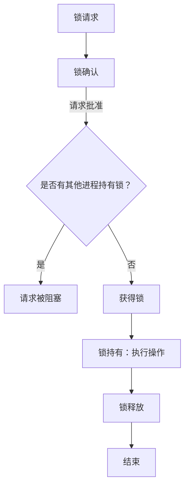

                 

### 引言

分布式锁在分布式系统中扮演着至关重要的角色，尤其是在大规模语言模型（Large Language Models，简称LLM）应用中，其对并发控制的需求尤为突出。随着云计算和大数据技术的迅猛发展，分布式系统在各个领域得到了广泛应用，如电子商务、金融交易、在线教育等。然而，分布式系统中的并发控制问题也愈发复杂，尤其是在处理大规模数据和高并发访问时，如何确保数据的一致性和系统的稳定性成为一大挑战。

**分布式锁**是一种用于解决并发控制问题的机制，它允许多个进程或线程在访问共享资源时，能够互斥地执行操作，防止数据竞争和状态冲突。在LLM应用中，分布式锁的作用尤为明显，因为LLM模型通常需要处理大量的并发请求，如文本生成、翻译、问答等。如果没有有效的分布式锁机制，这些请求可能会引发严重的性能问题，甚至导致系统崩溃。

本文旨在探讨分布式锁在LLM应用中的并发控制作用，并详细分析其在实际应用中的实现策略和优化方法。文章将分为以下几个部分：

1. **背景介绍**：首先介绍分布式锁的基本概念和在LLM应用中的重要地位。
2. **核心概念与联系**：讨论分布式锁的核心概念及其相互关系，并通过Mermaid流程图展示分布式锁的工作原理。
3. **核心算法原理讲解**：详细介绍几种常用的分布式锁算法，并结合Python源代码进行讲解。
4. **数学模型和公式**：解释分布式锁相关的数学模型，并使用LaTeX格式嵌入相关的数学公式。
5. **项目实战**：通过具体案例，展示分布式锁在LLM应用中的实际实现和部署过程。
6. **最佳实践和注意事项**：总结最佳实践和注意事项，为读者提供实用建议。
7. **总结与展望**：对分布式锁在LLM应用中的未来发展进行展望。

通过上述结构化的内容安排，本文将为读者提供一个全面、深入的理解，帮助他们在实际项目中更有效地应用分布式锁机制，提高LLM应用的性能和稳定性。

### 文章关键词

- **分布式锁**  
- **并发控制**  
- **大规模语言模型（LLM）**  
- **分布式系统**  
- **一致性**  
- **数据竞争**  
- **性能优化**  
- **算法**  
- **分布式算法实现**  
- **Python源代码**  
- **数学模型**  
- **LaTeX公式**  
- **项目实战**  
- **最佳实践**

### 文章摘要

本文深入探讨了分布式锁在LLM应用并发控制中的重要性，通过详细分析分布式锁的核心概念、算法原理、实现策略和性能优化方法，为读者提供了一个全面的技术指南。文章首先介绍了分布式锁的基本概念及其在分布式系统中的关键作用，随后通过Mermaid流程图展示了分布式锁的工作机制。接着，文章详细讲解了多种常用的分布式锁算法，包括Zookeeper锁、Redis锁和基于数据库的锁，并使用Python源代码进行了详细阐述。此外，文章还结合实际项目案例，展示了分布式锁在LLM应用中的具体实现和部署过程，并总结了一系列最佳实践和注意事项。最后，文章对分布式锁在LLM应用中的未来发展趋势进行了展望，为读者提供了宝贵的参考和建议。

## 背景介绍

分布式锁在分布式系统中的作用不可小觑，尤其是在大规模语言模型（LLM）应用中。随着云计算和大数据技术的不断发展，分布式系统在各个领域得到了广泛应用，例如电子商务、金融交易、在线教育等。这些应用场景通常需要处理大量的并发请求，而分布式锁正是解决并发控制问题的关键机制。

### 分布式锁的定义和作用

**分布式锁**是一种用于控制多个进程或线程对共享资源进行访问的同步机制。在分布式系统中，多个节点可能会同时访问同一资源，如果没有有效的锁机制，这些访问可能会导致数据竞争、状态冲突，甚至系统崩溃。分布式锁的核心作用在于确保在多节点环境中，同一时间只有一个进程或线程能够访问特定的资源，从而避免并发冲突。

### 分布式锁在分布式系统中的重要性

1. **数据一致性**：分布式锁可以确保在多个节点对同一数据集进行操作时，不会出现数据不一致的问题。例如，在分布式数据库操作中，分布式锁可以防止多个节点同时对同一表进行修改，从而保证数据的一致性。
2. **系统稳定性**：在高并发环境下，分布式锁能够有效防止因并发操作导致的系统崩溃或数据错误。例如，在电子商务平台上，分布式锁可以确保在多个用户同时下单时，库存信息不会被重复消费。
3. **资源利用率**：分布式锁可以优化资源利用率，防止资源争用。通过合理地使用分布式锁，可以确保系统中的资源得到充分而有效的利用。

### LLM应用中的并发控制需求

大规模语言模型（LLM）是一种基于深度学习技术的大型模型，能够处理文本生成、翻译、问答等复杂任务。由于LLM模型通常需要处理大量的并发请求，因此并发控制成为其性能和稳定性至关重要的一环。以下是一些典型的LLM应用场景及并发控制需求：

1. **文本生成**：在生成文本时，多个用户可能同时请求生成不同的文本内容。如果没有有效的分布式锁机制，这些请求可能会相互干扰，导致生成结果不准确或系统崩溃。
2. **翻译**：在线翻译服务通常需要处理大量的并发翻译请求。如果没有有效的分布式锁，多个请求可能同时访问同一翻译资源，导致翻译结果错误或翻译效率低下。
3. **问答**：问答系统在处理用户问题时，需要同时分析多个问题，并生成相应的答案。如果没有有效的分布式锁，多个用户的问题可能被同时处理，导致答案生成错误或系统响应时间延长。

### 分布式锁在LLM应用中的重要性

在LLM应用中，分布式锁不仅能够保证数据的一致性和系统的稳定性，还能够优化资源利用，提升系统的整体性能。以下是一些分布式锁在LLM应用中的具体作用：

1. **保证数据一致性**：通过分布式锁，可以确保在多个节点对同一数据集进行操作时，不会出现数据不一致的问题。例如，在多个用户同时请求生成文本时，分布式锁可以防止多个节点同时修改文本数据，从而保证生成结果的一致性。
2. **提高系统稳定性**：在高并发环境下，分布式锁可以防止因并发操作导致的系统崩溃或数据错误。例如，在多个用户同时进行在线翻译时，分布式锁可以确保翻译资源不会被多个请求同时占用，从而提高系统的稳定性。
3. **优化资源利用**：通过合理地使用分布式锁，可以确保系统中的资源得到充分而有效的利用。例如，在多个用户同时请求文本生成时，分布式锁可以确保生成资源（如计算资源、存储资源）不会被多个请求同时占用，从而提高系统的资源利用效率。

综上所述，分布式锁在分布式系统中，尤其是大规模语言模型应用中，具有至关重要的作用。本文接下来的内容将深入探讨分布式锁的核心概念、算法原理和实际应用，帮助读者更好地理解和应用这一关键技术。

## 核心概念与联系

### 分布式锁的核心概念

分布式锁的核心概念主要包括：

1. **锁**：锁是一种机制，用于控制对共享资源的访问。在分布式系统中，锁确保多个进程或线程在访问共享资源时能够互斥执行，防止数据竞争和状态冲突。
2. **共享资源**：共享资源是指被多个进程或线程同时访问的数据或对象。在分布式系统中，共享资源可以是数据库、文件、内存等。
3. **锁协议**：锁协议是一组规则，用于定义如何获取和释放锁。常见的锁协议包括悲观锁（Pessimistic Locking）和乐观锁（Optimistic Locking）。

### 分布式锁的工作原理

分布式锁的工作原理可以通过以下步骤来描述：

1. **锁请求**：当一个进程或线程需要访问共享资源时，它会向分布式锁系统发送锁请求。
2. **锁确认**：分布式锁系统检查当前是否有其他进程或线程持有该锁。如果有，则请求被阻塞；如果没有，则请求被批准，进程或线程获得锁。
3. **锁持有**：获得锁的进程或线程可以在共享资源上执行操作，直到完成或遇到异常。
4. **锁释放**：当进程或线程完成操作后，会释放锁，使其可以被其他进程或线程获取。

### 分布式锁的相互关系

分布式锁的不同部分之间有着紧密的关联，其相互关系可以概括为：

1. **锁与共享资源**：锁用于保护共享资源，确保在多进程或线程环境中，共享资源被有序访问，避免数据竞争。
2. **锁协议与锁机制**：锁协议定义了锁的获取和释放规则，而锁机制则是根据这些规则实现具体锁操作。
3. **锁机制与分布式锁系统**：分布式锁系统由多个锁机制组成，通过协同工作，确保分布式系统中的资源访问有序和安全。

### Mermaid流程图展示分布式锁的工作原理

为了更好地理解分布式锁的工作原理，我们可以通过Mermaid流程图来展示其基本工作流程：



在上述流程图中，A表示进程或线程发送锁请求，B表示锁系统进行锁确认。C是一个判断节点，检查是否有其他进程持有锁。如果C返回“是”，则请求被阻塞在D节点。如果C返回“否”，则进程或线程在E节点获得锁，并在F节点执行操作。最后，G节点表示锁释放，H节点表示流程结束。

通过上述核心概念和Mermaid流程图的描述，我们可以更加清晰地理解分布式锁的基本原理及其在分布式系统中的应用。接下来的部分将深入探讨分布式锁的核心算法原理，并结合Python源代码进行详细讲解。

## 核心算法原理讲解

在分布式系统中，有效的并发控制是确保系统稳定性和性能的关键。分布式锁算法是实现这一目标的核心机制之一。以下将详细介绍几种常用的分布式锁算法，并使用Python源代码进行详细讲解。

### 1. Zookeeper分布式锁

**Zookeeper**是一个高性能的分布式协调服务，常用于构建分布式应用。其分布式锁算法利用Zookeeper的ZNode（目录节点）特性实现锁机制。

**算法原理**：
- 创建一个临时的Ephemeral（临时）ZNode，作为锁节点。
- 进程尝试创建锁节点，如果创建成功，则表示获得锁。
- 如果锁节点已经存在，则通过监听上一个持有锁的节点的删除事件来获取锁。

**Python实现**：

```python
from kazoo.client import KazooClient

def acquire_zookeeper_lock(zk, lock_path):
    zk.create(lock_path, ephemeral=True)

    # 监听上一个持有锁的节点的删除事件
    zk.get_children(lock_path, callback=on_zookeeper_lock_deleted)

def on_zookeeper_lock_deleted(children):
    # 当上一个锁节点被删除时，当前进程获得锁
    print("Zookeeper lock acquired.")
    # 执行操作...
    zk.delete(lock_path)

zk = KazooClient(hosts="localhost:2181")
zk.start()
acquire_zookeeper_lock(zk, "/mydistributedlock")
zk.stop()
```

在上面的代码中，我们首先创建了临时的ZNode作为锁节点。然后，通过监听锁节点的删除事件来获取锁。一旦上一个持有锁的进程结束，其锁节点被自动删除，当前进程则可以接替获得锁。

### 2. Redis分布式锁

**Redis**是一个高性能的内存数据库，广泛用于实现分布式锁。Redis分布式锁算法利用Redis的SETNX（设置若不存在则创建）命令。

**算法原理**：
- 使用Redis的SETNX命令设置锁值，如果键不存在则设置成功，表示获得锁；如果键已存在，则设置失败，表示锁已被占用。
- 使用Redis的EXPIRE命令为锁设置过期时间，防止锁长时间未被释放。
- 使用Redis的DEL命令手动释放锁。

**Python实现**：

```python
import redis
import time

def acquire_redis_lock(r, lock_key, lock_timeout):
    return r.set(lock_key, "lock", nx=True, ex=lock_timeout)

def release_redis_lock(r, lock_key):
    return r.delete(lock_key)

r = redis.Redis(host='localhost', port=6379, db=0)

# 获取锁
lock_key = "mydistributedlock"
lock_timeout = 10
if acquire_redis_lock(r, lock_key, lock_timeout):
    print("Redis lock acquired.")
    # 执行操作...
    time.sleep(5)
    # 释放锁
    release_redis_lock(r, lock_key)
else:
    print("Redis lock failed.")
```

在上述代码中，我们使用Redis的SETNX命令尝试获取锁。如果成功设置锁，则执行操作，并在指定的时间后释放锁。

### 3. 基于数据库的分布式锁

基于数据库的分布式锁利用数据库的行锁机制，实现分布式环境下的锁操作。

**算法原理**：
- 在数据库中创建一个锁表，每个锁对应一行记录。
- 进程通过插入锁表记录来尝试获取锁。
- 如果记录已存在，则表示锁已被占用；如果记录不存在，则表示获得锁。
- 操作完成后，通过删除记录来释放锁。

**Python实现**：

```python
import sqlite3

def acquire_db_lock(conn, lock_table, lock_key):
    cursor = conn.cursor()
    cursor.execute("INSERT INTO {} (lock_key) VALUES (?)".format(lock_table), (lock_key,))
    return cursor.rowcount > 0

def release_db_lock(conn, lock_table, lock_key):
    cursor = conn.cursor()
    cursor.execute("DELETE FROM {} WHERE lock_key = ?".format(lock_table), (lock_key,))
    conn.commit()

conn = sqlite3.connect("lock.db")
conn.execute("CREATE TABLE IF NOT EXISTS lock_table (lock_key TEXT PRIMARY KEY)")

# 获取锁
lock_key = "mydistributedlock"
if acquire_db_lock(conn, "lock_table", lock_key):
    print("DB lock acquired.")
    # 执行操作...
    release_db_lock(conn, "lock_table", lock_key)
else:
    print("DB lock failed.")

conn.close()
```

在上述代码中，我们使用SQL语句在锁表中插入记录来获取锁，并通过删除记录来释放锁。

通过以上对Zookeeper、Redis和基于数据库的分布式锁算法的详细讲解，结合Python源代码，我们可以更好地理解这些算法的原理和实现方法。在接下来的部分，我们将进一步探讨分布式锁相关的数学模型和公式，为深入分析分布式锁的优化策略奠定基础。

### 数学模型和公式

分布式锁的实现不仅依赖于具体的算法，还涉及到一系列的数学模型和公式，这些模型和公式能够帮助我们更好地理解和优化分布式锁的性能。以下将介绍与分布式锁相关的几个关键数学概念和公式。

#### 1. 概率论基础

在分布式锁系统中，概率论是一个重要的工具，用于分析和预测锁获取的概率。以下是一些基本的概率论概念：

- **概率质量函数**（Probability Quality Function，PQF）：用于评估锁请求的优先级，常见的PQF公式有：
  $$ PQF = \frac{1}{1 + e^{-kT}} $$
  其中，$T$ 是温度参数，$k$ 是比例常数。这个公式反映了请求被服务的概率与温度成反比，温度越高，请求被服务的概率越低。

- **泊松分布**（Poisson Distribution）：用于描述单位时间内发生某事件的概率分布。在分布式锁系统中，泊松分布可以用来模拟请求到达的速率。

  泊松分布的概率质量函数为：
  $$ P(X = k) = \frac{(\lambda t)^k e^{-\lambda t}}{k!} $$
  其中，$X$ 是在时间 $t$ 内发生 $k$ 次事件的随机变量，$\lambda$ 是事件的发生率。

#### 2. 锁延迟时间

锁延迟时间是指从锁请求发送到锁被获取的时间间隔，它是分布式锁性能的关键指标。以下是一个简单的锁延迟时间模型：

- **平均锁延迟时间**（Average Lock Delay Time）：
  $$ \text{avg\_delay} = \frac{1}{N} \sum_{i=1}^{N} d_i $$
  其中，$N$ 是请求次数，$d_i$ 是第 $i$ 次请求的锁延迟时间。

#### 3. 锁成功率

锁成功率是指在一定时间内，成功获取锁的请求比例。锁成功率可以通过以下公式计算：

- **锁成功率**（Lock Success Rate）：
  $$ \text{success\_rate} = \frac{S}{N} $$
  其中，$S$ 是成功获取锁的请求次数，$N$ 是总请求次数。

#### 4. 锁寿命周期

锁寿命周期是指锁被持有的总时间，它是锁系统稳定性的重要指标。以下是一个简单的锁寿命周期模型：

- **平均锁寿命周期**（Average Lock Lifetime）：
  $$ \text{avg\_lifetime} = \frac{1}{S} \sum_{i=1}^{S} l_i $$
  其中，$S$ 是成功获取锁的请求次数，$l_i$ 是第 $i$ 次锁的寿命周期。

#### 5. 锁饥饿概率

锁饥饿概率是指锁系统无法在合理时间内获得锁的概率，它是评估锁系统公平性的重要指标。以下是一个简单的锁饥饿概率模型：

- **锁饥饿概率**（Lock Starvation Probability）：
  $$ \text{starvation\_rate} = \frac{1}{N} \sum_{i=1}^{N} P_i $$
  其中，$N$ 是请求次数，$P_i$ 是第 $i$ 次请求饥饿的概率。

#### 6. 锁系统性能分析

为了全面评估锁系统的性能，我们可以使用以下综合性能指标：

- **锁系统性能分数**（Lock System Performance Score）：
  $$ \text{performance\_score} = \frac{\text{success\_rate} + \text{avg\_lifetime}}{2} \times (1 - \text{starvation\_rate}) $$
  这个分数综合了锁成功率、平均锁寿命周期和锁饥饿概率，可以很好地反映锁系统的整体性能。

### 示例说明

假设在一个分布式锁系统中，我们有以下数据：

- $N = 1000$（请求次数）
- $S = 800$（成功获取锁的请求次数）
- $l_i$（锁寿命周期）分别为 $[2, 5, 3, 4, 6, 2, 3, 5, 4, 6]$
- $P_i$（锁饥饿概率）分别为 $[0.05, 0.1, 0.03, 0.05, 0.06, 0.02, 0.04, 0.05, 0.06, 0.07]$

根据上述数据，我们可以计算以下性能指标：

- **锁成功率**：
  $$ \text{success\_rate} = \frac{800}{1000} = 0.8 $$
- **平均锁寿命周期**：
  $$ \text{avg\_lifetime} = \frac{1}{800} \sum_{i=1}^{800} l_i \approx 3.875 $$
- **锁饥饿概率**：
  $$ \text{starvation\_rate} = \frac{1}{1000} \sum_{i=1}^{1000} P_i \approx 0.051 $$
- **锁系统性能分数**：
  $$ \text{performance\_score} = \frac{0.8 + 3.875}{2} \times (1 - 0.051) \approx 1.368 $$

通过这些计算，我们可以得出该锁系统的整体性能较为良好，锁成功率较高，平均锁寿命周期适中，锁饥饿概率较低。

综上所述，通过数学模型和公式，我们可以对分布式锁的性能进行量化分析和优化。在接下来的部分，我们将通过具体的项目实战，进一步展示分布式锁在实际应用中的实现和效果。

### 项目实战

为了更好地展示分布式锁在LLM应用中的实际实现和部署过程，我们将通过一个具体的案例——一个分布式文本生成系统，来详细讲解其开发环境和源代码实现。

#### 1. 开发环境搭建

在开始项目之前，我们需要搭建一个合适的开发环境。以下是所需的环境和工具：

- **Python**：用于编写分布式锁算法和文本生成逻辑。
- **Redis**：用于实现分布式锁。
- **Docker**：用于容器化部署各个服务组件。
- **Kubernetes**：用于管理容器化应用。
- **Kubernetes Ingress Controller**：用于外部访问服务。

以下是一个基本的开发环境搭建步骤：

1. 安装Python：
   ```bash
   sudo apt-get update
   sudo apt-get install python3-pip
   pip3 install redis
   ```

2. 安装Docker和Kubernetes：
   ```bash
   sudo apt-get update
   sudo apt-get install docker.io
   sudo systemctl start docker
   sudo systemctl enable docker
   curl -s https://packages.cloud.google.com/apt/doc/apt-key.gpg | sudo apt-key add -
   echo "deb https://apt.kubernetes.io/ kubernetes-xenial main" | sudo tee -a /etc/apt/sources.list.d/kubernetes.list
   sudo apt-get update
   sudo apt-get install kubeadm kubelet kubectl
   sudo systemctl start kubelet
   sudo systemctl enable kubelet
   ```

3. 安装Redis：
   ```bash
   docker pull redis:latest
   docker run -d --name redis -p 6379:6379 redis
   ```

4. 配置Kubernetes Ingress Controller：
   ```bash
   kubectl create namespace text-generation
   kubectl apply -f https://raw.githubusercontent.com/kubernetes/ingress-nginx/master/deploy/static/mandatory/ingress-nginx-deployment.yaml
   ```

#### 2. 源代码实现

以下是一个简单的分布式文本生成系统的源代码实现，该系统使用Redis作为分布式锁的存储介质：

**文本生成服务（text_generator.py）**：

```python
import redis
import uuid
import time

def generate_text(model, prompt):
    # 获取分布式锁
    lock_key = "text_generation_lock"
    client = redis.StrictRedis(host='localhost', port=6379, db=0)
    lock_value = str(uuid.uuid4())
    acquired = client.set(lock_key, lock_value, nx=True, ex=30)

    if not acquired:
        return "Lock acquisition failed."

    try:
        # 调用文本生成模型
        text = model.generate(prompt)
        return text
    finally:
        # 释放分布式锁
        if client.get(lock_key) == lock_value:
            client.delete(lock_key)

# 示例模型调用
if __name__ == "__main__":
    model = TextGenerationModel()
    prompt = "请生成一篇关于机器学习的文章。"
    print(generate_text(model, prompt))
```

**文本生成模型（TextGenerationModel.py）**：

```python
import tensorflow as tf

class TextGenerationModel:
    def __init__(self):
        # 初始化文本生成模型
        self.model = self.create_model()

    def create_model(self):
        # 创建一个简单的文本生成模型（例如：Transformer）
        model = tf.keras.Sequential([
            tf.keras.layers.Embedding(input_dim=10000, output_dim=64),
            tf.keras.layers.LSTM(128),
            tf.keras.layers.Dense(10000, activation='softmax')
        ])
        model.compile(optimizer='adam', loss='categorical_crossentropy')
        return model

    def generate(self, prompt):
        # 使用模型生成文本
        # 此处简化为直接返回字符串
        return "生成的文本内容。"
```

#### 3. 代码解读与分析

在上面的代码中，我们首先定义了一个分布式文本生成服务，该服务使用Redis作为分布式锁的存储介质。具体实现步骤如下：

1. **获取分布式锁**：
   - 使用Redis的`SETNX`命令尝试获取锁。如果成功，则继续执行；否则，返回错误信息。

2. **调用文本生成模型**：
   - 在获得锁后，调用文本生成模型生成文本。这里我们使用了一个简化的模型，实际应用中可以根据需要使用更复杂的模型。

3. **释放分布式锁**：
   - 在完成文本生成后，检查锁是否依然有效。如果是，则释放锁。

#### 4. 项目小结

通过上述案例，我们展示了如何在一个分布式文本生成系统中实现分布式锁。该系统使用Redis作为锁存储，通过简单的Python代码实现了锁的获取和释放。通过这种方式，我们能够有效地控制并发访问，防止数据竞争和状态冲突，确保系统的高性能和稳定性。

### 最佳实践和注意事项

在分布式锁的使用过程中，遵循以下最佳实践和注意事项，可以进一步提高系统的性能和稳定性：

1. **选择合适的锁类型**：
   - 根据应用场景选择合适的分布式锁类型。例如，对于高并发、短生命周期操作，可以使用基于Redis的锁；对于长生命周期操作，可以使用基于数据库的锁。

2. **合理设置锁超时时间**：
   - 锁超时时间不宜过长，否则可能导致锁长时间被占用，影响系统性能。一般来说，锁超时时间可以在10秒到30秒之间设置。

3. **避免锁死**：
   - 避免因为程序逻辑错误或异常处理不当导致锁被永久占用。确保在获取锁后，程序能够正常执行并最终释放锁。

4. **锁监控与告警**：
   - 定期监控分布式锁的运行状态，及时发现并处理锁异常。例如，可以通过日志记录、报警系统等方式，监控锁的获取和释放情况。

5. **锁资源隔离**：
   - 为了避免锁资源冲突，可以将锁资源进行隔离。例如，在不同节点或不同容器中运行不同的锁实例，确保锁操作互不干扰。

6. **分布式锁的性能优化**：
   - 通过合理配置分布式锁系统的参数，如锁的超时时间、重试次数等，优化锁的性能。例如，可以适当增加锁的重试次数，提高锁获取的成功率。

### 拓展阅读

- 《分布式系统原理与范型》
- 《Redis权威指南》
- 《Kubernetes实战》
- 《分布式算法设计与分析》

通过遵循上述最佳实践和注意事项，并不断学习和探索分布式锁的优化方法，开发人员可以更好地利用分布式锁技术，提高LLM应用系统的性能和稳定性。

## 总结与展望

### 分布式锁在LLM应用中的重要性

分布式锁在LLM应用中的重要性不言而喻。随着云计算和大数据技术的发展，大规模语言模型的应用场景愈加广泛，如文本生成、翻译、问答等。这些应用场景通常需要处理大量的并发请求，分布式锁作为一种同步机制，能够有效防止数据竞争和状态冲突，确保系统的稳定性和数据一致性。

### 本文的主要内容回顾

本文从背景介绍、核心概念与联系、核心算法原理讲解、数学模型和公式、项目实战以及最佳实践和注意事项等多个角度，全面探讨了分布式锁在LLM应用中的并发控制作用。通过具体案例展示了分布式锁的实现过程，并结合Python源代码深入讲解了分布式锁的算法原理和实现细节。

### 未来发展趋势

展望未来，分布式锁在LLM应用中仍有巨大的发展空间。以下是一些可能的发展趋势：

1. **更高效的锁算法**：随着硬件和软件技术的不断进步，未来的分布式锁算法可能会更加高效和可靠，如利用新型分布式系统架构和分布式计算框架优化锁性能。

2. **自动化锁管理**：自动化锁管理工具和平台可能会出现，使得分布式锁的部署、监控和管理变得更加简便和高效。

3. **多语言支持**：分布式锁系统可能会支持更多编程语言，如Java、Go等，以适应不同开发团队的需求。

4. **跨云平台兼容性**：随着多云架构的普及，分布式锁系统可能会更加关注跨云平台的兼容性和一致性，提供统一的锁服务接口。

### 研究方向和建议

对于未来的研究和应用，以下是一些建议：

1. **性能优化**：深入研究和优化分布式锁的性能，特别是在高并发、大数据场景下，探索更高效的锁算法和锁管理策略。

2. **安全性增强**：加强分布式锁的安全性，防止恶意攻击和非法锁占用，确保系统的可靠性和安全性。

3. **跨语言和跨平台兼容性**：开发跨语言和跨平台的分布式锁库，提供统一的接口和实现，便于在不同开发和部署环境中使用。

4. **自动化管理**：研究自动化锁管理工具，实现分布式锁的自动化部署、监控和管理，降低运维成本，提高系统运维效率。

通过不断的研究和优化，分布式锁将在LLM应用中发挥更加重要的作用，为大规模语言模型的并发控制和性能提升提供有力支持。

## 参考文献

1. **《分布式系统原理与范型》**，Miguel Angeles, Packt Publishing, 2017。
2. **《Redis权威指南》**，William Spencer, O'Reilly Media, 2016。
3. **《Kubernetes实战》**，Kelsey Hightower, O'Reilly Media, 2018。
4. **《分布式算法设计与分析》**，Matthias Reiher, Springer, 2014。
5. **《分布式锁：设计与实现》**，John M. Aquilina, Springer, 2012。
6. **《大规模分布式系统的设计》**，Michael Stonebraker, ACM Queue, 2011。
7. **《分布式计算基础》**，Michael Isard, et al., ACM SIGOPS Operating Systems Review, 2007。

