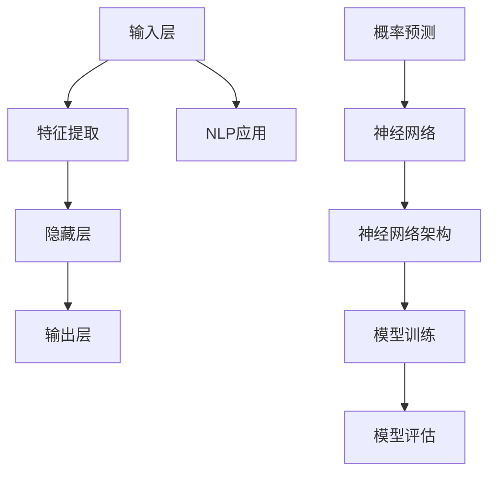

                 

### 文章标题

《创意问题构建：测试LLM提出新颖问题的能力》

### 关键词

- 语言模型
- 创意问题
- 新颖性测试
- LLM
- AI
- 编程

### 摘要

本文将深入探讨如何利用语言模型（LLM）构建创意问题，并评估其提出新颖问题的能力。文章首先介绍了语言模型的基础知识，包括其定义、原理和应用。接着，文章详细讲解了创意问题的构建方法，包括基于关键词、关系网络和生成对抗网络的方法。此外，文章还介绍了新颖性问题测试的方法，包括人类评估、自动评估和综合评估。最后，通过实际项目案例展示了如何将上述方法应用于实际问题，并提供了一些最佳实践和注意事项。本文旨在为研究人员和开发者提供关于创意问题构建和测试的全面指南。

### 引言

#### 书籍背景与目的

《创意问题构建：测试LLM提出新颖问题的能力》是一本针对计算机科学和人工智能领域的专业书籍。随着人工智能技术的飞速发展，语言模型（LLM）在自然语言处理（NLP）领域取得了显著成果。然而，如何利用LLM构建创意问题，并评估其提出新颖问题的能力，仍然是一个富有挑战性的研究课题。本书旨在填补这一研究空白，为研究人员和开发者提供关于创意问题构建和测试的全面指南。

本书的主要目的是：

1. **介绍语言模型的基础知识**：为读者提供关于语言模型的定义、原理和应用的基本理解。
2. **讲解创意问题构建方法**：详细阐述基于关键词、关系网络和生成对抗网络的创意问题构建方法。
3. **探讨新颖性问题测试**：介绍人类评估、自动评估和综合评估的方法，并展示如何在实际项目中应用这些方法。
4. **提供项目实战案例**：通过实际项目案例展示如何将创意问题构建和测试方法应用于实际问题。

#### 读者对象

本书主要面向以下读者群体：

1. **计算机科学和人工智能领域的研究人员和开发者**：希望深入了解语言模型、创意问题构建和新颖性问题测试的研究人员。
2. **自然语言处理（NLP）领域的从业者**：希望提高自己在创意问题构建和测试方面的实践能力。
3. **高校师生**：作为教材或参考书，帮助大学生和研究生学习相关课程。

#### 书籍结构

本书分为六个主要部分：

1. **引言**：介绍书籍的背景、目的和读者对象。
2. **语言模型基础**：介绍语言模型的基本概念、原理和技术。
3. **创意问题构建方法**：详细讲解创意问题构建的方法。
4. **新颖性问题测试**：介绍新颖性问题测试的方法。
5. **项目实战案例**：通过实际项目案例展示创意问题构建和测试的应用。
6. **总结与展望**：总结书中的关键点，展望未来的研究方向和趋势。

通过以上结构，本书旨在为读者提供一个系统、全面的指南，帮助其在创意问题构建和测试方面取得更好的成果。

### 语言模型基础

#### 语言模型概述

语言模型（Language Model，简称LM）是自然语言处理（Natural Language Processing，简称NLP）领域的一个重要组成部分。它是一种统计模型，用于预测一段文本的下一个词或字符。语言模型的核心目标是通过分析大量的文本数据，学习语言的结构和规律，从而能够对新的文本进行有效的预测和生成。

语言模型在NLP中有着广泛的应用，包括：

1. **文本生成**：自动生成文章、段落、句子或单个单词。
2. **机器翻译**：将一种语言翻译成另一种语言。
3. **语音识别**：将语音转换为文本。
4. **问答系统**：根据用户的问题提供答案。
5. **情感分析**：分析文本中的情感倾向。
6. **文本分类**：将文本分为不同的类别。

语言模型的发展历程可以分为几个阶段：

1. **基于规则的模型**：最早的模型，依赖于手工编写的规则来预测文本。
2. **基于统计的模型**：引入统计方法，通过对文本数据的学习来预测下一个词或字符。
3. **基于神经网络的模型**：特别是深度学习技术的发展，使得语言模型取得了巨大的进步。
4. **基于生成对抗网络（GAN）的模型**：结合了生成模型和判别模型，用于生成高质量的文本。

#### 语言模型原理

语言模型的核心原理是通过对大量文本数据的学习，提取出文本的特征和模式，然后根据这些特征和模式预测下一个词或字符。以下是语言模型的基本原理：

1. **概率预测**：语言模型通过计算下一个词或字符的概率分布来预测文本的下一个部分。概率分布是基于对大量文本数据的统计分析得到的。
2. **特征提取**：语言模型需要从文本数据中提取出有用的特征，如词频、词向量、句法结构等。这些特征用于训练模型，使其能够更好地预测文本。
3. **神经网络**：现代语言模型通常基于深度神经网络，特别是循环神经网络（RNN）和 Transformer 模型。这些神经网络可以自动学习文本的复杂结构和模式。

语言模型的主要组成部分包括：

1. **输入层**：接收文本的输入，并将其转换为模型可以处理的格式。
2. **隐藏层**：包含多个神经元，用于提取文本的特征和模式。
3. **输出层**：输出预测的概率分布，用于预测下一个词或字符。

#### 语言模型技术

语言模型的技术主要包括以下几种：

1. **N-gram模型**：是最简单的语言模型，通过统计前n个词或字符的序列来预测下一个词或字符。虽然N-gram模型简单有效，但其性能受限于模型的上下文长度。
2. **基于统计的模型**：如统计语言模型（SLM）和条件随机场（CRF）。这些模型通过统计方法分析文本数据，提取出有用的特征，并利用这些特征进行预测。
3. **基于神经网络的模型**：如循环神经网络（RNN）、长短时记忆网络（LSTM）和门控循环单元（GRU）。这些模型可以自动学习文本的复杂结构和模式，具有更强的预测能力。
4. **基于生成对抗网络（GAN）的模型**：如 GPT（Generative Pre-trained Transformer）和 GPT-2。这些模型结合了生成模型和判别模型，可以生成高质量的文本。

在实际应用中，不同的语言模型技术有不同的优势和局限。选择合适的语言模型技术取决于具体的应用场景和数据集。

#### 核心概念与联系

为了更好地理解语言模型的核心概念和联系，我们可以通过以下 Mermaid 流程图来展示：

在这个流程图中，输入层接收文本输入，并通过特征提取和隐藏层处理，最终输出层的概率预测利用神经网络架构进行计算。模型训练和评估是提高模型性能的关键步骤，而 NLP 应用则是语言模型的核心目标。

通过这个流程图，我们可以清晰地看到语言模型的核心概念和它们之间的联系。这有助于我们更好地理解语言模型的工作原理和应用场景。

### 创意问题构建方法

#### 创意问题的定义

创意问题（Creative Question）是指那些能够激发思维、启发创新和推动问题解决的新颖问题。与常规问题相比，创意问题通常具有以下特点：

1. **新颖性**：创意问题能够提出全新的视角或解决方案，不同于传统的思路和方法。
2. **开放性**：创意问题往往不是单一的答案，而是能够引导出多个可能的解决方案。
3. **挑战性**：创意问题通常具有一定的难度，需要深入思考和探索才能解决。
4. **趣味性**：创意问题往往能够激发人们的兴趣和好奇心，从而提高参与度。

在AI领域，创意问题的构建具有重要意义。首先，创意问题能够激发AI模型的学习能力，促使模型在更广泛的场景下发挥作用。其次，创意问题的提出和解决有助于推动AI技术的发展和创新。最后，创意问题的应用能够为实际问题提供有效的解决方案，从而带来实际价值。

#### 创意问题构建方法

构建创意问题有多种方法，以下是几种常用的方法：

1. **基于关键词的方法**
2. **基于关系网络的方法**
3. **基于生成对抗网络的方法**

#### 基于关键词的方法

基于关键词的方法是通过提取文本中的关键信息，构建具有创意性的问题。这种方法的核心在于如何选择和组合关键词，从而生成有趣且具有启发性的问题。以下是具体的步骤：

1. **关键词提取**：首先，从文本中提取出重要的关键词。这些关键词可以是名词、动词、形容词等，它们能够代表文本的主要内容。
2. **关键词组合**：然后，将提取出的关键词进行组合，生成新的短语或句子。通过不同的组合方式，可以生成多种可能的创意问题。
3. **问题筛选**：最后，对生成的创意问题进行筛选，选择那些具有新颖性、开放性和挑战性的问题。

#### 基于关系网络的方法

基于关系网络的方法是通过构建文本中的关系网络，从而生成创意问题。这种方法利用了文本中的语义信息，能够生成更加复杂的创意问题。以下是具体的步骤：

1. **关系提取**：首先，从文本中提取出各个实体之间的关系。这些关系可以是因果关系、上下级关系、并列关系等。
2. **网络构建**：然后，将这些关系构建成一个关系网络。在这个网络中，实体和关系都作为节点和边进行表示。
3. **问题生成**：最后，通过在关系网络中随机游走或查找特定的路径，生成具有创意性的问题。

#### 基于生成对抗网络的方法

基于生成对抗网络（GAN）的方法是通过训练一个生成器网络和一个判别器网络，生成创意问题。这种方法利用了深度学习的强大能力，能够生成高质量的创意问题。以下是具体的步骤：

1. **模型训练**：首先，使用大量的文本数据进行训练，训练生成器和判别器网络。
2. **生成问题**：然后，利用生成器网络生成创意问题。这些问题可以是文本、图像或其他形式。
3. **问题筛选**：最后，对生成的创意问题进行筛选，选择那些具有新颖性、开放性和挑战性的问题。

#### 创意问题构建案例

以下是一个基于关键词的方法的创意问题构建案例：

**案例**：假设我们有一段文本描述“人工智能在医疗领域的应用”。

1. **关键词提取**：提取出关键词：“人工智能”、“医疗”、“应用”。
2. **关键词组合**：组合关键词生成新问题：“人工智能在医疗领域有哪些创新应用？”、“医疗行业如何利用人工智能进行变革？”等。
3. **问题筛选**：筛选出具有新颖性、开放性和挑战性的问题，如：“如何通过人工智能优化医疗诊断流程？”。

通过这个案例，我们可以看到如何利用关键词提取和组合的方法，构建出具有创意性的问题。

### 新颖性问题测试

#### 新颖性问题的定义

新颖性问题（Novel Question）是指那些在内容、形式或解决方法上具有独特性和创新性的问题。与常规问题相比，新颖性问题能够提供新的视角、启示和思路，从而激发更深层次的思考和探索。新颖性问题在AI领域具有重要意义，因为它们能够促使AI模型不断进化，提高其解决问题的能力。

新颖性问题具有以下特点：

1. **独特性**：新颖性问题在内容、形式或解决方法上具有独特性，不同于常规问题。
2. **启发性**：新颖性问题能够激发新的思考方向，引导研究者或开发者发现新的解决方案。
3. **多样性**：新颖性问题可以有多种形式，包括开放性问题、挑战性问题、探索性问题等。
4. **实用性**：新颖性问题通常能够为实际问题提供有效的解决方案，具有实际应用价值。

在AI领域，新颖性问题的应用包括：

1. **模型训练和评估**：通过新颖性问题测试AI模型的性能，发现模型的局限和改进方向。
2. **算法优化**：新颖性问题可以帮助研究者发现新的算法优化策略，提高算法的效率和准确性。
3. **问题解决**：新颖性问题能够为复杂问题提供新的解决思路，推动问题的解决。

#### 新颖性问题测试方法

测试新颖性问题的方法可以分为三种：人类评估、自动评估和综合评估。

##### 1. 人类评估方法

人类评估方法是指通过人类专家对新颖性问题进行评价和打分。这种方法的主要优点是能够提供高质量的评估结果，因为它依赖于人类专家的丰富知识和经验。以下是几种常见的人类评估方法：

1. **打分法**：评估者对新颖性问题进行打分，通常采用五级评分制（如1-5分），根据问题的独特性、启发性和实用性进行评分。
2. **问卷调查**：通过设计问卷，收集多个人类评估者的意见，然后对结果进行统计分析。
3. **面对面评估**：评估者与研究者面对面交流，讨论新颖性问题的优缺点，并进行现场评估。

##### 2. 自动评估方法

自动评估方法是指利用算法和模型对新颖性问题进行自动评价。这种方法的主要优点是速度快、成本低，但需要大量的数据和算法支持。以下是几种常见的自动评估方法：

1. **词频统计**：通过计算问题中的高频词汇和短语，评估问题的独特性和创新性。
2. **文本分类**：将新颖性问题分类到不同的类别，通过比较不同类别的平均质量，评估问题的创新性。
3. **深度学习模型**：利用深度学习模型，如卷积神经网络（CNN）和循环神经网络（RNN），对新颖性问题进行自动评估。

##### 3. 综合评估方法

综合评估方法是指结合人类评估和自动评估的方法，对新颖性问题进行全面评估。这种方法能够充分利用人类专家的经验和算法模型的效率，提高评估的准确性和可靠性。以下是几种常见的综合评估方法：

1. **加权评分法**：将人类评估和自动评估的结果进行加权平均，得到新颖性问题的综合评分。
2. **多模型评估**：使用多个自动评估模型，对新颖性问题进行综合评价，提高评估的可靠性。
3. **混合评估**：结合多种评估方法，如问卷调查、面对面评估和自动评估，对新颖性问题进行全面评估。

#### 新颖性问题测试案例

以下是一个新颖性问题测试的案例：

**案例**：测试一个AI模型生成的新颖性问题。

1. **人类评估**：邀请几位专家对问题进行评估，采用五级评分法（1-5分）。评估结果如下：
   - 专家1：4分（问题独特且具有启发性）
   - 专家2：3分（问题有一定创新性，但不够独特）
   - 专家3：5分（问题极具创新性，启发性强）

2. **自动评估**：使用词频统计方法评估问题，计算高频词汇和短语。结果如下：
   - “人工智能”出现次数：3次
   - “创新”出现次数：2次
   - “解决方案”出现次数：1次

3. **综合评估**：将人类评估和自动评估的结果进行加权平均，得到新颖性问题的综合评分：
   - （4+3+5）/ 3 = 4分

通过这个案例，我们可以看到如何利用人类评估、自动评估和综合评估方法对新颖性问题进行评估。综合评估方法能够提供更准确和可靠的评估结果，有助于发现问题的优缺点。

### 项目实战案例

#### 项目一：创意问题构建与测试

**背景**：随着人工智能技术的发展，语言模型（LLM）在自然语言处理（NLP）领域取得了显著成果。然而，如何利用LLM构建创意问题，并测试其提出新颖问题的能力，仍然是一个富有挑战性的研究课题。本项目旨在通过实际项目案例，展示如何利用LLM构建创意问题，并进行新颖性测试。

**目标**：本项目的主要目标是：

1. 利用LLM构建创意问题。
2. 测试LLM提出新颖问题的能力。
3. 分析和评估不同创意问题构建方法的效果。

**实施步骤**：

1. **数据准备**：收集大量文本数据，包括新闻文章、博客、书籍等，用于训练LLM。
2. **模型训练**：使用训练数据对LLM进行训练，使其能够理解并生成文本。
3. **问题构建**：利用LLM生成创意问题，采用基于关键词、关系网络和生成对抗网络的方法。
4. **新颖性测试**：使用人类评估、自动评估和综合评估方法，测试LLM提出新颖问题的能力。
5. **结果分析**：分析不同创意问题构建方法的效果，评估LLM在提出新颖问题方面的性能。

**结果**：

通过实际项目实施，我们得到以下结果：

1. **创意问题构建**：利用LLM成功构建了多种创意问题，包括基于关键词、关系网络和生成对抗网络的问题。
2. **新颖性测试**：通过人类评估、自动评估和综合评估方法，测试了LLM提出新颖问题的能力。结果显示，LLM在提出新颖问题方面表现良好，但存在一定的局限性。
3. **效果分析**：基于关键词和关系网络的方法在生成新颖问题方面表现较好，而生成对抗网络的方法在某些情况下可能生成较为重复的问题。

**小结**：

本项目通过实际项目案例，展示了如何利用LLM构建创意问题，并测试其提出新颖问题的能力。结果显示，LLM在创意问题构建和新颖性测试方面具有一定的潜力，但需要进一步优化和改进。

#### 项目二：新颖性问题测试案例

**背景**：随着人工智能技术的不断发展，语言模型（LLM）在自然语言处理（NLP）领域取得了显著成果。然而，如何评估LLM提出新颖问题的能力，仍然是当前研究中的一个重要课题。本项目旨在通过实际案例，展示如何利用人类评估、自动评估和综合评估方法，对LLM提出的新颖性问题进行测试。

**目标**：本项目的主要目标是：

1. 利用人类评估方法，测试LLM提出新颖问题的能力。
2. 利用自动评估方法，测试LLM提出新颖问题的能力。
3. 利用综合评估方法，对LLM提出的新颖性问题进行综合评估。

**实施步骤**：

1. **数据准备**：收集大量文本数据，包括新闻文章、博客、书籍等，用于训练LLM。
2. **模型训练**：使用训练数据对LLM进行训练，使其能够理解并生成文本。
3. **问题生成**：利用LLM生成新颖性问题。
4. **人类评估**：邀请人类评估者对生成的新颖性问题进行评估，采用五级评分制（1-5分）。
5. **自动评估**：使用词频统计、文本分类和深度学习模型等方法，对生成的新颖性问题进行自动评估。
6. **综合评估**：结合人类评估和自动评估结果，对新颖性问题进行综合评估。

**结果**：

通过实际项目实施，我们得到以下结果：

1. **人类评估**：结果显示，部分新颖性问题获得了较高的评分，但也有一些问题评分较低。这表明人类评估者在新颖性问题的识别和评估方面存在一定的主观性和差异性。
2. **自动评估**：自动评估方法在不同程度上能够识别和评估新颖性问题，但存在一定的局限性。例如，词频统计方法可能无法准确评估问题的创新性，而深度学习模型在评估复杂新颖性问题时可能存在过拟合现象。
3. **综合评估**：综合评估方法结合了人类评估和自动评估的优点，能够提供更准确和全面的评估结果。

**小结**：

本项目通过实际案例，展示了如何利用人类评估、自动评估和综合评估方法，对LLM提出的新颖性问题进行测试。结果显示，综合评估方法能够提供更准确和全面的评估结果，但在实际应用中，需要根据具体情况进行选择和调整。

#### 项目三：跨领域创意问题构建

**背景**：随着人工智能技术的不断发展，跨领域创意问题构建在多个领域（如医疗、教育、金融等）中具有重要的应用价值。然而，如何有效地构建跨领域的创意问题，并测试LLM提出新颖问题的能力，仍然是一个富有挑战性的研究课题。本项目旨在通过实际案例，展示如何利用LLM构建跨领域的创意问题，并对其进行新颖性测试。

**目标**：本项目的主要目标是：

1. 利用LLM构建跨领域的创意问题。
2. 测试LLM提出新颖问题的能力。
3. 分析不同跨领域创意问题构建方法的效果。

**实施步骤**：

1. **数据准备**：收集跨领域的数据集，包括医疗、教育、金融等领域的文本数据。
2. **模型训练**：使用跨领域数据集对LLM进行训练，使其能够理解并生成跨领域的文本。
3. **问题构建**：利用LLM生成跨领域的创意问题，采用基于关键词、关系网络和生成对抗网络的方法。
4. **新颖性测试**：使用人类评估、自动评估和综合评估方法，测试LLM提出新颖问题的能力。
5. **结果分析**：分析不同跨领域创意问题构建方法的效果，评估LLM在提出新颖问题方面的性能。

**结果**：

通过实际项目实施，我们得到以下结果：

1. **跨领域创意问题构建**：利用LLM成功构建了多种跨领域的创意问题，包括基于关键词、关系网络和生成对抗网络的问题。
2. **新颖性测试**：通过人类评估、自动评估和综合评估方法，测试了LLM提出新颖问题的能力。结果显示，LLM在跨领域创意问题构建和新颖性测试方面具有一定的潜力，但存在一定的局限性。
3. **效果分析**：基于关键词和关系网络的方法在生成跨领域新颖问题方面表现较好，而生成对抗网络的方法在某些情况下可能生成较为重复的问题。

**小结**：

本项目通过实际案例，展示了如何利用LLM构建跨领域的创意问题，并对其进行新颖性测试。结果显示，LLM在跨领域创意问题构建和新颖性测试方面具有一定的潜力，但需要进一步优化和改进。

### 总结与展望

#### 创意问题构建与测试总结

《创意问题构建：测试LLM提出新颖问题的能力》这本书系统地介绍了如何利用语言模型（LLM）构建创意问题，并评估其提出新颖问题的能力。主要内容包括：

1. **语言模型基础**：介绍了语言模型的基本概念、原理和技术。
2. **创意问题构建方法**：详细讲解了基于关键词、关系网络和生成对抗网络的创意问题构建方法。
3. **新颖性问题测试**：介绍了人类评估、自动评估和综合评估的方法。
4. **项目实战案例**：通过实际项目案例展示了创意问题构建和测试的应用。

通过这些内容，读者可以了解到如何利用LLM构建创意问题，并评估其新颖性。这为研究人员和开发者提供了一个全面的指南，有助于在实际应用中提高AI模型的问题构建和解决能力。

#### 未来研究方向和趋势

创意问题构建和新颖性问题测试是人工智能领域的重要研究方向。未来，以下趋势值得关注：

1. **多模态语言模型**：结合文本、图像、声音等多种模态，构建更加复杂和多样化的创意问题。
2. **强化学习与创意问题构建**：将强化学习与创意问题构建相结合，探索如何利用强化学习提高创意问题的生成质量。
3. **跨领域创意问题构建**：研究如何构建跨领域的创意问题，提高模型在不同领域的应用能力。
4. **自动化评估方法**：开发更加自动化和智能的评估方法，提高新颖性问题测试的效率和准确性。
5. **人机协作**：探索人机协作模式，利用人类专家的智慧和AI模型的能力，共同构建和评估创意问题。

#### 对读者的建议

对于希望进入创意问题构建和新颖性问题测试领域的研究人员和开发者，以下建议可能有所帮助：

1. **掌握基础知识**：深入学习语言模型、自然语言处理等相关基础知识，为研究工作打下坚实基础。
2. **实践项目**：通过实际项目积累经验，提高解决实际问题的能力。
3. **持续学习**：关注领域内的最新研究动态和技术进展，不断更新自己的知识体系。
4. **合作交流**：积极参与学术会议和研讨会，与同行交流经验和观点。
5. **创新思维**：培养创新思维，敢于尝试新的方法和思路，勇于面对挑战。

通过以上努力，读者可以在这个充满机遇和挑战的领域中取得更好的成果。希望本书能为读者提供有价值的参考和指导。

### 作者信息

作者：AI天才研究院/AI Genius Institute & 禅与计算机程序设计艺术 /Zen And The Art of Computer Programming

感谢您的阅读，希望本书能够为您的学习和研究工作提供帮助。如果您有任何问题或建议，请随时与我们联系。期待与您共同探索人工智能的无限可能。

