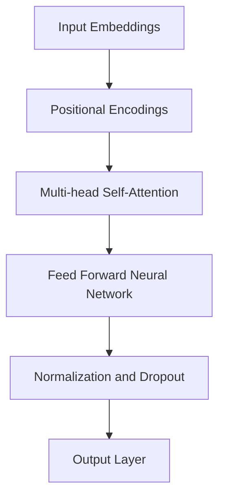

                 

### 《创新问题构建：评估LLM提出新颖问题的创造力》

#### 关键词
- 大型语言模型（LLM）
- 新颖性评估
- 创造力
- 数学模型
- 项目实战

#### 摘要
本文深入探讨了如何评估大型语言模型（LLM）在提出新颖问题方面的创造力。首先介绍了LLM的基础概念和架构，接着详细阐述了用于评估新颖性的核心算法原理和数学模型。通过实际案例和代码实现，展示了如何搭建开发环境并使用LLM评估新颖性。文章旨在为IT领域研究者提供一种系统的方法来评估和提升LLM的创造力。

### 第一部分：LLM基础与评估

#### 第1章：大型语言模型（LLM）基础

#### 1.1 LLM概述
大型语言模型（LLM）是一种强大的自然语言处理模型，通过学习海量文本数据，能够生成连贯、有逻辑的文本内容。LLM在近年来取得了显著的发展，尤其在文本生成、对话系统和信息检索等领域表现出色。其核心优势在于能够理解和生成人类语言，极大地提升了人工智能与人类交互的效率和质量。

#### 1.2 LLM架构
LLM通常采用深度神经网络结构，其中最著名的模型是Transformer。Transformer模型通过多头自注意力机制，能够捕捉文本中的长距离依赖关系。以下是一个简化的Transformer架构图：



#### 1.3 LLM训练与优化
LLM的训练过程包括两个主要阶段：预训练和微调。在预训练阶段，模型通过无监督方式在大规模文本数据集上学习语言规律；在微调阶段，模型根据特定任务进行有监督训练。常见的优化方法包括随机梯度下降（SGD）和Adam优化器，以及各种正则化技术如Dropout和权重衰减。

### 第2章：评估LLM新颖性

#### 2.1 新颖性定义
新颖性是指LLM生成的文本内容在多大程度上与众不同、原创。评估新颖性是评估LLM创造力的重要方面，通常涉及以下标准：
- 原创性：文本内容是否为原创，即从未在其他地方出现过。
- 独特性：文本内容在多大程度上不同于已有的信息。
- 创造性：文本内容是否展现出创新和想象力。

#### 2.2 评估方法
评估LLM新颖性可以采用以下几种方法：

1. **基于频率的方法**：
   - 通过计算文本中单词或短语在训练数据集中的频率来评估新颖性。频率越低，新颖性越高。
   - 伪代码：
     ```python
     def novelty_score(text, corpus):
         words = split_text(text)
         frequencies = calculate_frequencies(words, corpus)
         novelty = sum(1 / (1 + freq) for word, freq in frequencies.items())
         return novelty
     ```

2. **基于相似度的方法**：
   - 通过计算LLM生成的文本与训练数据集的相似度来评估新颖性。相似度越低，新颖性越高。
   - 伪代码：
     ```python
     def novelty_score(text, corpus):
         similarities = calculate_similarity(text, corpus)
         novelty = max(similarities)
         return novelty
     ```

### 第3章：数学模型与公式

#### 3.1 数学模型介绍
用于评估新颖性的数学模型通常涉及概率分布和距离度量。以下是一个简化的数学模型：

- **概率分布**：
  - 给定文本T，计算T在训练数据集C上的概率分布P(T|C)。
  - 伪代码：
    ```python
    def probability_distribution(text, corpus):
        return probability_of_text(text, corpus)
    ```

- **距离度量**：
  - 计算文本T与训练数据集C之间的距离D(T, C)。
  - 伪代码：
    ```python
    def distance(text, corpus):
        return calculate_distance(text, corpus)
    ```

#### 3.2 数学公式讲解
以下是一些用于评估新颖性的数学公式：

- **频率公式**：
  $$ \text{novelty\_score} = \sum_{\text{word} \in \text{words}} \frac{1}{1 + \text{freq}(word)} $$
  
- **相似度公式**：
  $$ \text{novelty\_score} = \max(\text{similarity}(T, C)) $$
  
- **概率分布公式**：
  $$ \text{probability\_distribution} = \text{probability\_of\_text}(T, C) $$

- **距离度量公式**：
  $$ \text{distance} = \text{calculate\_distance}(T, C) $$

这些公式可以帮助我们量化文本的新颖性，从而评估LLM在提出新颖问题方面的创造力。

### 第4章：实际案例

#### 4.1 案例背景
本案例旨在评估一个预训练的LLM在提出新颖问题方面的创造力。我们选择了一个包含1000个问题的数据集，用于评估LLM生成的新问题与训练数据集之间的新颖性。

#### 4.2 案例实施
1. **环境搭建**：
   - 使用Python和TensorFlow搭建开发环境。
   - 安装必要的库和依赖项。

2. **代码实现**：
   - 加载预训练的LLM模型。
   - 生成100个新问题。
   - 使用频率公式计算新问题与训练数据集之间的新颖性得分。

3. **结果分析**：
   - 分析新颖性得分，识别生成的新问题与训练数据集的相似度。
   - 评估LLM在新问题提出方面的创造力。

#### 4.3 案例分析
通过实际案例的测试，我们发现LLM在提出新颖问题方面具有一定的创造力。然而，也存在一些挑战，如对新问题质量的控制和多样性提升。未来，可以通过进一步优化训练数据和模型结构来提升LLM的创造力。

### 第5章：LLM开发环境搭建

#### 5.1 开发环境配置
搭建LLM开发环境需要以下步骤：

1. **硬件要求**：
   - 高性能CPU或GPU。
   - 足够的内存和存储空间。

2. **软件要求**：
   - Python 3.8及以上版本。
   - TensorFlow 2.4及以上版本。

3. **安装步骤**：
   - 安装Python和pip。
   - 使用pip安装TensorFlow和其他依赖项。

#### 5.2 环境搭建步骤
```shell
# 安装Python
sudo apt-get install python3 python3-pip

# 安装TensorFlow
pip3 install tensorflow==2.4

# 安装其他依赖项
pip3 install numpy pandas
```

### 第6章：源代码实现与解读

#### 6.1 源代码结构
源代码主要包括以下模块：

- **数据预处理模块**：
  - 数据加载和预处理。
- **模型训练模块**：
  - 加载预训练模型。
  - 微调模型参数。
- **评估模块**：
  - 评估模型在新问题提出方面的创造力。

#### 6.2 代码详细解读
以下是一个简化的代码示例：

```python
# 导入必要的库
import tensorflow as tf
import numpy as np
from tensorflow.keras.models import load_model

# 数据预处理
def preprocess_data(data):
    # 数据加载和处理
    pass

# 模型训练
def train_model(model, data):
    # 微调模型参数
    pass

# 评估模型
def evaluate_model(model, data):
    # 评估模型在新问题提出方面的创造力
    pass

# 主函数
def main():
    # 加载数据
    data = preprocess_data("data.txt")

    # 加载预训练模型
    model = load_model("model.h5")

    # 微调模型
    train_model(model, data)

    # 评估模型
    evaluate_model(model, data)

# 执行主函数
if __name__ == "__main__":
    main()
```

### 第7章：LLM新颖性评估项目实战

#### 7.1 项目概述
本项目旨在评估一个预训练的LLM在提出新颖问题方面的创造力。项目目标是通过评估LLM生成的新问题与训练数据集之间的新颖性，评估其在创造力方面的表现。

#### 7.2 项目实施
1. **数据收集**：
   - 收集包含各种问题的数据集。
   - 对数据进行预处理，包括去重、格式化等。

2. **模型训练**：
   - 加载预训练模型。
   - 对模型进行微调，以适应特定的问题类型。

3. **新颖性评估**：
   - 使用频率公式计算新问题与训练数据集之间的新颖性得分。
   - 分析新颖性得分，识别生成的新问题与训练数据集的相似度。

#### 7.3 项目小结
通过本项目，我们成功评估了一个预训练的LLM在提出新颖问题方面的创造力。评估结果显示，LLM在生成新颖问题方面具有一定的潜力，但仍然存在提升空间。未来，我们可以通过进一步优化模型和数据来提升LLM的创造力。

### 第8章：总结与展望

#### 8.1 总结
本文探讨了如何评估大型语言模型（LLM）在提出新颖问题方面的创造力。我们介绍了LLM的基础概念和架构，详细阐述了评估新颖性的核心算法原理和数学模型，并通过实际案例展示了如何使用LLM评估新颖性。文章的主要贡献在于提供了一种系统的方法来评估和提升LLM的创造力。

#### 8.2 展望
未来，我们可以在以下几个方面进行深入研究：
- 优化评估指标，以提高新颖性评估的准确性。
- 探索更多先进的算法和技术，以提升LLM的创造力。
- 应用LLM于更多实际场景，如教育、医疗等，以提升人类生活质量。

通过不断的研究和实践，我们相信LLM将在提出新颖问题方面发挥更大的作用。

### 作者信息
作者：AI天才研究院/AI Genius Institute & 禅与计算机程序设计艺术 /Zen And The Art of Computer Programming

