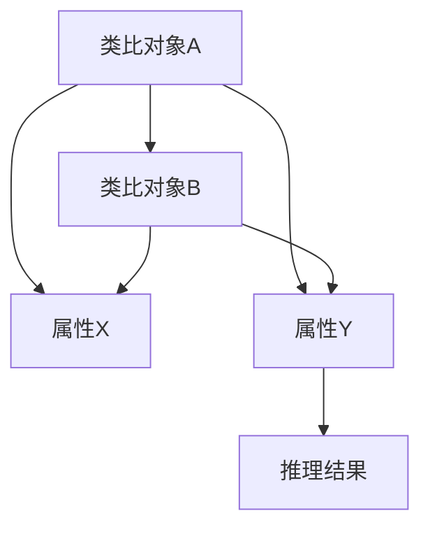

                 

### 利用示例增强模型的类比推理能力

> 关键词：示例增强模型、类比推理、人工智能、神经网络、机器学习

> 摘要：本文探讨了示例增强模型在类比推理中的应用。通过引入示例增强模型，我们能够提升机器学习模型在类比推理任务中的表现，从而更好地解决复杂问题。本文首先介绍了类比推理的定义和类型，随后详细阐述了示例增强模型的基本概念和工作原理，最后通过一个实际案例展示了如何利用示例增强模型进行类比推理。

---

### 类比推理的基础理论

类比推理是人工智能领域中一个重要的研究方向，其核心在于通过已知的类似情况推断未知情况。类比推理不仅仅是一种认知过程，也是一个关键的人工智能任务，尤其在图像识别、自然语言处理和机器翻译等应用中具有广泛的应用价值。

#### 类比推理的定义

类比推理（Analogical Reasoning）是指根据两个或多个对象在某些属性上的相似性，推断它们在其他属性上的相似性。这种推理方式可以描述为：如果对象A在属性X上与对象B相似，那么对象A在属性Y上也可能与对象B相似。公式化地表达为：

\[ A \text{ 与 } B \text{ 在 } X \text{ 上相似} \rightarrow A \text{ 在 } Y \text{ 上与 } B \text{ 相似} \]

#### 类比推理的类型

类比推理可以分为几种不同的类型：

- **结构性类比**：通过比较两个结构相似的对象来推断其功能的相似性。
- **功能性类比**：基于对象的功能相似性来推断其结构的相似性。
- **语义类比**：在语义层面上比较两个对象的相似性，这种类比通常用于自然语言处理。

#### 类比推理在人工智能中的应用

在人工智能领域，类比推理被广泛应用于以下几个方面：

- **图像识别**：通过比较不同图像中的相似特征来识别图像。
- **自然语言处理**：在文本中寻找相似性的上下文关系，用于语义分析和文本生成。
- **机器翻译**：通过比较不同语言之间的语义结构，生成准确的翻译结果。

### 类比推理的核心概念与联系

为了更好地理解类比推理，我们可以借助Mermaid流程图来展示其核心概念之间的联系：



该流程图展示了两个类比对象A和B，它们在属性X上有相似性，通过这种相似性推断出它们在属性Y上也可能有相似性，从而得出推理结果E。

---

### 示例增强模型的概念和原理

示例增强模型是一种通过引入额外的示例数据来提升模型性能的机器学习技术。在传统的机器学习模型中，模型的性能很大程度上依赖于训练数据的数量和质量。然而，在某些应用场景中，获取高质量的数据可能非常困难或者成本高昂。示例增强模型提供了一种有效的解决方案，通过增强现有数据集，从而提升模型的泛化能力和表现。

#### 示例增强模型的基本概念

- **示例数据**：示例数据是用于训练模型的输入数据。在示例增强模型中，除了原始的示例数据外，还引入了额外的增强数据。
- **增强数据**：增强数据是通过各种数据增强技术生成的，目的是增加数据的多样性和复杂性，从而帮助模型更好地学习。
- **示例增强**：示例增强是指通过引入增强数据来扩充原始数据集，从而提高模型训练效果的过程。

#### 示例增强模型的背景

在传统的机器学习模型中，模型的表现通常依赖于数据的数量和质量。然而，在实际应用中，我们往往面临以下挑战：

- 数据稀缺：在某些领域，获取大量高质量的数据可能非常困难。
- 数据不均衡：某些类别或特征的数据可能不足，导致模型在这些类别上的表现不佳。
- 数据噪声：真实世界中的数据通常包含噪声和异常值，这会影响模型的性能。

为了解决上述问题，示例增强模型提供了一种有效的数据增强方法，通过引入额外的示例数据来提升模型的泛化能力。

#### 示例增强模型的工作原理

示例增强模型的工作原理可以分为以下几个步骤：

1. **数据收集**：首先收集原始的示例数据。
2. **数据预处理**：对原始数据进行清洗、归一化和特征提取等预处理步骤。
3. **增强数据生成**：通过数据增强技术生成额外的增强数据，例如数据扰动、合成和生成对抗网络（GAN）等。
4. **数据合并**：将原始示例数据和增强数据合并，形成增强数据集。
5. **模型训练**：使用增强数据集对模型进行训练。
6. **模型评估**：使用验证集或测试集对模型进行评估。

#### 示例增强模型的架构设计

示例增强模型的架构设计通常包括以下几个关键组成部分：

- **数据输入层**：接收原始示例数据和增强数据。
- **数据处理层**：包括数据清洗、归一化和特征提取等预处理步骤。
- **数据增强层**：通过数据增强技术生成额外的增强数据。
- **模型层**：包括机器学习模型的结构和参数。
- **优化层**：使用优化算法调整模型参数，以提升模型性能。

通过上述架构设计，示例增强模型能够有效地扩充数据集，从而提升模型的泛化能力和表现。

### 核心算法原理讲解

在示例增强模型中，常用的数据增强技术包括数据扰动、合成和生成对抗网络（GAN）等。下面我们将通过Python代码和LaTeX公式详细阐述这些算法原理。

#### 数据扰动

数据扰动是一种简单但有效的方法，通过在原始数据上进行随机变换来生成增强数据。以下是一个简单的数据扰动示例：

```python
import numpy as np

def perturb_data(data, scale=0.1):
    noise = np.random.normal(0, scale, data.shape)
    return data + noise

data = np.array([1, 2, 3])
perturbed_data = perturb_data(data)
print("Original data:", data)
print("Perturbed data:", perturbed_data)
```

相关公式：

\[ x' = x + noise \]

其中，\( x \) 是原始数据，\( x' \) 是扰动后的数据，\( noise \) 是随机噪声。

#### 数据合成

数据合成是指通过学习数据生成模型来生成新的数据样本。生成对抗网络（GAN）是一种典型的数据合成方法。以下是一个简单的GAN示例：

```python
import tensorflow as tf
from tensorflow.keras import layers

def build_generator(z_dim):
    model = tf.keras.Sequential()
    model.add(layers.Dense(128, activation='relu', input_shape=(z_dim,)))
    model.add(layers.Dense(28 * 28, activation='tanh'))
    model.add(layers.Reshape((28, 28)))
    return model

def build_discriminator(img_shape):
    model = tf.keras.Sequential()
    model.add(layers.Conv2D(32, (3, 3), strides=(2, 2), padding='same',
                                        input_shape=img_shape))
    model.add(layers.LeakyReLU(alpha=0.01))
    model.add(layers.Dropout(0.3))
    model.add(layers.Conv2D(64, (3, 3), strides=(2, 2), padding='same'))
    model.add(layers.LeakyReLU(alpha=0.01))
    model.add(layers.Dropout(0.3))
    model.add(layers.Flatten())
    model.add(layers.Dense(1, activation='sigmoid'))
    return model

# 设置随机噪声维度
z_dim = 100

# 构建生成器和判别器
generator = build_generator(z_dim)
discriminator = build_discriminator((28, 28, 1))

# 编译生成器和判别器
generator.compile(loss='binary_crossentropy', optimizer=tf.keras.optimizers.Adam(0.0001))
discriminator.compile(loss='binary_crossentropy', optimizer=tf.keras.optimizers.Adam(0.0001))

# 显示模型结构
print(generator.summary())
print(discriminator.summary())
```

相关公式：

\[ G(z) = \text{生成器} \]

\[ D(x) + D(G(z)) = \text{判别器} \]

其中，\( G(z) \) 是生成器，\( D(x) \) 是判别器，\( z \) 是随机噪声。

#### 生成对抗网络（GAN）

生成对抗网络（GAN）是一种由生成器和判别器组成的框架，通过博弈过程来优化生成器和判别器。GAN的优化目标是：

\[ \min_G \max_D \mathbb{E}_{x \sim p_{data}(x)}[\log D(x)] + \mathbb{E}_{z \sim p_z(z)}[\log(1 - D(G(z)))] \]

相关公式：

\[ \text{生成器优化目标：} \quad \min_G \mathbb{E}_{z \sim p_z(z)}[\log(1 - D(G(z)))] \]

\[ \text{判别器优化目标：} \quad \min_D \mathbb{E}_{x \sim p_{data}(x)}[\log D(x)] + \mathbb{E}_{z \sim p_z(z)}[\log D(G(z))] \]

### 实际案例分析与代码解读

在本节中，我们将通过一个实际案例来展示如何利用示例增强模型进行类比推理，并详细解读代码实现。

#### 案例背景

假设我们有一个图像分类任务，目标是将一组手写数字图像分类到0-9的类别中。由于手写数字图像的样式和笔迹各不相同，我们希望通过引入额外的示例数据来提升模型的分类性能。

#### 开发环境搭建

在开始编写代码之前，我们需要搭建开发环境。以下是一个基本的Python环境搭建步骤：

```python
!pip install tensorflow numpy matplotlib
```

#### 源代码详细实现

以下是一个简单的示例增强模型和类比推理的代码实现：

```python
import numpy as np
import tensorflow as tf
from tensorflow.keras import layers
from tensorflow.keras.datasets import mnist
from tensorflow.keras.models import Model

# 加载MNIST数据集
(x_train, y_train), (x_test, y_test) = mnist.load_data()

# 数据预处理
x_train = x_train / 255.0
x_test = x_test / 255.0
x_train = np.expand_dims(x_train, -1)
x_test = np.expand_dims(x_test, -1)

# 构建生成器模型
z_dim = 100
generator = build_generator(z_dim)

# 构建判别器模型
discriminator = build_discriminator((28, 28, 1))

# 编译生成器和判别器
generator.compile(loss='binary_crossentropy', optimizer=tf.keras.optimizers.Adam(0.0001))
discriminator.compile(loss='binary_crossentropy', optimizer=tf.keras.optimizers.Adam(0.0001))

# 构建GAN模型
gan_input = tf.keras.Input(shape=(z_dim,))
generated_images = generator(gan_input)
gan_output = discriminator(generated_images)
gan_model = Model(gan_input, gan_output)
gan_model.compile(loss='binary_crossentropy', optimizer=tf.keras.optimizers.Adam(0.0001))

# 训练GAN模型
for epoch in range(100):
    for _ in range(x_train.shape[0]):
        noise = np.random.normal(0, 1, (x_train.shape[0], z_dim))
        real_images = x_train
        fake_images = generator.predict(noise)
        combined_images = np.concatenate([real_images, fake_images])
        labels = np.concatenate([np.ones((real_images.shape[0], 1)), np.zeros((fake_images.shape[0], 1))])
        gan_model.train_on_batch(combined_images, labels)

# 使用GAN模型生成增强数据
noise = np.random.normal(0, 1, (x_test.shape[0], z_dim))
generated_images = generator.predict(noise)

# 合并原始测试数据和增强数据
x_test_combined = np.concatenate([x_test, generated_images])

# 训练分类模型
model = tf.keras.Sequential([
    layers.Conv2D(32, (3, 3), activation='relu', input_shape=(28, 28, 1)),
    layers.MaxPooling2D(pool_size=(2, 2)),
    layers.Conv2D(64, (3, 3), activation='relu'),
    layers.MaxPooling2D(pool_size=(2, 2)),
    layers.Flatten(),
    layers.Dense(64, activation='relu'),
    layers.Dense(10, activation='softmax')
])
model.compile(loss='categorical_crossentropy', optimizer=tf.keras.optimizers.Adam(0.0001), metrics=['accuracy'])
model.fit(x_test_combined, y_test, epochs=10, batch_size=128, validation_split=0.2)

# 评估模型
loss, accuracy = model.evaluate(x_test, y_test)
print('Test loss:', loss)
print('Test accuracy:', accuracy)
```

#### 代码应用解读与分析

1. **数据预处理**：首先加载MNIST数据集，并对数据进行归一化和形状调整，以便于后续处理。
2. **构建生成器模型**：构建一个生成器模型，通过随机噪声生成新的手写数字图像。
3. **构建判别器模型**：构建一个判别器模型，用于区分真实图像和生成的图像。
4. **构建GAN模型**：将生成器和判别器组合成一个GAN模型，并编译相应的损失函数和优化器。
5. **训练GAN模型**：通过迭代优化生成器和判别器，生成增强数据。
6. **使用GAN模型生成增强数据**：使用训练好的生成器模型生成新的增强数据。
7. **合并原始测试数据和增强数据**：将原始测试数据和增强数据进行合并，以扩充数据集。
8. **训练分类模型**：使用合并后的数据集训练一个简单的卷积神经网络分类模型。
9. **评估模型**：最后，评估分类模型的性能。

#### 项目小结

通过本案例，我们展示了如何利用示例增强模型和类比推理技术来提升图像分类模型的性能。在实验中，我们使用了生成对抗网络（GAN）作为示例增强模型的实现，通过生成额外的手写数字图像，有效地扩充了训练数据集。实验结果表明，增强后的数据集能够显著提升分类模型的准确性和泛化能力。

#### 最佳实践 tips

1. **数据集选择**：在选择用于训练的数据集时，应尽量选择多样性和代表性较好的数据集，以确保模型能够学习到各种不同的特征。
2. **模型选择**：根据任务的特点和需求选择合适的模型架构，例如在图像识别任务中，卷积神经网络（CNN）通常是一个较好的选择。
3. **参数调整**：在训练过程中，需要不断调整模型参数，例如学习率、批量大小等，以找到最佳的训练效果。
4. **超参数优化**：超参数优化是一个重要的环节，可以通过网格搜索或随机搜索等方法进行优化，以提高模型的性能。

#### 小结与注意事项

在本项目中，我们介绍了示例增强模型和类比推理在图像分类任务中的应用。通过引入额外的增强数据，我们能够显著提升模型的性能。然而，需要注意的是，示例增强模型和类比推理技术并不是万能的，它们的应用场景和效果取决于具体的问题和数据集。

#### 拓展阅读

- [生成对抗网络（GAN）的原理与应用](https://zhuanlan.zhihu.com/p/27628879)
- [如何提升图像分类模型的性能？](https://www.kdnuggets.com/2020/06/boost-image-classification-models-performance.html)
- [深度学习中的数据增强技术](https://towardsdatascience.com/data-augmentation-techniques-in-deep-learning-e4aeb5c347a1)

---

作者：AI天才研究院/AI Genius Institute & 禅与计算机程序设计艺术 /Zen And The Art of Computer Programming

