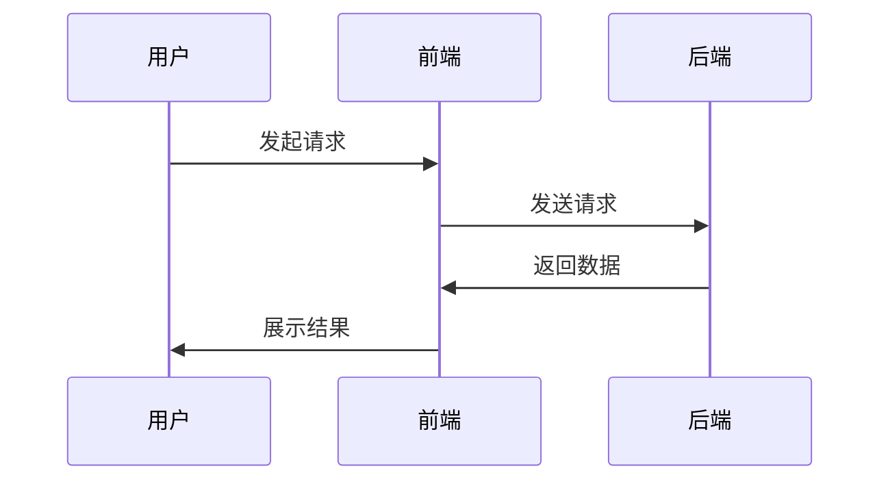

                 

### 前后端分离：提升AI应用开发效率的策略

关键词：前后端分离、AI应用开发、开发效率、微服务架构、算法优化

摘要：本文深入探讨了前后端分离在提升人工智能应用开发效率方面的策略。通过详细阐述前后端分离的原理、核心概念、算法实现和实际应用，本文旨在为开发者提供一套系统、实用的开发指南，帮助他们在AI项目中有效应用前后端分离策略，提升开发效率和项目质量。

### 引言

在现代软件开发中，前后端分离已经成为一种主流的开发模式。这种模式不仅提高了项目的可维护性，还极大地提升了开发效率。尤其在人工智能（AI）应用开发领域，前后端分离的优势尤为突出。AI应用通常涉及复杂的算法和数据模型，通过前后端分离，可以更好地进行模块化开发，提高代码的重用性和项目的可扩展性。

本文将围绕前后端分离这一主题，深入探讨其在AI应用开发中的具体应用。我们将首先介绍前后端分离的基础概念和核心原理，然后通过具体案例和代码实现，展示如何在实际项目中应用这些原理，以提升开发效率。

### 前后端分离的基础概念和核心原理

#### 核心概念

前后端分离主要指的是将应用程序分为前端（用户界面）和后端（业务逻辑和数据管理）两个部分，使得两者独立开发和部署。这种分离不仅简化了开发流程，还提高了系统的可维护性和可扩展性。

- **前端**：负责用户交互和界面展示，通常使用HTML、CSS和JavaScript等前端技术实现。
- **后端**：负责处理业务逻辑、数据存储和服务器端的操作，通常使用各种编程语言和框架来实现。

#### 核心原理

前后端分离的核心原理在于将用户界面和业务逻辑分离，使得开发团队可以并行工作，提高开发效率。以下是前后端分离的一些核心原理：

1. **模块化开发**：通过将应用程序分为前端和后端，每个部分都可以独立开发、测试和部署，提高了开发效率。
2. **可扩展性**：前后端分离使得系统更加灵活，可以根据需求方便地扩展和升级。
3. **代码重用**：前后端分离有助于提高代码的重用率，减少了重复开发的工作量。

#### Mermaid流程图

为了更好地理解前后端分离的架构，我们可以通过Mermaid流程图来展示前端和后端的交互流程：



这个简单的流程图展示了用户请求如何从前端发送到后端，后端处理完毕后再返回给前端，最终在用户界面展示结果。通过这个流程，我们可以清晰地看到前后端分离的核心原理是如何在实际项目中应用的。

### 前后端分离在AI应用开发中的应用

#### 优势

前后端分离在AI应用开发中有许多优势：

1. **模块化开发**：AI应用通常涉及大量的数据处理和算法实现，通过前后端分离，可以将这些功能模块化，使得开发更加高效。
2. **易于维护**：前后端分离使得每个模块都可以独立维护和升级，降低了系统的复杂度。
3. **提高开发效率**：前后端分离允许前端和后端开发团队并行工作，减少了等待时间，提高了整体开发效率。

#### 案例分析

以一个简单的图像识别AI应用为例，我们可以通过前后端分离来优化开发流程：

1. **前端**：负责用户界面的设计和交互，可以使用React、Vue等前端框架快速构建。
   ```javascript
   function loadImage() {
     const image = document.getElementById('image');
     const formData = new FormData();
     formData.append('image', image.files[0]);

     fetch('/api/recognize', {
       method: 'POST',
       body: formData
     })
     .then(response => response.json())
     .then(data => {
       console.log(data);
     });
   }
   ```

2. **后端**：负责图像处理和识别算法的实现，可以使用Flask等后端框架。
   ```python
   from flask import Flask, request, jsonify
   import cv2

   app = Flask(__name__)

   @app.route('/api/recognize', methods=['POST'])
   def recognize_image():
       file = request.files['image']
       image = cv2.imdecode(np.frombuffer(file.read(), dtype=np.uint8), cv2.IMREAD_COLOR)
       # 这里是图像识别的算法实现
       result = "识别结果"
       return jsonify(result)

   if __name__ == '__main__':
       app.run(debug=True)
   ```

通过这个简单的案例，我们可以看到前后端分离是如何在AI应用开发中发挥作用的。前端负责用户交互，后端负责图像处理和算法实现，两者独立开发、测试和部署，大大提高了开发效率。

### 前后端分离的挑战与解决方案

#### 挑战

尽管前后端分离带来了许多优势，但在实际应用中也存在一些挑战：

1. **数据一致性**：前后端分离可能导致数据不一致的问题，需要额外的同步机制。
2. **性能问题**：前后端分离可能引入额外的网络延迟，影响应用性能。
3. **安全性**：前后端分离可能增加安全漏洞的风险，需要加强安全措施。

#### 解决方案

针对上述挑战，我们可以采取以下解决方案：

1. **数据一致性**：使用分布式数据库和消息队列来确保数据一致性。
2. **性能优化**：采用CDN和缓存技术来减少网络延迟，优化应用性能。
3. **安全性**：使用身份验证和授权机制来加强应用的安全性，定期进行安全审计。

### 最佳实践

1. **模块化开发**：将应用程序功能模块化，便于独立开发和维护。
2. **自动化测试**：建立完善的自动化测试体系，确保每个模块的稳定性和可靠性。
3. **持续集成**：采用持续集成和持续部署（CI/CD）流程，提高开发效率和项目质量。

### 项目实战

在本节中，我们将通过一个具体的AI项目来展示如何在实际中应用前后端分离策略。这个项目是一个简单的图像识别应用，前端使用React框架，后端使用Flask框架，数据库使用MySQL。

#### 开发环境搭建

1. **前端**：
   - 安装Node.js和npm。
   - 使用`create-react-app`命令创建React项目。
   - 安装Axios等HTTP客户端库。

2. **后端**：
   - 安装Python和pip。
   - 使用`pip install flask`安装Flask框架。
   - 安装MySQL数据库，并创建数据库和表。

3. **数据库**：
   - 安装MySQL数据库，并创建数据库和表。

#### 源代码实现

1. **前端**：
   ```javascript
   // App.js
   import React, { useState } from 'react';
   import axios from 'axios';

   function App() {
     const [image, setImage] = useState(null);

     const handleSubmit = async (e) => {
       e.preventDefault();
       const formData = new FormData();
       formData.append('image', image);

       try {
         const response = await axios.post('/api/recognize', formData);
         console.log(response.data);
       } catch (error) {
         console.error(error);
       }
     };

     return (
       <div>
         <form onSubmit={handleSubmit}>
           <input type="file" onChange={(e) => setImage(e.target.files[0])} />
           <button type="submit">识别</button>
         </form>
       </div>
     );
   }

   export default App;
   ```

2. **后端**：
   ```python
   # app.py
   from flask import Flask, request, jsonify
   import cv2
   import numpy as np

   app = Flask(__name__)

   @app.route('/api/recognize', methods=['POST'])
   def recognize_image():
       file = request.files['image']
       image = cv2.imdecode(np.frombuffer(file.read(), dtype=np.uint8), cv2.IMREAD_COLOR)
       # 这里是图像识别的算法实现
       result = "识别结果"
       return jsonify(result)

   if __name__ == '__main__':
       app.run(debug=True)
   ```

3. **数据库**：
   - 在MySQL中创建一个名为`image_recognition`的数据库，并创建一个名为`images`的表，字段包括`id`、`image_data`和`result`。

#### 代码解读

在前端代码中，我们使用React和Axios来构建一个简单的表单，用户可以选择图像文件并提交给后端进行识别。后端使用Flask框架接收前端请求，读取图像数据，并通过图像识别算法进行处理，最后将结果返回给前端。

#### 项目小结

通过这个简单的项目，我们可以看到前后端分离如何在实际应用中发挥作用。前端负责用户交互，后端负责图像处理和算法实现，两者独立开发、测试和部署，提高了开发效率。

### 扩展阅读

1. 《深入理解计算机系统》
2. 《Python图像处理实战》
3. 《React.js小书》

### 结论

前后端分离在AI应用开发中具有显著的优势，通过模块化开发、提高开发效率、易于维护等策略，可以显著提升项目质量和开发效率。本文通过详细阐述前后端分离的核心概念、应用案例和实战项目，为开发者提供了一套实用的开发指南。希望本文能为您的AI应用开发带来启发和帮助。作者：AI天才研究院/AI Genius Institute & 禅与计算机程序设计艺术 /Zen And The Art of Computer Programming。

