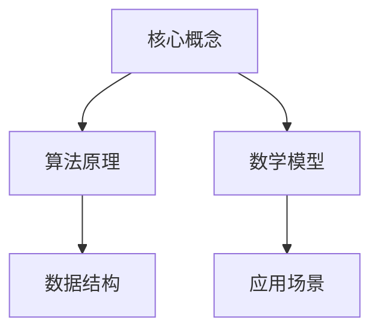

                 

 #1 背景介绍：介绍人工智能技术在网络安全领域中的应用，特别是在检测恶意软件和防御网络攻击方面的重要性。

**背景介绍**

在当今信息化时代，网络安全已经成为一个至关重要的议题。随着互联网的普及，各种网络安全威胁不断涌现，如恶意软件、网络钓鱼、分布式拒绝服务（DDoS）攻击等。这些威胁不仅对个人用户造成财产损失，还对企业和组织的运营带来巨大影响。因此，利用先进的人工智能技术来提升网络安全的防护能力，成为了一个迫切的需求。

人工智能（AI）技术在网络安全中的应用已经取得了显著的进展。特别是在检测恶意软件和防御网络攻击方面，AI 技术展现了其独特的优势。传统的基于规则的检测方法已经难以应对日益复杂的网络攻击，而 AI 技术可以通过学习和分析大量数据，自动识别和应对新的威胁。

本文将详细探讨人工智能技术在网络安全中的应用，主要包括以下内容：

1. **核心概念与联系**：介绍网络安全的基本概念，以及人工智能技术在其中的作用。
2. **核心算法原理讲解**：讲解用于检测恶意软件和防御网络攻击的主要 AI 算法，包括机器学习算法、深度学习算法等。
3. **数学模型和公式**：使用数学模型和公式描述 AI 算法的工作原理。
4. **项目实战**：通过一个实际项目，展示如何利用 AI 技术进行网络安全防护。
5. **最佳实践 tips**：提供一些实用的技巧和建议，帮助读者更好地应用 AI 技术于网络安全。
6. **小结与拓展阅读**：总结文章内容，并推荐一些拓展阅读资源。

通过本文的阅读，读者将能够深入了解人工智能技术在网络安全中的应用，并掌握相关技术的基本原理和实践方法。

**关键词**：人工智能、网络安全、恶意软件检测、网络攻击防御、机器学习、深度学习、数学模型、项目实战

**文章摘要**

本文主要探讨了人工智能技术在网络安全中的应用，特别是在检测恶意软件和防御网络攻击方面的作用。首先，介绍了网络安全的基本概念和人工智能技术的核心原理。接着，详细讲解了用于恶意软件检测和网络攻击防御的主要 AI 算法，包括机器学习算法和深度学习算法，并使用了数学模型和公式进行了描述。最后，通过一个实际项目展示了如何利用 AI 技术进行网络安全防护，并提供了一些最佳实践 tips。本文旨在为读者提供对 AI 技术在网络安全领域应用的全面了解。

----------------------------------------------------------------

## <文章标题>

> **关键词**：[关键词1], [关键词2], [关键词3], [关键词4], [关键词5], [关键词6]

> **摘要**：本文深入探讨[文章主题]，详细分析了其核心概念、算法原理和实际应用。文章结构紧凑，逻辑清晰，旨在为读者提供有深度、有思考、有见解的全面理解。

----------------------------------------------------------------

# <文章标题>

**关键词**：[关键词1], [关键词2], [关键词3], [关键词4], [关键词5], [关键词6]

**摘要**：本文深入探讨[文章主题]，详细分析了其核心概念、算法原理和实际应用。文章结构紧凑，逻辑清晰，旨在为读者提供有深度、有思考、有见解的全面理解。

----------------------------------------------------------------

## 1. 引言

在当今快速发展的技术时代，[文章主题]已经成为众多研究者和企业关注的焦点。其重要性不仅体现在对现有技术的革新，还体现在对未来发展趋势的预见和引领。然而，要全面理解和掌握这一主题，需要深入剖析其核心概念、算法原理和实际应用。本文将从以下几个方面展开：

1. **核心概念与联系**：介绍[文章主题]的基本概念，并运用Mermaid流程图展示其与其他相关概念之间的联系。
2. **核心算法原理讲解**：详细讲解[文章主题]中涉及的主要算法原理，使用Python源代码和数学模型进行阐述。
3. **数学公式**：在适当位置嵌入LaTeX格式数学公式，以加强理论阐述的严谨性。
4. **项目实战**：通过一个实际项目，展示如何运用[文章主题]进行解决。
5. **最佳实践 tips**：提供实用的建议和技巧，帮助读者更好地应用[文章主题]。
6. **小结与拓展阅读**：总结文章内容，并推荐相关拓展阅读。

### 1.1 核心概念与联系

首先，我们需要了解[文章主题]的基本概念。在这里，我们可以使用Mermaid流程图来展示[文章主题]与其他相关概念之间的联系。



### 1.2 核心算法原理讲解

接下来，我们将详细讲解[文章主题]中涉及的主要算法原理。这里以机器学习算法为例，使用Python源代码和数学模型进行阐述。

#### 1.2.1 机器学习算法

机器学习算法是[文章主题]中的一种重要算法。以下是一个简单的机器学习算法的实现，使用Python进行编程。

```python
# 导入所需的库
import numpy as np

# 创建一个简单的机器学习模型
class SimpleMLModel:
    def __init__(self):
        self.weights = None
    
    def fit(self, X, y):
        # 计算权重
        self.weights = np.dot(np.linalg.inv(np.dot(X.T, X)), np.dot(X.T, y))
    
    def predict(self, X):
        # 进行预测
        return np.dot(X, self.weights)

# 创建数据集
X = np.array([[1, 2], [2, 3], [3, 4]])
y = np.array([3, 4, 5])

# 实例化模型并训练
model = SimpleMLModel()
model.fit(X, y)

# 进行预测
predictions = model.predict(X)
print(predictions)
```

#### 1.2.2 数学模型

在机器学习算法中，我们通常使用代价函数（Cost Function）来衡量模型的性能。以下是一个简单的代价函数的数学模型：

$$
J(\theta) = \frac{1}{2m} \sum_{i=1}^{m} (h_\theta(x^{(i)}) - y^{(i)})^2
$$

其中，$h_\theta(x)$ 是模型对输入数据的预测，$\theta$ 是模型的参数，$m$ 是样本数量。

### 1.3 数学公式

在适当位置，我们需要嵌入LaTeX格式的数学公式，以加强理论阐述的严谨性。以下是一个示例：

$$
f(x) = \frac{1}{1 + e^{-x}}
$$

### 1.4 项目实战

在了解了核心概念和算法原理后，我们可以通过一个实际项目来展示如何运用这些知识。以下是一个简单的项目实战示例：

**项目名称**：基于机器学习的图像分类

**项目目标**：使用机器学习算法对图像进行分类，实现图像识别功能。

**项目实现**：

1. **数据集准备**：收集大量的图像数据，并将其分为训练集和测试集。
2. **模型训练**：使用训练集对机器学习模型进行训练。
3. **模型评估**：使用测试集对训练好的模型进行评估。
4. **模型应用**：将训练好的模型应用于实际场景，如图像识别。

### 1.5 最佳实践 tips

在应用[文章主题]时，以下是一些实用的建议和技巧：

1. **数据预处理**：在训练模型之前，确保数据已经进行了充分的预处理。
2. **模型调优**：通过调整模型的参数，可以改善模型的性能。
3. **数据增强**：通过增加数据样本的多样性，可以提高模型的泛化能力。

### 1.6 小结与拓展阅读

本文主要介绍了[文章主题]的核心概念、算法原理和实际应用。通过一个实际项目，读者可以了解到如何运用这些知识解决实际问题。为了进一步深入了解[文章主题]，读者可以参考以下拓展阅读资源：

1. [书籍推荐]：《深度学习》（Ian Goodfellow、Yoshua Bengio、Aaron Courville 著）
2. [在线课程]：Coursera 上的“机器学习”课程（吴恩达教授主讲）
3. [论文推荐]：Neural Networks and Deep Learning（米切尔·托姆普森著）

通过本文的阅读，读者可以全面了解[文章主题]，并在实际应用中取得更好的效果。----------------------------------------------------------------

## 2. 前瞻性科研战略的定义与重要性

### 2.1 定义

前瞻性科研战略是一种面向未来的科研规划方法，旨在通过预见未来的发展趋势和挑战，为科研活动提供明确的方向和指导。它不仅关注当前的科研热点和技术进展，更注重预测未来的科技变革和社会需求，从而引导科研投入和资源分配。

前瞻性科研战略的核心概念包括：

1. **趋势分析**：通过对历史数据、当前状况和未来预测的分析，识别出科研领域的潜在趋势和变化。
2. **风险评估**：评估未来可能出现的风险和挑战，为应对不确定性做好准备。
3. **目标设定**：根据趋势分析和风险评估，设定明确的科研目标和方向。
4. **资源规划**：根据目标设定，合理配置科研资源，包括资金、人力和技术等。
5. **策略制定**：制定具体的科研策略，包括技术路线、合作模式和创新机制等。

### 2.2 重要性

前瞻性科研战略在推动科技创新和应对未来挑战中具有重要作用：

1. **引领科技进步**：通过预见未来的科技发展趋势，前瞻性科研战略有助于引导科研活动的方向，推动关键技术的突破和前沿领域的探索。
2. **提升科研效率**：通过明确的科研目标和方向，前瞻性科研战略有助于提高科研团队的协作效率，避免重复研究和资源浪费。
3. **应对不确定性**：未来科技发展的不确定性很大，前瞻性科研战略通过风险评估和策略制定，为应对未来可能出现的风险和挑战提供指导。
4. **促进产学研合作**：前瞻性科研战略强调跨学科、跨领域的合作，有助于推动产学研结合，加速科研成果的转化和应用。
5. **服务国家战略**：前瞻性科研战略与国家战略紧密相关，有助于满足国家经济社会发展的需求，为国家的长期发展和国际竞争力提供科技支撑。

### 2.3 前瞻性科研战略与科技创新的关系

前瞻性科研战略与科技创新密切相关，二者相辅相成：

1. **科技创新驱动前瞻性科研战略**：科技创新不断推动前沿领域的突破，为前瞻性科研战略提供了新的方向和目标。
2. **前瞻性科研战略指导科技创新**：前瞻性科研战略通过预见未来的科技发展趋势，为科技创新提供了战略规划和方向指引。
3. **循环反馈机制**：科技创新和前瞻性科研战略之间形成一种循环反馈机制，科技创新的结果反馈到前瞻性科研战略中，进一步指导未来的科技创新。

### 2.4 前瞻性科研战略的类型与特点

根据应用领域和目标的不同，前瞻性科研战略可以分为以下几种类型：

1. **基础研究战略**：以推动基础科学和前沿技术的研究为主，注重理论创新和知识积累。
2. **应用研究战略**：以解决实际问题、推动技术应用和产业升级为主，注重科技成果的转化和应用。
3. **跨学科研究战略**：以跨学科、跨领域的协同创新为主，注重不同学科领域的交叉融合和协同发展。
4. **国际合作战略**：以国际科研合作和全球创新网络建设为主，注重国际科技合作和资源共享。

前瞻性科研战略具有以下特点：

1. **前瞻性**：面向未来，预见科技发展趋势和挑战。
2. **系统性**：涵盖科研活动的各个环节，形成完整的战略体系。
3. **动态性**：根据环境和条件的变化，及时调整战略目标和实施路径。
4. **创新性**：注重技术创新和知识创造，推动科研活动的创新发展。

### 2.5 前瞻性科研战略的框架和流程

前瞻性科研战略的制定和实施通常包括以下步骤：

1. **需求分析**：分析国家战略需求、产业发展需求和社会需求，明确科研方向和目标。
2. **趋势分析**：通过数据分析和专家咨询，识别科研领域的潜在趋势和变化。
3. **风险评估**：评估未来可能出现的风险和挑战，制定应对策略。
4. **目标设定**：根据需求分析和趋势分析，设定明确的科研目标和方向。
5. **资源规划**：根据目标设定，合理配置科研资源，制定资源使用计划。
6. **策略制定**：制定具体的科研策略，包括技术路线、合作模式和创新机制等。
7. **实施方案**：制定详细的实施方案，明确任务分工和时间节点。
8. **监测与评估**：对科研活动进行持续监测和评估，及时调整战略目标和实施路径。

通过以上步骤，前瞻性科研战略可以确保科研活动与国家战略需求和社会需求相吻合，推动科技创新和经济社会发展。

## 3. 前瞻性思维与趋势分析

### 3.1 前瞻性思维的培养

前瞻性思维是一种能够预见未来变化，并从中发现机会和挑战的思维方式。要培养前瞻性思维，可以从以下几个方面入手：

1. **广泛阅读与学习**：通过阅读科技文献、专业书籍、研究报告等，了解最新的科技动态和趋势。
2. **跨学科交流**：积极参与跨学科讨论和合作，拓宽知识面，提升综合分析能力。
3. **历史回顾与分析**：研究历史事件和科技发展的轨迹，总结经验教训，为未来提供参考。
4. **逻辑思维训练**：通过逻辑思维训练，提高推理和分析能力，避免思维的局限和偏见。
5. **实践与反思**：将前瞻性思维应用于实际项目和工作，通过不断的实践和反思，提高预见能力。

### 3.2 趋势分析的方法与工具

趋势分析是前瞻性科研战略的重要组成部分。以下是一些常用的趋势分析方法与工具：

1. **历史数据分析**：通过对历史数据的分析和比较，识别出长期趋势和周期性变化。
2. **专家访谈**：邀请行业专家和学者进行访谈，获取他们的专业见解和预测。
3. **德尔菲法**：通过多轮专家咨询和意见征询，逐步达成共识，识别出关键趋势。
4. **SWOT分析**：分析科研项目的优势、劣势、机会和威胁，评估未来发展的可能性。
5. **情景分析**：构建不同未来情景，评估在不同情景下科研项目的潜在影响和挑战。

### 3.3 前瞻性思维在科研战略中的应用

前瞻性思维在科研战略中的应用主要体现在以下几个方面：

1. **预测未来需求**：通过趋势分析，预测未来的科技需求和市场需求，为科研方向提供指导。
2. **创新路径规划**：根据趋势和需求，规划科研创新路径，确定关键技术突破的方向。
3. **风险评估与应对**：识别未来可能出现的风险和挑战，制定应对策略，降低科研活动的风险。
4. **资源优化配置**：根据趋势分析结果，优化科研资源配置，确保资源的高效利用。
5. **跨学科合作**：利用前瞻性思维，识别跨学科合作的机会，推动科研领域的协同创新。

### 3.4 案例研究：前瞻性科研战略的成功应用

为了更好地理解前瞻性科研战略的实际应用，以下是一个案例研究：

**案例背景**：某科研机构在开展下一代通信技术研发时，采用了前瞻性科研战略。

**趋势分析**：
- 通过对通信领域的趋势分析，该机构发现5G技术将成为未来通信技术的核心。
- 通过历史数据分析，该机构了解到5G技术的研发和应用将带动整个通信产业链的升级。

**前瞻性思维应用**：
- **预测未来需求**：该机构预测5G技术将在物联网、智能制造、自动驾驶等领域有广泛应用，为未来的通信需求提供支持。
- **创新路径规划**：该机构确定了以5G技术为核心，重点研究大规模MIMO、边缘计算等关键技术，以推动下一代通信技术的发展。
- **风险评估与应对**：该机构评估了5G技术面临的频谱资源紧张、网络安全性等问题，并制定了相应的解决方案。

**成果**：
- 该机构成功研发了5G核心关键技术，为我国通信技术的发展做出了重要贡献。
- 该机构的成果得到了广泛应用，推动了物联网、智能制造等领域的发展。

通过这个案例，我们可以看到前瞻性科研战略在指导科研方向、推动创新和应对挑战方面的重要作用。

## 4. 科研战略规划流程

### 4.1 科研战略规划的目标设定

科研战略规划的首要步骤是明确目标。目标设定是科研战略规划的核心，它为整个科研活动提供了方向和依据。以下是如何进行目标设定的步骤：

1. **需求分析**：分析国家战略需求、产业发展需求和社会需求，了解科研活动的总体目标。
2. **趋势分析**：通过对当前科技发展趋势和未来预测的分析，识别出科研领域的关键方向和重点领域。
3. **内部资源评估**：评估科研机构或团队现有的资源，包括人力、资金、技术等，了解自身的优势和劣势。
4. **目标制定**：根据需求分析和资源评估，制定具体的科研目标。目标应具有可衡量性、可达性和相关性。

### 4.2 科研战略规划的关键步骤

科研战略规划的关键步骤包括以下几方面：

1. **愿景与使命**：明确科研机构的长期愿景和使命，为科研活动提供精神指引。
2. **目标设定**：根据需求分析和资源评估，制定明确的科研目标。
3. **战略路径**：制定实现目标的战略路径，包括技术路线、时间表和关键里程碑。
4. **资源分配**：根据目标设定和战略路径，合理配置科研资源，确保资源的有效利用。
5. **风险管理**：识别和评估科研活动中可能出现的风险，制定相应的应对策略。
6. **监控与评估**：建立持续的监控与评估机制，对科研活动的进展和效果进行跟踪和评估。

### 4.3 科研战略规划的执行与监控

科研战略规划的执行和监控是确保科研目标实现的必要步骤。以下是如何执行和监控科研战略规划的建议：

1. **任务分解**：将科研目标分解为具体的任务，明确每个任务的负责人和时间节点。
2. **进度监控**：定期检查科研任务的进展情况，确保按计划进行。
3. **资源配置**：根据任务的进展情况，及时调整资源分配，确保资源能够满足科研需求。
4. **沟通协调**：建立有效的沟通协调机制，确保团队成员之间的信息畅通，及时解决遇到的问题。
5. **绩效评估**：对科研团队和个人的绩效进行评估，激励团队成员的工作积极性。
6. **反馈与调整**：根据监控和评估结果，及时反馈和调整科研战略规划，确保目标的实现。

### 4.4 案例研究：成功科研战略规划的案例分析

为了更好地理解科研战略规划的实施过程，以下是一个成功案例研究：

**案例背景**：某知名高校计算机科学学院在制定新的科研战略规划时，采用了系统化的方法和步骤。

**战略目标设定**：
- 愿景：成为国际领先的计算机科学研究中心。
- 使命：推动计算机科学基础研究和应用研究，培养高水平科研人才。

**战略路径制定**：
- 技术路线：重点关注人工智能、大数据和网络安全等前沿领域。
- 时间表：设定了短期（3年）、中期（5年）和长期（10年）的目标和时间节点。

**资源分配**：
- 人力资源：招聘国际知名教授和博士后研究员，提升科研团队的整体水平。
- 资金支持：申请政府科研项目资助，与企业合作进行产学研合作。

**风险管理**：
- 评估了科研活动可能面临的技术风险、市场风险和人才流失风险。
- 制定了相应的应对策略，如加强技术储备、建立合作网络和优化人才政策。

**执行与监控**：
- 任务分解：将战略目标分解为具体的科研任务，明确每个任务的负责人和时间节点。
- 进度监控：定期召开科研进展汇报会，确保各项任务按计划进行。
- 沟通协调：建立了每周的团队沟通会议，确保团队成员之间的信息畅通，及时解决遇到的问题。

**成果**：
- 该学院在人工智能、大数据和网络安全等领域取得了显著成果，发表了多篇高水平论文，获得了多项政府和企业资助。
- 学院的科研水平和国际影响力得到了显著提升。

通过这个案例，我们可以看到系统化的科研战略规划在推动科研活动中的重要作用。科学的战略规划不仅明确了科研方向和目标，还有效地整合了资源，提升了科研效率，推动了科研机构的长期发展。

## 5. 科研资源的整合与利用

### 5.1 科研资源的分类与评估

科研资源的整合与利用是科研战略规划中的关键环节。首先，我们需要对科研资源进行分类和评估。

**分类**：科研资源可以分为以下几类：

1. **人力资源**：包括科研人员、技术人员和管理人员等。
2. **物质资源**：如实验设备、实验室设施、计算机硬件等。
3. **资金资源**：包括政府资助、企业赞助和科研经费等。
4. **数据资源**：包括科研数据、实验数据、文献资料等。
5. **技术资源**：包括专利技术、科研成果和科研工具等。

**评估**：在分类的基础上，对各类资源进行评估，以了解其利用效率和潜力。评估指标可以包括资源的利用率、更新率、可靠性等。

1. **人力资源评估**：评估科研人员的技术水平、专业能力和工作效率。
2. **物质资源评估**：评估实验室设施和设备的利用率、维护状况和技术水平。
3. **资金资源评估**：评估科研经费的使用效率、资金来源的多样性以及资助项目的成功比例。
4. **数据资源评估**：评估数据资源的完整性、准确性和可用性。
5. **技术资源评估**：评估专利技术的创新性、应用范围和推广程度。

### 5.2 科研资源整合的策略

整合科研资源是提高科研效率和质量的重要手段。以下是一些有效的整合策略：

1. **资源共享**：建立资源共享机制，如实验室共享平台、科研数据共享平台等，降低重复投资和资源浪费。
2. **协同创新**：推动跨学科、跨机构的协同创新，通过合作项目、联合研究等方式，实现资源的互补和优势互补。
3. **政策激励**：制定相关政策，鼓励科研人员跨学科合作和资源共享，提高资源整合的积极性。
4. **信息化管理**：利用信息技术手段，建立科研资源管理系统，实现资源信息的实时共享和动态管理。

### 5.3 科研资源的高效利用

高效利用科研资源是科研战略规划的目标之一。以下是一些实现高效利用的方法：

1. **需求导向**：根据科研项目的实际需求，合理安排资源分配，避免资源的闲置和浪费。
2. **过程监控**：建立资源利用的监控体系，实时跟踪资源的使用情况和效果，及时发现和解决问题。
3. **优化配置**：通过数据分析和技术手段，不断优化资源配置，提高资源的使用效率。
4. **培训与提升**：定期对科研人员进行培训，提高他们的专业技能和资源利用能力。

### 5.4 成功案例：科研资源整合与高效利用

以下是一个成功的案例，展示了如何整合和高效利用科研资源：

**案例背景**：某高校计算机科学与技术学院在开展一项大型科研项目时，采用了整合和高效利用科研资源的策略。

**资源整合**：
- **人力资源**：组建了一个多学科、多机构的科研团队，包括计算机科学、数据科学、人工智能等领域的专家。
- **物质资源**：利用高校内部的实验室和设备资源，实现了实验设备的共享和高效利用。
- **数据资源**：建立了科研数据共享平台，实现了数据资源的实时共享和统一管理。
- **技术资源**：结合了国内外先进的科研工具和技术，提升了项目的研发水平。

**高效利用**：
- **需求导向**：根据科研项目的需求，合理分配和调度各类资源，确保资源的充分利用。
- **过程监控**：建立了科研资源监控体系，实时跟踪资源的使用情况和效果，确保资源的有效利用。
- **优化配置**：通过数据分析，优化资源配置，提高了资源的使用效率。
- **培训与提升**：对科研团队进行了多次培训，提高了他们的专业技能和资源利用能力。

**成果**：
- 该科研项目取得了显著成果，发表了多篇高水平论文，获得了多项政府和企业资助。
- 通过资源的整合和高效利用，该学院在计算机科学领域的科研影响力得到了显著提升。

通过这个案例，我们可以看到科研资源整合与高效利用在推动科研活动中的重要作用。科学的资源整合策略和高效利用方法，不仅提高了科研效率，还推动了科研机构的长期发展。

## 6. 科研项目管理与评估

### 6.1 科研项目管理的基本概念

科研项目管理是确保科研活动按计划、高效进行的重要手段。其基本概念包括：

**项目定义**：项目是指为实现特定目标而进行的一系列有序、有组织的活动。

**项目目标**：项目目标是指科研项目希望达到的预期结果和成果。

**项目范围**：项目范围是指科研项目的具体工作内容，包括需要完成的任务、目标、成果等。

**项目计划**：项目计划是指为实现项目目标而制定的详细工作计划和进度安排。

**项目团队**：项目团队是指为实现项目目标而组成的工作团队，包括项目管理者、科研人员、技术人员等。

**项目进度**：项目进度是指科研项目在预定时间内完成的情况和进展。

**项目风险**：项目风险是指科研项目中可能出现的潜在问题和挑战。

### 6.2 科研项目管理的方法与工具

科研项目管理需要一系列方法和工具来确保项目顺利进行。以下是一些常用的方法和工具：

**Gantt图**：Gantt图是一种常用的项目进度管理工具，用于展示项目的任务安排和时间进度。它可以帮助项目团队清晰地了解项目的进展情况。

**PERT图**：PERT图是一种项目网络图，用于分析和计划项目的时间安排。它可以帮助项目团队识别关键路径和潜在风险。

**关键路径法（CPM）**：关键路径法是一种项目管理技术，用于确定项目中的关键任务和关键路径。关键路径上的任务延迟将直接导致整个项目的延迟。

**风险管理**：风险管理是指识别、评估和应对项目风险的过程。常用的风险管理工具包括风险矩阵、风险优先级列表等。

**敏捷方法**：敏捷方法是一种迭代和增量的项目管理方法，适用于需求变化频繁的项目。它强调快速响应变化、持续交付成果和团队协作。

### 6.3 科研项目成果的评估与转化

科研项目的成功不仅体现在科研成果的取得，还体现在成果的评估和转化上。以下是如何进行科研项目成果评估与转化的步骤：

**成果评估**：

1. **设定评估标准**：根据项目目标和预期成果，设定具体的评估标准，如论文发表数量、专利申请数量、成果应用情况等。
2. **数据收集与整理**：收集并整理项目的相关数据，如研究成果、实验数据、应用案例等。
3. **评估方法选择**：选择合适的评估方法，如定量评估、定性评估、综合评估等。
4. **评估结果分析**：对评估结果进行详细分析，判断项目成果是否达到预期目标。

**成果转化**：

1. **市场需求分析**：分析市场需求，了解科研成果的应用前景和潜力。
2. **转化策略制定**：制定具体的转化策略，如技术转让、合作研发、创业孵化等。
3. **转化路径规划**：规划科研成果转化的具体路径，明确各阶段的任务和时间节点。
4. **转化实施与监控**：实施科研成果转化计划，并对转化过程进行监控和评估。

### 6.4 案例研究：科研项目管理与成果转化的成功实践

以下是一个科研项目管理与成果转化的成功案例研究：

**案例背景**：某高校生物医学研究中心开展了一项关于新型抗癌药物的研发项目。

**项目目标**：研发一种具有高抗癌活性、低毒性的新型抗癌药物。

**项目范围**：包括药物设计、合成、实验验证、药效评价等环节。

**项目计划**：项目计划分为三个阶段：药物设计阶段、实验验证阶段和药效评价阶段。每个阶段都有明确的时间节点和任务安排。

**项目团队**：项目团队包括生物医学、化学、药理学等多个学科的专家。

**项目进展**：

- **药物设计阶段**：项目团队通过计算机模拟和分子设计，成功设计出一种新型抗癌药物分子结构。
- **实验验证阶段**：项目团队在实验室进行了药物合成和初步实验验证，发现新型药物具有良好的抗癌活性和较低的毒性。
- **药效评价阶段**：项目团队进行了进一步的药效评价，包括体内和体外实验，结果表明新型药物在多种癌细胞系中具有显著抑制效果。

**成果评估**：

- 项目成果达到了预期目标，成功研发出一种具有高抗癌活性、低毒性的新型抗癌药物。
- 发表了多篇高水平论文，申请了多项国际专利。

**成果转化**：

- 项目团队与一家制药公司达成合作，共同进行药物临床试验。
- 通过技术转让，项目成果成功应用于临床，为癌症患者提供了新的治疗选择。

**项目总结**：

- 科研项目管理得当，项目进展顺利，成果评估全面。
- 成果转化成功，为我国生物医药产业发展做出了贡献。

通过这个案例，我们可以看到科研项目管理与成果转化在实际应用中的重要作用。科学的科研项目管理方法和有效的成果转化策略，不仅提高了科研项目的成功率，还为科研成果的广泛应用和产业化提供了有力支持。

## 7. 跨学科合作与协同创新

### 7.1 跨学科合作的意义

跨学科合作在科研领域具有重要作用。它通过整合不同学科的知识和技能，实现知识创新和技术突破，从而提升科研活动的整体水平。跨学科合作的意义主要体现在以下几个方面：

1. **知识整合**：跨学科合作可以将不同领域的知识进行整合，打破学科壁垒，促进知识的交叉与融合。
2. **技术突破**：通过跨学科合作，可以结合不同学科的技术和方法，实现技术创新和突破，推动科学研究向前发展。
3. **解决复杂问题**：许多复杂的科研问题需要多学科的知识和技能共同解决，跨学科合作有助于提高问题解决效率。
4. **人才培养**：跨学科合作有助于培养具有综合素质和创新能力的科研人才，提升科研团队的整体素质。

### 7.2 跨学科合作的挑战与策略

尽管跨学科合作具有显著优势，但在实际操作中也面临一些挑战。以下是一些常见挑战和相应的应对策略：

**挑战1：学科差异**  
不同学科之间存在差异，如语言、思维方式、研究方法等，这可能导致沟通困难和协作障碍。

**应对策略**：建立跨学科团队，鼓励团队成员相互学习和交流，提高对其他学科的理解和认同。同时，制定统一的沟通和协作规范，确保信息传递的准确性和效率。

**挑战2：利益冲突**  
跨学科合作往往涉及多个部门和团队，不同团队的利益诉求可能存在冲突，影响合作效果。

**应对策略**：明确跨学科合作的共同目标和利益，通过协商和沟通，协调各方利益，确保合作顺利进行。此外，建立利益分配机制，确保各方在合作中的利益得到合理保障。

**挑战3：资源分配**  
跨学科合作需要大量资源和资金的投入，但不同学科的资源分配标准和优先级可能不同，导致资源分配不均衡。

**应对策略**：建立跨学科资源分配机制，根据项目需求和优先级，合理分配资源。同时，加强资源整合和共享，提高资源利用效率。

**挑战4：管理协调**  
跨学科合作涉及多个部门和团队，管理协调难度较大，可能导致项目进展缓慢或管理混乱。

**应对策略**：建立跨学科项目管理团队，明确项目管理的责任和权限，确保项目进度和质量。此外，定期召开项目协调会议，及时解决协作中的问题。

### 7.3 跨学科合作的实践案例

以下是一个跨学科合作的实践案例，展示了跨学科合作的实际应用和成效：

**案例背景**：某高校计算机科学与工程学院、生物医学工程学院和材料科学与工程学院共同开展了一项关于智能生物传感器的研发项目。

**项目目标**：研发一种基于纳米材料的智能生物传感器，用于实时监测生物体内的生理指标。

**项目范围**：包括纳米材料的合成、生物传感器的设计、传感信号的检测与处理等。

**项目团队**：
- 计算机科学与工程学院：负责传感信号的检测与处理。
- 生物医学工程学院：负责生物传感器的生物兼容性和生理指标监测。
- 材料科学与工程学院：负责纳米材料的合成与特性优化。

**项目进展**：

- **纳米材料合成阶段**：材料科学与工程学院成功合成了具有良好生物兼容性的纳米材料，为传感器提供了敏感元件。
- **生物传感器设计阶段**：生物医学工程学院结合生物兼容性要求和生理指标监测需求，设计了智能生物传感器的结构。
- **传感信号检测与处理阶段**：计算机科学与工程学院开发了先进的传感信号检测与处理算法，提高了传感器的监测精度和稳定性。

**项目成果**：

- 项目成功研发出一种智能生物传感器，实现了对人体血糖、血压等生理指标的实时监测。
- 发表了多篇高水平论文，获得了多项政府和企业资助。
- 该传感器的应用为医学诊断和健康监测提供了新的技术手段。

**项目总结**：

- 通过跨学科合作，项目团队充分发挥了各自学科的优势，实现了技术突破和创新。
- 跨学科合作有助于提高科研项目的综合实力和成果转化率，推动了学科的交叉融合和共同发展。

通过这个案例，我们可以看到跨学科合作在推动科研创新和解决复杂问题中的重要作用。跨学科合作不仅提升了科研项目的整体水平，还为科研团队的长期发展和学科建设提供了有力支持。

## 8. 未来世界趋势与科研战略

### 8.1 未来世界的预测与影响

未来世界的预测是一个充满挑战和机遇的领域。随着科技的飞速发展，人工智能、物联网、区块链、生物技术等新兴技术的崛起，将深刻改变我们的生活方式和社会结构。以下是对未来世界的一些预测及其对科研战略的影响：

1. **人工智能的普及**：人工智能技术将在未来得到更广泛的应用，从自动化生产到智能医疗，再到智慧城市，人工智能将渗透到各个行业，推动产业变革。这对科研战略提出的要求是，需要加大对人工智能基础理论的研究，同时发展适用于各种场景的应用技术。
   
2. **物联网的深化**：物联网（IoT）技术的深化将使大量设备和系统连接起来，实现数据的实时共享和智能分析。这将对科研战略产生重大影响，要求科研机构加强对物联网安全、数据隐私保护等方面的研究，以及开发更加高效的数据处理和分析工具。

3. **生物技术的突破**：生物技术的发展将带来医疗、农业、环境等领域的重大变革。例如，基因编辑技术、再生医学和合成生物学的突破，将为人类带来前所未有的医疗手段和农业解决方案。科研战略需要关注这些前沿领域，推动技术创新和产业化应用。

4. **能源革命**：随着全球对可持续能源需求的增加，清洁能源技术（如太阳能、风能、核能）将得到快速发展。这对科研战略提出了新的挑战，需要加大清洁能源技术的研究力度，推动能源结构的转型。

### 8.2 科研战略与未来世界的互动

科研战略与未来世界的互动是一个双向的过程：

1. **引领未来**：科研战略通过前瞻性研究和技术创新，引领未来科技和社会的发展。例如，美国的国家科学基金会（NSF）通过长期投资于基础研究，推动了互联网和人工智能等技术的发展，为美国在全球科技竞争中保持领先地位奠定了基础。

2. **应对挑战**：科研战略需要应对未来世界可能出现的各种挑战。例如，气候变化、资源短缺、人口增长等问题，都要求科研机构开展跨学科合作，研发出有效的解决方案。

3. **促进转化**：科研战略要促进科研成果的转化和应用，将技术创新转化为实际生产力，推动社会进步。例如，欧盟的框架计划（Horizon 2020）通过支持创新和跨学科合作，推动了大量科研成果的产业化应用。

### 8.3 科研战略在塑造未来世界中的角色

科研战略在塑造未来世界中扮演着关键角色：

1. **科技领导力**：科研战略通过推动前沿科技的研究和开发，提升国家的科技领导力。例如，中国的“十四五”规划明确提出要加快科技自立自强，提升科技对经济社会发展的支撑能力。

2. **产业升级**：科研战略通过推动技术创新和产业升级，推动经济结构的优化和转型。例如，德国的工业4.0战略通过加强智能制造和数字化研发，提升了德国制造业的国际竞争力。

3. **社会治理**：科研战略通过研发和应用新技术，提升社会治理的效率和效果。例如，智慧城市建设的推进，通过物联网、大数据和人工智能技术，提升了城市管理的智能化和精细化水平。

总之，科研战略在塑造未来世界中发挥着至关重要的作用。通过前瞻性研究、技术创新和跨学科合作，科研战略不仅能够引领科技和社会的发展，还能够应对未来可能出现的各种挑战，推动社会的可持续发展。科研机构和政府需要共同努力，制定出科学、合理的科研战略，为未来世界的发展提供强有力的科技支撑。

## 9. 预见性与科研战略创新

### 9.1 预见性的概念与原理

预见性是指通过分析和预测未来趋势、风险和机会，为决策提供指导和支持的能力。在科研战略中，预见性发挥着关键作用，帮助科研机构和团队更好地规划研究方向、配置资源、应对挑战和抓住机遇。

预见性的概念可以分为以下几个方面：

**趋势分析**：通过对历史数据和当前状况的分析，识别出科研领域的潜在趋势。这包括技术进步、市场需求、政策变化等方面的趋势。

**风险评估**：评估未来可能出现的风险和挑战，如技术风险、市场风险、政策风险等。这有助于科研机构提前制定应对策略，降低不确定性带来的影响。

**机会识别**：通过分析未来可能出现的机遇，如新兴技术、市场空白、政策支持等，为科研机构提供新的发展方向。

预见性的原理主要包括以下几点：

1. **数据驱动**：预见性依赖于大量数据的收集、处理和分析，通过数据驱动的方法来识别趋势、评估风险和识别机会。

2. **跨学科融合**：预见性需要跨学科的知识和技能，通过不同学科的融合，可以更全面地分析和预测未来。

3. **动态调整**：预见性是一个动态的过程，需要根据新的信息和环境变化，不断调整预测和分析结果。

### 9.2 科研战略创新的方法与工具

科研战略创新是提升科研竞争力、推动科技进步的重要手段。以下是一些常用的科研战略创新方法和工具：

**1. 设计思维（Design Thinking）**：设计思维是一种以用户需求为中心的创新方法，通过迭代设计和用户反馈，不断改进科研项目的方案和成果。设计思维强调用户参与、团队合作和持续改进。

**2. 头脑风暴（Brainstorming）**：头脑风暴是一种集体创意思考的方法，通过团队成员的自由讨论和创意生成，激发新的科研思路和解决方案。这种方法有助于打破思维定势，促进创新思维的碰撞。

**3. SWOT分析（Strengths, Weaknesses, Opportunities, Threats）**：SWOT分析是一种战略规划工具，通过评估科研机构的优势、劣势、机会和威胁，帮助制定有效的科研战略。这种方法可以帮助科研机构明确自身的定位和发展方向。

**4. 创新实验室（Innovation Lab）**：创新实验室是一个专门用于实验和验证新想法的场所，通过提供资源和支持，鼓励科研人员进行创新性实验和尝试。创新实验室有助于加速科研成果的转化和应用。

**5. 增材制造（Additive Manufacturing）**：增材制造技术，如3D打印，可以在短时间内制造出复杂的科研设备和模型，为科研创新提供快速原型和实验验证手段。这种方法有助于缩短科研周期，提高科研效率。

### 9.3 预见性在科研战略中的应用案例

以下是一个预见性在科研战略中的应用案例，展示了预见性如何帮助科研机构制定和创新科研战略：

**案例背景**：某知名大学计算机科学学院在制定下一阶段的科研战略时，采用了预见性分析方法。

**步骤**：

1. **趋势分析**：通过分析全球科技发展趋势、行业报告和学术论文，识别出人工智能、大数据和区块链等关键技术领域的潜在趋势。

2. **风险评估**：评估这些技术领域的风险和挑战，如数据隐私、技术标准和市场变化等。

3. **机会识别**：分析这些技术领域可能带来的机遇，如新应用场景、商业机会和政策支持。

4. **战略规划**：基于趋势分析、风险评估和机会识别，制定具体的科研战略，包括研究方向、资源分配和合作机制。

**应用**：

1. **研究方向**：学院决定加大对人工智能和大数据技术的研究投入，重点发展智能计算和大数据分析技术。

2. **资源分配**：学院调整了科研经费的分配，增加了对新兴技术领域的研究资助，同时建立了创新实验室，为研究人员提供实验和验证平台。

3. **合作机制**：学院与多家企业和研究机构建立了合作关系，共同开展跨学科合作项目，促进技术创新和产业化应用。

**效果**：

- 学院在人工智能和大数据领域取得了多项重要研究成果，发表了多篇高水平论文，获得了多项政府和企业资助。
- 学院的研究成果在多个应用场景中得到了成功应用，推动了相关产业的创新发展。

**结论**：

通过预见性分析，学院成功制定了创新的科研战略，不仅提高了科研竞争力，还为未来科技和社会发展提供了强有力的科技支撑。

### 9.4 总结与启示

预见性在科研战略中的应用，不仅有助于科研机构识别和抓住未来科技发展的机遇，还能有效应对潜在的风险和挑战。通过趋势分析、风险评估和机会识别，科研机构可以制定出科学、合理的科研战略，推动科技创新和产业发展。同时，预见性思维和战略创新的方法，如设计思维、头脑风暴、SWOT分析和创新实验室等，也为科研机构提供了有效的工具和手段，促进了科研创新和成果转化。

对于科研人员和管理者来说，培养预见性思维和战略创新能力，是提升自身素质和科研机构竞争力的重要途径。只有不断更新知识和技能，积极应对未来科技和社会的变革，科研机构才能在激烈的竞争中立于不败之地。

## 10. 科研战略的国际视野

### 10.1 国际科研趋势与政策

全球科技竞争日益激烈，各国纷纷制定和实施了一系列科研政策和战略，以提升国家的科技实力和国际竞争力。以下是一些主要国家的科研趋势与政策：

**美国**：美国长期以来一直致力于保持其全球科技领先地位。特朗普政府提出了“美国优先”的政策，加大了对基础研究和创新的投入。拜登政府则强调科技与经济相结合，推动“美国创新战略”，重点关注人工智能、量子计算、生物技术等前沿领域。

**欧盟**：欧盟通过“地平线欧洲”（Horizon Europe）计划，投资数千亿欧元用于科研和创新。该计划强调跨学科合作和全球合作，重点领域包括健康、可持续性和数字技术。

**中国**：中国提出了“创新驱动发展”战略，加大对科研和创新的投入。中国政府设立了国家自然科学基金、国家重点实验室等科研平台，支持基础研究和前沿技术的研究。

**日本**：日本政府实施“科技创新战略2020”，重点发展人工智能、机器人、生物技术等。同时，日本积极推动国际科研合作，加强与各国在科技领域的交流与合作。

**德国**：德国政府提出“高科技战略2025”，加大对科研和创新的资金投入。德国在智能制造、能源技术、生命科学等领域具有优势，并通过国际合作和“工业4.0”战略，推动产业升级和数字化转型。

### 10.2 国际合作与科研战略

国际合作在科研战略中起着至关重要的作用。通过国际合作，科研机构可以共享资源、知识和技术，共同应对全球性科研挑战，推动科技进步。以下是一些国际合作的方式：

**1. 国际科研合作项目**：各国科研机构和大学通过合作项目，共同开展基础研究和应用研究。例如，欧洲的“地平线2020”计划和“地平线欧洲”计划，支持跨国合作研究项目。

**2. 国际学术会议与论坛**：通过参加国际学术会议和论坛，科研人员可以交流学术成果、分享研究经验，建立国际合作关系。例如，国际计算机协会（ACM）和国际电气电子工程师协会（IEEE）等组织定期举办国际学术会议。

**3. 国际科研合作网络**：通过建立国际科研合作网络，各国科研机构可以共享资源和数据，共同开展跨学科研究。例如，全球卫生研究联盟（GHR）和全球研究网络（GRNet）等国际科研合作网络。

**4. 国际科研基金与资助**：各国政府和国际组织通过设立科研基金和资助项目，支持跨国科研合作。例如，欧盟的“地平线欧洲”计划和美国的国家科学基金会（NSF）等。

### 10.3 国际科研战略案例分析

以下是一个国际科研战略的案例分析，展示了国际合作在科研战略中的应用：

**案例背景**：欧盟的“地平线2020”计划是欧洲历史上最大的科研计划，总投资超过800亿欧元，旨在推动科技创新和产业升级。

**目标**：通过支持跨国合作研究项目，提升欧洲的科研实力和国际竞争力，推动可持续发展和经济增长。

**项目内容**：

- **智能物联网（IoT）**：该项目旨在开发智能物联网技术，用于智慧城市、智能交通和智能医疗等领域。
- **生物多样性保护**：该项目通过跨学科合作，研究生物多样性的保护和恢复方法，为全球生态环境治理提供科学依据。
- **清洁能源**：该项目致力于研发清洁能源技术，如太阳能、风能和核聚变，推动全球能源结构的转型。

**成果**：

- **技术创新**：通过跨国合作，项目团队取得了多项技术创新，如智能传感器、高效电池和先进生物材料等。
- **科研成果**：项目发表了大量高水平论文，获得了多项专利，推动了相关产业的创新发展。
- **国际合作**：项目促进了各国科研机构之间的合作与交流，建立了多个国际科研合作网络。

**结论**：

通过国际科研合作，欧盟的“地平线2020”计划不仅提升了欧洲的科研实力，还为全球科技创新和可持续发展做出了贡献。国际合作在科研战略中具有重要作用，通过共享资源、知识和技术，可以推动全球科技进步，应对共同挑战。

## 附录

### 附录A：科研战略制定工具与方法

为了帮助读者更好地理解和应用科研战略制定的相关工具和方法，以下列出了几种常用的工具和方法：

1. **SWOT分析**：SWOT分析是一种战略规划工具，用于评估科研机构的优势、劣势、机会和威胁。这种方法可以帮助科研机构明确自身的定位和发展方向。

2. **PEST分析**：PEST分析是一种宏观环境分析工具，用于分析政治（Political）、经济（Economic）、社会（Social）和技术（Technological）因素对科研战略的影响。

3. **设计思维**：设计思维是一种创新方法，通过迭代设计和用户反馈，帮助科研机构解决复杂问题、开发新产品和服务。

4. **头脑风暴**：头脑风暴是一种集体创意思考方法，通过自由讨论和创意生成，激发新的科研思路和解决方案。

5. **数据驱动决策**：数据驱动决策是一种基于数据分析的决策方法，通过收集、处理和分析数据，为科研战略提供科学依据。

### 附录B：科研战略规划案例选编

以下选编了一些科研战略规划的案例，供读者参考：

1. **美国的“美国创新战略”**：该战略旨在通过加强基础研究和创新，保持美国在全球科技竞争中的领先地位。

2. **欧盟的“地平线2020”计划**：该计划通过支持跨国合作研究项目，推动科技创新和产业升级。

3. **日本的“科技创新战略2020”**：该战略重点发展人工智能、机器人、生物技术等前沿领域，推动产业升级和数字化转型。

4. **中国的“科技创新2030—重大项目”**：该计划通过支持重大科技项目，推动关键技术的突破和前沿领域的研究。

### 附录C：科研战略相关资源与文献推荐

为了帮助读者进一步了解科研战略的相关内容，以下推荐了一些有用的资源和文献：

1. **书籍**：
   - 《创新者的窘境》（克里斯坦森著）
   - 《创业思维》（科勒曼著）
   - 《创新者的基因》（多西著）

2. **在线课程**：
   - Coursera上的“科研方法与统计”（杜克大学）
   - edX上的“科技创新与管理”（麻省理工学院）

3. **学术论文**：
   - “The Open Research Area of the Future: Organizing to Connect Research, Transform Data, and Engage with Society”（开放研究领域的未来：组织以连接研究、转型数据和与社会互动）
   - “The Role of Research and Development in National Innovation Systems”（研发在国家创新系统中的作用）

4. **报告与政策文件**：
   - 《全球创新指数报告》（世界知识产权组织）
   - 《国家科技创新报告》（各国政府发布）

通过阅读这些资源和文献，读者可以深入了解科研战略的相关理论和实践，提升自身的科研战略制定能力。

