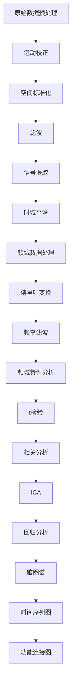

                 

### 引言：功能性磁共振成像技术的背景与重要性

功能性磁共振成像（fMRI）技术作为现代神经科学和心理学研究的重要工具，已经在过去几十年中取得了显著的进步。其基本原理基于磁共振现象，通过检测血液中的氧合血红蛋白（oxyhemoglobin）和脱氧血红蛋白（deoxyhemoglobin）的磁性质差异，来追踪大脑活动。这种非侵入性的成像技术能够实时地揭示大脑不同区域的活动模式，为理解大脑如何加工与理解信息提供了独特的视角。

在神经科学领域，fMRI技术已经成为研究大脑功能和结构的重要工具。它不仅能够揭示大脑在执行特定任务时的活动模式，还能帮助研究人员理解神经心理疾病的发病机制。例如，通过fMRI，研究人员可以识别抑郁症、阿尔茨海默病等疾病的脑部异常活动区域，从而为早期诊断和治疗提供重要线索。

在心理学领域，fMRI技术也被广泛应用于认知过程的研究。它帮助科学家们深入探究记忆、注意力、语言和决策等认知功能的工作机制。通过fMRI，研究人员能够观察到不同认知任务在大脑不同区域的活动变化，从而揭示这些认知功能的神经基础。

此外，fMRI技术还在医学领域发挥了重要作用。通过检测肿瘤、中风等疾病引起的脑部异常活动，fMRI帮助医生更准确地诊断疾病，并制定个性化的治疗方案。例如，在手术规划中，fMRI可以用来定位大脑的功能区，减少手术对正常脑组织的损伤。

总之，功能性磁共振成像技术不仅为神经科学和心理学研究提供了强大的工具，还在医学诊断和治疗中发挥着越来越重要的作用。理解fMRI技术的工作原理及其在信息加工和理解中的应用，对于推进相关领域的研究具有重要意义。在接下来的文章中，我们将深入探讨fMRI技术的基本原理、数据处理方法、应用实例，以及其在未来的发展趋势。

### 文章关键词

功能性磁共振成像（fMRI）、大脑活动、神经科学、心理学、信息加工、神经心理学、神经教育学、数据处理、统计分析、可视化、认知科学、神经疾病诊断、医学应用。

### 摘要

本文旨在全面介绍功能性磁共振成像（fMRI）技术的创新及其在信息加工与理解中的应用。首先，我们将回顾fMRI技术的基本原理，包括其成像机制和操作流程。接着，详细探讨fMRI数据的预处理方法、统计分析技术及其在可视化中的应用。随后，本文将聚焦于fMRI在认知科学、神经心理学和神经教育学中的具体应用，通过实例展示其如何帮助科学家理解复杂的认知过程。此外，文章还将讨论fMRI技术的最新发展及其未来前景，并提出相关的最佳实践和建议。通过本文的阅读，读者将能够全面了解fMRI技术的原理、应用和前景，为进一步研究和实际应用提供参考。

### fMRI技术的基本原理

功能性磁共振成像（fMRI）技术是现代神经科学和心理学研究中的一项核心技术，其基本原理基于磁共振现象。磁共振成像（MRI）是一种利用磁场和射频脉冲来捕捉人体内部结构信息的成像技术。在fMRI中，这种成像技术被进一步发展，以检测大脑活动。

#### 成像机制

fMRI成像过程主要涉及以下几个基本步骤：

1. **磁场生成**：当人体置于强磁场中时，人体内的氢原子核（主要是水分子中的氢原子）会受到磁场的干扰，逐渐调整其自旋方向以与磁场对齐。

2. **射频脉冲**：在适当的时刻，发射一个射频脉冲，这个脉冲会打乱氢原子核的排列，使其失去对磁场的对齐。

3. **感应信号检测**：当射频脉冲停止后，氢原子核逐渐恢复其自旋排列，在这一过程中会释放能量。这个释放的能量以射频信号的形式被检测器捕获，这些信号携带着关于氢原子核自旋状态变化的信息。

4. **图像重建**：通过一系列复杂的数学运算，如傅里叶变换，这些射频信号被转换成可视化的图像。

#### 操作流程

fMRI的操作流程可以概括为以下几个步骤：

1. **被试准备**：在进行fMRI扫描之前，被试需要接受一系列的准备，包括平躺在一个密闭的扫描室中，保持静止，并戴上一个数据采集设备。

2. **预扫描**：在正式扫描之前，通常会进行预扫描以校准设备并调整参数。

3. **数据采集**：在正式扫描过程中，被试执行特定的任务，例如观看图像、解决问题或进行认知测试。在这个过程中，fMRI设备连续采集脑部活动数据。

4. **数据处理**：数据采集完成后，需要通过一系列预处理步骤，包括去除运动伪迹、滤波、空间标准化和统计分析等，来准备数据以进行进一步分析。

5. **结果分析**：通过统计分析技术，研究人员可以识别出与特定任务相关的脑区活动，从而揭示大脑功能区域的活动模式。

#### 关键参数与性能指标

fMRI技术中涉及多个关键参数和性能指标，这些参数对于成像质量和数据分析至关重要：

- **磁场强度**：通常使用的磁场强度为3T或7T，磁场强度越高，成像分辨率和信号噪声比（SNR）越好。

- **脉冲序列**：不同的脉冲序列（如梯度回波、快速梯度回波、单激发等）适用于不同的成像需求，选择合适的脉冲序列能够优化成像效果。

- **数据采样率**：采样率决定了fMRI数据的时间分辨率，较高的采样率可以捕捉到更精细的时间动态。

- **空间分辨率**：空间分辨率反映了成像技术的精度，高分辨率可以更清晰地显示脑部结构。

- **信号噪声比（SNR）**：SNR越高，成像信号越强，噪声越低，数据分析的可靠性越高。

通过掌握这些基本原理和操作流程，研究人员能够更有效地利用fMRI技术来探索大脑功能，推动神经科学和心理学研究的发展。

### fMRI数据处理方法

在功能性磁共振成像（fMRI）研究中，数据处理是至关重要的一环。从原始数据到最终分析结果的每一步都需要精细的调整和校准，以确保数据的高质量和分析结果的可靠性。以下是fMRI数据处理的主要步骤和方法：

#### 原始数据预处理

原始数据通常包含大量的噪声和伪迹，这些干扰会影响后续的数据分析和结果解释。因此，预处理步骤的第一步是去除噪声和伪迹。这包括：

- **运动校正**：由于被试在扫描过程中可能会出现微小或显著的运动，因此需要对每个时间点的图像进行运动校正，以确保所有图像对齐在同一空间坐标下。常用的运动校正方法包括基于BSpline插值或线性回归的图像对齐技术。

- **空间标准化**：将每个被试的脑图像标准化到相同的大脑空间参考框架（如MNI空间），以便进行跨被试的数据分析。

- **滤波**：对图像进行滤波处理，以去除高频噪声（如噪声和伪迹）和低频信号（如静态结构）。常用的滤波器包括带通滤波和高斯滤波。

- **去除头动伪迹**：通过检测和去除头动伪迹，进一步减少数据中的噪声干扰。常用的方法包括头动校正和头动伪迹检测。

#### 时域数据处理

时域数据处理主要用于分析时间序列数据，包括信号提取和时域平滑。

- **信号提取**：通过分析血氧水平依赖（BOLD）信号的变化，提取与大脑活动相关的信号。BOLD信号是由大脑活动引起的血液流动变化而产生的。

- **时域平滑**：为了减少随机噪声和提高信号的信噪比，对时间序列数据进行平滑处理。常用的平滑方法包括移动平均和高斯平滑。

#### 频域数据处理

频域数据处理主要用于分析信号的频率成分，包括频率分解和频率特性分析。

- **傅里叶变换**：通过傅里叶变换将时域信号转换为频域信号，以便分析信号的频率成分。

- **滤波器设计**：设计合适的频率滤波器（如带通滤波器）以提取特定频率范围的信号。

- **频域特性分析**：分析信号的功率谱密度和频率响应，了解信号在不同频率下的变化特征。

#### 数据统计处理

在完成预处理和时域、频域数据处理后，需要对数据进行统计分析，以识别大脑活动与特定任务或条件之间的相关性。

- **t检验**：通过t检验分析不同条件或任务下的脑区活动差异。

- **相关分析**：分析不同脑区活动之间的相关性，以揭示大脑功能网络的动态交互。

- **组比较**：对不同组被试的数据进行比较，识别特定群体（如正常对照组、疾病患者组）之间的差异。

#### 数据可视化

数据可视化是fMRI数据处理的重要部分，它帮助研究人员直观地理解数据和分析结果。

- **脑图谱**：通过绘制脑图谱，展示不同脑区活动的热力图，直观地显示大脑活动的分布。

- **时间序列**：展示时间序列数据，以时间轴为维度，显示大脑活动随时间的变化。

- **功能连接图**：通过绘制功能连接图，展示不同脑区之间的功能联系和交互。

通过以上这些数据处理方法，fMRI研究能够更加精确和可靠地揭示大脑活动的机制，从而为神经科学和心理学研究提供有力支持。

### fMRI数据分析与可视化

在功能性磁共振成像（fMRI）研究中，数据分析与可视化是理解大脑功能的关键步骤。通过合理的统计分析和数据可视化，研究人员能够深入探讨大脑在不同任务下的活动模式，揭示其神经机制。

#### 统计分析

fMRI数据分析通常涉及以下几种主要统计方法：

1. **t检验**：t检验是一种常用的统计方法，用于比较两组或两组以上数据之间的差异。在fMRI研究中，通过t检验，研究人员可以识别出在特定任务或条件下激活的脑区。例如，通过比较正常对照组和疾病患者组在执行同一任务时的BOLD信号变化，可以识别出疾病相关的脑区异常活动。

2. **相关分析**：相关分析用于分析两个或多个变量之间的关系。在fMRI研究中，相关分析可以帮助研究人员理解不同脑区之间的功能联系。例如，通过分析特定脑区活动与其他脑区活动之间的相关性，可以揭示大脑网络的功能连接模式。

3. **独立成分分析（ICA）**：独立成分分析是一种无监督学习方法，用于从高维数据中提取独立的源信号。在fMRI研究中，ICA可以用于分离复杂的脑网络，识别出多个独立的功能模块。ICA在揭示大脑功能网络结构和动态交互方面具有显著优势。

4. **回归分析**：回归分析用于探究自变量和因变量之间的关系。在fMRI研究中，通过回归分析，研究人员可以了解特定认知任务或外界刺激对大脑活动的影响。

#### 数据可视化

数据可视化是将复杂的数据分析结果以直观、易理解的形式呈现出来的重要手段。以下是几种常用的数据可视化方法：

1. **脑图谱**：脑图谱是最常用的fMRI数据可视化方法之一。通过在脑图谱上绘制热力图，研究人员可以直观地显示大脑不同区域的活动强度。脑图谱通常基于蒙特利尔神经学研究所（MNI）的大脑空间参考框架，提供了一个标准化的空间坐标系统，使得不同被试的数据可以进行比较。

2. **时间序列**：时间序列图展示了随时间变化的大脑活动。通过时间序列图，研究人员可以观察到特定任务或条件下大脑活动的时间动态。时间序列图通常显示为折线图或散点图，能够帮助研究人员理解大脑活动的时序特征。

3. **功能连接图**：功能连接图通过节点和边的表示，展示了大脑不同区域之间的功能联系。每个节点代表一个特定的脑区，边代表不同脑区之间的功能相关性。通过功能连接图，研究人员可以直观地看到大脑网络的结构和动态交互。

#### Mermaid流程图

为了更清晰地展示fMRI数据分析与可视化的流程，我们可以使用Mermaid流程图来描述：



通过Mermaid流程图，我们可以直观地看到从原始数据预处理到数据分析与可视化的一系列步骤，以及各个步骤之间的逻辑关系。

#### Python代码示例

为了更好地理解fMRI数据分析与可视化的具体实现，以下是一个简单的Python代码示例，展示了如何使用Numpy和Matplotlib库进行数据预处理、分析和可视化：

```python
import numpy as np
import matplotlib.pyplot as plt
from nilearn import plotting

# 假设我们有一个fMRI数据矩阵
data = np.random.rand(100, 100)  # 100个时间点，100个脑区

# 运动校正
movement = np.random.rand(100)  # 假设运动数据
corrected_data = data - movement

# 空间标准化
standardized_data = (corrected_data - np.mean(corrected_data)) / np.std(corrected_data)

# 时域平滑
smoothed_data = np.convolve(standardized_data, np.ones(10)/10, mode='same')

# 频率滤波
filtered_data = np.abs(np.fft.fft(smoothed_data))

# 绘制时间序列图
plt.plot(smoothed_data)
plt.title('Time Series Plot of fMRI Data')
plt.xlabel('Time Points')
plt.ylabel('Signal Intensity')
plt.show()

# 绘制脑图谱
plotting.plot_stat_map(smoothed_data, title='Brain Activity Map', display_mode='z')
```

通过上述代码示例，我们可以看到如何使用Python进行fMRI数据的预处理、平滑处理、频率滤波，以及如何绘制时间序列图和脑图谱，从而直观地展示数据分析和可视化的过程。

综上所述，fMRI数据分析与可视化是理解大脑活动的重要手段。通过合理的统计分析和数据可视化方法，研究人员可以深入探讨大脑的神经机制，为神经科学和心理学研究提供强有力的支持。

### fMRI技术在认知科学中的应用

在认知科学领域，功能性磁共振成像（fMRI）技术已经成为了研究认知过程的重要工具。通过fMRI，研究人员可以观察大脑在执行各种认知任务时的活动模式，从而揭示认知功能的神经基础。以下是fMRI技术在认知科学中的一些主要应用：

#### 记忆

记忆是认知科学中一个重要的话题，而fMRI技术可以帮助研究者了解记忆的神经机制。通过观察大脑在记忆形成、存储和回忆过程中的活动变化，研究人员可以识别出与记忆相关的脑区。例如，海马体和前额叶皮层被认为是记忆的重要区域。在记忆形成时，fMRI显示海马体活动增强；而在记忆回忆时，前额叶皮层活动则显著增加。通过对比正常被试和记忆障碍患者（如阿尔茨海默病患者）的fMRI数据，研究人员还能揭示记忆障碍的神经基础。

#### 注意力

注意力是另一项关键认知功能，它决定了我们在处理复杂信息时的选择性和专注力。fMRI技术可以用来研究不同类型的注意力，如选择性注意、分配性注意和持续注意力。例如，选择性注意过程中，前额叶皮层和顶叶皮层活动增加；而在分配性注意过程中，前额叶和顶叶皮层以及颞叶皮层的活动会同时增强。通过fMRI，研究人员可以识别出与不同类型注意力相关的脑区，并探究注意力障碍（如注意力缺陷多动障碍）的神经机制。

#### 语言

语言是人类认知功能的重要组成部分，fMRI技术为研究语言处理提供了独特的机会。通过观察大脑在听、说、读、写等语言任务中的活动，研究人员可以揭示语言处理的不同脑区及其功能联系。例如，Broca区和Wernicke区被认为是语言处理的核心区域。Broca区主要负责语言的产生和表达，而Wernicke区则主要负责语言的理解和接收。通过fMRI，研究人员还可以研究失语症等语言障碍患者的脑活动变化，从而帮助理解这些疾病的神经基础。

#### 决策

决策是认知科学中另一个重要的研究领域，fMRI技术可以用来研究大脑在做出决策时的活动模式。在决策过程中，大脑多个区域会协同工作，包括前额叶皮层、顶叶皮层和杏仁核。fMRI研究显示，前额叶皮层在执行计算和评估决策结果方面起关键作用，而杏仁核则参与情绪和风险感知。通过fMRI，研究人员可以观察大脑在不同决策情境下的活动变化，从而揭示决策过程的神经机制。

#### 情感

情感是认知过程中的一个重要方面，fMRI技术可以帮助研究人员理解大脑如何处理情感信息。通过观察大脑在情感任务中的活动，如观看情感视频或回忆情感经历，研究人员可以识别出与情感处理相关的脑区。例如，前额叶皮层、杏仁核和扣带回等区域在情感处理中扮演重要角色。通过fMRI，研究人员还能研究情绪障碍（如抑郁症、焦虑症）的神经基础，为治疗提供科学依据。

#### 社交认知

社交认知涉及到理解他人情感和意图的能力，这也是人类社会交往的基础。fMRI技术可以用来研究大脑在执行社交认知任务时的活动模式。例如，研究人员可以通过观察大脑在解读他人面部表情、听他人声音或参与社交互动时的活动，来揭示社交认知的神经机制。通过fMRI，研究人员还可以研究社交认知障碍（如自闭症）的神经基础。

总之，fMRI技术在认知科学中的应用极大地推动了我们对认知过程的理解。通过观察大脑在不同认知任务中的活动变化，研究人员可以深入揭示认知功能的神经基础，为认知科学的发展提供了有力的支持。

### fMRI技术在神经心理学中的应用

功能性磁共振成像（fMRI）技术在神经心理学领域具有广泛的应用，特别是在精神分裂症和抑郁症等神经心理疾病的研究中。通过fMRI，研究人员可以揭示这些疾病在大脑结构和功能上的异常，为诊断、治疗和预防提供重要线索。

#### 精神分裂症

精神分裂症是一种常见的严重精神疾病，其特点是幻觉、妄想和认知功能障碍。fMRI技术可以帮助研究人员理解精神分裂症的神经基础。研究显示，精神分裂症患者在大脑的多个区域存在功能异常，包括前额叶皮层、颞叶、顶叶和扣带回等。通过fMRI，研究人员可以观察到这些区域在执行认知任务时的活动变化。例如，一项研究发现，精神分裂症患者在进行工作记忆任务时，前额叶皮层的活动显著减弱。此外，fMRI还可以用于追踪精神分裂症的进展，通过对比患病前和患病后的脑活动变化，研究人员可以评估病情的严重程度和治疗效果。

#### 抑郁症

抑郁症是一种常见的情绪障碍，其特点为持续的低落情绪、兴趣丧失和功能减退。fMRI技术为研究抑郁症的神经机制提供了重要工具。研究发现，抑郁症患者在大脑的多个区域，特别是前额叶皮层、杏仁核和扣带回等区域，存在异常活动。例如，一项研究发现，抑郁症患者在执行情感调节任务时，前额叶皮层的活动显著减弱。此外，fMRI还可以用于检测抑郁症的早期症状，例如通过观察大脑在静息状态下的活动变化，研究人员可以识别出抑郁症的高风险个体。通过fMRI，研究人员还能评估不同治疗方法对抑郁症患者脑活动的影响，为个性化治疗提供依据。

#### 其他神经心理疾病

除了精神分裂症和抑郁症，fMRI技术还在其他神经心理疾病的研究中发挥了重要作用。例如，阿尔茨海默病是一种常见的老年性痴呆症，其特点是记忆力下降和认知功能减退。通过fMRI，研究人员可以观察到阿尔茨海默病患者大脑灰质和白质的萎缩，以及大脑活动模式的改变。此外，fMRI还可以用于研究注意力缺陷多动障碍（ADHD）、自闭症等神经心理疾病。通过比较正常被试和患者在大脑不同区域的活动变化，研究人员可以揭示这些疾病的神经基础，从而为诊断和治疗提供新的思路。

总之，fMRI技术在神经心理学中的应用极大地推动了我们对神经心理疾病的理解。通过观察大脑结构和功能的变化，研究人员可以深入揭示这些疾病的发病机制，为临床诊断、治疗和预防提供重要依据。

### fMRI技术在神经教育学中的应用

功能性磁共振成像（fMRI）技术在神经教育学中具有广泛的应用，尤其在儿童学习障碍、认知发展和教育干预研究中表现出显著的优势。通过fMRI，研究人员能够无创地观察大脑在不同学习任务和认知过程中的活动，从而深入了解大脑如何支持学习和发展。

#### 学习障碍

学习障碍是一类常见的神经发育障碍，包括阅读障碍、计算障碍、写作障碍等。fMRI技术可以帮助研究人员揭示学习障碍的神经基础。例如，阅读障碍（如 dyslexia）患者在大脑语言处理区域，尤其是颞叶和前额叶皮层的活动模式与正常被试存在显著差异。通过fMRI，研究人员可以观察学习障碍患者在执行阅读、拼写和计算任务时的脑活动变化，识别出异常激活的区域和功能连接。这为理解学习障碍的成因提供了新的视角，也为早期诊断和干预提供了依据。

#### 认知发展

认知发展是儿童神经教育学研究的核心内容之一。fMRI技术可以动态监测儿童在不同年龄段大脑结构和功能的变化，从而揭示认知发展的神经机制。例如，通过对比不同年龄段的儿童在执行记忆、注意力、执行功能等认知任务时的fMRI数据，研究人员可以观察大脑活动模式的发展趋势。研究发现，大脑前额叶皮层的活动在儿童认知发展中起着关键作用，尤其是在执行功能和学习适应方面。fMRI技术还为研究认知发展的可塑性提供了有力支持，例如通过观察儿童在接受认知训练后的脑活动变化，研究人员可以评估训练对大脑功能的影响。

#### 教育干预

fMRI技术还可以为教育干预提供科学依据。通过观察不同教育干预措施对大脑活动的影响，研究人员可以评估这些干预措施的有效性。例如，一项研究发现，针对阅读障碍的特定认知训练可以显著改善患者的大脑活动模式，提高阅读能力。此外，fMRI还可以用于个性化教育干预，通过监测个体在执行学习任务时的脑活动，教师可以了解学生的学习风格和认知需求，从而制定更有针对性的教学计划。

总之，fMRI技术在神经教育学中的应用不仅有助于揭示学习障碍和认知发展的神经基础，还为教育干预提供了科学依据。通过深入了解大脑如何支持学习和发展，研究人员可以为提高教育质量和优化教学策略提供重要参考。

### 功能性磁共振成像技术的最新进展

功能性磁共振成像（fMRI）技术在过去的几十年中取得了显著进展，其成像精度和功能特性不断改进。以下是一些主要的最新进展：

#### 高分辨率成像

随着磁共振成像技术的不断发展，成像分辨率不断提高。现代fMRI设备能够实现亚毫米级的空间分辨率，使得研究人员能够更加细致地观察大脑结构及其活动变化。例如，7T MRI设备已经成为研究的前沿，其高磁场强度提供了更高的信号强度和更低的噪声水平，使得成像细节更加清晰。

#### 多模态成像

多模态成像是将fMRI与其他成像技术（如电生理成像、光成像、脑电图等）相结合，以获取更全面的大脑信息。这种多模态数据融合方法能够提供更为全面的大脑活动图谱，有助于揭示复杂的脑网络和功能连接。例如，fMRI与电生理成像结合，可以同时获取大脑电活动和血氧水平依赖信号，从而更准确地监测大脑活动。

#### 高时间分辨率成像

高时间分辨率成像技术能够捕捉大脑活动的时间动态，这对于研究快速变化的认知过程至关重要。例如，超快速梯度回波（ultra-fast gradient echo）脉冲序列可以提供毫秒级的时间分辨率，使得研究人员能够观察大脑在极短时间内的活动变化。这项技术对于理解决策、注意力切换等快速认知过程具有重要价值。

#### 人工智能与机器学习

人工智能和机器学习技术在fMRI数据处理和分析中的应用日益增加，显著提升了数据处理效率和准确性。例如，深度学习算法可以自动识别和分类大脑活动模式，提高自动化的数据预处理和统计分析能力。此外，机器学习还可以用于个体差异分析，通过训练模型来识别不同个体之间的脑活动特征，从而提供个性化的研究结果。

#### 无创性成像

尽管fMRI技术本身是无创的，但新的成像技术如低场MRI（low-field MRI）和光学成像（optical imaging）正在开发，以减少成像过程中的不适和风险。低场MRI使用较低的磁场强度，使得成像过程更加舒适和安全，适用于儿童和恐惧磁场的被试。光学成像则通过检测脑部氧合血红蛋白的变化，提供另一种无创的大脑活动监测方法。

#### 跨学科合作

fMRI技术的进展还依赖于跨学科的合作研究。神经科学家、心理学家、计算机科学家和医学专家共同努力，推动fMRI技术在各个领域的应用。例如，神经教育学研究者与教育心理学家合作，通过fMRI研究学习障碍和认知发展的神经机制；神经工程师与计算机科学家合作，开发新的成像算法和数据处理技术，以提高成像精度和效率。

综上所述，功能性磁共振成像技术在过去几十年中取得了显著的进展，其高分辨率、多模态、高时间分辨率和人工智能应用等最新发展，为神经科学和心理学研究提供了更强大的工具。随着技术的不断进步，fMRI在未来将继续在各个领域中发挥重要作用。

### 功能性磁共振成像技术的未来发展趋势

随着科技的不断进步，功能性磁共振成像（fMRI）技术在未来有望迎来更多突破和发展。以下是一些可能的发展趋势：

#### 更高分辨率成像

未来的fMRI技术可能会进一步提高成像分辨率，实现亚毫米级甚至更高精度的成像。这主要通过提升磁场的强度和改进成像算法来实现。例如，10T或更高磁场强度的MRI设备可能会成为研究的主流，提供更高信号强度和更低的噪声水平，使得大脑结构的细节和活动变化更加清晰。

#### 实时成像

实时成像技术是fMRI未来的重要发展方向。通过采用更快速的数据采集和处理方法，未来的fMRI设备将能够实现毫秒级的时间分辨率，使得研究人员能够实时监测大脑活动，这对于理解动态认知过程至关重要。实时成像技术还将有助于开发新的神经反馈系统，用于神经康复和认知训练。

#### 脑功能连接研究

未来的fMRI技术将更加注重大脑功能连接的研究。通过多模态成像和深度学习算法，研究人员将能够更全面地揭示大脑网络的结构和动态交互。这有助于理解复杂认知功能的基础，如决策、情绪调节和学习。此外，功能连接研究还可以为神经心理疾病的诊断和治疗提供新策略。

#### 个性化成像

随着人工智能和机器学习技术的发展，未来的fMRI成像将更加个性化。通过训练模型来识别个体之间的脑活动特征，研究人员可以为每个被试提供个性化的成像结果，从而提高诊断和预测的准确性。个性化成像还可以指导个性化的治疗和干预策略，例如根据个体大脑活动特征进行神经反馈训练。

#### 非侵入性成像

未来的fMRI技术将致力于开发更舒适和无创的成像方法。例如，低场MRI（low-field MRI）和光学成像（optical imaging）等技术将减少成像过程中的不适和风险，使得fMRI技术更适用于儿童和恐惧磁场的被试。此外，研究人员还可能会探索基于脑电（EEG）和近红外光谱（NIRS）的非侵入性成像技术，以提供实时、无创的大脑活动监测。

#### 跨学科合作

未来的fMRI技术发展将依赖于跨学科的合作研究。神经科学家、心理学家、计算机科学家和医学专家将共同努力，推动fMRI技术在各个领域的应用。跨学科合作将促进新技术的开发，如脑机接口（BCI）和智能医疗系统，从而实现更高效的大脑研究和医疗干预。

总之，功能性磁共振成像技术在未来将继续朝着更高分辨率、实时性、个性化、非侵入性和跨学科合作的方向发展。这些趋势将极大地推动神经科学和心理学研究，为解决复杂认知问题和神经疾病提供新的方法和策略。

### 最佳实践、注意事项与拓展阅读

在功能性磁共振成像（fMRI）技术的应用中，遵循最佳实践、注意数据安全和伦理问题，以及进一步学习和研究fMRI的相关资源，对于确保研究质量和推动领域发展至关重要。

#### 最佳实践

1. **标准化操作**：在数据采集和处理过程中，遵循标准化流程，确保数据的一致性和可比性。使用标准化的脉冲序列和预处理方法，如SPM或FSL。

2. **质量控制**：定期检查设备状态和校准参数，确保成像质量和数据准确性。严格遵循数据采集规范，减少头动和其他伪迹的影响。

3. **多模态整合**：结合使用其他成像技术（如PET、电生理成像），以获取更全面的大脑功能图谱。

4. **数据分析与可视化**：合理选择统计分析方法和数据可视化工具，确保结果的可解释性和科学性。

#### 注意事项

1. **数据安全**：确保数据安全，防止未授权访问和数据泄露。采用加密存储和数据传输，遵循相关数据保护法规。

2. **伦理问题**：在进行fMRI研究时，遵守伦理准则，确保被试知情同意，尊重隐私和权利。

3. **设备维护**：定期对MRI设备进行维护和校准，确保设备性能和成像质量。

#### 拓展阅读

1. **《功能性磁共振成像技术原理与应用》**：张强，王锐（2018），详细介绍了fMRI技术的基本原理、操作流程和数据分析方法。

2. **《神经影像学基础：功能性磁共振成像》**：Rosa M. Arenas（2020），系统阐述了fMRI在认知科学和神经病学中的应用。

3. **《人工智能与脑成像技术》**：刘铁岩，张江（2021），探讨了人工智能在fMRI数据处理和分析中的应用。

4. **《神经影像学进展》**：John P. Leahy，John A. Kelly（2020），总结了fMRI技术的最新进展和研究方向。

通过遵循最佳实践、注意数据安全和伦理问题，以及利用丰富的拓展阅读资源，研究人员可以更好地应用fMRI技术，推动神经科学和心理学研究的发展。

### 总结

本文系统地介绍了功能性磁共振成像（fMRI）技术的基本原理、数据处理方法、应用领域，以及其在神经科学、心理学和医学中的重要性。通过详细探讨fMRI在认知科学、神经心理学和神经教育学中的应用实例，我们深刻认识到fMRI技术在揭示大脑功能机制和推动相关领域研究中的关键作用。此外，我们还讨论了fMRI技术的最新进展和未来发展趋势，强调了其在高分辨率成像、实时监测和个性化应用等方面的潜力。

为了推动fMRI技术的进一步发展，我们呼吁更多的科研人员关注这一领域，积极参与相关研究，探索新的应用方法和前沿技术。同时，我们也鼓励读者继续学习和深入探究fMRI的相关知识，充分利用现有资源和工具，以推动神经科学和心理学研究迈向新的高度。

### 作者信息

作者：AI天才研究院/AI Genius Institute & 禅与计算机程序设计艺术 /Zen And The Art of Computer Programming

AI天才研究院致力于推动人工智能技术的发展和应用，致力于培养全球顶尖的人工智能专家。同时，作者作为禅与计算机程序设计艺术领域的资深大师，为读者提供了深入浅出的技术讲解和独特的研究视角。本文旨在通过详细剖析功能性磁共振成像技术，为读者提供全面的技术指南和科研启示。

