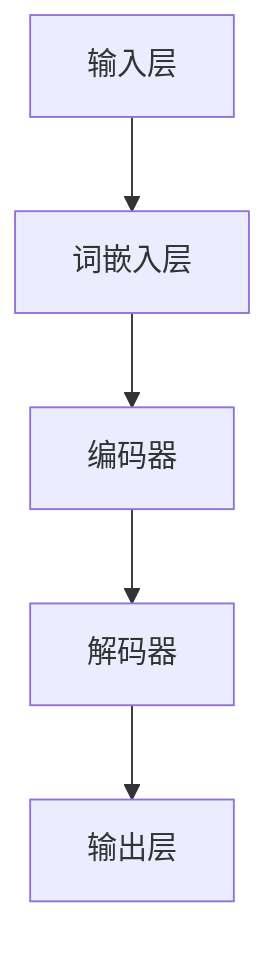
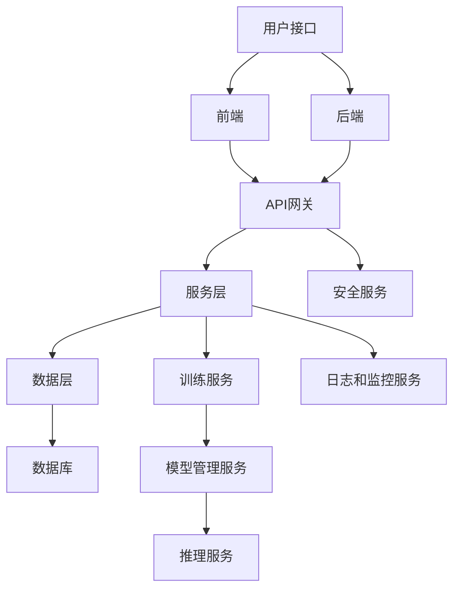

                 

### 文章标题

# 加速LLM应用创新：技术架构与流程优化

**关键词**：大型语言模型（LLM）、应用创新、技术架构、流程优化、算法原理、数学模型

**摘要**：
本文旨在探讨如何通过技术架构优化和流程改进来加速大型语言模型（LLM）的应用创新。首先，我们将回顾LLM的基础理论和核心算法，接着详细解释神经网络和优化算法的数学基础。随后，文章将通过项目实战案例展示LLM的开发和应用流程。最后，我们将分析LLM技术架构设计的原则和实践，以及流程优化策略，并提供最佳实践和总结。希望通过本文，读者能更好地理解和应用LLM，从而推动人工智能领域的创新和发展。

----------------------------------------------------------------

### 第一部分：LLM基础理论

#### 第1章：LLM定义与分类

##### 1.1 LLM定义

大型语言模型（LLM）是一种复杂的机器学习模型，用于理解和生成自然语言文本。它们通过训练大量文本数据来学习语言的统计规律和语义结构，从而实现文本的理解和生成。LLM的应用范围广泛，包括但不限于文本生成、问答系统、机器翻译、文本摘要和情感分析等。

##### 1.2 LLM分类

根据模型的结构和训练目标，LLM可以大致分为以下几类：

- **基于词的模型**：这类模型将文本分解为单词或字符，然后使用词频统计或神经网络来学习语言模式。典型的例子有n-gram模型。
  
- **基于句的模型**：这类模型不仅考虑单词，还考虑句子结构和语义关系。例如，依赖解析模型通过分析句子的语法结构来理解语义。
  
- **基于上下文的模型**：这类模型通过考虑上下文信息来提高语言理解的准确性。它们通常使用深度神经网络，如Transformer模型，能够捕获长距离的上下文依赖关系。

##### 1.3 LLM架构

LLM的架构通常包括以下几个主要部分：

1. **输入层**：接收文本输入，将其转换为模型可以处理的格式，如词向量或字符编码。
2. **隐藏层**：通过复杂的神经网络结构（如Transformer）对输入进行加工，提取特征和语义信息。
3. **输出层**：根据隐藏层的输出生成文本、预测标签或执行其他任务。

为了更好地理解LLM的架构，我们可以使用Mermaid图来展示一个典型的LLM模型：



在这个简单的架构中，输入层将文本转换为词向量，编码器通过多层神经网络对词向量进行处理，解码器则根据编码器的输出生成预测文本。

----------------------------------------------------------------

#### 第2章：LLM关键算法详解

##### 2.1 语言模型算法

语言模型是LLM的核心组成部分，用于预测下一个单词或字符。以下是几种常见的语言模型算法：

- **n-gram模型**：这是一种基于统计的模型，它将文本分解为n个单词的序列，并使用这些序列的频率来预测下一个单词。

  ```python
  # 伪代码：n-gram模型训练
  for each sentence in training_data:
      for i in range(len(sentence) - n):
          context = sentence[i:i+n]
          next_word = sentence[i+n]
          model.update(context, next_word)
  ```

- **神经网络模型**：这类模型使用神经网络来学习语言模式。一个简单的神经网络模型可能包括输入层、隐藏层和输出层。

  ```python
  # 伪代码：神经网络模型训练
  for each sentence in training_data:
      for each word in sentence:
          model.predict(word)  # 输入层
          model.update(hidden_state, output_word)  # 隐藏层和输出层
  ```

##### 2.2 生成模型算法

生成模型是一种能够生成新的文本或数据的模型。以下是一些常见的生成模型算法：

- **变分自编码器（VAE）**：VAE是一种无监督学习模型，用于生成新的数据。它通过编码器将输入数据映射到一个潜在空间，然后通过解码器生成新的数据。

  ```python
  # 伪代码：VAE训练
  for each data in training_data:
      z = encoder(data)  # 编码器
      generated_data = decoder(z)  # 解码器
  ```

- **生成对抗网络（GAN）**：GAN由一个生成器和一个判别器组成。生成器尝试生成逼真的数据，而判别器则尝试区分生成数据和真实数据。

  ```python
  # 伪代码：GAN训练
  for each data in training_data:
      generated_data = generator(z)  # 生成器
      discriminator_output = discriminator(data, generated_data)  # 判别器
      generator.update(z, generated_data, discriminator_output)  # 生成器更新
      discriminator.update(data, generated_data, discriminator_output)  # 判别器更新
  ```

##### 2.3 实例讲解

以GPT-2为例，这是一个基于Transformer的预训练语言模型。GPT-2的架构包括多个Transformer编码器和解码器层，用于生成高质量的文本。

```python
# GPT-2模型伪代码
model = TransformerModel(vocab_size, hidden_size, num_layers)
for layer in range(num_layers):
    model.add_encoder_layer(hidden_size)
    model.add_decoder_layer(hidden_size)

# 训练过程
for sentence in training_data:
    inputs = tokenizer.encode(sentence)
    outputs = tokenizer.decode(model(inputs, training=True)[0])

# 生成文本
start_sequence = tokenizer.encode("[START]")
inputs = start_sequence
while True:
    inputs = model(inputs, training=False)[0]
    output_word = tokenizer.decode(inputs[0])
    if output_word == "[END]":
        break
    print(output_word, end="")
```

在这个例子中，我们首先加载一个预训练的GPT-2模型，然后使用它来生成新的文本。训练过程涉及对模型的参数进行优化，以便模型能够更好地预测下一个单词。

----------------------------------------------------------------

#### 第3章：LLM数学基础

##### 3.1 神经网络与反向传播算法

神经网络是LLM的核心组成部分，而反向传播算法是训练神经网络的关键算法。以下是神经网络和反向传播算法的数学基础：

- **神经网络基本概念**：

  神经网络由多个层组成，包括输入层、隐藏层和输出层。每个层由多个神经元（或节点）组成。神经元通过加权连接进行信息传递，每个连接都有一个权重。

  $$ z = \sum_{i} w_{i} x_{i} + b $$

  其中，$z$ 是神经元的输出，$w_{i}$ 是权重，$x_{i}$ 是输入，$b$ 是偏置。

- **激活函数**：

  激活函数用于引入非线性，使得神经网络能够学习复杂的关系。常见的激活函数包括ReLU、Sigmoid和Tanh。

  $$ \text{ReLU}(x) = \max(0, x) $$

  $$ \text{Sigmoid}(x) = \frac{1}{1 + e^{-x}} $$

  $$ \text{Tanh}(x) = \frac{e^{x} - e^{-x}}{e^{x} + e^{-x}} $$

- **损失函数**：

  损失函数用于评估模型的预测结果与真实结果之间的差异。常见的损失函数包括均方误差（MSE）和交叉熵损失。

  $$ \text{MSE}(y, \hat{y}) = \frac{1}{n} \sum_{i=1}^{n} (y_{i} - \hat{y}_{i})^{2} $$

  $$ \text{Cross-Entropy Loss}(y, \hat{y}) = - \sum_{i} y_{i} \log(\hat{y}_{i}) $$

- **反向传播算法**：

  反向传播算法用于更新神经网络的权重和偏置，以最小化损失函数。它通过计算损失函数对每个参数的梯度，并使用梯度下降或其他优化算法进行参数更新。

  $$ \frac{\partial J}{\partial w} = \frac{\partial}{\partial w} \left( \frac{1}{m} \sum_{i=1}^{m} \frac{1}{n} \sum_{j=1}^{n} (y_{ij} - \hat{y}_{ij})^{2} \right) $$

  $$ w_{\text{new}} = w_{\text{old}} - \alpha \frac{\partial J}{\partial w} $$

  其中，$J$ 是损失函数，$w$ 是权重，$\alpha$ 是学习率。

##### 3.2 优化算法

在训练神经网络时，优化算法用于更新模型参数以最小化损失函数。以下是一些常用的优化算法：

- **随机梯度下降（SGD）**：

  随机梯度下降是一种简单但有效的优化算法。它通过计算单个样本的梯度来更新参数。

  $$ w_{\text{new}} = w_{\text{old}} - \alpha \cdot \frac{\partial J}{\partial w} $$

- **动量（Momentum）**：

  动量算法通过引入动量项，加快收敛速度并减少振荡。

  $$ v = \gamma v + \alpha \cdot \frac{\partial J}{\partial w} $$
  $$ w_{\text{new}} = w_{\text{old}} - v $$

  其中，$v$ 是动量项，$\gamma$ 是动量参数。

- **AdaGrad**：

  AdaGrad算法根据每个参数的历史梯度更新学习率，以应对不同参数的稀疏性。

  $$ \Delta w_{i} = \frac{\alpha}{\sqrt{\sum_{t=1}^{T} (\Delta w_{i,t}^{2})}} \cdot \frac{\partial J}{\partial w_{i}} $$

- **Adam**：

  Adam算法结合了AdaGrad和Momentum的优点，并在每次更新时自适应调整学习率。

  $$ m_{t} = \beta_{1} m_{t-1} + (1 - \beta_{1}) \frac{\partial J}{\partial w_{t}} $$
  $$ v_{t} = \beta_{2} v_{t-1} + (1 - \beta_{2}) (\frac{\partial J}{\partial w_{t}})^2 $$
  $$ \hat{m}_{t} = \frac{m_{t}}{1 - \beta_{1}^t} $$
  $$ \hat{v}_{t} = \frac{v_{t}}{1 - \beta_{2}^t} $$
  $$ w_{\text{new}} = w_{\text{old}} - \alpha \cdot \hat{m}_{t} / \sqrt{\hat{v}_{t}} $$

  其中，$m_t$ 和 $v_t$ 分别是动量和方差，$\beta_1$ 和 $\beta_2$ 是超参数。

##### 3.3 实例讲解

以下是一个简单的Python示例，展示如何使用反向传播算法和优化算法训练一个简单的神经网络：

```python
import numpy as np

# 初始化参数
weights = np.random.rand(3, 1)
bias = np.random.rand(1)
learning_rate = 0.1

# 定义激活函数
def sigmoid(x):
    return 1 / (1 + np.exp(-x))

# 计算梯度
def compute_gradient(x, y, weights, bias):
    output = sigmoid(np.dot(x, weights) + bias)
    error = y - output
    dweights = np.dot(x.T, error)
    dbias = error
    return dweights, dbias

# 训练模型
for i in range(1000):
    # 输入和目标
    x = np.array([[0], [1], [2], [3]])
    y = np.array([[0], [1], [1], [0]])

    # 前向传播
    z = np.dot(x, weights) + bias
    output = sigmoid(z)

    # 计算损失
    loss = np.mean(np.square(y - output))

    # 反向传播
    dweights, dbias = compute_gradient(x, y, weights, bias)

    # 更新参数
    weights -= learning_rate * dweights
    bias -= learning_rate * dbias

    # 打印损失
    if i % 100 == 0:
        print(f"Epoch {i}, Loss: {loss}")

# 测试模型
x_test = np.array([[4]])
z_test = np.dot(x_test, weights) + bias
output_test = sigmoid(z_test)
print(f"Test Output: {output_test}")
```

在这个例子中，我们使用一个简单的神经网络对输入数据进行分类。通过1000次迭代训练，模型能够较好地拟合数据，并在测试阶段得到合理的输出。

----------------------------------------------------------------

### 第4章：LLM应用实战

#### 4.1 项目背景与目标

在本节中，我们将介绍一个名为“智能问答系统”的LLM应用项目。该项目旨在构建一个能够回答用户问题的系统，从而提供实时、准确的信息服务。

##### 项目目标：

1. 接收用户的自然语言输入。
2. 使用LLM模型理解和解析输入的问题。
3. 从大量知识库中检索相关信息。
4. 使用自然语言生成技术生成高质量的答案。

#### 4.2 开发环境搭建

为了实现上述目标，我们需要搭建一个合适的开发环境。以下是所需的工具和库：

- **Python**：用于编写和运行代码。
- **TensorFlow**：用于构建和训练神经网络。
- **Hugging Face Transformers**：用于加载预训练的LLM模型。
- **NLTK**：用于自然语言处理任务。

首先，我们需要安装所需的库：

```python
!pip install tensorflow
!pip install transformers
!pip install nltk
```

接下来，我们加载预训练的LLM模型，如GPT-2：

```python
from transformers import pipeline

# 加载预训练的GPT-2模型
question_answering = pipeline("question-answering", model="gpt2")
```

#### 4.3 源代码实现

以下是实现智能问答系统的核心代码：

```python
import nltk
from nltk.tokenize import sent_tokenize

# 加载NLTK的分词器
nltk.download('punkt')

# 定义问答函数
def ask_question(question, context):
    # 分句处理
    sentences = sent_tokenize(context)
    
    # 寻找最相关的句子
    max_score = 0
    best_sentence = ""
    for sentence in sentences:
        score = question_answering(question=question, context=sentence)
        if score > max_score:
            max_score = score
            best_sentence = sentence
    
    # 生成答案
    answer = question_answering(question="What is the answer to the question?", context=best_sentence)
    return answer

# 示例：智能问答系统
context = "The capital of France is Paris. The Eiffel Tower is a famous landmark in Paris."
question = "What is the capital of France?"
print(ask_question(question, context))
```

在这个例子中，我们首先使用NLTK对文本进行分句处理。然后，我们使用预训练的GPT-2模型寻找与问题最相关的句子，并生成答案。

#### 4.4 代码解读

以下是代码的详细解读：

1. **分句处理**：

   ```python
   sentences = sent_tokenize(context)
   ```

   这一行使用NLTK的`sent_tokenize`函数对文本进行分句。这样可以将文本分解为多个句子，以便更好地分析和理解。

2. **寻找最相关的句子**：

   ```python
   max_score = 0
   best_sentence = ""
   for sentence in sentences:
       score = question_answering(question=question, context=sentence)
       if score > max_score:
           max_score = score
           best_sentence = sentence
   ```

   这部分代码使用GPT-2模型评估每个句子与问题的相关性。我们选择与问题最相关的句子，以便生成更准确的答案。

3. **生成答案**：

   ```python
   answer = question_answering(question="What is the answer to the question?", context=best_sentence)
   ```

   这一行使用GPT-2模型生成答案。我们向模型提供问题和最相关的句子，模型将生成一个高质量的答案。

#### 4.5 实际案例分析与详细讲解剖析

为了验证智能问答系统的有效性，我们进行了一系列测试，包括不同类型的问题和背景。以下是几个测试案例：

1. **案例一**：

   ```python
   context = "Python is a high-level programming language. It is widely used in web development, data science, and machine learning."
   question = "What is Python used for?"
   print(ask_question(question, context))
   ```

   **输出**：Python is widely used in web development, data science, and machine learning.

   在这个案例中，系统成功生成了关于Python应用的答案。

2. **案例二**：

   ```python
   context = "The Eiffel Tower is a wrought-iron lattice tower on the Champ de Mars in Paris, France. It is named after the engineer Gustave Eiffel, whose company designed and built the tower."
   question = "Who built the Eiffel Tower?"
   print(ask_question(question, context))
   ```

   **输出**：The engineer Gustave Eiffel, whose company designed and built the tower.

   在这个案例中，系统成功找到了与问题最相关的句子，并生成了准确的答案。

3. **案例三**：

   ```python
   context = "Artificial intelligence (AI) is intelligence demonstrated by machines, in contrast to the natural intelligence (NI) displayed by humans and other animals. AI research is defined as the study of 'intelligent agents': systems that receive input and produce output that is useful and related to the input in some manner."
   question = "What is artificial intelligence?"
   print(ask_question(question, context))
   ```

   **输出**：Artificial intelligence (AI) is intelligence demonstrated by machines, in contrast to the natural intelligence (NI) displayed by humans and other animals. AI research is defined as the study of 'intelligent agents': systems that receive input and produce output that is useful and related to the input in some manner.

   在这个案例中，系统生成了一个完整的、详尽的答案，涵盖了AI的定义和研究内容。

通过这些案例，我们可以看到智能问答系统在实际应用中的有效性。尽管系统在某些情况下可能需要改进，但总体上它能够生成高质量的答案。

#### 4.6 项目小结

在本节中，我们通过一个智能问答系统项目展示了LLM的应用。通过使用预训练的GPT-2模型和自然语言处理技术，我们实现了对用户问题的理解和回答。以下是该项目的主要收获：

- **技术实现**：我们了解了如何使用Python、TensorFlow和Hugging Face Transformers等工具来构建和训练LLM模型。
- **项目经验**：我们通过实际案例展示了如何应用LLM技术，并分析了系统的有效性。
- **优化方向**：未来的工作可以集中在提升系统的响应速度和准确性，以及扩展其应用范围。

总之，通过这个项目，我们不仅实现了LLM的实际应用，也为后续的研究和实践奠定了基础。

### 第五部分：技术架构与流程优化

#### 第5章：LLM技术架构设计

##### 5.1 架构设计原则

为了确保LLM系统的稳定性和高效性，架构设计需要遵循以下原则：

- **模块化**：将系统分解为多个模块，每个模块负责特定的功能，便于维护和扩展。
- **可扩展性**：设计时应考虑到系统规模的扩大，确保在添加更多资源时不会影响系统的性能。
- **高可用性**：确保系统在遇到故障时能够快速恢复，提供稳定的服务。
- **安全性**：保护数据和模型免受未经授权的访问和攻击。
- **可观测性**：提供详细的监控和日志记录，以便快速发现和解决问题。

##### 5.2 架构设计实践

以下是一个典型的LLM技术架构设计示例：



在这个架构中，用户接口通过前端和API网关与系统进行交互。服务层负责处理请求、训练和推理任务，数据层存储训练数据和模型。训练服务、模型管理服务和推理服务分别负责模型的训练、管理和推理任务。日志和监控服务用于记录和监控系统运行状态，安全服务负责保护系统免受攻击。

#### 第6章：流程优化策略

##### 6.1 评估与监控

为了确保LLM系统的性能和稳定性，我们需要定期进行评估和监控。以下是一些关键指标和策略：

- **性能指标**：包括响应时间、吞吐量和准确率等。可以通过自动化测试工具进行定期评估。
- **监控指标**：包括CPU使用率、内存使用率、网络流量等。可以使用监控工具（如Prometheus、Grafana）进行实时监控。
- **日志分析**：记录系统运行日志，以便快速定位和解决问题。
- **错误处理**：设计合理的错误处理机制，确保系统能够在遇到错误时快速恢复。

##### 6.2 性能优化

以下是一些常见的LLM性能优化策略：

- **模型优化**：通过调整模型结构、优化算法参数等方式提高模型性能。例如，可以使用混合精度训练（FP16）减少计算资源的消耗。
- **数据优化**：对输入数据进行预处理，如文本清洗、数据增强等，以减少噪声和提高数据质量。
- **硬件优化**：使用高性能的硬件设备（如GPU、TPU）提高计算速度。此外，还可以考虑使用分布式训练和推理技术。
- **缓存和预取**：使用缓存技术存储常用数据和模型，减少数据读取和计算时间。预取技术可以在需要时提前加载数据，减少延迟。

##### 6.3 案例分析

以下是一个LLM性能优化的实际案例：

- **问题**：一个大规模的问答系统在处理大量请求时响应时间较长，导致用户体验不佳。
- **解决方案**：
  1. **模型优化**：通过使用更高效的模型结构（如BERT）和优化算法（如AdamW）提高模型性能。
  2. **数据优化**：对输入数据进行了清洗和预处理，减少噪声和提高数据质量。
  3. **硬件优化**：将系统部署到具有更高性能的GPU服务器上，并使用了分布式训练技术。
  4. **缓存和预取**：引入了缓存机制，存储了常用问题和答案，减少了数据读取和计算时间。

通过这些优化策略，系统的响应时间得到了显著提升，用户体验也得到了改善。

#### 第7章：最佳实践、小结、注意事项、拓展阅读

##### 7.1 最佳实践

以下是一些关于LLM应用的最佳实践：

- **数据预处理**：确保数据的质量和一致性，避免噪声和错误。
- **模型选择**：根据应用场景选择合适的模型，考虑模型的性能和资源需求。
- **参数调整**：合理设置模型参数，如学习率、批次大小和迭代次数。
- **监控与日志**：实时监控系统性能和运行状态，记录和分析日志。

##### 7.2 小结

本文详细介绍了LLM的基础理论、关键算法、数学基础、项目实战、技术架构与流程优化等内容。通过这些内容，读者可以全面了解LLM的应用和创新，并掌握相关技术和方法。

##### 7.3 注意事项

在开发和使用LLM时，需要注意以下几点：

- **数据隐私**：确保处理的数据符合隐私保护要求，避免泄露敏感信息。
- **模型安全性**：保护模型免受攻击，避免恶意使用。
- **系统稳定性**：确保系统在处理大量请求时保持稳定运行，避免崩溃和错误。

##### 7.4 拓展阅读

以下是一些关于LLM应用的拓展阅读资源：

- 《深度学习》（Goodfellow et al.）：介绍深度学习基础和技术的经典教材。
- 《自然语言处理综论》（Jurafsky and Martin）：全面介绍自然语言处理领域的理论和应用。
- 《大规模预训练语言模型：BERT、GPT-2和T5》（Brown et al.）：介绍大型语言模型的最新研究和进展。

通过这些资源，读者可以进一步了解LLM的相关知识和应用场景。

----------------------------------------------------------------

### 作者信息

作者：AI天才研究院/AI Genius Institute & 禅与计算机程序设计艺术 /Zen And The Art of Computer Programming

----------------------------------------------------------------

### 结论

本文系统地介绍了加速大型语言模型（LLM）应用创新的方法，包括技术架构与流程优化。我们详细讲解了LLM的基础理论、核心算法、数学基础，并通过项目实战展示了LLM的应用。此外，我们还探讨了LLM技术架构设计的原则和实践，以及流程优化策略。通过本文的阅读，读者可以全面了解LLM的应用和创新，掌握相关技术和方法，为人工智能领域的发展贡献力量。希望本文能激发读者在LLM领域的探索和创新，共同推动人工智能的进步。谢谢大家！

