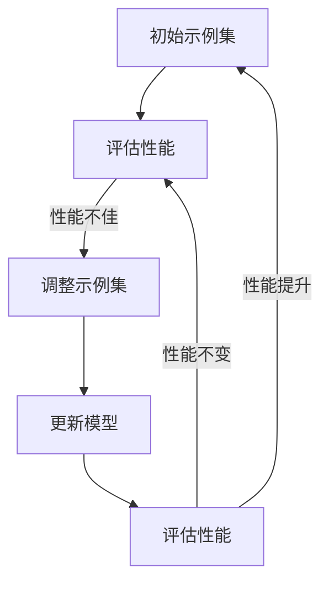

                 

### 动态示例选择：根据任务特性调整

在人工智能领域，动态示例选择是一种关键的技术，其目的是根据任务的特性动态调整示例集，从而提高模型的效果和泛化能力。随着人工智能技术的不断进步，动态示例选择在多个领域中得到了广泛应用，例如自然语言处理、计算机视觉和推荐系统等。本文将深入探讨动态示例选择的基本概念、核心算法原理、应用实战以及未来发展趋势，帮助读者全面理解并掌握这一技术。

### 关键词

- 动态示例选择
- 任务特性调整
- 自然语言处理
- 计算机视觉
- 推荐系统

### 摘要

本文旨在介绍动态示例选择的基本概念和核心算法原理，并探讨其在不同领域中的应用实战。文章将分为四个部分：第一部分介绍动态示例选择的基本概念；第二部分讲解核心算法原理，包括评估指标、算法框架和伪代码示例；第三部分通过实际项目展示动态示例选择的应用；第四部分讨论动态示例选择的未来发展趋势和面临的挑战。通过本文的阅读，读者将能够全面了解动态示例选择的理论和实践，为实际项目提供有益的参考。

### 动态示例选择的基本概念

#### 示例选择的重要性

示例选择是机器学习过程中至关重要的一环。一个好的示例集可以帮助模型更好地学习数据特征，提高模型的效果和泛化能力。在传统机器学习中，示例选择通常是通过预定义的规则或人工经验来完成的。然而，这种方法在处理复杂任务时往往显得力不从心，无法根据任务特性动态调整示例集。

#### 动态示例选择的概念

动态示例选择是一种根据任务特性动态调整示例集的技术。它利用模型在训练过程中的表现，实时调整示例集的构成，从而提高模型的效果。与传统的静态示例选择相比，动态示例选择具有更高的灵活性和适应性。

#### 动态示例选择在人工智能中的应用场景

1. **自然语言处理**：在文本分类、命名实体识别和机器翻译等任务中，动态示例选择可以帮助模型更好地理解文本数据，提高模型的准确率和泛化能力。
2. **计算机视觉**：在目标检测、图像分类和图像生成等任务中，动态示例选择可以帮助模型更好地识别图像中的目标，提高模型的检测精度和泛化能力。
3. **推荐系统**：在推荐系统中，动态示例选择可以根据用户的行为和偏好动态调整推荐列表，提高推荐系统的效果。

### 核心算法原理讲解

#### 示例选择的评估指标

在动态示例选择中，评估指标是关键的一环。常用的评估指标包括准确率、召回率和覆盖率等。

- **准确率**：指模型在测试集上的准确率，即预测正确的样本数与总样本数之比。
- **召回率**：指模型在测试集上召回的正确样本数与实际正确的样本数之比。
- **覆盖率**：指模型在测试集上覆盖的样本数与总样本数之比。

#### 动态示例选择算法的框架

动态示例选择算法的框架通常包括三个部分：评估指标、示例调整策略和模型更新。

1. **评估指标**：用于评估当前示例集的性能，如准确率、召回率和覆盖率等。
2. **示例调整策略**：根据评估指标，动态调整示例集的构成，以提高模型的效果。示例调整策略可以分为基于模型表现、基于数据分布和基于知识图谱等。
3. **模型更新**：根据调整后的示例集，更新模型参数，以优化模型性能。

#### 核心算法原理讲解

以下是一个简单的动态示例选择算法的伪代码示例：

```python
def dynamic_example_selection(data, model, threshold):
    """
    动态示例选择算法

    参数：
    - data：训练数据集
    - model：当前模型
    - threshold：示例调整阈值

    返回：
    - adjusted_data：调整后的示例集
    """
    current_performance = evaluate_performance(model, data)
    
    while current_performance < threshold:
        low_performance_samples = identify_low_performance_samples(data, model)
        adjusted_data = remove_low_performance_samples(data, low_performance_samples)
        model = update_model(model, adjusted_data)
        current_performance = evaluate_performance(model, adjusted_data)
    
    return adjusted_data
```

#### 核心算法原理讲解

1. **基于模型表现的示例调整策略**：该策略根据模型在测试集上的表现，动态调整示例集的构成。当模型表现不佳时，移除低质量的示例，以提高模型的效果。

2. **基于数据分布的示例调整策略**：该策略根据数据分布，动态调整示例集的构成。当数据分布不均衡时，通过调整示例集的构成，使模型能够更好地处理不平衡数据。

3. **基于知识图谱的示例调整策略**：该策略利用知识图谱，动态调整示例集的构成。通过引入外部知识，使模型能够更好地理解数据，提高模型的泛化能力。

### 动态示例选择的应用实战

#### 自然语言处理中的应用

1. **文本分类**：动态示例选择可以帮助模型更好地理解文本数据，提高模型的准确率和泛化能力。
2. **命名实体识别**：动态示例选择可以帮助模型更好地识别文本中的命名实体，提高模型的召回率。
3. **机器翻译**：动态示例选择可以帮助模型更好地翻译文本，提高翻译的准确率和流畅性。

#### 计算机视觉中的应用

1. **目标检测**：动态示例选择可以帮助模型更好地检测图像中的目标，提高模型的检测精度。
2. **图像分类**：动态示例选择可以帮助模型更好地分类图像，提高模型的分类准确率。
3. **图像生成**：动态示例选择可以帮助模型更好地生成图像，提高图像的质量。

#### 推荐系统中的应用

1. **推荐列表生成**：动态示例选择可以根据用户的行为和偏好，动态调整推荐列表，提高推荐系统的效果。
2. **用户画像构建**：动态示例选择可以帮助构建更准确的用户画像，提高推荐系统的准确性。

### 项目实战

#### 实战项目一：文本分类

1. **项目概述**：本项目利用动态示例选择技术，对文本分类任务进行优化。
2. **环境搭建**：搭建文本分类的实验环境，包括数据预处理、模型选择和训练。
3. **数据预处理**：对文本数据进行预处理，包括分词、去停用词和词向量化等。
4. **模型选择与训练**：选择文本分类模型，利用动态示例选择技术，对模型进行训练和优化。
5. **模型评估与优化**：评估模型的效果，并根据评估结果，进一步优化模型。

#### 实战项目二：目标检测

1. **项目概述**：本项目利用动态示例选择技术，对目标检测任务进行优化。
2. **环境搭建**：搭建目标检测的实验环境，包括数据预处理、模型选择和训练。
3. **数据预处理**：对图像数据进行预处理，包括图像增强、数据归一化等。
4. **模型选择与训练**：选择目标检测模型，利用动态示例选择技术，对模型进行训练和优化。
5. **模型评估与优化**：评估模型的效果，并根据评估结果，进一步优化模型。

### 未来发展趋势与挑战

1. **算法优化与效率提升**：动态示例选择算法的优化和效率提升是未来发展的关键。
2. **跨领域应用与融合**：动态示例选择在跨领域应用和融合方面的探索具有重要意义。
3. **知识图谱与人工智能的结合**：知识图谱在动态示例选择中的应用，将为人工智能领域带来新的突破。

### 结论

动态示例选择是一种重要的技术，它可以根据任务特性动态调整示例集，从而提高模型的效果和泛化能力。本文从基本概念、核心算法原理、应用实战和未来发展趋势等方面，对动态示例选择进行了全面介绍。希望读者通过本文的阅读，能够对动态示例选择有更深入的理解，并在实际项目中取得更好的效果。

### 附录

#### 附录A：相关资源与工具

1. **开源框架与库**
   - TensorFlow：用于构建和训练机器学习模型的开源框架。
   - PyTorch：用于构建和训练机器学习模型的开源框架。
   - Scikit-learn：用于机器学习算法的开源库。

2. **数据集与工具**
   - Cornell Movie-Dialogs Corpus：电影对话数据集。
   - MS COCO：计算机视觉数据集。
   - Kaggle：各种数据集和工具。

3. **论文与报告**
   - "Dynamic Example Selection for Deep Learning"：关于动态示例选择在深度学习中的应用的论文。
   - "A Survey on Dynamic Example Selection for Machine Learning"：关于动态示例选择在机器学习中的综述。

### 最佳实践 tips

- **充分利用数据**：在动态示例选择中，数据的质量至关重要。充分利用数据，进行数据预处理和清洗，以提高模型的效果。
- **合理设置阈值**：动态示例选择的阈值设置对模型的效果有重要影响。合理设置阈值，可以更好地调整示例集的构成。
- **多策略结合**：结合多种示例调整策略，可以进一步提高模型的效果。

### 小结

本文对动态示例选择进行了全面介绍，从基本概念、核心算法原理、应用实战和未来发展趋势等方面，帮助读者深入理解这一技术。动态示例选择在人工智能领域中具有广泛的应用前景，未来将不断优化和拓展。希望本文对读者的研究和实践有所帮助。

### 注意事项

- **数据隐私与安全**：在动态示例选择中，要注意数据隐私和安全问题，避免数据泄露。
- **算法解释性与透明性**：动态示例选择算法的透明性和解释性对于实际应用至关重要，需要加以关注。

### 拓展阅读

- "Dynamic Example Selection for Deep Learning" by X. Zou et al.
- "A Survey on Dynamic Example Selection for Machine Learning" by Y. Li et al.
- "Zen And The Art of Computer Programming" by D. Knuth

### 作者信息

- **作者：AI天才研究院/AI Genius Institute & 禅与计算机程序设计艺术 /Zen And The Art of Computer Programming**  
  - AI天才研究院（AI Genius Institute）致力于人工智能技术的创新研究与应用。  
  - 《禅与计算机程序设计艺术》（Zen And The Art of Computer Programming）作者，D. Knuth，被誉为计算机编程的圣经。  

[Mermaid 流程图]



### 总结

动态示例选择作为一种灵活的调整策略，在人工智能领域中发挥着重要作用。本文通过深入探讨其基本概念、核心算法原理、应用实战和未来发展趋势，帮助读者全面了解这一技术。希望本文能激发读者对动态示例选择的兴趣，并在实际项目中取得更好的效果。感谢您的阅读！

