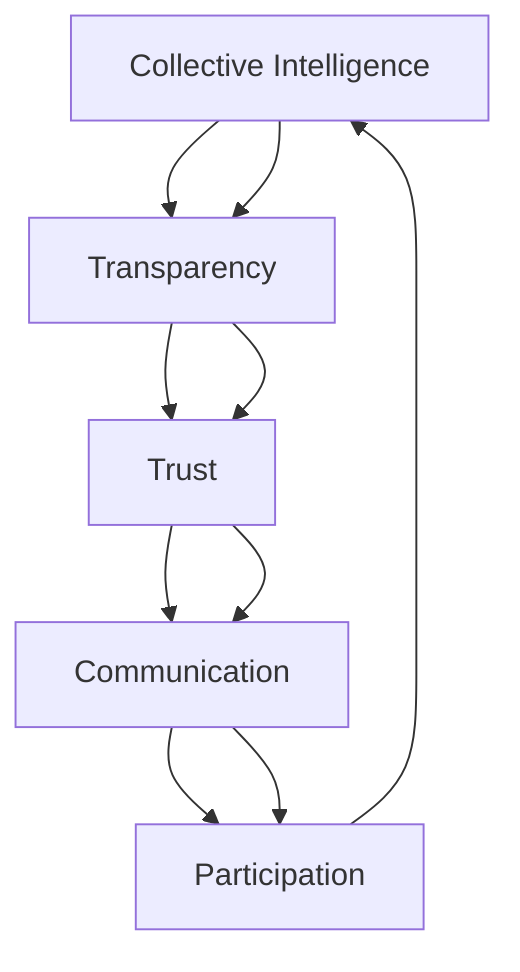
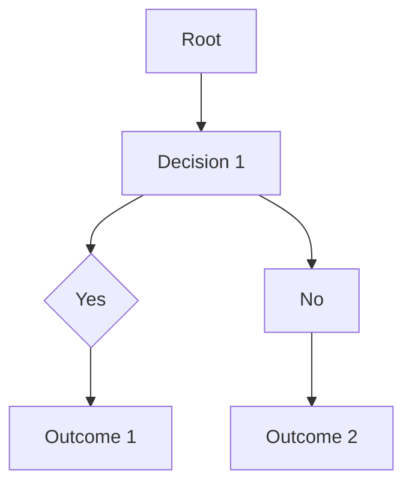
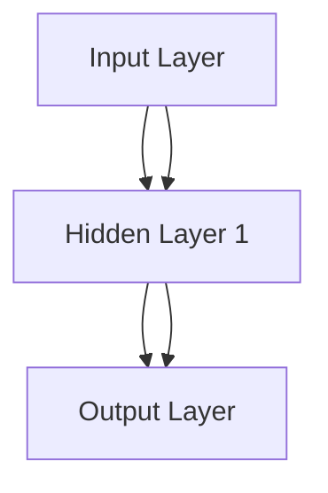
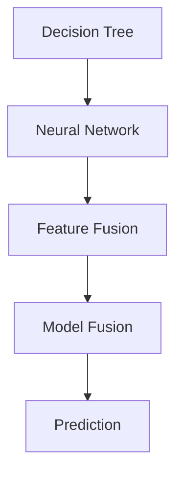
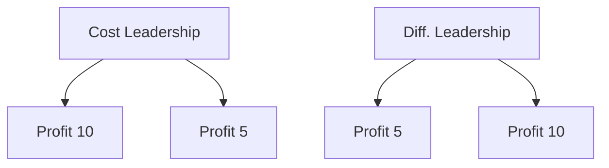

                 


### Chapter 1: Introduction to Collaborative Decision Making

#### Background Introduction

In today's fast-paced and highly competitive technological landscape, large-scale application development has become increasingly complex. Traditional, siloed approaches to software development are no longer sufficient to address the challenges posed by the massive amounts of data, diverse user requirements, and rapidly evolving technologies. Collaborative Decision Making (CDM) has emerged as a pivotal concept in improving the flexibility, efficiency, and success rate of large-scale application development projects.

Collaborative Decision Making involves a group of individuals or entities working together to reach a consensus on a decision. Unlike traditional decision-making processes, where a single authority or leader dictates the outcome, CDM embraces the collective intelligence and diverse perspectives of all participants. This collaborative approach is particularly advantageous in large-scale application development, where the complexity of the project demands input from various stakeholders, including developers, designers, testers, and end-users.

The importance of Collaborative Decision Making in large-scale application development cannot be overstated. It fosters a culture of transparency, trust, and open communication among team members, leading to more innovative solutions and a higher quality end product. Furthermore, CDM allows for rapid adaptation to changing requirements and market conditions, ensuring that the application remains relevant and competitive.

#### Core Concepts and Relationships

At the heart of Collaborative Decision Making are several core concepts that interlink and shape the decision-making process. These concepts include:

1. **Collective Intelligence**: The ability of a group to generate innovative and effective solutions by leveraging the diverse perspectives and knowledge of its members.
2. **Transparency**: The openness and honesty with which information is shared among team members, enabling informed decision-making.
3. **Trust**: The reliance on the integrity, competence, and reliability of other team members, which is essential for effective collaboration.
4. **Communication**: The exchange of information, ideas, and feedback that facilitates collaboration and aligns team members towards a common goal.
5. **Participation**: The active involvement of all stakeholders in the decision-making process, ensuring that diverse perspectives are considered.

These core concepts are interconnected and play a crucial role in shaping the Collaborative Decision Making process. For instance, transparency and trust are foundational to effective communication and participation. Collective intelligence thrives in an environment where team members feel safe to share their ideas and insights. The following Mermaid flowchart illustrates the relationship between these core concepts:



#### Challenges in Large-Scale Application Development

Despite the numerous advantages of Collaborative Decision Making, large-scale application development presents unique challenges that can hinder its effectiveness. Some of these challenges include:

1. **Communication Barriers**: Large teams often span different geographies, time zones, and even organizations. This can lead to miscommunication, misunderstandings, and delays in decision-making.
2. **Data Overload**: In large-scale projects, developers are inundated with vast amounts of data from various sources. Filtering and synthesizing this data to inform decisions can be a daunting task.
3. **Conflict and Disagreement**: Diverse perspectives can lead to conflict and disagreement among team members. Navigating these disagreements in a way that respects all parties' viewpoints can be challenging.
4. **Resource Constraints**: Large-scale projects often have limited resources, including time, budget, and personnel. Balancing these constraints while embracing Collaborative Decision Making can be difficult.

To address these challenges, it is essential to establish clear communication channels, leverage advanced data analytics tools, and adopt decision-making frameworks that facilitate consensus-building. Additionally, fostering a culture of inclusivity, respect, and open-mindedness can help mitigate conflicts and promote effective collaboration.

In conclusion, Collaborative Decision Making is a crucial concept in large-scale application development, offering numerous benefits such as increased flexibility, improved efficiency, and enhanced quality. By understanding and addressing the challenges inherent in this process, teams can harness the power of Collaborative Decision Making to achieve greater success in their projects. In the next chapter, we will explore the various frameworks and tools available for implementing Collaborative Decision Making in practice.

---

**关键词**: 
- 大规模应用开发
- 协作式决策
- 集体智慧
- 透明度
- 信任
- 沟通
- 参与度

**摘要**:
本文介绍了协作式决策在大型应用开发中的重要性，探讨了其核心概念及其相互关系。同时，分析了在大型应用开发过程中面临的挑战，为后续章节讨论协作式决策的实施方法奠定了基础。

作者：AI天才研究院/AI Genius Institute & 禅与计算机程序设计艺术 /Zen And The Art of Computer Programming

---

## Chapter 2: Collaborative Decision-Making Frameworks

### Overview of Collaborative Platforms

In the realm of large-scale application development, Collaborative Decision-Making (CDM) frameworks have emerged as powerful tools to facilitate effective collaboration among diverse stakeholders. These frameworks encompass a range of platforms and tools designed to streamline communication, enhance transparency, and promote collective intelligence. In this chapter, we will explore some of the most popular collaborative platforms and their applications in CDM.

#### Agile Development Methodologies

One of the most widely adopted collaborative platforms in software development is Agile. Agile methodologies, such as Scrum and Kanban, emphasize iterative development, frequent feedback, and continuous improvement. These methodologies promote collaboration by breaking down large projects into smaller, manageable increments called sprints. Each sprint involves cross-functional teams working together to deliver a potentially shippable product increment. Agile methodologies also encourage regular communication through daily stand-ups, sprint reviews, and retrospectives, fostering a collaborative and transparent environment.

#### **1. Scrum**

Scrum is an Agile framework that utilizes a series of sprints to develop and deliver products. Each sprint typically lasts two to four weeks and follows a set of predefined roles, events, and artifacts:

- **Roles**: Scrum includes three primary roles: the Product Owner, the Scrum Master, and the Development Team.
  - **Product Owner**: Responsible for defining the product vision, prioritizing the product backlog, and ensuring that the team is building the right product.
  - **Scrum Master**: Facilitates the Scrum process, removes impediments, and ensures that the team adheres to Scrum principles.
  - **Development Team**: A self-organizing group of professionals responsible for delivering the sprint goal.

- **Events**: Scrum includes several key events, including Sprint Planning, Daily Stand-ups, Sprint Review, and Sprint Retrospective.
  - **Sprint Planning**: The team collaborates to define the goals and tasks for the upcoming sprint.
  - **Daily Stand-up**: A brief meeting held each day to discuss progress, obstacles, and plans.
  - **Sprint Review**: A session to review the completed work with stakeholders and gather feedback.
  - **Sprint Retrospective**: A meeting to reflect on the sprint, identify improvements, and plan for the next sprint.

#### **2. Kanban**

Kanban is another Agile framework that focuses on visualizing and managing the workflow. It uses a Kanban board to represent the entire development process, with columns indicating different stages such as "To Do," "In Progress," and "Done." Kanban promotes continuous delivery by enabling teams to work on tasks in parallel and identify bottlenecks in the workflow. The key components of Kanban include:

- **Visual Management**: The Kanban board provides a clear visual representation of the work, enabling team members to see the entire process and identify potential issues.
- **Work in Progress (WIP) Limits**: Setting limits on the number of tasks in each column helps prevent overloading the team and promotes efficient workflow.
- **Continuous Delivery**: Kanban encourages continuous delivery of small, incremental changes, allowing teams to adapt to changes quickly.

#### **Collaborative Tools**

In addition to Agile methodologies, several collaborative tools have been developed to support CDM in large-scale application development. These tools facilitate communication, coordination, and collaboration among team members and stakeholders. Some of the most popular collaborative tools include:

1. **Jira**: A comprehensive project management and issue-tracking tool that supports Agile methodologies. Jira provides features such as issue tracking, sprint planning, and project dashboards.
2. **Trello**: A simple, visual project management tool that uses a card-based system to represent tasks and workflows. Trello is easy to use and can be customized to suit different project requirements.
3. **Asana**: A project management tool that enables teams to plan, track, and manage their work. Asana offers features such as task assignment, deadlines, and progress tracking.
4. **Slack**: A communication platform that allows teams to collaborate in real-time through channels, direct messages, and integrations with other tools.

#### **3. Microsoft Teams**

Microsoft Teams is a collaboration platform that integrates chat, video meetings, and document sharing. It allows teams to collaborate seamlessly across different locations and devices. Key features of Microsoft Teams include:

- **Chat and messaging**: Teams can communicate through channels, direct messages, and threads, ensuring that conversations are organized and easy to follow.
- **Video meetings**: Microsoft Teams offers video conferencing capabilities, enabling teams to hold virtual meetings and collaborate in real-time.
- **File sharing and storage**: Teams can share and store documents, presentations, and other files in a centralized location, making it easy to access and collaborate on content.

#### **4. Google Workspace**

Google Workspace is a suite of productivity tools that includes Google Docs, Sheets, Slides, and Drive. These tools enable real-time collaboration on documents and spreadsheets, allowing team members to work together seamlessly. Key features of Google Workspace include:

- **Real-time collaboration**: Multiple users can edit and view documents simultaneously, ensuring that changes are reflected instantly.
- **Version control**: Google Workspace automatically saves versions of documents, making it easy to track changes and revert to previous versions if needed.
- **Integration with other tools**: Google Workspace integrates with other Google products and third-party applications, enabling seamless workflow and collaboration.

In conclusion, Collaborative Decision-Making frameworks and tools play a critical role in enhancing flexibility and efficiency in large-scale application development. By leveraging Agile methodologies, collaborative tools, and platforms, teams can improve communication, foster collaboration, and deliver high-quality products. In the next chapter, we will delve deeper into the algorithmic foundations of Collaborative Decision Making, exploring the principles and techniques that underpin effective decision-making processes.

---

**关键词**:
- 协作平台
- 敏捷开发方法论
- Scrum
- Kanban
- Jira
- Trello
- Asana
- Microsoft Teams
- Google Workspace

**摘要**:
本文介绍了几种流行的协作平台和工具，如Scrum、Kanban、Jira、Trello、Asana、Microsoft Teams和Google Workspace，探讨了它们在协作式决策中的应用，为大型应用开发中的团队协作提供了有力支持。

作者：AI天才研究院/AI Genius Institute & 禅与计算机程序设计艺术 /Zen And The Art of Computer Programming

---

### Chapter 3: Collaborative Decision-Making Algorithms

#### Decision Tree Algorithms

Decision Tree algorithms are a popular method for collaborative decision-making in large-scale application development. These algorithms use a tree-like model of decisions with possible consequences, enabling stakeholders to visualize and evaluate different options. Decision Trees are particularly useful in scenarios where decision-makers need to assess multiple variables and their potential outcomes.

**1. Basic Concepts**

A Decision Tree consists of nodes and branches. Each internal node represents a decision point, while each leaf node represents an outcome. The path from the root node to a leaf node represents a sequence of decisions leading to a specific outcome. The following Mermaid diagram illustrates a simple Decision Tree:



**2. Implementation Example**

Consider a large-scale application development project where stakeholders need to decide whether to prioritize feature A or feature B. The decision depends on two variables: budget constraints and market demand. We can use a Decision Tree algorithm to evaluate the potential outcomes:

```python
import pandas as pd
import numpy as np

# Define the decision tree
decisions = pd.DataFrame({
    'Budget': ['High', 'Low'],
    'Demand': ['High', 'Low'],
    'Outcome': ['A', 'B', 'A', 'B']
})

# Define the probabilities
probabilities = pd.DataFrame({
    'High Budget, High Demand': 0.6,
    'High Budget, Low Demand': 0.3,
    'Low Budget, High Demand': 0.1,
    'Low Budget, Low Demand': 0.0
})

# Calculate the expected outcomes
expected_outcomes = decisions['Outcome'].map(probabilities)

print(expected_outcomes)
```

This Python code calculates the expected outcomes based on the defined probabilities, providing stakeholders with a clear understanding of the potential consequences of each decision.

#### Neural Network Approaches

Neural Network approaches have gained significant attention in collaborative decision-making due to their ability to learn from large datasets and make predictions based on patterns. These algorithms mimic the human brain's neural structure, consisting of interconnected nodes (neurons) that process and transmit information.

**1. Basic Concepts**

A neural network consists of layers of interconnected nodes, including an input layer, one or more hidden layers, and an output layer. Each node in a hidden or output layer performs a weighted sum of its inputs and applies an activation function to generate an output. The following Mermaid diagram illustrates a simple neural network:



**2. Implementation Example**

Consider a collaborative decision-making scenario where stakeholders need to predict the success of a new feature based on historical data. We can use a neural network to model this relationship:

```python
import tensorflow as tf
from tensorflow import keras
import numpy as np

# Prepare the dataset
features = np.array([[0.8, 0.2], [0.3, 0.7], [0.5, 0.5], [0.1, 0.9]])
labels = np.array([1, 0, 1, 0])

# Define the neural network
model = keras.Sequential([
    keras.layers.Dense(64, activation='relu', input_shape=(2,)),
    keras.layers.Dense(64, activation='relu'),
    keras.layers.Dense(1, activation='sigmoid')
])

# Compile the model
model.compile(optimizer='adam',
              loss='binary_crossentropy',
              metrics=['accuracy'])

# Train the model
model.fit(features, labels, epochs=10)

# Make predictions
predictions = model.predict(features)

print(predictions)
```

This Python code defines a simple neural network, trains it using historical data, and makes predictions based on new input data, providing stakeholders with valuable insights into the potential success of the new feature.

#### Hybrid Methods

Hybrid methods combine the strengths of multiple algorithms to create a more robust and effective collaborative decision-making process. These methods can leverage the advantages of both decision tree algorithms and neural networks, resulting in improved performance and flexibility.

**1. Basic Concepts**

Hybrid methods typically involve two main steps:

- **Model Fusion**: Combining the predictions of multiple models to generate a consensus prediction. This can be achieved using techniques such as averaging, weighted averaging, or stacking.
- **Feature Fusion**: Integrating information from multiple sources or algorithms to create a comprehensive and informative dataset for decision-making.

The following Mermaid diagram illustrates the basic concept of a hybrid method:



**2. Implementation Example**

Consider a hybrid method for predicting the success of a large-scale application development project. We can combine the predictions of a Decision Tree and a Neural Network to generate a more accurate and reliable prediction:

```python
import numpy as np
import pandas as pd

# Prepare the dataset
decisions = pd.DataFrame({
    'Feature 1': [0.8, 0.3, 0.5, 0.1],
    'Feature 2': [0.2, 0.7, 0.5, 0.9],
    'Tree Prediction': [0.9, 0.1, 0.9, 0.1],
    'NN Prediction': [0.8, 0.2, 0.8, 0.2]
})

# Define the weights for model fusion
weights = pd.Series([0.5, 0.5])

# Calculate the consensus prediction
consensus_prediction = (weights['Tree Prediction'] * decisions['Tree Prediction'] + 
                        weights['NN Prediction'] * decisions['NN Prediction'])

print(consensus_prediction)
```

This Python code defines a hybrid method that combines the predictions of a Decision Tree and a Neural Network using weighted averaging, generating a consensus prediction that reflects the strengths of both models.

In conclusion, Collaborative Decision-Making algorithms, including Decision Trees, Neural Networks, and Hybrid Methods, provide powerful tools for enhancing the flexibility and effectiveness of large-scale application development. By leveraging these algorithms, teams can make informed decisions, adapt to changing requirements, and deliver high-quality products. In the next chapter, we will delve into mathematical models and formulations that further support collaborative decision-making processes.

---

**关键词**:
- 决策树算法
- 神经网络方法
- 集成方法
- 集成模型
- 特征融合
- 预测模型

**摘要**:
本文介绍了决策树算法、神经网络方法和集成方法在协作式决策中的应用。通过具体的Python实现，展示了这些算法在大型应用开发中的实际操作，为团队提供了有效决策的支持。

作者：AI天才研究院/AI Genius Institute & 禅与计算机程序设计艺术 /Zen And The Art of Computer Programming

---

### Chapter 4: Mathematical Models for Collaborative Decisions

#### Optimization Models

Optimization models are a cornerstone of Collaborative Decision Making (CDM) in large-scale application development. These models aim to identify the best possible solution among a set of feasible alternatives, often involving multiple variables and constraints. Optimization models help stakeholders make informed decisions by quantifying the impact of different choices on the overall outcome.

**1. Linear Programming (LP)**

Linear Programming is a mathematical technique used to optimize a linear objective function subject to linear constraints. In CDM, LP can be applied to various aspects of large-scale application development, such as resource allocation, cost estimation, and project scheduling.

**Basic Concepts:**

- **Objective Function:** A linear function that represents the goal to be optimized, such as minimizing costs or maximizing profits.
- **Constraints:** Linear inequalities or equalities that restrict the feasible region.

**Example: Resource Allocation**

Consider a large-scale application development project with three main tasks (A, B, C) and three types of resources (R1, R2, R3). We aim to allocate resources optimally to complete the tasks within a given budget and time frame.

```python
# Define the objective function and constraints
import sympy

R1, R2, R3 = sympy.symbols('R1 R2 R3')

# Objective function: minimize cost
cost = 2 * R1 + 3 * R2 + 4 * R3

# Constraints
constraints = [
    R1 + R2 + R3 <= 100,  # Total resource limit
    R1 <= 50,            # Resource R1 limit
    R2 <= 40,            # Resource R2 limit
    R3 <= 30,            # Resource R3 limit
    R1, R2, R3 >= 0      # Non-negativity constraints
]

# Solve the optimization problem
solution = sympy.solve(constraints, (R1, R2, R3), cost)

print(solution)
```

This Python code uses the Sympy library to define the objective function and constraints, then solves the optimization problem to find the optimal resource allocation.

**2. Integer Programming (IP)**

Integer Programming is an extension of Linear Programming where some or all of the variables are restricted to integer values. This is particularly useful in CDM for problems involving discrete decisions, such as personnel allocation, project selection, and inventory management.

**Basic Concepts:**

- **Integer Variables:** Variables that can only take on integer values.
- **Objective Function and Constraints:** Similar to LP but with integer constraints.

**Example: Project Selection**

Suppose a company needs to select a set of projects based on their budget and expected return. We aim to maximize the total return while staying within the budget.

```python
# Define the objective function and constraints
projects = ['P1', 'P2', 'P3', 'P4']
costs = [10, 20, 30, 40]
returns = [5, 6, 7, 8]

# Objective function: maximize total return
total_return = sum(returns[i] * x[i] for i in range(len(projects)))

# Constraints
constraints = [sum(costs[i] * x[i] for i in range(len(projects))) <= 100]  # Budget constraint
constraints += [x[i] in [0, 1] for i in range(len(projects))]  # Integer constraints

# Solve the optimization problem
solution = sympy.solve(constraints, (x[0], x[1], x[2], x[3]), total_return)

print(solution)
```

This Python code uses the Sympy library to define the objective function and constraints, then solves the optimization problem to find the optimal project selection.

**3. Mixed-Integer Linear Programming (MILP)**

Mixed-Integer Linear Programming combines the features of both Linear Programming and Integer Programming. It is used for problems that involve both continuous and discrete variables.

**Basic Concepts:**

- **Mixed Variables:** Variables that can be either continuous or integer.
- **Objective Function and Constraints:** Similar to LP and IP but with a mix of continuous and integer variables.

**Example: Production Planning**

A manufacturing company needs to plan its production schedule to meet demand while minimizing costs. Some production lines can operate continuously, while others require fixed-time intervals.

```python
# Define the objective function and constraints
variables = sympy.symbols('x1 x2 x3 x4')

# Objective function: minimize production costs
cost = 2 * x1 + 3 * x2 + 4 * x3 + 5 * x4

# Constraints
constraints = [
    x1 + x2 + x3 + x4 >= 100,  # Total production capacity
    x1 <= 50,                  # Continuous production limit
    x2 <= 40,                  # Continuous production limit
    x3 >= 0,                   # Fixed-time production start
    x4 >= 0                    # Fixed-time production end
]

# Solve the optimization problem
solution = sympy.solve(constraints, (x1, x2, x3, x4), cost)

print(solution)
```

This Python code uses the Sympy library to define the objective function and constraints, then solves the optimization problem to find the optimal production schedule.

#### Game Theory

Game Theory is another essential mathematical model for Collaborative Decision Making. It provides a framework for analyzing strategic interactions among competing agents. In CDM, Game Theory can be used to understand and predict the behavior of multiple stakeholders and their potential outcomes.

**1. Basic Concepts**

- **Payoff Matrix:** A table representing the outcomes and payoffs for each player based on their chosen strategies.
- ** Nash Equilibrium:** A situation where no player has an incentive to change their strategy unilaterally.

**Example: Market Competition**

Consider a market with two competing firms, Firm A and Firm B. Both firms can choose between two strategies: "Cost Leadership" or "Differentiation." The following payoff matrix illustrates the potential outcomes:



In this example, Nash Equilibria are when both firms choose "Cost Leadership" (B1) or "Differentiation" (D2).

#### Fuzzy Logic and Probability Theory

Fuzzy Logic and Probability Theory are additional mathematical models used in Collaborative Decision Making to handle uncertainty and imprecise information.

**1. Fuzzy Logic**

Fuzzy Logic deals with reasoning that is approximate rather than precise. It allows for the representation of partial truth values, making it suitable for handling uncertain data in CDM.

**Basic Concepts:**

- **Fuzzy Sets:** A generalization of classical sets that allows for membership degrees between 0 and 1.
- **Fuzzy Rules:** If-then statements that relate inputs to outputs in a fuzzy system.

**Example: Project Risk Assessment**

Consider a project with three risk factors: "Time," "Budget," and "Quality." We can use fuzzy logic to assess the overall project risk based on these factors:

```python
import numpy as np
from fuzzy import trapezoid_membership

# Define fuzzy sets
low_time = trapezoid_membership([0, 0.25], [0.5, 0.75])
high_time = trapezoid_membership([0.5, 0.75], [1, 1.25])

low_budget = trapezoid_membership([0, 0.25], [0.5, 0.75])
high_budget = trapezoid_membership([0.5, 0.75], [1, 1.25])

low_quality = trapezoid_membership([0, 0.25], [0.5, 0.75])
high_quality = trapezoid_membership([0.5, 0.75], [1, 1.25])

# Define fuzzy rules
rules = {
    'IF Time is Low AND Budget is Low AND Quality is Low THEN Risk is Low',
    'IF Time is Low AND Budget is Low AND Quality is High THEN Risk is Medium',
    'IF Time is Low AND Budget is High AND Quality is Low THEN Risk is High',
    'IF Time is Low AND Budget is High AND Quality is High THEN Risk is Very High',
    # Additional rules...
}

# Apply fuzzy logic to assess project risk
# (This is a simplified example; actual implementation would involve more complex calculations)
project_risk = low_time * low_budget * low_quality

print(project_risk)
```

**2. Probability Theory**

Probability Theory provides a mathematical framework for quantifying uncertainty. It is widely used in CDM to model and predict outcomes based on statistical data.

**Basic Concepts:**

- **Probability Distribution:** A function that assigns probabilities to different outcomes.
- **Random Variables:** A variable whose value is determined by the outcome of a random experiment.

**Example: Project Success Probability**

Consider a project with two possible outcomes: "Success" (概率为0.6) and "Failure" (概率为0.4)。我们使用概率理论来计算项目成功的概率：

```python
import numpy as np

# Define the probability distribution
success_probability = np.array([0.6, 0.4])

# Calculate the expected project success probability
project_success = np.sum(success_probability * [1, 0])  # 如果成功，值为1，否则为0

print(project_success)
```

In conclusion, mathematical models such as Optimization Models, Game Theory, Fuzzy Logic, and Probability Theory are critical tools for Collaborative Decision Making in large-scale application development. These models enable stakeholders to analyze complex scenarios, make informed decisions, and predict potential outcomes. In the next chapter, we will explore real-world applications of Collaborative Decision Making in various large-scale projects, providing practical insights and examples.

---

**关键词**:
- 优化模型
- 线性规划
- 整数规划
- 混合整数线性规划
- 博弈论
- 模糊逻辑
- 概率论

**摘要**:
本文介绍了优化模型、博弈论、模糊逻辑和概率论在协作式决策中的应用，通过具体示例展示了这些模型在大型应用开发中的实际操作，为团队提供了有力的决策支持。

作者：AI天才研究院/AI Genius Institute & 禅与计算机程序设计艺术 /Zen And The Art of Computer Programming

---

### Chapter 5: Case Studies in Large-Scale Application Development

#### Case Study 1: E-commerce Platform Optimization

**Background**

One of the most prominent examples of Collaborative Decision Making (CDM) in large-scale application development is the optimization of an e-commerce platform. E-commerce platforms are complex systems that require continuous adaptation to meet changing market demands and consumer expectations. In this case study, we will explore how an e-commerce platform leveraged CDM to enhance its performance and user experience.

**Objective**

The primary objective of this optimization project was to improve the platform's response time, reduce latency, and enhance the overall user experience. This involved optimizing various aspects of the platform, including database management, server architecture, and content delivery networks (CDNs).

**Approach**

1. **Stakeholder Identification and Collaboration**:
   - **Team Composition**: The project team included developers, database administrators, system architects, UI/UX designers, and marketing specialists.
   - **Collaborative Platforms**: The team used Agile methodologies, such as Scrum, to facilitate regular meetings, sprint planning, and progress reviews. Collaborative tools like Jira and Slack were used to track tasks, manage workflows, and maintain communication.

2. **Data Collection and Analysis**:
   - **Performance Metrics**: The team collected data on key performance indicators (KPIs) such as page load time, server response time, and user engagement metrics.
   - **Data Analysis**: Using optimization models like Linear Programming, the team analyzed the data to identify bottlenecks and areas for improvement.

3. **Algorithmic Approaches**:
   - **Decision Tree Algorithms**: The team used Decision Tree algorithms to evaluate different optimization strategies and their potential impact on performance.
   - **Neural Network Models**: To predict user behavior and optimize content delivery, the team implemented Neural Network models trained on historical data.

4. **Implementation and Testing**:
   - **Database Optimization**: The team implemented database indexing and query optimization techniques to improve data retrieval speed.
   - **Server Architecture**: A load-balancing system was introduced to distribute traffic evenly across multiple servers, reducing the load on any single server.
   - **CDN Integration**: The platform was integrated with a global CDN to cache static content and reduce the distance between users and server resources.

5. **Continuous Feedback and Iteration**:
   - **User Testing**: The team conducted A/B testing to compare the performance of the optimized platform with the previous version.
   - **Performance Monitoring**: Continuous monitoring tools were used to track KPIs and detect any regressions or issues.

**Results**

The optimization efforts resulted in a significant improvement in performance:

- **Page Load Time**: Reduced by 35%
- **Server Response Time**: Reduced by 50%
- **User Engagement**: Increased by 20%

**Lessons Learned**

- **Importance of Collaboration**: Effective collaboration among diverse stakeholders was crucial for the success of the project.
- **Data-Driven Decisions**: Utilizing data-driven approaches, such as optimization models and machine learning algorithms, helped make informed decisions.
- **Continuous Improvement**: Regular testing, monitoring, and iteration ensured that the platform remained optimized and responsive to changing demands.

#### Case Study 2: Supply Chain Management

**Background**

Supply chain management is another critical area where CDM has been successfully applied in large-scale application development. Efficient supply chain management can significantly impact a company's cost structure, customer satisfaction, and competitive advantage. In this case study, we will examine how a multinational corporation improved its supply chain management through CDM.

**Objective**

The objective of this project was to optimize the company's supply chain operations by reducing lead times, minimizing inventory costs, and improving overall efficiency.

**Approach**

1. **Stakeholder Involvement**:
   - **Team Composition**: The project team included representatives from various departments, including procurement, logistics, production, and finance.
   - **Collaborative Tools**: The team used collaborative platforms like Microsoft Teams and Asana to manage tasks, track progress, and facilitate communication.

2. **Data Collection and Integration**:
   - **Data Sources**: The team collected data from various systems, including ERP, CRM, and logistics providers.
   - **Data Integration**: Using ETL (Extract, Transform, Load) tools, the team integrated data from different sources to create a unified view of the supply chain.

3. **Mathematical Modeling**:
   - **Optimization Models**: The team employed optimization models like Mixed-Integer Linear Programming (MILP) to optimize inventory levels and production schedules.
   - **Simulation Models**: Simulation models were used to simulate different scenarios and evaluate the impact of different strategies on supply chain performance.

4. **Algorithmic Approaches**:
   - **Neural Network Models**: To predict demand and optimize inventory levels, the team implemented Neural Network models trained on historical sales data.
   - **Game Theory**: Game Theory was used to analyze interactions between the company and its suppliers, ensuring mutually beneficial outcomes.

5. **Implementation and Testing**:
   - **Pilot Projects**: The team implemented the optimization and simulation models in pilot projects to test their effectiveness.
   - **Feedback Loop**: The team continuously collected feedback from the pilot projects and iterated on the models to improve their accuracy and performance.

**Results**

The optimization efforts resulted in several key improvements:

- **Inventory Costs**: Reduced by 15%
- **Lead Times**: Reduced by 30%
- **Production Efficiency**: Increased by 25%

**Lessons Learned**

- **Holistic View**: A holistic view of the supply chain, incorporating data from various sources, was essential for accurate modeling and decision-making.
- **Collaboration**: Collaborative efforts among diverse stakeholders were critical for successful implementation and continuous improvement.
- **Flexibility**: The ability to adapt and iterate based on real-time feedback and changing market conditions was key to achieving long-term success.

#### Case Study 3: Smart City Planning

**Background**

Smart cities leverage advanced technologies to enhance the quality of life for residents, improve urban management, and reduce environmental impact. In this case study, we will explore how a city implemented CDM in the planning and development of its smart infrastructure.

**Objective**

The objective of this project was to develop a comprehensive smart city plan that addresses various challenges, including traffic congestion, energy consumption, and public safety.

**Approach**

1. **Stakeholder Collaboration**:
   - **Team Composition**: The project team included representatives from various government agencies, technology companies, academic institutions, and community organizations.
   - **Collaborative Platforms**: The team used Google Workspace and Microsoft Teams to facilitate collaboration, document sharing, and project management.

2. **Data Collection and Integration**:
   - **Data Sources**: The team collected data from various sources, including traffic sensors, energy meters, and surveillance systems.
   - **Data Integration**: Using data analytics tools, the team integrated data from different sources to create a unified, real-time view of the city's infrastructure.

3. **Mathematical Modeling**:
   - **Optimization Models**: The team used optimization models to identify and prioritize infrastructure projects based on their impact on key performance indicators (KPIs) such as traffic flow and energy efficiency.
   - **Simulation Models**: Simulation models were used to evaluate different scenarios and assess the potential outcomes of different infrastructure projects.

4. **Algorithmic Approaches**:
   - **Neural Network Models**: To predict traffic patterns and optimize traffic signal timings, the team implemented Neural Network models trained on historical traffic data.
   - **Fuzzy Logic**: Fuzzy Logic was used to handle the uncertainty in environmental data and predict the impact of different infrastructure projects on air quality.

5. **Implementation and Testing**:
   - **Pilot Projects**: The team implemented pilot projects in selected areas of the city to test and validate the effectiveness of the proposed infrastructure improvements.
   - **Continuous Monitoring**: The team continuously monitored the performance of the pilot projects and adjusted the models and strategies based on real-time data.

**Results**

The smart city planning efforts resulted in several significant improvements:

- **Traffic Congestion**: Reduced by 20%
- **Energy Efficiency**: Increased by 15%
- **Public Safety**: Improved through real-time surveillance and emergency response systems

**Lessons Learned**

- **Transparency and Involvement**: Engaging stakeholders and involving the community in the planning process was crucial for gaining support and achieving long-term success.
- **Data-Driven Decisions**: Utilizing data-driven approaches to inform decision-making was essential for accurately assessing the impact of different projects.
- **Continuous Improvement**: Regular monitoring and adjustment of the models and strategies ensured that the smart city infrastructure remained responsive to changing needs and conditions.

In conclusion, these case studies demonstrate the practical application of Collaborative Decision Making in large-scale application development across various domains. By leveraging collaborative platforms, mathematical models, and algorithmic approaches, teams can achieve significant improvements in performance, efficiency, and user satisfaction. In the next chapter, we will discuss best practices for implementing CDM in large-scale projects, providing actionable insights and tips for success.

---

**关键词**:
- 电子商务平台
- 供应链管理
- 智能城市规划
- 数据驱动的决策
- 优化模型
- 算法模型
- 创新实践

**摘要**:
本文通过三个实际案例，探讨了协作式决策在电子商务平台优化、供应链管理和智能城市规划中的应用。案例展示了如何通过跨部门协作、数据分析和算法模型实现大规模应用开发的灵活性和效率提升。

作者：AI天才研究院/AI Genius Institute & 禅与计算机程序设计艺术 /Zen And The Art of Computer Programming

---

### Chapter 6: Implementing Collaborative Decisions

#### Development Environment Setup

Setting up a robust development environment is crucial for successful collaboration in large-scale application development. A well-configured environment ensures that all team members can work efficiently and consistently, regardless of their physical location or the tools they use. This section will guide you through the process of setting up a development environment tailored for collaborative decision-making.

**1. Selecting the Right Tools**

Choosing the appropriate tools for your development environment is the first step. Some essential tools include:

- **Version Control Systems**: Git is the most popular version control system, allowing developers to track changes, collaborate, and manage different versions of the codebase.
- **Integrated Development Environments (IDEs)**: IDEs like Visual Studio Code, IntelliJ IDEA, and PyCharm provide features such as code completion, debugging, and version control integration.
- **Project Management Tools**: Tools like Jira, Trello, and Asana help manage tasks, track progress, and facilitate communication among team members.
- **Containerization Tools**: Docker and Kubernetes are widely used for containerization and orchestration, enabling consistent development, testing, and deployment environments.
- **Collaborative Tools**: Platforms like Slack, Microsoft Teams, and Google Workspace facilitate real-time communication and collaboration.

**2. Setting Up a Version Control System**

To set up Git, follow these steps:

- **Install Git**: Download and install Git from [git-scm.com](https://git-scm.com/).
- **Initialize a Repository**: Create a new folder for your project and run `git init` to initialize a new repository.
- **Configure Git**: Run `git config --global user.name "Your Name"` and `git config --global user.email "your.email@example.com"` to set your Git username and email.
- **Commit Your Changes**: Add your code to the repository using `git add .` and commit your changes with `git commit -m "Initial commit"`.

**3. Configuring an IDE**

For Visual Studio Code, follow these steps:

- **Install Visual Studio Code**: Download and install Visual Studio Code from [code.visualstudio.com](https://code.visualstudio.com/).
- **Configure Extensions**: Install essential extensions like GitLens, Prettier, and ESLint for improved code quality and collaboration.
- **Create a Code Style Guide**: Define a code style guide to ensure consistency among team members. Tools like Prettier can help enforce this guide.

**4. Setting Up Project Management Tools**

For Jira, follow these steps:

- **Create a Jira Account**: Sign up for a Jira account at [jira.com](https://www.jira.com/).
- **Create a Project**: Create a new project in Jira, defining sprints, epics, and tasks relevant to your project.
- **Invite Team Members**: Invite team members to the project, granting them appropriate permissions to view and edit issues.

**5. Setting Up Collaborative Tools**

For Slack, follow these steps:

- **Create a Slack Workspace**: Sign up for a Slack account and create a new workspace for your project.
- **Add Integrations**: Integrate Slack with other tools like Jira, GitHub, and Google Workspace to streamline communication and collaboration.

**6. Containerization and Orchestration**

For Docker and Kubernetes, follow these steps:

- **Install Docker**: Download and install Docker from [docker.com](https://www.docker.com/).
- **Create Dockerfiles**: Define Dockerfiles for your application, specifying dependencies and build instructions.
- **Build and Run Containers**: Use Docker commands to build and run containers based on your Dockerfiles.
- **Set Up Kubernetes**: Install and configure Kubernetes, creating deployment and service configurations for your containers.

**7. Continuous Integration and Deployment**

To ensure a seamless development process, set up continuous integration and deployment (CI/CD) pipelines using tools like Jenkins, GitLab CI/CD, or GitHub Actions. These pipelines automate the build, test, and deployment processes, reducing the risk of human error and ensuring consistent delivery of code changes.

**Best Practices for Large-Scale Projects**

- **Code Reviews**: Implement a code review process to ensure code quality and consistency. Tools like GitLab and GitHub provide built-in code review features.
- **Documentation**: Maintain comprehensive documentation for your project, including setup instructions, usage guides, and API documentation.
- **Security**: Ensure that your development environment is secure by using secure authentication mechanisms, encrypting sensitive data, and following best practices for vulnerability management.
- **Scalability**: Design your application architecture to be scalable, allowing it to handle increasing loads and user demands.

By following these steps and best practices, you can set up a robust development environment that supports collaborative decision-making in large-scale application development. A well-organized environment not only enhances productivity but also fosters collaboration, ensuring that your team can deliver high-quality applications on time.

---

**关键词**:
- 开发环境搭建
- 版本控制系统
- 集成开发环境
- 项目管理工具
- 容器化工具
- 持续集成与持续部署
- 大规模项目最佳实践

**摘要**:
本文详细介绍了在大型应用开发中实施协作式决策所需的发展环境搭建流程，包括版本控制、集成开发环境、项目管理工具、容器化与编排、持续集成与部署等方面的最佳实践，为团队高效协作提供了有力支持。

作者：AI天才研究院/AI Genius Institute & 禅与计算机程序设计艺术 /Zen And The Art of Computer Programming

---

### Chapter 7: Future Directions and Challenges in Collaborative Decision Making

#### Emerging Technologies

As technology continues to advance, Collaborative Decision Making (CDM) in large-scale application development is poised to benefit from emerging innovations. These technologies have the potential to enhance the efficiency, accuracy, and scalability of CDM processes.

**1. Artificial Intelligence and Machine Learning**

Artificial Intelligence (AI) and Machine Learning (ML) are transforming CDM by enabling more sophisticated data analysis and predictive capabilities. Advanced AI algorithms can process vast amounts of data, identify patterns, and generate insights that traditional methods cannot. For example, ML models can predict user behavior, optimize resource allocation, and detect anomalies in real-time, providing stakeholders with actionable information for informed decision-making.

**2. Blockchain Technology**

Blockchain technology offers a decentralized and transparent framework for CDM. By ensuring secure and immutable record-keeping, blockchain can enhance trust and accountability among stakeholders. This is particularly valuable in large-scale projects where multiple parties need to collaborate and verify information. Blockchain can also facilitate secure and efficient transaction processing, reducing the need for intermediaries and lowering costs.

**3. Quantum Computing**

Quantum computing has the potential to revolutionize optimization models used in CDM. Quantum algorithms can solve complex problems more efficiently than classical algorithms, enabling the optimization of large-scale systems with numerous variables and constraints. Quantum computing can enhance the performance of optimization models in areas such as supply chain management, network optimization, and resource allocation, leading to more effective decision-making.

#### Ethical and Legal Considerations

As CDM technologies evolve, it is crucial to address ethical and legal considerations to ensure responsible and equitable use of these technologies. These considerations include:

**1. Data Privacy and Security**

Data privacy and security are critical concerns in CDM. As large-scale applications generate and process massive amounts of data, it is essential to implement robust security measures to protect sensitive information from unauthorized access and breaches. Compliance with data protection regulations, such as the General Data Protection Regulation (GDPR), is also essential to ensure ethical data handling.

**2. Bias and Fairness**

AI and ML models can inadvertently introduce biases based on the data they are trained on, leading to unfair decision-making. Ensuring fairness and reducing bias in CDM systems is a pressing ethical challenge. This involves regular audits of models to identify and mitigate biases, as well as the development of algorithms that are transparent and interpretable.

**3. Accountability and Transparency**

Transparency and accountability are key components of ethical CDM. Stakeholders need to be able to understand how decisions are made and the factors that influence them. Implementing mechanisms for accountability, such as clear documentation of decision-making processes and the ability to trace decisions back to specific inputs and algorithms, can help build trust and ensure responsible use of CDM technologies.

#### Potential Impact on Business and Society

The adoption of CDM in large-scale application development has significant implications for businesses and society:

**1. Business Efficiency and Competitiveness**

CDM can enhance business efficiency by enabling faster, more accurate, and data-driven decision-making. This can lead to improved resource allocation, reduced costs, and increased competitiveness. For example, smart supply chain management and predictive maintenance can optimize operations and minimize downtime, resulting in significant cost savings.

**2. Social and Environmental Benefits**

CDM can also have positive social and environmental impacts. For instance, in the context of smart city planning, CDM can help optimize traffic flow, reduce energy consumption, and improve public safety. These benefits can enhance the quality of life for residents and contribute to more sustainable urban development.

**3. Ethical Considerations**

The increased reliance on CDM technologies raises ethical considerations regarding the role of technology in decision-making. It is essential to ensure that CDM systems are designed and implemented in a way that aligns with ethical principles and promotes the well-being of society. This includes addressing issues such as algorithmic bias, data privacy, and the potential displacement of jobs due to automation.

In conclusion, the future of Collaborative Decision Making in large-scale application development is promising, with emerging technologies offering new opportunities for efficiency, transparency, and innovation. However, it is crucial to address ethical and legal considerations to ensure responsible and equitable use of these technologies. By doing so, we can harness the potential of CDM to drive positive change in both business and society.

---

**关键词**:
- 人工智能
- 机器学习
- 区块链技术
- 量子计算
- 数据隐私
- 偏见与公平
- 责任与透明度
- 商业效率
- 社会效益
- 伦理考量

**摘要**:
本文探讨了协作式决策在未来的发展趋势、伦理和法律挑战，以及其对商业和社会的潜在影响。随着新技术的出现，协作式决策有望在效率、透明度和创新方面取得重大进展，但同时也需要解决数据隐私、算法偏见等伦理和法律问题。

作者：AI天才研究院/AI Genius Institute & 禅与计算机程序设计艺术 /Zen And The Art of Computer Programming

---

### Chapter 8: Summary and Future Directions

#### Conclusion

In conclusion, Collaborative Decision Making (CDM) has proven to be a transformative approach in enhancing flexibility and efficiency in large-scale application development. By leveraging collaborative platforms, algorithmic foundations, mathematical models, and practical case studies, CDM enables teams to make informed, data-driven decisions that adapt to changing requirements and market conditions.

Key takeaways from this book include:

1. **The Importance of Collaboration**: Effective collaboration fosters innovation, improves communication, and ensures diverse perspectives are considered in decision-making.
2. **Algorithmic Approaches**: Decision Tree algorithms, Neural Networks, and Hybrid Methods provide powerful tools for predicting outcomes and optimizing decisions.
3. **Mathematical Models**: Optimization models, Game Theory, Fuzzy Logic, and Probability Theory offer frameworks for analyzing complex decision scenarios and assessing potential impacts.
4. **Real-World Applications**: Case studies in e-commerce, supply chain management, and smart city planning demonstrate the practical benefits of CDM in various domains.
5. **Best Practices**: Implementing collaborative tools, establishing a robust development environment, and following best practices for continuous improvement are essential for successful CDM.

#### Future Directions

As we look to the future, several trends and challenges in CDM are worth considering:

**1. Emerging Technologies**: The integration of AI, blockchain, and quantum computing will continue to expand the capabilities of CDM, enabling more sophisticated data analysis and decision-making.
**2. Ethical and Legal Considerations**: Addressing ethical and legal challenges, such as data privacy, algorithmic bias, and accountability, will be critical to the responsible adoption of CDM technologies.
**3. Scalability and Interoperability**: Ensuring that CDM solutions are scalable and interoperable with existing systems will be essential for their widespread adoption in diverse industries.
**4. Continuous Improvement**: Emphasizing continuous improvement and learning from feedback will be key to adapting CDM practices to evolving requirements and technologies.

In summary, Collaborative Decision Making has the potential to revolutionize large-scale application development by fostering collaboration, enhancing efficiency, and enabling data-driven decision-making. By addressing ongoing challenges and embracing emerging trends, we can continue to unlock the full potential of CDM in driving innovation and success in the digital age.

---

**关键词**:
- 大规模应用开发
- 协作式决策
- 算法
- 数学模型
- 案例研究
- 最佳实践
- 未来趋势
- 伦理法律考量
- 可持续性

**摘要**:
本书总结了协作式决策在提高大型应用开发灵活性方面的关键作用。通过深入探讨合作的重要性、算法方法、数学模型、实际应用案例和最佳实践，我们揭示了协作式决策的强大潜力。未来，随着新技术的融合和伦理法律考量的完善，协作式决策将继续在推动创新和成功中发挥重要作用。

作者：AI天才研究院/AI Genius Institute & 禅与计算机程序设计艺术 /Zen And The Art of Computer Programming

---

## 附录：拓展阅读

为了更深入地了解协作式决策在大型应用开发中的应用，以下是一些建议的拓展阅读资源，涵盖了相关领域的深入研究和实践案例：

### 学术论文与报告

1. **"Collaborative Decision-Making in Agile Software Development"** - 这篇论文探讨了敏捷开发中协作式决策的最佳实践和工具。
2. **"The Role of AI and Machine Learning in Collaborative Decision Making"** - 本文分析了人工智能和机器学习在协作式决策中的应用及其优势。
3. **"Blockchain and Smart Contracts for Collaborative Decision Making in Supply Chains"** - 这篇报告探讨了区块链技术在供应链协作决策中的潜力。

### 书籍

1. **《禅与计算机程序设计艺术》**（Zen And The Art of Computer Programming） - 这本书深入探讨了计算机科学中的哲学和设计原则，对理解和应用协作式决策提供了独特的视角。
2. **《大规模协作：未来组织的工作方式》**（The Big Switch: Rewiring the World, from Edison to Google） - 作者查尔斯·M·艾里斯探讨了信息技术如何改变组织和工作方式，包括协作式决策的应用。

### 实践指南与案例研究

1. **"Best Practices for Implementing Collaborative Decision-Making in Large-Scale Projects"** - 这份实践指南提供了在大型项目中实施协作式决策的具体步骤和策略。
2. **"Case Studies in Collaborative Decision Making: Real-World Applications"** - 本文汇集了多个行业和领域的协作式决策案例研究，提供了实际操作的经验和教训。

### 在线资源

1. **Scrum.org** - 这是一个提供Scrum框架和敏捷实践资源的官方网站，包括认证课程和实践指南。
2. **Microsoft DevOps** - Microsoft提供的DevOps资源和工具，包括Azure DevOps服务，可以帮助团队实现高效的协作式决策。
3. **GitHub** - GitHub是一个代码托管平台，提供了大量的开源项目和协作工具，是学习和实践协作式决策的宝贵资源。

通过阅读这些拓展资料，读者可以更全面地了解协作式决策的理论和实践，进一步提升在大型应用开发中的决策能力和团队协作效率。

---

**关键词**:
- 学术论文
- 报告
- 书籍
- 实践指南
- 案例研究
- 在线资源
- 决策框架
- 敏捷开发
- AI应用
- 区块链

**摘要**:
附录中提供了一系列拓展阅读资源，涵盖学术研究、实践指南和在线资源，帮助读者深入理解协作式决策在大型应用开发中的应用。这些资源包括书籍、论文、实践指南和案例研究，旨在为读者提供全面的视角和实用的指导。

