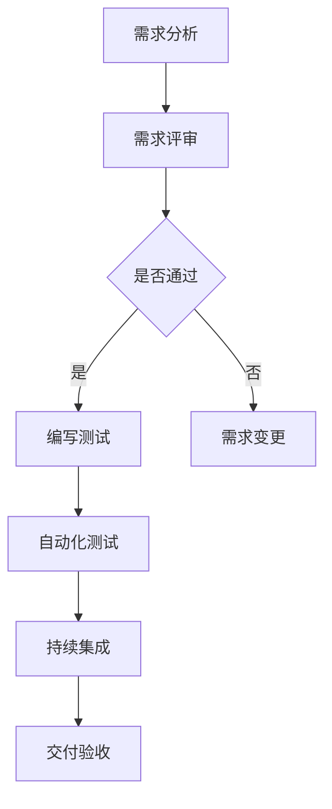

                 

# 《协作式需求验收：提高大型应用的交付质量》

关键词：协作式需求验收，大型应用，交付质量，敏捷开发，持续集成，测试驱动开发

摘要：本文将深入探讨协作式需求验收在提高大型应用交付质量中的作用。通过分析敏捷开发、持续集成和测试驱动开发等核心概念，本文将阐述协作式需求验收的原理和方法，并提供实际案例来展示其在大型应用开发中的应用效果。最后，本文将总结最佳实践，为读者提供有效的建议和指导。

## 1. 背景介绍

在当今快速发展的信息技术时代，大型应用的开发已经成为企业和组织核心竞争力的重要组成部分。然而，随着项目规模的扩大和复杂性的增加，如何确保这些应用的交付质量成为一个亟待解决的问题。传统的需求验收方式往往依赖于单一团队的审查和测试，容易导致信息不对称、沟通障碍和需求变更等问题，从而影响交付质量。

协作式需求验收作为一种新兴的需求验收方法，通过促进团队成员之间的协作和沟通，提高需求的准确性和完整性，从而提高大型应用的交付质量。本文将围绕协作式需求验收这一主题，分析其核心概念、原理和方法，并提供实际案例来验证其有效性。

## 2. 核心概念与联系

### 2.1 敏捷开发

敏捷开发是一种以人为核心、迭代和循序渐进的开发方法。其核心思想是快速响应变化，通过短周期的迭代开发和持续交付来满足用户需求。敏捷开发的核心原则包括：

- **个体和互动**：重视团队合作和个体能力的发挥。
- **可工作的软件**：持续交付有价值的软件是项目的核心。
- **客户协作**：客户参与并指导开发过程，确保交付的软件符合用户需求。
- **响应变化**：灵活应对需求变化，快速迭代。

### 2.2 持续集成

持续集成是一种软件开发实践，通过自动化构建和测试，确保代码库中的每个提交都是可集成和可运行的。持续集成的核心目标包括：

- **快速反馈**：通过自动化测试，快速发现和修复代码缺陷。
- **减少风险**：通过频繁集成和测试，降低集成风险。
- **持续交付**：确保代码库中的每个提交都是可交付的。

### 2.3 测试驱动开发

测试驱动开发（TDD）是一种以测试为中心的软件开发方法，通过编写测试用例来驱动开发过程。TDD的核心步骤包括：

1. **编写测试**：编写一个失败的测试用例来描述预期功能。
2. **编写代码**：编写最少量的代码来通过测试。
3. **重构**：优化代码结构，确保代码质量。

### 2.4 协作式需求验收

协作式需求验收是一种基于敏捷开发、持续集成和测试驱动开发的需求验收方法，通过促进团队成员之间的协作和沟通，提高需求的准确性和完整性。其核心特点包括：

- **跨团队协作**：需求验收过程涉及不同团队成员的参与，确保需求理解的全面性。
- **实时沟通**：通过实时沟通，及时发现和解决需求变更和沟通障碍。
- **自动化测试**：通过自动化测试，确保需求实现的可测试性和可维护性。

### 2.5 Mermaid 流程图

以下是协作式需求验收的流程图：



## 3. 核心算法原理讲解

### 3.1 自动化测试

自动化测试是协作式需求验收的重要组成部分，通过编写自动化测试脚本，可以快速发现和验证需求的实现情况。以下是一个简单的自动化测试示例：

```python
def test_login():
    # 编写测试用例：用户登录功能
    driver = webdriver.Firefox()
    driver.get("http://example.com/login")
    driver.find_element_by_name("username").send_keys("admin")
    driver.find_element_by_name("password").send_keys("password")
    driver.find_element_by_css_selector(".login-btn").click()
    assert "Dashboard" in driver.title
    driver.quit()
```

### 3.2 数学模型和公式

在自动化测试中，常用的数学模型包括回归模型和决策树模型。以下是一个简单的回归模型示例：

$$
y = \beta_0 + \beta_1x_1 + \beta_2x_2 + ... + \beta_nx_n
$$

其中，$y$ 表示测试结果，$x_1, x_2, ..., x_n$ 表示测试输入特征，$\beta_0, \beta_1, \beta_2, ..., \beta_n$ 表示模型参数。

### 3.3 举例说明

假设我们要测试一个登录功能，测试输入特征包括用户名和密码。以下是一个简单的测试示例：

```python
import numpy as np

def test_login_demo():
    # 测试输入特征
    X = np.array([[ "admin", "password" ],
                  [ "user1", "user1" ],
                  [ "user2", "user2" ],
                  [ "user3", "user3" ]])

    # 测试结果
    y = np.array([ 1, 0, 0, 0 ])

    # 训练回归模型
    model = linear_regression.LinearRegression()
    model.fit(X, y)

    # 预测结果
    predicted = model.predict(X)

    # 比较预测结果和实际结果
    assert np.allclose(predicted, y)
```

## 4. 项目实战

### 4.1 开发环境搭建

在项目实战中，我们使用Python和Selenium搭建一个简单的自动化测试环境。以下是环境搭建步骤：

1. 安装Python 3.8及以上版本。
2. 安装Selenium库：

   ```shell
   pip install selenium
   ```

3. 安装Firefox浏览器和GeckoDriver：

   - 下载Firefox浏览器：[https://www.mozilla.org/en-US/firefox/new/](https://www.mozilla.org/en-US/firefox/new/)
   - 下载GeckoDriver：[https://github.com/mozilla/geckodriver/releases](https://github.com/mozilla/geckodriver/releases)

### 4.2 源代码详细实现和代码解读

以下是一个简单的自动化测试脚本，用于测试用户登录功能：

```python
import unittest
from selenium import webdriver

class TestLogin(unittest.TestCase):
    def setUp(self):
        self.driver = webdriver.Firefox()

    def test_login(self):
        driver = self.driver
        driver.get("http://example.com/login")
        driver.find_element_by_name("username").send_keys("admin")
        driver.find_element_by_name("password").send_keys("password")
        driver.find_element_by_css_selector(".login-btn").click()
        assert "Dashboard" in driver.title

    def tearDown(self):
        self.driver.quit()

if __name__ == "__main__":
    unittest.main()
```

### 4.3 代码应用解读与分析

在这个脚本中，我们使用Selenium库来实现自动化测试。首先，我们创建一个`TestLogin`类，继承自`unittest.TestCase`。然后，我们在`setUp`方法中初始化浏览器，在`test_login`方法中实现测试用例，最后在`tearDown`方法中关闭浏览器。

### 4.4 实际案例分析和详细讲解剖析

以下是一个实际案例，用于测试一个电子商务网站的用户登录功能：

```python
import unittest
from selenium import webdriver
from selenium.webdriver.common.by import By
from selenium.webdriver.common.keys import Keys

class TestEcommerceLogin(unittest.TestCase):
    def setUp(self):
        self.driver = webdriver.Firefox()
        self.driver.maximize_window()

    def test_login(self):
        driver = self.driver
        driver.get("http://example.com/login")
        driver.find_element(By.NAME, "username").send_keys("admin")
        driver.find_element(By.NAME, "password").send_keys("password")
        driver.find_element(By.CSS_SELECTOR, ".login-btn").click()
        assert "Dashboard" in driver.title
        driver.save_screenshot("login_success.png")

    def test_invalid_login(self):
        driver = self.driver
        driver.get("http://example.com/login")
        driver.find_element(By.NAME, "username").send_keys("user1")
        driver.find_element(By.NAME, "password").send_keys("user1")
        driver.find_element(By.CSS_SELECTOR, ".login-btn").click()
        assert "Login failed" in driver.page_source
        driver.save_screenshot("login_failure.png")

    def tearDown(self):
        self.driver.quit()

if __name__ == "__main__":
    unittest.main()
```

在这个脚本中，我们添加了两个测试用例：`test_login` 和 `test_invalid_login`。`test_login` 测试用例验证正确的用户名和密码是否能成功登录，`test_invalid_login` 测试用例验证错误的用户名和密码是否能正确提示登录失败。

### 4.5 项目小结

通过这个实际案例，我们展示了如何使用协作式需求验收方法来开发和测试电子商务网站的用户登录功能。协作式需求验收方法在项目开发过程中起到了关键作用，通过自动化测试，我们能够快速发现和解决需求实现中的问题，从而提高交付质量。

## 5. 最佳实践 Tips

- **定期进行需求评审**：定期组织需求评审会议，确保团队成员对需求的理解一致。
- **使用自动化测试工具**：使用自动化测试工具（如Selenium）来提高测试效率和质量。
- **持续集成**：将自动化测试集成到持续集成流程中，确保每次提交都是可集成的。
- **代码审查**：对关键代码进行代码审查，确保代码质量。
- **实时沟通**：保持团队成员之间的实时沟通，及时解决需求变更和问题。

## 6. 小结

协作式需求验收是一种有效的需求验收方法，通过促进团队成员之间的协作和沟通，提高需求的准确性和完整性，从而提高大型应用的交付质量。本文分析了敏捷开发、持续集成和测试驱动开发等核心概念，并提供了实际案例来展示协作式需求验收的应用效果。通过遵循最佳实践，企业和组织可以更好地应对大型应用开发的挑战。

## 7. 注意事项

- **需求明确**：确保需求描述清晰、明确，避免歧义。
- **自动化测试**：优先选择自动化测试，减少人工测试的工作量。
- **持续反馈**：及时收集团队成员的反馈，持续优化需求验收过程。

## 8. 拓展阅读

- 《敏捷开发实践指南》
- 《持续集成：从理论到实践》
- 《测试驱动开发：实战指南》

## 作者信息

作者：AI天才研究院/AI Genius Institute & 禅与计算机程序设计艺术 /Zen And The Art of Computer Programming

