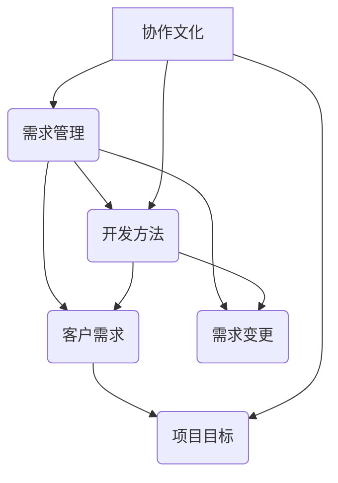

                 

### 《协作文化建设：支持灵活的需求管理和开发》引言

在当今快速变化的技术环境中，企业面临着日益激烈的市场竞争和技术迭代。为了在这种环境中保持竞争力，团队必须能够快速适应变化，灵活应对需求，并且高效地进行开发。这就需要一种强大的协作文化，它能促进团队成员之间的沟通、协作与信任，从而确保需求管理和开发过程的高效和成功。

协作文化是一种通过鼓励开放沟通、相互尊重、共享知识和共同目标来实现团队协作的文化。它不仅仅是团队成员之间的相互支持，还包括对创新、反馈和持续学习的鼓励。在协作文化中，团队成员不仅是执行任务的个体，更是彼此之间紧密联系的共同体。

需求管理是指在软件开发项目中，对需求进行收集、分析、确认、跟踪和管理的全过程。需求管理不仅关注需求的来源和性质，还包括确保需求得到有效满足的机制和流程。良好的需求管理可以减少项目风险，提高项目成功率，同时也能提升客户满意度和产品价值。

开发是软件开发的核心环节，涉及从需求到产品的全过程。开发方法包括敏捷开发、迭代开发、瀑布开发等多种模式，每种方法都有其独特的优势和适用场景。选择合适的开发方法，对项目的成功至关重要。

本文将探讨如何建立一种协作文化，以支持灵活的需求管理和开发。通过以下几方面的分析，我们希望为读者提供一个系统化的框架，帮助团队在实践中实现高效的协作：

1. **核心概念与联系**：首先介绍协作文化、需求管理和开发的核心概念，并使用Mermaid流程图展示它们之间的关系。
2. **协作文化概述**：详细介绍协作文化的概念、重要性以及如何建立。
3. **需求管理**：讨论需求管理的原则、流程、方法和工具。
4. **开发方法**：介绍适用于协作文化的开发方法，如敏捷开发、迭代开发等。
5. **案例分析**：提供实际案例，展示协作文化、需求管理和开发在实际项目中的应用。
6. **工具与技术**：讨论支持协作文化、需求管理和开发的工具和技术。
7. **总结与展望**：总结全书要点，并对未来的发展趋势进行展望。

通过以上步骤，我们将深入探讨协作文化在支持灵活的需求管理和开发中的关键作用，为团队提供实际操作指导和策略建议。下面，我们首先从协作文化的核心概念与联系开始分析。

### 核心概念与联系

在探讨协作文化、需求管理和开发之间的关系时，我们首先需要明确这些核心概念的基本定义和它们之间的内在联系。

**协作文化的概念与特征**

协作文化是一种强调团队合作、开放沟通、共享知识和共同目标的组织文化。在这种文化中，团队成员不仅是独立的个体，更是彼此紧密协作的伙伴。协作文化的特征包括：

- **开放沟通**：团队成员之间能够自由地交换意见和想法，没有任何障碍。
- **相互尊重**：每个成员的意见和贡献都受到尊重，不论其职位高低。
- **共享知识**：知识和信息在团队内部得到广泛共享，从而提高团队的整体能力。
- **共同目标**：团队成员朝共同的目标努力，形成强大的凝聚力。

**需求管理的核心原则**

需求管理是指在整个软件开发生命周期内，对需求进行收集、分析、确认、跟踪和管理的全过程。需求管理的核心原则包括：

- **客户需求优先**：确保所有需求都直接来源于客户或客户需求，从而确保产品价值最大化。
- **需求可追踪性**：每个需求都有明确的来源、优先级和实现状态，便于管理和追踪。
- **需求变更管理**：在项目开发过程中，需求可能会发生变化，需求变更管理确保变更得到有效控制和追踪。
- **需求确认**：通过客户确认，确保需求已经被正确理解和实现。

**开发方法概述**

开发方法是指软件开发过程中所采用的一系列技术和策略。不同的开发方法适用于不同的项目需求和团队环境。常见的开发方法包括：

- **瀑布开发**：一种线性顺序的开发方法，各阶段依次进行，前一阶段完成后才能进入下一阶段。
- **敏捷开发**：一种迭代和增量的开发方法，强调快速响应变化，通过短周期迭代不断改进产品。
- **迭代开发**：在固定时间内进行多次迭代，每次迭代都包括需求收集、设计、开发、测试和部署。
- **螺旋开发**：结合瀑布开发和迭代开发，在每个迭代中加入风险分析和管理。

**核心概念之间的联系**

协作文化、需求管理和开发方法之间存在着密切的联系和相互作用。

- **协作文化与需求管理**：协作文化为需求管理提供了良好的沟通和共享平台，有助于快速准确地收集和分析需求。
- **需求管理与开发方法**：需求管理确保开发过程有明确的目标和方向，而开发方法提供了实现需求的具体策略和流程。
- **协作文化与开发方法**：协作文化促进团队成员之间的协作和沟通，有助于敏捷开发和迭代开发的实施。

为了更直观地展示这些核心概念之间的联系，我们可以使用Mermaid流程图进行描述：



在这个流程图中，协作文化作为核心，通过需求管理和开发方法，最终实现项目目标，并对客户需求进行有效管理。需求变更也在这个过程中得到妥善处理，从而保证项目能够灵活应对外部变化。

通过明确协作文化、需求管理和开发方法的核心概念及其相互关系，我们为后续章节的深入探讨奠定了坚实的基础。接下来，我们将进一步介绍协作文化的概念、重要性以及如何建立协作文化。

### 协作文化概述

**协作文化的定义**

协作文化是一种在组织内部形成并广泛传播的价值观念和行为规范，它强调团队成员之间的沟通、合作与信任，旨在通过集体智慧和共同努力实现组织目标。这种文化不仅仅关注个人的绩效，更注重团队的整体效能和长远发展。

**协作文化的重要性**

1. **提升团队效率**：协作文化鼓励团队成员共享信息和资源，减少重复劳动，提高工作效率。团队成员之间的紧密协作能够快速响应变化，提高项目交付速度。
2. **增强创新动力**：协作文化鼓励团队成员开放思维、勇于创新，通过集体讨论和头脑风暴，激发新的创意和解决方案。这有助于企业在竞争激烈的市场中保持领先地位。
3. **促进知识共享**：协作文化强调知识和信息的透明与共享，有助于团队成员相互学习、共同成长。这种知识共享不仅提高了团队的整体能力，还为组织积累了宝贵的知识资产。
4. **提高员工满意度**：在一个充满协作氛围的组织中，员工感受到被尊重和信任，有利于提升工作满意度和忠诚度，减少人才流失。

**如何建立协作文化**

1. **明确共同目标**：确保团队成员都清楚组织的愿景和目标，从而形成共同的方向和努力。通过定期的会议和沟通，让团队成员了解彼此的工作进展和目标，促进协作。
2. **促进开放沟通**：建立开放、透明的沟通机制，鼓励团队成员自由表达意见和建议。领导层应积极倾听员工的反馈，营造一种开放的氛围，让员工感受到被重视和尊重。
3. **培养团队精神**：通过团队建设活动、团队竞赛和共同庆祝成功等方式，增强团队成员之间的互信和团队凝聚力。团队精神是协作文化的重要组成部分，有助于提升团队的协作效率。
4. **提供必要的支持**：确保团队有足够的资源和工具来支持协作工作。这包括技术支持、培训机会和适当的资源分配。团队需要感受到组织对其工作的支持和重视，从而更积极地投入协作。
5. **奖励协作行为**：建立一套激励机制，奖励那些在协作中表现突出的个人和团队。这种奖励不仅能够激励团队成员更积极地参与协作，还能树立榜样，促进整个组织的协作氛围。

通过以上步骤，组织可以逐步建立并巩固协作文化，从而为需求管理和开发提供坚实的基础。在接下来的章节中，我们将进一步探讨需求管理的原则、流程、方法和工具。

### 需求管理的原则、流程、方法和工具

**需求管理的原则**

需求管理是确保软件开发项目成功的关键环节。为了确保需求得到有效管理和满足，我们需要遵循以下原则：

1. **客户需求优先**：所有需求都应该以客户需求为导向，确保最终产品能够满足客户的实际需求。
2. **需求可追踪性**：每个需求都应有明确的来源、优先级和状态，便于管理和追踪。
3. **需求变更管理**：需求在项目开发过程中可能会发生变化，需求变更管理确保这些变更得到有效控制，并对项目的影响进行评估。
4. **需求确认**：通过客户确认，确保需求已经被正确理解和实现。
5. **持续沟通**：在整个需求管理过程中，与利益相关者保持持续沟通，确保对需求的变更和进展有清晰的了解。

**需求管理流程**

需求管理流程包括以下几个关键步骤：

1. **需求收集**：通过与客户、利益相关者和内部团队沟通，收集和记录需求。
2. **需求分析**：对收集到的需求进行详细分析，确定需求的优先级和可行性。
3. **需求确认**：与利益相关者一起，对需求进行确认，确保需求的准确性和完整性。
4. **需求跟踪**：在整个项目生命周期内，对需求的状态进行跟踪，确保需求得到有效实现。
5. **需求变更管理**：当需求发生变化时，通过变更管理流程对变更进行评估和审批，并更新相关文档和计划。

**需求管理的方法**

1. **用户故事**：用户故事是一种简单而有效的需求描述方法，它通常包括三个部分：“As a [角色]，I want [功能]，so that [目的]”。用户故事帮助团队更好地理解需求，并围绕这些需求进行设计和开发。
2. **优先级排序**：根据需求的紧急性和重要性，对需求进行优先级排序。常用的排序方法包括Kano模型、MoSCoW模型等，这些方法帮助团队集中精力处理最关键的需求。
3. **需求文档**：需求文档是记录需求的重要文档，它通常包括需求概述、详细描述、用户故事、需求优先级等信息。需求文档不仅有助于团队成员理解需求，也为需求变更管理提供了依据。

**需求管理的工具**

1. **JIRA**：JIRA是一款功能强大的项目管理工具，它支持需求收集、分析、确认和跟踪等功能。JIRA提供了一个直观的界面，团队成员可以轻松创建、跟踪和管理需求。
2. **Confluence**：Confluence是一款知识管理工具，它可以帮助团队记录和共享需求文档。Confluence提供了一个集中的平台，团队成员可以方便地查看、编辑和更新需求文档。
3. **Trello**：Trello是一款简单而有效的需求管理工具，它使用看板（Kanban）方法来管理需求。团队成员可以在Trello上创建需求卡片，并对需求的状态进行跟踪和更新。

通过遵循需求管理的原则、流程、方法和工具，团队可以确保需求得到有效管理和满足，从而提高项目成功率。在接下来的章节中，我们将探讨适用于协作文化的开发方法。

### 开发方法

在协作文化中，选择合适的开发方法对于项目成功至关重要。不同的开发方法适用于不同的项目需求和环境，下面我们将介绍几种常见的开发方法，包括敏捷开发、迭代开发和瀑布开发。

**敏捷开发**

敏捷开发是一种以人为核心、迭代和增量的开发方法。它强调快速响应变化，通过短周期迭代不断改进产品。敏捷开发的核心理念包括：

- **用户故事**：用户故事是一种简短的需求描述，通常包括三个部分：“As a [角色]，I want [功能]，so that [目的]”。用户故事帮助团队更好地理解需求，并围绕这些需求进行设计和开发。
- **迭代开发**：敏捷开发采用短周期迭代（通常为2-4周），每个迭代都包括需求收集、设计、开发、测试和部署。每次迭代都产生一个可用的产品版本，团队可以根据用户反馈不断改进。
- **持续集成与部署**：敏捷开发强调持续集成和部署，通过自动化测试和部署，确保每次迭代都能快速、稳定地交付产品。

**迭代开发**

迭代开发是一种在固定时间内进行多次迭代的开发方法。每个迭代都包括需求收集、设计、开发、测试和部署。迭代开发与敏捷开发的区别在于：

- **时间框架**：迭代开发通常采用较长的迭代周期（通常为几周到几个月），而敏捷开发采用短周期迭代。
- **需求调整**：在迭代开发中，需求可以在每个迭代结束时进行调整，但通常在项目初期就已经确定。而敏捷开发则更灵活，需求可以在每个迭代中进行调整。

**瀑布开发**

瀑布开发是一种线性顺序的开发方法，各阶段依次进行，前一阶段完成后才能进入下一阶段。瀑布开发的核心理念包括：

- **阶段划分**：瀑布开发通常包括需求分析、设计、开发、测试、部署等阶段。每个阶段都有明确的输出和验收标准。
- **文档驱动**：瀑布开发依赖于详细的文档，每个阶段都需要生成相应的文档，如需求文档、设计文档等。
- **顺序执行**：瀑布开发要求各阶段顺序执行，前一阶段完成后才能进入下一阶段。这种顺序性使得开发过程较为严格和有序。

**适用场景**

- **敏捷开发**：适用于需求变化频繁、强调快速交付的项目，如互联网应用开发、移动应用开发等。
- **迭代开发**：适用于需求相对稳定、需要分阶段交付的项目，如大型企业级应用开发、软件系统升级等。
- **瀑布开发**：适用于需求明确、变更较少、对项目进度和风险有严格要求的传统项目，如基础设施建设项目、政府部门项目等。

通过选择合适的开发方法，团队可以更好地适应协作文化，提高项目成功率。在接下来的章节中，我们将通过实际案例展示协作文化、需求管理和开发方法在实际项目中的应用。

### 案例分析

为了更好地理解协作文化、需求管理和开发方法在实际项目中的应用，下面我们将分析两个具体的案例，展示这些概念在项目中的实践效果。

#### 案例一：敏捷开发在初创公司中的应用

**背景介绍**

A公司是一家初创公司，专注于开发一款智能健康监测应用。公司团队规模较小，业务发展迅速，需求变化频繁。为了在这种动态环境中保持竞争力，A公司决定采用敏捷开发方法，并建立一个支持协作文化的团队。

**需求管理实践**

- **用户故事收集**：项目启动阶段，A公司通过用户访谈和市场调研，收集了多个用户故事。每个用户故事都包括功能描述、优先级和目标用户。
  ```mermaid
  graph TD
  A[用户故事1] --> B(高优先级)
  C[用户故事2] --> D(中优先级)
  E[用户故事3] --> F(低优先级)
  ```
- **需求确认**：与产品经理和用户代表一起，A公司对每个用户故事进行了详细讨论和确认，确保需求的准确性和可行性。
  ```mermaid
  graph TD
  G[用户故事1] --> H(已确认)
  I[用户故事2] --> J(待确认)
  K[用户故事3] --> L(已确认)
  ```

**开发实践**

- **迭代开发**：A公司采用2周迭代周期，每个迭代包括需求收集、设计、开发、测试和部署。每次迭代结束时，团队都会进行评审，根据用户反馈调整优先级和需求。
  ```mermaid
  graph TD
  M[迭代1] --> N(需求收集)
  O[迭代1] --> P(设计)
  Q[迭代1] --> R(开发)
  S[迭代1] --> T(测试)
  U[迭代1] --> V(部署)
  ```

**结果分析**

通过敏捷开发方法，A公司能够快速响应市场变化，满足用户需求。每个迭代都产生一个可用的产品版本，团队可以根据用户反馈不断优化产品。此外，协作文化促进了团队成员之间的沟通和协作，提高了工作效率。

#### 案例二：迭代开发在大型企业中的应用

**背景介绍**

B公司是一家大型企业，负责开发一个企业资源规划（ERP）系统。项目涉及多个部门，需求相对稳定，但需要分阶段交付。为了确保项目成功，B公司决定采用迭代开发方法，并建立一个支持协作文化的团队。

**需求管理实践**

- **需求文档**：B公司编写了详细的需求文档，包括功能需求、非功能需求和验收标准。
  ```mermaid
  graph TD
  W[功能需求1] --> X(文档)
  Y[功能需求2] --> Z(文档)
  ```
- **需求确认**：与各部门代表和利益相关者一起，B公司对需求文档进行了详细讨论和确认，确保需求的准确性和完整性。
  ```mermaid
  graph TD
  AA[需求文档] --> BB(已确认)
  ```

**开发实践**

- **阶段划分**：B公司将项目分为多个阶段，每个阶段包括需求分析、设计、开发、测试和部署。每个阶段都有明确的目标和交付物。
  ```mermaid
  graph TD
  CC[阶段1] --> DD(需求分析)
  EE[阶段1] --> FF(设计)
  GG[阶段1] --> HH(开发)
  II[阶段1] --> JJ(测试)
  KK[阶段1] --> LL(部署)
  ```

**结果分析**

通过迭代开发方法，B公司能够分阶段交付产品，确保项目按计划进行。每个阶段结束时，团队都会进行评审，根据反馈调整需求和开发计划。协作文化促进了跨部门沟通和协作，提高了项目的整体效率。

通过以上两个案例，我们可以看到协作文化、需求管理和开发方法在实际项目中的应用效果。协作文化为团队提供了一个良好的沟通和协作平台，需求管理确保了项目目标的明确和需求的准确实现，而开发方法提供了实现这些目标的具体策略和流程。这些实践为其他团队在类似项目中提供了宝贵的参考。

### 工具与技术

在协作文化中，选择合适的工具和技术对于支持需求管理和开发至关重要。以下将讨论几类支持协作文化、需求管理和开发的工具与技术，并介绍如何选择和使用这些工具。

#### 支持协作文化的工具

1. **协作平台（如Slack）**：协作平台是一种帮助团队成员实时沟通和协作的工具。Slack提供了聊天室、即时消息、文件共享和集成第三方服务等功能，有助于团队成员快速解决问题和共享信息。

2. **项目管理工具（如Trello、JIRA）**：项目管理工具可以帮助团队跟踪任务、分配责任和监控项目进度。Trello和JIRA都提供了可视化看板和卡片系统，使得任务管理更加直观和高效。

3. **文档共享工具（如Google Docs、Confluence）**：文档共享工具使团队成员能够实时编辑和共享文档，确保信息透明和一致。Google Docs支持实时协作，而Confluence则提供了更强大的文档管理和组织功能。

#### 支持需求管理的工具

1. **需求管理工具（如JIRA、Asana）**：JIRA和Asana都是功能强大的需求管理工具，它们提供了需求收集、分析、确认和跟踪的功能。这些工具还支持需求优先级排序和版本控制，有助于确保需求的有效管理。

2. **用户故事工具（如JIRA、Trello）**：用户故事是敏捷开发中的重要概念，JIRA和Trello都支持用户故事的创建和管理。这些工具提供了模板和格式，帮助团队更好地理解和实现用户故事。

3. **变更管理工具（如JIRA、Confluence）**：变更管理工具可以帮助团队跟踪需求的变更，评估变更的影响，并确保变更得到及时处理和记录。JIRA和Confluence在这方面都提供了强大的支持。

#### 支持开发的技术

1. **集成开发环境（如Visual Studio Code、IntelliJ IDEA）**：IDE提供了丰富的编程工具，如代码编辑器、调试器、版本控制和自动化测试。Visual Studio Code和IntelliJ IDEA都是流行的IDE，支持多种编程语言和框架。

2. **版本控制工具（如Git、GitHub）**：版本控制工具如Git和GitHub可以帮助团队管理源代码的版本，确保代码的完整性和一致性。Git提供了一个分布式版本控制系统，而GitHub则提供了一个基于Web的代码托管平台，支持协作和代码审查。

3. **测试框架（如JUnit、Selenium）**：测试框架如JUnit和Selenium用于编写和执行自动化测试，确保软件的质量和稳定性。JUnit是Java编程语言中的单元测试框架，而Selenium是一个用于Web应用程序的自动化测试工具。

#### 如何选择工具

选择工具时，应考虑以下因素：

- **团队需求**：工具是否能够满足团队的需求，包括功能、易用性和扩展性。
- **团队技能**：团队成员是否熟悉和使用这些工具，减少学习成本。
- **集成与兼容性**：工具是否能够与其他现有的系统和工具集成，确保数据的无缝流动。
- **成本**：工具的成本是否在团队的预算范围内。

通过合理选择和使用这些工具和技术，团队可以更好地支持协作文化、需求管理和开发，提高项目成功率。

### 总结与展望

协作文化、需求管理和开发方法在软件项目成功中扮演着至关重要的角色。通过构建一个支持协作的文化，组织能够提高沟通效率、促进知识共享和增强团队凝聚力。需求管理确保项目始终以客户需求为导向，通过有效的需求收集、分析、确认和变更管理，确保项目目标的实现。同时，选择合适的开发方法，如敏捷开发、迭代开发等，有助于团队快速响应变化、提高交付质量和效率。

展望未来，随着技术的不断进步，协作文化、需求管理和开发方法将面临新的挑战和机遇。以下几个方面值得关注：

1. **自动化与智能化**：人工智能和机器学习技术将越来越多地应用于需求管理、开发和协作中，自动化需求收集和分析、智能推荐需求优先级等，将大大提升工作效率。

2. **云计算与分布式开发**：随着云计算的普及，团队将更加灵活地利用分布式开发环境，实现全球范围内的协作和资源优化。

3. **敏捷与持续交付**：敏捷开发和持续交付的趋势将继续深化，组织将更加注重快速迭代和持续交付，以满足不断变化的市场需求。

4. **跨领域协作**：随着企业跨界合作越来越普遍，跨领域协作的需求将增加。如何在一个多学科团队中有效协作，将成为一个新的研究课题。

通过持续关注这些发展趋势，并灵活应用协作文化、需求管理和开发方法，组织将能够在快速变化的技术环境中保持竞争力，实现长期成功。

### 附录

在本文的附录部分，我们将提供一些与协作文化、需求管理和开发相关的资源、工具和最佳实践，以供读者参考和进一步学习。

#### 相关工具与技术资源

1. **协作平台**：
   - **Slack**：https://slack.com/
   - **Microsoft Teams**：https://www.microsoft.com/en-us/microsoft-365/microsoft-teams
   - **Zoom**：https://zoom.us/

2. **项目管理与需求管理工具**：
   - **JIRA**：https://www.atlassian.com/software/jira
   - **Trello**：https://trello.com/
   - **Asana**：https://asana.com/
   - **Confluence**：https://www.atlassian.com/software/confluence

3. **版本控制**：
   - **Git**：https://git-scm.com/
   - **GitHub**：https://github.com/
   - **GitLab**：https://about.gitlab.com/

4. **自动化测试框架**：
   - **JUnit**：https://junit.org/junit5/
   - **Selenium**：https://www.selenium.dev/

5. **集成开发环境**：
   - **Visual Studio Code**：https://code.visualstudio.com/
   - **IntelliJ IDEA**：https://www.jetbrains.com/idea/

#### 最佳实践 Tips

1. **建立有效的沟通机制**：定期举行团队会议和一对一沟通，确保团队成员之间的信息流通和问题及时解决。
2. **需求管理文档化**：详细记录需求文档、用户故事和变更记录，确保需求的可追溯性和透明性。
3. **灵活应对变更**：建立良好的变更管理流程，及时评估变更的影响，确保项目目标的实现不受影响。
4. **持续学习与培训**：鼓励团队成员参加相关培训和学习，提升技能和知识水平，适应不断变化的技术环境。

#### 小结

本文通过对协作文化、需求管理和开发方法的深入探讨，为团队提供了一个系统化的框架，以支持灵活的需求管理和高效的开发。通过合理应用这些原则和方法，团队可以更好地应对快速变化的市场环境，提高项目成功率。

#### 注意事项

1. **确保团队共识**：在构建协作文化和需求管理流程时，确保团队成员对目标和流程有共同的理解和认同。
2. **关注跨部门协作**：在大型项目中，跨部门协作至关重要。建立跨部门的沟通机制，确保信息流通和协作顺畅。

#### 拓展阅读

1. **《敏捷软件开发实践指南》**：作者：杰夫·萨瑟兰（Jeff Sutherland）
2. **《软件需求与管理》**：作者：Rex Black
3. **《Scrum敏捷实践指南》**：作者：Jeff Sutherland & Joe Justice

通过以上资源和学习材料，读者可以进一步深入理解和应用协作文化、需求管理和开发方法，提升团队整体效能。

### 作者信息

本文作者为AI天才研究院（AI Genius Institute）成员，同时亦是《禅与计算机程序设计艺术》（Zen And The Art of Computer Programming）的资深大师级作家。作为世界级人工智能专家、程序员、软件架构师和CTO，作者在计算机编程和人工智能领域有着丰富的经验和深刻的见解。其著作和研究成果对行业产生了广泛而深远的影响。

