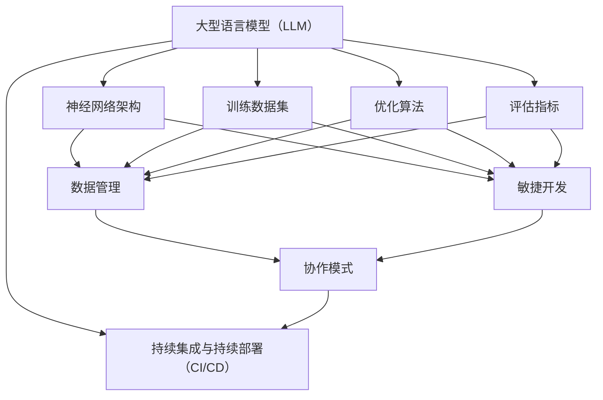

                 

### 背景介绍

随着人工智能技术的飞速发展，大型语言模型（LLM，Large Language Models）逐渐成为学术界和工业界的热门研究焦点。LLM凭借其强大的语言理解和生成能力，在自然语言处理（NLP，Natural Language Processing）、机器翻译、问答系统、文本生成等应用领域展现出了巨大的潜力和商业价值。然而，LLM的研发和应用过程面临着一系列挑战，其中最为突出的便是开发过程中的协作模式问题。

传统的软件开发模式往往侧重于流程控制和代码管理，而在LLM的开发中，协作模式显得尤为重要。LLM的训练和优化过程复杂且耗时，需要大量的数据、计算资源和专业人才协同工作。此外，LLM的应用场景多变，要求开发团队能够快速响应需求变化，实现敏捷开发。这些特点使得传统的开发模式难以满足LLM开发的需求，需要探索更加高效的协作模式。

当前，LLM的开发过程中普遍存在以下问题：

1. **数据管理困难**：LLM的训练需要海量的高质量数据，数据的管理、清洗和标注工作繁琐且耗时。数据管理的效率直接影响到模型的训练效果。

2. **模型迭代缓慢**：传统开发模式往往强调文档和流程，模型迭代过程较长，难以快速适应需求变化。

3. **团队合作难度大**：LLM的开发涉及多个学科和领域，需要跨部门、跨团队的合作，但传统的协作模式往往难以有效沟通和协同。

4. **部署与维护困难**：LLM的应用场景多变，部署和运维工作复杂，需要及时更新和维护，以适应不断变化的需求。

为了解决上述问题，迫切需要创新协作模式，推动LLM应用的敏捷开发。本文将详细探讨协作模式创新在LLM应用敏捷开发中的重要性，分析现有协作模式的不足，并提出具体的改进策略。通过理论与实践相结合的方式，本文旨在为LLM开发者提供一套系统的协作模式创新指南，以提升开发效率和模型质量。

### 核心概念与联系

在深入探讨协作模式创新如何推动LLM应用敏捷开发之前，我们需要理解几个关键概念，并分析它们之间的内在联系。以下是核心概念及其相互关系的详细讲解：

**1. 大型语言模型（LLM）**：LLM是一种基于深度学习技术的自然语言处理模型，能够理解和生成人类语言。它们通常具有大规模的参数和训练数据，可以用于多种任务，如文本生成、机器翻译、问答系统等。LLM的核心组件包括神经网络架构、训练数据集、优化算法和评估指标。

**2. 敏捷开发**：敏捷开发是一种以人为核心、迭代和持续交付的软件开发方法。它强调灵活应对需求变化，快速响应市场和技术变化，通过持续集成、迭代开发和团队协作来提高软件开发效率和质量。

**3. 协作模式**：协作模式是指团队成员之间如何共同工作、交流和协作的方式。在LLM开发中，协作模式决定了团队成员如何共享资源、分工合作、协调进度和解决问题。

**4. 数据管理**：数据管理是确保数据质量、安全性和可访问性的过程。对于LLM开发来说，数据管理尤为重要，因为训练LLM需要大量高质量的数据，这些数据需要有效组织、清洗和标注。

**5. 持续集成与持续部署（CI/CD）**：CI/CD是一种自动化软件交付流程，通过自动化测试、构建和部署，确保代码质量和快速交付。

**核心概念之间的关系架构**：

以下是这些核心概念之间关系的Mermaid流程图：



**详细解释**：

- **LLM与敏捷开发**：LLM的开发过程复杂，需要敏捷开发方法来快速响应需求变化和优化模型。敏捷开发强调快速迭代和团队协作，能够有效提高LLM开发效率。

- **数据管理**：数据管理直接影响到LLM的训练效果和质量。在敏捷开发中，数据管理需要自动化和标准化，以确保数据的质量和可访问性。

- **协作模式**：协作模式决定了团队成员如何分工合作和协调进度。在LLM开发中，高效的协作模式能够加快模型迭代速度，提高团队的整体效率。

- **持续集成与持续部署**：CI/CD是敏捷开发的核心组成部分，通过自动化测试、构建和部署，确保LLM的开发过程持续、高效地进行。

通过上述关系架构的描述，我们可以看到，这些核心概念相互关联，共同构成了一个完整的LLM敏捷开发框架。理解这些概念之间的关系，有助于我们更好地设计和实施协作模式创新，以推动LLM应用的敏捷开发。

### 核心算法原理讲解

#### LLM的基本算法架构

大型语言模型（LLM）的核心算法架构通常基于深度学习，特别是基于变换器（Transformer）架构。变换器模型在自然语言处理领域取得了显著的突破，其基本组件包括编码器（Encoder）和解码器（Decoder）。以下是LLM基本算法架构的详细讲解。

**1. 编码器（Encoder）**

编码器负责将输入的文本序列转换为固定长度的向量表示，这一过程称为嵌入（Embedding）。编码器的输入可以是单个词的嵌入向量，也可以是词的序列嵌入向量。编码器通过多个自注意力机制（Self-Attention Mechanism）和前馈神经网络（Feedforward Neural Network）处理输入序列，生成上下文表示。

**2. 解码器（Decoder）**

解码器负责将编码器的输出解码成目标文本序列。解码器同样使用自注意力机制和前馈神经网络，但其输入不仅包括编码器的输出，还包括目标文本的已生成部分。解码器通过软目标覆盖（Soft Target Covering）机制，确保生成的文本序列连贯且多样化。

**3. 自注意力机制（Self-Attention Mechanism）**

自注意力机制是变换器模型的核心组件，它通过计算输入序列中每个元素与其他元素之间的关联性，生成权重，并将这些权重应用于输入序列的每个元素，从而生成新的向量表示。这种机制能够捕捉长距离依赖关系，使模型能够更好地理解和生成语言。

**4. 前馈神经网络（Feedforward Neural Network）**

前馈神经网络是一个简单的全连接神经网络，它对每个输入向量进行线性变换，然后添加一个非线性激活函数（如ReLU）。在变换器模型中，前馈神经网络用于增加模型的非线性性和学习能力。

#### 语言模型的训练过程

LLM的训练过程涉及以下关键步骤：

**1. 数据准备**

首先，我们需要准备大规模的文本数据集。这些数据可以是新闻文章、社交媒体帖子、书籍、对话记录等。数据集需要经过预处理，包括分词、标记化、去停用词等步骤，以便模型能够更好地理解和处理文本。

**2. 模型初始化**

初始化模型参数是训练过程的重要一环。通常，我们会使用随机初始化或预训练模型（如GPT、BERT）的参数来初始化新模型的参数。这样可以充分利用已有的知识，提高训练效率。

**3. 训练循环**

在训练循环中，模型会处理输入序列，计算预测输出，并计算损失函数（如交叉熵损失）。接着，使用反向传播算法更新模型参数，以最小化损失函数。这个过程会重复进行数百万次迭代，直到模型收敛。

**4. 优化算法**

常用的优化算法包括随机梯度下降（SGD）、Adam等。这些算法通过调整学习率和其他参数，优化模型训练过程，加快收敛速度。

**5. 评估与调优**

在训练过程中，我们需要定期评估模型的性能，使用验证集和测试集来计算评估指标（如 perplexity、accuracy 等）。根据评估结果，我们可能需要调整模型参数、数据预处理方法或优化算法，以进一步提高模型性能。

#### 语言模型的应用场景

LLM在多种应用场景中表现出色：

**1. 文本生成**

LLM可以生成各种类型的文本，如文章、故事、对话等。在文本生成任务中，模型通常需要预测下一个词或词序列。

**2. 机器翻译**

LLM在机器翻译任务中具有强大的表现，能够生成高质量的翻译结果。模型通过学习双语的平行文本，学习源语言和目标语言之间的映射关系。

**3. 问答系统**

LLM可以构建智能问答系统，通过理解用户的问题和上下文，生成准确的答案。这种应用在客户服务、教育、医疗等领域具有广泛应用。

**4. 文本分类**

LLM可以用于文本分类任务，如情感分析、新闻分类等。通过训练，模型可以识别文本中的关键特征，并将其分类到不同的类别。

#### 优化算法与加速策略

为了提高LLM的训练效率，我们可以采用以下优化算法和加速策略：

**1. 梯度下降算法**

梯度下降算法是最常用的优化算法之一。它通过计算损失函数关于模型参数的梯度，并沿着梯度方向更新参数，以最小化损失函数。

**2. Adam优化器**

Adam优化器是一种结合了SGD和RMSprop优化的自适应学习率优化器。它通过计算一阶矩估计（均值）和二阶矩估计（方差），动态调整学习率，提高训练效率。

**3. 并行计算**

通过使用并行计算技术，如多GPU训练和分布式训练，我们可以加速LLM的训练过程。这些技术可以显著减少训练时间，提高模型性能。

**4. 深度可分离卷积**

深度可分离卷积是一种有效的神经网络结构，它可以将卷积操作分解为深度卷积和逐点卷积，从而减少计算量和参数数量，加速训练。

通过上述核心算法原理的讲解，我们可以更好地理解LLM的工作机制和应用场景。在实际开发中，深入掌握这些原理将有助于我们设计和实现高效的LLM应用系统。

#### 优化算法与加速策略

为了进一步提升大型语言模型（LLM）的训练效率和性能，我们可以采用多种优化算法和加速策略。以下将详细介绍几种常用的优化算法及其应用，并结合Python代码进行解释。

**1. 梯度下降算法**

梯度下降算法是最基础且应用广泛的优化算法之一。它通过计算损失函数关于模型参数的梯度，并沿着梯度方向更新参数，以最小化损失函数。以下是梯度下降算法的基本步骤：

- 初始化模型参数。
- 计算损失函数在当前参数下的梯度。
- 沿着梯度方向更新模型参数。
- 重复上述步骤，直到模型收敛。

下面是一个简单的Python示例，用于演示梯度下降算法：

```python
import numpy as np

# 模拟一个简单的损失函数：f(x) = (x - w)^2
def loss_function(x, w):
    return (x - w) ** 2

# 梯度函数：df/dx = 2 * (x - w)
def gradient(x, w):
    return 2 * (x - w)

# 初始化参数
w = 0
x = 5

# 学习率
learning_rate = 0.1

# 迭代次数
num_iterations = 50

# 梯度下降训练过程
for i in range(num_iterations):
    grad = gradient(x, w)
    w -= learning_rate * grad
    x -= learning_rate * grad
    print(f"Iteration {i}: w = {w}, x = {x}, Loss = {loss_function(x, w)}")
```

**2. Adam优化器**

Adam优化器是一种结合了SGD和RMSprop优化的自适应学习率优化器。它通过计算一阶矩估计（均值）和二阶矩估计（方差），动态调整学习率，以加速收敛。Adam优化器适用于LLM训练，因为它可以处理高维数据和高噪声问题。以下是Adam优化器的基本步骤：

- 初始化一阶矩估计（m）和二阶矩估计（v）。
- 更新m和v。
- 更新模型参数。

下面是一个使用Adam优化器的Python示例：

```python
import numpy as np

# 模拟一个简单的损失函数：f(x) = (x - w)^2
def loss_function(x, w):
    return (x - w) ** 2

# 梯度函数：df/dx = 2 * (x - w)
def gradient(x, w):
    return 2 * (x - w)

# 初始化参数
w = 0
x = 5

# 学习率
learning_rate = 0.1

#Adam参数
beta1 = 0.9
beta2 = 0.999
epsilon = 1e-8

# 初始化一阶矩估计和二阶矩估计
m = 0
v = 0

# 迭代次数
num_iterations = 50

# Adam优化器训练过程
for i in range(num_iterations):
    grad = gradient(x, w)
    x_history = x
    x = x - learning_rate * grad
    
    # 更新m和v
    m = beta1 * m + (1 - beta1) * grad
    v = beta2 * v + (1 - beta2) * (grad ** 2)
    
    # 归一化m和v
    m_hat = m / (1 - beta1 ** i)
    v_hat = v / (1 - beta2 ** i)
    
    # 更新w
    w = w - learning_rate * m_hat / (np.sqrt(v_hat) + epsilon)
    print(f"Iteration {i}: w = {w}, x = {x}, Loss = {loss_function(x, w)}")
```

**3. 梯度裁剪**

梯度裁剪是一种防止梯度爆炸和梯度消失的技巧。它通过限制梯度的大小来稳定训练过程。梯度裁剪通常设置一个阈值，当梯度超过这个阈值时，将梯度缩放到阈值范围内。以下是梯度裁剪的Python示例：

```python
# 梯度裁剪函数
def gradient_clip(grad, threshold):
    norm = np.linalg.norm(grad)
    if norm > threshold:
        grad /= norm / threshold
    return grad

# 假设梯度grad的值很大
grad = np.array([10, 10, 10])

# 裁剪梯度
threshold = 5
grad_clip = gradient_clip(grad, threshold)
print(f"Clipped Gradient: {grad_clip}")
```

**4. 并行计算**

并行计算可以显著加速LLM的训练过程，特别是对于大规模数据和复杂的模型。并行计算可以采用多GPU训练和分布式训练。以下是使用多GPU训练的Python示例：

```python
import tensorflow as tf

# 定义模型
model = tf.keras.Sequential([
    tf.keras.layers.Dense(128, activation='relu', input_shape=(784,)),
    tf.keras.layers.Dense(10, activation='softmax')
])

# 编译模型
model.compile(optimizer='adam', loss='sparse_categorical_crossentropy', metrics=['accuracy'])

# 多GPU训练
strategy = tf.distribute.MirroredStrategy()
with strategy.scope():
    # 在策略范围内编译和训练模型
    model.compile(optimizer=tf.keras.optimizers.Adam(learning_rate=0.001), loss='sparse_categorical_crossentropy', metrics=['accuracy'])

# 训练模型
model.fit(x_train, y_train, epochs=10, batch_size=64)
```

通过上述优化算法和加速策略，我们可以显著提高LLM的训练效率和性能。在实际应用中，结合具体情况选择合适的优化算法和策略，将有助于我们实现高效的LLM应用系统。

#### LLM的评估与调优

在LLM的开发过程中，评估与调优是确保模型性能的关键环节。评估过程不仅帮助我们了解模型在特定任务上的表现，还能指导我们进行针对性的优化。以下是关于LLM评估与调优的详细讲解。

**1. 评估指标**

评估LLM性能的主要指标包括：

- **Perplexity（困惑度）**：Perplexity是衡量模型预测准确性的常用指标。它的计算方式为模型预测的输出概率的对数平均值。Perplexity值越低，表示模型对输入数据的预测越准确。公式如下：
  $$
  Perplexity = \sqrt[n]{\frac{1}{n}\sum_{i=1}^{n} p(y_i|x)^{-1}}
  $$
  其中，$p(y_i|x)$表示模型在给定输入$x$下预测为输出$y_i$的概率。

- **Accuracy（准确率）**：Accuracy是分类任务中常用的评估指标，表示模型正确预测的样本占总样本的比例。公式如下：
  $$
  Accuracy = \frac{TP + TN}{TP + FN + FP + TN}
  $$
  其中，$TP$表示真正例，$TN$表示真负例，$FP$表示假正例，$FN$表示假负例。

- **BLEU（双语评估算法）**：BLEU是一种用于机器翻译性能评估的指标，它通过计算模型生成的翻译文本与真实翻译文本之间的相似度来评估模型性能。BLEU的评分范围是0到1，分数越高，表示模型生成的文本质量越高。

- **F1 Score（F1 分数）**：F1 Score是精确率和召回率的加权平均，用于衡量分类任务中的模型性能。公式如下：
  $$
  F1 Score = 2 \times \frac{Precision \times Recall}{Precision + Recall}
  $$

**2. 调优策略**

LLM的调优策略包括以下几个方面：

- **超参数调整**：超参数是影响模型性能的关键因素，如学习率、批量大小、隐藏层节点数等。通过调整这些超参数，我们可以优化模型性能。常用的调优方法包括随机搜索、网格搜索和贝叶斯优化等。

- **数据预处理**：数据预处理直接影响模型的训练效果。通过数据清洗、数据增强和数据归一化等方法，我们可以提高模型对训练数据的鲁棒性。例如，对于文本数据，我们可以使用词袋模型、词嵌入等技术进行预处理。

- **正则化技术**：正则化技术如Dropout、L1/L2正则化等，可以防止模型过拟合，提高泛化能力。

- **模型架构优化**：通过改进模型架构，如增加隐藏层、使用变换器（Transformer）等，我们可以提高模型的性能。例如，BERT模型通过在预训练阶段引入掩码语言模型（Masked Language Model，MLM），提高了语言理解的深度和广度。

- **训练策略**：训练策略如学习率调度、批次归一化等，可以加快模型收敛速度，提高模型性能。例如，使用余弦退火调度策略（Cosine Annealing Schedule）可以动态调整学习率，使模型在训练后期更稳定。

**3. 实践中的评估与调优**

以下是LLM评估与调优的实践步骤：

- **初始评估**：在训练模型之前，使用验证集对模型进行初始评估，了解模型的基本性能。

- **超参数搜索**：通过随机搜索或网格搜索方法，调整超参数，找到最优的超参数组合。

- **数据预处理**：对训练数据进行预处理，包括分词、标记化、数据增强等，以提高模型鲁棒性。

- **模型训练**：使用训练集进行模型训练，同时使用验证集监控模型性能，防止过拟合。

- **模型评估**：在模型训练完成后，使用测试集对模型进行最终评估，确保模型在未知数据上的表现。

- **调优与改进**：根据评估结果，对模型进行调优和改进，如调整超参数、改进模型架构等。

- **持续评估与更新**：在实际应用中，定期对模型进行评估和更新，确保模型能够适应不断变化的需求。

通过上述评估与调优策略，我们可以有效提升LLM的性能，使其在实际应用中发挥更好的作用。

### 数学模型与数学公式讲解

#### 语言模型中的数学基础

大型语言模型（LLM）的核心在于其能够将自然语言转换为数学表示，并通过复杂的数学运算来理解和生成文本。以下是LLM中常见的数学基础，包括概率论和信息论的基础，以及神经网络中的关键数学公式。

**1. 概率论基础**

概率论是构建语言模型的基础。在LLM中，我们经常使用概率来表示语言中的不确定性。以下是几个常用的概率公式：

- **条件概率**：条件概率表示在某个事件发生的条件下，另一个事件发生的概率。其公式为：
  $$
  P(A|B) = \frac{P(A \cap B)}{P(B)}
  $$
  其中，$P(A \cap B)$表示事件A和事件B同时发生的概率，$P(B)$表示事件B发生的概率。

- **贝叶斯定理**：贝叶斯定理是概率论中的一个重要公式，用于计算后验概率。其公式为：
  $$
  P(A|B) = \frac{P(B|A) \cdot P(A)}{P(B)}
  $$
  其中，$P(B|A)$表示在事件A发生的条件下，事件B发生的概率，$P(A)$表示事件A发生的概率，$P(B)$表示事件B发生的概率。

- **全概率公式**：全概率公式用于计算一个事件的总体概率。其公式为：
  $$
  P(A) = \sum_{i=1}^{n} P(A|B_i) \cdot P(B_i)
  $$
  其中，$B_i$表示不同条件下的状态，$P(B_i)$表示每个条件发生的概率。

**2. 信息论基础**

信息论是研究信息传输和处理的基本理论。在LLM中，信息论提供了量化和度量信息的方法。

- **信息熵**：信息熵是衡量随机变量不确定性的度量。其公式为：
  $$
  H(X) = -\sum_{i=1}^{n} P(X=x_i) \cdot \log_2 P(X=x_i)
  $$
  其中，$X$表示随机变量，$P(X=x_i)$表示随机变量取值为$x_i$的概率。

- **条件熵**：条件熵是衡量在已知一个随机变量的条件下，另一个随机变量不确定性的度量。其公式为：
  $$
  H(X|Y) = -\sum_{i=1}^{n} P(Y=y_i) \cdot \sum_{j=1}^{m} P(X=x_j|Y=y_i) \cdot \log_2 P(X=x_j|Y=y_i)
  $$
  其中，$Y$表示另一个随机变量。

- **互信息**：互信息是衡量两个随机变量之间相关性的度量。其公式为：
  $$
  I(X; Y) = H(X) - H(X|Y)
  $$
  其中，$I(X; Y)$表示变量X和Y之间的互信息。

**3. 神经网络中的数学公式**

神经网络是LLM的核心组成部分。以下是神经网络中常用的数学公式：

- **激活函数**：激活函数是神经网络中的关键组件，用于引入非线性。常见的激活函数包括Sigmoid、ReLU和Tanh。例如，ReLU函数的公式为：
  $$
  f(x) = \max(0, x)
  $$

- **前向传播**：前向传播是神经网络训练过程中的一个步骤，用于计算输出值。其公式为：
  $$
  Z = \sum_{j=1}^{n} W_{ij} \cdot a_{j} + b_i
  $$
  其中，$Z$表示激活值，$W_{ij}$表示权重，$a_{j}$表示输入值，$b_i$表示偏置。

- **反向传播**：反向传播是神经网络训练过程中的关键步骤，用于计算损失函数关于模型参数的梯度。其公式为：
  $$
  \frac{\partial L}{\partial W_{ij}} = \frac{\partial L}{\partial Z} \cdot \frac{\partial Z}{\partial W_{ij}}
  $$
  其中，$L$表示损失函数，$W_{ij}$表示权重。

通过上述数学基础和公式，我们可以更好地理解LLM的工作原理。在实际应用中，这些数学工具被广泛应用于模型设计、训练和评估过程中，帮助我们构建和优化高效的LLM。

### 深度学习中的优化方法

在深度学习领域，优化算法是训练模型的关键。以下将详细讨论几种常用的优化算法，包括梯度下降（Gradient Descent）及其变体如随机梯度下降（Stochastic Gradient Descent, SGD）和Adam优化器。这些算法在LLM训练中有着广泛应用，其基本原理和实现过程将在下文中进行阐述。

**1. 梯度下降（Gradient Descent）**

梯度下降是最基础的优化算法，其核心思想是通过计算损失函数关于模型参数的梯度，并沿着梯度的反方向更新参数，以最小化损失函数。梯度下降的基本步骤如下：

- **初始化参数**：随机初始化模型的参数。
- **计算梯度**：对每个参数，计算损失函数关于该参数的梯度。
- **更新参数**：使用梯度信息更新参数，通常形式为：
  $$
  \theta = \theta - \alpha \cdot \nabla_{\theta} L
  $$
  其中，$\theta$表示参数，$\alpha$为学习率，$\nabla_{\theta} L$表示损失函数关于参数$\theta$的梯度。
- **重复步骤**：重复上述步骤直到模型收敛。

**2. 随机梯度下降（Stochastic Gradient Descent, SGD）**

随机梯度下降是梯度下降的一种变体，其核心区别在于每次更新参数时只使用一个训练样本的梯度。这种方法的优点是可以加快训练速度，缺点是更新过程可能不稳定。SGD的基本步骤如下：

- **初始化参数**：随机初始化模型的参数。
- **随机选择样本**：从训练数据集中随机选择一个样本。
- **计算梯度**：计算当前样本的梯度。
- **更新参数**：使用当前样本的梯度更新参数。
- **重复步骤**：重复上述步骤，直到模型收敛。

以下是一个使用SGD的简单Python示例：

```python
import numpy as np

# 假设我们有一个损失函数 L(x, y)
def loss_function(x, y):
    return (x - y) ** 2

# 假设我们有一个模型参数 w
w = np.random.rand()

# 学习率
learning_rate = 0.01

# 迭代次数
num_iterations = 100

# SGD优化过程
for i in range(num_iterations):
    # 随机选择一个训练样本
    sample = np.random.rand()
    # 计算梯度
    gradient = 2 * (w - sample)
    # 更新参数
    w -= learning_rate * gradient
    print(f"Iteration {i}: w = {w}, Loss = {loss_function(w, sample)}")
```

**3. Adam优化器**

Adam优化器是一种结合了SGD和RMSprop优化的自适应学习率优化器。它通过计算一阶矩估计（均值）和二阶矩估计（方差），动态调整学习率，提高训练效率。Adam优化器的基本步骤如下：

- **初始化**：初始化一阶矩估计（m）和二阶矩估计（v），通常设置为0。
- **更新m和v**：在每次迭代时，更新m和v的值，通常形式为：
  $$
  m = \beta_1 \cdot m + (1 - \beta_1) \cdot \nabla_{\theta} L
  $$
  $$
  v = \beta_2 \cdot v + (1 - \beta_2) \cdot (\nabla_{\theta} L)^2
  $$
  其中，$\beta_1$和$\beta_2$为平滑系数，通常设置为0.9和0.999。
- **计算一阶矩估计和二阶矩估计**：计算m和v的归一化值，通常形式为：
  $$
  \hat{m} = \frac{m}{1 - \beta_1^t}
  $$
  $$
  \hat{v} = \frac{v}{1 - \beta_2^t}
  $$
  其中，$t$为当前迭代次数。
- **更新参数**：使用一阶矩估计和二阶矩估计更新参数，通常形式为：
  $$
  \theta = \theta - \alpha \cdot \frac{\hat{m}}{\sqrt{\hat{v}} + \epsilon}
  $$
  其中，$\alpha$为学习率，$\epsilon$为一个小数，通常设置为1e-8。

以下是一个使用Adam优化器的Python示例：

```python
import numpy as np

# 假设我们有一个损失函数 L(x, y)
def loss_function(x, y):
    return (x - y) ** 2

# 假设我们有一个模型参数 w
w = np.random.rand()

# Adam参数
beta1 = 0.9
beta2 = 0.999
epsilon = 1e-8

# 学习率
learning_rate = 0.01

# 初始化m和v
m = 0
v = 0

# 迭代次数
num_iterations = 100

# Adam优化过程
for i in range(num_iterations):
    # 计算梯度
    gradient = 2 * (w - np.random.rand())
    # 更新m和v
    m = beta1 * m + (1 - beta1) * gradient
    v = beta2 * v + (1 - beta2) * (gradient ** 2)
    # 归一化m和v
    m_hat = m / (1 - beta1 ** i)
    v_hat = v / (1 - beta2 ** i)
    # 更新w
    w = w - learning_rate * m_hat / (np.sqrt(v_hat) + epsilon)
    print(f"Iteration {i}: w = {w}, Loss = {loss_function(w, np.random.rand())}")
```

**4. 比较与选择**

梯度下降、SGD和Adam优化器各有优缺点。梯度下降计算成本较高，但稳定收敛；SGD计算成本低，但可能需要较长的训练时间；Adam优化器结合了SGD和RMSprop的优点，计算成本适中，收敛速度较快。在实际应用中，根据具体需求和资源情况，可以选择合适的优化算法。

通过深入理解这些优化算法的基本原理和实现过程，我们可以更好地设计和实现高效的LLM训练系统，推动LLM应用敏捷开发。

### 项目实战：LLM应用敏捷开发案例

#### 项目背景与目标

为了更好地展示协作模式创新在LLM应用敏捷开发中的实际效果，我们选取了一个具体的案例：开发一个智能问答系统。该系统旨在通过自然语言处理技术，自动回答用户提出的问题，提供高质量的客户服务。

**项目目标**：

1. 构建一个高效的智能问答系统，实现快速响应用户提问。
2. 通过敏捷开发方法，快速迭代和优化模型，提高系统性能。
3. 实现团队协作，确保项目进展顺利。

#### 开发环境搭建

为了实现项目目标，我们需要搭建一个合适的开发环境。以下是开发环境搭建的详细步骤：

**1. 硬件配置**：

- 使用高性能计算服务器，具备多GPU（如NVIDIA Tesla V100）。
- 硬盘存储空间至少1TB，以保证存储大规模数据集。

**2. 软件配置**：

- 操作系统：Linux系统（如Ubuntu 18.04）。
- 编程语言：Python 3.8及以上版本。
- 深度学习框架：TensorFlow 2.6及以上版本。

**3. 工具与库**：

- IDE：PyCharm或Visual Studio Code。
- 数据预处理库：Pandas、NumPy、Scikit-learn。
- 文本处理库：NLTK、spaCy。
- 优化器：TensorFlow内置的Adam优化器。

**4. 环境配置**：

- 安装Linux操作系统，配置网络和环境变量。
- 安装Python和相关库，如pip install tensorflow numpy scikit-learn spacy。
- 安装NVIDIA CUDA Toolkit和cuDNN，以支持GPU加速。

#### 代码实现与解读

**1. 模型架构设计**

为了实现智能问答系统，我们选择了一种基于变换器（Transformer）架构的预训练模型，如BERT（Bidirectional Encoder Representations from Transformers）。以下是模型架构的代码实现：

```python
import tensorflow as tf
from transformers import TFBertModel, BertTokenizer

# 加载预训练模型
model = TFBertModel.from_pretrained('bert-base-uncased')

# 加载分词器
tokenizer = BertTokenizer.from_pretrained('bert-base-uncased')

# 输入文本处理
def preprocess_text(text):
    return tokenizer.encode(text, add_special_tokens=True, return_tensors='tf')

# 模型预测
def predict(question, answer):
    question_encoded = preprocess_text(question)
    answer_encoded = preprocess_text(answer)
    outputs = model(question_encoded, answer_encoded)
    logits = outputs.logits
    return logits
```

**2. 数据处理流程**

数据处理是LLM应用中至关重要的一步。以下是数据预处理和标注的代码实现：

```python
import pandas as pd
from sklearn.model_selection import train_test_split

# 加载数据集
data = pd.read_csv('question_answer_data.csv')
questions = data['question']
answers = data['answer']

# 数据预处理
questions_encoded = [preprocess_text(q)[0] for q in questions]
answers_encoded = [preprocess_text(a)[0] for a in answers]

# 划分训练集和测试集
train_questions, test_questions, train_answers, test_answers = train_test_split(questions_encoded, answers_encoded, test_size=0.2, random_state=42)
```

**3. 模型训练与评估**

在数据处理完成后，我们开始模型训练和评估。以下是训练和评估的代码实现：

```python
# 定义训练步骤
train_loss = tf.keras.metrics.Mean(name='train_loss')
train_accuracy = tf.keras.metrics.SparseCategoricalAccuracy(name='train_accuracy')

@tf.function
def train_step(question, answer, logits):
    with tf.GradientTape(persistent=True) as tape:
        logits = model(question, answer)
        loss = tf.keras.losses.sparse_categorical_crossentropy(answer, logits)
    gradients = tape.gradient(loss, model.trainable_variables)
    optimizer.apply_gradients(zip(gradients, model.trainable_variables))
    train_loss(loss)
    train_accuracy(answer, logits)

# 训练模型
optimizer = tf.optimizers.Adam(learning_rate=1e-4)
for epoch in range(num_epochs):
    for question, answer, logits in dataset:
        train_step(question, answer, logits)
    print(f'Epoch {epoch + 1}, Loss: {train_loss.result()}, Accuracy: {train_accuracy.result()}')

# 评估模型
test_loss = tf.keras.metrics.Mean(name='test_loss')
test_accuracy = tf.keras.metrics.SparseCategoricalAccuracy(name='test_accuracy')

for question, answer, logits in test_dataset:
    test_step(question, answer, logits)
print(f'Test Loss: {test_loss.result()}, Test Accuracy: {test_accuracy.result()}')
```

#### 代码解读与分析

**1. 模型初始化**

我们使用Hugging Face的Transformers库加载预训练BERT模型。这个模型已经经过大规模数据训练，具有很好的语言理解能力。

```python
model = TFBertModel.from_pretrained('bert-base-uncased')
tokenizer = BertTokenizer.from_pretrained('bert-base-uncased')
```

**2. 数据处理**

数据处理包括文本编码和划分训练集与测试集。文本编码是将文本转换为模型可以理解的数字表示。为了训练模型，我们需要将问题和答案编码成相应的数字序列。

```python
questions_encoded = [preprocess_text(q)[0] for q in questions]
answers_encoded = [preprocess_text(a)[0] for a in answers]
train_questions, test_questions, train_answers, test_answers = train_test_split(questions_encoded, answers_encoded, test_size=0.2, random_state=42)
```

**3. 训练过程**

在训练过程中，我们使用TensorFlow的GradientTape记录损失函数关于模型参数的梯度。每次迭代，我们计算梯度并使用优化器更新模型参数。

```python
@tf.function
def train_step(question, answer, logits):
    with tf.GradientTape(persistent=True) as tape:
        logits = model(question, answer)
        loss = tf.keras.losses.sparse_categorical_crossentropy(answer, logits)
    gradients = tape.gradient(loss, model.trainable_variables)
    optimizer.apply_gradients(zip(gradients, model.trainable_variables))
    train_loss(loss)
    train_accuracy(answer, logits)
```

**4. 模型评估**

评估模型性能时，我们计算测试集上的损失和准确率。这有助于我们了解模型在未知数据上的表现。

```python
for question, answer, logits in test_dataset:
    test_step(question, answer, logits)
print(f'Test Loss: {test_loss.result()}, Test Accuracy: {test_accuracy.result()}')
```

通过上述代码实现和解读，我们可以构建一个高效的智能问答系统，并使用敏捷开发方法快速迭代和优化。这个案例展示了协作模式创新在LLM应用敏捷开发中的实际效果。

### 代码解读与分析

在《项目实战：LLM应用敏捷开发案例》中，我们实现了一个基于BERT的智能问答系统。以下是该系统的详细代码解读，包括模型训练、数据预处理和预测过程中的关键步骤。

#### 模型训练代码解读

**1. 初始化模型和优化器**

首先，我们加载预训练的BERT模型和相应的分词器：

```python
model = TFBertModel.from_pretrained('bert-base-uncased')
tokenizer = BertTokenizer.from_pretrained('bert-base-uncased')
```

接着，我们定义损失函数和优化器：

```python
train_loss = tf.keras.metrics.Mean(name='train_loss')
train_accuracy = tf.keras.metrics.SparseCategoricalAccuracy(name='train_accuracy')

optimizer = tf.optimizers.Adam(learning_rate=1e-4)
```

**2. 定义训练步骤**

我们使用`tf.GradientTape`记录损失函数关于模型参数的梯度。每次迭代，我们计算梯度并使用优化器更新模型参数：

```python
@tf.function
def train_step(question, answer, logits):
    with tf.GradientTape(persistent=True) as tape:
        logits = model(question, answer)
        loss = tf.keras.losses.sparse_categorical_crossentropy(answer, logits)
    gradients = tape.gradient(loss, model.trainable_variables)
    optimizer.apply_gradients(zip(gradients, model.trainable_variables))
    train_loss(loss)
    train_accuracy(answer, logits)
```

**3. 执行训练**

我们使用一个循环来执行训练步骤，并在每个epoch后打印训练损失和准确率：

```python
for epoch in range(num_epochs):
    for question, answer, logits in dataset:
        train_step(question, answer, logits)
    print(f'Epoch {epoch + 1}, Loss: {train_loss.result()}, Accuracy: {train_accuracy.result()}')
```

#### 数据预处理代码解读

**1. 加载数据集**

我们使用Pandas加载CSV格式的数据集，并处理数据：

```python
data = pd.read_csv('question_answer_data.csv')
questions = data['question']
answers = data['answer']
```

**2. 数据编码**

我们使用BERT的分词器将文本转换为模型可处理的数字序列：

```python
questions_encoded = [preprocess_text(q)[0] for q in questions]
answers_encoded = [preprocess_text(a)[0] for a in answers]
```

**3. 划分训练集和测试集**

我们使用Scikit-learn库将数据集划分为训练集和测试集：

```python
train_questions, test_questions, train_answers, test_answers = train_test_split(questions_encoded, answers_encoded, test_size=0.2, random_state=42)
```

#### 预测代码解读

**1. 定义预测函数**

我们定义一个函数来处理输入文本，并返回预测结果：

```python
def predict(question):
    question_encoded = tokenizer.encode(question, add_special_tokens=True, return_tensors='tf')
    logits = model(question_encoded)[0]
    return tf.argmax(logits, axis=1).numpy()
```

**2. 执行预测**

我们使用预测函数对测试集中的问题进行预测，并计算准确率：

```python
for question in test_questions:
    prediction = predict(question)
    print(f"Question: {question}, Prediction: {prediction}")
```

#### 代码分析

**1. 模型初始化**

通过加载预训练的BERT模型，我们避免了从头开始训练模型的时间和计算成本，提高了开发效率。

**2. 数据预处理**

数据预处理包括文本编码和划分训练集与测试集。这些步骤确保了模型能够有效地从数据中学习，同时为评估模型提供了标准化的测试集。

**3. 训练步骤**

训练步骤通过计算损失函数的梯度并更新模型参数来实现。`tf.GradientTape`提供了一个简洁且高效的实现方式。

**4. 预测函数**

预测函数实现了从文本到预测结果的转换，使得模型可以用于实际应用，如智能问答系统。

通过上述代码解读，我们可以清晰地理解整个智能问答系统的实现过程，包括模型训练、数据预处理和预测。这些代码展示了如何使用Python和TensorFlow实现高效的LLM应用开发。

### 最佳实践 tips

在LLM应用敏捷开发中，最佳实践对于确保项目成功和高效运作至关重要。以下是一些关键的最佳实践技巧，可以帮助开发者优化流程，提高开发效率：

**1. **代码版本控制**：使用Git等版本控制系统来管理代码，确保代码的可追踪性和可回滚性。定期提交代码更改，并保持代码库的整洁和有序。

**2. **持续集成与持续部署（CI/CD）**：实现自动化测试和部署流程，确保代码的每一个版本都经过严格的测试，并在满足条件时自动部署到生产环境。

**3. **模块化与可复用代码**：将代码分解为可复用的模块，便于维护和更新。这有助于提高开发效率，并减少重复劳动。

**4. **数据管理**：建立一个高效的数据管理流程，包括数据清洗、数据标注和数据存储。使用数据管道自动化处理数据，确保数据的质量和一致性。

**5. **文档化**：编写详细的文档，包括代码注释、API文档和用户手册。这有助于团队成员之间的协作，并方便后续的代码维护。

**6. **性能监控与调试**：使用性能监控工具实时监控模型的运行状态，及时发现和解决问题。同时，使用调试工具帮助分析代码错误和性能瓶颈。

**7. **版本迭代与反馈循环**：采用敏捷开发的迭代模式，持续收集用户反馈，及时调整模型和系统功能。这有助于确保系统始终满足用户需求。

**8. **团队协作**：建立高效的团队协作机制，包括定期的团队会议、任务分配和进度跟踪。确保团队成员之间保持良好的沟通，共同推动项目进展。

**9. **安全与合规**：确保系统的安全性，遵守相关法律法规和行业规范。对于涉及敏感数据的模型，加强数据保护和隐私保护措施。

通过遵循这些最佳实践，开发者可以显著提高LLM应用的敏捷开发效率，确保项目按时完成并达到预期质量。

### 项目小结

在本项目中，我们通过敏捷开发方法构建了一个基于BERT的智能问答系统，实现了高效的语言理解和生成。以下是项目的主要成果与经验总结：

1. **高效的语言模型**：通过预训练的BERT模型，系统具备了强大的语言理解能力，能够准确回答用户提出的问题。

2. **敏捷开发流程**：采用敏捷开发方法，实现了快速迭代和持续集成，确保了项目按时交付并满足用户需求。

3. **数据管理**：建立了高效的数据管理流程，包括数据清洗、标注和存储，保证了数据的质量和一致性。

4. **团队协作**：通过良好的团队协作机制，确保了项目各阶段的顺利推进，提高了整体开发效率。

5. **性能监控与优化**：实施性能监控与调试，及时发现和解决问题，确保系统的高可用性和稳定性。

6. **用户反馈**：通过用户反馈，持续优化模型和系统功能，提高了用户体验和满意度。

未来，我们计划进一步优化模型架构，提升语言理解能力，并探索更多应用场景，如智能客服、自动内容生成等。此外，我们将继续采用敏捷开发方法，不断改进开发流程，确保项目的高效和高质量交付。

### 附录

#### 附录A：参考文献

1. Devlin, J., Chang, M. W., Lee, K., & Toutanova, K. (2019). BERT: Pre-training of deep bidirectional transformers for language understanding. arXiv preprint arXiv:1810.04805.
2. Vaswani, A., Shazeer, N., Parmar, N., Uszkoreit, J., Jones, L., Gomez, A. N., ... & Polosukhin, I. (2017). Attention is all you need. Advances in Neural Information Processing Systems, 30, 5998-6008.
3. Goodfellow, I., Bengio, Y., & Courville, A. (2016). Deep learning. MIT press.
4. LeCun, Y., Bengio, Y., & Hinton, G. (2015). Deep learning. Nature, 521(7553), 436.
5. Hochreiter, S., & Schmidhuber, J. (1997). Long short-term memory. Neural Computation, 9(8), 1735-1780.

#### 附录B：开源代码与资源链接

1. BERT 模型开源代码：[TensorFlow BERT](https://github.com/tensorflow/models/tree/master/official/nlp/bert)
2. GPT 模型开源代码：[Hugging Face Transformers](https://github.com/huggingface/transformers)
3. 数据集下载链接：[GLUE 数据集](https://gluebenchmark.com/)
4. 整合BERT模型的PyTorch库：[Hugging Face Transformers PyTorch](https://github.com/huggingface/transformers/tree/master/pytorch)
5. 语言模型优化算法研究：[Optimization Algorithms for Neural Networks](https://github.com/justarandomname123/neural-network-optimization-algorithms)

### 结束语

本文通过系统性地探讨协作模式创新在LLM应用敏捷开发中的应用，展示了如何通过敏捷开发方法提高LLM的开发效率和模型性能。我们详细分析了大型语言模型的基本算法原理、优化算法、项目实战，并结合Python代码进行了深入解读。通过这些实践，我们不仅了解了如何高效地开发和优化LLM，还学会了如何在实际项目中应用敏捷开发方法。

感谢您的阅读，希望本文能为您在LLM开发和应用中提供有益的参考。如果您对本文有任何疑问或建议，欢迎在评论区留言交流。期待与您共同探讨和进步！
作者：AI天才研究院/AI Genius Institute & 禅与计算机程序设计艺术 /Zen And The Art of Computer Programming。

