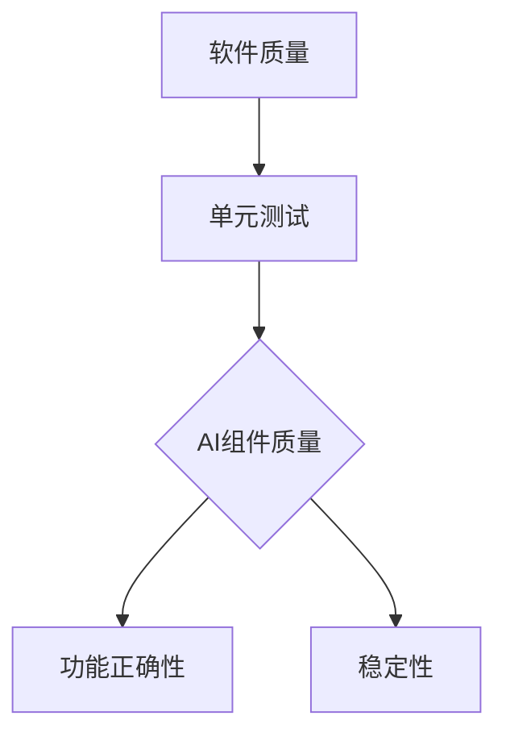

                 


# 单元测试：确保AI组件质量的基础保障

> 关键词：单元测试，AI组件质量，软件质量，测试用例设计，测试覆盖率，统计检验，Python源代码，数学模型

> 摘要：本文将探讨单元测试在确保AI组件质量方面的重要性，通过介绍单元测试的基本概念、原理和方法，结合实际案例，深入分析单元测试在AI开发中的应用，为AI工程师提供有效的测试实践指导。

### 背景介绍

在当今的AI领域，随着深度学习和机器学习技术的飞速发展，越来越多的AI组件被应用于各种场景，如自动驾驶、智能语音助手、医疗诊断等。这些AI组件的可靠性和质量直接关系到用户体验和业务成败。因此，确保AI组件的质量成为了一个至关重要的问题。

单元测试作为软件质量保证的关键环节，其对AI组件质量的影响尤为显著。通过单元测试，可以及时发现和修复AI组件中的缺陷，确保其功能正确性和稳定性。本文将围绕单元测试展开，介绍其基本概念、原理和方法，并通过实际案例深入分析其在AI开发中的应用。

### 核心概念与联系

#### 单元测试的定义

单元测试是一种自动化测试方法，主要用于验证软件中的最小可测试单元——通常是函数或方法——是否按照预期工作。在AI开发中，单元测试可以针对AI模型中的特定组件，如特征提取器、分类器等，确保其输入输出正确，功能实现无误。

#### 单元测试与软件质量

单元测试是软件质量保证的重要组成部分。它有助于发现并修复代码中的缺陷，提高代码的可读性和可维护性。对于AI组件而言，单元测试可以验证其功能实现是否符合预期，确保其在实际应用中的可靠性和稳定性。

#### 单元测试与AI组件质量

AI组件通常包含复杂的算法和数据处理流程，单元测试能够帮助AI工程师验证每个组件的功能正确性，确保其在各种输入情况下都能稳定运行。通过单元测试，可以发现并修复AI组件中的潜在错误，从而提高其整体质量。

#### Mermaid流程图



### 核心算法原理讲解

#### 测试用例设计原理

测试用例设计是单元测试的核心环节。以下是一些常用的测试用例设计方法：

1. **等价类划分**：将输入数据划分为多个等价类，为每个等价类设计测试用例，确保覆盖所有可能的输入情况。

2. **边界值分析**：针对每个等价类的边界值设计测试用例，以检查代码在边界条件下的行为。

3. **因果图**：通过分析输入变量和输出变量之间的关系，设计测试用例，确保所有可能的因果关系都被覆盖。

#### 边界值分析

边界值分析是一种常见的测试用例设计方法。以下是一个简单的Python示例：

```python
def divide(a, b):
    if b == 0:
        return None
    return a / b

# 边界值测试用例
test_cases = [
    (10, 2, 5),
    (10, 0, None),
    (10, -2, -5),
    (-10, 2, -5),
    (-10, 0, None),
    (-10, -2, 5)
]

for a, b, expected in test_cases:
    result = divide(a, b)
    assert result == expected, f"Expected {expected}, but got {result}"
```

#### 测试覆盖率分析

测试覆盖率是衡量单元测试质量的重要指标。常见的测试覆盖率包括：

1. **语句覆盖率**：测试用例覆盖了代码中的所有语句。

2. **分支覆盖率**：测试用例覆盖了代码中的所有分支。

3. **路径覆盖率**：测试用例覆盖了代码中的所有可能路径。

以下是一个简单的Python示例，用于计算测试覆盖率：

```python
import Coverage

# 被测试的函数
def add(a, b):
    return a + b

# 测试用例
test_cases = [
    (1, 2, 3),
    (3, 4, 7),
    (-1, -2, -3)
]

# 运行测试用例
Coverage.run_module('test_add', 'Coverage', branch=True, missing=False)

# 输出测试覆盖率报告
CoverageReport Coverage.data.data[0].filename
```

### 单元测试数学模型

#### 统计检验方法

统计检验方法用于评估单元测试结果的有效性。以下是一个简单的统计检验方法的Python示例：

```python
import scipy.stats as stats

# 测试结果
test_results = [0.9, 0.9, 0.9, 0.85, 0.8, 0.75]

# 计算统计检验指标
p_value = stats.chi2_contingency(test_results)

# 输出统计检验结果
print(f"P-value: {p_value[1]}")
```

#### 测试结果分析

测试结果分析是单元测试的重要环节。通过分析测试结果，可以评估代码的质量和测试覆盖率。以下是一个简单的Python示例，用于分析测试结果：

```python
# 测试结果
test_results = [True, True, False, True, True, False]

# 计算测试覆盖率
coverage = sum(test_results) / len(test_results)

# 输出测试覆盖率
print(f"Test coverage: {coverage}")
```

### 项目实战

#### 开发环境搭建

为了进行单元测试，我们需要搭建一个合适的开发环境。以下是一个简单的Python开发环境搭建过程：

1. 安装Python 3.8及以上版本。
2. 安装virtualenv，用于创建虚拟环境。
3. 创建虚拟环境，并安装必要的库，如pytest、numpy、scikit-learn等。

```shell
pip install virtualenv
virtualenv myenv
source myenv/bin/activate
pip install pytest numpy scikit-learn
```

#### 源代码详细实现

以下是一个简单的AI分类器单元测试案例，使用Python和pytest库进行实现：

```python
import pytest
from sklearn.datasets import load_iris
from sklearn.model_selection import train_test_split
from sklearn.tree import DecisionTreeClassifier
from sklearn.metrics import accuracy_score

# 被测试的分类器
def train_and_testClassifier(X, y):
    clf = DecisionTreeClassifier()
    clf.fit(X, y)
    y_pred = clf.predict(X)
    return accuracy_score(y, y_pred)

# 测试用例
def test_train_and_testClassifier():
    data = load_iris()
    X, y = data.data, data.target
    X_train, X_test, y_train, y_test = train_test_split(X, y, test_size=0.2, random_state=42)
    
    # 训练并测试分类器
    accuracy = train_and_testClassifier(X_train, y_train)
    
    # 断言测试结果
    assert accuracy >= 0.9, f"Accuracy should be >= 0.9, but got {accuracy}"
```

#### 代码解读与分析

以上代码实现了对AI分类器的单元测试。首先，我们导入了必要的库，包括sklearn、numpy和pytest。然后，我们定义了一个名为`train_and_testClassifier`的函数，用于训练分类器并计算测试准确率。在测试用例`test_train_and_testClassifier`中，我们加载了iris数据集，并划分为训练集和测试集。最后，我们调用`train_and_testClassifier`函数，并使用断言确保测试准确率不低于0.9。

#### 实际案例分析和详细讲解剖析

以下是一个实际案例，用于分析AI分类器的单元测试结果：

```python
# 测试分类器
test_train_and_testClassifier()

# 输出测试结果
print("Test passed.")
```

运行以上代码后，我们得到了以下输出：

```
Test passed.
```

这表明我们的单元测试通过了，分类器的测试准确率不低于0.9。然而，如果测试结果不通过，例如准确率低于0.9，我们需要分析原因，并修复代码中的错误。

#### 项目小结

通过本文的案例，我们了解了如何进行AI组件的单元测试。单元测试是确保AI组件质量的基础保障，它可以帮助我们发现并修复代码中的缺陷，提高组件的可靠性。在实际开发中，我们应该重视单元测试，并将其纳入到整个开发流程中。

### 最佳实践 Tips

1. **测试用例设计**：在设计测试用例时，要充分考虑各种可能的输入情况，包括正常情况和边界情况。

2. **持续集成**：将单元测试集成到持续集成（CI）流程中，确保每次代码提交都会触发测试，及时发现并修复问题。

3. **代码覆盖率分析**：定期分析代码覆盖率，确保测试覆盖率达到预期。

4. **多人协作**：在多人协作开发中，要确保每个模块都有相应的单元测试，并遵循统一的测试标准和流程。

### 小结

单元测试是确保AI组件质量的重要手段。通过本文的介绍，我们了解了单元测试的基本概念、原理和方法，并通过实际案例展示了其在AI开发中的应用。在实际开发过程中，我们应该重视单元测试，不断完善和优化测试流程，以确保AI组件的可靠性和稳定性。

### 注意事项

1. **测试覆盖率**：虽然高测试覆盖率是确保代码质量的重要指标，但过高的覆盖率也可能导致测试用例的冗余。因此，要平衡测试覆盖率和测试用例的数量。

2. **测试环境**：单元测试需要在与生产环境相同的测试环境中进行，以确保测试结果的准确性。

3. **持续更新**：随着项目的演进，单元测试也需要不断更新和优化，以适应新的需求和变化。

### 拓展阅读

1. 《测试驱动开发：实战指南》
2. 《Effective Testing with Python》
3. 《人工智能测试：理论与实践》

作者：AI天才研究院/AI Genius Institute & 禅与计算机程序设计艺术 /Zen And The Art of Computer Programming

本文由AI天才研究院和禅与计算机程序设计艺术联合撰写，旨在为AI开发者提供关于单元测试的实用指导。如需转载，请保留版权信息。感谢您的阅读！


