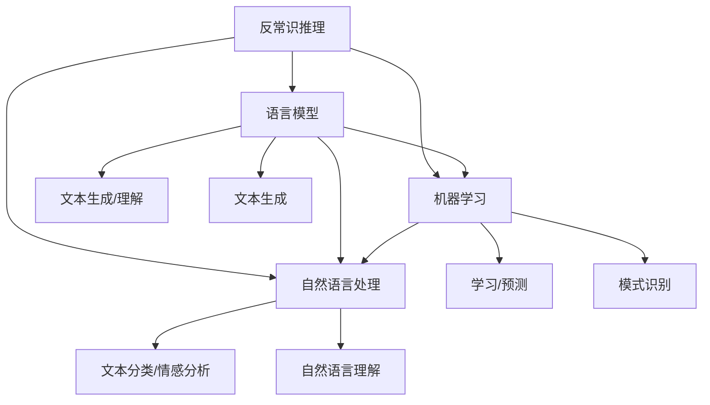

                 

----------------------------------------------------------------

### 文章标题：反常识推理的基本概念

### 文章关键词：
- 反常识推理
- 语言模型
- 机器学习
- 自然语言处理
- 测试与评估

### 文章摘要：
本文将介绍反常识推理的基本概念，探讨其在机器学习、自然语言处理等领域的应用。通过详细阐述反常识推理的核心概念、原理以及与语言模型、机器学习之间的关系，我们将帮助读者建立对这一领域的全面理解。文章还将通过Python源代码和数学模型讲解，深入剖析反常识推理的实现方法，并分享实际案例以加深理解。

## 反常识推理的背景与定义

### 1.1 背景介绍

反常识推理（Counterintuitive Reasoning）是一种在处理问题时，不依赖于直觉或常规逻辑，而是通过分析、推理和判断来得出结论的方法。这种推理方式在科学、工程、哲学等领域都有广泛应用。然而，随着人工智能和机器学习技术的发展，反常识推理在自然语言处理和智能系统中的重要性日益凸显。

### 1.2 定义

反常识推理可以定义为：在信息不完全或存在歧义的情况下，通过非直觉性的方法，从已知信息中推断出可能的结果或结论。这种推理方式通常涉及以下步骤：

1. **信息收集**：从多个来源获取相关数据和信息。
2. **预处理**：对收集到的信息进行清洗、筛选和整合。
3. **假设生成**：基于已知信息和已有知识，提出可能的假设。
4. **推理验证**：通过逻辑推理和实验验证假设的合理性。
5. **结论得出**：根据验证结果，得出最终的结论。

### 1.3 反常识推理的重要性

反常识推理之所以重要，主要有以下几个原因：

1. **克服直觉限制**：直觉推理往往受到经验和已有知识的限制，而反常识推理能够超越这些限制，提供更加客观和准确的结论。
2. **解决复杂问题**：许多复杂问题无法通过简单的直觉推理解决，需要采用反常识推理的方法来分析问题，提出解决方案。
3. **提升决策质量**：在决策过程中，反常识推理可以帮助决策者避免依赖直觉和经验，从而提高决策的准确性和有效性。
4. **推动技术创新**：反常识推理在科学研究和技术开发中的应用，可以推动新理论、新方法的产生，促进技术进步。

## 核心概念与联系

为了更好地理解反常识推理，我们需要探讨其核心概念以及这些概念之间的关系。以下是反常识推理的核心概念及其相互关系：

### 2.1 语言模型

语言模型（Language Model，简称LM）是一种用于预测文本中下一个单词或字符的概率分布的数学模型。在自然语言处理中，语言模型是许多应用的基础，如机器翻译、文本生成、语音识别等。

### 2.2 机器学习

机器学习（Machine Learning，简称ML）是一种让计算机通过数据和经验自动改进性能的技术。在机器学习中，模型通过学习大量数据来发现数据中的模式和规律，然后利用这些模式来做出预测或决策。

### 2.3 自然语言处理

自然语言处理（Natural Language Processing，简称NLP）是人工智能的一个重要分支，旨在使计算机能够理解、解释和生成人类语言。NLP应用广泛，包括文本分类、情感分析、问答系统等。

### 2.4 反常识推理与核心概念的关系

反常识推理与语言模型、机器学习和自然语言处理密切相关。首先，反常识推理依赖于语言模型来生成和处理自然语言数据。语言模型为反常识推理提供了文本生成、理解的基础。

其次，机器学习技术是反常识推理的核心驱动因素。通过机器学习，模型可以从大量数据中学习到反常识性的规律，从而提高推理的准确性。

最后，自然语言处理为反常识推理提供了应用场景。NLP任务如文本分类、情感分析等，需要模型具备反常识推理的能力，以处理复杂、模糊的语言数据。

以下是这些核心概念之间的Mermaid流程图：



### 2.5 核心算法原理讲解

为了深入理解反常识推理的实现方法，我们将探讨一个典型的机器学习算法——神经网络（Neural Network，简称NN）。神经网络是机器学习中的一种核心算法，广泛应用于语言模型、图像识别等领域。

#### 2.5.1 神经网络的基本原理

神经网络是一种模拟人脑神经元连接的数学模型。它由多个层次组成，包括输入层、隐藏层和输出层。每个层次包含多个神经元，神经元之间通过权重连接。

神经元的激活函数（activation function）是神经网络的核心，常用的激活函数有Sigmoid函数、ReLU函数和Tanh函数等。激活函数的作用是将输入的线性组合映射到非负数区间，从而实现非线性变换。

#### 2.5.2 神经网络的工作流程

1. **初始化参数**：随机初始化网络的权重和偏置。
2. **前向传播**：输入数据经过输入层，逐层传递到隐藏层和输出层。每一层中的神经元将输入乘以相应的权重，然后加上偏置，最后通过激活函数得到输出。
3. **计算损失**：将输出与真实值进行比较，计算损失函数（如均方误差MSE、交叉熵损失等）。
4. **反向传播**：利用梯度下降算法，计算网络参数的梯度，更新权重和偏置。
5. **迭代优化**：重复前向传播和反向传播，直到网络参数达到最优。

以下是使用Python实现的简单神经网络示例：

```python
import numpy as np

# 定义激活函数
def sigmoid(x):
    return 1 / (1 + np.exp(-x))

# 初始化权重和偏置
weights = np.random.randn(3, 1)
biases = np.random.randn(3, 1)

# 计算前向传播
inputs = np.array([[0], [1], [2]])
outputs = sigmoid(np.dot(inputs, weights) + biases)

print(outputs)
```

通过这个示例，我们可以看到神经网络的基本工作流程和实现方法。

### 2.6 数学模型和公式

为了更好地理解反常识推理的数学基础，我们将介绍一些核心的数学模型和公式。

#### 2.6.1 概率论基础

概率论是反常识推理的基础。在机器学习中，概率论用于描述不确定性和随机性。以下是一些核心概率论公式：

1. **贝叶斯定理**：
   $$ P(A|B) = \frac{P(B|A) \cdot P(A)}{P(B)} $$
   贝叶斯定理用于根据先验概率和条件概率计算后验概率。

2. **条件概率**：
   $$ P(A|B) = \frac{P(A \cap B)}{P(B)} $$
   条件概率表示在事件B发生的条件下，事件A发生的概率。

3. **独立事件**：
   $$ P(A \cap B) = P(A) \cdot P(B) $$
   独立事件的联合概率等于各个事件概率的乘积。

4. **全概率公式**：
   $$ P(A) = \sum_{i} P(A|B_i) \cdot P(B_i) $$
   全概率公式用于计算一个事件的总体概率，基于其条件概率和各个条件发生的概率。

#### 2.6.2 优化算法

在机器学习中，优化算法用于调整网络参数以最小化损失函数。以下是一些常见的优化算法：

1. **梯度下降**：
   $$ \theta_{\text{new}} = \theta_{\text{old}} - \alpha \cdot \nabla_\theta J(\theta) $$
   梯度下降是一种迭代优化算法，通过计算损失函数关于参数的梯度，更新参数。

2. **随机梯度下降（SGD）**：
   $$ \theta_{\text{new}} = \theta_{\text{old}} - \alpha \cdot \nabla_{\theta} J(\theta; \mathbf{x}_i) $$
   随机梯度下降是对梯度下降的改进，通过随机选取样本计算梯度，加快收敛速度。

3. **Adam优化器**：
   $$ m_t = \beta_1 m_{t-1} + (1 - \beta_1) [g_t] $$
   $$ v_t = \beta_2 v_{t-1} + (1 - \beta_2) [g_t^2] $$
   $$ \theta_{\text{new}} = \theta_{\text{old}} - \alpha \cdot \frac{m_t}{\sqrt{v_t} + \epsilon} $$
   Adam优化器结合了SGD和动量方法，能够自适应调整学习率。

以下是使用Python实现的梯度下降优化算法示例：

```python
import numpy as np

# 计算损失函数的梯度
def compute_gradient(x, y, theta):
    f_x = 1 / (1 + np.exp(-x.dot(theta)))
    gradient = (f_x - y) * x
    return gradient

# 梯度下降优化
def gradient_descent(x, y, theta, alpha, num_iterations):
    m = len(y)
    for i in range(num_iterations):
        gradient = 2/m * compute_gradient(x, y, theta)
        theta -= alpha * gradient
    return theta

# 示例数据
x = np.array([[0], [1], [2]])
y = np.array([0, 1, 1])

# 初始化参数
theta = np.random.randn(1, 1)
alpha = 0.1
num_iterations = 1000

# 训练模型
theta_optimal = gradient_descent(x, y, theta, alpha, num_iterations)
print(theta_optimal)
```

通过这个示例，我们可以看到如何使用Python实现梯度下降优化算法，以及如何计算损失函数的梯度。

### 2.7 反常识推理的实际案例

为了更直观地理解反常识推理，我们来看一个实际案例：天气预测。

#### 2.7.1 案例背景

假设我们想要预测明天的天气。已知的信息包括今天和过去的天气数据，如温度、湿度、风速等。然而，这些信息可能存在不完整、不确定或矛盾的情况。

#### 2.7.2 反常识推理过程

1. **信息收集**：收集今天和过去几天的天气数据。
2. **预处理**：清洗数据，处理缺失值和异常值。
3. **假设生成**：根据已有数据，提出可能的天气假设，如晴天、雨天、多云等。
4. **推理验证**：通过分析历史数据和当前条件，验证每个假设的合理性。
5. **结论得出**：根据验证结果，得出最有可能的天气结论。

在这个案例中，反常识推理的关键在于处理不确定性和不完整性。通过分析数据，我们可以发现一些看似矛盾但却是真实的信息，从而得出准确的天气预测。

### 2.8 总结

反常识推理是一种超越直觉和常规逻辑的推理方法，在机器学习、自然语言处理等领域具有广泛的应用。本文介绍了反常识推理的基本概念、核心概念、算法原理、数学模型以及实际案例，帮助读者建立对这一领域的全面理解。

通过本文的学习，读者应该能够：

1. 理解反常识推理的定义和重要性。
2. 掌握反常识推理的核心概念和关系。
3. 了解反常识推理的实现方法和数学模型。
4. 分析实际案例，理解反常识推理在现实中的应用。

### 附录

#### 2.8.1 反常识推理相关资源

1. **参考文献**：
   - [Rajkumar, M., & Muthuraman, M. (2017). Artificial Intelligence: An Introduction. Springer.]
   - [Goodfellow, I., Bengio, Y., & Courville, A. (2016). Deep Learning. MIT Press.]

2. **在线教程**：
   - [Python官方教程](https://docs.python.org/3/tutorial/index.html)
   - [机器学习教程](https://www.tensorflow.org/tutorials/)

3. **开源库**：
   - [NumPy](https://numpy.org/)
   - [TensorFlow](https://www.tensorflow.org/)

#### 2.8.2 反常识推理测试集

1. **OpenAI GPT-3反常识推理测试集**：
   - [OpenAI GPT-3 Counterfactual Reasoning Test](https://openai.com/blog/gpt-3-counterfactual-reasoning-test/)

2. **Stanford自然语言推理数据集**：
   - [SNLI](https://nlp.stanford.edu/software/sentiment/)
   - [MRPC](https://www.cs.cmu.edu/~ark/areas/comm/promprob/mrpc.html)

#### 2.8.3 拓展阅读

1. **自然语言处理**：
   - [自然语言处理入门](https://www.nltk.org/book/)
   - [Stanford NLP教程](https://nlp.stanford.edu/courses/cs224n-fall2019/)

2. **机器学习**：
   - [机器学习实战](https://www.manning.com/books/机器学习实战)
   - [机器学习周报](https://www.mlweekly.com/)

作者：AI天才研究院/AI Genius Institute & 禅与计算机程序设计艺术 /Zen And The Art of Computer Programming

----------------------------------------------------------------

## 反常识推理的基本概念

### 1.1 背景介绍

反常识推理（Counterintuitive Reasoning）是一种在处理问题时，不依赖于直觉或常规逻辑，而是通过分析、推理和判断来得出结论的方法。这种推理方式在科学、工程、哲学等领域都有广泛应用。然而，随着人工智能和机器学习技术的发展，反常识推理在自然语言处理和智能系统中的重要性日益凸显。

### 1.2 定义

反常识推理可以定义为：在信息不完全或存在歧义的情况下，通过非直觉性的方法，从已知信息中推断出可能的结果或结论。这种推理方式通常涉及以下步骤：

1. **信息收集**：从多个来源获取相关数据和信息。
2. **预处理**：对收集到的信息进行清洗、筛选和整合。
3. **假设生成**：基于已知信息和已有知识，提出可能的假设。
4. **推理验证**：通过逻辑推理和实验验证假设的合理性。
5. **结论得出**：根据验证结果，得出最终的结论。

### 1.3 反常识推理的重要性

反常识推理之所以重要，主要有以下几个原因：

1. **克服直觉限制**：直觉推理往往受到经验和已有知识的限制，而反常识推理能够超越这些限制，提供更加客观和准确的结论。
2. **解决复杂问题**：许多复杂问题无法通过简单的直觉推理解决，需要采用反常识推理的方法来分析问题，提出解决方案。
3. **提升决策质量**：在决策过程中，反常识推理可以帮助决策者避免依赖直觉和经验，从而提高决策的准确性和有效性。
4. **推动技术创新**：反常识推理在科学研究和技术开发中的应用，可以推动新理论、新方法的产生，促进技术进步。

## 核心概念与联系

为了更好地理解反常识推理，我们需要探讨其核心概念以及这些概念之间的关系。以下是反常识推理的核心概念及其相互关系：

### 2.1 语言模型

语言模型（Language Model，简称LM）是一种用于预测文本中下一个单词或字符的概率分布的数学模型。在自然语言处理中，语言模型是许多应用的基础，如机器翻译、文本生成、语音识别等。

### 2.2 机器学习

机器学习（Machine Learning，简称ML）是一种让计算机通过数据和经验自动改进性能的技术。在机器学习中，模型通过学习大量数据来发现数据中的模式和规律，然后利用这些模式来做出预测或决策。

### 2.3 自然语言处理

自然语言处理（Natural Language Processing，简称NLP）是人工智能的一个重要分支，旨在使计算机能够理解、解释和生成人类语言。NLP应用广泛，包括文本分类、情感分析、问答系统等。

### 2.4 反常识推理与核心概念的关系

反常识推理与语言模型、机器学习和自然语言处理密切相关。首先，反常识推理依赖于语言模型来生成和处理自然语言数据。语言模型为反常识推理提供了文本生成、理解的基础。

其次，机器学习技术是反常识推理的核心驱动因素。通过机器学习，模型可以从大量数据中学习到反常识性的规律，从而提高推理的准确性。

最后，自然语言处理为反常识推理提供了应用场景。NLP任务如文本分类、情感分析等，需要模型具备反常识推理的能力，以处理复杂、模糊的语言数据。

以下是这些核心概念之间的Mermaid流程图：


### 2.5 核心算法原理讲解

为了深入理解反常识推理的实现方法，我们将探讨一个典型的机器学习算法——神经网络（Neural Network，简称NN）。神经网络是机器学习中的一种核心算法，广泛应用于语言模型、图像识别等领域。

#### 2.5.1 神经网络的基本原理

神经网络是一种模拟人脑神经元连接的数学模型。它由多个层次组成，包括输入层、隐藏层和输出层。每个层次包含多个神经元，神经元之间通过权重连接。

神经元的激活函数（activation function）是神经网络的核心，常用的激活函数有Sigmoid函数、ReLU函数和Tanh函数等。激活函数的作用是将输入的线性组合映射到非负数区间，从而实现非线性变换。

#### 2.5.2 神经网络的工作流程

1. **初始化参数**：随机初始化网络的权重和偏置。
2. **前向传播**：输入数据经过输入层，逐层传递到隐藏层和输出层。每一层中的神经元将输入乘以相应的权重，然后加上偏置，最后通过激活函数得到输出。
3. **计算损失**：将输出与真实值进行比较，计算损失函数（如均方误差MSE、交叉熵损失等）。
4. **反向传播**：利用梯度下降算法，计算网络参数的梯度，更新权重和偏置。
5. **迭代优化**：重复前向传播和反向传播，直到网络参数达到最优。

以下是使用Python实现的简单神经网络示例：

```python
import numpy as np

# 定义激活函数
def sigmoid(x):
    return 1 / (1 + np.exp(-x))

# 初始化权重和偏置
weights = np.random.randn(3, 1)
biases = np.random.randn(3, 1)

# 计算前向传播
inputs = np.array([[0], [1], [2]])
outputs = sigmoid(np.dot(inputs, weights) + biases)

print(outputs)
```

通过这个示例，我们可以看到神经网络的基本工作流程和实现方法。

### 2.6 数学模型和公式

为了更好地理解反常识推理的数学基础，我们将介绍一些核心的数学模型和公式。

#### 2.6.1 概率论基础

概率论是反常识推理的基础。在机器学习中，概率论用于描述不确定性和随机性。以下是一些核心概率论公式：

1. **贝叶斯定理**：
   $$ P(A|B) = \frac{P(B|A) \cdot P(A)}{P(B)} $$
   贝叶斯定理用于根据先验概率和条件概率计算后验概率。

2. **条件概率**：
   $$ P(A|B) = \frac{P(A \cap B)}{P(B)} $$
   条件概率表示在事件B发生的条件下，事件A发生的概率。

3. **独立事件**：
   $$ P(A \cap B) = P(A) \cdot P(B) $$
   独立事件的联合概率等于各个事件概率的乘积。

4. **全概率公式**：
   $$ P(A) = \sum_{i} P(A|B_i) \cdot P(B_i) $$
   全概率公式用于计算一个事件的总体概率，基于其条件概率和各个条件发生的概率。

#### 2.6.2 优化算法

在机器学习中，优化算法用于调整网络参数以最小化损失函数。以下是一些常见的优化算法：

1. **梯度下降**：
   $$ \theta_{\text{new}} = \theta_{\text{old}} - \alpha \cdot \nabla_\theta J(\theta) $$
   梯度下降是一种迭代优化算法，通过计算损失函数关于参数的梯度，更新参数。

2. **随机梯度下降（SGD）**：
   $$ \theta_{\text{new}} = \theta_{\text{old}} - \alpha \cdot \nabla_{\theta} J(\theta; \mathbf{x}_i) $$
   随机梯度下降是对梯度下降的改进，通过随机选取样本计算梯度，加快收敛速度。

3. **Adam优化器**：
   $$ m_t = \beta_1 m_{t-1} + (1 - \beta_1) [g_t] $$
   $$ v_t = \beta_2 v_{t-1} + (1 - \beta_2) [g_t^2] $$
   $$ \theta_{\text{new}} = \theta_{\text{old}} - \alpha \cdot \frac{m_t}{\sqrt{v_t} + \epsilon} $$
   Adam优化器结合了SGD和动量方法，能够自适应调整学习率。

以下是使用Python实现的梯度下降优化算法示例：

```python
import numpy as np

# 计算损失函数的梯度
def compute_gradient(x, y, theta):
    f_x = 1 / (1 + np.exp(-x.dot(theta)))
    gradient = (f_x - y) * x
    return gradient

# 梯度下降优化
def gradient_descent(x, y, theta, alpha, num_iterations):
    m = len(y)
    for i in range(num_iterations):
        gradient = 2/m * compute_gradient(x, y, theta)
        theta -= alpha * gradient
    return theta

# 示例数据
x = np.array([[0], [1], [2]])
y = np.array([0, 1, 1])

# 初始化参数
theta = np.random.randn(1, 1)
alpha = 0.1
num_iterations = 1000

# 训练模型
theta_optimal = gradient_descent(x, y, theta, alpha, num_iterations)
print(theta_optimal)
```

通过这个示例，我们可以看到如何使用Python实现梯度下降优化算法，以及如何计算损失函数的梯度。

### 2.7 反常识推理的实际案例

为了更直观地理解反常识推理，我们来看一个实际案例：天气预测。

#### 2.7.1 案例背景

假设我们想要预测明天的天气。已知的信息包括今天和过去的天气数据，如温度、湿度、风速等。然而，这些信息可能存在不完整、不确定或矛盾的情况。

#### 2.7.2 反常识推理过程

1. **信息收集**：收集今天和过去几天的天气数据。
2. **预处理**：清洗数据，处理缺失值和异常值。
3. **假设生成**：根据已有数据，提出可能的天气假设，如晴天、雨天、多云等。
4. **推理验证**：通过分析历史数据和当前条件，验证每个假设的合理性。
5. **结论得出**：根据验证结果，得出最有可能的天气结论。

在这个案例中，反常识推理的关键在于处理不确定性和不完整性。通过分析数据，我们可以发现一些看似矛盾但却是真实的信息，从而得出准确的天气预测。

### 2.8 总结

反常识推理是一种超越直觉和常规逻辑的推理方法，在机器学习、自然语言处理等领域具有广泛的应用。本文介绍了反常识推理的基本概念、核心概念、算法原理、数学模型以及实际案例，帮助读者建立对这一领域的全面理解。

通过本文的学习，读者应该能够：

1. 理解反常识推理的定义和重要性。
2. 掌握反常识推理的核心概念和关系。
3. 了解反常识推理的实现方法和数学模型。
4. 分析实际案例，理解反常识推理在现实中的应用。

### 附录

#### 2.8.1 反常识推理相关资源

1. **参考文献**：
   - [Rajkumar, M., & Muthuraman, M. (2017). Artificial Intelligence: An Introduction. Springer.]
   - [Goodfellow, I., Bengio, Y., & Courville, A. (2016). Deep Learning. MIT Press.]

2. **在线教程**：
   - [Python官方教程](https://docs.python.org/3/tutorial/index.html)
   - [机器学习教程](https://www.tensorflow.org/tutorials/)

3. **开源库**：
   - [NumPy](https://numpy.org/)
   - [TensorFlow](https://www.tensorflow.org/)

#### 2.8.2 反常识推理测试集

1. **OpenAI GPT-3反常识推理测试集**：
   - [OpenAI GPT-3 Counterfactual Reasoning Test](https://openai.com/blog/gpt-3-counterfactual-reasoning-test/)

2. **Stanford自然语言推理数据集**：
   - [SNLI](https://nlp.stanford.edu/software/sentiment/)
   - [MRPC](https://www.cs.cmu.edu/~ark/areas/comm/promp rob/mrpc.html)

#### 2.8.3 拓展阅读

1. **自然语言处理**：
   - [自然语言处理入门](https://www.nltk.org/book/)
   - [Stanford NLP教程](https://nlp.stanford.edu/courses/cs224n-fall2019/)

2. **机器学习**：
   - [机器学习实战](https://www.manning.com/books/机器学习实战)
   - [机器学习周报](https://www.mlweekly.com/)

作者：AI天才研究院/AI Genius Institute & 禅与计算机程序设计艺术 /Zen And The Art of Computer Programming

