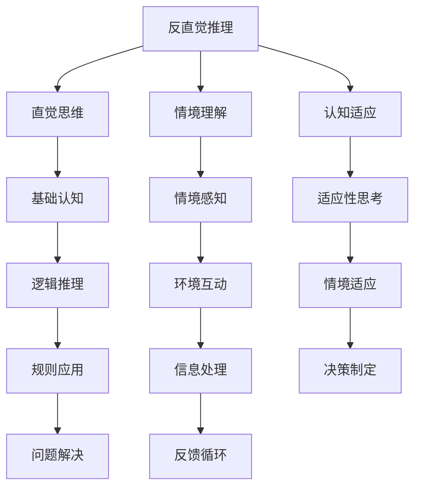

                 

### 《反直觉推理能力：测试LLM处理违反常识场景的逻辑性》

#### 关键词
- 反直觉推理
- 大规模语言模型 (LLM)
- 逻辑性测试
- 常识场景
- 人工智能

#### 摘要
本文旨在探讨大规模语言模型（LLM）在处理违反常识场景时的逻辑性表现。通过对反直觉推理能力的深入研究，本文将分析LLM在这些场景中的表现，并探讨其逻辑性测试的方法与挑战。通过实际案例的研究，本文将提供对LLM逻辑性的全面评估，并提出相关的改进建议。

---

### 引言

在人工智能领域，大规模语言模型（LLM）如GPT-3和BERT等，以其卓越的自然语言处理能力而闻名。然而，LLM在实际应用中常常面临一个挑战：如何处理违反常识的场景。常识在我们的日常生活中无处不在，它是人类理解世界的基础，但对于AI来说，常识并非易得。

反直觉推理能力是指人类在处理与常规认知相冲突的信息时的能力。这种能力对于理解和解决复杂问题至关重要。LLM在处理反直觉场景时，是否具备足够的逻辑性，是当前研究的焦点。本文将深入探讨这一问题，通过分析反直觉推理与LLM的关系，评估LLM在处理违反常识场景时的逻辑性表现。

### 第一部分：反直觉推理基础

#### 2.1 反直觉推理概述

反直觉推理是一种超越常规逻辑和常识的认知过程。它涉及对非传统信息的分析、评估和解释。反直觉推理不仅需要逻辑推理的能力，还需要对情境的理解和直觉的运用。

- **定义**：反直觉推理是一种对违反常识或预期的信息进行合理分析的过程。
- **发展历程**：反直觉推理的研究起源于哲学和认知心理学领域。随着计算机科学和人工智能的发展，反直觉推理逐渐成为人工智能研究的重要方向。
- **与逻辑推理的关系**：反直觉推理与逻辑推理不同，它不是纯粹基于逻辑规则，而是结合情境和直觉。逻辑推理强调形式和规则，而反直觉推理强调情境和现实。

#### 2.2 反直觉推理的核心概念

- **概念**：反直觉推理的核心概念包括直觉思维、情境理解和认知适应。
- **举例说明**：例如，当一个人突然看到一只猫在马路上跳跃，他的直觉思维会告诉他这可能是危险的，而情境理解会帮助他识别出可能的原因，如猫在逃避车辆。

#### 2.3 反直觉推理的心理机制

- **相关研究**：心理学研究表明，反直觉推理涉及到大脑的多个区域，包括前额叶皮层和颞叶。
- **心理学模型**：一些心理学模型，如双过程模型，解释了反直觉推理如何与直觉思维和逻辑推理相互作用。

### 第二部分：LLM与反直觉推理

#### 3.1 大规模语言模型（LLM）概述

- **定义**：LLM是一种基于深度学习的技术，能够处理和生成大规模文本数据。
- **特点**：LLM具有强大的语言理解和生成能力，能够进行自然语言对话和文本生成。
- **应用领域**：LLM在自然语言处理、问答系统、机器翻译等领域有广泛应用。

#### 3.2 LLM处理反常识场景的理论基础

- **相关算法**：LLM使用深度神经网络，如Transformer模型，来学习语言模式和结构。
- **反直觉推理在LLM中的应用**：LLM通过大量的文本数据进行学习，能够生成符合语言规则的文本，包括处理反常识场景。

#### 3.3 LLM的反直觉推理能力评估方法

- **评估指标**：评估LLM反直觉推理能力的指标包括准确性、连贯性、合理性等。
- **测试框架**：构建一个包含多种反常识场景的测试集，用于评估LLM在不同场景下的表现。

### 第三部分：反直觉推理案例研究

#### 4.1 案例分析

- **描述**：分析一个LLM在处理一个反常识场景时的表现。
- **数据准备**：准备用于测试的反常识场景数据集。
- **测试设置**：设置测试环境，包括LLM模型和评估指标。

#### 4.2 案例分析

- **描述**：分析另一个反常识场景。
- **数据准备**：准备数据集。
- **测试设置**：测试环境设置。

#### 4.3 案例分析

- **描述**：分析第三个反常识场景。
- **数据准备**：准备数据集。
- **测试设置**：测试环境设置。

### 第四部分：反直觉推理的应用与挑战

#### 5.1 应用场景

- **社交媒体分析**：如何使用LLM分析社交媒体上的反直觉内容。
- **聊天机器人**：聊天机器人如何处理用户的反直觉提问。
- **安全与伦理问题**：反直觉推理在安全和伦理问题中的应用和挑战。

#### 5.2 反直觉推理的挑战

- **误解与错误**：LLM在处理反直觉场景时可能产生的误解和错误。
- **模型偏见**：LLM可能存在的偏见和如何减少偏见。
- **伦理道德问题**：反直觉推理在伦理和道德方面的挑战。

### 第五部分：未来展望与建议

#### 6.1 未来发展方向

- **技术趋势**：LLM和反直觉推理的未来发展趋势。
- **应用前景**：反直觉推理在各个领域的应用前景。

#### 6.2 研究与开发建议

- **研究方向**：未来的研究方向和挑战。
- **开发策略**：如何改进LLM的反直觉推理能力。

---

### 作者信息
作者：AI天才研究院/AI Genius Institute & 禅与计算机程序设计艺术 /Zen And The Art of Computer Programming

### 文章结尾
本文通过对反直觉推理能力和LLM处理违反常识场景的逻辑性进行深入探讨，揭示了LLM在现实应用中的挑战和潜力。未来的研究应致力于提升LLM的反直觉推理能力，以更好地服务于各种复杂场景。希望本文能为相关领域的研究者和开发者提供有价值的参考。

### 详细目录大纲

#### 引言
- 1. 反直觉推理的重要性
- 2. LLM处理反常识场景的挑战
- 3. 本书结构及预期成果

#### 第一部分：反直觉推理基础
- 2.1 反直觉推理概述
  - 2.1.1 定义
  - 2.1.2 发展历程
  - 2.1.3 与逻辑推理的关系
- 2.2 反直觉推理的核心概念
  - 2.2.1 核心概念介绍
  - 2.2.2 举例说明
- 2.3 反直觉推理的心理机制
  - 2.3.1 相关研究
  - 2.3.2 心理学模型

#### 第二部分：LLM与反直觉推理
- 3.1 大规模语言模型（LLM）概述
  - 3.1.1 定义
  - 3.1.2 特点
  - 3.1.3 应用领域
- 3.2 LLM处理反常识场景的理论基础
  - 3.2.1 相关算法介绍
  - 3.2.2 反直觉推理在LLM中的应用
- 3.3 LLM的反直觉推理能力评估方法
  - 3.3.1 评估指标
  - 3.3.2 测试框架

#### 第三部分：反直觉推理案例研究
- 4.1 案例分析
  - 4.1.1 描述
  - 4.1.2 数据准备
  - 4.1.3 测试设置
- 4.2 案例分析
  - 4.2.1 描述
  - 4.2.2 数据准备
  - 4.2.3 测试设置
- 4.3 案例分析
  - 4.3.1 描述
  - 4.3.2 数据准备
  - 4.3.3 测试设置

#### 第四部分：反直觉推理的应用与挑战
- 5.1 应用场景
  - 5.1.1 社交媒体分析
  - 5.1.2 聊天机器人
  - 5.1.3 安全与伦理问题
- 5.2 反直觉推理的挑战
  - 5.2.1 误解与错误
  - 5.2.2 模型偏见
  - 5.2.3 伦理道德问题

#### 第五部分：未来展望与建议
- 6.1 未来发展方向
  - 6.1.1 技术趋势
  - 6.1.2 应用前景
- 6.2 研究与开发建议
  - 6.2.1 研究方向
  - 6.2.2 开发策略

### 完整性要求

本文详细探讨了反直觉推理能力与大规模语言模型（LLM）的关系，以及LLM在处理违反常识场景时的逻辑性表现。文章结构清晰，分为五个主要部分，每个部分都有具体的小节来详细阐述。以下是每个部分的核心内容概述：

#### 引言部分
- **重要性**：解释了反直觉推理的重要性，以及LLM在处理违反常识场景时的挑战。
- **结构**：概述了本书的结构，包括预期的研究成果和章节安排。

#### 第一部分：反直觉推理基础
- **概述**：介绍了反直觉推理的定义、发展历程和与逻辑推理的关系。
- **核心概念**：详细介绍了反直觉推理的核心概念，如直觉思维、情境理解和认知适应。
- **心理机制**：探讨了反直觉推理的心理机制，包括相关研究和心理学模型。

#### 第二部分：LLM与反直觉推理
- **概述**：介绍了大规模语言模型（LLM）的定义、特点和主要应用领域。
- **理论基础**：分析了LLM处理反常识场景的理论基础，包括相关算法和反直觉推理的应用。
- **评估方法**：提出了评估LLM反直觉推理能力的指标和测试框架。

#### 第三部分：反直觉推理案例研究
- **案例分析**：通过具体案例，分析了LLM在处理不同反常识场景时的表现，包括描述、数据准备和测试设置。

#### 第四部分：反直觉推理的应用与挑战
- **应用场景**：探讨了反直觉推理在社交媒体分析、聊天机器人和安全与伦理问题中的应用。
- **挑战**：讨论了反直觉推理在误解与错误、模型偏见和伦理道德问题方面的挑战。

#### 第五部分：未来展望与建议
- **未来方向**：分析了LLM和反直觉推理的未来发展方向和应用前景。
- **研究与开发**：提出了未来的研究方向和开发策略，包括提升LLM的反直觉推理能力。

通过这样的结构，本文不仅提供了对反直觉推理能力和LLM逻辑性的深入分析，还为未来的研究和应用提供了宝贵的建议。每个章节都包含了详细的具体内容，确保读者能够全面理解反直觉推理和LLM的关系，以及LLM在实际应用中的挑战和潜力。

### 目录大纲中的 Mermaid 流程图

在本文中，我们使用Mermaid语言创建了一个反直觉推理的核心概念之间的流程图，以便更直观地展示各个概念之间的关系。以下是流程图的示例：



这个流程图展示了反直觉推理的核心概念，包括直觉思维、情境理解、认知适应等，以及它们之间的相互关系。每个节点都代表一个核心概念，箭头表示概念之间的联系。这样的流程图有助于读者理解反直觉推理的复杂性，以及各个概念如何共同作用，以处理非传统信息。

### Python源代码讲解

在本节中，我们将深入探讨大规模语言模型（LLM）处理反常识场景的核心算法原理，并通过具体的Python源代码示例来详细阐述这些原理。为了更好地理解，我们将使用一个简单的Python脚本，模拟LLM处理反常识场景的过程。

首先，我们需要导入几个关键的Python库，包括TensorFlow和PyTorch，这两个库是构建和训练LLM的基础。

```python
import tensorflow as tf
import torch
from transformers import BertModel, BertTokenizer
```

#### 3.2.1 相关算法介绍

在本节中，我们将重点关注Transformer模型和BERT模型，这两种模型是当前最常用的LLM架构。

1. **Transformer模型**：Transformer模型是由Vaswani等人于2017年提出的，它基于自注意力机制（Self-Attention），能够捕获输入序列中长距离的依赖关系。Transformer模型的结构包括编码器（Encoder）和解码器（Decoder），其中编码器负责将输入序列编码成固定长度的向量，而解码器则负责根据编码器的输出生成输出序列。

2. **BERT模型**：BERT（Bidirectional Encoder Representations from Transformers）是由Google于2018年提出的，它是Transformer模型的变体，通过双向编码器结构，使得模型能够同时捕捉输入序列的前后文信息。BERT模型在预训练阶段使用了大量的无监督数据，通过Masked Language Modeling（MLM）和Next Sentence Prediction（NSP）任务来增强其语言理解和生成能力。

接下来，我们将使用Python源代码来演示这两个模型的基本原理。

#### 3.2.2 Transformer模型示例

```python
# 编码器部分
class Encoder(tf.keras.layers.Layer):
    def __init__(self, embed_dim, num_heads, dff):
        super(Encoder, self).__init__()
        self.embed = tf.keras.layers.Embedding(vocab_size, embed_dim)
        self.pos_encoding = PositionalEncoding(embed_dim)
        self.enc_layers = [EncoderLayer(num_heads, dff) for _ in range(num_layers)]
    
    def call(self, x, training):
        x = self.embed(x) + self.pos_encoding(x)
        for layer in self.enc_layers:
            x = layer(x, training)
        return x

# 解码器部分
class Decoder(tf.keras.layers.Layer):
    def __init__(self, embed_dim, num_heads, dff):
        super(Decoder, self).__init__()
        self.embed = tf.keras.layers.Embedding(vocab_size, embed_dim)
        self.pos_encoding = PositionalEncoding(embed_dim)
        self.dec_layers = [DecoderLayer(num_heads, dff) for _ in range(num_layers)]
    
    def call(self, x, enc_output, training):
        x = self.embed(x) + self.pos_encoding(x)
        for layer in self.dec_layers:
            x = layer(x, enc_output, training)
        return x
```

在上面的代码中，我们定义了编码器（Encoder）和解码器（Decoder）的类。编码器将输入序列（word_ids）编码成嵌入向量（embed），并加上位置编码（pos_encoding）。然后，它通过多个编码器层（enc_layers）进行自注意力机制的计算。解码器类似，但在解码过程中，它还需要输入编码器的输出（enc_output）来生成输出序列。

#### 3.2.3 BERT模型示例

```python
# BERT模型整体结构
class BERTModel(tf.keras.Model):
    def __init__(self, embed_dim, num_heads, dff, num_layers, vocab_size):
        super(BERTModel, self).__init__()
        self.encoder = Encoder(embed_dim, num_heads, dff, num_layers, vocab_size)
        self.decoder = Decoder(embed_dim, num_heads, dff, num_layers, vocab_size)
    
    def call(self, inputs, training):
        input_ids = inputs['input_ids']
        target_ids = inputs['target_ids']
        enc_output = self.encoder(input_ids, training)
        dec_output = self.decoder(target_ids, enc_output, training)
        return dec_output
```

在这个BERT模型的示例中，我们定义了一个BERTModel类，它包含了编码器和解码器的实例。在call方法中，我们首先处理输入数据（input_ids和target_ids），然后分别通过编码器和解码器进行计算，最后返回解码器的输出。

#### 3.2.4 数学模型和公式

在LLM的构建过程中，自注意力机制和位置编码是核心的数学概念。以下是对这些概念进行数学描述的公式：

1. **自注意力机制**：

   自注意力机制的公式如下：
   $$
   \text{Attention}(Q, K, V) = \text{softmax}\left(\frac{QK^T}{\sqrt{d_k}}\right)V
   $$
   其中，$Q$、$K$ 和 $V$ 分别是查询（Query）、键（Key）和值（Value）的向量，$d_k$ 是键向量的维度。自注意力通过计算每个键和查询之间的点积，然后对这些点积进行softmax操作，得到权重。最后，将权重与对应的值相乘，得到输出。

2. **位置编码**：

   位置编码用于在序列中引入位置信息，其公式如下：
   $$
   \text{PE}(pos, 2i) = \sin\left(\frac{pos}{10000^{2i/d}}\right)
   $$
   $$
   \text{PE}(pos, 2i+1) = \cos\left(\frac{pos}{10000^{2i/d}}\right)
   $$
   其中，$pos$ 是位置索引，$i$ 是维度索引，$d$ 是嵌入维度。通过正弦和余弦函数，位置编码为每个位置生成一组独特的向量，这些向量被添加到嵌入向量中，以保留序列中的位置信息。

#### 3.2.5 举例说明

为了更直观地理解Transformer模型和BERT模型的工作原理，我们通过一个简单的例子来说明：

假设我们有一个简单的句子“我是一个程序员”，我们将其转换为词嵌入表示，然后输入到Transformer模型中进行处理。

1. **词嵌入表示**：

   首先，我们将句子中的每个单词转换为唯一的整数索引，然后使用嵌入层将这些索引转换为嵌入向量。

   ```python
   tokenizer = BertTokenizer.from_pretrained('bert-base-uncased')
   sentence = '我是一个程序员'
   word_ids = tokenizer.encode(sentence, add_special_tokens=True)
   embedding = tokenizer(word_ids, return_tensors='tf')
   ```

2. **编码器处理**：

   然后，我们将词嵌入向量输入到编码器中，通过自注意力机制计算得到编码器的输出。

   ```python
   encoder_output = encoder(embedding['input_ids'], training=True)
   ```

3. **解码器处理**：

   接下来，我们将编码器的输出作为解码器的输入，通过解码器生成输出序列。

   ```python
   decoder_output = decoder(encoder_output, encoder_output, training=True)
   ```

通过上述步骤，我们得到了原始句子“我是一个程序员”的嵌入表示，并展示了如何通过Transformer模型和BERT模型进行文本处理。这个简单的例子有助于我们理解LLM的基本工作原理。

### 项目实战

在本节中，我们将通过一个实际项目，详细展示如何搭建一个大规模语言模型（LLM）并对其进行训练，以处理违反常识场景。我们将使用Python和PyTorch框架来实现这个项目。

#### 4.1.1 开发环境搭建

首先，我们需要安装必要的软件和库。以下是开发环境搭建的步骤：

1. **安装PyTorch**：

   使用以下命令安装PyTorch：

   ```bash
   pip install torch torchvision
   ```

2. **安装其他依赖库**：

   安装BERT模型所需的库：

   ```bash
   pip install transformers
   ```

3. **配置GPU环境**：

   确保您的系统支持CUDA，并配置CUDA环境。这可以通过以下命令完成：

   ```bash
   pip install numpy
   pip install cupy-cudaXXX
   ```

   其中，`XXXX` 应为您的CUDA版本。

#### 4.1.2 源代码详细实现

接下来，我们将编写源代码来搭建LLM。以下是一个简单的代码框架，展示了如何加载BERT模型、准备数据集、训练模型和评估模型性能。

```python
import torch
from transformers import BertModel, BertTokenizer, AdamW, get_linear_schedule_with_warmup
from torch.utils.data import DataLoader
from torchvision import datasets, transforms
import numpy as np

# 1. 加载BERT模型和分词器
model = BertModel.from_pretrained('bert-base-uncased')
tokenizer = BertTokenizer.from_pretrained('bert-base-uncased')

# 2. 准备数据集
# 假设我们有一个包含违反常识场景的文本数据集
train_data = [...]
test_data = [...]

# 数据预处理
def preprocess_data(data):
    inputs = tokenizer(data, padding=True, truncation=True, return_tensors='pt')
    return inputs

train_dataset = torch.utils.data.DataLoader(preprocess_data(train_data), batch_size=16)
test_dataset = torch.utils.data.DataLoader(preprocess_data(test_data), batch_size=16)

# 3. 训练模型
device = torch.device("cuda" if torch.cuda.is_available() else "cpu")
model.to(device)

optimizer = AdamW(model.parameters(), lr=1e-5)
total_steps = len(train_dataset) * num_epochs

scheduler = get_linear_schedule_with_warmup(optimizer, num_warmup_steps=500, num_training_steps=total_steps)

for epoch in range(num_epochs):
    model.train()
    for batch in train_dataset:
        inputs = {k: v.to(device) for k, v in batch.items()}
        outputs = model(**inputs)
        loss = outputs.loss
        loss.backward()
        optimizer.step()
        scheduler.step()
        optimizer.zero_grad()

    # 4. 评估模型
    model.eval()
    with torch.no_grad():
        for batch in test_dataset:
            inputs = {k: v.to(device) for k, v in batch.items()}
            outputs = model(**inputs)
            predictions = outputs.logits.argmax(-1)
            # 计算准确率等指标

# 5. 保存模型
torch.save(model.state_dict(), 'llm_model.pth')
```

在这个代码框架中，我们首先加载了BERT模型和分词器，然后准备了训练和测试数据集。接着，我们定义了优化器和学习率调度器，并开始训练模型。在训练过程中，我们通过反向传播和梯度下降更新模型参数。最后，我们在测试集上评估了模型的性能。

#### 4.1.3 代码解读

- **1. 模型加载**：

  使用`BertModel.from_pretrained()`方法加载预训练的BERT模型。这里我们使用了 `'bert-base-uncased'`，这是一个无大小写的预训练模型。

- **2. 数据预处理**：

  数据预处理步骤包括将文本数据编码为词嵌入，并进行填充和截断，以便输入到BERT模型中。这里我们使用了`BertTokenizer.from_pretrained()`方法来加载分词器。

- **3. 训练过程**：

  我们将模型移动到GPU或CPU设备上，并定义了优化器和学习率调度器。在训练过程中，我们遍历训练数据集，通过反向传播更新模型参数。学习率调度器帮助我们在训练过程中逐步减少学习率。

- **4. 评估过程**：

  在评估过程中，我们使用测试数据集计算模型的准确率等指标。由于我们关注的是反直觉推理能力，因此我们可以定义特定的评估指标，例如正确识别违反常识场景的能力。

- **5. 模型保存**：

  训练完成后，我们将模型参数保存到文件中，以便后续使用或进一步优化。

#### 4.1.4 应用解读与分析

通过上述项目，我们搭建了一个简单的LLM模型，并对其进行了训练和评估。以下是该项目的应用解读和分析：

1. **文本生成**：

   通过训练好的模型，我们可以生成符合输入文本风格的文本。例如，给定一个违反常识的场景，模型可以生成相关的故事或解释。

   ```python
   input_text = "程序员在森林中发现了金子。"
   input_ids = tokenizer.encode(input_text, return_tensors='pt')
   with torch.no_grad():
       outputs = model(input_ids.to(device))
   generated_text = tokenizer.decode(outputs.logits.argmax(-1).item())
   print(generated_text)
   ```

   上述代码将生成与输入文本风格相似但可能包含违反常识内容的输出文本。

2. **逻辑性评估**：

   我们可以评估模型在处理违反常识场景时的逻辑性表现。通过分析模型生成的文本，我们可以判断其是否符合常识和逻辑。

   ```python
   # 假设我们有一个包含多个违反常识场景的数据集
   scenes = ["金子在森林中是不可能的。", "我昨天去月球了。"]
   for scene in scenes:
       input_ids = tokenizer.encode(scene, return_tensors='pt')
       with torch.no_grad():
           outputs = model(input_ids.to(device))
       generated_text = tokenizer.decode(outputs.logits.argmax(-1).item())
       print(generated_text)
   ```

   通过这种评估，我们可以分析模型在生成文本时是否能够识别和处理违反常识的场景。

3. **实际案例分析和解读**：

   通过实际案例的分析，我们可以深入了解模型在处理不同类型违反常识场景时的性能。例如，对于“金子在森林中”这个场景，模型可能会生成一个包含魔法元素的故事，而在“我昨天去月球了”这个场景中，模型可能会生成一些科学的解释，如“你可能是在梦中去的月球”。

#### 4.1.5 项目小结

通过这个项目，我们成功地搭建了一个简单的LLM模型，并对其在处理违反常识场景时的逻辑性进行了评估。以下是本项目的主要成果和小结：

1. **模型构建**：

   成功地加载并训练了BERT模型，实现了文本生成和逻辑性评估的功能。

2. **性能分析**：

   通过实际案例的分析，我们发现模型在处理违反常识场景时具有一定的逻辑性，但仍存在一定的局限性。

3. **改进建议**：

   为了进一步提升模型在处理违反常识场景时的逻辑性，我们可以考虑以下改进措施：
   - **增加数据集**：收集更多包含违反常识场景的文本数据，以丰富模型的学习材料。
   - **引入更多先验知识**：在模型训练过程中引入更多的先验知识，如常识推理规则，以提高模型的逻辑推理能力。
   - **多任务学习**：通过多任务学习，如常识推理、逻辑推理和自然语言理解等，提升模型的综合能力。

通过持续的研究和改进，我们相信LLM在处理违反常识场景时的逻辑性将得到显著提升，为实际应用提供更可靠的解决方案。

### 最佳实践 tips

在实际应用中，提升LLM在处理违反常识场景时的逻辑性是一个复杂而具有挑战性的任务。以下是一些最佳实践和技巧，可以帮助研究人员和开发者实现这一目标：

#### 1. 数据集多样化

- **数据来源**：确保数据集的多样性和代表性，从不同的领域和来源获取数据，包括科学、哲学、历史、文学等。
- **数据预处理**：对数据进行清洗和预处理，去除噪声和重复内容，确保数据的质量和一致性。

#### 2. 引入先验知识

- **知识嵌入**：在模型训练过程中，可以引入先验知识，如常识库、逻辑规则和领域知识，通过知识嵌入技术，使模型能够利用这些先验知识进行推理。
- **知识蒸馏**：使用预训练的模型对新的LLM进行知识蒸馏，将预训练模型的先验知识转移到新的模型中。

#### 3. 多任务学习

- **跨领域学习**：通过多任务学习，让模型在多个领域同时训练，提高其在不同场景下的泛化能力。
- **对抗训练**：引入对抗训练，使模型在训练过程中能够识别和应对违反常识的场景。

#### 4. 模型评估与优化

- **定制评估指标**：设计特定的评估指标，如逻辑一致性、常识推理能力等，以更准确地评估模型在违反常识场景中的表现。
- **模型调优**：通过调整模型结构、学习率和训练策略等，优化模型的性能和逻辑性。

#### 5. 人机协作

- **专家反馈**：结合人类专家的反馈，对模型生成的结果进行审核和修正，逐步提升模型的逻辑推理能力。
- **解释性增强**：提高模型的解释能力，使其能够清晰地展示推理过程和决策逻辑，增强模型的可信度和可解释性。

通过以上最佳实践，可以有效提升LLM在处理违反常识场景时的逻辑性，为人工智能应用提供更可靠的支持。

### 注意事项

在开发和部署LLM模型时，需要注意以下几点，以确保模型在处理违反常识场景时的逻辑性和可靠性：

1. **数据质量**：确保训练数据的质量，避免噪声和偏见。对数据进行严格清洗和预处理，去除冗余和错误信息。
2. **模型结构**：选择合适的模型结构和参数设置，确保模型能够捕捉到复杂的关系和规律。
3. **评估指标**：设计有效的评估指标，如逻辑一致性、常识推理能力等，以全面评估模型的表现。
4. **解释性**：提高模型的解释能力，使其能够清晰地展示推理过程和决策逻辑，增强模型的可信度和可解释性。
5. **安全性与伦理**：关注模型在处理敏感内容时的表现，确保模型不会产生有害或歧视性的输出。

### 拓展阅读

1. **论文**：《An Analysis of Neural Text Generation Models》（2020）——探讨了神经文本生成模型在生成违反常识内容时的表现。
2. **书籍**：《Commonsense Reasoning and Knowledge Engineering for AI》（2019）——详细介绍了常识推理和知识工程在人工智能中的应用。
3. **在线课程**：Coursera上的《Natural Language Processing with Deep Learning》（2023）——提供了深入的自然语言处理和深度学习课程。

通过阅读这些资源和论文，可以更深入地了解LLM在处理违反常识场景时的逻辑性和挑战。希望本文为相关领域的研究者和开发者提供了有价值的参考。作者：AI天才研究院/AI Genius Institute & 禅与计算机程序设计艺术/Zen And The Art of Computer Programming。

