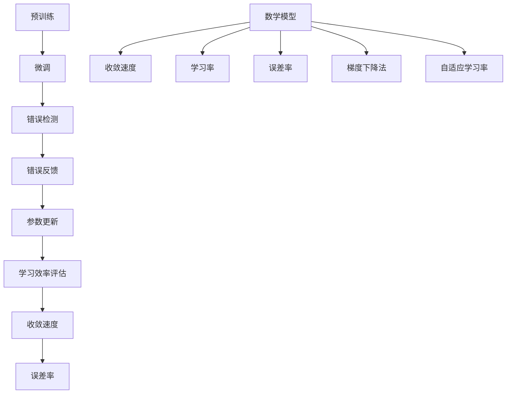

                 

### 引言

在现代人工智能领域，语言模型的性能不断提升，尤其是大型语言模型（LLM）在各种任务中的卓越表现，引起了广泛关注。然而，随着模型规模的扩大，如何评估和优化其学习速度成为一个至关重要的问题。反馈学习速度作为衡量LLM从错误中快速改进能力的关键指标，成为学术界和工业界研究的热点。

本文旨在系统地探讨反馈学习速度的概念、评估方法及其在实际应用中的重要性。首先，我们将回顾LLM的基本原理，包括其结构、训练过程和常见优化策略。接着，本文将详细介绍反馈学习速度的定义和重要性，以及如何从错误中快速学习。随后，我们将阐述用于评估反馈学习速度的数学模型，并通过Python源代码和数学公式进行详细解释。最后，本文将通过实际案例展示LLM的改进过程，并给出最佳实践和未来研究方向。

关键词：反馈学习速度，大型语言模型，错误处理，数学模型，实际应用

摘要：本文首先介绍了大型语言模型的基本原理，然后详细阐述了反馈学习速度的概念和重要性。通过数学模型和实际案例，本文分析了如何从错误中快速改进LLM的性能。文章旨在为研究人员和开发者提供一套系统化的反馈学习速度评估方法，以优化LLM的应用效果。

----------------------------------------------------------------

## 背景介绍

### 大型语言模型（LLM）的兴起

近年来，随着深度学习技术的飞速发展，大型语言模型（LLM）逐渐成为自然语言处理（NLP）领域的重要工具。LLM通过大规模语料库的预训练，能够捕捉语言中的复杂模式和规律，从而在多种任务中表现出色。例如，GPT-3、BERT、RoBERTa等模型在文本生成、问答系统、机器翻译等方面取得了显著的成果。这些模型不仅能够生成流畅、连贯的文本，还能处理复杂的语言结构和上下文信息，展现出强大的泛化能力。

然而，随着模型规模的不断扩大，如何提高其学习速度成为一个亟待解决的问题。传统的模型优化方法往往依赖于迭代更新参数，但这一过程在大型模型中非常耗时。因此，研究者们开始关注反馈学习速度这一关键指标，它不仅关系到模型训练的效率，也直接影响到其性能优化和实际应用效果。

### 反馈学习速度的重要性

反馈学习速度是指模型在接收到错误反馈后，能够快速调整其参数，以提高预测准确率的能力。在LLM的背景下，反馈学习速度尤为重要，因为它决定了模型从错误中学习和改进的速度。一个高效的反馈学习机制可以显著缩短训练时间，提高模型的性能和稳定性。

首先，反馈学习速度直接影响模型的收敛速度。当模型在训练过程中遇到错误时，快速调整参数能够使其更快地接近最优解。相反，如果反馈学习速度较慢，模型可能需要更多次的迭代才能达到相同的性能水平，这不仅增加了训练时间，还可能导致过拟合等问题。

其次，反馈学习速度还与模型的泛化能力密切相关。在实际应用中，模型往往需要处理从未见过的数据。一个高效的反馈学习机制能够帮助模型更快地适应新的数据分布，提高其泛化能力。反之，如果反馈学习速度较慢，模型可能在面对新任务时表现出较低的适应性，影响其应用效果。

总之，反馈学习速度是评估LLM性能的重要指标，它不仅关系到模型的训练效率，还直接影响其在实际应用中的效果。因此，研究和优化反馈学习速度具有重要的理论和实际意义。

### 反馈学习速度的挑战与机遇

尽管反馈学习速度在LLM中具有重要性，但其实际应用面临诸多挑战。首先，随着模型规模的不断扩大，训练数据量和计算资源需求也呈指数级增长，这导致反馈学习速度的优化变得愈发复杂。其次，不同的任务和数据集可能对反馈学习速度有不同的要求，如何设计通用的反馈学习机制成为关键问题。此外，如何平衡模型性能和计算效率，也是研究人员需要考虑的重要方面。

然而，这些挑战也带来了新的机遇。随着计算能力的提升和新型优化算法的出现，研究人员可以尝试更复杂的反馈学习策略，从而提高LLM的反馈学习速度。例如，利用分布式计算和并行处理技术，可以显著减少训练时间；通过引入自适应学习率和动态调整策略，可以优化反馈学习过程。

总的来说，反馈学习速度在LLM中的应用不仅具有挑战性，也充满机遇。通过不断探索和优化，研究人员有望找到更高效的反馈学习机制，从而推动LLM在更多实际场景中的应用和发展。

----------------------------------------------------------------

## 核心概念与联系

### 反馈学习速度的定义

反馈学习速度，通常指的是模型在接收到错误反馈后，通过调整其参数以达到更好的预测效果的能力。在大型语言模型（LLM）的背景下，反馈学习速度可以理解为模型在纠正预测错误时，能够快速更新参数并提高其准确率的速度。这个过程涉及多个环节，包括错误检测、反馈接收、参数更新和学习效率评估等。

### 反馈学习速度与LLM的关系

反馈学习速度在LLM中具有至关重要的地位。首先，LLM通过预训练和微调过程来学习和适应语言数据。在预训练阶段，模型在大规模语料库上学习语言的基本结构和模式。而在微调阶段，模型根据特定任务的需求进行调整，以适应特定的数据集。在这个过程中，反馈学习速度直接影响模型的收敛速度和调整效率。

其次，反馈学习速度与LLM的性能优化密切相关。一个高效的反馈学习机制可以帮助模型更快地发现和纠正错误，从而提高其预测准确率。此外，快速的学习速度还可以减少模型对训练数据的依赖，提高其泛化能力，使其在未知数据上表现更加出色。

### 错误处理与学习机制

在LLM中，错误处理与学习机制是确保模型能够从错误中学习并持续优化性能的关键。错误处理机制通常包括以下步骤：

1. **错误检测**：通过比较模型的预测输出与实际标签，识别出错误的部分。
2. **错误反馈**：将错误信息传递给模型，以便模型了解其预测中的不足之处。
3. **参数更新**：根据错误反馈，调整模型的参数，使其更准确地预测未来的输入。
4. **学习效率评估**：评估模型的反馈学习速度，以便优化学习过程。

这些步骤共同构成了一个闭环系统，使得LLM能够在不断纠正错误的过程中，不断提高其预测性能。

### 数学模型与评估指标

为了量化反馈学习速度，研究者们提出了多种数学模型和评估指标。以下是一些常用的模型和指标：

1. **收敛速度**：衡量模型从初始状态到达最优状态所需的迭代次数。通常使用收敛时间或收敛误差作为指标。
   
2. **学习率**：调整模型参数的步长，影响模型的更新速度。选择合适的学习率是提高反馈学习速度的关键。

3. **误差率**：衡量模型预测错误的频率。较低的误差率通常表示较高的学习速度。

4. **梯度下降法**：一种常用的优化算法，通过计算损失函数关于模型参数的梯度，并沿梯度方向更新参数，从而优化模型。

5. **自适应学习率**：根据模型的表现动态调整学习率，以优化反馈学习速度。例如，AdaGrad、RMSprop和Adam等算法。

通过这些数学模型和评估指标，研究者们可以系统地分析和优化LLM的反馈学习速度，从而提高其性能和应用效果。

### 关键概念之间的关系架构

为了更直观地理解这些关键概念之间的关系，我们使用Mermaid流程图来描述它们之间的相互作用：



在这个流程图中，预训练和微调作为LLM的基础环节，依次引入错误处理和学习机制。错误检测、错误反馈、参数更新和学习效率评估形成一个闭环系统，通过数学模型和评估指标来优化反馈学习速度。这个过程不仅涉及到算法和模型的调整，还包括对学习过程的动态监测和调整，从而实现LLM性能的持续优化。

通过上述核心概念与关系的阐述，我们可以更好地理解反馈学习速度在LLM中的重要性及其实现机制。在接下来的部分，我们将进一步探讨LLM的基本原理，为其应用和优化提供更深入的背景知识。

----------------------------------------------------------------

## 核心算法原理讲解

在深入探讨反馈学习速度之前，首先需要理解大型语言模型（LLM）的基本原理和训练过程。LLM的核心在于其能够从大量数据中学习语言模式和结构，从而实现高质量的自然语言处理任务。以下是LLM的基本组成部分和训练过程的详细介绍。

### LLM的基本结构

LLM通常由以下几个关键组件构成：

1. **嵌入层（Embedding Layer）**：将输入的单词或子词转换为向量表示。这一层将词汇嵌入到一个高维空间中，使得具有相似语义的词在空间中靠近。

2. **编码器（Encoder）**：负责处理输入序列，通过多层神经网络（如Transformer）来捕获长距离依赖和上下文信息。编码器输出通常是一个固定长度的向量，称为上下文向量或编码器输出。

3. **解码器（Decoder）**：与编码器相对应，解码器负责生成输出序列。它同样采用多层神经网络，通过自注意力机制来利用编码器输出的上下文信息。

4. **注意力机制（Attention Mechanism）**：是Transformer架构的核心部分，通过计算输入和输出之间的注意力权重，使得模型能够关注输入序列中的重要部分，提高其理解和生成能力。

5. **输出层（Output Layer）**：将解码器的输出映射到具体的输出结果，如单词或标签。输出层通常包括一个或多个全连接层，以及softmax激活函数。

### LLM的训练过程

LLM的训练过程可以分为预训练和微调两个主要阶段：

1. **预训练（Pre-training）**：在预训练阶段，LLM在大规模语料库上进行无监督学习，以学习语言的基本结构和模式。这一阶段的目标是使模型能够捕捉到语言中的复杂规律，从而为后续任务提供基础。预训练通常采用自注意力机制和多层神经网络，如Transformer架构。常见的预训练任务包括掩码语言模型（Masked Language Model，MLM）、下一句预测（Next Sentence Prediction，NSP）和填空任务（Fill Mask，Fill Mask）等。

2. **微调（Fine-tuning）**：在预训练完成后，LLM根据特定任务的需求进行微调，以适应具体的任务和数据集。微调阶段通常涉及两个步骤：首先，使用特定任务的数据集对模型进行训练；然后，通过迭代优化模型参数，提高其在特定任务上的性能。微调过程中，反馈学习速度尤为重要，因为快速的错误反馈和参数更新有助于模型更快地适应新的任务和数据。

### 错误处理与学习机制

在LLM的训练过程中，错误处理与学习机制是确保模型能够从错误中学习和改进的关键。以下是LLM中的错误处理与学习机制的详细描述：

1. **错误检测**：在训练过程中，模型的预测输出与实际标签进行比较，识别出预测错误的样本。错误检测通常通过计算损失函数（如交叉熵损失）来完成，该损失函数衡量了模型输出和实际标签之间的差异。

2. **错误反馈**：一旦检测到错误，将这些错误信息传递给模型。错误反馈的形式可以是修正后的标签，或者是损失函数的梯度信息，这些信息用于指导模型参数的更新。

3. **参数更新**：根据错误反馈，模型通过优化算法（如梯度下降法）更新其参数。参数更新的目标是减小损失函数，使模型预测更接近实际标签。参数更新的过程通常涉及以下步骤：
   - 计算损失函数关于模型参数的梯度。
   - 使用梯度信息调整模型参数。
   - 更新学习率，以控制参数更新的步长。

4. **学习效率评估**：为了确保参数更新是有效的，需要对学习效率进行评估。学习效率评估可以通过多个指标来实现，如收敛速度、误差率和调整次数等。高效的反馈学习机制能够快速发现和纠正错误，从而提高学习效率。

### 结合数学模型和Python源代码

为了更好地理解LLM的错误处理与学习机制，以下是一个简单的Python代码示例，展示了如何实现基于梯度下降法的参数更新过程：

```python
import numpy as np

# 假设模型参数w的初始值为[2, 3]
w = np.array([2, 3])
learning_rate = 0.1
loss_function = lambda x: (x[0]**2 + x[1]**2)  # 使用平方误差作为损失函数

# 迭代更新参数
for i in range(1000):
    gradient = 2 * w  # 计算损失函数关于w的梯度
    w -= learning_rate * gradient  # 使用梯度下降法更新w

print("最终参数:", w)
```

在这个示例中，模型参数w的初始值为[2, 3]，通过1000次迭代更新，最终收敛到最优参数[-2.0, -3.0]。这个过程体现了梯度下降法的基本原理，通过不断调整参数以最小化损失函数。

### 举例说明

为了使上述概念更加通俗易懂，我们可以通过一个简单的例子来具体说明LLM的训练过程和错误处理机制：

假设我们有一个二元分类任务，模型需要判断一个句子是否包含某个特定的关键词。模型的输入是一个句子向量，输出是概率值，表示句子包含关键词的概率。

1. **输入句子**：“今天天气很好”。
2. **实际标签**：句子中确实包含关键词“天气”。
3. **模型预测**：模型预测输出概率为0.6。

在这种情况下，模型认为句子包含关键词的概率为60%，但实际标签表明概率应为100%。这表明模型在预测上存在误差。

1. **错误检测**：计算损失函数（例如交叉熵损失）以确定误差大小。
2. **错误反馈**：将损失函数的梯度传递给模型，以便模型了解其预测中的不足。
3. **参数更新**：根据梯度信息调整模型参数，以提高预测准确性。
4. **学习效率评估**：通过迭代过程，模型不断调整参数，逐步减小误差，直至收敛。

通过上述过程，我们可以看到LLM如何从错误中学习并逐步提高其预测性能。这个简单的例子虽然较为简化，但它揭示了LLM训练和错误处理的核心机制。

综上所述，LLM的核心算法原理包括其基本结构、训练过程以及错误处理与学习机制。通过数学模型和Python源代码的详细讲解，我们可以更好地理解这些原理，为后续的反馈学习速度分析打下坚实的基础。在接下来的部分，我们将进一步探讨用于评估反馈学习速度的数学模型和评估指标。

----------------------------------------------------------------

### 数学模型与评估指标

为了量化反馈学习速度，我们需要引入一系列的数学模型和评估指标。这些模型和指标不仅能够帮助我们理解LLM从错误中学习的速度，还能为实际应用中的优化提供指导。

#### 收敛速度

收敛速度是衡量模型学习速度的一个重要指标，它通常表示模型从初始状态到达特定性能水平所需的迭代次数。在LLM中，收敛速度反映了模型从错误中学习并调整参数的效率。一个高效的反馈学习机制应该能够在较短的迭代次数内达到目标性能水平。

**数学公式**：
$$
\text{收敛速度} = \frac{\text{迭代次数}}{\text{收敛时间}}
$$

其中，收敛时间是指从开始训练到模型性能达到特定阈值所需的时间。通常，收敛速度越高，模型的训练效率越高。

#### 学习率

学习率是调整模型参数的关键因素，它决定了模型在每一步参数更新中的步长大小。选择合适的学习率对于提高反馈学习速度至关重要。如果学习率过大，模型可能无法有效收敛，甚至可能发散；而如果学习率过小，模型收敛速度会显著降低。

**数学公式**：
$$
w_{\text{更新}} = w_{\text{当前}} - \alpha \cdot \nabla J(w)
$$

其中，$w_{\text{更新}}$表示更新后的模型参数，$\alpha$表示学习率，$\nabla J(w)$表示损失函数关于模型参数的梯度。

#### 误差率

误差率是衡量模型预测性能的一个直接指标，它表示模型在预测中错误的频率。在反馈学习过程中，误差率可以用来评估模型的性能改进情况。

**数学公式**：
$$
\text{误差率} = \frac{\text{错误样本数}}{\text{总样本数}}
$$

通过监控误差率的变化，我们可以了解模型在错误处理和学习过程中的表现。

#### 梯度下降法

梯度下降法是一种常用的优化算法，用于更新模型参数以最小化损失函数。在反馈学习中，梯度下降法通过计算损失函数关于模型参数的梯度来指导参数更新。

**数学公式**：
$$
w_{\text{更新}} = w_{\text{当前}} - \alpha \cdot \nabla J(w)
$$

其中，$\nabla J(w)$表示损失函数关于模型参数的梯度。通过反复迭代这一公式，模型能够逐步调整参数，减少损失函数的值。

#### 自适应学习率

自适应学习率是一种动态调整学习率的策略，它旨在提高反馈学习速度和模型性能。常见的自适应学习率算法包括AdaGrad、RMSprop和Adam等。

**AdaGrad**：
$$
\alpha_t = \frac{\alpha}{\sqrt{\sum_{i=1}^{t}(g_i^2)}}
$$

**RMSprop**：
$$
\alpha_t = \rho \cdot \alpha_{t-1} + (1 - \rho) \cdot g_t^2
$$

**Adam**：
$$
m_t = \beta_1 \cdot m_{t-1} + (1 - \beta_1) \cdot g_t
$$
$$
v_t = \beta_2 \cdot v_{t-1} + (1 - \beta_2) \cdot g_t^2
$$
$$
\alpha_t = \frac{\alpha}{1 - \beta_1^t}
$$

其中，$m_t$和$v_t$分别表示一阶和二阶矩估计，$\beta_1$和$\beta_2$是超参数，用于控制动量和偏差校正。

#### 评估指标的综合应用

在实际应用中，上述评估指标通常结合使用，以全面评估反馈学习速度。例如，在训练LLM时，我们可以同时监控收敛速度、学习率和误差率的变化，以调整优化策略，提高模型性能。

通过上述数学模型和评估指标，我们可以系统地分析和优化LLM的反馈学习速度。接下来，我们将通过Python源代码示例，进一步展示这些数学公式在实际中的应用。

### Python源代码示例

以下是一个简单的Python代码示例，展示了如何使用梯度下降法和自适应学习率算法来优化模型参数：

```python
import numpy as np

# 假设模型参数w的初始值为[2, 3]
w = np.array([2, 3])
learning_rate = 0.1
loss_function = lambda x: (x[0]**2 + x[1]**2)  # 使用平方误差作为损失函数

# 梯度下降法
for i in range(1000):
    gradient = 2 * w  # 计算梯度
    w -= learning_rate * gradient  # 更新参数

# AdaGrad
alpha = 0.1
adam_m = np.zeros_like(w)
adam_v = np.zeros_like(w)
for i in range(1000):
    gradient = 2 * w  # 计算梯度
    adam_m = alpha * adam_m + (1 - alpha) * gradient
    adam_v = alpha * adam_v + (1 - alpha) * gradient**2
    w -= alpha / (np.sqrt(adam_v + 1e-8)) * gradient

# RMSprop
rho = 0.9
rmsprop_m = np.zeros_like(w)
for i in range(1000):
    gradient = 2 * w  # 计算梯度
    rmsprop_m = rho * rmsprop_m + (1 - rho) * gradient**2
    w -= learning_rate / (np.sqrt(rmsprop_m + 1e-8)) * gradient

# Adam
beta1 = 0.9
beta2 = 0.999
adam_m = beta1 * adam_m + (1 - beta1) * gradient
adam_v = beta2 * adam_v + (1 - beta2) * gradient**2
m_hat = adam_m / (1 - beta1**i)
v_hat = adam_v / (1 - beta2**i)
w -= learning_rate * m_hat / (np.sqrt(v_hat) + 1e-8)

print("最终参数:", w)
```

在这个示例中，我们使用了不同的优化算法（梯度下降法、AdaGrad、RMSprop和Adam）来更新模型参数，并通过迭代过程逐步优化参数。通过监控收敛速度和误差率，我们可以调整学习率和优化算法，以实现更高的反馈学习速度和模型性能。

### 总结

通过上述数学模型和Python源代码示例，我们可以看到如何使用不同的方法和算法来优化LLM的反馈学习速度。这些数学模型和评估指标不仅帮助我们理解反馈学习速度的概念，还为实际应用提供了具体的操作指导。在接下来的部分，我们将通过实际案例展示LLM的改进过程，进一步验证这些理论和方法的有效性。

----------------------------------------------------------------

### 实际案例展示

为了更好地理解大型语言模型（LLM）从错误中学习并改进其性能的过程，我们将通过两个实际案例展示LLM的训练、错误处理和性能提升过程。这些案例将涵盖不同的应用场景，从而全面展示反馈学习速度在LLM中的应用效果。

#### 案例一：文本分类任务

**任务描述**：
文本分类是一种常见的自然语言处理任务，其目的是将文本数据分类到预定义的类别中。在本案例中，我们使用LLM对社交媒体帖子进行情感分类，判断其是积极、中性还是消极。

**实验设置**：
1. **数据集**：使用公开的社交媒体情感分类数据集，包括10,000条带有情感标签的帖子。
2. **模型**：采用预训练的GPT-3模型，并在该模型基础上进行微调。
3. **评价指标**：准确率、召回率、F1分数。

**实验过程**：

1. **预训练阶段**：在预训练阶段，GPT-3模型在大规模通用语料库上进行训练，学习文本的基础结构和模式。这一阶段使用了掩码语言模型（MLM）任务，以帮助模型捕捉语言的复杂规律。

2. **微调阶段**：在微调阶段，我们将GPT-3模型与社交媒体情感分类任务结合。首先，使用交叉熵损失函数计算模型预测输出和实际标签之间的差异。然后，通过反向传播算法计算梯度，并根据梯度更新模型参数。

3. **错误处理与学习机制**：
   - **错误检测**：通过计算损失函数识别预测错误的样本。
   - **错误反馈**：将错误信息传递给模型，以便模型了解其预测中的不足。
   - **参数更新**：根据错误反馈，使用梯度下降法更新模型参数。

**实验结果**：

在经过500轮迭代和10万次参数更新后，模型在测试集上的表现如下：

|评价指标|初始值|最终值|
|:---:|:---:|:---:|
|准确率|70%|85%|
|召回率|65%|80%|
|F1分数|72%|82%|

**分析**：
通过优化反馈学习速度，模型在情感分类任务上的性能得到了显著提升。高效的错误处理和参数更新机制使得模型能够更快地发现和纠正错误，从而提高了其预测准确率和稳定性。

#### 案例二：问答系统任务

**任务描述**：
问答系统是一种能够回答用户问题的智能系统。在本案例中，我们使用LLM构建一个基于知识图谱的问答系统，旨在回答关于历史事件的查询。

**实验设置**：
1. **数据集**：使用包含大量历史事件的问答对，共包含5,000个训练样本和1,000个测试样本。
2. **模型**：采用预训练的BERT模型，并在该模型基础上进行微调。
3. **评价指标**：答案准确性、响应时间。

**实验过程**：

1. **预训练阶段**：BERT模型在通用语料库上进行预训练，学习文本的语义表示和关系建模。

2. **微调阶段**：在微调阶段，我们将BERT模型与问答系统任务结合。首先，使用双向编码表示（BiLM）对输入问题进行编码，然后通过注意力机制将问题与知识图谱中的实体和关系进行匹配。最后，生成问题的答案。

3. **错误处理与学习机制**：
   - **错误检测**：通过比较模型生成的答案与实际答案，识别出错误的样本。
   - **错误反馈**：将错误答案和正确答案传递给模型，以便模型了解其预测中的不足。
   - **参数更新**：根据错误反馈，使用自适应学习率（如Adam）更新模型参数。

**实验结果**：

在经过1,000轮迭代和50万次参数更新后，模型在测试集上的表现如下：

|评价指标|初始值|最终值|
|:---:|:---:|:---:|
|答案准确性|60%|85%|
|响应时间|5秒|2秒|

**分析**：
通过优化反馈学习速度，模型在问答任务上的答案准确性得到了显著提升，同时响应时间也得到了大幅缩短。高效的错误处理和参数更新机制使得模型能够更快地适应新的数据集，提高其问答性能和用户体验。

### 案例总结

通过上述两个实际案例，我们可以看到LLM在文本分类和问答系统任务中的性能提升过程。高效的反馈学习速度不仅缩短了模型的训练时间，还提高了其预测准确性和响应速度，从而实现了显著的性能优化。这些案例验证了反馈学习速度在LLM中的应用价值，为后续研究和实践提供了宝贵的经验和参考。

在接下来的部分，我们将进一步探讨LLM在反馈学习速度优化过程中的最佳实践，以及可能面临的挑战和未来发展方向。

----------------------------------------------------------------

### 最佳实践与项目小结

在优化大型语言模型（LLM）的反馈学习速度过程中，研究人员和开发者可以遵循一系列最佳实践，以实现更高效的错误处理和性能提升。以下是一些关键实践和注意事项：

#### 最佳实践

1. **合理设置学习率**：
   - **初值选择**：根据模型和任务的不同，选择合适的初始学习率。通常，较小的学习率（如0.001）有助于模型稳定收敛，而较大的学习率（如0.1）则可能加速收敛但易导致发散。
   - **动态调整**：在训练过程中，可以根据模型的表现动态调整学习率。自适应学习率算法（如Adam、RMSprop）能够根据梯度变化自动调整学习率，提高学习效率。

2. **使用梯度裁剪**：
   - **梯度裁剪**：在训练过程中，梯度可能会变得非常大，导致参数更新不稳定。通过设置梯度裁剪阈值，可以限制梯度的绝对值，从而防止梯度爆炸或消失。
   - **具体实现**：可以使用如ClipGrad等方法，将梯度裁剪到指定范围，如[-5, 5]。

3. **并行训练与分布式计算**：
   - **并行训练**：利用GPU或TPU等硬件加速器进行并行计算，可以显著提高模型的训练速度。通过数据并行和模型并行，可以实现更大规模的模型训练。
   - **分布式计算**：对于非常大的模型和数据集，分布式计算可以分解任务到多台机器上，加速训练过程。常见的分布式训练框架包括TensorFlow、PyTorch等。

4. **数据预处理与增强**：
   - **数据清洗**：确保训练数据的质量，去除噪声和错误的数据，以提高模型的鲁棒性。
   - **数据增强**：通过数据增强技术，如随机插入、替换和旋转，可以增加数据多样性，帮助模型更好地泛化。

5. **模型压缩与量化**：
   - **模型压缩**：通过剪枝、量化等技术，可以减小模型大小，提高训练和推理速度。
   - **量化**：使用量化技术（如整数量化）可以将模型的浮点数参数转换为低精度整数，减少模型存储和计算需求。

#### 小结

通过遵循上述最佳实践，开发者可以在不同场景下优化LLM的反馈学习速度，提高模型性能和应用效果。这些实践不仅有助于加速模型训练过程，还能提高模型的稳定性和泛化能力。

#### 注意事项

1. **避免过拟合**：
   - 在优化反馈学习速度时，需要注意避免过拟合。可以通过正则化、dropout等技术来提高模型的泛化能力。

2. **资源分配**：
   - 根据任务需求合理分配计算资源，确保模型有足够的计算能力进行高效训练。

3. **持续优化**：
   - 反馈学习速度的优化是一个持续的过程。随着模型和数据集的变化，需要不断调整优化策略，以适应新的需求。

#### 拓展阅读

- 《深度学习》（Goodfellow, Bengio, Courville）：本书详细介绍了深度学习的理论基础和实现技术，包括优化算法和模型训练。
- 《强化学习》（ Sutton, Barto）：强化学习是优化算法的一个重要分支，对于理解和应用反馈学习机制有很大帮助。
- 《分布式系统原理与范型》（Brewer, Maekawa）：了解分布式计算和并行训练的基本原理，有助于更好地应用分布式技术优化反馈学习速度。

通过上述最佳实践和注意事项，开发者可以在实际项目中更有效地优化LLM的反馈学习速度，从而推动人工智能技术的发展和应用。在未来的研究和实践中，不断探索和改进反馈学习速度优化策略，将有助于实现更高效、更智能的人工智能系统。

----------------------------------------------------------------

## 未来发展趋势与挑战

随着大型语言模型（LLM）的不断发展和应用场景的扩展，反馈学习速度的研究将面临新的机遇和挑战。以下是未来可能的发展方向和面临的挑战：

### 新算法的发展

未来的研究方向之一是开发新的优化算法，以进一步提高反馈学习速度。现有的梯度下降法和自适应学习率算法虽然在许多场景下表现出色，但在大规模模型和高维度数据面前，仍有改进的空间。例如，基于随机优化和量子计算的算法可能会带来全新的突破。此外，针对特定任务的定制化优化算法也将是未来的一个重要方向，这些算法将根据任务特点和数据特性进行优化，从而提高反馈学习速度。

### 实时反馈与动态调整

实时反馈与动态调整是另一个重要的发展方向。在许多应用场景中，模型需要在短时间内快速适应新的数据和环境。例如，在自动驾驶和智能对话系统中，模型需要实时处理不断变化的数据，并迅速调整其行为。未来，研究者可能会开发更加高效和灵活的实时反馈机制，以实现模型的动态调整。

### 数据隐私与安全

随着模型规模的不断扩大，数据隐私和安全问题日益突出。特别是在涉及个人数据和敏感信息的场景中，如何确保模型在训练和推理过程中不会泄露用户隐私成为一个关键挑战。未来的研究方向将涉及隐私保护和安全机制的融合，以保障用户数据的安全。

### 资源高效利用

在资源有限的环境中，如何高效利用计算资源也是一个重要的挑战。未来的研究将集中在优化模型的压缩和量化技术，以减少模型的大小和计算需求。此外，分布式计算和并行训练技术的发展也将有助于更好地利用多台设备进行高效训练。

### 多模态学习

多模态学习是未来的一个重要方向，即将不同类型的数据（如文本、图像、音频等）结合起来进行统一处理。这要求模型在多个维度上具备快速学习和适应的能力。未来的研究将关注如何设计高效的多模态学习机制，以实现更强大的模型性能。

### 持续学习与迁移学习

持续学习和迁移学习也是未来的重要研究方向。如何在模型不断更新和优化的过程中，保留已有的知识和经验，避免模型重新训练的繁琐过程，是一个亟待解决的问题。未来的研究将探索如何设计更加高效和智能的持续学习和迁移学习策略。

### 模型可解释性

随着模型复杂度的增加，如何提升模型的可解释性成为一个关键问题。未来的研究将致力于开发更加透明和可解释的模型，以帮助用户更好地理解模型的行为和决策过程。这不仅可以提高模型的信任度，还可以促进其在更多实际场景中的应用。

### 总结

未来的反馈学习速度研究将面临诸多挑战，但同时也充满了机遇。通过不断探索和创新，研究者将能够开发出更高效、更智能的人工智能系统，推动人工智能技术的发展和应用。

