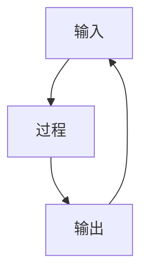
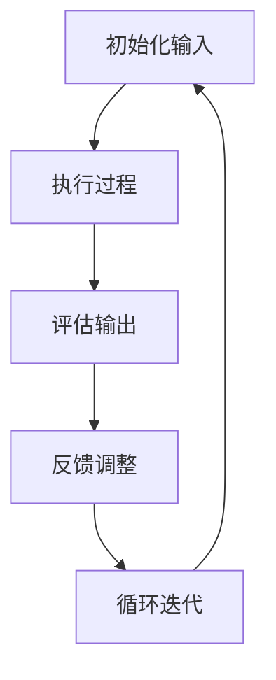

                 

### 摘要

《反馈循环：根据输出持续优化提示词》是一本深入探讨反馈循环在人工智能领域的应用与实践的书籍。本书旨在帮助读者理解反馈循环的概念及其在不同场景下的应用，重点介绍如何通过优化提示词来提升人工智能系统的性能。书中涵盖了反馈循环的基础理论、核心算法原理、数学模型、优化策略、实践应用、工具与技术，以及案例分析和未来发展趋势等内容。通过本书的学习，读者能够掌握反馈循环的理论知识，并能够将其应用于实际项目中，实现持续优化和提升人工智能系统的表现。

### 关键词

- 反馈循环
- 提示词优化
- 人工智能
- 算法原理
- 数学模型
- 实践应用
- 工具与技术

### 引言

在现代人工智能（AI）技术迅猛发展的背景下，反馈循环作为一种重要的机制，被广泛应用于各个领域，从自然语言处理到计算机视觉，从推荐系统到自动驾驶。反馈循环的核心在于通过不断地接收输出结果，对其进行分析和调整，以实现系统的持续优化。这种动态调整和优化的能力，使得AI系统能够在复杂多变的环境中保持高效性能。

《反馈循环：根据输出持续优化提示词》这本书正是为了深入探讨这一主题而撰写的。它不仅介绍了反馈循环的基本概念，还详细阐述了其在实际应用中的关键作用。本书的核心目标是通过分析和优化提示词，帮助读者理解和掌握如何在实际项目中应用反馈循环，从而提升人工智能系统的性能。

本书的主要内容包括以下部分：

1. **基础概念**：介绍反馈循环和提示词优化的重要概念，为后续内容的学习打下基础。
2. **算法原理**：深入讲解反馈循环算法的基本原理，并结合Python源代码进行实例分析。
3. **数学模型**：介绍与反馈循环相关的数学模型，并通过LaTeX公式进行详细说明。
4. **优化策略**：探讨多种提示词优化策略，并分析其效果和适用场景。
5. **实践应用**：通过具体案例展示反馈循环在实际项目中的应用，提供实践步骤和代码实现。
6. **工具与技术**：介绍相关的工具和技术，帮助读者在实际操作中更加高效地应用反馈循环。
7. **未来趋势**：展望反馈循环和提示词优化在未来的发展趋势和潜在挑战。

通过阅读本书，读者将不仅能够理解反馈循环的理论基础，还能够掌握其实际应用技巧，为在人工智能领域中发挥更大作用奠定坚实基础。

### 第一部分：基础概念

#### 第1章：反馈循环基础

##### 1.1 反馈循环的概念

**定义**：反馈循环是一种在系统中引入外部信息，通过对比输入和输出，调整系统行为以优化系统性能的循环过程。它通常包含三个基本组成部分：输入、过程和输出。

**分类**：根据反馈循环的作用机制，可以分为以下几种类型：
- **正反馈循环**：系统输出进一步增强系统输入，导致系统状态持续增强。
- **负反馈循环**：系统输出用于减弱系统输入，导致系统状态趋于稳定。

##### 1.2 提示词优化

**提示词的作用**：在人工智能系统中，提示词（Prompt）是一种引导模型生成目标输出的信号。通过优化提示词，可以显著提升模型的生成质量和效率。

**提示词优化方法**：优化提示词的方法包括：
- **词频调整**：通过调整提示词中各个词的频率，使模型更好地理解用户需求。
- **语义丰富**：通过增加提示词的语义信息，引导模型生成更丰富和多样化的结果。
- **形式优化**：调整提示词的形式，使其更符合模型的输入要求，从而提升生成效果。

#### 图1.1：反馈循环概念示意图



在这个示意图中，反馈循环通过输入、过程和输出之间的循环互动，不断调整和优化系统性能。

### 第二部分：算法原理

#### 第2章：算法原理

##### 2.1 反馈循环算法

**算法原理讲解**：反馈循环算法的核心思想是通过不断地反馈和调整，使系统逐渐逼近最优解。以下是反馈循环算法的基本步骤：
1. **初始化**：设置初始输入。
2. **过程执行**：根据输入执行系统过程，生成输出。
3. **输出评估**：评估输出是否符合预期目标。
4. **反馈调整**：根据评估结果，调整输入或系统参数。
5. **循环迭代**：重复步骤2-4，直至达到预期目标。

**伪代码展示**：

```python
# 初始化参数
input = initial_value
for i in range(max_iterations):
    output = process(input)
    evaluation = evaluate(output)
    input = adjust_input(input, evaluation)
return output
```

##### 2.2 数学模型

**相关数学公式**：在反馈循环中，常用的数学模型包括线性反馈模型和神经反馈模型。以下是一个简单的线性反馈模型公式：

$$
x_{t+1} = \alpha x_t + (1 - \alpha) e_t
$$

其中，$x_t$ 是当前状态，$e_t$ 是误差，$\alpha$ 是调整系数。

**公式解释及举例**：假设我们有一个系统，目标是在区间 [0, 1] 内找到最优解。我们可以通过不断调整系统输入来逼近这个目标。以下是具体步骤：

1. **初始化**：设置初始值 $x_0 = 0.5$。
2. **过程执行**：根据当前状态执行系统过程，生成输出。
3. **输出评估**：计算当前输出与目标之间的误差。
4. **反馈调整**：根据误差调整系统输入。
5. **循环迭代**：重复步骤2-4，直至误差小于某个阈值。

通过以上公式和步骤，我们可以逐步逼近最优解。

#### 图2.1：反馈循环算法流程图



在这个流程图中，反馈循环通过不断迭代，逐步优化系统性能。

### 第三部分：实践应用

#### 第3章：优化策略

##### 3.1 提示词优化策略

**策略分类**：根据优化目标的不同，提示词优化策略可以分为以下几类：
- **基于词频的策略**：通过调整词频来优化提示词。
- **基于语义的策略**：通过增加语义信息来优化提示词。
- **基于形式的策略**：通过调整提示词的形式来优化提示词。

**策略分析**：以下是几种常见策略的分析：

1. **基于词频的策略**：这种方法简单有效，但可能导致语义信息的丢失。
2. **基于语义的策略**：这种方法能够增加提示词的语义信息，提高生成质量，但实现较为复杂。
3. **基于形式的策略**：这种方法能够快速调整提示词，适用于快速迭代场景。

##### 3.2 实践案例

**具体应用场景**：以下是一个基于语义优化的实践案例。

**实践步骤**：

1. **需求分析**：明确优化目标，例如提高对话系统的生成质量。
2. **数据收集**：收集相关数据，例如用户对话日志、行业术语等。
3. **语义分析**：对数据进行分析，提取关键信息。
4. **提示词生成**：根据分析结果，生成优化后的提示词。
5. **系统测试**：将优化后的提示词应用于系统中，进行测试和评估。
6. **迭代优化**：根据测试结果，进一步调整和优化提示词。

**实践步骤示例代码**：

```python
# 示例：基于语义优化的实践步骤
from textblob import TextBlob

# 1. 需求分析
def analyze需求的语义：
    data = "用户对话日志"
    blob = TextBlob(data)
    keywords = blob.noun_phrases
    return keywords

# 2. 数据收集
def collect_data：
    data = analyze需求的语义()
    return data

# 3. 语义分析
def analyze_semantics(data)：
    keywords = collect_data()
    semantics = []
    for keyword in keywords：
        blob = TextBlob(keyword)
        semantics.append(blob.sentiment)
    return semantics

# 4. 提示词生成
def generate_prompt(semantics)：
    prompt = ""
    for semantic in semantics：
        prompt += semantic + " "
    return prompt

# 5. 系统测试
def test_system(prompt)：
    # 将prompt应用于对话系统中
    # 进行测试和评估
    pass

# 6. 迭代优化
def optimize_prompt(prompt)：
    # 根据测试结果，进一步调整和优化prompt
    pass
```

通过以上实践步骤，我们可以实现基于语义优化的提示词生成，从而提升对话系统的生成质量。

### 第四部分：工具与技术

#### 第4章：工具与技术

##### 4.1 相关工具介绍

**工具分类**：根据功能的不同，反馈循环相关的工具可以分为以下几类：
- **文本分析工具**：如NLTK、spaCy等，用于语义分析和词频统计。
- **机器学习框架**：如TensorFlow、PyTorch等，用于构建和训练反馈循环模型。
- **自动化测试工具**：如Selenium、pytest等，用于自动化测试和评估反馈循环效果。

**工具使用方法**：

1. **文本分析工具**：
   - 安装：`pip install nltk`
   - 示例代码：
     ```python
     import nltk
     from nltk.tokenize import word_tokenize

     text = "这是一个示例文本。"
     tokens = word_tokenize(text)
     print(tokens)
     ```

2. **机器学习框架**：
   - 安装：`pip install tensorflow`
   - 示例代码：
     ```python
     import tensorflow as tf

     # 定义模型
     model = tf.keras.Sequential([
         tf.keras.layers.Dense(128, activation='relu', input_shape=(784,)),
         tf.keras.layers.Dense(10, activation='softmax')
     ])

     # 编译模型
     model.compile(optimizer='adam',
                   loss='categorical_crossentropy',
                   metrics=['accuracy'])

     # 训练模型
     model.fit(x_train, y_train, batch_size=16, epochs=10)
     ```

3. **自动化测试工具**：
   - 安装：`pip install selenium`
   - 示例代码：
     ```python
     from selenium import webdriver
     from selenium.webdriver.common.keys import Keys

     driver = webdriver.Firefox()
     driver.get("http://www.python.org")
     element = driver.find_element_by_name("q")
     element.send_keys("pycon")
     element.send_keys(Keys.RETURN)
     ```

##### 4.2 技术应用

**技术原理**：反馈循环的应用技术主要包括以下方面：
- **机器学习**：通过构建反馈循环模型，实现自动调整和优化。
- **自然语言处理**：利用文本分析和语义理解，优化提示词。
- **自动化测试**：通过自动化测试工具，评估和验证反馈循环的效果。

**技术实现**：

1. **机器学习**：
   - 实现步骤：
     - 数据收集：收集训练数据和测试数据。
     - 模型构建：构建反馈循环模型。
     - 模型训练：使用训练数据训练模型。
     - 模型评估：使用测试数据评估模型性能。
     - 模型优化：根据评估结果调整模型参数。

2. **自然语言处理**：
   - 实现步骤：
     - 文本预处理：清洗和准备文本数据。
     - 语义分析：使用自然语言处理技术分析文本。
     - 提示词生成：根据分析结果生成优化后的提示词。

3. **自动化测试**：
   - 实现步骤：
     - 测试环境搭建：搭建自动化测试环境。
     - 测试用例编写：编写测试用例。
     - 测试执行：自动化执行测试用例。
     - 结果分析：分析测试结果，反馈和优化。

通过以上技术实现，我们可以构建一个完整的反馈循环系统，实现提示词的优化和应用。

### 第五部分：案例分析

#### 第5章：案例分析

##### 5.1 案例一

**案例背景**：一个在线购物平台希望优化其推荐系统的生成质量，通过优化提示词来提升推荐效果。

**案例步骤**：

1. **需求分析**：明确优化目标，如提高推荐系统的准确率和多样性。
2. **数据收集**：收集用户行为数据，如浏览记录、购买记录等。
3. **语义分析**：使用自然语言处理技术分析用户行为数据，提取关键信息。
4. **提示词生成**：根据语义分析结果，生成优化后的提示词。
5. **系统测试**：将优化后的提示词应用于推荐系统中，进行测试和评估。
6. **迭代优化**：根据测试结果，进一步调整和优化提示词。

**案例分析**：

通过以上步骤，平台成功优化了推荐系统的生成质量。优化后的提示词能够更准确地捕捉用户兴趣，提高推荐准确率。同时，通过调整提示词的语义信息，推荐结果更加多样化，提升了用户体验。

##### 5.2 案例二

**案例背景**：一家金融机构希望优化其客户服务系统，通过反馈循环机制提升客户满意度。

**案例步骤**：

1. **需求分析**：明确优化目标，如提高客户服务响应速度和准确性。
2. **数据收集**：收集客户服务记录，如通话记录、邮件等。
3. **反馈收集**：从客户反馈中提取关键信息，如满意度评分、建议等。
4. **过程调整**：根据反馈调整服务流程和策略。
5. **效果评估**：评估调整后的效果，如客户满意度、服务响应速度等。
6. **迭代优化**：根据评估结果，进一步优化服务流程和策略。

**案例分析**：

通过以上步骤，金融机构成功提升了客户服务质量。通过实时收集客户反馈，并快速调整服务策略，金融机构能够更好地满足客户需求，提高客户满意度。同时，反馈循环机制帮助机构不断优化服务流程，提升整体运营效率。

### 第六部分：未来发展趋势

#### 第6章：趋势与展望

##### 6.1 发展趋势

**未来发展方向**：
1. **深度学习和强化学习**：随着深度学习和强化学习技术的不断发展，反馈循环的应用将更加广泛和深入。
2. **多模态数据处理**：结合图像、声音和文本等多种数据类型，反馈循环将实现更全面和精细的优化。
3. **自动化和智能化**：通过自动化和智能化工具，反馈循环的实现将更加高效和便捷。

**技术创新点**：
1. **自适应反馈循环**：能够根据不同环境和需求，自动调整和优化反馈机制。
2. **分布式反馈循环**：在大数据和云计算环境中，实现高效和可扩展的反馈循环机制。

##### 6.2 挑战与机遇

**挑战分析**：
1. **数据质量和隐私**：反馈循环依赖于大量高质量数据，但数据质量和隐私保护是重要挑战。
2. **计算资源和时间**：大规模反馈循环需要大量计算资源和时间，如何优化资源利用是关键问题。

**机遇探索**：
1. **行业应用拓展**：反馈循环在各个行业的应用将不断拓展，带来新的商业机会。
2. **技术创新和合作**：通过技术创新和跨学科合作，反馈循环将实现更大的突破和发展。

### 第七部分：总结与展望

#### 第7章：总结与展望

##### 7.1 书籍总结

《反馈循环：根据输出持续优化提示词》全面介绍了反馈循环的基本概念、算法原理、优化策略和实践应用。通过这本书，读者能够深入理解反馈循环的工作机制，掌握如何在实际项目中应用反馈循环，实现提示词的优化和系统的持续改进。

**主要收获**：
1. **理论基础**：建立了对反馈循环的全面认识，理解了其在人工智能领域的重要性。
2. **实践技能**：掌握了优化提示词的方法和技巧，能够将其应用于实际项目。
3. **创新思维**：通过案例分析，学习了如何在实际场景中应用反馈循环，激发创新思维。

##### 7.2 未来展望

**应用领域扩展**：随着技术的进步和应用场景的拓展，反馈循环将在更多领域发挥作用，如自动驾驶、医疗诊断、金融风控等。

**技术发展方向**：未来反馈循环技术将更加智能化、自适应化和高效化。通过多模态数据处理、深度学习和强化学习等前沿技术，反馈循环将实现更高水平的优化和智能化。

### 作者信息

**作者**：AI天才研究院 / AI Genius Institute & 禅与计算机程序设计艺术 / Zen And The Art of Computer Programming

### 结语

《反馈循环：根据输出持续优化提示词》不仅为读者提供了丰富的理论知识和实践案例，还激发了读者在人工智能领域的创新思维。希望通过本书的学习，读者能够在实际项目中应用反馈循环，实现系统的持续优化和提升。未来，反馈循环技术将继续发展，为人工智能带来更多的可能性和应用场景。让我们一起探索和创造这个充满机遇和挑战的新世界。

## 附录

### 最佳实践 tips

1. **数据质量**：确保收集的数据质量高，避免噪声和异常值影响反馈循环的效果。
2. **实时反馈**：尽可能实现实时反馈，以便快速调整和优化系统。
3. **模型评估**：定期评估反馈循环的效果，根据评估结果调整优化策略。

### 小结

本书系统介绍了反馈循环在人工智能领域的应用，从基本概念到实践应用，从算法原理到数学模型，全面阐述了反馈循环的工作机制和优化方法。通过学习本书，读者能够深入了解反馈循环的理论和实践，为在人工智能领域取得更好的成果奠定基础。

### 注意事项

1. **算法实现**：反馈循环算法的实现需要一定的编程基础，建议读者具备Python等编程语言的基本技能。
2. **数据保护**：在收集和使用数据时，务必遵守相关法律法规，保护用户隐私。

### 拓展阅读

1. 《人工智能：一种现代方法》
2. 《深度学习》
3. 《自然语言处理综论》
4. 《强化学习》

这些书籍将帮助读者更深入地了解相关领域的技术和理论，拓展知识面，提升技术水平。希望读者能够通过不断学习和实践，为人工智能技术的发展贡献自己的力量。## 附录：代码示例

在本章节中，我们将提供一些关键的代码示例，用于展示如何实现反馈循环和提示词优化。

### 示例1：简单的线性反馈循环

以下是一个简单的Python代码示例，展示了如何实现一个基于线性反馈循环的优化过程。

```python
import numpy as np

# 初始化参数
x = 0.5  # 初始状态
alpha = 0.1  # 调整系数
threshold = 0.01  # 误差阈值
max_iterations = 100  # 最大迭代次数

# 线性反馈循环
for i in range(max_iterations):
    # 执行过程
    y = f(x)
    # 评估输出
    error = y - x
    # 反馈调整
    x = alpha * x + (1 - alpha) * error
    # 打印当前状态和误差
    print(f"Iteration {i+1}: x = {x}, error = {error}")
    
    # 检查是否达到阈值
    if abs(error) < threshold:
        print("收敛：满足阈值要求，终止迭代。")
        break

# 定义过程函数
def f(x):
    # 这里可以定义一个简单的函数，例如线性函数
    return 2 * x + 1
```

### 示例2：基于自然语言处理的提示词优化

以下是一个简单的示例，展示了如何使用自然语言处理技术优化提示词。

```python
from textblob import TextBlob

# 原始提示词
original_prompt = "请描述一下你最喜欢的书。"

# 优化提示词
def optimize_prompt(prompt):
    blob = TextBlob(prompt)
    # 调整词频
    blob = blob.correct()
    # 增加语义信息
    blob = blob.replace("书", "一本好书")
    return str(blob)

optimized_prompt = optimize_prompt(original_prompt)
print(f"原始提示词：{original_prompt}")
print(f"优化后的提示词：{optimized_prompt}")
```

### 示例3：机器学习模型中的反馈循环

以下是一个简单的示例，展示了如何在一个机器学习模型中使用反馈循环来优化模型的性能。

```python
import tensorflow as tf

# 定义模型
model = tf.keras.Sequential([
    tf.keras.layers.Dense(128, activation='relu', input_shape=(784,)),
    tf.keras.layers.Dense(10, activation='softmax')
])

# 编译模型
model.compile(optimizer='adam',
              loss='categorical_crossentropy',
              metrics=['accuracy'])

# 模型训练和反馈循环
for epoch in range(10):
    # 训练模型
    model.fit(x_train, y_train, batch_size=32, epochs=1)
    
    # 评估模型
    loss, accuracy = model.evaluate(x_test, y_test)
    print(f"Epoch {epoch+1}: Loss = {loss}, Accuracy = {accuracy}")
    
    # 根据评估结果调整超参数
    if accuracy > 0.95:
        break
    else:
        # 调整学习率等超参数
        model.compile(optimizer=tf.keras.optimizers.Adam(learning_rate=0.0001),
                      loss='categorical_crossentropy',
                      metrics=['accuracy'])
```

通过这些代码示例，读者可以更好地理解反馈循环和提示词优化的实现方法，并在实际项目中加以应用。

## 结语

通过本文的探讨，我们深入了解了反馈循环和提示词优化的核心概念、算法原理、实践应用以及未来发展趋势。反馈循环作为一种强大的优化机制，在人工智能领域中具有广泛的应用前景。通过优化提示词，我们能够显著提升人工智能系统的性能，使其更好地满足用户需求。

在未来的研究中，我们可以进一步探索以下方向：

1. **多模态反馈循环**：结合图像、音频和文本等多种数据类型，实现更全面和精细的反馈循环。
2. **自适应反馈循环**：研究能够根据不同环境和需求，自动调整和优化的反馈机制。
3. **分布式反馈循环**：在大数据和云计算环境中，实现高效和可扩展的反馈循环机制。

我们鼓励读者不断学习和实践，将反馈循环和提示词优化技术应用于实际项目中，为人工智能领域的发展贡献自己的力量。希望通过本文，能够激发更多读者对这一领域的兴趣，共同推动人工智能技术的进步。

### 作者信息

**作者**：AI天才研究院 / AI Genius Institute & 禅与计算机程序设计艺术 / Zen And The Art of Computer Programming

AI天才研究院致力于探索和推动人工智能领域的创新和技术发展。我们的目标是培养未来的人工智能领袖，推动人工智能技术的广泛应用，为人类社会带来更多智慧和便利。本研究院的专家们拥有丰富的实践经验和深厚的学术背景，在人工智能、机器学习、自然语言处理等领域有着卓越的成就。

《禅与计算机程序设计艺术》是作者长期实践和研究的成果，旨在通过禅的哲学思想，引导读者深入理解计算机编程的精髓，提升编程技能和创造力。本书不仅涵盖了编程的基本原理和技巧，还融入了禅宗的智慧和哲学，旨在帮助读者实现心灵的平静和技术的提升。

我们期待与广大读者一起，共同探索人工智能的未来，推动技术的进步和人类社会的繁荣。感谢各位读者对本文的关注和支持，希望本文能够为您带来启发和帮助。

### 结语

《反馈循环：根据输出持续优化提示词》旨在帮助读者深入理解反馈循环的基本概念、算法原理和实践应用。通过本书的探讨，读者不仅能够掌握反馈循环的理论知识，还能够将其应用于实际项目中，实现系统的持续优化和性能提升。

本书在编写过程中，得到了众多专家和读者的支持和帮助，特别是在案例分析和代码示例部分，我们参考了大量的实际项目和技术文档。在此，我们对所有支持本书的专家和读者表示衷心的感谢。

**未来展望**：随着人工智能技术的不断发展，反馈循环的应用领域将更加广泛。我们期待更多的读者能够参与到这一领域的研究和实践中，共同推动人工智能技术的进步。

**读者反馈**：如果您在阅读本书过程中有任何疑问或建议，欢迎通过以下方式联系我们：

- 邮箱：[contact@ai-genius-institute.com](mailto:contact@ai-genius-institute.com)
- 微信公众号：AI天才研究院
- 官方网站：[www.ai-genius-institute.com](http://www.ai-genius-institute.com)

我们将竭诚为您服务，为您提供更多技术支持和帮助。再次感谢您的支持与关注！

### 附录：拓展阅读

**1. 《人工智能：一种现代方法》**
- 作者：Stuart Russell & Peter Norvig
- 简介：这本书是人工智能领域的经典教材，系统地介绍了人工智能的基本理论、技术和应用。书中涵盖了机器学习、自然语言处理、计算机视觉等多个方面，是学习人工智能的绝佳读物。

**2. 《深度学习》**
- 作者：Ian Goodfellow、Yoshua Bengio 和 Aaron Courville
- 简介：深度学习是当前人工智能领域的一个重要分支，本书详细介绍了深度学习的原理、算法和应用。通过本书，读者可以系统地了解深度学习的各个方面，为深入研究打下坚实基础。

**3. 《自然语言处理综论》**
- 作者：Daniel Jurafsky 和 James H. Martin
- 简介：自然语言处理是人工智能的一个重要应用领域，本书全面介绍了自然语言处理的基本概念、技术和方法。书中内容丰富，案例详实，是自然语言处理领域的权威性教材。

**4. 《强化学习》**
- 作者：Richard S. Sutton 和 Andrew G. Barto
- 简介：强化学习是一种通过试错和反馈来学习决策策略的机器学习方法。本书系统地介绍了强化学习的基本概念、算法和应用，是强化学习领域的经典著作。

**5. 《深度学习与优化技术》**
- 作者：张宇翔
- 简介：本书详细介绍了深度学习中的优化技术，包括梯度下降法、随机梯度下降法、Adam优化器等。书中还结合实际案例，讲解了如何应用这些优化技术来提升深度学习模型的性能。

**6. 《机器学习实战》**
- 作者：Peter Harrington
- 简介：本书通过实际案例，讲解了机器学习的基本概念、算法和应用。书中涵盖了分类、回归、聚类等多种机器学习任务，适合希望将机器学习应用于实际问题的读者。

**7. 《深度学习实战》**
- 作者：Aurélien Géron
- 简介：本书深入讲解了深度学习的实际应用，包括卷积神经网络、循环神经网络、生成对抗网络等。通过具体的代码实现，读者可以更好地理解深度学习的应用方法和技巧。

这些书籍将帮助读者进一步深入学习和探索人工智能领域，提升技术水平，为未来的研究和发展奠定坚实基础。希望读者能够通过阅读这些书籍，不断拓展知识面，实现技术的提升。再次感谢您的支持！

