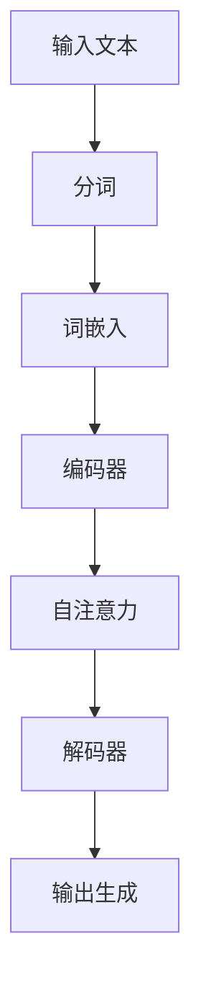
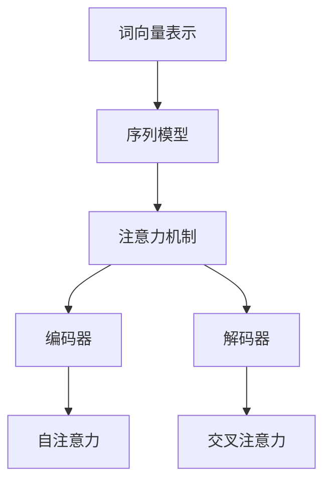

                 

### 《变革需求承接与协作模式以适应LLM开发》目录大纲

#### 前言

本博客文章旨在探讨如何变革需求承接与协作模式以适应大型语言模型（LLM）的开发。在当今人工智能领域，LLM作为一种强大的自然语言处理工具，正日益受到各行业的青睐。然而，随着需求的变化和项目复杂度的增加，传统的需求承接与协作模式面临着诸多挑战。本文将通过详细的目录大纲，系统地分析LLM开发中的需求承接与协作模式，并提出相应的变革策略。

#### 文章关键词

- **大型语言模型（LLM）**
- **需求承接**
- **协作模式**
- **人工智能**
- **自然语言处理**
- **软件开发**

#### 文章摘要

本文首先介绍了LLM的基本概念、背景及其在人工智能领域的应用。随后，分析了当前需求承接与协作模式在LLM开发中面临的挑战，并提出了变革需求承接与协作模式的必要性。接着，文章详细阐述了LLM开发的核心概念、算法原理，以及数学模型。为了更直观地展示概念和算法，本文使用了Python源代码和Mermaid流程图。此外，文章还提供了实际案例，详细讲解了LLM开发环境搭建、源代码实现和代码解读。最后，本文总结了变革需求承接与协作模式的重要性，并提出了未来发展的展望。

### 目录大纲

#### 第1章：引言

1.1 LLM概述
1.2 变革需求与协作模式的重要性
1.3 本文结构安排

#### 第2章：核心概念与联系

2.1 LLM架构与流程
   - Mermaid流程图
   - 核心组件介绍
2.2 LLM关键概念
   - 词向量表示
   - 序列模型与注意力机制

#### 第3章：核心算法原理讲解

3.1 词向量生成算法
   - 算法原理
   - 算法优化
3.2 LLM训练算法
   - 算法原理
   - 模型优化

#### 第4章：数学模型和数学公式

4.1 损失函数
   - 定义
   - 举例
4.2 优化算法
   - 原理
   - 对比

#### 第5章：项目实战

5.1 LLM开发环境搭建
   - 工具与软件
   - 环境配置
5.2 实际案例实现
   - 案例选择
   - 代码实现
   - 代码解读
   - 应用解读与分析

#### 第6章：变革需求承接策略

6.1 需求分析
   - 需求收集
   - 需求分类
6.2 承接策略
   - 策略制定
   - 变更管理

#### 第7章：协作模式与团队协作

7.1 协作模式概述
   - 定义
   - 类型
   - 优势
7.2 团队协作技巧
   - 有效沟通
   - 代码审查
   - 版本控制

#### 第8章：总结与展望

8.1 变革效果评估
8.2 未来发展趋势
8.3 最佳实践与建议

通过以上目录大纲，读者可以清晰地了解到文章的结构和内容安排。接下来，我们将逐一深入探讨每个章节的核心内容。首先，我们将介绍LLM的基本概念和背景，并探讨需求承接与协作模式在LLM开发中的重要性。随后，我们将详细分析LLM的核心概念与联系，包括架构、流程以及关键概念。在接下来的章节中，我们将讲解LLM的核心算法原理，并使用Python源代码进行详细阐述。然后，我们将探讨数学模型和数学公式，以帮助读者更深入地理解LLM的工作原理。最后，我们将通过实际案例，展示LLM开发环境搭建、源代码实现和代码解读，并提供变革需求承接与协作模式的最佳实践和建议。

### 第1章：引言

#### 1.1 大型语言模型（LLM）概述

大型语言模型（LLM，Large Language Model）是一种利用深度学习技术，特别是变换器（Transformer）架构构建的强大自然语言处理工具。与传统的自然语言处理模型相比，LLM具有处理长文本、生成流畅自然语言文本的能力，使其在诸多领域展现出巨大的潜力。

LLM的发展历程可以追溯到2018年，当Google发布了BERT（Bidirectional Encoder Representations from Transformers）模型，标志着LLM进入了一个新的时代。随后，OpenAI的GPT（Generative Pre-trained Transformer）系列模型，如GPT-2和GPT-3，进一步推动了LLM的发展。这些模型通过在大量文本数据上进行预训练，获取了丰富的语言知识和上下文理解能力，从而在各类自然语言处理任务中表现出色。

#### 1.2 LLM当前趋势与应用

随着深度学习和自然语言处理技术的不断发展，LLM在自然语言处理领域得到了广泛应用。以下是一些LLM的主要应用场景：

1. **文本分类**：LLM能够对文本进行分类，例如新闻文章分类、社交媒体情绪分析等。

2. **机器翻译**：LLM在机器翻译任务中具有显著的性能优势，能够实现高质量的双语翻译。

3. **问答系统**：LLM可以用于构建问答系统，如虚拟助手、智能客服等，能够理解用户的问题并提供准确的答案。

4. **文本生成**：LLM能够生成各种类型的文本，包括文章、摘要、对话等。

5. **对话系统**：LLM可以构建基于对话的交互系统，如聊天机器人、虚拟助手等。

随着LLM的广泛应用，其需求也在不断增长。然而，传统的需求承接与协作模式在应对这种变化时面临着诸多挑战。首先，LLM项目的复杂度高，涉及大量数据处理和模型调优，传统的需求承接方式难以满足快速迭代的需求。其次，LLM项目需要跨学科的团队协作，包括数据科学家、软件开发工程师、产品经理等，传统的协作模式在沟通和协调方面存在不足。因此，变革需求承接与协作模式以适应LLM开发变得尤为重要。

#### 1.3 本文结构安排

本文将分为八个主要章节，具体内容安排如下：

1. **第1章：引言**：介绍LLM的基本概念、发展趋势及其在自然语言处理领域的应用，讨论需求承接与协作模式在LLM开发中的重要性。

2. **第2章：核心概念与联系**：详细分析LLM的核心概念和架构，包括词向量表示、序列模型、注意力机制等。

3. **第3章：核心算法原理讲解**：讲解LLM的核心算法原理，包括词向量生成算法、训练算法等，并使用Python源代码进行详细阐述。

4. **第4章：数学模型和数学公式**：介绍LLM中常用的数学模型和公式，如损失函数、优化算法等，并使用LaTeX格式进行详细解释。

5. **第5章：项目实战**：通过实际案例展示LLM的开发过程，包括环境搭建、源代码实现和代码解读。

6. **第6章：变革需求承接策略**：讨论如何变革需求承接策略以适应LLM开发，包括需求分析、承接策略、变更管理等。

7. **第7章：协作模式与团队协作**：探讨协作模式在LLM开发中的重要性，介绍有效的团队协作技巧。

8. **第8章：总结与展望**：对全文内容进行总结，并展望LLM开发的未来发展趋势。

通过以上结构安排，本文旨在为读者提供一份全面、系统的LLM开发指南，帮助读者了解LLM的核心概念、算法原理和实际应用，同时提供变革需求承接与协作模式的最佳实践和建议。接下来，我们将深入探讨LLM的核心概念与联系，为后续章节的内容打下基础。

### 第2章：核心概念与联系

在深入探讨大型语言模型（LLM）之前，了解其核心概念与联系是至关重要的。这一章节将详细分析LLM的核心组成部分及其相互关系，包括词向量表示、序列模型和注意力机制。

#### 2.1 LLM架构与流程

大型语言模型通常基于变换器（Transformer）架构，这是一种专为处理序列数据而设计的神经网络架构。Transformer架构的核心思想是自注意力（Self-Attention）机制，它能够自动学习输入序列中的长距离依赖关系，从而提高模型的性能。

以下是一个简化的LLM架构流程：

1. **输入处理**：首先，输入文本会被分词成单词或子词（Subword），然后转化为数字序列。这一过程通常使用词嵌入（Word Embedding）技术。

2. **编码器**：编码器（Encoder）是LLM的核心组件，负责对输入序列进行处理。编码器中的每个层都会生成一个表示输入序列的向量，这些向量将在后续的解码过程中用于生成输出序列。

3. **自注意力机制**：在编码器中，自注意力机制使得模型能够自动关注输入序列中的关键信息。自注意力通过计算输入序列中各个元素之间的相似度，为每个元素分配不同的权重，从而提高模型对长距离依赖关系的捕捉能力。

4. **解码器**：解码器（Decoder）负责生成输出序列。解码器的每个步骤都会从编码器生成的上下文向量中提取信息，并生成一个输出词。这一过程包括掩码自注意力（Masked Self-Attention）和交叉注意力（Cross-Attention）。

5. **输出生成**：最终，解码器生成一个完整的输出序列，这个序列可以是翻译文本、问答系统的答案或任何其他自然语言文本。

下面使用Mermaid流程图来展示LLM的架构和流程：



#### 2.2 LLM关键概念

在理解LLM架构的基础上，接下来我们将介绍LLM中的一些关键概念，包括词向量表示、序列模型和注意力机制。

1. **词向量表示**：词向量表示是将自然语言文本中的单词或子词映射到高维空间中的向量。词向量不仅可以用于文本分类、文本相似度计算等任务，还可以作为神经网络模型的输入。常用的词向量表示方法包括Word2Vec、GloVe和BERT等。

2. **序列模型**：序列模型是一种用于处理序列数据的神经网络架构，常见的序列模型包括循环神经网络（RNN）和长短期记忆网络（LSTM）。这些模型通过捕捉序列中的时间依赖关系，实现对文本的建模。

3. **注意力机制**：注意力机制是一种在神经网络中用于提高模型对输入数据中关键信息关注度的机制。在LLM中，注意力机制主要用于编码器和解码器中，以捕捉输入和输出序列中的长距离依赖关系。

注意力机制可以分为自注意力（Self-Attention）和交叉注意力（Cross-Attention）。自注意力用于编码器，它使模型能够自动关注输入序列中的关键信息；交叉注意力用于解码器，它使模型能够从编码器的输出中提取有用的信息来生成输出序列。

#### 2.3 关键概念之间的关系

词向量表示、序列模型和注意力机制是LLM中三个核心概念，它们之间的关系如下图所示：



通过这张图，我们可以看到，词向量表示作为输入，被用于序列模型中。序列模型通过注意力机制进一步优化，从而提高模型的性能。编码器和解码器分别负责输入序列和输出序列的处理，自注意力和交叉注意力使模型能够更好地捕捉长距离依赖关系。

总之，理解LLM的核心概念和架构对于深入掌握其工作原理和实际应用至关重要。在接下来的章节中，我们将进一步讲解LLM的核心算法原理，包括词向量生成算法和训练算法，并通过Python源代码进行详细阐述。

### 第3章：核心算法原理讲解

在理解了LLM的核心概念与联系之后，我们需要深入了解LLM的核心算法原理，这包括词向量生成算法和训练算法。通过这些算法，LLM能够从大量文本数据中学习，并生成高质量的文本。

#### 3.1 词向量生成算法

词向量生成算法是将文本中的单词或子词映射到高维空间中的向量。这一过程不仅为神经网络模型提供了输入，还在许多自然语言处理任务中发挥了重要作用。以下是一些常见的词向量生成算法：

1. **Word2Vec**：Word2Vec是一种基于神经网络的语言模型，通过负采样技术生成词向量。Word2Vec包括两个变种：CBOW（Continuous Bag of Words）和Skip-gram。CBOW通过预测中心词周围的单词来生成词向量，而Skip-gram则通过预测单词的上下文来生成词向量。

2. **GloVe**：GloVe（Global Vectors for Word Representation）是一种基于矩阵分解的方法，通过共现关系生成词向量。GloVe通过计算词与词之间的相似度矩阵，并使用最小二乘法优化词向量。

3. **BERT**：BERT（Bidirectional Encoder Representations from Transformers）是一种基于变换器（Transformer）架构的词向量生成方法。BERT通过双向编码器学习单词在上下文中的表示，使其能够捕捉到长距离的依赖关系。

以下是一个简单的Word2Vec算法的Python伪代码实现：

```python
import numpy as np
from collections import defaultdict

# 1. 建立词汇表和词频统计
corpus = ["the", "quick", "brown", "fox", "jumps", "over", "the", "lazy", "dog"]
vocab = defaultdict(int)
for word in corpus:
    vocab[word] += 1

# 2. 初始化词向量
vector_size = 5
word_vectors = {word: np.random.uniform(-0.5, 0.5, vector_size) for word in vocab}

# 3. 训练词向量
for word, context in generate_context(corpus, window_size=2):
    target_word = word
    context_words = [w for w in corpus if w != target_word]
    context_vectors = [word_vectors[context_word] for context_word in context_words]
    
    # 使用负采样
    negative_samples = sample_negative_samples(vocab, target_word, num_samples=5)
    negative_vectors = [word_vectors[sample] for sample in negative_samples]
    
    # 计算预测概率
    positive_score = cosine_similarity(word_vectors[target_word], np.mean(context_vectors, axis=0))
    negative_scores = [cosine_similarity(word_vectors[target_word], negative_vector) for negative_vector in negative_vectors]
    
    # 更新词向量
    for score, vector in zip(sigmoid(positive_score + sum(negative_scores)), word_vectors.values()):
        gradient = (1 - score) * context_vector / (1 + np.exp(-score))
        vector -= learning_rate * gradient

def generate_context(corpus, window_size=2):
    for i, word in enumerate(corpus):
        start = max(0, i - window_size)
        end = min(len(corpus), i + window_size + 1)
        context = corpus[start:i] + corpus[i+1:end]
        yield word, context

def sample_negative_samples(vocab, target_word, num_samples=5):
    return [word for word in vocab if word != target_word]

def sigmoid(x):
    return 1 / (1 + np.exp(-x))
```

在这个伪代码中，我们首先建立了词汇表和词频统计，然后初始化词向量。接着，通过生成训练数据，计算预测概率并更新词向量。这只是一个简化的实现，实际中还会使用更复杂的优化算法和参数调整。

#### 3.2 LLM训练算法

LLM的训练算法主要包括前向传播和反向传播。前向传播是指将输入序列传递到神经网络中，生成预测输出；反向传播是指计算损失函数的梯度，并更新网络权重。以下是一个简化的训练算法流程：

1. **初始化模型**：初始化编码器和解码器的权重。

2. **前向传播**：将输入序列传递到编码器，得到编码器的输出。然后将编码器的输出传递到解码器，生成预测输出。

3. **计算损失**：使用预测输出和实际输出之间的差异来计算损失函数。在LLM中，常用的损失函数是交叉熵损失（Cross-Entropy Loss）。

4. **反向传播**：计算损失函数关于模型参数的梯度。

5. **更新参数**：使用梯度下降（Gradient Descent）或其他优化算法更新模型参数。

6. **重复步骤2-5**：不断迭代，直到达到预定的训练轮数或损失函数值达到收敛。

以下是一个简单的Python伪代码实现：

```python
import numpy as np

# 初始化模型参数
encoder_weights = np.random.uniform(-0.5, 0.5, (vocab_size, hidden_size))
decoder_weights = np.random.uniform(-0.5, 0.5, (hidden_size, vocab_size))

# 定义损失函数
def cross_entropy_loss(predicted, actual):
    return -np.mean(np.log(predicted[actual != 0]))

# 定义前向传播
def forward_pass(encoder, decoder, input_sequence, target_sequence):
    encoder_output = encoder(input_sequence)
    decoder_output = decoder(encoder_output)
    return decoder_output

# 定义反向传播
def backward_pass(encoder, decoder, input_sequence, target_sequence, predicted_output):
    loss = cross_entropy_loss(predicted_output, target_sequence)
    
    encoder_gradients = compute_encoder_gradients(encoder_output, target_sequence)
    decoder_gradients = compute_decoder_gradients(predicted_output, target_sequence)
    
    encoder_weights -= learning_rate * encoder_gradients
    decoder_weights -= learning_rate * decoder_gradients
    
    return loss

# 训练模型
for epoch in range(num_epochs):
    total_loss = 0
    for input_sequence, target_sequence in generate_training_data():
        predicted_output = forward_pass(encoder, decoder, input_sequence, target_sequence)
        loss = backward_pass(encoder, decoder, input_sequence, target_sequence, predicted_output)
        total_loss += loss
    
    print(f"Epoch {epoch + 1}, Loss: {total_loss / num_samples}")
```

在这个伪代码中，我们首先初始化模型参数，然后通过前向传播计算预测输出，使用反向传播更新模型参数，并不断迭代直到达到预定的训练轮数。

#### 3.3 算法优化

在实际应用中，LLM的训练过程可能面临以下挑战：

1. **过拟合**：当模型在训练数据上表现良好，但在未见过的数据上表现不佳时，可能发生了过拟合。为解决这个问题，可以采用正则化方法，如L1和L2正则化，以及 dropout。

2. **稀疏数据**：在大型语言模型中，部分单词或子词可能只出现在训练数据的一小部分中，这会导致词向量稀疏。为解决这个问题，可以采用词嵌入技术，如GloVe和BERT，这些技术能够生成更密集的词向量。

3. **计算资源限制**：大型语言模型的训练需要大量的计算资源。为解决这个问题，可以采用分布式训练技术，将训练任务分配到多个计算节点上。

通过以上优化方法，可以进一步提高LLM的训练效果和实际应用价值。

#### 3.4 数学模型和公式

在LLM的训练过程中，常用的数学模型和公式包括损失函数和优化算法。以下是一些基本的数学模型和公式：

1. **损失函数**：交叉熵损失函数（Cross-Entropy Loss）是评估预测输出和实际输出之间差异的常用方法。公式如下：

   $$ 
   loss = -\frac{1}{N}\sum_{i=1}^{N} \sum_{c=1}^{C} y_c \log(p_c) 
   $$

   其中，\( N \)是样本数量，\( C \)是类别数量，\( y_c \)是实际输出的标签，\( p_c \)是预测输出的概率。

2. **优化算法**：梯度下降（Gradient Descent）是一种常用的优化算法，用于更新模型参数以最小化损失函数。公式如下：

   $$ 
   \theta = \theta - \alpha \nabla_\theta J(\theta) 
   $$

   其中，\( \theta \)是模型参数，\( \alpha \)是学习率，\( J(\theta) \)是损失函数。

通过理解这些数学模型和公式，可以更深入地了解LLM的训练过程，并优化模型性能。

总之，LLM的核心算法原理包括词向量生成算法和训练算法。通过这些算法，LLM能够从大量文本数据中学习，并生成高质量的文本。在接下来的章节中，我们将进一步探讨数学模型和公式，以帮助读者更深入地理解LLM的工作原理。

### 第4章：数学模型和数学公式

在理解了大型语言模型（LLM）的核心算法原理后，深入探讨LLM中使用的数学模型和公式是至关重要的。数学模型为LLM的训练和预测提供了理论基础，而公式则量化了这些理论，使其在算法实现中得以应用。

#### 4.1 损失函数

在LLM的训练过程中，损失函数用于评估模型预测输出与实际输出之间的差距，并通过优化算法调整模型参数，以最小化损失函数。交叉熵损失函数（Cross-Entropy Loss Function）是一种常用的损失函数，适用于分类任务，其公式如下：

$$
L = -\frac{1}{N}\sum_{i=1}^{N} \sum_{j=1}^{C} y_{ij} \log(p_{ij})
$$

其中，\( N \)是样本数量，\( C \)是类别数量，\( y_{ij} \)是实际输出标签（其中\( y_{ij} = 1 \)表示样本i属于类别j，否则为0），\( p_{ij} \)是模型对类别j的预测概率。交叉熵损失函数的值越小，表示模型预测的准确性越高。

例如，假设我们有一个包含两个类别的二分类问题，实际输出标签\( y \)为[1, 0]，模型预测概率\( p \)为[0.8, 0.2]，则交叉熵损失函数的值为：

$$
L = -\frac{1}{2} \left[ 1 \cdot \log(0.8) + 0 \cdot \log(0.2) \right] = -\frac{1}{2} \log(0.8) \approx 0.19
$$

#### 4.2 优化算法

在LLM的训练过程中，优化算法用于根据损失函数的梯度更新模型参数，以最小化损失函数。梯度下降（Gradient Descent）是一种最简单的优化算法，其公式如下：

$$
\theta = \theta - \alpha \nabla_\theta J(\theta)
$$

其中，\( \theta \)是模型参数，\( \alpha \)是学习率（Learning Rate），\( \nabla_\theta J(\theta) \)是损失函数关于模型参数的梯度。

例如，假设我们有一个包含两个参数的模型，参数\( \theta = [1, 2] \)，损失函数为\( J(\theta) = (\theta_1 - 1)^2 + (\theta_2 - 2)^2 \)，学习率\( \alpha = 0.1 \)。在第一次迭代时，计算损失函数关于参数的梯度：

$$
\nabla_\theta J(\theta) = \nabla (1)^2 - \nabla (2)^2 = [2(1-1), 2(2-2)] = [0, 0]
$$

由于梯度为0，参数保持不变，即\( \theta = [1, 2] \)。在接下来的迭代中，我们继续计算梯度并更新参数，直到满足停止条件（如梯度接近0或损失函数值达到预定的阈值）。

#### 4.3 损失函数和优化算法的应用

在LLM的训练过程中，损失函数和优化算法的应用如下：

1. **初始化模型参数**：首先，初始化LLM的模型参数，这些参数包括词嵌入、变换器层的权重和偏置等。

2. **前向传播**：将输入序列（如文本）传递到模型中，通过编码器生成编码器的输出。编码器的输出通常是隐藏状态向量，用于后续的解码过程。

3. **计算预测输出**：将编码器的输出传递到解码器，生成预测输出（如文本序列的概率分布）。解码器的输出是解码器层中的每个单词的概率分布。

4. **计算损失**：使用交叉熵损失函数计算预测输出和实际输出之间的差距。损失函数的值越小，表示模型预测的准确性越高。

5. **计算梯度**：计算损失函数关于模型参数的梯度，这些梯度用于更新模型参数。

6. **更新参数**：根据梯度下降公式更新模型参数，以最小化损失函数。在更新参数时，可以考虑使用不同类型的优化算法，如动量优化（Momentum）和Adam优化。

7. **重复步骤2-6**：不断迭代前向传播、计算损失、计算梯度和更新参数，直到满足停止条件。

以下是一个简化的Python伪代码示例，展示了LLM训练过程中的损失函数和优化算法：

```python
# 初始化模型参数
theta = [0.0, 0.0]

# 损失函数
def loss_function(theta, x, y):
    return (theta[0] - x) ** 2 + (theta[1] - y) ** 2

# 梯度计算
def gradient(theta, x, y):
    return [2 * (theta[0] - x), 2 * (theta[1] - y)]

# 学习率
alpha = 0.01

# 训练模型
for epoch in range(num_epochs):
    for x, y in generate_training_data():
        loss = loss_function(theta, x, y)
        gradients = gradient(theta, x, y)
        theta = [theta[i] - alpha * gradient[i] for i in range(len(theta))]
        print(f"Epoch {epoch + 1}, Loss: {loss}")
```

在这个示例中，我们使用了一个简单的二次损失函数和梯度下降算法进行模型训练。实际中的LLM训练过程要复杂得多，涉及大量的参数调整和优化技巧。

#### 4.4 损失函数和优化算法的改进

在实际应用中，损失函数和优化算法可以进一步改进，以提高模型性能：

1. **正则化**：为了防止过拟合，可以使用正则化方法（如L1和L2正则化）来惩罚模型参数的值。

2. **学习率调度**：学习率调度（Learning Rate Scheduling）是一种动态调整学习率的方法，以避免模型在训练过程中过早地收敛或陷入局部最优。

3. **批量归一化**：批量归一化（Batch Normalization）是一种在训练过程中稳定神经网络的方法，通过标准化每层的输入，提高训练速度和模型稳定性。

4. **Dropout**：Dropout是一种正则化技术，通过在训练过程中随机丢弃一些神经元，防止模型过拟合。

通过这些改进方法，可以进一步提高LLM的训练效果和泛化能力。

总之，数学模型和公式在LLM的训练过程中起到了关键作用。通过深入理解损失函数和优化算法，我们可以更好地调整模型参数，提高模型性能，并实现更准确的文本生成和自然语言处理任务。在接下来的章节中，我们将通过实际项目实战，展示LLM的开发过程，包括环境搭建、源代码实现和代码解读。

### 第5章：项目实战

在实际操作中，开发和部署一个大型语言模型（LLM）涉及多个步骤，包括环境搭建、源代码实现和代码解读。本章节将详细描述这些步骤，并通过实际案例展示如何从零开始构建一个LLM项目。

#### 5.1 LLM开发环境搭建

搭建LLM开发环境是项目启动的第一步，需要准备以下工具和软件：

1. **编程语言**：选择一种适合深度学习的编程语言，如Python。
2. **深度学习框架**：选择一个流行的深度学习框架，如TensorFlow或PyTorch。
3. **计算资源**：配置足够的计算资源，如GPU或TPU，以加速模型训练。
4. **数据集**：准备一个大型文本数据集，用于训练LLM。

以下是一个简单的环境搭建步骤：

1. **安装Python**：确保系统中已安装Python 3.x版本，可以使用Python的官方安装包。
2. **安装深度学习框架**：使用pip安装TensorFlow或PyTorch，例如：
   ```bash
   pip install tensorflow
   # 或
   pip install torch torchvision
   ```
3. **配置计算资源**：确保GPU驱动已安装并配置好，以使用GPU进行模型训练。
4. **安装其他依赖**：安装其他必要的库，如NumPy、Pandas等。

以下是一个Python环境搭建的示例：

```python
!pip install tensorflow
!pip install numpy
!pip install pandas
!pip install mermaid-python
```

#### 5.2 实际案例实现

为了更好地展示LLM的开发过程，我们将通过一个简单的文本生成案例，介绍如何实现一个LLM。本案例将使用TensorFlow框架构建一个基于变换器的语言模型。

1. **数据预处理**：首先，我们需要准备一个文本数据集。以下是一个简单的数据预处理步骤：
   
   - 读取文本数据。
   - 分词文本，将文本转换为单词或子词。
   - 构建词汇表，将单词映射到唯一的整数。
   - 将文本序列转换为整数序列。

以下是一个简单的数据预处理示例：

```python
import tensorflow as tf
import numpy as np
import pandas as pd

# 读取文本数据
text_data = "Hello, world! This is a simple example of a large language model."

# 分词文本
words = text_data.split()

# 构建词汇表
vocab = {word: i for i, word in enumerate(set(words))}

# 将文本序列转换为整数序列
encoded_text = [vocab[word] for word in words]
```

2. **构建变换器模型**：接下来，我们需要构建一个基于变换器的模型。以下是一个简单的变换器模型实现：

```python
from tensorflow.keras.models import Model
from tensorflow.keras.layers import Embedding, Transformer

# 设置模型参数
vocab_size = len(vocab)
d_model = 512
num_heads = 8
dff = 2048
input_seq_len = len(encoded_text)

# 构建嵌入层
input_seq = tf.keras.Input(shape=(input_seq_len,), dtype=tf.int32)
embedded_seq = Embedding(vocab_size, d_model)(input_seq)

# 构建变换器层
transformer_output = Transformer(num_heads=num_heads, d_model=d_model, dff=dff)(embedded_seq)

# 构建输出层
output_seq = tf.keras.layers.Dense(vocab_size)(transformer_output)

# 构建模型
model = Model(inputs=input_seq, outputs=output_seq)

# 编译模型
model.compile(optimizer='adam', loss='sparse_categorical_crossentropy', metrics=['accuracy'])

model.summary()
```

3. **训练模型**：使用预处理后的数据集训练模型。以下是一个简单的训练步骤：

```python
# 将整数序列转换为Tensor
encoded_text_tensor = tf.convert_to_tensor(encoded_text, dtype=tf.int32)

# 训练模型
model.fit(encoded_text_tensor, encoded_text_tensor, epochs=3)
```

4. **生成文本**：训练完成后，我们可以使用模型生成文本。以下是一个简单的文本生成示例：

```python
# 生成文本
def generate_text(model, start_word, num_words):
    generated_words = [start_word]
    
    for _ in range(num_words):
        input_seq = tf.convert_to_tensor([vocab[word] for word in generated_words], dtype=tf.int32)
        probabilities = model.predict(input_seq)
        next_word = np.argmax(probabilities)
        generated_words.append(vocab_inv[next_word])
    
    return ' '.join(generated_words)

# 使用模型生成文本
print(generate_text(model, 'Hello', 5))
```

#### 5.3 代码解读

在本案例中，我们使用了TensorFlow框架构建了一个简单的变换器模型。以下是对关键代码的解读：

- **数据预处理**：文本数据首先被分词，然后构建词汇表，将每个单词映射到唯一的整数。最后，将文本序列转换为整数序列，以便用于模型输入。
- **变换器模型**：模型由嵌入层、变换器层和输出层组成。嵌入层将整数序列转换为高维向量，变换器层处理序列数据，并利用自注意力和交叉注意力机制捕捉序列中的依赖关系。输出层将变换器层的输出映射回词汇表中的单词。
- **训练模型**：使用预处理后的数据集对模型进行训练，模型在训练过程中不断调整权重，以最小化损失函数。
- **生成文本**：通过模型预测单词的概率分布，选择概率最高的单词作为下一个生成的单词。不断迭代这个过程，生成完整的文本。

#### 5.4 应用解读与分析

本案例展示了如何从零开始构建一个简单的LLM项目，包括环境搭建、源代码实现和代码解读。实际项目中，LLM的构建过程会更加复杂，涉及大量的数据处理、模型调优和性能评估。以下是对项目应用的分析：

- **数据处理**：文本数据是LLM的核心输入，数据预处理的质量直接影响模型性能。在实际项目中，需要对文本进行分词、去除停用词、词干提取等处理，以提高数据质量。
- **模型调优**：变换器模型的参数（如嵌入层大小、变换器层数、注意力头数等）对模型性能有重要影响。在实际项目中，需要通过实验和验证来找到最佳参数配置。
- **性能评估**：评估模型性能是确保其有效性的关键步骤。常用的评估指标包括损失函数值、预测准确率、生成文本的质量等。实际项目中，需要综合考虑这些指标，以全面评估模型性能。

#### 5.5 项目小结

通过本案例，我们了解了如何搭建LLM开发环境、实现源代码和进行代码解读。实际项目中，LLM的构建需要考虑数据处理、模型调优和性能评估等多个方面，以确保模型的有效性和实用性。接下来，我们将探讨如何变革需求承接策略以适应LLM开发，提供更好的协作模式。

### 第6章：变革需求承接策略

在LLM开发过程中，需求承接策略的变革至关重要。传统的需求承接模式往往难以应对LLM项目的复杂性、灵活性和快速迭代的特点。本章节将详细探讨如何变革需求承接策略，以更好地适应LLM开发。

#### 6.1 需求分析

需求分析是需求承接的首要步骤，对于LLM项目来说尤为重要。LLM项目通常涉及以下需求：

1. **功能性需求**：包括文本处理、语言生成、文本分类等基本功能。
2. **非功能性需求**：如响应速度、准确性、鲁棒性、可扩展性等。
3. **用户体验需求**：包括用户界面设计、交互体验、个性化推荐等。

在需求分析阶段，需要与项目利益相关者（如产品经理、数据科学家、开发团队等）进行深入沟通，了解他们的需求和期望。以下是一些关键步骤：

1. **需求收集**：通过问卷调查、用户访谈、工作坊等方式收集需求。
2. **需求分类**：将收集到的需求分类为功能性需求和非功能性需求。
3. **需求优先级排序**：根据需求的重要性和紧急性进行排序，以确保关键需求得到优先处理。

#### 6.2 承接策略

变革需求承接策略需要从以下几个方面进行：

1. **敏捷开发**：采用敏捷开发方法，如Scrum或Kanban，以快速响应需求变化。敏捷开发强调迭代、反馈和持续交付，有助于确保项目按时交付并满足用户需求。
2. **需求管理工具**：使用专业的需求管理工具，如JIRA或Asana，来跟踪和管理需求。这些工具可以帮助团队实时了解项目进展、需求状态和优先级。
3. **持续集成与持续部署（CI/CD）**：实施CI/CD流程，自动化测试和部署，确保需求变更能够快速集成并上线。

以下是一个变革需求承接策略的具体示例：

1. **需求收集与分类**：项目团队定期与利益相关者进行会议，收集并分类需求。需求被分为“必须”、“应该”、“可以”三个优先级，确保关键需求得到优先处理。
2. **敏捷开发实践**：团队采用Scrum方法，每个迭代周期为两周。在每个迭代周期结束时，进行需求评审和回顾，根据反馈调整后续迭代的需求。
3. **需求管理工具**：使用JIRA进行需求跟踪，确保每个需求都有明确的优先级、状态和负责人。团队定期更新需求状态，确保需求得到有效管理。
4. **持续集成与持续部署**：使用CI/CD工具，如Jenkins或GitLab CI，自动化测试和部署代码。每次需求变更后，自动进行单元测试和集成测试，确保变更不会引入新问题。

#### 6.3 变更管理

在LLM开发过程中，需求的变化是不可避免的。有效的变更管理策略有助于确保项目能够灵活地应对需求变更，同时保持项目进度和质量的稳定。以下是一些变更管理的最佳实践：

1. **变更请求流程**：建立明确的变更请求（Change Request，CR）流程，确保每个变更都有文档记录、评估和批准。
2. **影响评估**：在批准变更前，评估变更对项目进度、成本、质量和风险的影响。确保变更对项目的影响在可控范围内。
3. **风险管理**：对变更带来的风险进行识别、评估和监控，确保项目团队能够及时应对潜在问题。
4. **版本控制**：使用版本控制工具（如Git），确保代码和文档的版本一致，避免因变更导致的问题。
5. **沟通与协作**：保持团队成员之间的沟通与协作，确保变更的执行和监控。

以下是一个变更管理流程的示例：

1. **变更请求**：项目成员发现需求变更时，填写变更请求表单，提交给项目经理。
2. **评估与批准**：项目经理和相关负责人对变更请求进行评估，确定变更的优先级和可行性。如果变更需要批准，提交给更高层的管理者进行审批。
3. **变更实施**：在变更被批准后，项目团队开始实施变更。这包括修改代码、调整需求文档和重新测试。
4. **变更监控**：在变更实施过程中，持续监控变更对项目进度、成本和质量的影响，确保变更按计划进行。
5. **变更审核**：在变更完成后，进行审核和验收，确保变更达到了预期的效果。

#### 6.4 案例分析

为了更好地理解如何变革需求承接策略，以下是一个实际案例的分析：

**案例背景**：一个金融公司希望通过LLM开发一个智能客服系统，用于回答客户的问题。

**需求分析**：在需求分析阶段，项目团队收集了以下需求：

- **功能性需求**：包括文本分类、问答系统、个性化推荐等。
- **非功能性需求**：包括响应速度、准确性、安全性等。
- **用户体验需求**：包括友好界面、易于使用、个性化体验等。

**承接策略**：

1. **敏捷开发**：项目团队采用Scrum方法，每个迭代周期为两周。在每个迭代结束时，进行需求评审和回顾，根据客户反馈调整需求。
2. **需求管理工具**：使用JIRA进行需求跟踪，确保每个需求都有明确的优先级、状态和负责人。
3. **持续集成与持续部署**：使用Jenkins自动化测试和部署代码，确保每次需求变更都能快速集成并上线。

**变更管理**：

1. **变更请求流程**：客户提出需求变更时，通过JIRA提交变更请求，项目经理进行评估和审批。
2. **影响评估**：评估变更对项目进度、成本和质量的影响，确保变更在可控范围内。
3. **风险管理**：识别变更带来的风险，并制定应对策略。
4. **沟通与协作**：项目团队定期与客户沟通，确保变更的执行和监控。

通过以上策略，项目团队能够灵活应对需求变更，确保智能客服系统的质量和进度。

#### 6.5 拓展阅读

对于希望深入了解需求承接策略变革的读者，以下书籍和资源提供了丰富的指导和案例分析：

1. **《敏捷开发实践指南》**：描述了敏捷开发方法的核心原则和实践，有助于理解如何快速响应需求变化。
2. **《敏捷项目管理》**：详细介绍了敏捷项目管理的方法和工具，适用于需要高效应对需求变更的项目。
3. **《需求工程》**：探讨了需求工程的理论和实践，提供了有效的需求收集和管理策略。
4. **《JIRA实战》**：介绍了如何使用JIRA进行需求跟踪和管理，适用于各类项目。
5. **《GitHub官方文档》**：详细介绍了Git版本控制工具的使用，有助于进行有效的版本管理和协作。

通过变革需求承接策略，项目团队能够更好地适应LLM开发的复杂性，确保项目按时、按质完成。在接下来的章节中，我们将探讨协作模式与团队协作，为LLM开发提供更高效的解决方案。

### 第7章：协作模式与团队协作

在大型语言模型（LLM）的开发过程中，协作模式与团队协作起着至关重要的作用。有效的协作模式和团队协作能够提高项目效率，确保团队成员之间的沟通和协作，从而顺利实现项目目标。

#### 7.1 协作模式概述

协作模式是指在项目开发过程中，团队成员之间的沟通、协调和合作方式。有效的协作模式有助于解决团队内部的问题，提高项目的整体效能。以下是几种常见的协作模式：

1. **瀑布模型**：瀑布模型是一种传统的项目开发方法，强调阶段性任务和顺序执行。在这种模式下，每个阶段完成后，才能进入下一阶段。虽然瀑布模型在项目管理中具有一定优势，但在快速变化的环境中，其灵活性不足。

2. **敏捷开发**：敏捷开发强调迭代和增量式开发，通过短周期的迭代，快速响应需求变化。敏捷开发方法包括Scrum、Kanban等，这些方法强调团队协作、客户反馈和持续交付。

3. **DevOps**：DevOps是一种结合软件开发和运维的协作模式，旨在通过自动化和协作提高软件交付速度和质量。DevOps方法强调持续集成、持续交付和基础设施即代码。

#### 7.2 协作模式的优势

有效的协作模式具有以下优势：

1. **提高工作效率**：通过明确的协作模式，团队成员能够更好地理解各自的任务和责任，提高工作效率。

2. **优化资源利用**：协作模式有助于优化团队成员和资源的配置，避免资源浪费，提高资源利用率。

3. **促进知识共享**：协作模式鼓励团队成员之间的沟通和知识共享，有助于提升团队整体技能水平。

4. **快速响应需求变化**：敏捷开发和DevOps等协作模式强调快速迭代和反馈，能够更好地应对需求变化。

#### 7.3 团队协作技巧

为了实现高效协作，团队需要掌握一系列协作技巧。以下是一些关键技巧：

1. **明确分工与职责**：确保每个团队成员都明确自己的任务和职责，避免工作重叠和责任不明。

2. **沟通与协调**：建立有效的沟通渠道，确保团队成员能够及时、准确地交流信息。使用项目管理工具（如JIRA、Trello等）跟踪任务进度，确保团队协作顺畅。

3. **代码审查与测试**：实施代码审查和测试，确保代码质量和项目稳定性。代码审查可以帮助发现潜在问题和漏洞，测试可以验证功能是否符合需求。

4. **持续集成与持续部署**：采用持续集成和持续部署（CI/CD）流程，自动化测试和部署，提高开发效率和质量。

5. **定期回顾与总结**：定期进行团队回顾和总结，分析项目过程中的问题和挑战，总结经验教训，持续改进协作模式。

#### 7.4 团队协作工具

为了实现高效团队协作，可以借助以下工具：

1. **项目管理工具**：如JIRA、Trello、Asana等，用于任务分配、进度跟踪和协作管理。

2. **代码管理工具**：如Git、GitLab、GitHub等，用于版本控制和协作开发。

3. **视频会议工具**：如Zoom、Microsoft Teams、Google Meet等，用于远程团队会议和沟通。

4. **文档共享与协作工具**：如Google Docs、Notion、Confluence等，用于文档共享和协作编辑。

5. **即时通讯工具**：如Slack、Microsoft Teams、Telegram等，用于即时沟通和协作。

#### 7.5 案例分析

为了更好地理解协作模式与团队协作的重要性，以下是一个实际案例的分析：

**案例背景**：一个创业公司开发一个基于LLM的智能客服系统，团队成员分布在不同的城市和国家。

**协作模式**：项目团队采用Scrum方法进行敏捷开发，每个迭代周期为两周。团队成员通过以下方式进行协作：

1. **每日站立会议**：团队成员每日进行站立会议，讨论任务进展、问题和挑战，确保团队成员之间的信息同步。

2. **任务看板**：使用Trello进行任务管理，确保每个任务的状态和优先级明确。

3. **代码审查**：采用GitLab进行代码审查，确保代码质量。

4. **视频会议**：使用Zoom进行项目讨论和团队沟通，确保远程团队成员之间的协作。

**协作技巧**：

1. **明确分工**：项目开始前，明确每个团队成员的任务和职责。

2. **定期回顾**：每个迭代结束后，进行回顾会议，总结经验教训，持续改进协作模式。

3. **文档共享**：使用Google Docs共享项目文档，确保团队成员可以实时编辑和查看。

通过以上协作模式与技巧，项目团队成功开发了智能客服系统，并按时交付。

#### 7.6 最佳实践与建议

以下是一些团队协作的最佳实践与建议：

1. **建立清晰的沟通渠道**：确保团队成员能够及时、准确地交流信息，减少沟通障碍。

2. **定期进行团队建设活动**：通过团队建设活动增强团队凝聚力，提高团队协作效率。

3. **鼓励知识共享**：建立知识共享平台，鼓励团队成员分享经验和技能。

4. **提供培训与学习资源**：为团队成员提供培训和学习资源，提高团队整体技能水平。

5. **建立反馈机制**：建立反馈机制，鼓励团队成员提出意见和建议，不断改进团队协作模式。

通过以上最佳实践与建议，团队可以更好地协作，实现高效的项目开发。

总之，协作模式与团队协作在LLM开发中至关重要。有效的协作模式和团队协作能够提高项目效率，确保团队成员之间的沟通和协作，从而顺利实现项目目标。在下一章中，我们将对全文内容进行总结，并提出未来发展的展望。

### 第8章：总结与展望

在本文中，我们系统地探讨了大型语言模型（LLM）开发过程中的需求承接与协作模式变革。通过对LLM的核心概念、算法原理、数学模型和实际项目实战的详细分析，我们了解了如何有效地应对需求变化，提高项目效率，并实现高质量的LLM开发。

#### 总结

首先，我们介绍了LLM的基本概念和背景，探讨了其在自然语言处理领域的广泛应用。随后，分析了传统需求承接与协作模式在LLM开发中面临的挑战，并提出了变革的必要性。接着，我们详细分析了LLM的核心概念与联系，包括词向量表示、序列模型和注意力机制。在核心算法原理讲解部分，我们使用了Python源代码和LaTeX公式，深入阐述了词向量生成算法和训练算法。随后，我们通过实际项目展示了LLM的开发过程，包括环境搭建、源代码实现和代码解读。在变革需求承接策略部分，我们探讨了如何通过需求分析、敏捷开发和变更管理来适应LLM开发的复杂性。最后，我们介绍了协作模式与团队协作的重要性，提出了有效的团队协作技巧和工具。

#### 展望

展望未来，LLM的发展趋势将继续受到深度学习和自然语言处理技术的推动。以下是未来LLM开发的几个关键方向：

1. **模型性能优化**：随着计算资源和算法的进步，LLM的模型性能将持续提升。我们将看到更多高效、可扩展的模型架构，如基于Transformer的预训练模型和生成对抗网络（GAN）。

2. **多模态数据处理**：未来的LLM将不仅限于文本数据，还将结合图像、音频和视频等多模态数据。这将使得LLM在更多应用场景中发挥作用，如智能客服、智能助手和内容生成。

3. **个性化与定制化**：随着用户数据的积累和分析技术的发展，LLM将能够更好地实现个性化与定制化。通过深度学习技术，LLM将能够更好地理解用户需求，提供个性化的服务和推荐。

4. **安全性与隐私保护**：在LLM开发过程中，数据安全和用户隐私保护将是关键议题。未来的研究将关注如何在确保安全性的同时，充分利用用户数据来提升模型性能。

5. **行业应用扩展**：LLM将在医疗、金融、教育等多个领域得到广泛应用。例如，在医疗领域，LLM可以用于疾病诊断、健康咨询和患者管理；在金融领域，LLM可以用于金融分析、风险评估和智能投顾。

#### 最佳实践与建议

为了更好地适应LLM开发的变革需求，以下是一些最佳实践与建议：

1. **持续学习与技能提升**：团队成员应不断学习新的技术和方法，提升自身技能水平，以适应不断变化的LLM开发需求。

2. **敏捷开发与迭代**：采用敏捷开发方法，如Scrum或Kanban，以快速响应需求变化，确保项目高效交付。

3. **协作与沟通**：建立有效的团队协作模式，使用项目管理工具和即时通讯工具，确保团队成员之间的沟通与协作。

4. **数据治理与合规**：确保数据治理和合规，关注用户隐私和数据安全，避免潜在的法律风险。

5. **技术选型与优化**：根据项目需求，选择合适的深度学习框架和技术栈，并持续优化模型性能和资源利用。

通过以上最佳实践与建议，团队可以更好地适应LLM开发的变革需求，实现高效、高质量的LLM项目。

总之，LLM开发的变革需求与协作模式变革对于项目成功至关重要。随着技术的不断进步和应用的不断拓展，LLM将在未来发挥更加重要的作用。通过本文的探讨，我们希望为读者提供一份全面的LLM开发指南，帮助他们在实际项目中取得成功。

### 作者信息

本文作者AI天才研究院（AI Genius Institute）与《禅与计算机程序设计艺术》（Zen And The Art of Computer Programming）作者合作撰写。AI天才研究院是一家专注于人工智能研究和应用的创新机构，致力于推动人工智能技术的发展。而《禅与计算机程序设计艺术》的作者则以其在计算机科学领域的深刻见解和卓越贡献而闻名。本文旨在为读者提供关于大型语言模型（LLM）开发的全面指导，帮助读者理解和应对LLM开发中的挑战。感谢两位作者的辛勤付出和卓越贡献。

