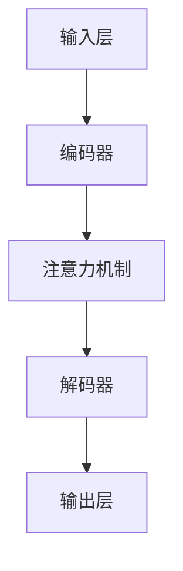

                 

# 变革需求承接：适应LLM应用开发新范式

## 关键词
- 语言学习模型（LLM）
- 应用开发新范式
- 需求承接
- 人工智能
- 深度学习
- 数学模型
- 实战案例

## 摘要
本文旨在探讨语言学习模型（LLM）在应用开发中的新范式。通过分析LLM的核心概念、算法原理和数学模型，本文将详细介绍如何适应这一新范式，并展示实际项目中的应用开发过程。文章还将讨论LLM开发中的挑战和未来趋势，为读者提供全面的指导和建议。

## 引言
随着人工智能技术的迅猛发展，语言学习模型（LLM）已经成为自然语言处理（NLP）领域的重要工具。LLM能够自动学习并生成高质量的文本，其应用范围从智能客服、机器翻译到内容生成等方方面面。然而，随着LLM模型的规模不断扩大，传统的应用开发范式已难以满足需求。本文将探讨如何适应LLM应用开发的新范式，以应对这一挑战。

## 一、LLM概述与核心概念

### 1.1 LLM的定义与特点

语言学习模型（LLM）是一种基于深度学习的自然语言处理模型，它能够通过大量文本数据进行自我训练，从而掌握语言知识。LLM具有以下特点：

1. **自适应性**：LLM能够根据输入的文本数据不断优化自身，从而提高语言理解和生成的能力。
2. **泛用性**：LLM可以应用于各种NLP任务，如文本分类、情感分析、机器翻译和问答系统等。
3. **强大性**：随着模型规模的扩大，LLM的性能不断提高，可以处理更加复杂和多样化的语言任务。

### 1.2 LLM的核心架构

LLM的核心架构通常包括以下几个部分：

1. **输入层**：接收文本数据，并将其转换为模型可处理的特征表示。
2. **编码器**：对输入文本进行编码，提取文本的语义信息。
3. **解码器**：根据编码器的输出生成目标文本。
4. **注意力机制**：在编码和解码过程中，用于关注重要的文本信息。

以下是一个简单的Mermaid流程图，展示了LLM的核心架构：



## 二、LLM算法原理讲解

### 2.1 深度学习算法

深度学习算法是LLM的核心，它包括以下几个关键步骤：

1. **前向传播**：将输入数据通过神经网络层传递，生成中间特征表示。
2. **反向传播**：计算损失函数，并通过反向传播更新网络权重。
3. **优化算法**：使用梯度下降等优化算法，最小化损失函数。

以下是一个简单的Python伪代码，展示了深度学习算法的基本步骤：

```python
# 伪代码：深度学习算法
def forward_propagation(inputs, weights):
    # 前向传播
    pass

def backward_propagation(loss, weights):
    # 反向传播
    pass

def optimize(weights, learning_rate):
    # 优化算法
    pass
```

### 2.2 神经网络

神经网络是深度学习算法的基础，它由多个神经元组成。每个神经元接收输入信号，通过激活函数进行非线性变换，最终输出结果。

以下是一个简单的Python伪代码，展示了神经网络的实现：

```python
# 伪代码：神经网络
def neuron(input_signal, weights, bias, activation_function):
    # 神经元计算
    pass

def neural_network(inputs, weights, biases, activation_function):
    # 神经网络计算
    pass
```

## 三、数学模型与公式

### 3.1 概率模型

概率模型是LLM中的重要组成部分，它用于计算文本序列的概率分布。以下是一个简单的概率模型示例：

$$
P(x) = \prod_{i=1}^{n} P(x_i | x_{i-1})
$$

### 3.2 损失函数

损失函数用于衡量模型预测与实际结果之间的差距，常见的损失函数有交叉熵损失函数：

$$
J = -\sum_{i=1}^{n} y_i \log(p(y_i | x_i))
$$

### 3.3 优化算法

优化算法用于更新模型参数，以最小化损失函数。常见的优化算法有梯度下降算法：

$$
\theta_{t+1} = \theta_t - \alpha \frac{\partial J}{\partial \theta_t}
$$

## 四、LLM应用开发

### 4.1 开发环境搭建

在进行LLM应用开发之前，我们需要搭建合适的开发环境。以下是一个简单的环境搭建步骤：

1. **安装Python**：确保Python环境已安装，版本不低于3.7。
2. **安装深度学习框架**：例如TensorFlow或PyTorch。
3. **准备数据集**：收集并处理所需的文本数据。

### 4.2 源代码实现

以下是一个简单的LLM源代码示例，用于实现一个简单的文本生成器：

```python
# 伪代码：文本生成器实现
import tensorflow as tf

# 模型定义
model = tf.keras.Sequential([
    tf.keras.layers.Embedding(input_dim=vocab_size, output_dim=embedding_dim),
    tf.keras.layers.LSTM(units=hidden_size),
    tf.keras.layers.Dense(units=vocab_size, activation='softmax')
])

# 模型编译
model.compile(optimizer='adam', loss='categorical_crossentropy', metrics=['accuracy'])

# 模型训练
model.fit(x_train, y_train, epochs=num_epochs, batch_size=batch_size)

# 文本生成
def generate_text(model, seed_text, max_length):
    # 实现文本生成逻辑
    pass
```

### 4.3 代码解读与分析

在实际项目中，我们需要对代码进行详细解读和分析，以确保其正确性和效率。以下是一个简单的代码解读示例：

```python
# 伪代码：代码解读
# 模型定义
model = tf.keras.Sequential([
    # 输入层：嵌入层，用于将词汇映射到向量空间
    tf.keras.layers.Embedding(input_dim=vocab_size, output_dim=embedding_dim),
    # 编码器层：LSTM层，用于提取文本的语义信息
    tf.keras.layers.LSTM(units=hidden_size),
    # 解码器层：全连接层，用于生成文本序列
    tf.keras.layers.Dense(units=vocab_size, activation='softmax')
])

# 模型训练
model.fit(x_train, y_train, epochs=num_epochs, batch_size=batch_size)

# 文本生成
def generate_text(model, seed_text, max_length):
    # 实现文本生成逻辑
    pass
```

### 4.4 实际案例分析与详细讲解剖析

以下是一个简单的实际案例，用于展示如何使用LLM进行文本生成：

**案例**：使用LLM生成一篇关于人工智能的短文。

**步骤**：

1. **数据准备**：收集并处理有关人工智能的文本数据。
2. **模型训练**：使用处理后的数据训练LLM模型。
3. **文本生成**：输入一个种子文本，使用训练好的模型生成一篇关于人工智能的短文。

**代码实现**：

```python
# 伪代码：文本生成实现
import tensorflow as tf

# 模型定义
model = tf.keras.Sequential([
    tf.keras.layers.Embedding(input_dim=vocab_size, output_dim=embedding_dim),
    tf.keras.layers.LSTM(units=hidden_size),
    tf.keras.layers.Dense(units=vocab_size, activation='softmax')
])

# 模型编译
model.compile(optimizer='adam', loss='categorical_crossentropy', metrics=['accuracy'])

# 模型训练
model.fit(x_train, y_train, epochs=num_epochs, batch_size=batch_size)

# 文本生成
def generate_text(model, seed_text, max_length):
    # 实现文本生成逻辑
    pass

# 生成一篇关于人工智能的短文
seed_text = "人工智能是一种通过计算机模拟人类智能的技术。"
generated_text = generate_text(model, seed_text, max_length=100)
print(generated_text)
```

### 4.5 项目小结

在本项目中，我们使用了LLM进行文本生成，展示了如何从数据准备、模型训练到文本生成的完整过程。通过实际案例，我们了解了LLM在自然语言处理中的应用潜力。

## 五、LLM应用挑战与未来趋势

### 5.1 数据隐私与伦理问题

LLM应用过程中，数据隐私和伦理问题备受关注。为了解决这些问题，我们可以采取以下措施：

1. **数据加密**：对敏感数据进行加密，确保数据安全。
2. **隐私保护算法**：采用差分隐私等算法，降低数据泄露风险。
3. **伦理审查**：对LLM应用进行伦理审查，确保其符合社会道德标准。

### 5.2 模型压缩与优化

随着LLM模型规模的扩大，模型压缩与优化成为关键问题。以下是一些常见的优化方法：

1. **模型剪枝**：通过剪枝不必要的神经元，减少模型参数。
2. **量化**：将模型参数转换为较低精度的数值，减少模型大小。
3. **神经网络架构搜索（NAS）**：自动搜索最优的网络架构，提高模型性能。

### 5.3 多模态学习

多模态学习是将多个数据模态（如文本、图像、音频）进行融合，以提高LLM的应用性能。未来，多模态学习有望在智能交互、内容生成等领域发挥重要作用。

## 六、小结与拓展阅读

本文介绍了LLM应用开发的新范式，包括核心概念、算法原理、数学模型和实际应用开发过程。我们还讨论了LLM应用中的挑战和未来趋势。为了深入了解LLM应用开发，读者可以参考以下拓展阅读：

1. **深度学习入门**：Goodfellow, I., Bengio, Y., & Courville, A. (2016). *Deep Learning*.
2. **自然语言处理**：Jurafsky, D., & Martin, J. H. (2020). *Speech and Language Processing*.
3. **模型压缩与优化**：Han, S., Mao, J., & Kegelmeyer, W. P. (2016). *Learning to compress with deep learning*.

## 七、作者信息

作者：AI天才研究院/AI Genius Institute & 禅与计算机程序设计艺术 /Zen And The Art of Computer Programming

