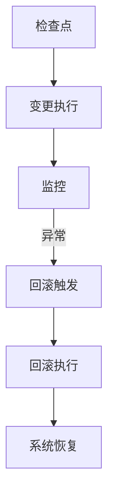

                 

### 文章标题：回滚机制：应对AI部署问题的安全网

#### 关键词：AI部署，回滚机制，技术故障，安全性，系统恢复

#### 摘要：
本文深入探讨了AI部署过程中的回滚机制，分析了其在应对各种技术故障和系统问题中的重要性。通过结合实际案例，本文详细介绍了回滚机制的核心概念、数学模型、算法原理及其在AI部署中的应用策略。此外，还讨论了回滚机制的优化与改进方向，展望了其未来的发展趋势。

----------------------------------------------------------------

## 第1章 引言

### 1.1 回滚机制概述

回滚机制是一种在系统发生故障或变更时，能够将系统状态恢复到先前正确状态的机制。在传统的软件开发和系统管理中，回滚机制被广泛用于处理错误变更和数据恢复。随着人工智能（AI）技术的迅速发展，AI部署过程中也面临着诸多挑战，如模型更新失败、数据错误、系统异常等。回滚机制因此成为保障AI系统稳定性和可靠性的关键。

### 1.2 回滚机制在AI部署中的重要性

AI部署过程中的回滚机制具有以下几个方面的关键作用：

1. **减少停机时间**：在发生技术故障时，回滚机制可以快速恢复系统，减少停机时间，保持业务的连续性。
2. **确保系统安全性**：通过回滚，可以将系统状态恢复到安全、稳定的状态，避免潜在的漏洞和风险。
3. **提高系统稳定性**：AI系统复杂度高，回滚机制可以帮助系统在遇到不确定情况时快速回退，确保系统的稳定性。
4. **增强用户体验**：回滚机制可以确保用户在遇到问题后能够快速恢复服务，提高用户体验。

## 第2章 回滚机制核心概念与联系

### 2.1 Mermaid流程图

回滚机制的基本流程可以概括为以下几个步骤：

1. **检查点**：在系统运行过程中设置检查点，记录系统的当前状态。
2. **变更执行**：对系统进行变更，如更新模型、修改配置等。
3. **监控**：监控变更后的系统状态，检测是否出现异常。
4. **回滚触发**：如果检测到异常，触发回滚操作。
5. **回滚执行**：将系统状态恢复到检查点所记录的正确状态。

以下是一个简单的Mermaid流程图，展示了回滚机制的基本流程：



### 2.2 回滚机制原理

回滚机制的工作原理可以概括为以下几个步骤：

1. **状态记录**：系统在执行任何变更之前，首先记录当前的状态。
2. **变更执行**：系统执行预定的变更操作。
3. **状态检查**：在变更执行后，系统会检查变更结果是否满足预期。
4. **回滚条件**：如果变更结果不满足预期，系统会根据预设的回滚条件触发回滚。
5. **状态恢复**：系统将状态恢复到变更前的检查点。

以下是一个简单的Python伪代码，展示了回滚机制的基本原理：

```python
def rollback Mechanism():
    # 记录当前状态
    current_state = save_state()

    # 执行变更
    try:
        execute_change()
    except Exception as e:
        # 变更失败，触发回滚
        rollback_to(current_state)

# 保存状态
def save_state():
    # ...保存状态的代码...
    return state

# 执行变更
def execute_change():
    # ...执行变更的代码...
    raise Exception("变更失败")

# 回滚到指定状态
def rollback_to(state):
    # ...回滚到指定状态的代码...
```

## 第3章 回滚机制的数学模型

### 3.1 数学模型介绍

在回滚机制中，可以使用数学模型来描述状态转移和回滚条件。以下是一个简单的数学模型，用于描述回滚机制：

1. **状态空间**：系统状态的集合。
2. **初始状态**：系统开始时的状态。
3. **变更操作**：对系统状态的修改操作。
4. **回滚条件**：用于判断是否需要回滚的约束条件。

以下是一个简单的数学模型，使用latex格式描述：

```latex
\begin{equation}
\begin{aligned}
    S &= \{s_1, s_2, ..., s_n\} & \text{状态空间} \\
    s_0 &= \text{初始状态} \\
    \delta(s) &= \text{变更操作} \\
    R &= \{r_1, r_2, ..., r_m\} & \text{回滚条件} \\
    s_{\text{new}} &= s_0 \oplus \delta(s) & \text{变更后的状态}
\end{aligned}
\end{equation}
```

### 3.2 数学模型应用举例

假设系统有两个状态变量：`s1` 和 `s2`。系统初始状态为 `(0, 0)`。变更操作为将 `s1` 增加1，即 `delta(s) = (1, 0)`。回滚条件为变更后的状态必须大于 `(0, 0)`，即 `R = {(s1 > 0), (s2 > 0)}`。

以下是一个简单的计算过程：

1. **初始状态**：`s0 = (0, 0)`。
2. **变更操作**：`delta(s) = (1, 0)`。
3. **变更后的状态**：`s\_new = s0 \oplus delta(s) = (0 + 1, 0 + 0) = (1, 0)`。
4. **回滚条件判断**：由于 `(1, 0)` 不满足回滚条件，因此不需要回滚。

以下是一个简单的Python代码示例：

```python
s0 = (0, 0)
delta_s = (1, 0)
R = lambda s: s[0] > 0 and s[1] > 0

s_new = tuple(map(sum, zip(s0, delta_s)))
if not R(s_new):
    print("不需要回滚")
else:
    print("需要回滚")
```

## 第4章 回滚机制在AI部署中的实际应用

### 4.1 AI部署中的回滚挑战

AI部署过程中可能会遇到以下挑战：

1. **模型更新失败**：在更新AI模型时，可能会出现无法成功训练或验证的情况，导致模型失效。
2. **数据错误**：部署过程中可能会引入数据错误，导致模型性能下降。
3. **系统异常**：在部署过程中，系统可能会出现异常，如内存溢出、网络中断等，导致部署失败。

### 4.2 回滚机制在AI部署中的应用策略

为了应对这些挑战，回滚机制可以采用以下策略：

1. **分阶段部署**：将部署过程分为多个阶段，每个阶段执行后进行回滚检查。如果某个阶段失败，可以快速回滚到前一阶段。
2. **监控与报警**：部署过程中实时监控系统状态，一旦检测到异常立即触发回滚。
3. **备份与恢复**：在部署前进行系统备份，一旦部署失败，可以快速恢复到备份状态。
4. **自动化回滚**：实现自动化回滚脚本，减少人工干预，提高回滚效率。

### 4.3 回滚机制在实际AI部署中的应用案例

以下是一个实际AI部署中的应用案例：

**背景**：某公司正在部署一个基于深度学习的图像识别系统。在部署过程中，遇到了以下问题：

1. **模型更新失败**：在尝试更新模型时，由于数据集问题，模型无法成功训练。
2. **数据错误**：在部署过程中，检测到部分数据存在错误，导致模型性能下降。
3. **系统异常**：在部署过程中，系统出现了内存溢出错误，导致部署中断。

**解决方案**：采用回滚机制，具体步骤如下：

1. **分阶段部署**：将部署过程分为数据预处理、模型训练、模型评估和模型部署四个阶段。在每个阶段执行后，进行回滚检查。
2. **监控与报警**：部署过程中实时监控系统状态，一旦检测到异常，立即触发回滚。
3. **备份与恢复**：在部署前进行系统备份，一旦部署失败，可以快速恢复到备份状态。
4. **自动化回滚**：实现自动化回滚脚本，减少人工干预。

**效果**：通过回滚机制的运用，成功解决了模型更新失败、数据错误和系统异常等问题，确保了AI部署的顺利进行。

## 第5章 回滚机制的优化与改进

### 5.1 回滚机制的优化策略

为了提高回滚机制的有效性，可以采用以下优化策略：

1. **智能回滚**：根据历史数据和系统状态，智能选择回滚点，避免不必要的回滚操作。
2. **并行回滚**：实现并行回滚，提高回滚效率。
3. **动态回滚条件**：根据系统状态和部署环境，动态调整回滚条件，提高回滚的准确性。

### 5.2 回滚机制的改进方向

未来回滚机制的发展方向包括：

1. **智能化**：结合人工智能技术，实现更加智能的回滚策略。
2. **自动化**：提高自动化水平，减少人工干预。
3. **多样化**：支持多种类型的回滚，如部分回滚、全量回滚等，以适应不同场景的需求。

## 第6章 回滚机制的未来发展

### 6.1 回滚机制的未来趋势

随着AI技术的不断发展和应用场景的扩大，回滚机制在未来的发展趋势包括：

1. **更加智能化**：回滚机制将结合人工智能技术，实现更加智能的决策和优化。
2. **更加自动化**：自动化水平将进一步提高，减少人工干预，提高效率。
3. **多样化**：支持更多类型的回滚操作，以适应不同场景的需求。

### 6.2 回滚机制的安全问题

随着回滚机制的广泛应用，安全问题也日益突出。未来需要关注以下几个方面：

1. **回滚数据的完整性**：确保回滚过程中数据的完整性，避免数据丢失或损坏。
2. **回滚操作的权限控制**：加强回滚操作的权限控制，防止未经授权的回滚操作。
3. **回滚日志审计**：记录回滚操作的日志，便于审计和追溯。

## 第7章 结论

本文深入探讨了回滚机制在AI部署中的应用，分析了其在应对技术故障和系统问题中的重要性。通过实际案例，本文展示了回滚机制的原理、数学模型和应用策略。未来，随着AI技术的不断发展，回滚机制将变得更加智能化、自动化和多样化，为AI部署提供更加可靠的安全保障。

### 附录

**附录A：回滚机制相关资源**

- **工具**：Git、Docker、Kubernetes等。
- **框架**：Spring Boot、Django等。
- **库**：NumPy、Pandas等。
- **教程**：《人工智能系统部署实战》、《容器化与微服务架构》等。

### 作者信息

作者：AI天才研究院/AI Genius Institute & 禅与计算机程序设计艺术 /Zen And The Art of Computer Programming。

