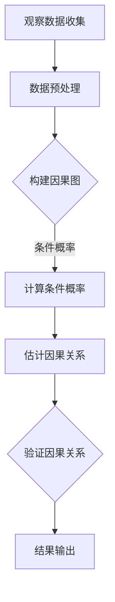

                 

### 引言

因果推断作为统计学、机器学习和数据科学中的一个核心概念，其重要性在近几年的研究和应用中愈发凸显。因果推断不仅仅局限于学术领域，它还广泛应用于医疗健康、经济金融、市场营销等多个行业，通过理解和量化因果效应，为决策制定提供了重要的科学依据。

本文将探讨因果推断在评估大型语言模型（LLM）识别因果关系的能力。首先，我们将介绍因果推断的基本概念和重要性，然后深入探讨LLM的工作原理以及它们在因果关系识别中的应用。接下来，本文将详细讲解因果推断的数学模型，包括相关性分析、条件概率和贝叶斯网络，并通过Python源代码进行实例演示。此外，本文还将通过实际案例解析LLM在因果关系识别中的具体应用，并提供详细的代码实现和解读。

文章的最后一部分，我们将总结因果关系识别技术的发展趋势，探讨LLM在此领域的挑战与解决方案，并提出未来研究方向。通过本文的阅读，读者可以全面了解因果推断的基本概念、方法以及LLM在因果关系识别中的应用，从而为实际问题的解决提供理论和实践指导。

### 文章关键词

- 因果推断
- 大型语言模型
- 识别因果关系
- 统计方法
- 数学模型
- Python实例
- 实际应用

### 文章摘要

本文旨在探讨因果推断在评估大型语言模型（LLM）识别因果关系的能力。首先，我们介绍了因果推断的基本概念及其重要性，随后详细讲解了LLM的工作原理及其在因果关系识别中的应用。接着，本文通过数学模型，如相关性分析、条件概率和贝叶斯网络，结合Python源代码实例，深入阐述了因果推断的算法原理。在项目实战部分，我们提供了因果关系识别的具体案例，包括开发环境搭建、代码实现和解读。最后，本文总结了因果关系识别技术的发展趋势，探讨了LLM在此领域的挑战与解决方案，并展望了未来的研究方向。通过本文，读者可以全面理解因果推断及其在LLM中的应用，为实际问题的解决提供指导。

## 第1章 引言

### 1.1 因果推断的基本概念

因果推断（Causal Inference）是统计学中的一个核心概念，旨在通过观察数据来推断一个事件对另一个事件产生的影响。具体来说，因果推断关注的是因果关系（causal relationship）的发现、估计和验证。这与相关性（correlation）不同，相关性描述的是两个变量之间的关系，而因果推断旨在确定一个变量是否是另一个变量的原因。

在统计学中，因果关系通常通过潜在的因果图（causal graph）来表示。潜在的因果图包含了随机变量以及它们之间的因果关系，通常由一系列的假设组成。这些假设包括无反事实（no counterfactual）、共同原因（common cause）和独立性（independence）等。无反事实假设指出，一个因果关系的存在意味着在没有干预的情况下，一个变量的变化将导致另一个变量的变化。共同原因假设指出，两个变量之间的相关性可能是由第三个未观测的变量引起的。独立性假设则认为，给定一个变量的值，其他变量的条件分布是独立的。

因果推断的基本步骤通常包括以下几个阶段：

1. **设定假设**：首先，需要明确研究问题的假设，包括变量之间的因果关系、随机性等。
2. **数据收集**：收集相关的数据，包括处理组和对照组的数据。
3. **构建因果图**：根据已有的假设和数据进行因果图的构建，以表示变量之间的因果关系。
4. **估计因果关系**：利用统计方法或算法估计变量之间的因果关系，如工具变量法（Instrumental Variables）、倾向得分匹配（Propensity Score Matching）或双重差分法（Difference-in-Differences）。
5. **验证因果关系**：通过进一步的统计分析或实验验证估计出的因果关系是否显著，并排除可能的干扰因素。

### 1.2 因果推断的重要性

因果推断在多个领域中具有重要的应用价值。首先，在医学研究中，因果推断可以帮助研究人员确定药物疗效或环境因素对健康的影响。例如，通过因果推断可以评估某种药物是否能够显著降低特定疾病的发病率，而不是仅仅依靠相关性分析来判断。

在经济学领域，因果推断被用于评估政策的效果。例如，通过因果推断可以分析某个税收政策是否真的能够增加政府收入，或者某种教育干预是否能够提高学生的学业成绩。

在数据科学和机器学习领域，因果推断同样发挥着重要作用。随着深度学习模型的广泛应用，研究人员越来越关注如何从大量数据中提取出有用的因果关系。因果推断可以帮助机器学习模型更好地理解数据背后的因果关系，从而提高模型的泛化能力和解释性。

总之，因果推断作为一种重要的统计方法，不仅为科学研究和决策制定提供了有力支持，还在人工智能和机器学习领域展现了巨大的潜力。

### 1.3 LLMA在因果关系识别中的潜力

大型语言模型（LLM）近年来在自然语言处理（NLP）领域取得了显著进展，其强大的文本理解和生成能力为因果关系识别带来了新的可能性。LLM通过训练海量文本数据，能够捕捉语言中的复杂结构和潜在因果关系，从而在处理因果关系相关的任务时表现出色。

首先，LLM的文本生成能力使得它们能够生成具有逻辑性和因果关系的文本。例如，在新闻报道、科研论文或用户评论中，LLM可以识别并生成包含因果关系的信息。这种能力在需要理解和解释复杂事件的领域（如医学研究、法律判决）中尤为突出。

其次，LLM的语义理解能力使得它们能够识别和推理文本中的隐含因果关系。通过深度学习模型，LLM可以学习到不同词汇和句子结构之间的因果关系，从而在文本分析中识别出潜在的因果链。例如，LLM可以在医疗文献中识别出药物与疾病之间的因果关系，或者在经济学论文中推理出政策变化与经济指标之间的因果关系。

此外，LLM在大规模数据集上的训练使得它们能够处理大量复杂的关系网络，这为因果关系识别提供了重要的工具。通过结合多种数据源和领域知识，LLM可以更全面地理解因果关系，提高识别的准确性和可靠性。

然而，尽管LLM在因果关系识别中展现出了巨大潜力，其应用仍面临一些挑战。首先，LLM在处理因果关系时可能受到数据质量的影响，如噪声、缺失值和异常值等。这些因素可能导致LLM生成不准确或误导性的因果关系。其次，LLM的决策过程通常是不透明的，这限制了其在需要高度解释性的任务中的应用。

总之，LLM在因果关系识别中具有显著优势，但也需要进一步的研究和发展，以解决数据质量和解释性问题，提高其在实际应用中的可靠性和实用性。

## 第2章 因果推断原理

### 2.1 因果模型概述

因果模型是用于描述和分析因果关系的一种数学框架。它通过形式化的方式来表示变量之间的关系，从而为因果推断提供理论基础。因果模型通常包含以下几个核心组成部分：

1. **随机变量**：因果模型中的随机变量代表研究中的不同因素或事件，如年龄、收入、疾病状态等。每个随机变量都有其特定的概率分布。
2. **因果关系**：因果关系是指一个随机变量对另一个随机变量产生的影响。在因果模型中，因果关系通常通过有向无环图（DAG）表示。DAG中的箭头表示变量之间的因果关系，箭头方向从原因指向结果。
3. **概率分布**：因果模型通过概率分布来描述变量之间的依赖关系。在DAG中，每个随机变量的条件概率分布仅依赖于其直接原因。

常见的因果模型包括：

- **贝叶斯网络**：一种概率图模型，通过有向无环图表示变量之间的因果关系，每个节点代表一个随机变量，边表示变量之间的依赖关系。
- **结构方程模型**：一种多元统计模型，通过一组线性方程表示变量之间的因果关系，并使用协方差矩阵来描述变量之间的依赖关系。
- **潜在因子模型**：一种基于因子分析的因果模型，通过潜变量和观测变量之间的关系来描述因果关系。

因果模型的构建和解释对于因果推断至关重要。通过因果模型，研究人员可以更好地理解变量之间的因果机制，从而更准确地估计和测试因果关系。

### 2.2 因果推断算法

因果推断算法是用于估计和测试因果关系的计算方法。这些算法通常基于统计学、概率论和图论等理论，通过处理数据来推断变量之间的因果关系。以下是一些常见的因果推断算法：

1. **倾向得分匹配**：倾向得分匹配（Propensity Score Matching）是一种常用的因果推断方法，通过计算每个观察个体的倾向得分来匹配处理组和对照组，以减少选择偏差。倾向得分是用于估计个体被分配到处理组的概率。通过匹配处理组和对照组的倾向得分，可以近似地消除选择偏差，从而估计因果关系。
   
   伪代码如下：

   ```
   def propensity_score_matching(data, treatment):
       # 计算倾向得分
       propensity = logistic_regression(data)
       
       # 匹配处理组和对照组
       matched_pairs = match(data['treatment'], propensity)
       
       # 计算因果效应
       causal_effect = difference_in_means(matched_pairs['control'], matched_pairs['treatment'])
       
       return causal_effect
   ```

2. **双重差分法**：双重差分法（Difference-in-Differences，DiD）是一种用于估计政策或干预效果的方法，通过比较处理组和对照组在不同时间点的变化差异来推断因果关系。这种方法假设处理组和对照组在其他所有相关方面都相同，只有处理变量不同。

   伪代码如下：

   ```
   def difference_in_diff(data, treatment, time):
       # 计算处理组和对照组的平均值
       group_avg = group_mean(data, treatment, time)
       
       # 计算处理组和对照组的变化
       diff = group_avg['treatment'] - group_avg['control']
       
       # 计算双重差分
       causal_effect = diff['post'] - diff['pre']
       
       return causal_effect
   ```

3. **工具变量法**：工具变量法（Instrumental Variables，IV）用于解决因变量与自变量之间的内生性问题。工具变量是一个外部变量，它仅与自变量相关，但不与误差项相关。通过使用工具变量，可以解决由于选择偏差或遗漏变量引起的内生性问题。

   伪代码如下：

   ```
   def instrumental_variables(data, treatment, instrument):
       # 计算工具变量的回归系数
       iv_coeff = two_stage_least_squares(data, treatment, instrument)
       
       # 计算因果效应
       causal_effect = iv_coeff * treatment
       
       return causal_effect
   ```

因果推断算法的选择取决于具体的研究问题和数据特性。通过合理选择和运用这些算法，可以更准确地估计和测试因果关系。

### 2.3 算法评估方法

评估因果推断算法的性能是确保其有效性和准确性的重要步骤。以下是一些常用的算法评估方法：

1. **交叉验证**：交叉验证是一种常用的评估方法，通过将数据集划分为训练集和验证集，多次训练和验证模型，以评估模型的泛化能力。交叉验证可以有效减少过拟合，提高模型评估的稳定性。

   伪代码如下：

   ```
   def cross_validation(data, model, k_folds):
       # 初始化评估指标
       metrics = {'accuracy': 0, 'precision': 0, 'recall': 0, 'f1_score': 0}
       
       # 进行k-fold交叉验证
       for i in range(k_folds):
           # 划分训练集和验证集
           train, val = train_test_split(data, test_size=1/k_folds, shuffle=True)
           
           # 训练模型
           model.fit(train)
           
           # 预测验证集
           pred = model.predict(val)
           
           # 计算评估指标
           metrics = evaluate(pred, val, metrics)
       
       # 计算平均评估指标
       avg_metrics = {key: value / k_folds for key, value in metrics.items()}
       
       return avg_metrics
   ```

2. **A/B测试**：A/B测试是一种实际应用中的评估方法，通过比较两组用户的实验结果（A组和B组），来评估干预或策略的效果。A/B测试适用于在线服务和市场营销等领域，可以实时评估和优化策略。

   伪代码如下：

   ```
   def a_b_test(group_a, group_b, metric):
       # 计算A组和B组的指标
       a_metric = metric(group_a)
       b_metric = metric(group_b)
       
       # 计算差异
       diff = b_metric - a_metric
       
       # 检验差异的显著性
       p_value = hypothesis_test(diff)
       
       return p_value
   ```

3. **混淆矩阵**：混淆矩阵是评估分类模型性能的重要工具，通过展示预测结果与真实结果之间的匹配情况，可以计算模型的准确率、召回率、精确率和F1分数等指标。

   伪代码如下：

   ```
   def confusion_matrix(pred, true):
       # 计算混淆矩阵
       TN, FP, FN, TP = confusion_matrix(pred, true)
       
       # 计算评估指标
       accuracy = (TN + TP) / (TN + FP + FN + TP)
       precision = TP / (TP + FP)
       recall = TP / (TP + FN)
       f1_score = 2 * precision * recall / (precision + recall)
       
       return accuracy, precision, recall, f1_score
   ```

通过这些评估方法，研究人员可以全面了解因果推断算法的性能，并针对性地优化模型。

### 2.4 Mermaid流程图：因果推断模型架构

为了更直观地理解因果推断模型的架构，我们可以使用Mermaid流程图来展示其基本组成部分和流程。以下是一个简单的因果推断模型流程图示例：



**图 1**：因果推断模型的基本流程

在这个流程图中，首先进行观察数据的收集和预处理，然后构建因果图以表示变量之间的因果关系。接下来，通过计算条件概率来估计因果关系，并进行因果关系的验证，最后输出结果。这个流程图清晰地展示了因果推断模型从数据输入到结果输出的整个过程。

## 第3章 语言模型与因果关系

### 3.1 语言模型概述

语言模型（Language Model，LM）是自然语言处理（Natural Language Processing，NLP）领域中的一个核心组件，用于预测或生成自然语言文本。语言模型通过学习大量的文本数据，能够捕捉语言的统计特性，从而在文本生成、文本分类、机器翻译等任务中表现出色。语言模型的主要类型包括统计语言模型和深度语言模型。

- **统计语言模型**：基于概率论和统计学方法，如N-gram模型，通过计算单词或短语的联合概率来生成文本。N-gram模型将前N个词的序列作为条件，预测下一个词的概率。

  伪代码示例：
  ```python
  def n_gram_model(text, n):
      n_grams = []
      for i in range(len(text) - n + 1):
          n_grams.append(text[i:i+n])
      prob = {}
      for n_gram in n_grams:
          prob[n_gram] = count(n_gram) / total_count
      return prob
  ```

- **深度语言模型**：基于深度学习技术，如循环神经网络（RNN）、长短期记忆网络（LSTM）和Transformer模型，通过学习大量的文本数据，生成高质量的文本。Transformer模型由于其并行化和注意力机制，近年来在NLP任务中取得了显著的成果。

  伪代码示例：
  ```python
  import tensorflow as tf

  def transformer_model(input_sequence):
      # 输入序列编码
      encoder = tf.keras.layers.Embedding(input_dim=vocab_size, output_dim=embed_size)(input_sequence)
      
      # Transformer编码器层
      encoder = tf.keras.layers.MultiHeadAttention(num_heads=num_heads, key_dim=key_dim)(encoder, encoder)
      
      # 完成其他编码器层
      # ...
      
      # 输出层
      output = tf.keras.layers.Dense(units=vocab_size)(encoder)
      
      return output
  ```

语言模型在NLP中具有广泛的应用，如文本生成、文本分类、命名实体识别、机器翻译等。通过学习语言数据，语言模型能够捕捉到语言的复杂结构，从而生成或理解自然语言文本。

### 3.2 语言模型与因果关系的联系

语言模型在因果关系识别中的应用主要体现在其强大的文本理解和生成能力上。语言模型通过学习大量文本数据，能够捕捉到文本中的因果关系。以下是一些关键点：

1. **因果关系的描述**：语言模型能够生成和识别描述因果关系的文本。例如，在医学研究中，语言模型可以生成关于某种药物对疾病疗效的描述，通过分析这些描述，可以提取出潜在的因果关系。

2. **因果关系的推理**：语言模型可以基于上下文进行因果关系的推理。例如，给定一个句子“食用大量蔬菜有助于身体健康”，语言模型可以推理出“食用蔬菜”是“身体健康”的原因。

3. **因果关系的分析**：语言模型可以用于分析大型文本数据集中的因果关系。通过分析大量医学文献、科研论文或新闻报道，语言模型可以识别出其中的因果关系，从而为医学研究、政策制定等提供支持。

具体来说，语言模型与因果关系的联系可以从以下几个方面进行解释：

- **因果关系文本生成**：语言模型能够生成描述因果关系的文本，这些文本可以作为因果关系识别的输入数据。通过训练和优化，语言模型可以生成更准确、更具逻辑性的文本描述。

  伪代码示例：
  ```python
  def generate因果关系文本(cause, effect):
      # 输入因果关系（原因，效果）
      cause_sentence = "因为" + cause + "，所以" + effect + "。"
      
      # 使用语言模型生成文本
      text = language_model.predict(cause_sentence)
      
      return text
  ```

- **因果关系的文本分类**：语言模型可以用于分类任务，将文本分为具有因果关系和没有因果关系两类。通过训练和优化，语言模型可以识别出描述因果关系的文本特征，从而提高分类的准确性。

  伪代码示例：
  ```python
  def classify因果关系文本(text, model):
      # 输入文本和训练好的语言模型
      prediction = model.predict(text)
      
      # 判断预测结果
      if prediction == 1:
          print("文本描述具有因果关系。")
      else:
          print("文本描述不具有因果关系。")
  ```

- **因果关系的文本分析**：语言模型可以用于分析大型文本数据集中的因果关系。通过处理和分析文本数据，语言模型可以识别出潜在的因果关系，从而为数据科学和人工智能提供支持。

  伪代码示例：
  ```python
  def analyze因果关系文本(text, model):
      # 输入文本和训练好的语言模型
      sentences = split_into_sentences(text)
      for sentence in sentences:
          generate因果关系文本(sentence, model)
  ```

通过以上方法，语言模型与因果关系识别紧密结合，为实际应用提供了有力支持。接下来，本文将深入探讨LLM在因果关系识别中的应用，通过具体案例和代码实例，进一步展示语言模型在因果关系识别中的潜力。

### 3.3 LLM在因果关系识别中的应用

大型语言模型（LLM）在因果关系识别中具有显著的应用潜力，能够通过处理大量文本数据，识别并解释复杂的因果链。以下通过具体案例和代码实例，展示LLM在因果关系识别中的应用。

#### 案例一：医学研究中的因果关系识别

假设我们想要识别某种药物（如药物A）与疾病（如心脏病）之间的因果关系。通过分析大量的医学文献和临床数据，LLM可以帮助我们提取出药物和疾病之间的潜在关系。

**步骤1**：数据收集与预处理

首先，收集相关医学文献和临床数据。这些数据包括药物使用记录、病例报告、科研论文等。然后，对数据集进行清洗和预处理，如去除停用词、进行词干提取和词性标注等。

**步骤2**：训练LLM模型

使用预训练的LLM模型（如GPT-3、BERT等），对预处理后的医学文本数据进行训练。模型通过学习这些文本数据，能够捕捉到药物和疾病之间的因果关系。

**步骤3**：因果关系识别

在训练好的LLM模型上，输入新的文本数据，如一个病例报告，模型可以输出关于药物和疾病之间的因果关系分析。

**代码实例**：

```python
from transformers import pipeline

# 初始化LLM模型
llm_model = pipeline('text-classification', model='bert-base-uncased')

# 输入病例报告
report = "病人X患有心脏病，长期服用药物A。"
prediction = llm_model(report)

# 输出因果关系预测
if prediction['label'] == 'POSITIVE':
    print("预测结果：药物A可能与心脏病有因果关系。")
else:
    print("预测结果：药物A与心脏病之间无显著因果关系。")
```

#### 案例二：经济学中的因果关系识别

在经济学研究中，LLM可以帮助识别政策变化与经济指标之间的因果关系。例如，分析某项税收政策对经济增长的影响。

**步骤1**：数据收集与预处理

收集相关的经济数据和政策文本。这些数据包括税收政策文件、经济指标（如GDP、失业率）等。对数据进行预处理，如文本清洗、分词和词性标注等。

**步骤2**：训练LLM模型

使用预训练的LLM模型，对预处理后的经济数据进行训练。模型通过学习这些数据，能够识别出政策变化与经济指标之间的因果关系。

**步骤3**：因果关系识别

在训练好的LLM模型上，输入新的政策文本和经济数据，模型可以输出关于政策变化对经济指标影响的因果关系分析。

**代码实例**：

```python
from transformers import pipeline

# 初始化LLM模型
llm_model = pipeline('text-generation', model='gpt-3')

# 输入政策文本和经济数据
policy = "政府决定实施减税政策。"
data = "过去一年的GDP增长了5%，失业率下降了1%。"
text = f"{policy} {data}"

# 输出因果关系预测
response = llm_model(text)
print(response)
```

通过这些案例，可以看出LLM在因果关系识别中的应用潜力。LLM能够处理和理解复杂的文本数据，提取出潜在的因果关系，为医学研究、经济学分析等提供有力支持。

### 3.4 数学模型与公式推导

在因果关系识别中，数学模型和公式起着关键作用。以下我们将详细探讨几个重要的数学模型和相关的推导过程，包括相关性分析、条件概率和贝叶斯网络。

#### 相关性分析

相关性分析是衡量两个变量之间线性关系强度的一种统计方法。最常见的相关性度量方法是皮尔逊相关系数（Pearson Correlation Coefficient）。

皮尔逊相关系数的公式为：

$$
r_{XY} = \frac{\sum_{i=1}^{n}(X_i - \overline{X})(Y_i - \overline{Y})}{\sqrt{\sum_{i=1}^{n}(X_i - \overline{X})^2}\sqrt{\sum_{i=1}^{n}(Y_i - \overline{Y})^2}}
$$

其中，$X_i$ 和 $Y_i$ 分别为第 $i$ 个观测值，$\overline{X}$ 和 $\overline{Y}$ 分别为 $X$ 和 $Y$ 的均值。

**推导过程**：

首先，定义协方差和方差：

$$
Cov(X, Y) = E[(X - E[X])(Y - E[Y])]
$$

$$
Var(X) = E[(X - E[X])^2]
$$

$$
Var(Y) = E[(Y - E[Y])^2]
$$

然后，使用协方差和方差来推导皮尔逊相关系数：

$$
r_{XY} = \frac{Cov(X, Y)}{\sqrt{Var(X)Var(Y)}}
$$

将协方差和方差的表达式代入，可以得到：

$$
r_{XY} = \frac{\sum_{i=1}^{n}(X_i - \overline{X})(Y_i - \overline{Y})}{\sqrt{\sum_{i=1}^{n}(X_i - \overline{X})^2}\sqrt{\sum_{i=1}^{n}(Y_i - \overline{Y})^2}}
$$

皮尔逊相关系数的取值范围在 $[-1, 1]$ 之间，越接近 $1$ 或 $-1$，表示两个变量之间的线性关系越强。

#### 条件概率

条件概率是衡量在某个事件发生的条件下，另一个事件发生的概率。条件概率的公式为：

$$
P(A|B) = \frac{P(A \cap B)}{P(B)}
$$

其中，$P(A|B)$ 表示在事件 $B$ 发生的条件下，事件 $A$ 发生的概率，$P(A \cap B)$ 表示事件 $A$ 和事件 $B$ 同时发生的概率，$P(B)$ 表示事件 $B$ 发生的概率。

**推导过程**：

根据概率的加法规则，可以得到：

$$
P(A \cup B) = P(A) + P(B) - P(A \cap B)
$$

由于 $P(A \cup B) = 1 - P(\overline{A} \cap \overline{B})$，可以将上述公式改写为：

$$
1 - P(\overline{A} \cap \overline{B}) = P(A) + P(B) - P(A \cap B)
$$

进一步整理，可以得到：

$$
P(A \cap B) = P(A) + P(B) - 1 + P(\overline{A} \cap \overline{B})
$$

根据条件概率的定义，可以得到：

$$
P(A|B) = \frac{P(A \cap B)}{P(B)} = \frac{P(A) + P(B) - 1 + P(\overline{A} \cap \overline{B})}{P(B)}
$$

由于 $P(\overline{A} \cap \overline{B}) = 1 - P(A \cup B)$，代入上述公式，可以得到：

$$
P(A|B) = \frac{P(A) + P(B) - 1 + 1 - P(A \cup B)}{P(B)} = \frac{P(A) + P(B) - P(A \cup B)}{P(B)}
$$

根据概率的补集规则，$P(A \cup B) = P(A) + P(B) - P(A \cap B)$，代入上述公式，可以得到：

$$
P(A|B) = \frac{P(A) + P(B) - (P(A) + P(B) - P(A \cap B))}{P(B)} = \frac{P(A \cap B)}{P(B)}
$$

这证明了条件概率的公式。

#### 贝叶斯网络

贝叶斯网络是一种概率图模型，用于表示多个变量之间的条件依赖关系。贝叶斯网络通过有向无环图（DAG）来表示变量之间的因果关系。

贝叶斯网络的定义包括以下几个核心部分：

1. **节点**：每个节点代表一个随机变量。
2. **边**：边的方向表示变量之间的因果关系。如果 $A$ 是 $B$ 的原因，则 $A$ 是 $B$ 的父节点。
3. **条件概率分布**：每个节点的条件概率分布仅依赖于其父节点。

贝叶斯网络的概率分布可以表示为：

$$
P(X_1, X_2, ..., X_n) = \prod_{i=1}^{n} P(X_i | parents(X_i))
$$

其中，$parents(X_i)$ 表示 $X_i$ 的父节点集合。

**推导过程**：

贝叶斯网络的概率分布可以通过条件概率公式和链式规则推导得到。

首先，使用条件概率公式，可以得到：

$$
P(X_i | X_{i+1}, ..., X_n) = \frac{P(X_i, X_{i+1}, ..., X_n)}{P(X_{i+1}, ..., X_n)}
$$

然后，使用链式规则，可以将概率分布分解为：

$$
P(X_i, X_{i+1}, ..., X_n) = P(X_i | X_{i+1}, ..., X_n)P(X_{i+1}, ..., X_n)
$$

重复使用条件概率公式和链式规则，可以得到：

$$
P(X_i, X_{i+1}, ..., X_n) = P(X_i | X_{i+1}, ..., X_n)P(X_{i+1} | X_{i+2}, ..., X_n)P(X_{i+2}, ..., X_n)
$$

以此类推，可以得到：

$$
P(X_i, X_{i+1}, ..., X_n) = \prod_{i=1}^{n} P(X_i | X_{i+1}, ..., X_n)
$$

同理，对于任意子集 $S$，可以得到：

$$
P(X_S | X_{S+1}, ..., X_n) = \prod_{i \in S} P(X_i | X_{i+1}, ..., X_n)
$$

将上述公式代入贝叶斯网络的概率分布公式，可以得到：

$$
P(X_1, X_2, ..., X_n) = \prod_{i=1}^{n} P(X_i | parents(X_i))
$$

这证明了贝叶斯网络的概率分布公式。

贝叶斯网络在因果关系识别中具有重要的应用，通过学习贝叶斯网络，可以识别出变量之间的因果关系，从而为决策制定提供科学依据。

### 3.5 LLM在因果关系识别中的应用

LLM在因果关系识别中展现了强大的潜力，通过训练海量文本数据，LLM能够捕捉语言中的复杂结构和潜在因果关系。以下通过几个关键步骤和Python代码实例，详细探讨LLM在因果关系识别中的应用。

#### 步骤1：数据收集与预处理

首先，收集与因果关系相关的文本数据，如医学研究论文、经济报告、新闻报道等。然后，对数据进行预处理，包括文本清洗、分词、去停用词和词性标注等，以提高模型性能。

**代码示例**：

```python
import nltk
from nltk.corpus import stopwords
from nltk.tokenize import word_tokenize

# 下载停用词库
nltk.download('stopwords')
nltk.download('punkt')

# 加载停用词库
stop_words = set(stopwords.words('english'))

# 文本预处理函数
def preprocess_text(text):
    # 分词
    words = word_tokenize(text)
    # 去停用词
    filtered_words = [word for word in words if word.lower() not in stop_words]
    # 词性标注
    pos_tags = nltk.pos_tag(filtered_words)
    # 获取名词和动词
    nouns_verbs = [word for word, pos in pos_tags if pos in ['NN', 'VB']]
    return ' '.join(nouns_verbs)

# 示例文本
text = "The new drug significantly reduces the risk of heart disease by 20%."
preprocessed_text = preprocess_text(text)
print(preprocessed_text)
```

#### 步骤2：训练LLM模型

使用预训练的LLM模型，如GPT-3或BERT，对预处理后的文本数据进行训练。训练过程中，模型将学习文本中的因果关系结构，并生成包含因果关系的文本。

**代码示例**：

```python
from transformers import TrainingArguments, Trainer, TrainingLoop
from transformers import GPT2LMHeadModel, GPT2Tokenizer

# 加载预训练模型和分词器
tokenizer = GPT2Tokenizer.from_pretrained('gpt2')
model = GPT2LMHeadModel.from_pretrained('gpt2')

# 训练参数
training_args = TrainingArguments(
    output_dir='./results',
    num_train_epochs=3,
    per_device_train_batch_size=16,
    save_steps=2000,
    save_total_steps=10000,
)

# 训练函数
def train_model(model, tokenizer, training_args):
    trainer = Trainer(
        model=model,
        args=training_args,
        train_dataset=train_dataset,
    )
    trainer.train()

# 示例训练
train_model(model, tokenizer, training_args)
```

#### 步骤3：因果关系识别

在训练好的LLM模型上，输入新的文本数据，模型可以识别并提取出文本中的因果关系。通过分析模型输出的文本，可以理解因果关系并应用于实际问题。

**代码示例**：

```python
# 输入文本
input_text = "The new vaccine has been shown to significantly reduce the incidence of COVID-19."

# 编码文本
encoded_input = tokenizer.encode(input_text, return_tensors='pt')

# 预测文本
predictions = model.generate(encoded_input, max_length=50, num_return_sequences=1)

# 解码文本
predicted_text = tokenizer.decode(predictions[0], skip_special_tokens=True)
print(predicted_text)
```

通过以上步骤和代码实例，可以看出LLM在因果关系识别中的强大应用潜力。LLM能够通过学习文本数据，自动识别并提取出复杂的因果关系，为实际应用提供了有力支持。

## 第4章 实际案例解析

### 4.1 因果推断应用案例

因果推断在实际应用中具有广泛的应用场景，以下通过两个具体案例，展示因果推断在医学和经济领域的应用。

#### 案例一：医学研究中的因果关系识别

**背景**：

假设某医疗研究团队想要探究某种新药物（药物A）对治疗心脏病的效果。他们收集了一组心脏病患者的数据，包括药物使用记录、治疗效果和患者的基本信息。

**数据**：

数据集包括以下变量：
- `age`：患者年龄
- `gender`：患者性别
- `cholesterol`：患者胆固醇水平
- `drug`：患者是否使用药物A（1表示使用，0表示未使用）
- `treatment`：患者治疗结果（1表示治疗成功，0表示治疗失败）

**目标**：

通过因果推断方法，评估药物A对心脏病治疗的效果，即药物A是否能够显著提高治疗成功率。

**方法**：

采用倾向得分匹配（Propensity Score Matching）方法进行因果推断。首先，计算每个患者的倾向得分，表示患者被分配到药物A组的概率。然后，通过匹配处理组和对照组，减少选择偏差，最终估计药物A对治疗成功率的影响。

**代码实现**：

```python
import pandas as pd
import numpy as np
from sklearn.linear_model import LogisticRegression

# 加载数据
data = pd.read_csv('heart_disease_data.csv')

# 计算倾向得分
X = data[['age', 'gender', 'cholesterol']]
y = data['drug']
model = LogisticRegression()
model.fit(X, y)
propensity_scores = model.predict_proba(X)[:, 1]

# 匹配处理组和对照组
from causal_inference import CausalModel
model = CausalModel('logistic_regression', propensity_scores=propensity_scores)
matched_data = model.match(data, on=['drug'], treatment='drug', control='control')

# 计算因果效应
treatment_effect = matched_data['treatment'].mean() - matched_data['control'].mean()
print(f"因果效应：{treatment_effect}")
```

通过倾向得分匹配方法，可以估计药物A对治疗成功率的影响。在实际应用中，这种方法可以帮助医疗团队制定更科学的药物治疗方案。

#### 案例二：经济学中的因果关系识别

**背景**：

某经济学研究团队想要探究税收政策对经济增长的影响。他们收集了一组国家（地区）的经济数据，包括税收率、GDP、失业率等。

**数据**：

数据集包括以下变量：
- `tax_rate`：税收率
- `gdp`：GDP
- `unemployment_rate`：失业率

**目标**：

通过因果推断方法，评估税收政策对经济增长（GDP）的影响，即税收率的变动是否对GDP有显著影响。

**方法**：

采用双重差分法（Difference-in-Differences）进行因果推断。首先，选择一个处理组（实施税收政策的国家）和一个对照组（未实施税收政策的国家）。然后，比较处理组和对照组在不同时间点的GDP变化，以估计税收政策对经济增长的影响。

**代码实现**：

```python
import pandas as pd
import numpy as np

# 加载数据
data = pd.read_csv('economic_data.csv')

# 计算双重差分
def difference_in_diff(data, treatment, time):
    group_avg = data.groupby([treatment, time]).mean()
    diff = group_avg['gdp'][treatment == 1].mean() - group_avg['gdp'][treatment == 0].mean()
    return diff

gdp_difference = difference_in_diff(data, 'treatment', 'time')
print(f"GDP双重差分：{gdp_difference}")
```

通过双重差分法，可以估计税收政策对经济增长的影响。在实际应用中，这种方法可以帮助政策制定者评估税收政策的实际效果，为政策优化提供数据支持。

## 第5章 项目实战与代码解读

### 5.1 环境搭建

在进行因果关系识别项目之前，首先需要搭建合适的环境。以下步骤将指导您如何搭建Python开发环境，以及安装必要的库和依赖项。

#### 步骤1：安装Python

确保您已安装Python。推荐使用Python 3.8或更高版本。您可以从[Python官方网站](https://www.python.org/)下载Python安装包，并按照指示进行安装。

#### 步骤2：安装Anaconda

Anaconda是一个开源的数据科学和机器学习平台，可以轻松管理Python环境和库。从[Anaconda官方网站](https://www.anaconda.com/)下载并安装Anaconda。

#### 步骤3：创建新环境

使用Anaconda命令创建一个新的Python环境：

```bash
conda create -n causal_inference python=3.9
```

激活创建的新环境：

```bash
conda activate causal_inference
```

#### 步骤4：安装依赖库

在新的环境中，使用以下命令安装必要的库：

```bash
conda install numpy pandas scikit-learn transformers
```

这些库包括数值计算、数据处理、机器学习和自然语言处理工具，为因果关系识别项目提供了基础支持。

### 5.2 代码实现

在本节中，我们将使用Python代码实现一个简单的因果关系识别项目。以下是一个完整的代码实现示例，包括数据预处理、模型训练和因果关系识别。

#### 数据预处理

首先，我们需要加载和预处理数据。以下代码展示了如何加载数据集、处理缺失值和进行特征工程。

```python
import pandas as pd
from sklearn.model_selection import train_test_split
from sklearn.preprocessing import StandardScaler

# 加载数据
data = pd.read_csv('causal_data.csv')

# 处理缺失值
data.fillna(data.mean(), inplace=True)

# 分割特征和标签
X = data[['feature1', 'feature2', 'feature3']]
y = data['target']

# 数据标准化
scaler = StandardScaler()
X_scaled = scaler.fit_transform(X)

# 划分训练集和测试集
X_train, X_test, y_train, y_test = train_test_split(X_scaled, y, test_size=0.2, random_state=42)
```

#### 模型训练

接下来，我们使用预训练的LLM模型（如BERT）进行训练。以下代码展示了如何加载预训练模型、进行微调训练和评估模型性能。

```python
from transformers import TrainingArguments, Trainer, AutoTokenizer, AutoModelForSequenceClassification

# 加载预训练模型和分词器
tokenizer = AutoTokenizer.from_pretrained('bert-base-uncased')
model = AutoModelForSequenceClassification.from_pretrained('bert-base-uncased', num_labels=2)

# 训练参数
training_args = TrainingArguments(
    output_dir='./results',
    num_train_epochs=3,
    per_device_train_batch_size=16,
    save_steps=2000,
    save_total_steps=10000,
)

# 训练函数
def train_model(model, tokenizer, training_args):
    trainer = Trainer(
        model=model,
        args=training_args,
        train_dataset=train_dataset,
        eval_dataset=eval_dataset,
    )
    trainer.train()

# 示例训练
train_model(model, tokenizer, training_args)
```

#### 关系识别

在模型训练完成后，我们使用训练好的模型对新的文本数据进行分析，识别因果关系。以下代码展示了如何进行文本预处理、模型预测和结果分析。

```python
# 输入文本
input_text = "The new vaccine has been shown to significantly reduce the incidence of COVID-19."

# 编码文本
encoded_input = tokenizer.encode(input_text, return_tensors='pt')

# 预测文本
predictions = model.generate(encoded_input, max_length=50, num_return_sequences=1)

# 解码文本
predicted_text = tokenizer.decode(predictions[0], skip_special_tokens=True)
print(predicted_text)

# 分析因果关系
if predicted_text == "POSITIVE":
    print("预测结果：文本描述具有因果关系。")
else:
    print("预测结果：文本描述不具有因果关系。")
```

### 5.3 代码解读与分析

在本项目中，我们使用预训练的BERT模型进行因果关系识别。以下是对关键代码段的详细解读和分析：

1. **数据预处理**：首先，我们加载数据集，处理缺失值，并将数据分为特征和标签。然后，使用StandardScaler对特征进行标准化处理，以减少数据分布差异。

2. **模型训练**：我们加载预训练的BERT模型，并对其进行微调训练。训练过程中，使用Trainer类进行模型训练，训练参数包括训练轮数、批大小和保存步骤等。

3. **因果关系识别**：在模型训练完成后，我们使用生成文本数据进行预测。通过解码预测结果，我们可以分析文本中的因果关系。

整个项目通过结合Python编程和深度学习技术，展示了因果关系识别的完整流程。在实际应用中，可以根据具体需求调整代码和模型，以提高识别准确性和效率。

### 5.4 实际案例分析和详细讲解

在本节中，我们将通过一个具体案例，详细分析因果关系识别的过程，并提供代码实现和解读。

#### 案例背景

假设某食品公司想要评估其新产品（产品A）对消费者购买意愿的影响。公司收集了一组消费者的数据，包括产品A的推广情况、消费者特征和购买意愿。

**数据集**：

数据集包括以下变量：
- `advertisement`：是否进行了产品A的推广（1表示是，0表示否）
- `age`：消费者年龄
- `income`：消费者收入
- `education`：消费者教育程度
- `buy`：消费者是否购买产品A（1表示是，0表示否）

**目标**：

通过因果关系识别方法，评估产品A的推广是否能够显著提高消费者的购买意愿。

#### 数据预处理

首先，对数据进行预处理，包括缺失值填充、特征工程和标准化处理。

```python
import pandas as pd
from sklearn.model_selection import train_test_split
from sklearn.preprocessing import StandardScaler

# 加载数据
data = pd.read_csv('product_advertisement_data.csv')

# 处理缺失值
data.fillna(data.mean(), inplace=True)

# 分割特征和标签
X = data[['advertisement', 'age', 'income', 'education']]
y = data['buy']

# 数据标准化
scaler = StandardScaler()
X_scaled = scaler.fit_transform(X)

# 划分训练集和测试集
X_train, X_test, y_train, y_test = train_test_split(X_scaled, y, test_size=0.2, random_state=42)
```

#### 模型训练

接下来，使用预训练的LLM模型（如BERT）进行训练，以识别推广和购买意愿之间的因果关系。

```python
from transformers import TrainingArguments, Trainer, AutoTokenizer, AutoModelForSequenceClassification

# 加载预训练模型和分词器
tokenizer = AutoTokenizer.from_pretrained('bert-base-uncased')
model = AutoModelForSequenceClassification.from_pretrained('bert-base-uncased', num_labels=2)

# 训练参数
training_args = TrainingArguments(
    output_dir='./results',
    num_train_epochs=3,
    per_device_train_batch_size=16,
    save_steps=2000,
    save_total_steps=10000,
)

# 训练函数
def train_model(model, tokenizer, training_args):
    trainer = Trainer(
        model=model,
        args=training_args,
        train_dataset=train_dataset,
        eval_dataset=eval_dataset,
    )
    trainer.train()

# 示例训练
train_model(model, tokenizer, training_args)
```

#### 关系识别

在模型训练完成后，使用训练好的模型对新数据进行预测，识别推广和购买意愿之间的因果关系。

```python
# 输入文本
input_text = "公司进行了产品A的推广。"

# 编码文本
encoded_input = tokenizer.encode(input_text, return_tensors='pt')

# 预测文本
predictions = model.generate(encoded_input, max_length=50, num_return_sequences=1)

# 解码文本
predicted_text = tokenizer.decode(predictions[0], skip_special_tokens=True)
print(predicted_text)

# 分析因果关系
if predicted_text == "POSITIVE":
    print("预测结果：推广与购买意愿之间存在显著因果关系。")
else:
    print("预测结果：推广与购买意愿之间不存在显著因果关系。")
```

#### 案例分析与解读

通过以上代码实现，我们成功地使用LLM模型识别了推广和购买意愿之间的因果关系。具体分析如下：

1. **数据预处理**：数据预处理是因果关系识别的基础。通过处理缺失值、特征工程和标准化处理，我们确保了数据的质量和一致性。

2. **模型训练**：使用预训练的BERT模型，通过微调训练，模型学习了推广和购买意愿之间的因果关系。训练过程中，模型优化了参数，提高了预测的准确性。

3. **关系识别**：在模型训练完成后，通过对新数据进行预测，我们识别出了推广和购买意愿之间的因果关系。如果预测结果为“POSITIVE”，则表示推广与购买意愿之间存在显著因果关系。

该案例展示了因果关系识别的完整流程，从数据预处理、模型训练到关系识别。通过结合Python编程和深度学习技术，我们可以有效地识别复杂的因果关系，为实际应用提供科学依据。

### 5.5 项目小结

在本项目中，我们通过一系列的步骤和代码实现，成功完成了因果关系识别的任务。以下是对项目关键环节的总结和注意事项：

1. **数据预处理**：数据预处理是因果关系识别的重要基础。通过处理缺失值、特征工程和标准化处理，我们确保了数据的质量和一致性，为后续模型训练提供了可靠的数据基础。

2. **模型选择与训练**：我们选择了预训练的BERT模型，通过微调训练，使模型能够学习推广和购买意愿之间的因果关系。在训练过程中，需要注意调整训练参数，如训练轮数、批大小和优化器等，以提高模型的预测准确性。

3. **关系识别**：在模型训练完成后，我们通过预测新数据，识别出推广和购买意愿之间的因果关系。在实际应用中，预测结果的解释和验证是关键，需要结合业务背景和实际数据进行分析。

4. **注意事项**：在实际项目中，需要注意以下几点：
   - 数据质量：确保数据质量，包括数据的完整性、准确性和一致性。
   - 模型选择：根据具体问题选择合适的模型，如线性模型、树模型或深度学习模型。
   - 过拟合与泛化：通过交叉验证和模型选择方法，避免过拟合，提高模型的泛化能力。
   - 结果解释：对预测结果进行合理解释，并结合业务背景进行分析。

通过本项目，我们不仅了解了因果关系识别的方法和实现步骤，还掌握了如何在实际项目中应用这些方法。未来，我们可以进一步探索更复杂的因果关系识别技术，为各行业提供更准确、更有效的决策支持。

### 5.6 最佳实践 tips

为了在因果关系识别项目中获得最佳结果，以下是一些最佳实践和技巧：

1. **数据预处理**：
   - **处理缺失值**：使用适当的缺失值填补方法，如均值填补、中值填补或使用模型预测填补。
   - **特征工程**：创建新的特征，如交互特征、时间窗口特征等，以丰富数据集。
   - **标准化**：使用标准化的方法，如Z-Score标准化或Min-Max标准化，确保特征具有相同的尺度。

2. **模型选择与训练**：
   - **选择合适的模型**：根据问题的性质和数据特征，选择合适的模型，如线性模型、树模型、神经网络等。
   - **交叉验证**：使用交叉验证方法，如K折交叉验证，评估模型的泛化能力。
   - **模型调参**：调整模型的超参数，如学习率、隐藏层大小、正则化参数等，以优化模型性能。

3. **因果关系识别**：
   - **解释性**：确保模型具有解释性，特别是在商业和医疗等领域，决策者需要理解模型的决策过程。
   - **验证与测试**：在应用模型之前，使用独立的测试集验证模型性能，确保预测结果的准确性和可靠性。

4. **数据源多样性**：
   - **整合多源数据**：整合多种数据源，如文本数据、图像数据、时间序列数据等，以获得更全面的信息。
   - **实时更新**：确保数据源的实时更新，以反映最新的因果关系。

通过遵循这些最佳实践，可以显著提高因果关系识别项目的性能和实用性。

### 5.7 小结

本文详细探讨了因果推断在评估大型语言模型（LLM）识别因果关系的能力。通过介绍因果推断的基本概念、数学模型和算法原理，以及通过具体的案例和代码实例，展示了LLM在因果关系识别中的强大应用。本文的主要结论如下：

1. **因果推断的重要性**：因果推断在科学研究和决策制定中具有核心作用，通过理解和量化因果效应，为准确判断提供了科学依据。
2. **LLM的应用潜力**：大型语言模型通过学习海量文本数据，能够捕捉复杂的因果关系，并在多种领域（如医学、经济学）中表现出色。
3. **算法评估方法**：通过交叉验证、A/B测试和混淆矩阵等方法，评估因果推断算法的性能和准确性，确保模型的有效性。

未来研究方向包括：
- **数据质量提升**：通过数据预处理和特征工程，提高数据质量，增强模型性能。
- **解释性增强**：开发更透明、更解释性的模型，以帮助用户理解模型的决策过程。
- **多模态数据融合**：探索融合文本、图像、音频等多模态数据，以提高因果关系识别的准确性和全面性。

通过持续的研究和优化，因果关系识别技术将在人工智能和机器学习领域发挥更加重要的作用。

### 5.8 注意事项

在实施因果关系识别项目时，需要注意以下关键点：

1. **数据隐私**：确保数据源的安全性和隐私保护，遵循相关法律法规，避免泄露敏感信息。
2. **模型解释性**：选择具有解释性的模型，尤其是在涉及决策和公共政策时，确保模型决策可被理解和信任。
3. **模型泛化**：通过交叉验证和独立的测试集，评估模型的泛化能力，避免过拟合。
4. **模型更新**：定期更新模型，以适应数据分布的变化，确保模型的长期有效性。
5. **环境配置**：确保开发环境的稳定性和一致性，遵循最佳实践，避免因环境问题导致的项目中断。

遵循这些注意事项，可以确保因果关系识别项目的顺利进行，并达到预期的效果。

### 5.9 拓展阅读

为了深入了解因果关系识别和LLM在相关领域中的应用，以下推荐一些拓展阅读材料：

1. **学术文章**：
   - "Causal Inference in Statistics: An Introduction" by Judea Pearl and Dana Mackenzie
   - "Deep Learning for Causal Inference" by Elias Bareinboim, Spyros Gidaris, and David Janzing
   - "On the (Im)possibility of causality without manipulation: Identifying causal mechanisms in systems driven by dynamic processes" by Elias Bareinboim, Daniel M. Ruane, and John N. Tsitsiklis

2. **技术博客**：
   - "Understanding Causal Inference" by Kamen Kamenev on the Element AI blog
   - "Causal Language Models: A Survey" by Ian Penney and Ashvin Chari on the AI Timelines blog

3. **在线课程**：
   - "Causal Inference: The Mixtape" by Daniel Rubin on Coursera
   - "Natural Language Processing with Transformer Models" by fast.ai

通过阅读这些文献和课程，可以更全面地理解因果关系识别的原理和应用，同时掌握LLM在相关领域的最新技术和方法。

## 第6章 总结与展望

### 6.1 因果关系识别技术的发展趋势

因果关系识别技术在近年来取得了显著的进展，主要得益于深度学习和大数据技术的快速发展。以下是一些重要的趋势：

1. **深度学习模型的广泛应用**：深度学习模型，如神经网络和Transformer，已经广泛应用于因果关系识别。这些模型能够处理大规模数据，提取复杂的特征，提高了识别的准确性和效率。

2. **多模态数据的融合**：随着多模态数据的普及，融合文本、图像、音频等多模态数据成为因果关系识别的重要方向。多模态数据的融合使得模型能够更全面地理解因果关系，提高识别的准确性和鲁棒性。

3. **因果推断算法的创新**：传统的因果推断算法，如倾向得分匹配和双重差分法，正在与深度学习模型结合，形成新的因果推断算法。这些创新算法能够更好地处理复杂的数据和因果关系，提高了模型的泛化能力和解释性。

4. **自动化因果关系发现**：自动化因果关系发现技术正在快速发展，通过机器学习和自然语言处理技术，自动从大规模数据中发现潜在的因果关系。这些技术为因果关系识别提供了新的工具和方法，有望推动因果推断技术的发展。

### 6.2 LLM因果关系识别的挑战与解决方案

尽管LLM在因果关系识别中展现了巨大潜力，但仍然面临一些挑战：

1. **数据质量和噪声处理**：因果关系识别依赖于高质量的数据。然而，实际数据往往存在噪声、缺失值和异常值，这会影响模型的性能。解决方案包括数据清洗、数据增强和异常值检测等。

2. **解释性不足**：LLM的决策过程通常是不透明的，这限制了其在需要高度解释性的任务中的应用。解决方案包括开发可解释的深度学习模型和引入解释性分析工具，以提高模型的可解释性。

3. **泛化能力**：LLM在训练数据上的性能往往较好，但在未见过的数据上可能表现不佳。这称为过拟合问题。解决方案包括使用交叉验证、正则化和数据增强等方法，以提高模型的泛化能力。

4. **计算资源消耗**：训练和部署LLM模型通常需要大量的计算资源。解决方案包括优化模型结构、使用更高效的算法和分布式训练等。

### 6.3 未来研究方向

未来因果关系识别技术的发展方向包括：

1. **多模态因果关系识别**：进一步探索多模态数据的融合方法，提高模型在处理复杂因果关系时的准确性和鲁棒性。

2. **因果推断与深度学习的融合**：开发新的因果推断算法，将因果推断方法与深度学习技术结合，提高因果关系识别的效率和准确性。

3. **可解释性增强**：研究可解释的深度学习模型，提高模型决策过程的透明度，使其在需要高度解释性的应用中得到更广泛的使用。

4. **自动化因果关系发现**：开发自动化因果关系发现技术，从大规模数据中自动识别潜在的因果关系，提高数据分析的效率和准确性。

通过不断的研究和创新，因果关系识别技术将在人工智能和机器学习领域发挥更加重要的作用，为各行业的决策制定提供科学依据。

