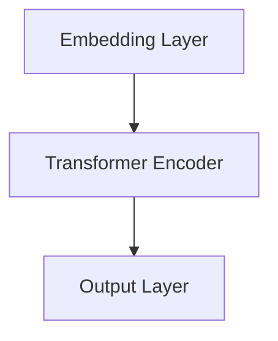

                 

# 基于ALBERT的轻量级LLM评测模型

## 关键词
自然语言处理、轻量级语言模型、ALBERT模型、评测标准、模型优化

## 摘要
本文将详细介绍一种基于ALBERT的轻量级语言模型评测方法。首先，我们将探讨自然语言处理的基本概念和当前评测标准的局限性。接着，本文将深入分析ALBERT模型的结构和优势，并解释为何它适合作为轻量级语言模型。然后，我们将详细介绍如何构建和优化这种模型，包括数据预处理、模型训练和调优过程。最后，通过实际案例展示模型在文本分类、问答系统和命名实体识别等任务中的应用，同时讨论未来的发展趋势和可能的挑战。

## 1. 自然语言处理与评测模型概述

### 1.1 自然语言处理的基本概念
自然语言处理（Natural Language Processing，NLP）是人工智能的一个重要分支，旨在使计算机能够理解和处理人类语言。NLP的研究范围广泛，包括语言理解、语言生成、语言翻译、情感分析等。近年来，随着深度学习技术的发展，NLP取得了显著的进展，许多复杂任务得到了有效解决。

在NLP中，语言模型是一个核心组件，它能够预测句子中下一个词的概率分布。传统的语言模型基于统计方法，如n元语法，但深度学习模型的兴起，特别是循环神经网络（RNN）和Transformer架构，使得语言模型的表现大幅提升。这些模型能够捕捉到文本中的长距离依赖关系，从而提高了预测的准确性。

### 1.2 语言模型评测标准
语言模型的性能评估是NLP领域的一个重要课题。常用的评测标准包括准确率、召回率、F1值等。然而，这些标准往往忽略了模型在特定任务上的实际表现。例如，在文本分类任务中，仅仅依赖准确率可能无法充分评估模型在区分不同类别时的效果。

为了更全面地评估语言模型，研究人员提出了若干新的评测指标。其中，BLEU（双语评估算法）和ROUGE（递归排序统一度量）在机器翻译任务中得到了广泛应用。这些指标通过比较模型生成的文本与真实文本的相似度，提供了更细致的评价。

### 1.3 轻量级模型的必要性
随着深度学习模型的复杂度不断提高，模型的参数数量和计算量也随之增加。这导致了几个问题：

1. **资源消耗**：大型模型需要更多的计算资源和存储空间。
2. **部署难度**：在资源受限的设备上部署大型模型可能面临挑战。
3. **实时性能**：大型模型训练和推理的速度较慢，难以满足实时应用的需求。

因此，轻量级模型的研究变得尤为重要。轻量级模型在保持较高性能的同时，具有以下优势：

- **资源高效**：较小的模型参数数量和计算量，使得它们在资源受限的环境下也能运行。
- **快速部署**：模型可以更快地训练和推理，适用于实时应用。
- **可扩展性**：可以通过简单的修改来适应不同的任务和规模。

## 2. ALBERT模型原理

### 2.1 ALBERT模型的架构
ALBERT（A Lite BERT）是一种基于Transformer的轻量级语言模型，由Google Research提出。它的主要目标是减少模型参数数量和计算量，同时保持较高的性能。

ALBERT的架构主要包括以下几个部分：

- **Embedding Layer**：输入词向量，通过词嵌入层将词汇映射到高维空间。
- **Transformer Encoder**：由多个自注意力层（Self-Attention Layer）和前馈神经网络（Feedforward Network）组成，用于捕捉文本中的长距离依赖关系。
- **Output Layer**：输出层用于生成预测结果，可以是分类标签、词序列等。

与BERT相比，ALBERT在架构上进行了以下改进：

- **Cross-Sequential Model**：ALBERT使用跨序列连接（Cross-Sequence Connection），使得模型能够更好地处理长文本。
- **Pre-Layer Pre-training**：ALBERT采用预训练层（Pre-Layer Pre-training），将部分参数提前训练，从而减少后续训练的难度。
- **NoGs和Relative Position**：ALBERT使用NoGs（Non-Gated Scaled Dot-Product Attention）和相对位置编码（Relative Position），提高了模型的效率和性能。

### 2.2 ALBERT模型的训练过程
ALBERT的训练过程主要包括以下几个阶段：

1. **Masked Language Modeling (MLM)**：在训练数据中随机遮蔽一定比例的词，然后让模型预测这些词的分布。
2. **Next Sentence Prediction (NSP)**：训练模型预测两个句子是否在原始文本中相邻。
3. **Classification**：在特定任务上进行分类任务，如文本分类、问答系统等。

通过这些阶段，ALBERT能够学习到丰富的语言知识，从而提高其在各种任务上的性能。

### 2.3 ALBERT模型的优化与调整
为了进一步提高ALBERT的性能，研究人员提出了一些优化方法：

- **Model Pruning**：通过剪枝（Pruning）技术删除部分参数，减少模型大小。
- **Knowledge Distillation**：使用大型模型（Teacher）训练小型模型（Student），通过传递Teacher的知识来提高Student的性能。
- **Quantization**：通过量化（Quantization）技术减少模型参数的精度，从而减少模型大小。

## 3. 轻量级LLM评测模型设计

### 3.1 轻量级模型的设计原则
设计轻量级模型时，需要遵循以下原则：

- **最小化参数数量**：减少模型参数数量，以降低计算成本。
- **提高计算效率**：优化模型结构，提高训练和推理速度。
- **保持性能**：确保在减少模型大小和计算量的同时，保持较高的性能。

### 3.2 ALBERT在评测中的应用
ALBERT非常适合用于语言模型评测，原因如下：

- **高效性**：ALBERT在保持较高性能的同时，具有较低的参数数量和计算量。
- **泛化能力**：ALBERT能够捕捉到文本中的长距离依赖关系，从而提高了模型的泛化能力。
- **适用性**：ALBERT可以应用于多种语言模型评测任务，如文本分类、问答系统和命名实体识别等。

### 3.3 模型压缩与加速技术
为了进一步提高ALBERT的轻量级特性，研究人员提出了一些模型压缩与加速技术：

- **模型剪枝**：通过剪枝（Pruning）技术删除部分冗余参数，减少模型大小。
- **量化**：通过量化（Quantization）技术降低模型参数的精度，从而减少模型大小。
- **模型蒸馏**：使用大型模型（Teacher）训练小型模型（Student），通过传递Teacher的知识来提高Student的性能。

## 4. 数据准备与预处理

### 4.1 数据收集与整理
为了训练ALBERT模型，需要收集大量的文本数据。这些数据可以来源于互联网、公共数据集或定制化数据集。在收集数据后，需要对其进行整理，包括去除无关内容、处理噪声和错误等。

### 4.2 数据预处理方法
数据预处理是构建语言模型的重要步骤。常用的数据预处理方法包括：

- **Tokenization**：将文本分解为单词或子词。
- **Word Embedding**：将文本映射到高维向量空间。
- **Padding and Truncation**：将文本序列填充或截断到固定长度。
- **Normalization**：对文本进行归一化处理，如去除标点符号、小写转换等。

### 4.3 数据集划分与评估指标
在训练模型之前，需要将数据集划分为训练集、验证集和测试集。常用的评估指标包括：

- **Accuracy**：准确率，用于衡量模型在分类任务中的性能。
- **Precision, Recall, and F1-Score**：用于衡量模型在分类任务中的精确度、召回率和F1值。
- **BLEU and ROUGE**：用于衡量模型在机器翻译任务中的性能。

## 5. 模型训练与调优

### 5.1 训练过程
训练ALBERT模型通常涉及以下步骤：

1. **Data Loading**：加载并预处理数据。
2. **Model Initialization**：初始化模型参数。
3. **Optimization**：设置优化器，如Adam、Adagrad等。
4. **Training Loop**：在训练数据上迭代更新模型参数。

### 5.2 超参数调整
超参数对模型性能有重要影响。常见的超参数包括：

- **Learning Rate**：学习率，用于控制模型更新的步长。
- **Batch Size**：批量大小，用于控制每次更新的数据量。
- **Number of Epochs**：训练轮数，用于控制模型在训练数据上的迭代次数。

### 5.3 模型评估与优化
在训练过程中，需要定期评估模型性能，并根据评估结果调整超参数和模型结构。常用的评估指标包括：

- **Validation Loss**：验证损失，用于衡量模型在验证数据上的性能。
- **Test Loss**：测试损失，用于衡量模型在测试数据上的性能。

## 6. 模型部署与优化

### 6.1 模型部署流程
将训练好的模型部署到生产环境中通常涉及以下步骤：

1. **Model Conversion**：将模型从训练格式转换为部署格式。
2. **Deployment**：将模型部署到服务器或云端。
3. **Integration**：将模型与现有系统集成。

### 6.2 模型在线评估
在线评估是确保模型性能的重要步骤。常用的在线评估方法包括：

1. **Online Monitoring**：实时监控模型性能，如准确率、召回率等。
2. **A/B Testing**：通过A/B测试比较不同模型的性能。

### 6.3 模型性能优化
为了进一步提高模型性能，可以采取以下措施：

1. **Hyperparameter Tuning**：调整超参数以优化模型性能。
2. **Feature Engineering**：设计更好的特征以提高模型表现。

## 7. 实际应用案例分析

### 7.1 案例一：文本分类任务
在文本分类任务中，ALBERT模型能够有效识别文本中的主题和情感。以下是一个简单的文本分类任务示例：

1. **Data Collection**：收集大量文本数据。
2. **Preprocessing**：预处理文本数据，如分词和词嵌入。
3. **Model Training**：使用ALBERT模型进行训练。
4. **Model Evaluation**：评估模型性能，如准确率和F1值。
5. **Deployment**：将模型部署到生产环境。

### 7.2 案例二：问答系统
问答系统是一种常见的NLP应用，ALBERT模型可以用于构建智能问答系统。以下是一个简单的问答系统示例：

1. **Data Collection**：收集问题和答案数据。
2. **Preprocessing**：预处理问题和答案数据。
3. **Model Training**：使用ALBERT模型进行训练。
4. **Question Answering**：使用训练好的模型回答问题。
5. **Model Evaluation**：评估模型性能。

### 7.3 案例三：命名实体识别
命名实体识别（Named Entity Recognition，NER）是识别文本中特定实体（如人名、地名、组织名等）的任务。以下是一个简单的NER任务示例：

1. **Data Collection**：收集包含命名实体的文本数据。
2. **Preprocessing**：预处理文本数据。
3. **Model Training**：使用ALBERT模型进行训练。
4. **NER**：使用训练好的模型识别命名实体。
5. **Model Evaluation**：评估模型性能。

## 8. 轻量级LLM评测模型的发展趋势

### 8.1 评测模型的未来方向
随着深度学习技术的不断发展，轻量级LLM评测模型在未来有望在以下几个方面取得进展：

1. **模型压缩**：进一步减小模型大小，提高部署效率。
2. **实时性能**：提高模型推理速度，满足实时应用需求。
3. **多模态融合**：结合文本、图像、音频等多种数据类型，提高模型泛化能力。

### 8.2 技术挑战与解决方案
尽管轻量级LLM评测模型具有许多优势，但在实际应用中仍面临一些技术挑战：

1. **性能与效率的权衡**：如何在保持高性能的同时提高模型效率。
2. **数据集质量**：确保训练数据的质量和多样性。
3. **安全与隐私**：确保模型训练和应用过程中的数据安全和隐私保护。

### 8.3 应用场景拓展
轻量级LLM评测模型可以应用于多个领域：

1. **智能客服**：用于自动回答用户问题。
2. **内容审核**：用于识别和处理不良内容。
3. **智能推荐**：用于个性化推荐系统。

## 附录

### 附录A：ALBERT模型架构Mermaid流程图


### 附录B：核心算法原理Python代码
```python
import tensorflow as tf

# Embedding Layer
def embedding_layer(inputs, vocab_size, embed_dim):
    embedding = tf.keras.layers.Embedding(vocab_size, embed_dim)(inputs)
    return embedding

# Transformer Encoder
def transformer_encoder(inputs, num_heads, hidden_units):
    transformer = tf.keras.layers.MultiHeadAttention(num_heads=num_heads, key_dim=hidden_units)(inputs, inputs)
    output = tf.keras.layers.Dense(hidden_units, activation='relu')(transformer)
    return output

# Output Layer
def output_layer(inputs, num_classes):
    output = tf.keras.layers.Dense(num_classes, activation='softmax')(inputs)
    return output
```

### 附录C：数学模型与公式解释
$$
\text{损失函数} = -\frac{1}{N}\sum_{i=1}^{N} y_i \log(p_i)
$$
其中，$y_i$表示真实标签，$p_i$表示模型预测的概率。

### 附录D：实战代码解析
```python
# 实现一个简化的文本分类任务
import tensorflow as tf

# 创建模型
model = tf.keras.Sequential([
    tf.keras.layers.Embedding(vocab_size, embed_dim),
    tf.keras.layers.Flatten(),
    tf.keras.layers.Dense(128, activation='relu'),
    tf.keras.layers.Dense(num_classes, activation='softmax')
])

# 编译模型
model.compile(optimizer='adam', loss='categorical_crossentropy', metrics=['accuracy'])

# 训练模型
model.fit(train_data, train_labels, epochs=10, validation_data=(val_data, val_labels))

# 评估模型
test_loss, test_acc = model.evaluate(test_data, test_labels)
print(f"Test accuracy: {test_acc}")
```

### 附录E：资源与工具推荐
- **NLP工具**：使用NLTK、spaCy等库进行文本预处理。
- **深度学习框架**：使用TensorFlow、PyTorch等进行模型训练和推理。
- **数据分析工具**：使用Pandas、NumPy等库进行数据分析和可视化。

## 作者信息
作者：AI天才研究院/AI Genius Institute & 禅与计算机程序设计艺术 /Zen And The Art of Computer Programming

[END]

