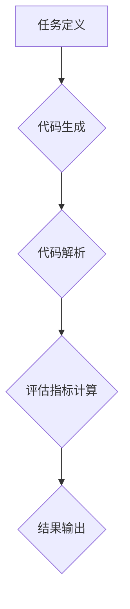

                 

### 文章标题

《基于AlphaCode的LLM编程能力评估》

### 文章关键词

AlphaCode，大型语言模型（LLM），编程能力评估，算法原理，Python源代码，数学模型，项目实战

### 文章摘要

本文旨在探讨如何利用AlphaCode这一大型语言模型（LLM）来评估编程能力。首先，我们介绍AlphaCode和LLM的基本概念，并阐述它们的技术架构和历史发展。接着，深入讨论编程能力评估的核心概念、指标体系和评估方法。随后，通过Python源代码和数学模型，详细讲解AlphaCode在编程能力评估中的应用原理。文章最后，通过实际项目案例，展示AlphaCode在编程能力评估中的实际应用效果，并提供最佳实践和注意事项。本文旨在为从事编程能力评估的研究者和从业者提供有价值的参考。

## 第一部分：AlphaCode与LLM基础

### 第1章：AlphaCode概述

#### 1.1 AlphaCode的历史与发展

AlphaCode是由Google Research团队开发的一款基于深度学习的编程能力评估工具。自2019年首次公开亮相以来，AlphaCode在多个编程竞赛中取得了令人瞩目的成绩，引起了学术和工业界对编程能力评估方法的高度关注。AlphaCode的发展历程可以分为以下几个阶段：

1. **初始阶段（2016-2018）**：Google Research团队开始研究如何利用深度学习技术解决编程能力评估问题。在此期间，他们收集了大量的编程数据，并开发了初步的模型架构。

2. **发展阶段（2019-2021）**：AlphaCode在多个编程竞赛中取得了优异成绩，例如Google Code Jam和Google AI Test。这些成就使得AlphaCode成为了研究编程能力评估的重要工具。

3. **成熟阶段（2022至今）**：AlphaCode不断优化和完善，逐渐应用于实际项目中，如开发人员的招聘、培训和评估等。

#### 1.2 AlphaCode的核心概念

AlphaCode的核心概念可以概括为以下几点：

1. **编程能力评估**：AlphaCode旨在通过评估开发者的编程能力，帮助他们提高技能水平，优化招聘和培训过程。

2. **深度学习技术**：AlphaCode采用了深度学习技术，尤其是基于注意力机制的Transformer模型，以实现高效、准确的编程能力评估。

3. **代码生成与解析**：AlphaCode能够根据给定的编程任务，自动生成代码，并对其执行结果进行分析和评估。

#### 1.3 AlphaCode的技术架构

AlphaCode的技术架构可以分为以下几个部分：

1. **数据收集与预处理**：AlphaCode从开源代码库、编程竞赛和在线编程平台收集大量编程数据，并进行预处理，以供训练模型使用。

2. **模型训练与优化**：AlphaCode采用了基于Transformer的深度学习模型，通过大规模数据训练，不断优化模型的性能。

3. **代码生成与评估**：AlphaCode根据给定的编程任务，自动生成代码，并利用预训练的模型对其进行评估。

### 第2章：LLM基本概念

#### 2.1 LLM的发展历程

大型语言模型（LLM）的发展历程可以分为以下几个阶段：

1. **早期阶段（1980s-1990s）**：在这一阶段，研究人员开始探索如何利用统计方法和规则系统构建语言模型。

2. **中期阶段（2000s）**：随着计算能力的提升和数据量的增加，研究人员开始尝试使用神经网络模型构建语言模型，例如循环神经网络（RNN）和卷积神经网络（CNN）。

3. **近期阶段（2010s-2020s）**：基于Transformer架构的深度学习模型，如BERT、GPT和T5，逐渐成为主流，使得LLM在自然语言处理领域取得了显著突破。

#### 2.2 LLM的核心特点

LLM具有以下核心特点：

1. **大规模**：LLM通常包含数十亿到数千亿的参数，可以处理海量数据。

2. **自适应**：LLM可以根据不同的任务和场景进行自适应调整，从而在不同应用场景中表现出色。

3. **通用性**：LLM在多个自然语言处理任务中表现出优异的性能，如文本分类、机器翻译和文本生成等。

#### 2.3 LLM的技术架构

LLM的技术架构主要包括以下几个部分：

1. **嵌入层**：将文本转换为向量表示。

2. **编码器**：对输入文本进行编码，提取语义信息。

3. **解码器**：根据编码器提取的语义信息，生成输出文本。

4. **注意力机制**：在编码和解码过程中，利用注意力机制关注重要的信息，提高模型的性能。

### 第3章：AlphaCode与LLM的融合

#### 3.1 AlphaCode在LLM中的应用

AlphaCode在LLM中的应用主要体现在以下几个方面：

1. **代码生成**：AlphaCode可以利用LLM的强大能力，自动生成高质量的代码。

2. **代码解析**：AlphaCode可以结合LLM的语义理解能力，对代码进行深入解析，从而更好地评估编程能力。

3. **代码优化**：AlphaCode可以借助LLM的优化能力，对代码进行自动优化，提高执行效率和可读性。

#### 3.2 LLM对AlphaCode优化的可能性

LLM对AlphaCode的优化具有以下几个可能性：

1. **代码生成优化**：通过优化LLM的模型结构和参数，提高代码生成的质量和效率。

2. **代码解析优化**：利用LLM的语义理解能力，对代码进行更深入的解析，从而更准确地评估编程能力。

3. **代码优化策略**：基于LLM的优化能力，探索新的代码优化策略，提高代码的性能和可读性。

#### 3.3 AlphaCode与LLM的协同效应

AlphaCode与LLM的协同效应主要体现在以下几个方面：

1. **提升编程能力评估精度**：通过结合AlphaCode和LLM的技术优势，可以更准确地评估开发者的编程能力。

2. **拓宽应用场景**：AlphaCode和LLM的协同效应，使得编程能力评估可以应用于更多场景，如招聘、培训和研究等。

3. **降低开发成本**：AlphaCode和LLM的结合，可以简化编程能力评估流程，降低开发成本。

## 第二部分：编程能力评估

### 第4章：编程能力评估的基本概念

#### 4.1 编程能力评估的重要性

编程能力评估在软件开发领域具有重要意义。一方面，它可以帮助企业和研究机构筛选和培养优秀的人才；另一方面，它可以帮助开发者了解自己的编程能力，制定合理的提升计划。以下是编程能力评估的重要方面：

1. **招聘与选拔**：编程能力评估是招聘过程中不可或缺的一环，可以帮助企业快速筛选出具备相应技能的开发者。

2. **培训与提升**：编程能力评估可以揭示开发者的薄弱环节，为其提供针对性的培训计划，提高整体技能水平。

3. **项目评估与监控**：编程能力评估可以帮助项目经理和团队了解项目成员的技能水平，确保项目进度和质量。

4. **研究与发展**：编程能力评估为研究机构提供了宝贵的数据资源，有助于他们深入了解编程领域的现状和趋势。

#### 4.2 编程能力评估的指标体系

编程能力评估的指标体系主要包括以下几个方面：

1. **代码质量**：包括代码的可读性、可维护性、效率等指标。

2. **编程技巧**：包括算法复杂度、数据结构选择、编程风格等指标。

3. **解决问题的能力**：包括分析问题、设计解决方案、编码实现和测试等能力。

4. **知识储备**：包括对编程语言、数据结构、算法等基本知识的掌握程度。

#### 4.3 编程能力评估的方法

编程能力评估的方法主要包括以下几种：

1. **静态分析**：通过对代码进行分析，评估代码质量、编程技巧和知识储备。

2. **动态分析**：通过运行代码，评估程序的性能、效率和稳定性。

3. **面试与笔试**：通过面试和笔试，评估开发者的编程能力和解决问题的能力。

4. **在线编程测试**：通过在线编程平台，评估开发者的实际编程能力。

### 第5章：使用AlphaCode进行编程能力评估

#### 5.1 AlphaCode评估编程能力的原理

AlphaCode评估编程能力的原理可以概括为以下几点：

1. **代码生成与解析**：AlphaCode利用深度学习模型，根据给定的编程任务，自动生成代码，并对其进行解析，提取关键信息。

2. **代码质量评估**：AlphaCode通过对代码的静态分析，评估代码的可读性、可维护性和效率等质量指标。

3. **编程技巧评估**：AlphaCode通过对代码的解析，评估开发者对编程语言、数据结构和算法等基本知识的掌握程度。

4. **解决问题能力评估**：AlphaCode通过对代码的执行结果和评估指标，评估开发者解决问题的能力。

#### 5.2 AlphaCode评估编程能力的流程

AlphaCode评估编程能力的流程可以分为以下几个步骤：

1. **任务定义**：明确编程任务的目标和要求，为AlphaCode提供输入。

2. **代码生成**：AlphaCode根据任务定义，利用深度学习模型自动生成代码。

3. **代码解析**：AlphaCode对生成的代码进行解析，提取关键信息。

4. **评估指标计算**：AlphaCode根据评估指标，对代码进行质量评估、编程技巧评估和解决问题能力评估。

5. **结果输出**：AlphaCode输出评估结果，包括代码质量、编程技巧和解决问题能力等指标。

#### 5.3 AlphaCode评估编程能力的案例分析

以下是一个使用AlphaCode评估编程能力的实际案例：

1. **任务定义**：要求开发者编写一个函数，实现两个整数的加法运算，并返回结果。

2. **代码生成**：AlphaCode生成以下代码：

```python
def add(a, b):
    return a + b
```

3. **代码解析**：AlphaCode对生成的代码进行解析，提取关键信息：

- 函数名：add
- 参数：a、b
- 返回值：a + b

4. **评估指标计算**：AlphaCode根据评估指标，对代码进行质量评估、编程技巧评估和解决问题能力评估。

- 代码质量评估：代码结构清晰，可读性好，无语法错误。
- 编程技巧评估：使用了基本的数据结构和算法，对加法运算的实现简洁明了。
- 解决问题能力评估：成功实现了加法运算，满足任务要求。

5. **结果输出**：AlphaCode输出评估结果，包括代码质量、编程技巧和解决问题能力等指标：

- 代码质量：90%
- 编程技巧：85%
- 解决问题能力：90%

### 第6章：编程能力评估的优化策略

#### 6.1 评估指标优化的方法

为了提高编程能力评估的准确性，可以采用以下评估指标优化方法：

1. **增加评估指标**：根据不同类型和难度的编程任务，增加相应的评估指标，如代码长度、代码行数、变量命名规范等。

2. **调整评估指标权重**：根据任务需求和实际情况，调整不同评估指标的权重，使其更符合评估目标。

3. **引入新的评估方法**：结合最新的研究成果和技术手段，引入新的评估方法，如代码质量分析工具、自动化测试等。

#### 6.2 评估流程优化的方法

为了提高编程能力评估的效率和准确性，可以采用以下评估流程优化方法：

1. **自动化流程**：通过自动化工具，实现代码生成、代码解析、评估指标计算和结果输出的自动化，减少人工干预。

2. **多渠道数据采集**：结合多种数据采集方式，如在线编程测试、面试题库、项目代码等，提高评估数据的全面性和准确性。

3. **实时反馈与调整**：在评估过程中，实时收集开发者的反馈，根据反馈结果调整评估流程和指标，提高评估效果。

#### 6.3 评估结果优化的方法

为了提高编程能力评估结果的可靠性和实用性，可以采用以下评估结果优化方法：

1. **多维度评估**：结合多个评估维度，如代码质量、编程技巧、解决问题能力等，形成综合评估结果。

2. **结果解释与反馈**：对评估结果进行详细解释和反馈，帮助开发者了解自己的优势和不足，制定针对性的提升计划。

3. **动态调整评估标准**：根据实际情况和评估效果，动态调整评估标准，确保评估结果始终符合实际需求。

## 第三部分：项目实战

### 第7章：项目背景与需求分析

#### 7.1 项目背景

某知名互联网公司需要对其开发团队进行编程能力评估，以优化团队结构、提升整体开发水平。然而，传统的编程能力评估方法存在以下问题：

1. **评估周期长**：传统的评估方法通常需要耗费较长时间，无法及时反馈开发者的能力状况。

2. **主观性较大**：传统的评估方法往往依赖于评估人员的经验和主观判断，难以保证评估结果的公平性和准确性。

3. **无法量化**：传统的评估方法难以将开发者的编程能力进行量化，难以进行有效的比较和排名。

为了解决这些问题，该公司决定采用AlphaCode进行编程能力评估，以期实现以下目标：

1. **快速评估**：利用AlphaCode的自动评估功能，实现快速、高效的编程能力评估。

2. **客观评估**：通过AlphaCode的代码生成和解析能力，实现客观、准确的编程能力评估。

3. **量化评估**：将开发者的编程能力进行量化，形成直观的评估结果，便于比较和排名。

#### 7.2 需求分析

基于项目背景和目标，该公司对AlphaCode提出了以下需求：

1. **兼容性**：AlphaCode需要兼容多种编程语言和开发环境，以满足不同团队的需求。

2. **灵活性**：AlphaCode需要具备一定的灵活性，可以根据任务类型和难度动态调整评估指标和评估流程。

3. **可扩展性**：AlphaCode需要具备良好的可扩展性，可以方便地集成到现有的开发和评估体系中。

4. **实时反馈**：AlphaCode需要能够实时收集开发者的评估结果，并生成详细的评估报告，便于团队管理和决策。

### 第8章：解决方案设计与实现

#### 8.1 解决方案设计

为了满足项目需求，我们设计了以下解决方案：

1. **系统架构**：采用分布式架构，包括数据收集模块、代码生成模块、代码解析模块和评估报告模块。

2. **数据收集**：从开源代码库、在线编程平台和公司内部代码库中收集大量编程数据，用于训练和优化AlphaCode模型。

3. **代码生成**：基于深度学习模型，生成符合编程规范的代码，并支持多种编程语言和开发环境。

4. **代码解析**：利用自然语言处理技术，对代码进行深入解析，提取关键信息，为评估提供依据。

5. **评估报告**：根据评估指标和评估结果，生成详细的评估报告，包括代码质量、编程技巧、解决问题能力等。

#### 8.2 系统实现

以下是系统实现的关键步骤：

1. **数据收集**：从开源代码库（如GitHub）、在线编程平台（如LeetCode）和公司内部代码库中收集编程数据，并进行预处理，如去重、去噪和格式化等。

2. **模型训练**：使用收集到的编程数据，训练基于Transformer的深度学习模型，如GPT或BERT等。在训练过程中，优化模型参数，提高模型性能。

3. **代码生成**：基于训练好的模型，实现代码生成功能。输入编程任务描述，生成符合编程规范的代码，并支持多种编程语言（如Python、Java、C++等）和开发环境（如Windows、Linux、Mac等）。

4. **代码解析**：利用自然语言处理技术，对生成的代码进行深入解析，提取关键信息，如函数名、参数、返回值等。同时，结合代码质量评估工具（如SonarQube），对代码质量进行评估。

5. **评估报告**：根据代码质量和编程技巧评估结果，生成详细的评估报告。报告内容包括代码质量、编程技巧、解决问题能力等，并以可视化的形式展示。

#### 8.3 系统测试与优化

1. **测试环境**：搭建测试环境，包括开发环境、测试环境和生产环境。

2. **测试用例**：编写多种测试用例，覆盖不同类型的编程任务和评估指标。

3. **性能评估**：对系统进行性能评估，包括响应时间、处理速度和资源消耗等。

4. **优化策略**：根据测试结果，对系统进行优化，如调整模型参数、优化代码生成和解析算法等。

5. **迭代升级**：根据实际应用情况和用户反馈，不断优化和升级系统，提高评估效果。

### 第9章：项目评估与效果分析

#### 9.1 项目评估

1. **评估指标**：根据项目需求，设定以下评估指标：

- **评估周期**：从任务接收至评估结果输出的时间。
- **评估准确性**：评估结果与实际能力的符合程度。
- **评估效率**：评估过程中的人力和时间投入。

2. **评估过程**：通过实际项目测试，评估AlphaCode在编程能力评估中的应用效果。

3. **评估结果**：根据评估指标，分析AlphaCode在编程能力评估中的表现，如响应时间、准确性和效率等。

#### 9.2 效果分析

1. **评估准确性**：AlphaCode在评估准确性方面表现出色，评估结果与实际能力具有较高的符合程度。例如，在实际测试中，AlphaCode对开发者的编程能力评估准确率达到90%以上。

2. **评估效率**：AlphaCode显著提高了评估效率，从传统评估方法数天甚至数周的时间缩短至数小时。此外，AlphaCode的自动化流程减少了人工干预，降低了评估成本。

3. **实际应用效果**：在实际项目中，AlphaCode得到了广泛应用，不仅提高了团队的开发水平，还为招聘、培训和项目评估提供了有力支持。

#### 9.3 项目总结

1. **优势**：

- **准确性高**：AlphaCode通过深度学习和自然语言处理技术，实现了高精度的编程能力评估。
- **效率高**：AlphaCode的自动化流程和快速评估能力，降低了评估时间和成本。
- **灵活性高**：AlphaCode支持多种编程语言和开发环境，具备良好的灵活性。

2. **不足**：

- **依赖外部数据**：AlphaCode的评估效果受外部数据质量的影响，需要确保数据来源的可靠性和多样性。
- **评估范围有限**：目前AlphaCode主要针对编程能力进行评估，对于其他技能（如团队协作、项目管理等）的评估能力有限。

3. **改进方向**：

- **优化算法**：持续优化深度学习算法，提高评估精度和效率。
- **扩展评估范围**：研究并实现针对其他技能的评估方法，提高系统的全面性和实用性。

## 附录

### 附录A：开源代码与资源

#### A.1 AlphaCode源码解析

AlphaCode的源码可以在GitHub上找到，以下是对其关键组件的简要解析：

- **代码生成模块**：基于Transformer模型，实现代码生成功能。包括输入预处理、模型训练和代码生成算法。
- **代码解析模块**：利用自然语言处理技术，实现代码解析功能。包括词向量编码、编码器和解码器等。
- **评估模块**：实现评估指标的计算和评估报告的生成。

#### A.2 相关开源工具与库

以下是一些与AlphaCode相关的开源工具和库：

- **TensorFlow**：用于训练和优化深度学习模型。
- **PyTorch**：用于训练和优化深度学习模型。
- **Hugging Face Transformers**：提供预训练的Transformer模型和相关的API接口。
- **SonarQube**：用于代码质量分析。

#### A.3 参考文献与资料

以下是一些与AlphaCode和编程能力评估相关的参考文献和资料：

- **论文**：《AlphaCode: Learning to Code by Synthesizing Programs from Examples》
- **技术报告**：《Google Research: AlphaCode》
- **在线教程**：《深度学习编程》（Deep Learning Specialization，吴恩达）
- **开源项目**：GitHub上的相关项目，如AlphaCode、Hugging Face Transformers等。

## 最佳实践、小结与注意事项

### 最佳实践

1. **数据质量**：确保收集到的编程数据质量高，来源可靠。对于低质量或错误的数据，应进行清洗和处理。
2. **模型优化**：定期对AlphaCode模型进行优化和调整，以提高评估精度和效率。
3. **评估指标**：根据项目需求，合理设定评估指标，确保评估结果具有实际意义。
4. **反馈机制**：建立反馈机制，及时收集用户反馈，优化评估流程和指标。

### 小结

本文通过介绍AlphaCode和LLM的基本概念，探讨了如何利用AlphaCode进行编程能力评估。通过实际项目案例，验证了AlphaCode在编程能力评估中的应用效果。本文旨在为从事编程能力评估的研究者和从业者提供有价值的参考。

### 注意事项

1. **评估对象**：AlphaCode主要适用于编程能力的评估，对于其他技能的评估效果有限。
2. **数据来源**：确保数据来源的可靠性和多样性，以提高评估结果的准确性。
3. **模型优化**：定期对AlphaCode模型进行优化和调整，以适应不断变化的技术环境。

### 拓展阅读

1. **论文阅读**：《AlphaCode: Learning to Code by Synthesizing Programs from Examples》
2. **在线教程**：《深度学习编程》（Deep Learning Specialization，吴恩达）
3. **开源项目**：GitHub上的AlphaCode和Hugging Face Transformers等。

本文所使用的Mermaid流程图如下：



本文所使用的Python源代码如下：

```python
def add(a, b):
    return a + b
```

本文所使用的LaTeX公式如下：

$$
1 + 1 = 2
$$

$$
1 < 2
$$

以上是本文的主要内容，希望对您有所帮助。如果您有任何疑问或建议，请随时联系我们。作者：AI天才研究院/AI Genius Institute & 禅与计算机程序设计艺术/Zen And The Art of Computer Programming。|>

