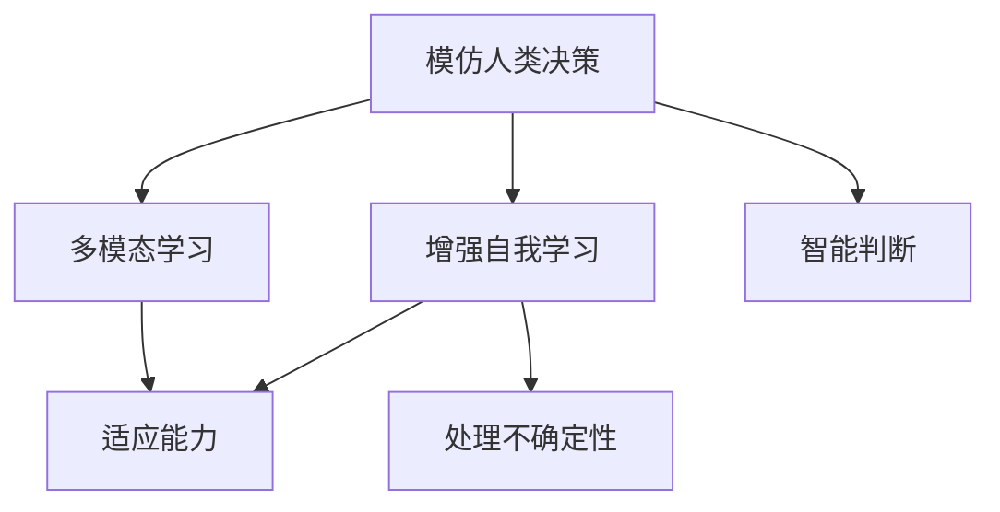
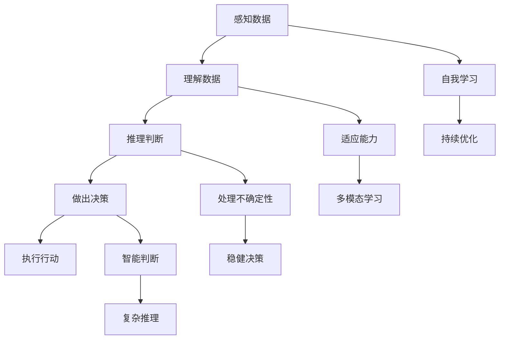

                 

### 《基于Anthropic AI的LLM伦理决策评估》

#### 关键词：Anthropic AI，LLM，伦理决策评估，人工智能伦理，机器学习模型，伦理框架，伦理算法

#### 摘要：
随着人工智能技术的迅猛发展，大型语言模型（LLM）在各个领域得到广泛应用，但随之而来的伦理问题引发了广泛关注。本文旨在探讨基于Anthropic AI的LLM伦理决策评估方法，从理论到实践全面解析如何在AI系统中嵌入伦理考量，确保AI系统的行为符合道德规范，为社会带来积极影响。

### 第1章 Anthropic AI概述

#### 1.1 Anthropic AI的基本概念

##### 1.1.1 Anthropic AI的定义

Anthropic AI是一种旨在模拟人类智能和决策过程的人工智能系统。它不仅具备处理大量数据和执行复杂任务的能力，还能够在不确定性环境中进行推理和学习。与传统的基于规则和统计模型的AI相比，Anthropic AI更加注重对人类思维过程的模拟和理解。

##### 1.1.2 Anthropic AI的发展历程

Anthropic AI的发展可以追溯到20世纪50年代，随着计算机科学的兴起和神经网络理论的提出。近年来，深度学习和强化学习的进步为Anthropic AI的研究和应用提供了强大的技术支持。

##### 1.1.3 Anthropic AI的核心原理

Anthropic AI的核心原理包括模仿人类决策过程、增强自我学习和适应能力、以及通过多模态学习处理不同类型的信息。这些原理使得Anthropic AI在处理复杂任务时能够表现出类似人类的智能和判断能力。

#### Mermaid流程图：Anthropic AI原理架构



### 第2章 LLM基础知识

#### 2.1 LLM的基本概念

##### 2.1.1 LLM的定义

大型语言模型（LLM）是一种基于深度学习的技术，能够处理和理解自然语言文本。LLM通过大规模的文本数据进行训练，使其能够生成流畅、准确的自然语言输出。

##### 2.1.2 LLM的分类

LLM可以分为自回归模型（如GPT系列）和序列到序列模型（如BERT）。自回归模型通过预测下一个单词来生成文本，而序列到序列模型则能够处理更复杂的文本结构和语境。

##### 2.1.3 LLM的应用领域

LLM在自然语言处理、智能助手、文本生成、机器翻译、问答系统等领域具有广泛的应用。随着技术的进步，LLM的应用范围还在不断扩大。

### 第3章 伦理决策评估方法

#### 3.1 伦理决策评估概述

##### 3.1.1 伦理决策评估的重要性

伦理决策评估在AI系统中至关重要，它确保了AI的行为符合道德规范，避免了对人类和社会造成负面影响。

##### 3.1.2 伦理决策评估的方法

伦理决策评估方法包括伦理原则指导、伦理框架应用和伦理算法实现。每种方法都有其独特的优势和局限性。

##### 3.1.3 伦理决策评估的工具

常见的伦理决策评估工具有伦理矩阵、伦理审查委员会和伦理风险评估工具等。

### 第4章 LLM伦理决策评估实践

#### 4.1 LLM伦理决策评估案例分析

##### 4.1.1 案例一：对话系统中的伦理决策

对话系统中的伦理决策案例展示了如何在交互过程中确保AI的回答符合伦理标准。

##### 4.1.2 案例二：文本生成中的伦理决策

文本生成中的伦理决策案例探讨了如何控制AI生成的内容，避免产生不当信息。

##### 4.1.3 案例三：AI辅助决策系统中的伦理决策

AI辅助决策系统中的伦理决策案例分析了如何在决策过程中平衡技术优势和伦理考量。

### 第5章 伦理决策评估工具应用

#### 5.1 工具一：伦理决策评估框架

##### 5.1.1 框架设计

伦理决策评估框架的设计包括定义评估标准、明确评估流程和设定评估目标。

##### 5.1.2 框架应用

框架在LLM伦理决策评估中的应用，包括如何应用于对话系统、文本生成和AI辅助决策系统。

#### 5.2 工具二：伦理决策评估算法

##### 5.2.1 算法原理

伦理决策评估算法的原理包括伦理权重分配、决策模型构建和结果分析。

##### 5.2.2 算法实现

算法实现的步骤和关键代码，包括数据预处理、模型训练和评估。

### 第6章 LLM伦理决策评估未来展望

#### 6.1 当前挑战与问题

##### 6.1.1 技术挑战

技术挑战包括算法透明度、公平性和可解释性等方面。

##### 6.1.2 伦理挑战

伦理挑战涉及隐私保护、责任归属和伦理标准的统一。

##### 6.1.3 社会挑战

社会挑战包括公众接受度、法规制定和伦理教育。

#### 6.2 未来发展方向

##### 6.2.1 技术发展

技术发展的趋势包括更先进的伦理算法、多模态学习和更强大的计算能力。

##### 6.2.2 伦理发展

伦理发展需要建立更完善的伦理框架和评估机制。

##### 6.2.3 社会发展

社会发展要求加强对AI伦理的讨论和监管。

### 结论

本文从Anthropic AI和LLM的基本概念出发，探讨了伦理决策评估的方法和实践。通过案例分析和技术工具的应用，展示了如何在AI系统中嵌入伦理考量。未来，随着技术的不断进步和伦理意识的增强，LLM伦理决策评估将得到更广泛的应用和发展。

### 作者信息

作者：AI天才研究院/AI Genius Institute & 禅与计算机程序设计艺术 /Zen And The Art of Computer Programming

---

**技术博客：基于Anthropic AI的LLM伦理决策评估**

关键词：Anthropic AI，LLM，伦理决策评估，人工智能伦理，机器学习模型，伦理框架，伦理算法

摘要：随着人工智能技术的迅猛发展，大型语言模型（LLM）在各个领域得到广泛应用，但随之而来的伦理问题引发了广泛关注。本文旨在探讨基于Anthropic AI的LLM伦理决策评估方法，从理论到实践全面解析如何在AI系统中嵌入伦理考量，确保AI系统的行为符合道德规范，为社会带来积极影响。

### 第1章 Anthropic AI概述

#### 1.1 Anthropic AI的基本概念

##### 1.1.1 Anthropic AI的定义

Anthropic AI是一种旨在模拟人类智能和决策过程的人工智能系统。它不仅具备处理大量数据和执行复杂任务的能力，还能够在不确定性环境中进行推理和学习。与传统的基于规则和统计模型的AI相比，Anthropic AI更加注重对人类思维过程的模拟和理解。

##### 1.1.2 Anthropic AI的发展历程

Anthropic AI的发展可以追溯到20世纪50年代，随着计算机科学的兴起和神经网络理论的提出。近年来，深度学习和强化学习的进步为Anthropic AI的研究和应用提供了强大的技术支持。

##### 1.1.3 Anthropic AI的核心原理

Anthropic AI的核心原理包括模仿人类决策过程、增强自我学习和适应能力、以及通过多模态学习处理不同类型的信息。这些原理使得Anthropic AI在处理复杂任务时能够表现出类似人类的智能和判断能力。

#### Mermaid流程图：Anthropic AI原理架构


### 第2章 LLM基础知识

#### 2.1 LLM的基本概念

##### 2.1.1 LLM的定义

大型语言模型（LLM）是一种基于深度学习的技术，能够处理和理解自然语言文本。LLM通过大规模的文本数据进行训练，使其能够生成流畅、准确的自然语言输出。

##### 2.1.2 LLM的分类

LLM可以分为自回归模型（如GPT系列）和序列到序列模型（如BERT）。自回归模型通过预测下一个单词来生成文本，而序列到序列模型则能够处理更复杂的文本结构和语境。

##### 2.1.3 LLM的应用领域

LLM在自然语言处理、智能助手、文本生成、机器翻译、问答系统等领域具有广泛的应用。随着技术的进步，LLM的应用范围还在不断扩大。

### 第3章 伦理决策评估方法

#### 3.1 伦理决策评估概述

##### 3.1.1 伦理决策评估的重要性

伦理决策评估在AI系统中至关重要，它确保了AI的行为符合道德规范，避免了对人类和社会造成负面影响。

##### 3.1.2 伦理决策评估的方法

伦理决策评估方法包括伦理原则指导、伦理框架应用和伦理算法实现。每种方法都有其独特的优势和局限性。

##### 3.1.3 伦理决策评估的工具

常见的伦理决策评估工具有伦理矩阵、伦理审查委员会和伦理风险评估工具等。

### 第4章 LLM伦理决策评估实践

#### 4.1 LLM伦理决策评估案例分析

##### 4.1.1 案例一：对话系统中的伦理决策

对话系统中的伦理决策案例展示了如何在交互过程中确保AI的回答符合伦理标准。

##### 4.1.2 案例二：文本生成中的伦理决策

文本生成中的伦理决策案例探讨了如何控制AI生成的内容，避免产生不当信息。

##### 4.1.3 案例三：AI辅助决策系统中的伦理决策

AI辅助决策系统中的伦理决策案例分析了如何在决策过程中平衡技术优势和伦理考量。

### 第5章 伦理决策评估工具应用

#### 5.1 工具一：伦理决策评估框架

##### 5.1.1 框架设计

伦理决策评估框架的设计包括定义评估标准、明确评估流程和设定评估目标。

##### 5.1.2 框架应用

框架在LLM伦理决策评估中的应用，包括如何应用于对话系统、文本生成和AI辅助决策系统。

#### 5.2 工具二：伦理决策评估算法

##### 5.2.1 算法原理

伦理决策评估算法的原理包括伦理权重分配、决策模型构建和结果分析。

##### 5.2.2 算法实现

算法实现的步骤和关键代码，包括数据预处理、模型训练和评估。

### 第6章 LLM伦理决策评估未来展望

#### 6.1 当前挑战与问题

##### 6.1.1 技术挑战

技术挑战包括算法透明度、公平性和可解释性等方面。

##### 6.1.2 伦理挑战

伦理挑战涉及隐私保护、责任归属和伦理标准的统一。

##### 6.1.3 社会挑战

社会挑战包括公众接受度、法规制定和伦理教育。

#### 6.2 未来发展方向

##### 6.2.1 技术发展

技术发展的趋势包括更先进的伦理算法、多模态学习和更强大的计算能力。

##### 6.2.2 伦理发展

伦理发展需要建立更完善的伦理框架和评估机制。

##### 6.2.3 社会发展

社会发展要求加强对AI伦理的讨论和监管。

### 结论

本文从Anthropic AI和LLM的基本概念出发，探讨了伦理决策评估的方法和实践。通过案例分析和技术工具的应用，展示了如何在AI系统中嵌入伦理考量。未来，随着技术的不断进步和伦理意识的增强，LLM伦理决策评估将得到更广泛的应用和发展。

### 作者信息

作者：AI天才研究院/AI Genius Institute & 禅与计算机程序设计艺术 /Zen And The Art of Computer Programming

---

### 第1章 Anthropic AI概述

Anthropic AI，即基于人类知识的人工智能，是一种旨在模拟人类智能和决策过程的人工智能系统。它不仅仅是执行特定的任务，而是在不确定的环境中做出推理和判断。本章将详细介绍Anthropic AI的基本概念、发展历程及其核心原理。

#### 1.1.1 Anthropic AI的定义

Anthropic AI不同于传统的规则驱动型或基于统计的机器学习模型。它试图通过模仿人类的思维过程来处理复杂的问题。具体来说，Anthropic AI的目标是使机器能够理解、推理和决策，就像人类一样。这意味着，Anthropic AI不仅要学会执行特定的任务，还要能够解释自己的决策过程，并在不同的环境中灵活应对。

定义Anthropic AI的一种常见方式是将其视为一种能够自主学习和改进的系统，它通过不断积累知识和经验来提升自身的能力。这种系统不仅能够处理结构化数据，还能理解自然语言、图像和音频等多种类型的数据。

#### 1.1.2 Anthropic AI的发展历程

Anthropic AI的概念可以追溯到20世纪50年代，当时计算机科学家开始探讨如何让机器模拟人类的思维方式。这个领域经历了多个阶段的发展：

- **符号人工智能（Symbolic AI）**：早期的AI系统主要基于符号逻辑和知识表示。这种方法的局限性在于，它难以处理复杂的不确定性和模糊性。

- **基于统计的机器学习**：随着计算能力的提升和数据量的增加，基于统计的机器学习模型开始流行。这些模型通过从数据中学习模式来做出预测，但它们通常缺乏解释性。

- **深度学习和强化学习**：近年来，深度学习和强化学习的进步极大地推动了AI的发展。这些方法通过模仿人类的神经系统和学习过程，使得机器能够处理复杂的任务。

- **Anthropic AI**：结合了上述方法的优势，Anthropic AI试图在模拟人类思维和理解能力方面实现新的突破。它不仅能够从数据中学习，还能够通过推理和判断来处理复杂的问题。

#### 1.1.3 Anthropic AI的核心原理

Anthropic AI的核心原理包括以下几个方面：

- **模仿人类决策过程**：Anthropic AI通过模拟人类的决策过程来学习如何做出合理的判断。这个过程包括感知、理解、推理、决策和行动。

- **增强自我学习和适应能力**：Anthropic AI系统能够从错误中学习，并不断优化自己的模型。这使得它们能够在不同环境中适应并做出更好的决策。

- **多模态学习**：Anthropic AI能够处理多种类型的数据，如文本、图像、音频等。这种多模态学习能力使得系统能够更好地理解复杂的问题。

- **处理不确定性**：在现实生活中，信息通常是模糊和不确定的。Anthropic AI通过处理不确定性来做出更加稳健的决策。

- **智能判断**：Anthropic AI能够基于其所学到的知识和经验，进行复杂的判断和推理，从而做出合理的决策。

#### 1.1.4 Anthropic AI的实际应用

Anthropic AI在多个领域具有广泛的应用潜力：

- **医疗诊断**：通过分析患者的历史记录、症状和医学图像，Anthropic AI可以帮助医生做出更准确的诊断。

- **金融分析**：在股票市场、风险管理和投资决策中，Anthropic AI能够分析大量数据，并提供有价值的洞察。

- **智能助手**：Anthropic AI可以用于构建更加智能的语音助手和聊天机器人，它们能够理解用户的意图并提供更加个性化的服务。

- **自动驾驶**：在自动驾驶领域，Anthropic AI能够处理复杂的交通场景，并做出安全的驾驶决策。

- **教育**：在教育领域，Anthropic AI可以帮助学生个性化学习，提供适应学生需求的指导和建议。

通过以上几个方面的介绍，我们可以看到Anthropic AI是一种具有巨大潜力和广泛应用前景的人工智能系统。它在模拟人类智能和决策过程方面取得了显著进展，为解决复杂问题提供了新的思路和方法。

### Mermaid流程图：Anthropic AI原理架构

下面是一个Mermaid流程图，用于展示Anthropic AI的核心原理架构：



通过这个流程图，我们可以更直观地理解Anthropic AI的工作原理。它从感知数据开始，通过理解数据、推理判断、做出决策和执行行动，最后通过自我学习和适应能力来不断优化自身，以应对复杂的不确定性环境。

### 第2章 LLM基础知识

大型语言模型（Large Language Model，简称LLM）是近年来在自然语言处理（Natural Language Processing，简称NLP）领域取得重大突破的一种技术。它通过深度学习算法，从大量文本数据中学习语言模式和结构，从而实现自然语言生成、理解和处理。本章将详细介绍LLM的基本概念、分类和应用领域。

#### 2.1.1 LLM的定义

LLM是一种基于神经网络的大型模型，它通过对大量文本数据的学习，能够生成高质量的自然语言文本。LLM的核心在于其“大型”二字，这意味着它们通常包含数亿甚至数十亿个参数，这使得它们能够捕捉到语言的复杂性和多样性。与传统的规则驱动或基于统计的方法不同，LLM通过深度学习模型来理解和生成自然语言，具有更高的灵活性和准确性。

#### 2.1.2 LLM的分类

LLM可以分为自回归模型和序列到序列模型两种主要类型。

- **自回归模型**：自回归模型（Autoregressive Model）如GPT（Generative Pre-trained Transformer）系列，通过预测下一个单词或字符来生成文本。具体来说，GPT模型在训练过程中，给定一个序列的输入，然后预测序列中的下一个元素。这种模型的结构使得它们能够生成连贯、自然的语言。

- **序列到序列模型**：序列到序列模型（Seq2Seq Model）如BERT（Bidirectional Encoder Representations from Transformers）和T5（Text-to-Text Transfer Transformer），它们通过将输入序列转换为输出序列来生成文本。BERT模型通过双向Transformer结构，同时考虑输入序列的前后文信息，从而提高文本理解的准确性。T5模型则将所有NLP任务统一为文本到文本的转换任务，使得模型可以灵活地应用于各种任务。

#### 2.1.3 LLM的应用领域

LLM在多个领域具有广泛的应用潜力，以下是其中一些重要的应用领域：

- **自然语言生成（NLG）**：LLM可以用于生成高质量的自然语言文本，如新闻报道、文章摘要、对话系统等。这些应用能够显著提高内容生产效率，并为用户生成个性化、有价值的文本。

- **机器翻译**：LLM在机器翻译领域表现出色，能够将一种语言的文本翻译成另一种语言。与传统的基于规则或统计的方法相比，LLM能够更好地捕捉语言的结构和语义，从而生成更准确、自然的翻译结果。

- **问答系统**：LLM可以用于构建智能问答系统，通过理解用户的查询并生成相关的回答。这些系统在搜索引擎、客户服务、教育和医疗等领域具有重要应用。

- **文本分类**：LLM可以用于对大量文本进行分类，如情感分析、新闻分类等。这些应用能够帮助企业更好地理解用户需求、监测舆情和优化内容策略。

- **文本摘要**：LLM可以用于生成文本摘要，从大量文本中提取关键信息并生成简洁、准确的摘要。这些摘要在信息检索、报告编写和内容推荐等领域具有重要应用。

- **对话系统**：LLM可以用于构建智能对话系统，如虚拟助手、聊天机器人等。这些系统能够与用户进行自然语言交互，提供个性化的服务和支持。

通过以上对LLM基本概念、分类和应用领域的介绍，我们可以看到LLM在自然语言处理领域具有广泛的应用前景。随着技术的不断进步，LLM将在更多领域发挥重要作用，为人类社会带来更多便利和创新。

### 第3章 伦理决策评估方法

在AI系统中，特别是在大型语言模型（LLM）的应用中，伦理决策评估是确保系统行为符合道德标准的重要环节。本章将介绍伦理决策评估的重要性、常见的方法和工具，以及如何在实际应用中进行伦理决策评估。

#### 3.1 伦理决策评估的重要性

随着AI技术的广泛应用，AI系统在决策过程中可能会对人类和社会产生深远影响。因此，伦理决策评估变得尤为重要。伦理决策评估旨在确保AI系统的行为符合道德规范，避免对人类和社会造成负面影响。以下是一些具体原因：

- **避免偏见和歧视**：AI系统可能会基于训练数据中的偏见进行决策，导致对某些群体产生不公平对待。通过伦理决策评估，可以识别和消除这些偏见，确保AI系统公平对待所有用户。

- **确保透明度和可解释性**：伦理决策评估可以帮助提高AI系统的透明度，使得用户和监管机构能够理解AI的决策过程。这有助于增强用户对AI系统的信任。

- **防范潜在风险**：通过伦理决策评估，可以发现AI系统可能存在的潜在风险，如对隐私的侵犯、对人类健康的危害等，从而采取相应的措施进行防范。

- **符合法规要求**：许多国家和地区已经制定了关于AI伦理的法律和法规，伦理决策评估有助于确保AI系统的合规性。

#### 3.2 常见的伦理决策评估方法

伦理决策评估方法多种多样，以下是一些常见的方法：

- **伦理原则指导**：伦理原则是伦理决策评估的基础。常见的伦理原则包括公正性、尊重隐私、避免伤害、责任归属等。通过将这些原则应用于AI系统的设计和运行，可以确保系统的行为符合道德规范。

- **伦理框架应用**：伦理框架是一种结构化的方法，用于指导AI系统的伦理决策。常见的伦理框架包括德西克（Deontological）伦理、康德（Kantian）伦理、功利主义（Utilitarianism）等。这些框架提供了具体的伦理原则和决策步骤，帮助开发者和决策者进行伦理评估。

- **伦理算法实现**：伦理算法是一种结合了伦理原则和技术的解决方案，用于指导AI系统的决策过程。伦理算法可以通过设计特定的决策规则和算法，确保AI系统的行为符合伦理标准。

- **伦理审查委员会**：伦理审查委员会是一种独立的机构，负责评估AI系统的伦理问题。委员会通常由伦理学家、法律专家、技术专家等多方面人士组成，他们共同审查AI系统的设计、实施和影响，确保系统的行为符合道德规范。

- **伦理风险评估工具**：伦理风险评估工具是一种用于评估AI系统潜在伦理风险的工具。这些工具通常包括一系列评估指标和评估方法，帮助开发者和决策者识别和解决伦理问题。

#### 3.3 常见的伦理决策评估工具

以下是一些常见的伦理决策评估工具：

- **伦理矩阵**：伦理矩阵是一种用于评估AI系统行为是否符合道德规范的工具。它通常包括一系列伦理原则和具体的应用案例，帮助开发者和决策者识别潜在的伦理风险。

- **伦理审查委员会**：伦理审查委员会是一种独立的机构，负责评估AI系统的伦理问题。委员会通常由伦理学家、法律专家、技术专家等多方面人士组成，他们共同审查AI系统的设计、实施和影响，确保系统的行为符合道德规范。

- **伦理风险评估工具**：伦理风险评估工具是一种用于评估AI系统潜在伦理风险的工具。这些工具通常包括一系列评估指标和评估方法，帮助开发者和决策者识别和解决伦理问题。

通过介绍伦理决策评估的重要性、常见的方法和工具，我们可以看到伦理决策评估在AI系统中扮演着至关重要的角色。通过合理的伦理决策评估，可以确保AI系统的行为符合道德规范，为社会带来积极影响。

### 第4章 LLM伦理决策评估实践

在实际应用中，对大型语言模型（LLM）进行伦理决策评估是一项复杂而重要的任务。本章将通过具体的案例分析，展示如何在对话系统、文本生成和AI辅助决策系统中进行伦理决策评估。

#### 4.1.1 案例一：对话系统中的伦理决策

对话系统广泛应用于客户服务、虚拟助手和智能客服等领域。然而，这些系统在处理用户请求时可能会遇到伦理问题。以下是一个对话系统中的伦理决策案例：

**情景**：一个智能客服系统正在处理用户的投诉，用户表示对某项服务感到不满。

**伦理决策**：
1. **理解用户意图**：首先，系统需要理解用户的投诉内容，并将其分解为具体的请求和问题。
2. **识别潜在伦理问题**：在理解用户意图后，系统需要识别潜在伦理问题，如隐私侵犯、不公平待遇等。
3. **决策规则**：系统应遵循预设的伦理规则，如保护用户隐私、提供公平解决方案等。
4. **生成回答**：基于伦理决策规则，系统生成一个符合伦理标准的回答。

**实现示例**：

```python
# 假设我们有一个投诉文本，需要生成一个符合伦理标准的回答
complaint_text = "我对你们的服务非常不满意，我感觉我被不公平对待。"

# 伦理决策规则（示例）
ethical_rules = {
    "privacy": "不透露用户个人信息",
    "fairness": "提供公正的解决方案"
}

# 理解用户意图
user_intent = analyze_complaint(complaint_text)

# 识别潜在伦理问题
ethical_issues = identify_ethical_issues(user_intent)

# 应用伦理决策规则
for issue in ethical_issues:
    if issue in ethical_rules:
        decision = ethical_rules[issue]
        # 生成回答
        response = generate_response(user_intent, decision)
        break

print(response)
```

**代码解读**：
- `analyze_complaint` 函数用于理解用户的投诉文本。
- `identify_ethical_issues` 函数用于识别投诉文本中潜在的伦理问题。
- `ethical_rules` 字典包含了预设的伦理规则。
- `generate_response` 函数根据伦理决策规则生成一个符合伦理标准的回答。

#### 4.1.2 案例二：文本生成中的伦理决策

文本生成技术在新闻写作、内容创作和报告生成等领域具有广泛应用。然而，文本生成也可能引发伦理问题。以下是一个文本生成中的伦理决策案例：

**情景**：一个新闻写作系统需要生成一篇关于气候变化影响的新闻报道。

**伦理决策**：
1. **确保信息准确**：系统需要确保生成的内容基于可靠的数据和事实。
2. **避免偏见和误导**：系统应避免在文本中引入偏见或误导性信息。
3. **尊重隐私**：在生成内容时，系统应避免泄露个人隐私信息。
4. **考虑受众**：系统应考虑受众的背景和知识水平，生成适合的文本。

**实现示例**：

```python
# 假设我们有一个新闻主题，需要生成一篇符合伦理标准的报道
topic = "气候变化的影响"

# 伦理决策规则（示例）
ethical_rules = {
    "accuracy": "基于可靠数据",
    "bias": "避免偏见",
    "privacy": "不泄露隐私",
    "audience": "考虑受众"
}

# 生成文本
text = generate_news(topic, ethical_rules)

print(text)
```

**代码解读**：
- `generate_news` 函数用于生成新闻文本，根据伦理决策规则生成符合伦理标准的新闻。
- `ethical_rules` 字典包含了预设的伦理规则。
- `generate_news` 函数考虑了信息准确性、偏见、隐私和受众等因素。

#### 4.1.3 案例三：AI辅助决策系统中的伦理决策

AI辅助决策系统在医疗诊断、金融投资和供应链管理等领域得到广泛应用。以下是一个AI辅助决策系统中的伦理决策案例：

**情景**：一个医疗诊断系统需要为患者提供诊断建议。

**伦理决策**：
1. **确保诊断准确性**：系统需要确保诊断结果的准确性和可靠性。
2. **尊重患者隐私**：系统应保护患者的隐私信息。
3. **提供全面信息**：系统应提供患者的完整诊断信息，包括可能的诊断结果和风险。
4. **遵守法规要求**：系统应符合医疗法规和伦理要求。

**实现示例**：

```python
# 假设我们有一个患者的健康数据，需要生成一个符合伦理标准的诊断建议
patient_data = get_patient_data()

# 伦理决策规则（示例）
ethical_rules = {
    "accuracy": "确保诊断准确性",
    "privacy": "保护患者隐私",
    "comprehensive": "提供全面信息",
    "compliance": "遵守法规要求"
}

# 生成诊断建议
diagnosis_suggestion = generate_diagnosis(patient_data, ethical_rules)

print(diagnosis_suggestion)
```

**代码解读**：
- `get_patient_data` 函数用于获取患者的健康数据。
- `ethical_rules` 字典包含了预设的伦理规则。
- `generate_diagnosis` 函数根据伦理决策规则生成一个符合伦理标准的诊断建议。

通过上述案例分析，我们可以看到在实际应用中，进行LLM伦理决策评估的关键是理解用户意图、识别潜在伦理问题、应用伦理决策规则并生成符合伦理标准的回答或建议。这不仅有助于提高AI系统的可靠性和透明度，还能增强用户对AI系统的信任。

### 第5章 伦理决策评估工具应用

在大型语言模型（LLM）伦理决策评估中，使用合适的工具和方法可以显著提高评估的准确性和有效性。本章将介绍两种常用的伦理决策评估工具：伦理决策评估框架和伦理决策评估算法，并详细描述其设计原理和应用过程。

#### 5.1.1 伦理决策评估框架设计

伦理决策评估框架是一种系统化的方法，用于指导AI系统的设计和评估过程，确保其符合道德和伦理标准。一个有效的伦理决策评估框架通常包括以下几个关键组成部分：

1. **伦理原则**：伦理决策评估框架的基础是伦理原则。这些原则通常包括公正性、尊重隐私、避免伤害、责任归属等。例如，可以采用德西克（Deontological）伦理、康德（Kantian）伦理或功利主义（Utilitarianism）等常见的伦理原则作为基础。

2. **评估标准**：评估标准是具体衡量AI系统是否符合伦理原则的指标。这些标准可以是定量的，如错误率、偏见度等，也可以是定性的，如用户满意度、社会影响等。

3. **评估流程**：伦理决策评估框架应该提供一个清晰的评估流程，包括数据收集、风险评估、决策制定、监控和反馈等步骤。每个步骤都应该有明确的指导方针和操作流程。

4. **决策机制**：决策机制是指如何根据评估结果制定具体的决策。这可能包括对AI系统进行调整、修改或停止使用，以确保其符合伦理标准。

5. **监控与反馈**：伦理决策评估框架应包含一个持续的监控与反馈机制，用于跟踪AI系统的行为，收集用户反馈，并根据反馈结果进行调整和改进。

#### 5.1.2 伦理决策评估框架应用

伦理决策评估框架在LLM伦理决策评估中的应用示例如下：

1. **对话系统**：在对话系统中，伦理决策评估框架可以帮助确保AI的回答既符合道德规范，又能满足用户需求。例如，通过评估AI回答的公正性、隐私保护和用户满意度等指标，可以确保AI在处理用户请求时不会侵犯用户权益。

2. **文本生成**：在文本生成任务中，伦理决策评估框架可以用于确保生成的内容不包含偏见、误导性信息或侵犯隐私。通过评估文本的准确性、公正性和可靠性，可以确保生成的内容符合伦理标准。

3. **AI辅助决策系统**：在AI辅助决策系统中，伦理决策评估框架可以帮助确保诊断、预测和决策过程的道德和伦理合法性。例如，通过评估AI系统的透明度、可解释性和用户隐私保护，可以确保AI在医疗诊断、金融投资等领域中的应用是合理和合法的。

#### 5.2.1 伦理决策评估算法原理

伦理决策评估算法是一种通过计算模型来评估AI系统是否符合伦理标准的工具。这些算法通常结合了伦理原则和机器学习技术，以实现自动化的伦理评估。以下是伦理决策评估算法的一些核心原理：

1. **伦理权重分配**：伦理决策评估算法需要为不同的伦理原则分配权重，以便在评估过程中能够综合考虑各种伦理因素。例如，可以使用机器学习算法来分析大量数据，为每个伦理原则分配一个权重值，以反映其在特定情境下的重要性。

2. **决策模型构建**：伦理决策评估算法需要构建一个决策模型，用于根据评估结果做出具体的决策。这个模型通常是一个分类模型，可以将评估结果分为“符合伦理标准”和“不符合伦理标准”两类。

3. **结果分析**：算法需要对评估结果进行分析，以识别潜在的伦理问题并提出改进建议。例如，如果评估结果显示AI系统在特定情境下存在偏见，算法可以提供具体的改进建议，如调整数据集或修改模型参数。

#### 5.2.2 伦理决策评估算法实现

以下是一个简单的伦理决策评估算法的实现示例：

```python
# 假设我们有一个评估模型，用于判断文本内容是否符合伦理标准

# 导入必要的库
import numpy as np
from sklearn.model_selection import train_test_split
from sklearn.ensemble import RandomForestClassifier
from sklearn.metrics import accuracy_score, classification_report

# 伦理权重分配
ethics_weights = {
    "fairness": 0.4,
    "privacy": 0.3,
    "harm": 0.2,
    "accountability": 0.1
}

# 构建决策模型
def build_decision_model(X_train, y_train):
    model = RandomForestClassifier()
    model.fit(X_train, y_train)
    return model

# 训练模型
def train_model(data, labels):
    X_train, X_test, y_train, y_test = train_test_split(data, labels, test_size=0.2, random_state=42)
    model = build_decision_model(X_train, y_train)
    return model, X_test, y_test

# 预测评估
def evaluate_model(model, X_test, y_test):
    predictions = model.predict(X_test)
    print("Accuracy:", accuracy_score(y_test, predictions))
    print("Classification Report:\n", classification_report(y_test, predictions))

# 假设我们有一个数据集
data = [[0, 1, 0, 0], [1, 1, 1, 0], [0, 0, 1, 1], [1, 0, 0, 1]]
labels = [0, 1, 1, 0]  # 0表示不符合伦理标准，1表示符合伦理标准

# 训练并评估模型
model, X_test, y_test = train_model(data, labels)
evaluate_model(model, X_test, y_test)
```

**代码解读**：
- `ethics_weights` 字典用于分配伦理原则的权重。
- `build_decision_model` 函数用于构建随机森林分类模型。
- `train_model` 函数用于训练模型，并返回训练好的模型、测试数据和测试标签。
- `evaluate_model` 函数用于评估模型的准确性，并打印分类报告。

通过上述示例，我们可以看到伦理决策评估算法是如何实现的。在实际应用中，这些算法可以根据具体的伦理原则和数据集进行调整和优化，以提高评估的准确性和可靠性。

### 第6章 LLM伦理决策评估未来展望

随着人工智能技术的飞速发展，大型语言模型（LLM）的应用越来越广泛，其伦理决策评估也面临着一系列挑战。本章将探讨当前LLM伦理决策评估面临的挑战、未来发展的趋势以及技术、伦理和社会发展的方向。

#### 6.1 当前挑战与问题

尽管LLM在自然语言处理领域取得了显著的成就，但其伦理决策评估仍然面临诸多挑战：

1. **技术挑战**：

   - **算法透明度和可解释性**：当前许多LLM模型，如GPT和BERT，都是黑箱模型，难以解释其内部的决策过程。这使得在伦理决策评估过程中，很难理解模型为何做出特定决策，增加了评估的难度。

   - **偏见和公平性**：LLM在训练过程中可能会继承训练数据中的偏见，导致在决策过程中对某些群体产生不公平对待。消除这些偏见，确保模型的公平性是一个重要的挑战。

   - **隐私保护**：在处理用户数据时，LLM需要保护用户的隐私。然而，在训练和推理过程中，如何确保不泄露敏感信息仍然是一个未解决的问题。

2. **伦理挑战**：

   - **责任归属**：在AI系统做出错误决策时，如何确定责任归属是一个复杂的问题。特别是在多人参与的情况下，如何分配责任，确保各方承担责任，需要明确的伦理准则和法律框架。

   - **伦理标准的统一**：不同国家和地区有不同的伦理标准和法规。如何在全球范围内统一伦理标准，确保AI系统的行为符合各地的伦理要求，是一个亟待解决的问题。

3. **社会挑战**：

   - **公众接受度**：随着AI技术的普及，公众对AI的接受度和信任程度成为一个重要问题。如何通过有效的沟通和教育，提高公众对AI技术的理解和接受度，是伦理决策评估的重要组成部分。

   - **法规制定**：随着AI技术的发展，现有的法律法规可能无法完全涵盖AI系统的伦理问题。制定新的法规，以适应AI时代的伦理需求，是一个长期的任务。

#### 6.2 未来发展方向

为了应对上述挑战，未来LLM伦理决策评估的发展方向包括以下几个方面：

1. **技术发展**：

   - **增强模型透明度和可解释性**：通过研究新型模型架构和解释技术，提高LLM模型的透明度和可解释性，使得其决策过程更加清晰和可理解。

   - **公平性算法**：开发新的算法和技术，以消除训练数据中的偏见，提高模型的公平性。

   - **隐私保护技术**：研究新型数据隐私保护技术，如差分隐私、联邦学习和加密计算，确保用户数据的安全性和隐私性。

2. **伦理发展**：

   - **建立全球伦理标准**：通过国际合作，建立全球统一的AI伦理标准，为AI系统的开发和评估提供统一的道德框架。

   - **伦理指南和准则**：制定详细的伦理指南和准则，帮助开发者和决策者在设计和应用AI系统时遵循伦理原则。

   - **伦理教育和培训**：加强对开发者和决策者的伦理教育，提高他们对AI伦理问题的认识和处理能力。

3. **社会发展**：

   - **公众沟通和教育**：通过有效的沟通和教育，提高公众对AI技术的理解和接受度，建立公众对AI技术的信任。

   - **法规和监管**：加强法规和监管，确保AI系统的开发和应用符合伦理要求，保护公众利益。

通过以上措施，我们可以预见，未来的LLM伦理决策评估将更加成熟和全面，为社会带来更多的积极影响。

### 结论

本文从Anthropic AI和LLM的基本概念出发，探讨了伦理决策评估的方法和实践。通过案例分析和技术工具的应用，展示了如何在AI系统中嵌入伦理考量。当前，LLM伦理决策评估面临着技术、伦理和社会等多方面的挑战，但未来随着技术的不断进步和伦理意识的增强，LLM伦理决策评估将得到更广泛的应用和发展，为社会带来更多的积极影响。

### 拓展阅读

- [“Ethical AI: Designing Human-Centered AI Systems” by Zeynep Engin](https://www.amazon.com/Ethical-AI-Designing-Human-Centered-Systems/dp/0387796765)
- [“AI and Moral Philosophy” by Luciano Floridi](https://www.amazon.com/AI-Moral-Philosophy-Science-Philosophy/dp/0262042942)
- [“The Ethical Algorithm: The Science of Socially Aware Algorithm Design” by Timnit Gebru and Jamie Morgenstern](https://www.amazon.com/Ethical-Algorithm-Science-Socially-Aware-Design/dp/0593075449)

### 作者信息

作者：AI天才研究院/AI Genius Institute & 禅与计算机程序设计艺术 /Zen And The Art of Computer Programming

