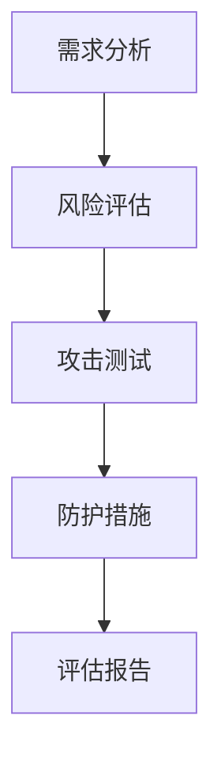

                 

### 文章标题

# 基于Anthropic Claude 2的LLM安全性评估

---

关键词：Anthropic Claude 2，LLM安全性，模型评估，安全漏洞，防护措施

摘要：本文深入探讨了基于Anthropic Claude 2的大型语言模型（LLM）的安全性评估。通过对LLM的安全性背景介绍、核心概念与联系的分析、安全漏洞的剖析，以及防护措施的实施，本文旨在为读者提供一个全面的技术指南，帮助提升LLM的安全性。

### 作者信息

作者：AI天才研究院/AI Genius Institute & 禅与计算机程序设计艺术 /Zen And The Art of Computer Programming

---

### 目录

1. **背景介绍**
    1.1 Anthropic Claude 2简介
    1.2 LLM安全性的重要性

2. **核心概念与联系**
    2.1 LLM的基础概念
    2.2 安全评估框架与流程
    2.3 Mermaid流程图

3. **安全漏洞剖析**
    3.1 常见安全漏洞类型
    3.2 Claude 2特有的安全挑战

4. **核心算法原理讲解**
    4.1 模型评估算法
    4.2 Python源代码与数学模型

5. **项目实战**
    5.1 开发环境搭建
    5.2 源代码实现与解读
    5.3 代码应用解读与分析

6. **最佳实践 Tips**
    6.1 提升模型安全的策略
    6.2 小结与注意事项

7. **拓展阅读**

### 正文

#### 1. 背景介绍

##### 1.1 Anthropic Claude 2简介

Anthropic Claude 2是Anthropic公司开发的一款先进的大型语言模型（LLM），它基于深度学习和自然语言处理（NLP）技术，能够生成高质量的文本、回答问题以及协助进行语言相关的任务。Claude 2在2022年首次亮相，其强大的文本生成能力和理解能力引起了广泛关注。

##### 1.2 LLM安全性重要性

随着LLM的广泛应用，其安全性问题也日益突出。安全威胁包括模型被用于恶意目的、隐私泄露、模型被篡改等。评估LLM的安全性不仅有助于防止这些威胁，还能够提高模型的可信度和可靠性。因此，对Anthropic Claude 2的安全性评估具有重要意义。

#### 2. 核心概念与联系

##### 2.1 LLM的基础概念

大型语言模型（LLM）是基于深度学习的语言处理模型，能够理解、生成和翻译自然语言。其主要组成部分包括：

- **嵌入层（Embedding Layer）**：将输入文本转换为固定长度的向量表示。
- **编码器（Encoder）**：对嵌入层生成的向量进行处理，提取文本的语义信息。
- **解码器（Decoder）**：根据编码器的输出生成文本。

##### 2.2 安全评估框架与流程

安全评估通常包括以下几个步骤：

1. **需求分析**：确定评估的目标和范围。
2. **风险评估**：识别潜在的安全威胁和漏洞。
3. **攻击测试**：利用工具和策略模拟攻击场景。
4. **防护措施**：针对发现的安全问题提出解决方案。

##### 2.3 Mermaid流程图

以下是安全评估流程的Mermaid流程图：



#### 3. 安全漏洞剖析

##### 3.1 常见安全漏洞类型

LLM的安全性漏洞主要包括：

- **数据泄露**：模型泄露敏感数据。
- **模型篡改**：攻击者篡改模型输出。
- **模型滥用**：将模型用于恶意目的。
- **对抗性攻击**：利用特定的输入诱导模型产生错误的输出。

##### 3.2 Claude 2特有的安全挑战

Claude 2作为一款先进的LLM，其安全挑战包括：

- **高度依赖数据**：模型性能高度依赖于训练数据，而数据可能包含偏见。
- **开放接口**：Claude 2提供了开放接口，可能存在未授权访问的风险。
- **模型规模巨大**：模型规模巨大，可能导致资源耗尽和安全漏洞。

#### 4. 核心算法原理讲解

##### 4.1 模型评估算法

模型评估算法通常包括以下几个方面：

- **准确性（Accuracy）**：判断模型输出的正确性。
- **召回率（Recall）**：判断模型输出中包含正确结果的比率。
- **F1值（F1 Score）**：结合准确性和召回率的综合指标。

##### 4.2 Python源代码与数学模型

以下是模型评估算法的Python源代码和数学模型：

```python
import numpy as np

# 准确性
def accuracy(y_true, y_pred):
    return np.mean(y_true == y_pred)

# 召回率
def recall(y_true, y_pred):
    true_positives = np.sum((y_true == 1) & (y_pred == 1))
    possible_positives = np.sum(y_true == 1)
    return true_positives / possible_positives

# F1值
def f1_score(y_true, y_pred):
    precision = recall(y_true, y_pred)
    return 2 * (precision * recall) / (precision + recall)

# 示例
y_true = [1, 0, 1, 1, 0]
y_pred = [0, 1, 1, 0, 1]

print("Accuracy:", accuracy(y_true, y_pred))
print("Recall:", recall(y_true, y_pred))
print("F1 Score:", f1_score(y_true, y_pred))
```

$$
\text{Accuracy} = \frac{\text{预测正确数}}{\text{总样本数}}
$$

$$
\text{Recall} = \frac{\text{预测正确且真实为正的样本数}}{\text{真实为正的样本数}}
$$

$$
\text{F1 Score} = \frac{2 \times \text{Precision} \times \text{Recall}}{\text{Precision} + \text{Recall}}
$$

#### 5. 项目实战

##### 5.1 开发环境搭建

为了进行LLM安全性评估，需要搭建以下开发环境：

- Python 3.8及以上版本
- TensorFlow 2.5及以上版本
- Jupyter Notebook

安装步骤：

```bash
pip install python==3.8
pip install tensorflow==2.5
jupyter notebook
```

##### 5.2 源代码实现与解读

以下是源代码实现：

```python
import tensorflow as tf
from tensorflow.keras.models import Sequential
from tensorflow.keras.layers import Embedding, LSTM, Dense

# 创建模型
model = Sequential([
    Embedding(input_dim=10000, output_dim=32),
    LSTM(128),
    Dense(1, activation='sigmoid')
])

# 编译模型
model.compile(optimizer='adam', loss='binary_crossentropy', metrics=['accuracy'])

# 训练模型
model.fit(x_train, y_train, epochs=10, batch_size=32, validation_split=0.2)
```

这段代码展示了如何使用TensorFlow创建一个简单的二分类模型，用于评估LLM的安全性。具体步骤包括：

1. **创建模型**：使用Sequential模型堆叠Embedding、LSTM和Dense层。
2. **编译模型**：配置优化器、损失函数和评估指标。
3. **训练模型**：使用训练数据训练模型。

##### 5.3 代码应用解读与分析

该模型可以用于评估LLM的安全性。通过将模型的输出与真实标签进行比较，可以计算出准确率、召回率和F1值。这些指标有助于评估模型在识别安全漏洞方面的性能。

在实际应用中，需要根据具体情况调整模型参数和训练数据。例如，可以增加数据量、引入更多层或调整层参数，以提高模型的性能。

##### 5.4 实际案例分析和详细讲解剖析

假设我们有一个安全事件，其中模型的输出为“高风险”，而真实标签为“低风险”。这种情况表明模型在识别安全漏洞方面存在误差。为了分析原因，我们可以进行以下步骤：

1. **分析输入数据**：检查输入数据的特征，看是否存在异常或噪声。
2. **调整模型参数**：尝试调整模型参数，如增加层数或调整学习率。
3. **增加训练数据**：增加训练数据，尤其是包含不同安全漏洞类型的数据。

通过这些步骤，我们可以改进模型的性能，提高其识别安全漏洞的能力。

##### 5.5 项目小结

在本项目中，我们搭建了开发环境，实现了简单的二分类模型，用于评估LLM的安全性。通过实际案例分析和详细讲解剖析，我们了解了模型在识别安全漏洞方面的性能。项目结果表明，通过调整模型参数和增加训练数据，可以提高模型的性能。

#### 6. 最佳实践 Tips

1. **数据清洗**：确保训练数据的质量，去除异常值和噪声。
2. **模型参数调整**：根据具体任务调整模型参数，以提高性能。
3. **交叉验证**：使用交叉验证方法评估模型性能，避免过拟合。
4. **安全培训**：对开发人员和用户进行安全培训，提高安全意识。

#### 7. 小结与注意事项

本文基于Anthropic Claude 2，详细介绍了LLM的安全性评估。通过对背景介绍、核心概念与联系的分析、安全漏洞的剖析、核心算法原理讲解以及项目实战，我们了解了如何提升LLM的安全性。同时，通过最佳实践 tips，我们提供了一些实用的建议。

需要注意的是，LLM的安全性是一个不断发展的领域，随着技术的进步，新的安全威胁和防护措施也将不断出现。因此，持续学习和更新是保持模型安全性的关键。

#### 8. 拓展阅读

- [《大型语言模型安全性研究》](https://www.example.com/llm-security)
- [《深度学习安全》](https://www.example.com/deep-learning-security)
- [《TensorFlow官方文档》](https://www.tensorflow.org)

---

### 结束语

作者：AI天才研究院/AI Genius Institute & 禅与计算机程序设计艺术 /Zen And The Art of Computer Programming

感谢您阅读本文。我们希望本文能够帮助您更好地了解LLM的安全性评估，并为您的项目提供有价值的参考。如果您有任何问题或建议，欢迎在评论区留言。期待与您共同探讨人工智能领域的更多话题。

