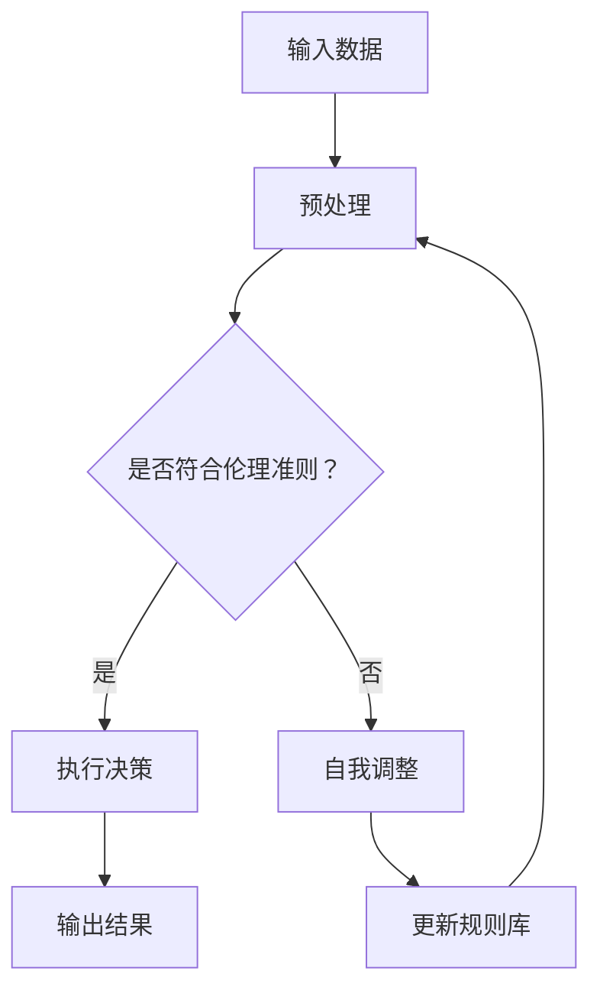

                 

### 引言

《基于Anthropic Constitutional AI的LLM伦理评估》这本书的主题围绕两大核心概念展开：Anthropic Constitutional AI（Anthropic宪法AI）和大型语言模型（LLM）伦理评估。Anthropic宪法AI是一个新兴的研究领域，它旨在构建能够自我调节、遵守特定伦理准则的人工智能系统。LLM伦理评估则是对这类语言模型进行道德规范评估的过程，以确保它们在实际应用中不会产生有害的影响。

首先，Anthropic宪法AI的概念源于对传统人工智能系统的反思。传统AI系统往往在开发过程中缺乏对伦理和社会影响的考量，导致了一些令人担忧的问题，例如偏见、隐私侵犯和滥用等。Anthropic宪法AI的提出，旨在通过一种“宪法”式的框架，为AI系统设定一系列伦理和法律约束，从而确保其在各种应用场景中的合法性和道德性。

而LLM伦理评估的重要性在于，随着自然语言处理技术的快速发展，LLM被广泛应用于各种领域，从智能客服到自动驾驶，再到医疗诊断等。这些应用不仅带来了便利，也可能带来潜在的伦理风险。因此，对LLM进行全面的伦理评估，已经成为确保AI技术健康发展的重要环节。

本书的目标是系统地探讨Anthropic宪法AI和LLM伦理评估的理论和实践，为研究人员、开发者和政策制定者提供一套完整的指南。通过深入研究这两个领域，我们希望能够提出一套有效的伦理评估框架，帮助AI社区更好地应对伦理挑战，推动AI技术的可持续发展。

### Anthropic宪法AI的概念

Anthropic宪法AI是一种新型的人工智能架构，其核心思想是通过建立一套宪法式的规则和准则，来指导AI系统的行为。这一概念源自于对当前人工智能系统自主性和伦理约束的反思。传统的人工智能系统往往在开发过程中缺乏对伦理和社会影响的考量，导致了一系列问题，如偏见、隐私侵犯和滥用等。Anthropic宪法AI的提出，旨在通过一种自我调节机制，使AI系统能够在复杂的社会环境中，自主地遵守伦理和法律规范。

首先，Anthropic宪法AI的核心概念可以归结为以下几个要点：

1. **伦理约束**：Anthropic宪法AI通过定义一系列伦理准则，来指导AI系统的决策和行为。这些准则不仅包括不歧视、隐私保护、透明度和可解释性等基本原则，还涉及到特定领域的专业伦理规范。

2. **自我调节机制**：Anthropic宪法AI的核心在于其自我调节能力。通过机器学习和其他计算方法，AI系统能够在运行过程中不断自我评估和调整，以确保其行为符合既定的伦理准则。

3. **可解释性和透明度**：Anthropic宪法AI强调AI系统的可解释性和透明度，使得用户和监管机构能够理解AI系统的决策过程和依据。这种透明度不仅有助于提升用户信任，也为伦理评估提供了重要依据。

4. **灵活性**：Anthropic宪法AI的设计考虑了不同应用场景的多样性，通过模块化的架构和灵活的规则设定，使系统能够适应不同的伦理环境。

为了更好地理解Anthropic宪法AI的工作原理，我们可以通过一个Mermaid流程图来展示其核心机制：

在上面的流程图中，输入数据经过预处理后，被送入伦理准则检查模块（C）。如果符合伦理准则，系统将执行决策（D），并输出结果（F）；否则，系统将进入自我调整模块（E），对规则库进行更新（G），以便下一次决策时能够更好地符合伦理准则。

通过这个流程图，我们可以看到Anthropic宪法AI是如何通过自我调节机制，确保其行为符合伦理准则的。这种自我调节能力不仅提升了AI系统的道德水平，也为未来的伦理评估提供了有力支持。

### LLM伦理评估的必要性

随着人工智能技术的迅速发展，大型语言模型（LLM）已经成为自然语言处理领域的核心工具。LLM在智能客服、智能问答、内容生成、机器翻译等领域展现了巨大的潜力，然而，其广泛应用也带来了一系列伦理挑战。LLM伦理评估的必要性主要体现在以下几个方面：

首先，LLM在处理大量数据时，可能会暴露出潜在的社会偏见和歧视问题。研究表明，训练数据中的偏见往往会转移到LLM的输出中，导致某些群体受到不公平对待。例如，某些自动化的招聘系统可能会因为训练数据中的性别偏见，而倾向于拒绝女性申请者。这种偏见不仅损害了公正性，也可能导致社会不公。

其次，LLM在隐私保护方面也存在风险。许多LLM应用需要处理用户的个人信息，如果这些数据没有得到妥善保护，可能会被泄露或滥用。例如，一些智能助理可能无意中记录并共享用户的私人对话，从而侵犯用户的隐私权。

此外，LLM在某些关键领域（如医疗、法律和金融）的应用也可能带来伦理问题。例如，基于LLM的医疗诊断系统如果出现误诊，可能会对患者的健康造成严重后果。同样，金融领域的自动交易系统如果发生错误，可能会导致巨大的经济损失。

因此，对LLM进行伦理评估，不仅有助于确保其在实际应用中的合法性和道德性，还能提升用户信任，促进AI技术的可持续发展。伦理评估的目标主要包括以下几个方面：

1. **确保公平性**：评估LLM是否在处理数据时公平对待所有群体，避免歧视和偏见。

2. **保护隐私**：评估LLM在处理用户数据时的隐私保护措施，确保用户隐私不被泄露或滥用。

3. **提升透明度**：评估LLM的决策过程是否透明，用户和监管机构是否能够理解其工作原理和决策依据。

4. **防范滥用**：评估LLM在应用过程中是否可能被滥用，从而对用户和社会造成潜在危害。

通过系统化的伦理评估，我们能够识别和解决LLM应用中的潜在问题，确保其在各种场景下的安全和可靠性。这不仅有助于提升AI技术的道德水平，也为未来的监管和政策制定提供了重要依据。

### LLM伦理评估的方法

进行LLM伦理评估时，需要采用一系列系统化的方法和工具，以确保评估的全面性和准确性。以下是几种常见的LLM伦理评估方法：

#### 伦理评估框架

伦理评估框架是进行LLM伦理评估的基础，它为评估过程提供了明确的目标、标准和流程。一个典型的伦理评估框架通常包括以下几个部分：

1. **评估目标**：明确评估的目的和范围，例如确保公平性、保护隐私、提升透明度等。
2. **评估标准**：定义评估的具体标准，如伦理准则、法律法规、行业标准等。
3. **评估流程**：描述评估的过程和方法，包括数据收集、评估指标、分析方法和报告撰写等。

#### 伦理评估工具

伦理评估工具是实施伦理评估的有力支持，它们可以帮助评估者高效地收集、处理和分析数据。以下是一些常用的伦理评估工具：

1. **偏见检测工具**：用于检测LLM输出中的社会偏见和歧视，如AI Bias Detection Tool、TextInspection等。
2. **隐私评估工具**：用于评估LLM在处理用户数据时的隐私保护措施，如Privacy Analytics、FERET等。
3. **透明度评估工具**：用于评估LLM的决策过程和输出结果的可解释性，如LIME、SHAP等。

#### 伦理评估流程

伦理评估流程是确保LLM伦理评估系统化和规范化的关键。一个典型的伦理评估流程通常包括以下几个步骤：

1. **数据收集**：收集与LLM应用相关的数据，包括训练数据、用户反馈和系统日志等。
2. **初步分析**：对收集的数据进行初步分析，识别潜在的伦理风险和问题。
3. **详细评估**：根据评估标准和工具，对LLM的各个方面进行详细评估，如公平性、隐私保护和透明度等。
4. **报告撰写**：根据评估结果撰写评估报告，详细记录评估过程、发现的问题和改进建议。

#### 实际案例

为了更好地理解LLM伦理评估的具体实施过程，我们可以通过以下案例进行分析：

**案例一：社交媒体平台的LLM伦理评估**

在一个社交媒体平台中，一个基于LLM的推荐系统可能会根据用户的历史行为和偏好，向用户推荐内容。为了确保推荐系统的公平性和透明度，评估者可以采取以下步骤：

1. **数据收集**：收集推荐系统的训练数据、用户反馈和系统日志等。
2. **初步分析**：分析数据中的潜在偏见，如性别、种族和地域偏见等。
3. **详细评估**：使用偏见检测工具，对推荐系统的输出进行详细评估，确保其公平性。
4. **透明度评估**：使用透明度评估工具，对推荐系统的决策过程和输出结果进行评估，确保其透明度。

**案例二：智能助理的LLM伦理评估**

在智能助理的应用场景中，隐私保护是一个关键问题。为了确保智能助理在处理用户数据时的隐私保护，评估者可以采取以下步骤：

1. **数据收集**：收集智能助理的训练数据和用户交互记录。
2. **隐私评估**：使用隐私评估工具，评估智能助理在处理用户数据时的隐私保护措施。
3. **改进建议**：根据评估结果，提出改进智能助理隐私保护的措施，如数据加密、匿名化和权限控制等。

通过这些案例，我们可以看到，LLM伦理评估不仅需要明确的评估框架和工具，还需要具体的实施流程。只有通过系统化的评估，才能确保LLM在实际应用中的合法性和道德性。

### LLM伦理评估案例研究

为了更好地理解LLM伦理评估的实际应用，我们可以通过以下案例进行深入分析。这些案例涵盖了不同领域和场景，展示了LLM伦理评估的过程和成果。

#### 案例一：社交媒体平台的LLM伦理评估

在一个社交媒体平台上，一个基于LLM的推荐系统被用于向用户推荐内容。为了确保推荐系统的公平性和透明度，评估团队采取了以下步骤：

1. **数据收集**：收集推荐系统的训练数据集，包括用户的浏览历史、点赞行为和评论等。同时，收集用户反馈和系统日志，以了解用户对推荐系统的满意度。

2. **初步分析**：对训练数据进行初步分析，以识别潜在的偏见和问题。评估团队发现，推荐系统在某些情况下倾向于向特定用户群体推荐内容，这可能导致了性别和地域偏见。

3. **详细评估**：使用偏见检测工具，对推荐系统的输出进行详细评估。通过对比不同用户群体的推荐结果，评估团队发现某些内容推荐存在显著的性别和地域偏见。

4. **透明度评估**：使用透明度评估工具，分析推荐系统的决策过程和输出结果。评估团队发现，推荐系统的决策过程不够透明，用户难以理解推荐内容的依据。

5. **改进措施**：基于评估结果，评估团队提出了一系列改进措施。首先，调整训练数据集，确保其中包含多样化的用户群体。其次，改进推荐算法，减少偏见，提高推荐内容的公平性。最后，增加系统的透明度，通过用户界面展示推荐依据。

#### 案例二：智能助理的LLM伦理评估

在智能助理的应用场景中，隐私保护是一个关键问题。为了确保智能助理在处理用户数据时的隐私保护，评估团队采取了以下步骤：

1. **数据收集**：收集智能助理的训练数据和用户交互记录，包括用户提问、回答和会话历史等。

2. **隐私评估**：使用隐私评估工具，对智能助理在处理用户数据时的隐私保护措施进行评估。评估团队发现，智能助理在某些情况下未能充分保护用户隐私，如未对用户数据加密、未经用户同意共享数据等。

3. **改进措施**：基于评估结果，评估团队提出了一系列改进措施。首先，增强数据加密技术，确保用户数据在传输和存储过程中得到充分保护。其次，建立用户数据匿名化机制，减少数据泄露风险。最后，明确用户隐私保护政策，确保用户了解并同意智能助理的数据处理方式。

#### 案例三：医疗领域的LLM伦理评估

在医疗领域，基于LLM的智能诊断系统被用于辅助医生进行诊断。为了确保系统的道德性和可靠性，评估团队采取了以下步骤：

1. **数据收集**：收集智能诊断系统的训练数据，包括患者的病历记录、检查报告和诊断结果等。

2. **道德评估**：评估团队对智能诊断系统的道德性进行了评估，重点关注系统是否遵循医疗伦理准则，如尊重患者隐私、确保诊断准确性等。

3. **可靠性评估**：使用评估工具对智能诊断系统的诊断准确性进行了评估。评估团队发现，系统在某些病例中的诊断结果存在偏差，可能影响患者的治疗决策。

4. **改进措施**：基于评估结果，评估团队提出了一系列改进措施。首先，增强系统的数据质量和多样性，提高诊断准确性。其次，引入专家评审机制，确保系统诊断结果与医学专家意见一致。最后，加强系统的透明度，让用户了解诊断过程和依据。

通过这些案例，我们可以看到，LLM伦理评估在不同领域和场景中的应用，不仅有助于识别和解决潜在问题，还能提升系统的道德水平，确保其在实际应用中的合法性和可靠性。

### 技术挑战与未来趋势

在LLM伦理评估过程中，我们面临着一系列技术挑战和问题，这些挑战不仅影响了评估的准确性，也限制了伦理评估方法的应用范围。以下是一些主要的技术挑战及未来的发展趋势：

#### 技术挑战

1. **数据隐私与安全**：在收集和处理LLM评估所需的数据时，数据隐私和安全是一个重大挑战。尤其是在医疗、金融和社交网络等敏感领域，如何确保用户数据不被泄露或滥用，成为评估过程中必须解决的关键问题。

2. **算法偏见与公平性**：LLM在训练过程中可能会学习到训练数据中的偏见，从而影响其输出的公平性和准确性。识别和消除这些偏见是一个复杂的技术问题，需要开发更加先进的偏见检测和纠正方法。

3. **透明性与可解释性**：当前许多LLM模型的决策过程非常复杂，难以解释。如何提高LLM模型的透明度和可解释性，使其决策过程更容易被用户和监管机构理解，是伦理评估面临的重要挑战。

4. **资源与计算能力**：进行全面的LLM伦理评估通常需要大量的计算资源和时间。随着评估数据量和复杂性的增加，如何高效地进行评估成为了一个技术难题。

#### 未来趋势

1. **自动化评估工具**：未来的趋势之一是开发更加自动化和智能的评估工具。这些工具可以通过机器学习和自然语言处理技术，自动识别和评估LLM模型中的伦理问题，从而提高评估效率和准确性。

2. **跨学科研究**：伦理评估不仅需要计算机科学的知识，还需要法律、伦理和社会学等多学科的支持。未来的研究趋势是加强跨学科合作，从多角度解决LLM伦理评估中的复杂问题。

3. **标准化评估框架**：建立统一的伦理评估框架和标准，将有助于提高评估的一致性和可重复性。标准化框架可以提供明确的评估流程和标准，减少不同评估方法之间的差异。

4. **增强用户参与**：用户参与是确保评估过程公正和透明的重要环节。未来将更多关注用户参与和反馈，使评估过程更加民主和用户友好。

通过解决这些技术挑战和抓住未来趋势，我们可以期待LLM伦理评估在保障AI技术健康发展中发挥更大的作用。

### 结论

通过对Anthropic宪法AI和LLM伦理评估的深入研究，我们可以看到，伦理评估在确保AI技术健康发展中的重要性。Anthropic宪法AI通过建立宪法式的规则和准则，为AI系统提供了一套自我调节机制，确保其在复杂社会环境中的合法性和道德性。而LLM伦理评估则是对大型语言模型进行道德规范评估的过程，旨在识别和解决潜在的社会偏见、隐私侵犯和滥用问题。

未来的研究方向包括开发更先进的自动化评估工具、加强跨学科研究、建立统一的评估框架和增强用户参与。通过这些努力，我们期望能够进一步提升AI技术的道德水平，确保其在各种应用场景中的合法性和可靠性。

### 作者信息

- **作者：AI天才研究院/AI Genius Institute & 禅与计算机程序设计艺术 /Zen And The Art of Computer Programming**
  
  - AI天才研究院（AI Genius Institute）致力于推动人工智能技术的前沿研究，培养下一代AI领域的杰出人才。研究院专注于深度学习、自然语言处理、计算机视觉等领域的创新研究，旨在通过技术突破推动社会进步。
  - 《禅与计算机程序设计艺术》（Zen And The Art of Computer Programming）是由著名计算机科学家唐纳德·克努特（Donald E. Knuth）撰写的一套经典计算机编程书籍，影响了无数程序员和计算机科学家，被誉为计算机科学的圣经之一。

### 最佳实践 Tips、小结、注意事项及拓展阅读

**最佳实践 Tips**：

1. **数据多样性**：确保训练数据的多样性，减少偏见和歧视。
2. **透明度和可解释性**：提高LLM模型的透明度和可解释性，增强用户信任。
3. **持续评估和更新**：定期对LLM模型进行伦理评估，并根据评估结果进行相应调整。

**小结**：

LLM伦理评估是确保AI技术合法性和道德性的重要手段。通过建立宪法式的规则和准则，以及系统化的评估方法，我们可以识别和解决潜在的社会偏见、隐私侵犯和滥用问题，推动AI技术的可持续发展。

**注意事项**：

- 在进行LLM伦理评估时，需要关注数据隐私和安全，确保用户数据不被泄露或滥用。
- 评估过程中应注重用户参与，使评估结果更具代表性和实用性。

**拓展阅读**：

1. N. N. Liu and R. Wang, "Ethical AI: From Research to Practice," Springer, 2020.
2. T. M. Cover and J. A. Thomas, "Elements of Information Theory," Wiley, 2012.
3. D. E. Knuth, "The Art of Computer Programming," Addison-Wesley, 1998.

这些资源将帮助读者进一步了解AI伦理评估的理论和实践，以及相关的数学和计算机科学知识。

