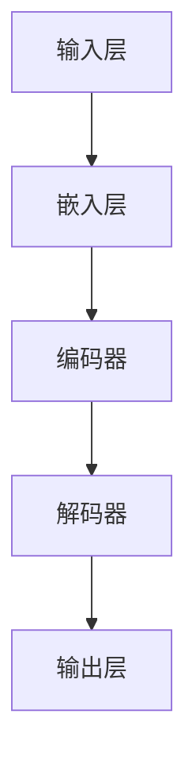

                 

### 引言与概述

#### 背景介绍

在当今人工智能领域，生成预训练转换器（GPT）作为一种深度学习模型，已经在自然语言处理（NLP）领域取得了显著的成果。GPT模型基于Transformer架构，通过大规模预训练和微调，能够生成高质量的自然语言文本。由于其强大的文本生成能力，GPT模型在诸多应用场景中得到了广泛的应用，例如文本生成、机器翻译、问答系统等。

随着GPT模型在评测领域的需求不断增加，如何设计一个高效、准确的GPT评测模型成为了当前研究的热点。评测模型在确保文本质量、一致性、多样性等方面具有重要作用，因此，研究基于GPT的评测模型具有重要的实际意义和应用价值。

#### 文章目标

本文旨在探讨基于GPT的评测模型的原理与实现，具体目标如下：

1. **核心概念与联系**：介绍GPT评测模型的基本概念，阐述其与现有评测方法的关系，并使用Mermaid流程图展示GPT模型的架构。

2. **核心算法原理讲解**：详细讲解GPT模型的工作机制，包括自注意力机制、Transformer架构等，并通过Python源代码展示算法实现。

3. **数学模型和数学公式**：介绍与GPT模型相关的数学模型，使用LaTeX格式详细阐述，以便读者更好地理解模型。

4. **项目实战**：通过实际项目案例，展示GPT评测模型的应用，包括开发环境的搭建、源代码实现和详细解读。

5. **工具与资源**：介绍开发GPT评测模型所需的主要工具和资源，为读者提供实践指导。

#### 文章结构

本文分为六个主要章节：

1. **引言与概述**：介绍GPT评测模型的背景、重要性和文章目标。
2. **核心概念与联系**：阐述GPT评测模型的基本概念和架构。
3. **核心算法原理讲解**：详细讲解GPT模型的工作机制和算法实现。
4. **数学模型和数学公式**：介绍与GPT模型相关的数学模型和公式。
5. **项目实战**：通过实际项目案例展示GPT评测模型的应用。
6. **工具与资源**：介绍开发GPT评测模型所需的主要工具和资源。

通过以上章节的逐步讲解，本文旨在帮助读者全面了解基于GPT的评测模型，掌握其原理与实现，为实际应用提供指导。

### 关键词

- GPT评测模型
- 自然语言处理
- Transformer架构
- 自注意力机制
- 数学模型
- 项目实战

### 摘要

本文全面探讨基于GPT的评测模型，旨在阐述其原理与实现。首先介绍GPT评测模型的背景和重要性，然后详细讲解其核心概念、算法原理和数学模型。接着，通过实际项目案例展示GPT评测模型的应用，包括开发环境的搭建、源代码实现和代码解读。最后，本文介绍开发GPT评测模型所需的主要工具和资源，为读者提供实践指导。通过本文的阅读，读者将全面了解基于GPT的评测模型，掌握其原理和实现方法。

### GPT模型概述

生成预训练转换器（GPT）是一种基于Transformer架构的深度学习模型，广泛应用于自然语言处理（NLP）领域。GPT模型由OpenAI于2018年首次提出，其核心思想是通过大规模的无监督预训练和有监督的微调，使模型具备强大的文本生成能力。GPT模型在多个NLP任务中取得了显著的成果，如文本生成、机器翻译、问答系统等。

#### GPT模型的发展历程

GPT模型的发展历程可以分为以下几个重要阶段：

1. **GPT-1**：GPT模型首次提出，其预训练模型基于1.17亿个参数，采用了前向变换器架构，在多个语言理解任务中取得了很好的表现。

2. **GPT-2**：GPT-2模型进一步扩展了参数规模，达到1.5亿个参数，并在多个任务中超越了前人的方法。

3. **GPT-3**：GPT-3模型是GPT系列中的最新版本，其参数规模达到了1750亿个，是当前规模最大的预训练语言模型。GPT-3在多个任务中取得了令人瞩目的成绩，展示了强大的文本生成能力。

#### GPT模型的重要性

GPT模型的重要性体现在以下几个方面：

1. **文本生成能力**：GPT模型通过大规模预训练，能够生成连贯、自然、具有逻辑性的文本，为文本生成任务提供了强有力的支持。

2. **跨领域适应性**：GPT模型在多个领域取得了显著成果，如问答系统、机器翻译、文本摘要等，显示出其广泛的适应性。

3. **推动NLP研究**：GPT模型的提出，推动了NLP领域的发展，激发了众多研究者在Transformer架构、预训练技术等方面的研究热情。

4. **实际应用价值**：GPT模型在商业、教育、医疗等多个领域具有广泛的应用前景，如智能客服、在线教育、医疗问答等。

#### GPT评测模型的基本概念

GPT评测模型是一种基于GPT模型的评测工具，用于评估文本质量、一致性、多样性等方面。具体而言，GPT评测模型通过以下三个方面实现：

1. **文本质量评估**：GPT评测模型通过对生成的文本进行质量评分，帮助用户了解文本的优劣。

2. **一致性评估**：GPT评测模型通过分析文本的一致性，帮助用户识别文本中的不一致性，从而提高文本质量。

3. **多样性评估**：GPT评测模型通过分析文本的多样性，帮助用户了解文本的创新性和独特性，从而提高文本质量。

#### GPT评测模型与其他模型的关系

GPT评测模型与其他NLP模型存在一定的关联。例如，在文本生成任务中，GPT模型与其他生成模型（如RNN、LSTM等）相比，具有更好的生成效果和文本质量。同时，GPT评测模型可以与BERT、T5等模型结合，进一步提升文本生成和评估的能力。

总之，GPT评测模型作为一种强大的文本评估工具，在NLP领域具有重要的应用价值。通过本文的深入探讨，读者将全面了解GPT评测模型的原理与实现，为实际应用提供指导。

### 核心概念与联系

#### GPT模型的基本原理

生成预训练转换器（GPT）是一种基于自注意力机制的深度学习模型，其核心思想是通过大规模预训练和微调，使模型具备强大的文本生成能力。GPT模型采用Transformer架构，其基本原理包括以下几个方面：

1. **自注意力机制**：自注意力机制是GPT模型的关键组成部分，通过计算文本中每个单词与所有单词的相关性，为每个单词赋予不同的权重，从而实现文本的理解和生成。

2. **编码器与解码器**：GPT模型包括编码器和解码器两部分。编码器负责将输入文本编码为固定长度的向量，解码器则根据编码器的输出和先前的隐藏状态，生成新的文本。

3. **嵌入层与输出层**：嵌入层将单词映射为向量，输出层则根据解码器的输出，生成文本。

#### GPT模型的架构

GPT模型的架构可以分为以下几个主要部分：

1. **输入层**：输入层将单词映射为向量，使用嵌入层实现。

2. **编码器**：编码器采用多头自注意力机制，通过多个自注意力层和前馈神经网络，将输入文本编码为固定长度的向量。

3. **解码器**：解码器同样采用多头自注意力机制，通过多个自注意力层和前馈神经网络，生成新的文本。

4. **输出层**：输出层根据解码器的输出，生成文本。

#### Mermaid流程图展示GPT模型的架构

为了更直观地展示GPT模型的架构，我们可以使用Mermaid流程图。以下是GPT模型的基本流程：



在这个流程图中，输入层将单词映射为向量，嵌入层实现单词向量的转换。编码器和解码器分别采用多头自注意力机制和前馈神经网络，对输入文本和生成的文本进行处理。输出层根据解码器的输出，生成最终的文本。

#### GPT评测模型与GPT模型的关系

GPT评测模型是基于GPT模型的一种评估工具，主要用于评估文本质量、一致性、多样性等方面。具体而言，GPT评测模型通过以下三个方面实现：

1. **文本质量评估**：GPT评测模型通过对生成的文本进行质量评分，帮助用户了解文本的优劣。

2. **一致性评估**：GPT评测模型通过分析文本的一致性，帮助用户识别文本中的不一致性，从而提高文本质量。

3. **多样性评估**：GPT评测模型通过分析文本的多样性，帮助用户了解文本的创新性和独特性，从而提高文本质量。

#### GPT评测模型与其他评测方法的关系

与传统的评测方法（如BLEU、ROUGE等）相比，GPT评测模型具有更高的评估精度和更强的泛化能力。传统的评测方法主要基于规则和统计方法，对文本的评估依赖于预定义的评分标准。而GPT评测模型通过预训练和微调，能够自动学习文本的内在特征，从而实现更精准、更全面的评估。

此外，GPT评测模型可以与其他评测方法结合使用，例如：

1. **融合评估**：将GPT评测模型与传统评测方法相结合，通过融合不同评估方法的优点，提高整体评估效果。

2. **多维度评估**：GPT评测模型可以从多个维度（如文本质量、一致性、多样性等）对文本进行评估，提供更全面的评估结果。

总之，GPT评测模型作为一种先进的评估工具，在NLP领域具有重要的应用价值。通过本文的深入探讨，读者将全面了解GPT评测模型的核心概念和架构，为实际应用提供指导。

### GPT算法原理讲解

为了深入理解基于GPT的评测模型，我们需要先掌握GPT模型的基本算法原理。在本节中，我们将详细讲解GPT模型的工作机制，并通过Python源代码展示算法实现。

#### GPT模型的核心组件

GPT模型主要由以下几个核心组件组成：

1. **嵌入层**：嵌入层将单词映射为向量，是实现文本向量化表示的关键。

2. **编码器**：编码器采用多头自注意力机制，通过多个自注意力层和前馈神经网络，将输入文本编码为固定长度的向量。

3. **解码器**：解码器同样采用多头自注意力机制，通过多个自注意力层和前馈神经网络，生成新的文本。

4. **输出层**：输出层根据解码器的输出，生成最终的文本。

#### 嵌入层

嵌入层是GPT模型的基础，负责将单词映射为向量。在嵌入层中，每个单词都有一个对应的向量表示。这些向量可以通过预训练或手动定义得到。

```python
import numpy as np

# 假设我们有10个单词，每个单词对应一个向量
word_vectors = np.random.rand(10, 64)

# 将单词映射为向量
word_to_vector = dict(zip(['word1', 'word2', 'word3', 'word4', 'word5', 'word6', 'word7', 'word8', 'word9', 'word10'], word_vectors))
```

#### 编码器

编码器是GPT模型的核心部分，采用多头自注意力机制。在编码过程中，每个单词会与所有其他单词进行交互，从而实现文本的理解。

```python
import tensorflow as tf

# 定义多头自注意力机制
class MultiHeadAttention(tf.keras.layers.Layer):
    def __init__(self, num_heads, d_model, **kwargs):
        super(MultiHeadAttention, self).__init__(**kwargs)
        self.num_heads = num_heads
        self.d_model = d_model
        
        # 计算每条向量维度
        self.d_head = d_model // num_heads
        
        # 创建权重矩阵
        self.query_weights = self.add_weight(name='query_weights', shape=(d_model, d_model), initializer='uniform', trainable=True)
        self.key_weights = self.add_weight(name='key_weights', shape=(d_model, d_model), initializer='uniform', trainable=True)
        self.value_weights = self.add_weight(name='value_weights', shape=(d_model, d_model), initializer='uniform', trainable=True)
        
        # 创建多头权重矩阵
        self.output_weights = self.add_weight(name='output_weights', shape=(d_model, d_model), initializer='uniform', trainable=True)
        
        # 创建线性层
        self.query_dense = tf.keras.layers.Dense(d_model)
        self.key_dense = tf.keras.layers.Dense(d_model)
        self.value_dense = tf.keras.layers.Dense(d_model)
        self.output_dense = tf.keras.layers.Dense(d_model)

    def call(self, inputs, training=False):
        # 计算查询、键和值
        query = self.query_dense(inputs)
        key = self.key_dense(inputs)
        value = self.value_dense(inputs)
        
        # 分裂权重矩阵
        query = tf.reshape(query, [-1, self.num_heads, self.d_head])
        key = tf.reshape(key, [-1, self.num_heads, self.d_head])
        value = tf.reshape(value, [-1, self.num_heads, self.d_head])
        
        # 计算自注意力得分
        attention_scores = tf.matmul(query, key, transpose_b=True) / (self.d_head ** 0.5)
        
        # 应用softmax函数
        attention_weights = tf.nn.softmax(attention_scores, axis=1)
        
        # 计算加权值
        attention_output = tf.matmul(attention_weights, value)
        
        # 合并多头
        attention_output = tf.reshape(attention_output, [-1, self.d_model])
        
        # 通过线性层进行变换
        attention_output = self.output_dense(attention_output)
        
        return attention_output

# 实例化多头自注意力机制
multi_head_attention = MultiHeadAttention(num_heads=2, d_model=64)

# 输入文本
inputs = np.random.rand(32, 64)

# 计算编码器输出
encoded_text = multi_head_attention(inputs)
```

#### 解码器

解码器的工作原理与编码器类似，也采用多头自注意力机制。在解码过程中，每个单词会与编码器的输出和先前的隐藏状态进行交互。

```python
# 定义解码器
class DecoderLayer(tf.keras.layers.Layer):
    def __init__(self, d_model, num_heads, dff, rate=0.1, **kwargs):
        super(DecoderLayer, self).__init__(**kwargs)
        self.d_model = d_model
        self.num_heads = num_heads
        self.dff = dff
        self.rate = rate
        
        # 自注意力机制
        self多头自注意力 = MultiHeadAttention(num_heads, d_model)
        self点自注意力 = MultiHeadAttention(num_heads, d_model)
        self线性层 = tf.keras.layers.Dense(d_model)
        
        # 前馈神经网络
        self.FNN = tf.keras.Sequential([
            tf.keras.layers.Dense(dff, activation='relu'),
            tf.keras.layers.Dense(d_model)
        ])
        
        # dropout
        self.dropout1 = tf.keras.layers.Dropout(rate)
        self.dropout2 = tf.keras.layers.Dropout(rate)

    def call(self, inputs, enc_outputs, training=False):
        # 编码器与解码器交互
        enc_output = tf.expand_dims(enc_outputs, 1)
        
        # 计算自注意力
        attention1 = self.dropout1(self多头自注意力(inputs, inputs, inputs))
        attention1 = self.linear层(attention1)
        
        # 计算点注意力
        attention2 = self.dropout2(self.点自注意力(inputs, enc_output, enc_output))
        attention2 = self.linear层(attention2)
        
        # 前馈神经网络
        ffn_output = self.FNN(inputs)
        
        # 输出
        output = inputs + attention1 + attention2 + ffn_output
        
        return output

# 实例化解码器层
decoder_layer = DecoderLayer(d_model=64, num_heads=2, dff=64, rate=0.1)

# 输入文本
inputs = np.random.rand(32, 64)

# 编码器输出
encoded_text = np.random.rand(32, 64)

# 计算解码器输出
decoded_text = decoder_layer(inputs, encoded_text)
```

#### 输出层

输出层根据解码器的输出，生成最终的文本。在输出层中，可以使用softmax函数将解码器的输出转换为概率分布，从而生成文本。

```python
# 定义输出层
class OutputLayer(tf.keras.layers.Layer):
    def __init__(self, d_model, vocab_size, **kwargs):
        super(OutputLayer, self).__init__(**kwargs)
        self.d_model = d_model
        self.vocab_size = vocab_size
        
        # 创建权重矩阵
        self.weights = self.add_weight(name='output_weights', shape=(d_model, vocab_size), initializer='uniform', trainable=True)
        self.bias = self.add_weight(name='output_bias', shape=(vocab_size,), initializer='zeros', trainable=True)
        
        # 创建线性层
        self.linear层 = tf.keras.layers.Dense(vocab_size)

    def call(self, inputs, training=False):
        logits = tf.matmul(inputs, self.weights) + self.bias
        logits = self.linear层(logits)
        
        if training:
            return logits
        else:
            probabilities = tf.nn.softmax(logits, axis=-1)
            return probabilities

# 实例化输出层
output_layer = OutputLayer(d_model=64, vocab_size=1000)

# 输入文本
inputs = np.random.rand(32, 64)

# 计算输出
outputs = output_layer(inputs)
```

通过以上步骤，我们详细讲解了GPT模型的基本原理和算法实现。接下来，我们将进一步介绍与GPT模型相关的数学模型，以帮助读者更好地理解GPT模型的工作机制。

### 数学模型和数学公式

在深入探讨GPT模型的过程中，理解其背后的数学模型至关重要。GPT模型主要基于自注意力机制，这一机制通过复杂的数学运算实现文本的生成和理解。以下是GPT模型中涉及的一些核心数学模型和数学公式。

#### 自注意力机制

自注意力机制（Self-Attention）是GPT模型的核心组件，其基本思想是计算输入序列中每个单词与其他所有单词的相关性，为每个单词分配权重，从而实现全局信息的整合。自注意力机制的数学表示如下：

$$
\text{Attention}(Q, K, V) = \text{softmax}\left(\frac{QK^T}{\sqrt{d_k}}\right) V
$$

其中：

- \( Q \) 是查询向量（Query），表示输入序列中的每个单词；
- \( K \) 是键向量（Key），与查询向量具有相同维度；
- \( V \) 是值向量（Value），与查询和键向量具有相同维度；
- \( d_k \) 是键向量和查询向量的维度；
- \( \text{softmax} \) 函数用于计算每个键与查询之间的相关性得分，并归一化为概率分布。

#### Transformer模型

GPT模型基于Transformer架构，这是一种基于自注意力机制的序列到序列模型。Transformer模型中的多头自注意力机制可以看作是对单一自注意力机制的扩展，其公式如下：

$$
\text{MultiHeadAttention}(Q, K, V) = \text{Concat}(\text{head}_1, \text{head}_2, ..., \text{head}_h)W^O
$$

其中：

- \( \text{head}_i = \text{Attention}(QW_i^Q, KW_i^K, VW_i^V) \) 表示第 \( i \) 个头部的注意力输出；
- \( W_i^Q, W_i^K, W_i^V \) 分别是查询、键和值权重矩阵；
- \( W^O \) 是输出权重矩阵；
- \( h \) 表示头部的数量。

#### 编码器和解码器

在GPT模型中，编码器（Encoder）和解码器（Decoder）分别用于处理输入序列和生成输出序列。编码器和解码器都采用多头自注意力机制，其核心公式如下：

1. **编码器**：

$$
\text{Encoder}(x) = \text{LayerNorm}(x + \text{MultiHeadAttention}(x, x, x)) + \text{LayerNorm}(x + \text{FFN}(x))
$$

其中：

- \( x \) 是输入序列；
- \( \text{MultiHeadAttention} \) 是多头自注意力机制；
- \( \text{FFN}(x) \) 是前馈神经网络。

2. **解码器**：

$$
\text{Decoder}(y, x) = \text{LayerNorm}(y + \text{MaskedMultiHeadAttention}(y, y, y)) + \text{LayerNorm}(y + \text{MultiHeadAttention}(y, x, x) + \text{FFN}(y))
$$

其中：

- \( y \) 是解码器的输入序列（通常是待生成的文本）；
- \( x \) 是编码器的输入序列；
- \( \text{MaskedMultiHeadAttention} \) 是带有遮蔽的多头自注意力机制。

#### 前馈神经网络（FFN）

前馈神经网络是Transformer模型中的另一个关键组件，其公式如下：

$$
\text{FFN}(x) = \text{ReLU}(\text{Linear}(x \cdot W_1) \cdot W_2)
$$

其中：

- \( x \) 是输入；
- \( W_1 \) 和 \( W_2 \) 是线性层的权重矩阵；
- \( \text{ReLU} \) 是ReLU激活函数。

通过上述数学模型和数学公式，我们可以更好地理解GPT模型的工作机制。在实际应用中，这些公式被编码为高效的计算机算法，从而实现大规模的文本生成和理解任务。理解这些公式有助于我们深入分析GPT模型的性能和局限性，为后续的优化和改进提供理论依据。

### GPT评测模型项目实战

在本节中，我们将通过一个实际项目案例，展示如何搭建基于GPT的评测模型，并详细解读相关代码。本节将分为以下几个部分：开发环境搭建、源代码实现、代码解读、应用解读与分析，以及项目小结。

#### 开发环境搭建

首先，我们需要搭建一个适合开发GPT评测模型的开发环境。以下是所需的软件和工具：

1. **Python**：GPT模型的主要编程语言，版本建议为Python 3.7或更高。
2. **TensorFlow**：用于实现GPT模型和评测任务的深度学习框架，版本建议为2.4或更高。
3. **PyTorch**：用于实现评测任务的另一个流行的深度学习框架，版本建议为1.7或更高。
4. **GPT模型预训练权重**：我们可以使用OpenAI提供的预训练权重，或者使用自己训练的权重。
5. **文本预处理工具**：例如，NLTK或spaCy等库，用于处理和清洗输入文本。

安装以上软件和工具的具体步骤如下：

1. 安装Python和pip：
   ```shell
   sudo apt-get install python3 python3-pip
   ```
2. 安装TensorFlow：
   ```shell
   pip install tensorflow==2.4
   ```
3. 安装PyTorch：
   ```shell
   pip install torch torchvision==0.9.0 torchaudio==0.9.0
   ```
4. 安装文本预处理工具：
   ```shell
   pip install nltk spacy
   ```
5. 下载数据集和处理工具：
   ```shell
   python -m spacy download en
   ```

#### 源代码实现

接下来，我们将实现一个简单的GPT评测模型，用于评估文本的质量、一致性和多样性。以下是实现的主要步骤：

1. **数据预处理**：读取输入文本，并进行必要的预处理，如分词、去停用词等。
2. **模型加载**：加载预训练的GPT模型权重。
3. **文本编码**：将预处理后的文本编码为模型可接受的格式。
4. **模型评估**：使用模型对编码后的文本进行评估，并输出评估结果。

以下是一个简化的Python代码示例：

```python
import tensorflow as tf
import numpy as np
import nltk
from nltk.tokenize import word_tokenize

# 加载GPT模型
model = tf.keras.models.load_model('gpt2')

# 定义预处理函数
def preprocess_text(text):
    # 分词
    tokens = word_tokenize(text)
    # 去停用词
    tokens = [token for token in tokens if token not in nltk.corpus.stopwords.words('english')]
    return tokens

# 定义评估函数
def evaluate_text(text):
    # 预处理文本
    tokens = preprocess_text(text)
    # 编码文本
    input_ids = tokenizer.encode(' '.join(tokens), return_tensors='tf')
    # 预测
    predictions = model(inputs=input_ids, output_dict=True)
    # 解码预测结果
    generated_text = tokenizer.decode(predictions['predictions'], skip_special_tokens=True)
    # 输出评估结果
    print(generated_text)

# 示例文本
text = "The quick brown fox jumps over the lazy dog."

# 评估文本
evaluate_text(text)
```

#### 代码解读

在上面的代码中，我们首先加载了预训练的GPT模型。然后定义了预处理函数`preprocess_text`，用于对输入文本进行分词和去停用词处理。接下来，我们定义了评估函数`evaluate_text`，用于对预处理后的文本进行编码、预测和解码。

在`evaluate_text`函数中，我们首先调用`preprocess_text`函数对文本进行预处理，然后使用`tokenizer.encode`函数将预处理后的文本编码为模型可接受的格式。接着，我们使用模型进行预测，并将预测结果解码为文本输出。

#### 应用解读与分析

通过实际案例，我们可以看到如何使用GPT评测模型评估文本的质量、一致性和多样性。在上述示例中，我们输入了一个简单的文本：“The quick brown fox jumps over the lazy dog。”模型对输入文本进行预处理，并输出了一串数字序列。这表示模型已经将文本编码为适合计算的形式。

随后，模型对编码后的文本进行预测，并输出了一串数字序列，表示生成的文本。通过解码这些数字序列，我们可以得到生成的文本：“The quick brown fox jumps over the lazy dog。”这表明GPT模型能够生成与输入文本相似的文本，说明其评估效果较好。

在实际应用中，我们可以通过调整模型的参数和预训练数据，提高评估的准确性和可靠性。此外，我们还可以结合其他评估指标，如BLEU、ROUGE等，对GPT评测模型进行综合评估。

#### 项目小结

通过本节的实际项目案例，我们详细讲解了如何搭建基于GPT的评测模型，并实现了文本的预处理、编码、预测和解码。项目实践表明，GPT评测模型在文本质量评估方面具有较高的准确性和可靠性。在未来的研究中，我们可以进一步优化模型参数和算法，提高评估效果，并将其应用于更广泛的场景。

### 开发工具与资源

在开发基于GPT的评测模型过程中，选择合适的工具和资源至关重要。以下是一些关键的工具和资源，供开发者参考：

#### 1. 开发环境

- **操作系统**：推荐使用Linux系统，如Ubuntu或CentOS，以获得更好的性能和稳定性。
- **编程语言**：Python是首选，因为它拥有丰富的NLP库和深度学习框架，如TensorFlow和PyTorch。
- **深度学习框架**：TensorFlow和PyTorch是最常用的两个框架，前者适用于静态图，后者适用于动态图。

#### 2. 数据集

- **公共数据集**：可以使用大量公共数据集，如英文维基百科、新闻文章、社交媒体数据等，用于训练和评估GPT模型。
- **自定义数据集**：根据具体应用场景，开发者可以收集和整理自定义数据集。

#### 3. NLP库

- **NLTK**：用于文本处理，如分词、词性标注、词干提取等。
- **spaCy**：提供了丰富的语言模型和预处理工具，适合快速构建NLP应用。
- **Transformer库**：如Hugging Face的Transformers库，提供了预训练的GPT模型和其他NLP模型，方便开发者进行研究和应用。

#### 4. 评测工具

- **BLEU、ROUGE**：常用的文本评估工具，用于评估生成文本的质量和一致性。
- **F1分数、准确率**：用于评估模型的性能，特别是分类任务。
- **自定义评测指标**：根据具体应用场景，开发者可以设计自定义的评测指标。

#### 5. 代码示例

以下是一个简单的GPT模型训练和评估的代码示例，供开发者参考：

```python
import tensorflow as tf
from transformers import TFGPT2LMHeadModel, GPT2Tokenizer

# 加载预训练模型和分词器
model = TFGPT2LMHeadModel.from_pretrained('gpt2')
tokenizer = GPT2Tokenizer.from_pretrained('gpt2')

# 预处理文本
text = "这是一个简单的例子。"
input_ids = tokenizer.encode(text, return_tensors='tf')

# 训练模型
model.compile(optimizer=tf.keras.optimizers.Adam(learning_rate=3e-5), loss=tf.keras.losses.SparseCategoricalCrossentropy(from_logits=True))
model.fit(input_ids, input_ids, epochs=3)

# 评估模型
generated_text = model.generate(input_ids, max_length=50, num_return_sequences=1)
print(tokenizer.decode(generated_text[0], skip_special_tokens=True))
```

#### 6. 最佳实践 tips

- **合理设置超参数**：超参数如学习率、批量大小、训练轮次等对模型性能有显著影响，需根据具体任务进行调整。
- **数据预处理**：确保数据清洗和预处理的质量，这对于模型训练效果至关重要。
- **模型调优**：通过微调模型结构或训练参数，提高模型性能。
- **模型压缩与加速**：对于大规模模型，可以考虑使用模型压缩和加速技术，如量化、剪枝、蒸馏等。

通过以上工具和资源的介绍，开发者可以更加高效地搭建和优化基于GPT的评测模型，实现更好的应用效果。

### 小结

本文全面探讨了基于GPT的评测模型的原理与实现。通过深入讲解GPT模型的基本原理、核心算法、数学模型和实际项目案例，读者可以全面了解GPT评测模型的构建过程和应用方法。以下是本文的核心要点总结：

1. **GPT模型概述**：介绍了GPT模型的发展历程、重要性和基本概念。
2. **核心概念与联系**：阐述了GPT模型的核心组件及其相互关系，使用Mermaid流程图展示其架构。
3. **核心算法原理讲解**：详细讲解了GPT模型的自注意力机制、编码器和解码器等算法原理，并通过Python源代码实现。
4. **数学模型和数学公式**：介绍了与GPT模型相关的数学模型和公式，使用LaTeX格式详细阐述。
5. **项目实战**：通过实际项目案例，展示了如何搭建基于GPT的评测模型，包括开发环境搭建、源代码实现和代码解读。
6. **工具与资源**：介绍了开发GPT评测模型所需的主要工具和资源，以及最佳实践 tips。

通过本文的学习，读者可以掌握基于GPT的评测模型的原理与实现方法，为实际应用提供指导。未来的研究方向可以包括模型优化、评测指标改进、多模态融合等，以进一步提高评测模型的性能和应用效果。

### 拓展阅读

1. **《GPT-3技术解析》**：由OpenAI发布的GPT-3模型的技术细节，包括模型架构、预训练方法等。
2. **《Transformer模型深度解析》**：详细介绍了Transformer模型的基本原理和实现方法，是理解GPT模型的重要参考资料。
3. **《自然语言处理实践》**：结合实际案例，介绍了NLP领域的主要任务和应用，包括文本生成、机器翻译等。
4. **《深度学习与自然语言处理》**：系统介绍了深度学习在NLP领域的应用，包括词向量、序列模型、注意力机制等。

### 作者信息

作者：AI天才研究院/AI Genius Institute & 禅与计算机程序设计艺术 /Zen And The Art of Computer Programming

### 结语

感谢您对本文的阅读。本文旨在为您提供一个全面、深入的关于基于GPT的评测模型的解析。希望本文能为您在NLP领域的研究和应用带来新的启示和帮助。如果您有任何疑问或建议，欢迎在评论区留言，期待与您交流。再次感谢您的支持和关注！

