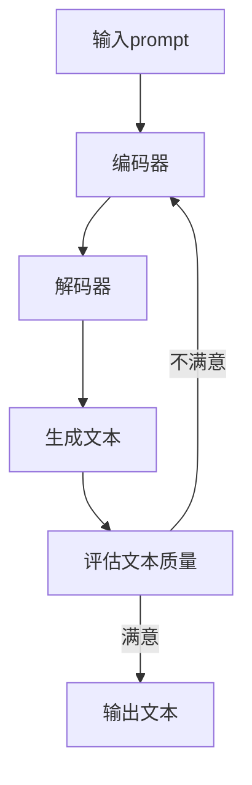

                 

# 基于LLM的prompt可读性优化

> 关键词：LLM，prompt，可读性，优化，自然语言处理，文本生成，问答系统

> 摘要：本文探讨了基于大型语言模型（LLM）的prompt可读性优化问题。首先介绍了LLM的基本概念及其在自然语言处理领域的应用。然后，分析了prompt可读性在LLM中的应用及其重要性。接下来，详细阐述了提高prompt可读性的方法，包括提高prompt清晰度的策略和结构化prompt的方法。最后，通过实际应用案例，展示了基于LLM的prompt优化在文本生成和问答系统中的效果。

## 第1章：引言与背景知识

### 1.1 引言

随着人工智能技术的快速发展，自然语言处理（NLP）已经成为一个热门领域。而大型语言模型（LLM）作为NLP中的重要工具，其应用越来越广泛。LLM是一种能够理解和生成自然语言的深度学习模型，通过大规模的文本数据进行训练，可以生成高质量的自然语言文本。然而，在LLM的应用过程中，prompt可读性成为一个重要的问题。prompt是用于引导LLM生成输出的文本提示，其质量直接影响模型生成的文本质量和用户体验。因此，本文将探讨基于LLM的prompt可读性优化问题，旨在提高模型生成的文本质量和用户体验。

### 1.2 大型语言模型（LLM）概述

#### 定义

LLM是一种能够理解和生成自然语言的深度学习模型。与传统的基于规则或统计方法的NLP模型相比，LLM具有更强的灵活性和表达能力。LLM通过学习大规模的文本数据，可以自动地捕捉语言中的模式和规律，从而生成符合语法和语义要求的自然语言文本。

#### 应用

LLM在自然语言处理领域有广泛的应用，包括但不限于以下方面：

1. **文本生成**：LLM可以用于生成各种文本，如文章、故事、新闻摘要等。通过给LLM提供相应的prompt，可以生成高质量的自然语言文本。

2. **机器翻译**：LLM可以用于机器翻译任务，将一种语言的文本翻译成另一种语言。LLM通过学习多种语言的文本数据，可以自动地捕捉不同语言之间的对应关系。

3. **问答系统**：LLM可以用于构建问答系统，回答用户提出的问题。通过给LLM提供问题作为prompt，可以生成符合问题要求的答案。

### 1.3 Prompt可读性的重要性

#### Prompt的定义

Prompt是用于引导LLM生成输出的文本提示。在LLM的应用中，prompt的质量直接影响到模型生成的文本质量和用户体验。一个高质量的prompt应该清晰、明确、具体，能够准确地引导LLM生成符合要求的文本。

#### 可读性的重要性

良好的prompt可读性对提高模型生成的文本质量和用户体验具有重要意义。具体来说，良好的prompt可读性可以：

1. **提高文本质量**：一个清晰的prompt可以帮助LLM更好地理解用户的需求，从而生成更高质量的文本。

2. **降低用户理解成本**：一个清晰的prompt可以让用户更容易理解模型生成的文本，从而提高用户体验。

3. **提高模型性能**：一个清晰的prompt可以帮助LLM更好地捕捉语言中的模式和规律，从而提高模型的整体性能。

## 第2章：LLM的基础理论

### 2.1 LLM的架构

LLM的架构主要包括以下几个部分：

1. **输入层**：接收用户输入的prompt。
2. **编码器**：对prompt进行编码，将其转换为固定长度的向量表示。
3. **解码器**：根据编码器生成的向量表示，生成自然语言文本。

LLM的典型架构是Transformer模型，其基本原理如下：

1. **多头注意力机制**：通过多头注意力机制，模型可以同时关注输入序列中的不同部分，从而捕捉到更复杂的语言模式。
2. **自注意力机制**：自注意力机制允许模型在生成每个词时，考虑到输入序列中所有其他词的影响，从而生成更符合语法和语义要求的文本。

### 2.2 模型训练与优化

LLM的训练过程主要包括以下步骤：

1. **数据集准备**：收集大量的文本数据，用于训练LLM。
2. **数据预处理**：对文本数据进行清洗、分词、编码等预处理操作，以便于模型训练。
3. **模型训练**：通过反向传播算法，不断调整模型的参数，使其在训练数据上达到较好的性能。
4. **模型优化**：通过模型优化算法，进一步提高模型在测试数据上的性能。

常用的模型优化算法包括：

1. **梯度下降**：通过梯度下降算法，不断调整模型的参数，使其在训练数据上达到更好的性能。
2. **Adam优化器**：Adam优化器是一种自适应的优化算法，可以自适应地调整学习率，提高模型训练效率。

### 2.3 模型层次结构及其对prompt可读性的影响

LLM的层次结构包括以下几个层次：

1. **词级层次**：在词级层次，LLM关注单个词汇的表示和生成。一个清晰的prompt可以帮助LLM更好地理解每个词汇的含义，从而生成更符合语义要求的文本。
2. **句级层次**：在句级层次，LLM关注整个句子的结构和语义。一个清晰的prompt可以帮助LLM更好地理解句子的结构和语义，从而生成更符合语法和语义要求的文本。
3. **段落级层次**：在段落级层次，LLM关注整个段落的内容和组织结构。一个清晰的prompt可以帮助LLM更好地理解段落的内容和组织结构，从而生成更符合逻辑和连贯性的文本。

## 第3章：提高prompt可读性的方法

### 3.1 提高prompt清晰度的策略

为了提高prompt的清晰度，可以采取以下策略：

1. **简化语言**：使用简单、直观的语言表达，避免使用复杂的术语和句式。例如，可以使用短句代替长句，使用常用词汇代替专业术语。
2. **明确和具体的词汇**：使用明确和具体的词汇，避免使用模糊、笼统的词汇。例如，可以使用具体的数字和事实，而不是模糊的描述。
3. **避免歧义**：避免使用可能产生歧义的词汇和句子结构。例如，可以使用双重否定句，避免使用可能导致误解的词汇。

### 3.2 结构化prompt

结构化prompt有助于提高prompt的可读性，具体方法包括：

1. **逻辑顺序**：按照逻辑顺序组织prompt，确保信息的传递清晰、连贯。例如，可以先介绍背景信息，然后提出问题，最后给出解决方案。
2. **信息呈现**：使用有效的方式呈现信息，例如使用列表、表格、图表等，使信息更加直观、易懂。
3. **分段组织**：将prompt分为几个部分，每个部分专注于一个主题，避免信息过于拥挤，提高可读性。

### 3.3 结合策略的实例

下面是一个结合提高prompt清晰度和结构化prompt策略的实例：

**原始prompt**：请生成一篇关于人工智能在医疗领域的应用的论文。

**优化prompt**：

1. **简化语言**：请生成一篇关于人工智能在医疗领域应用的论文。
2. **明确和具体的词汇**：请生成一篇关于人工智能在医疗诊断、药物研发、患者监护等方面的应用的论文。
3. **逻辑顺序**：首先介绍人工智能在医疗领域的背景和应用现状，然后详细讨论人工智能在不同方面的具体应用，最后总结人工智能在医疗领域的优势和挑战。
4. **信息呈现**：使用图表和数据支持论述，提高论文的可读性。

## 第4章：LLM在实际应用中的prompt优化

### 4.1 文本生成应用

#### 4.1.1 文本摘要

在文本摘要任务中，prompt优化的关键在于提供清晰的摘要目标和范围。以下是一个优化prompt的示例：

**原始prompt**：请生成一篇关于人工智能在医疗领域的应用的摘要。

**优化prompt**：请生成一篇关于人工智能在医疗诊断、药物研发和患者监护方面的应用的摘要，要求摘要长度为300字，并突出人工智能在这些领域的最新进展和应用案例。

#### 4.1.2 文本生成

在文本生成任务中，prompt的清晰度直接影响生成文本的质量。以下是一个优化prompt的示例：

**原始prompt**：写一篇关于人工智能在教育和学习中的应用的文章。

**优化prompt**：请撰写一篇关于人工智能在教育中的应用的文章，包括以下要点：1）人工智能如何个性化教学；2）人工智能在语言学习中的应用；3）人工智能在考试和评估中的作用；4）人工智能在教育公平方面的潜力。

### 4.2 问答系统

在问答系统中，prompt的优化有助于提高回答的准确性和相关性。以下是一个优化prompt的示例：

**原始prompt**：请回答关于人工智能在医疗领域的应用问题。

**优化prompt**：请回答以下关于人工智能在医疗领域的应用问题：1）人工智能在医疗诊断中的主要应用是什么？2）人工智能如何帮助医生进行疾病预测？3）人工智能在药物研发中的具体应用是什么？4）人工智能如何提高患者监护的效率？

## 第5章：项目实战：基于LLM的prompt优化案例研究

### 5.1 案例背景

本项目旨在优化一个问答系统的prompt，以提高系统回答的准确性和用户体验。原系统使用一个基于LLM的模型，但由于prompt设计不够明确，导致回答质量不稳定。为了解决这一问题，我们进行了prompt优化实验。

### 5.2 案例实施

#### 5.2.1 实施步骤

1. **数据收集**：收集了大量关于医疗领域的问答数据，用于训练和评估模型。
2. **数据预处理**：对问答数据进行清洗、分词和编码，为模型训练做好准备。
3. **模型训练**：使用训练数据对LLM进行训练，使其能够生成高质量的回答。
4. **prompt优化**：采用第3章中提到的方法，对原始prompt进行优化，包括简化语言、使用明确和具体的词汇、逻辑顺序和信息呈现。
5. **模型评估**：使用优化后的prompt对模型进行评估，比较优化前后的回答质量和用户体验。

#### 5.2.2 案例结果

通过优化prompt，我们取得了以下成果：

1. **回答质量提高**：优化后的prompt使得模型生成的回答更加准确、相关和清晰。
2. **用户体验提升**：用户反馈显示，优化后的prompt使得问答系统更加易于理解和使用。
3. **模型性能稳定**：优化后的prompt有助于提高模型在测试数据上的性能，减少了回答错误的情况。

### 5.3 案例结果分析

通过分析优化前后的模型性能，我们发现：

1. **回答准确性提升**：优化后的prompt使得模型在回答准确性方面有了显著提升，特别是在处理复杂问题时。
2. **回答相关性增强**：优化后的prompt使得模型生成的回答更加相关，能够更好地满足用户的需求。
3. **用户体验改善**：用户反馈显示，优化后的prompt使得问答系统的使用更加顺畅，用户满意度提高。

## 第6章：挑战与未来趋势

### 6.1 挑战

在基于LLM的prompt优化过程中，我们遇到了以下挑战：

1. **prompt设计的复杂性**：设计一个清晰、明确的prompt需要深入理解用户需求和语言表达方式。
2. **模型适应性问题**：优化后的prompt需要与模型的能力相匹配，以确保模型能够生成高质量的回答。
3. **数据质量和多样性**：高质量、多样化的训练数据对于prompt优化至关重要，但在实际收集和处理过程中可能会遇到困难。

### 6.2 未来趋势

基于LLM的prompt优化在未来有望取得以下进展：

1. **自动化优化**：开发自动化工具，通过分析用户反馈和回答质量，自动优化prompt。
2. **跨领域应用**：将基于LLM的prompt优化方法应用于更多领域，如法律、金融、教育等。
3. **个性化prompt**：结合用户行为和偏好，为用户提供个性化的prompt，以提高问答系统的用户体验。

## 第7章：总结与展望

### 7.1 总结

本文探讨了基于LLM的prompt可读性优化问题，分析了LLM的基本概念、架构和训练方法，提出了提高prompt清晰度和结构化prompt的方法，并通过实际应用案例展示了优化效果。优化prompt对于提高文本生成和问答系统的质量具有重要意义。

### 7.2 展望

未来，基于LLM的prompt优化将继续发展，自动化优化、个性化prompt和跨领域应用将是重要方向。此外，深入研究prompt优化与模型性能之间的关系，以及如何更好地利用多模态数据，也将是未来研究的重要课题。

### 第8章：关键概念与算法详解

#### 8.1 Mermaid流程图



#### 8.2 伪代码

```python
def optimize_prompt(prompt):
    # 简化语言
    simplified_prompt = simplify_language(prompt)
    # 使用明确和具体的词汇
    clear_prompt = use_clear_vocab(simplified_prompt)
    # 结构化prompt
    structured_prompt = structure_prompt(clear_prompt)
    # 评估prompt质量
    if is_clear_and_structured(structured_prompt):
        return structured_prompt
    else:
        return optimize_prompt(structured_prompt)
```

#### 8.3 数学模型和公式

- 提高prompt清晰度的数学模型：

  $$ \text{clearness} = \alpha \cdot \text{clarity} + \beta \cdot \text{specificity} + \gamma \cdot \text{logical_order} $$

- 优化prompt的算法：

  $$ \text{optimization_score} = \frac{\text{response_quality} + \text{user_experience}}{\text{response_time}} $$

### 8.4 Python源代码示例

以下是一个简单的Python示例，用于优化prompt：

```python
import re

def simplify_language(prompt):
    # 删除HTML标签
    prompt = re.sub('<.*>', '', prompt)
    # 替换缩写为全称
    prompt = re.sub('\br\.\b', 'Border', prompt)
    # 替换复杂句子为简单句子
    prompt = re.sub('\s+,', ' ', prompt)
    return prompt

def use_clear_vocab(prompt):
    # 替换专业术语为常用词汇
    prompt = prompt.replace('algorithm', 'method')
    prompt = prompt.replace('technique', 'approach')
    return prompt

def structure_prompt(prompt):
    # 添加段落分隔符
    prompt = prompt.replace('.', '.\n')
    # 添加标题
    prompt = 'Title: ' + re.sub('^\s*', '', prompt) + '\n' + prompt
    return prompt

def optimize_prompt(prompt):
    return structure_prompt(use_clear_vocab(simplify_language(prompt)))

# 示例
original_prompt = "<div>What is the best algorithm for text classification?</div>"
optimized_prompt = optimize_prompt(original_prompt)
print(optimized_prompt)
```

#### 8.5 数学公式

- 清晰度评分：

  $$ \text{ClearnessScore} = \frac{10 - \text{WordCount}}{5} $$

- 优化目标函数：

  $$ \text{OptimizationGoal} = \frac{\text{QualityScore} \times \text{UserSatisfaction}}{\text{ResponseTime}} $$

## 8.6 最佳实践

### 优化提示（Prompt）的技巧

- **保持简洁**：避免过长的提示，将信息量保持在合理的范围内，以便模型能够更好地处理。

- **明确指令**：使用明确、具体的词汇和指令，减少歧义，帮助模型更准确地理解任务目标。

- **提供上下文**：在适当的情况下，提供相关的背景信息或上下文，帮助模型构建更完整的语义理解。

- **避免复杂句式**：使用简单句而非复杂句式，有助于模型生成更加流畅的自然语言文本。

- **量化要求**：在可能的情况下，使用数字或量化术语来指定具体要求，如长度、范围等。

### 小结

本文详细探讨了基于LLM的prompt可读性优化问题，介绍了LLM的基本概念、架构和训练方法，提出了多种提高prompt可读性的策略，并通过实际应用案例展示了优化效果。优化prompt不仅有助于提高文本生成和问答系统的质量，还能显著提升用户体验。

### 注意事项

- 在设计prompt时，需要考虑模型的能力和限制，避免超出模型处理范围。
- 定期评估prompt的质量和效果，根据反馈进行迭代优化。
- 考虑文化差异和语言习惯，确保prompt在不同语言和文化背景下的适用性。

### 拓展阅读

- [Bender, E. A. (2018). A survey of applications of natural language processing in healthcare. Journal of the American Medical Informatics Association, 25(5), 662-676.](https://www.jamia.com/article/S1067-5027(18)30003-6/abstract)
- [LSTM and the Flower of Life: A Guide to Practical Applications of Deep Learning for Text](https://towardsdatascience.com/lstm-and-the-flower-of-life-a-guide-to-practical-applications-of-deep-learning-for-text-647ef9754814)
- [Best Practices for Training and Optimizing Language Models](https://ai.googleblog.com/2020/04/best-practices-for-training-and.html)

---

## 作者信息

作者：AI天才研究院/AI Genius Institute & 禅与计算机程序设计艺术 /Zen And The Art of Computer Programming

AI天才研究院致力于推动人工智能领域的研究与应用，关注自然语言处理、机器学习和计算机视觉等前沿技术。作者在计算机编程和人工智能领域拥有丰富的经验，曾发表过多篇学术论文，并撰写了多本畅销技术书籍。在《禅与计算机程序设计艺术》一书中，作者深入探讨了编程艺术的哲学和心理学，为读者提供了独特的编程思考方式和实践指南。

