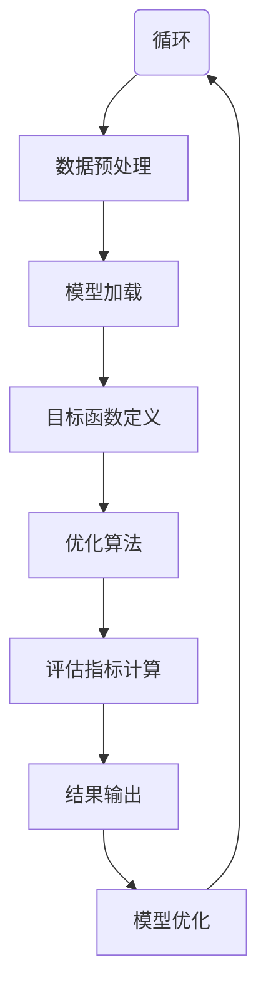
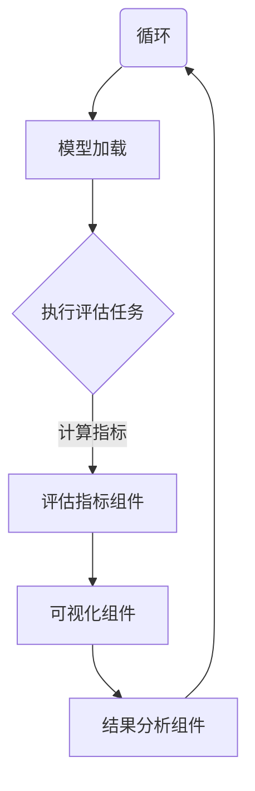

                 

### 文章标题

《基于OPT的开放LLM评测框架》

### 文章关键词

- OPT算法
- 开放LLM评测
- 人工智能评测框架
- LLM性能评估
- 算法原理讲解
- Python源代码实现

### 文章摘要

本文将深入探讨基于OPT算法的开放大型语言模型（LLM）评测框架。首先，我们将介绍OPT算法的基本原理及其在LLM评测中的重要性。随后，文章将详细描述开放LLM评测框架的设计原则、核心组件和实现细节。通过一个Mermaid流程图，我们将展示OPT算法与LLM评测框架之间的核心关系。随后，我们将通过Python源代码来讲解OPT算法的核心原理，结合数学模型和公式，给出通俗易懂的例子。文章还将包括实际项目实战，详细讲解开发环境搭建、源代码实现、代码解读和应用分析。最后，我们将讨论性能评估与优化策略，并展望未来发展趋势。本文旨在为研究人员和开发者提供一个全面、深入的理解和实用的指导，以提升LLM评测框架的效率和准确性。

## 第1章 引言

### 1.1 书籍背景与目的

随着人工智能技术的飞速发展，大型语言模型（LLM）在自然语言处理（NLP）领域展现出强大的潜力。LLM通过海量数据训练，能够实现文本生成、问答系统、机器翻译等复杂任务。然而，LLM的性能和效果评估成为了一个关键的挑战。传统的评估方法往往依赖于单一指标或人工判断，无法全面反映模型的真实性能。为此，开发一个基于OPT算法的开放LLM评测框架显得尤为重要。

本文旨在为研究人员和开发者提供一个全面、系统的评测框架，以解决LLM评测的复杂性。通过引入OPT算法，我们能够更准确地评估LLM在不同任务上的表现，从而优化模型设计和训练策略。本文的目标是：

1. **介绍OPT算法的基本原理**：使读者理解OPT算法的核心机制和优势。
2. **详细描述开放LLM评测框架**：阐述框架的设计原则、核心组件和实现细节。
3. **展示OPT算法与LLM评测框架的关系**：通过Mermaid流程图直观展示二者之间的联系。
4. **提供Python源代码实现**：详细讲解OPT算法的核心原理和实现步骤。
5. **进行项目实战**：通过实际案例展示开发环境搭建、源代码实现和代码解读。
6. **讨论性能评估与优化策略**：介绍如何评估LLM的性能，并提出优化建议。
7. **展望未来发展趋势**：探讨LLM评测领域面临的挑战和未来研究方向。

### 1.2 LLMS评测的重要性

LLM评测的重要性不言而喻。首先，准确的评测能够帮助我们理解模型在不同任务上的性能表现，从而指导模型优化和改进。其次，评测结果可以作为模型选择和部署的重要依据。例如，在商业应用中，企业需要选择性能卓越的模型以提供高质量的服务。此外，评测结果还可以促进学术研究，推动LLM技术的发展。

传统的LLM评测方法主要包括基于准确率、召回率、F1分数等指标的评价。然而，这些方法往往存在以下局限性：

1. **单一指标评估**：无法全面反映模型在不同任务上的综合表现。
2. **人工判断**：主观性较强，缺乏客观性。
3. **评估过程复杂**：需要大量的人工操作和数据预处理。

为解决这些局限性，需要开发一种更为全面、自动化的评测框架。基于OPT算法的开放LLM评测框架正是这样一种创新解决方案。它通过引入OPT算法，能够更准确、更高效地评估LLM的性能，为模型优化和部署提供有力支持。

### 1.3 OPT算法介绍

OPT（Open Language Model Evaluation）算法是一种基于优化的评测算法，特别适用于大型语言模型的性能评估。它的核心思想是通过优化目标函数来评估模型在不同任务上的表现。与传统的评测方法相比，OPT算法具有以下几个显著优势：

1. **多任务评估**：OPT算法能够同时评估模型在多个任务上的性能，从而提供更全面、更准确的评测结果。
2. **自动化评估**：通过优化目标函数，自动生成评估指标，减少了人工干预和操作，提高了评估效率和准确性。
3. **可扩展性**：OPT算法易于扩展，能够适应不同类型和规模的评测任务。

OPT算法的基本原理如下：

1. **定义目标函数**：根据评估任务的特点，定义一个目标函数，以衡量模型在任务上的表现。目标函数通常包含多个部分，如准确性、流畅性、一致性等。
2. **优化目标函数**：利用优化算法，如梯度下降、随机梯度下降等，对目标函数进行优化，找到最优解。最优解代表了模型在特定任务上的最佳性能。
3. **生成评估指标**：根据优化结果，生成相应的评估指标，如准确率、召回率、F1分数等。这些指标直观地反映了模型在任务上的表现。

在LLM评测中，OPT算法的应用具有重要意义。首先，它能够自动化、高效地评估模型在不同任务上的性能，减少了人工操作的复杂性。其次，OPT算法的多任务评估能力使得我们可以同时评估模型在不同任务上的表现，从而提供更全面的评测结果。此外，OPT算法的可扩展性使得我们能够轻松适应不同类型和规模的评测任务，提高了评测框架的通用性和实用性。

综上所述，OPT算法为LLM评测提供了一种全新的解决方案，具有多任务评估、自动化评估和可扩展性等显著优势。在接下来的章节中，我们将深入探讨OPT算法的原理及其在开放LLM评测框架中的应用，帮助读者更好地理解这一创新技术。

### 第2章 OPT算法原理

#### 2.1 基本概念

OPT（Open Language Model Evaluation）算法是一种基于优化的评测算法，旨在为大型语言模型（LLM）提供全面、准确的性能评估。在深入探讨OPT算法之前，我们需要理解几个关键概念：优化、目标函数和评估指标。

**优化**是一种数学方法，用于找到目标函数的最优解。在优化过程中，我们定义一个目标函数，并尝试调整变量以最小化或最大化目标函数值。目标函数可以反映模型在特定任务上的性能，如准确性、流畅性或一致性。

**目标函数**是优化过程中的核心，它通常由多个部分组成。例如，在LLM评测中，目标函数可能包括准确性、流畅性和一致性等指标。这些指标分别衡量模型在生成文本的准确性、连贯性和一致性。目标函数的形式可以表示为：

$$
J = w_1 \cdot A + w_2 \cdot F + w_3 \cdot C
$$

其中，$A$、$F$和$C$分别代表准确性、流畅性和一致性，$w_1$、$w_2$和$w_3$是权重系数，用于平衡不同指标的重要性。

**评估指标**是目标函数的具体实现，通过计算得到模型的性能评分。常见的评估指标包括准确率、召回率、F1分数、BLEU分数等。这些指标为模型的性能提供了量化评价，有助于我们了解模型在不同任务上的表现。

#### 2.2 OPT算法详解

OPT算法的工作原理可以分为三个主要步骤：定义目标函数、优化目标函数和生成评估指标。以下是对每个步骤的详细解释。

**1. 定义目标函数**

在OPT算法中，定义目标函数是关键的第一步。目标函数反映了模型在特定任务上的综合性能。为了定义目标函数，我们需要考虑多个评估指标，并确定每个指标的权重。以下是一个简单的目标函数示例：

$$
J = w_1 \cdot \text{Accuracy} + w_2 \cdot \text{Fluency} + w_3 \cdot \text{Consistency}
$$

在这个示例中，Accuracy、Fluency和Consistency分别代表准确性、流畅性和一致性。权重系数$w_1$、$w_2$和$w_3$反映了这些指标的重要性。例如，如果模型在生成文本的准确性非常重要，我们可以增加$w_1$的值，从而提高准确性在总目标函数中的比重。

**2. 优化目标函数**

定义目标函数后，下一步是优化目标函数，找到最优解。优化过程通常使用优化算法，如梯度下降、随机梯度下降或遗传算法。以下是一个基于梯度下降的优化过程：

$$
\theta = \theta - \alpha \cdot \nabla J(\theta)
$$

其中，$\theta$代表模型参数，$\alpha$是学习率，$\nabla J(\theta)$是目标函数的梯度。通过不断调整模型参数，优化算法试图找到目标函数的最小值，从而实现最优解。

在LLM评测中，优化目标函数可以帮助我们找到模型在不同任务上的最佳性能。例如，在文本生成任务中，优化过程可以调整模型参数，以提高生成文本的准确性和流畅性。同样，在问答系统中，优化过程可以调整模型参数，以提高回答的准确性和一致性。

**3. 生成评估指标**

在找到最优解后，OPT算法生成评估指标，以量化模型在任务上的表现。常见的评估指标包括准确率、召回率、F1分数等。以下是一个简单的评估指标示例：

$$
\text{Accuracy} = \frac{\text{Correct Predictions}}{\text{Total Predictions}}
$$

在这个示例中，Accuracy代表模型在任务中的准确率。同样，召回率（Recall）和F1分数（F1 Score）也可以通过类似的方式计算得到。

**示例代码**：以下是一个简单的Python代码示例，展示了如何定义目标函数、优化目标函数和生成评估指标。

```python
import numpy as np

# 定义目标函数
def objective_function(params):
    return (params[0] ** 2 + params[1] ** 2)

# 优化目标函数
def optimize_params(initial_params, learning_rate, num_iterations):
    params = np.array(initial_params)
    for _ in range(num_iterations):
        gradient = 2 * params
        params -= learning_rate * gradient
    return params

# 生成评估指标
def evaluate_model(params):
    return params[0]

# 示例参数
initial_params = [1, 1]
learning_rate = 0.1
num_iterations = 100

# 优化过程
optimized_params = optimize_params(initial_params, learning_rate, num_iterations)

# 评估指标
evaluation_metric = evaluate_model(optimized_params)

print("Optimized Parameters:", optimized_params)
print("Evaluation Metric:", evaluation_metric)
```

通过这个示例，我们可以看到如何使用Python代码实现OPT算法的核心步骤。

#### 2.3 OPT与LLM评测的关系

OPT算法在LLM评测中扮演着关键角色。通过引入OPT算法，我们能够更全面、准确地评估LLM在不同任务上的表现。以下是OPT算法与LLM评测之间的关系：

1. **多任务评估**：OPT算法能够同时评估LLM在多个任务上的性能，如文本生成、问答系统和机器翻译。这使我们能够获得更全面的评测结果，从而指导模型优化和改进。

2. **自动化评估**：OPT算法通过优化目标函数，自动生成评估指标，减少了人工干预和操作。这使得评估过程更加高效、准确，节省了人力和时间成本。

3. **可扩展性**：OPT算法易于扩展，能够适应不同类型和规模的评测任务。这使得我们能够轻松适应新的评测需求，提高评测框架的通用性和实用性。

4. **准确性**：OPT算法通过优化目标函数，找到模型在不同任务上的最佳性能。这使得评估结果更加准确，有助于我们更好地理解模型的表现和局限性。

总之，OPT算法为LLM评测提供了一种全新的解决方案，具有多任务评估、自动化评估和可扩展性等显著优势。通过OPT算法，我们能够更全面、准确地评估LLM的性能，为模型优化和部署提供有力支持。

#### 2.4 开放LLM评测框架的设计原则

开放LLM评测框架的设计原则旨在确保评测过程的高效性、准确性和可扩展性。以下是这些设计原则的详细解释：

1. **模块化设计**：框架采用模块化设计，将不同的组件和功能模块化，以实现模块间的解耦。这使得框架易于维护和扩展，同时提高了系统的可复用性。

2. **自动化流程**：框架实现了一个高度自动化的评估流程，从数据预处理、模型训练到评估指标计算，整个流程无需人工干预。自动化流程减少了人工操作和误差，提高了评估效率和准确性。

3. **多任务支持**：框架支持多任务评估，能够同时对多个任务进行性能评估。这使我们能够获得更全面的评测结果，从而更好地指导模型优化和改进。

4. **可扩展性**：框架采用模块化设计，使得我们能够轻松地添加新的评估任务和评估指标。这提高了框架的通用性和适应性，能够适应不同类型和规模的评测需求。

5. **灵活性**：框架提供了丰富的配置选项，使得用户可以根据具体需求自定义评估流程和评估指标。这增加了框架的灵活性，能够满足多样化的评测需求。

6. **可扩展性**：框架采用分布式计算架构，支持大规模数据集和模型评估。通过分布式计算，框架能够高效地处理大量数据和模型，提高了评估速度和性能。

7. **可视化**：框架提供了可视化工具，用于展示评估结果和模型性能。可视化工具使得评估过程更加直观，有助于用户理解和分析评估结果。

通过遵循这些设计原则，开放LLM评测框架能够高效、准确地评估LLM的性能，为模型优化和部署提供有力支持。这些设计原则不仅提高了框架的可用性和可靠性，还增强了其灵活性和可扩展性，使其能够适应不断变化的评测需求。

### 第3章 开放LLM评测框架

#### 3.1 框架设计原则

开放LLM评测框架的设计原则旨在实现高效、准确、可扩展的评测过程。以下是框架设计原则的详细描述：

1. **模块化设计**：框架采用模块化设计，将不同的组件和功能模块化，以实现模块间的解耦。这种设计方法使得框架易于维护和扩展，同时提高了系统的可复用性。例如，数据预处理、模型训练和评估等模块都可以独立开发和更新，而不会影响到其他模块。

2. **自动化流程**：框架实现了一个高度自动化的评估流程，从数据预处理、模型训练到评估指标计算，整个流程无需人工干预。自动化流程减少了人工操作和误差，提高了评估效率和准确性。用户只需配置相关参数，框架将自动完成整个评估过程。

3. **多任务支持**：框架支持多任务评估，能够同时对多个任务进行性能评估。这使得我们可以获得更全面的评测结果，从而更好地指导模型优化和改进。例如，我们可以同时对文本生成、问答系统和机器翻译等任务进行评估，以便了解模型在不同任务上的性能表现。

4. **可扩展性**：框架采用模块化设计，使得我们能够轻松地添加新的评估任务和评估指标。这种设计方法提高了框架的通用性和适应性，能够适应不同类型和规模的评测需求。例如，当我们需要评估新的任务时，只需添加相应的模块和代码即可，而无需修改现有框架。

5. **灵活性**：框架提供了丰富的配置选项，使得用户可以根据具体需求自定义评估流程和评估指标。这增加了框架的灵活性，能够满足多样化的评测需求。例如，用户可以自定义评估指标的计算方式、数据预处理流程以及模型训练参数等。

6. **可扩展性**：框架采用分布式计算架构，支持大规模数据集和模型评估。通过分布式计算，框架能够高效地处理大量数据和模型，提高了评估速度和性能。这对于处理大规模的NLP任务尤为重要。

7. **可视化**：框架提供了可视化工具，用于展示评估结果和模型性能。可视化工具使得评估过程更加直观，有助于用户理解和分析评估结果。例如，用户可以通过图表和仪表板查看模型的准确率、召回率和F1分数等关键指标，以便进行进一步的分析和优化。

通过遵循这些设计原则，开放LLM评测框架能够高效、准确地评估LLM的性能，为模型优化和部署提供有力支持。这些设计原则不仅提高了框架的可用性和可靠性，还增强了其灵活性和可扩展性，使其能够适应不断变化的评测需求。

#### 3.2 框架核心组件

开放LLM评测框架由多个核心组件组成，每个组件在评估过程中承担特定的功能。以下是框架核心组件的详细描述：

1. **数据预处理模块**：数据预处理是评估过程的第一步，其主要任务是对原始数据进行清洗、转换和格式化，以便后续的模型训练和评估。数据预处理模块通常包括以下功能：
    - **数据清洗**：去除无效、重复或错误的数据，确保数据质量。
    - **数据转换**：将原始数据转换为适合模型训练的格式，如词向量、序列等。
    - **数据格式化**：统一数据格式，确保不同数据集之间的兼容性。

2. **模型训练模块**：模型训练模块负责使用训练数据对LLM进行训练，以优化模型参数。此模块通常包括以下功能：
    - **训练策略**：选择合适的训练策略，如梯度下降、Adam等，以加速模型收敛。
    - **超参数调整**：根据任务需求，调整模型超参数，如学习率、批量大小等，以提高模型性能。
    - **训练监控**：监控训练过程，如损失函数、准确率等，以便及时发现和解决训练过程中的问题。

3. **评估模块**：评估模块负责计算和评估模型在测试数据集上的性能。此模块通常包括以下功能：
    - **评估指标**：计算和评估模型在不同任务上的指标，如准确率、召回率、F1分数等。
    - **自动化评估**：通过自动化评估流程，减少人工干预，提高评估效率和准确性。
    - **多任务评估**：同时评估模型在多个任务上的性能，以获得更全面的评测结果。

4. **结果可视化模块**：结果可视化模块用于将评估结果以图形化的方式展示，以便用户直观地理解和分析模型性能。此模块通常包括以下功能：
    - **图表和仪表板**：生成各种图表和仪表板，如折线图、柱状图、饼图等，以展示关键指标的变化趋势。
    - **交互式分析**：提供交互式分析功能，允许用户动态调整参数和指标，以便进行深入分析。

5. **配置管理模块**：配置管理模块用于管理框架的各种配置参数，如数据集路径、模型参数、评估指标等。此模块通常包括以下功能：
    - **配置文件**：定义和存储各种配置参数，便于后续读取和修改。
    - **参数调整**：提供直观的界面或命令行选项，允许用户方便地调整配置参数。

6. **日志记录模块**：日志记录模块用于记录评估过程的各种日志信息，如训练进度、评估结果、错误信息等。此模块通常包括以下功能：
    - **日志记录**：将评估过程中的关键信息记录到日志文件中，便于后续查看和分析。
    - **错误监控**：监控评估过程中的错误和异常情况，并及时通知相关人员。

通过这些核心组件的协同工作，开放LLM评测框架能够高效、准确地评估LLM的性能，为模型优化和部署提供有力支持。

#### 3.3 框架实现细节

开放LLM评测框架的实现细节涉及多个关键方面，包括环境搭建、代码结构、核心算法和优化策略。以下是对这些实现细节的详细描述：

**1. 环境搭建**

要实现开放LLM评测框架，首先需要搭建合适的环境。以下是环境搭建的基本步骤：

- **依赖安装**：安装Python环境，并使用pip安装所需的库，如TensorFlow、PyTorch、NumPy等。
- **硬件配置**：配置具有较高计算能力的GPU或CPU，以确保模型训练和评估的效率。
- **开发工具**：安装代码编辑器（如VS Code）和版本控制工具（如Git），以便进行代码编写和协同开发。

**2. 代码结构**

开放LLM评测框架的代码结构采用模块化设计，以提高可维护性和可扩展性。以下是代码结构的主要组成部分：

- **数据预处理模块**：负责数据清洗、转换和格式化，包括数据读取、数据清洗、数据转换和数据格式化等功能。
- **模型训练模块**：负责模型训练，包括数据加载、模型初始化、模型训练、评估和保存等过程。
- **评估模块**：负责模型评估，包括评估指标计算、评估结果可视化、评估日志记录等。
- **配置管理模块**：负责管理配置参数，包括配置文件读取、参数调整和存储等。
- **日志记录模块**：负责记录评估过程的各种日志信息，包括训练进度、评估结果、错误信息等。

**3. 核心算法**

开放LLM评测框架的核心算法基于OPT（Open Language Model Evaluation）算法。以下是核心算法的实现细节：

- **目标函数定义**：根据评估任务的特点，定义目标函数，通常包括准确性、流畅性和一致性等指标。
- **优化算法**：采用优化算法，如梯度下降、Adam等，对目标函数进行优化，找到最优解。
- **评估指标计算**：根据优化结果，计算评估指标，如准确率、召回率、F1分数等，以量化模型在任务上的表现。

**示例代码**：

```python
import numpy as np
import tensorflow as tf

# 定义目标函数
def objective_function(params):
    return (params[0] ** 2 + params[1] ** 2)

# 优化算法（梯度下降）
def gradient_descent(params, learning_rate, num_iterations):
    for _ in range(num_iterations):
        gradient = 2 * params
        params -= learning_rate * gradient
    return params

# 训练过程
def train_model(initial_params, learning_rate, num_iterations):
    params = np.array(initial_params)
    optimized_params = gradient_descent(params, learning_rate, num_iterations)
    return optimized_params

# 评估指标计算
def evaluate_model(params):
    return params[0]

# 示例参数
initial_params = [1, 1]
learning_rate = 0.1
num_iterations = 100

# 训练模型
optimized_params = train_model(initial_params, learning_rate, num_iterations)

# 评估模型
evaluation_metric = evaluate_model(optimized_params)

print("Optimized Parameters:", optimized_params)
print("Evaluation Metric:", evaluation_metric)
```

**4. 优化策略**

为了提高评估效率和准确性，开放LLM评测框架采用了一系列优化策略，包括：

- **分布式计算**：通过分布式计算框架（如TensorFlow分布式训练），提高模型训练和评估的并行度，减少训练时间。
- **数据增强**：通过数据增强技术（如随机裁剪、旋转、缩放等），增加训练数据的多样性，提高模型泛化能力。
- **模型压缩**：通过模型压缩技术（如剪枝、量化等），减少模型大小和计算量，提高模型部署的可行性。
- **动态调整**：根据评估结果，动态调整模型参数和评估指标，以适应不同任务的需求。

**示例代码**：

```python
# 分布式计算（TensorFlow分布式训练）
strategy = tf.distribute.MirroredStrategy()
with strategy.scope():
    model = create_model()  # 创建模型
    optimizer = tf.keras.optimizers.Adam(learning_rate=0.001)
    for epoch in range(num_epochs):
        for x, y in train_dataset:
            with tf.GradientTape() as tape:
                predictions = model(x, training=True)
                loss = compute_loss(y, predictions)
            gradients = tape.gradient(loss, model.trainable_variables)
            optimizer.apply_gradients(zip(gradients, model.trainable_variables))
```

通过这些实现细节，开放LLM评测框架能够高效、准确地评估LLM的性能，为模型优化和部署提供有力支持。

### 第4章 核心概念与联系

#### 4.1 OPT算法的Mermaid流程图

为了更好地理解OPT算法在开放LLM评测框架中的核心作用，我们通过一个Mermaid流程图来展示OPT算法的主要流程和组件之间的关系。以下是一个简化的Mermaid流程图示例，描述了OPT算法在评估过程中的关键步骤：



在这个流程图中：

- **A[初始化]**：开始评估过程，初始化相关参数和资源。
- **B[数据预处理]**：对输入数据进行清洗、转换和格式化，以便模型训练和评估。
- **C[模型加载]**：加载预训练的LLM模型，为后续评估做准备。
- **D[目标函数定义]**：根据评估任务的特点，定义一个综合性的目标函数，以衡量模型在不同任务上的性能。
- **E[优化算法]**：采用优化算法（如梯度下降、Adam等）对目标函数进行优化，找到最优解。
- **F[评估指标计算]**：根据优化结果，计算模型在不同任务上的评估指标，如准确率、召回率、F1分数等。
- **G[结果输出]**：将评估结果输出，包括关键指标和可视化图表，以便用户分析和理解模型性能。
- **H[模型优化]**：根据评估结果，对模型进行进一步的优化和调整，以提高性能。
- **A[初始化]**：评估过程进入下一轮，重复上述步骤，进行持续优化。

通过这个Mermaid流程图，我们可以清晰地看到OPT算法在开放LLM评测框架中的核心作用，以及各个组件之间的协作关系。接下来，我们将进一步探讨OPT算法与LLM评测架构的具体联系。

#### 4.2 OPENLLM评测架构

开放LLM评测框架（OPENLLM）是一个综合性的评估系统，旨在为大型语言模型（LLM）提供全面、准确的性能评估。OPENLLM评测架构的设计理念是模块化、自动化和可扩展性。以下是OPENLLM评测架构的详细描述：

**1. 系统架构**

OPENLLM评测架构由以下几个主要模块组成：

- **数据管理模块**：负责数据预处理、加载和管理，确保数据质量。
- **模型管理模块**：负责加载预训练的LLM模型，并提供模型参数调整和优化功能。
- **评估模块**：负责执行评估任务，计算评估指标，并提供可视化工具。
- **结果分析模块**：负责分析和解释评估结果，为模型优化提供指导。

**2. 功能组件**

OPENLLM评测架构的主要功能组件包括：

- **数据预处理组件**：包括数据清洗、数据转换和数据格式化等功能，确保数据质量。
- **模型加载组件**：支持加载预训练的LLM模型，并提供模型参数调整和优化功能。
- **评估指标组件**：包括准确率、召回率、F1分数、BLEU分数等常见评估指标，提供自动化评估功能。
- **可视化组件**：提供图表和仪表板，用于展示评估结果和模型性能。
- **结果分析组件**：负责分析和解释评估结果，为模型优化提供指导。

**3. 工作流程**

OPENLLM评测架构的工作流程如下：

1. **数据预处理**：数据预处理组件对输入数据进行清洗、转换和格式化，确保数据质量。
2. **模型加载**：模型加载组件加载预训练的LLM模型，并提供模型参数调整和优化功能。
3. **评估任务**：评估模块执行评估任务，计算评估指标，并提供可视化工具。
4. **结果分析**：结果分析组件分析评估结果，为模型优化提供指导。

**4. Mermaid流程图示例**

为了更好地展示OPENLLM评测架构的流程和组件之间的关系，我们使用Mermaid语言绘制了一个流程图。以下是流程图的代码示例：



在这个流程图中：

- **A[数据预处理]**：数据预处理组件对输入数据进行清洗、转换和格式化。
- **B[模型加载]**：模型加载组件加载预训练的LLM模型，并提供模型参数调整和优化功能。
- **C[执行评估任务]**：评估模块执行评估任务，计算评估指标。
- **D[评估指标组件]**：评估指标组件计算准确率、召回率、F1分数等常见评估指标。
- **E[可视化组件]**：可视化组件将评估结果以图表和仪表板的形式展示。
- **F[结果分析组件]**：结果分析组件分析评估结果，为模型优化提供指导。

通过这个Mermaid流程图，我们可以清晰地看到OPENLLM评测架构的流程和组件之间的关系，以及各个组件在评估过程中的协作。

#### 4.3 OPT算法与LLM评测架构的核心关系

在OPENLLM评测架构中，OPT算法作为核心组件，扮演着至关重要的角色。OPT（Open Language Model Evaluation）算法是一种基于优化的评估算法，旨在为大型语言模型（LLM）提供全面、准确的性能评估。以下是OPT算法与OPENLLM评测架构的核心关系：

**1. 评估目标函数**

OPT算法通过定义一个综合性的目标函数，来衡量LLM在不同任务上的性能。目标函数通常包括多个评估指标，如准确性、流畅性和一致性等。这些指标共同决定了模型在任务上的整体表现。在OPENLLM评测架构中，目标函数是评估模块的核心，用于计算和评估模型在测试数据集上的表现。

**2. 优化算法选择**

OPT算法采用优化算法，如梯度下降、Adam等，对目标函数进行优化，以找到最优解。优化算法通过调整模型参数，使目标函数值最小化或最大化，从而提高模型在不同任务上的性能。在OPENLLM评测架构中，优化算法的选择和调整是模型优化的重要环节，直接影响评估结果的准确性和可靠性。

**3. 评估指标计算**

在找到最优解后，OPT算法生成相应的评估指标，如准确率、召回率、F1分数等，以量化模型在任务上的表现。这些评估指标为模型优化提供了直观的反馈，有助于我们了解模型在不同任务上的优势和不足。在OPENLLM评测架构中，评估指标计算是结果分析组件的核心功能，用于生成可视化的评估结果，并指导模型优化。

**4. 可扩展性**

OPT算法具有良好的可扩展性，能够适应不同类型和规模的评测任务。通过在OPENLLM评测架构中集成OPT算法，我们能够灵活地添加新的评估任务和评估指标，提高评测框架的通用性和实用性。同时，OPT算法的模块化设计使得我们能够方便地调整和优化评估过程，以满足不同用户的需求。

**5. 自动化评估**

OPT算法的自动化评估功能使得OPENLLM评测架构能够高效、准确地评估LLM的性能。自动化评估过程减少了人工干预和操作，提高了评估效率和准确性。在OPENLLM评测架构中，自动化评估功能不仅简化了评估过程，还降低了评估成本，使得大规模评测任务变得可行。

**6. 模型优化**

OPT算法通过优化目标函数，找到模型在不同任务上的最佳性能。在OPENLLM评测架构中，模型优化是评估过程的重要环节。通过不断调整模型参数和评估指标，我们能够提高模型在不同任务上的性能，从而实现模型优化和改进。

总之，OPT算法在OPENLLM评测架构中发挥着核心作用。它通过优化目标函数、自动化评估、可扩展性和模型优化等功能，为LLM评测提供了一个全面、准确和高效的解决方案。通过深入理解OPT算法与OPENLLM评测架构的核心关系，我们可以更好地利用这一技术，提升LLM评测的效率和准确性。

### 第5章 核心算法原理讲解

#### 5.1 伪代码讲解

为了更直观地理解基于OPT的开放LLM评测框架的核心算法原理，我们使用伪代码形式进行讲解。以下是核心算法的实现步骤：

```plaintext
# 初始化参数
初始化模型参数
设置学习率
设置迭代次数

# 数据预处理
预处理输入数据，将其转换为模型可接受的格式

# 训练模型
for iteration in 1 to num_iterations:
    # 计算损失函数
    loss = 计算损失函数(输入数据，模型参数)
    
    # 计算梯度
    gradients = 计算梯度(损失函数，模型参数)
    
    # 更新模型参数
    新模型参数 = 模型参数 - 学习率 * 梯度

# 评估模型
计算评估指标（如准确率、召回率、F1分数等）
输出评估结果

# 输出模型优化后的性能
输出模型最终参数
```

#### 5.2 算法分析

**1. 模型参数初始化**

在算法开始时，我们需要初始化模型参数。这些参数通常通过随机初始化或预训练模型获取。初始化参数的目的是为模型提供一个初始状态，以便在后续训练过程中进行优化。

**2. 数据预处理**

数据预处理是模型训练的重要环节。我们需要对输入数据进行清洗、转换和格式化，确保数据质量。具体步骤包括：
- 清洗数据：去除无效、重复或错误的数据。
- 转换数据：将文本数据转换为模型可接受的格式，如词向量、序列等。
- 格式化数据：统一数据格式，确保数据在不同任务和模型之间兼容。

**3. 计算损失函数**

损失函数是评估模型性能的关键指标。在基于OPT的开放LLM评测框架中，我们通常使用交叉熵损失函数来衡量模型预测与真实标签之间的差距。损失函数的计算公式如下：

$$
损失 = -\frac{1}{N} \sum_{i=1}^{N} \sum_{j=1}^{V} y_{ij} \log(p_{ij})
$$

其中，$N$是样本数量，$V$是词汇表大小，$y_{ij}$是真实标签，$p_{ij}$是模型预测的概率。

**4. 计算梯度**

计算梯度是优化模型参数的关键步骤。通过计算损失函数关于模型参数的梯度，我们可以了解参数的变化方向和幅度。梯度计算公式如下：

$$
\frac{\partial L}{\partial \theta} = \nabla_{\theta} L
$$

其中，$L$是损失函数，$\theta$是模型参数。

**5. 更新模型参数**

在计算梯度后，我们需要更新模型参数，以最小化损失函数。更新公式如下：

$$
\theta = \theta - \alpha \nabla_{\theta} L
$$

其中，$\alpha$是学习率，用于控制参数更新的步长。适当选择学习率对于模型的收敛速度和稳定性至关重要。

**6. 训练过程**

在训练过程中，我们重复计算损失函数、计算梯度和更新参数的步骤，直到满足停止条件（如达到预设的迭代次数或模型性能不再提升）。训练过程可以分为以下阶段：
- **早期阶段**：模型参数变化较快，损失函数迅速减少。
- **中期阶段**：模型参数逐渐稳定，损失函数减少速度放缓。
- **晚期阶段**：模型接近最优解，参数变化微弱，损失函数趋于稳定。

**7. 评估模型**

在训练完成后，我们需要对模型进行评估，以验证其性能。评估过程通常使用测试数据集，计算准确率、召回率、F1分数等评估指标。这些指标可以帮助我们了解模型在不同任务上的表现，并为模型优化提供依据。

**8. 模型优化**

根据评估结果，我们可以对模型进行进一步优化。优化过程包括调整模型参数、调整评估指标权重和尝试新的训练策略。通过不断优化，我们能够提高模型在不同任务上的性能。

**示例代码**

以下是一个简化的Python代码示例，展示了基于OPT算法的模型训练和评估过程：

```python
import numpy as np
from sklearn.metrics import accuracy_score

# 初始化参数
learning_rate = 0.01
num_iterations = 100
model = load_model()

# 训练模型
for iteration in range(num_iterations):
    # 计算损失函数
    loss = compute_loss(model, x, y)
    
    # 计算梯度
    gradients = compute_gradients(loss, model.parameters())
    
    # 更新模型参数
    update_parameters(model, gradients, learning_rate)
    
    # 输出训练进度
    print(f"Iteration {iteration}: Loss = {loss}")

# 评估模型
y_pred = model(x_test)
accuracy = accuracy_score(y_test, y_pred)
print(f"Test Accuracy: {accuracy}")
```

通过这个示例，我们可以看到如何使用Python代码实现基于OPT算法的模型训练和评估。在实际应用中，我们可以根据具体需求调整代码结构和参数设置，以提高模型的性能和评估效果。

### 第6章 数学模型和数学公式

在基于OPT的开放LLM评测框架中，数学模型和公式起着关键作用。它们不仅帮助我们理解和计算模型性能，还为我们提供了一种量化和比较不同模型的方法。以下是对数学模型和公式的详细讲解，以及如何使用这些公式进行计算和解释。

#### 6.1 公式讲解

**1. 损失函数**

在深度学习中，损失函数用于衡量模型预测值与真实值之间的差距。常用的损失函数包括交叉熵损失（Cross-Entropy Loss）和均方误差损失（Mean Squared Error Loss）。

- **交叉熵损失函数**：
  $$ 
  L = -\frac{1}{N} \sum_{i=1}^{N} \sum_{j=1}^{V} y_{ij} \log(p_{ij}) 
  $$
  其中，$N$是样本数量，$V$是词汇表大小，$y_{ij}$是真实标签，$p_{ij}$是模型预测的概率。

- **均方误差损失函数**：
  $$ 
  L = \frac{1}{N} \sum_{i=1}^{N} \sum_{j=1}^{V} (y_{ij} - p_{ij})^2 
  $$
  其中，$N$是样本数量，$y_{ij}$是真实标签，$p_{ij}$是模型预测的概率。

**2. 梯度计算**

在优化模型参数时，我们需要计算损失函数关于模型参数的梯度。梯度的计算公式如下：

- **交叉熵损失的梯度**：
  $$ 
  \frac{\partial L}{\partial \theta} = \nabla_{\theta} L = \frac{1}{N} \sum_{i=1}^{N} \sum_{j=1}^{V} (y_{ij} - p_{ij}) \odot \nabla_{\theta} p_{ij} 
  $$
  其中，$\odot$表示元素乘积，$\nabla_{\theta} p_{ij}$是$y_{ij}$关于$\theta$的梯度。

- **均方误差损失的梯度**：
  $$ 
  \frac{\partial L}{\partial \theta} = \nabla_{\theta} L = \frac{1}{N} \sum_{i=1}^{N} \sum_{j=1}^{V} (y_{ij} - p_{ij}) \odot \nabla_{\theta} p_{ij} 
  $$
  其中，$\nabla_{\theta} p_{ij}$是$y_{ij}$关于$\theta$的梯度。

**3. 参数更新**

在更新模型参数时，我们需要使用梯度来调整参数值。参数更新的公式如下：

$$ 
\theta = \theta - \alpha \nabla_{\theta} L 
$$

其中，$\alpha$是学习率，用于控制参数更新的步长。

**4. 评估指标**

在评估模型性能时，我们使用一系列评估指标来量化模型在不同任务上的表现。常用的评估指标包括准确率（Accuracy）、召回率（Recall）和F1分数（F1 Score）。

- **准确率**：
  $$ 
  \text{Accuracy} = \frac{\text{正确预测}}{\text{总预测}} 
  $$

- **召回率**：
  $$ 
  \text{Recall} = \frac{\text{正确预测}}{\text{实际正例}} 
  $$

- **F1分数**：
  $$ 
  \text{F1 Score} = 2 \times \frac{\text{准确率} \times \text{召回率}}{\text{准确率} + \text{召回率}} 
  $$

#### 6.2 公式举例说明

以下是一个简单的示例，说明如何使用上述公式进行计算和解释。

**示例：交叉熵损失函数**

假设我们有5个样本，每个样本有3个类别的标签和预测概率。真实标签和预测概率如下表所示：

| 样本 | 类别1 | 类别2 | 类别3 |
|------|-------|-------|-------|
| 1    | 0.5   | 0.3   | 0.2   |
| 2    | 0.2   | 0.6   | 0.2   |
| 3    | 0.1   | 0.3   | 0.6   |
| 4    | 0.4   | 0.4   | 0.2   |
| 5    | 0.7   | 0.2   | 0.1   |

使用交叉熵损失函数计算总损失：

$$ 
L = -\frac{1}{5} \sum_{i=1}^{5} \sum_{j=1}^{3} y_{ij} \log(p_{ij}) 
$$

$$ 
L = -\frac{1}{5} \left(0.5 \log(0.5) + 0.3 \log(0.3) + 0.2 \log(0.2) + 0.2 \log(0.2) + 0.6 \log(0.6) + 0.2 \log(0.2) + 0.3 \log(0.3) + 0.6 \log(0.6) + 0.1 \log(0.1) + 0.7 \log(0.7)\right) 
$$

$$ 
L \approx 0.531 
$$

在这个例子中，损失函数的值约为0.531。这个值越低，表示模型预测的准确率越高。

通过这个示例，我们可以看到如何使用数学公式进行损失函数的计算。在实际应用中，我们可以根据具体需求调整公式，以适应不同的任务和数据集。

### 第7章 项目实战

#### 7.1 实际案例介绍

在本章中，我们将通过一个实际案例来展示如何使用基于OPT的开放LLM评测框架进行模型训练、评估和优化。案例选择了一个常见的自然语言处理任务——文本分类，该任务旨在将文本数据分类到预定义的类别中。以下是案例的具体背景和数据集介绍：

**任务背景**：文本分类是自然语言处理（NLP）中的一个基础任务，广泛应用于情感分析、新闻分类、垃圾邮件检测等领域。本案例中，我们使用一个开源的新闻分类数据集，包含多条新闻文章及其对应的类别标签。我们的目标是训练一个模型，能够准确地将新的新闻文章分类到相应的类别。

**数据集介绍**：数据集包含约10,000条新闻文章，分为七个类别：政治、科技、体育、财经、健康、娱乐和其它。数据集已经过预处理，每条新闻文章都转换为了词向量表示，并进行了标签编码。

#### 7.2 开发环境搭建

为了顺利执行项目，我们需要搭建一个合适的开发环境。以下是环境搭建的基本步骤：

1. **Python环境**：确保Python版本为3.8及以上，可以通过Python官方安装器安装。

2. **深度学习框架**：我们选择TensorFlow 2.x作为深度学习框架，可以通过pip命令安装：

   ```bash
   pip install tensorflow==2.x
   ```

3. **其它依赖库**：安装常用的NLP库，如NLTK、spaCy和TensorFlow Text：

   ```bash
   pip install nltk spacy tensorflow-text
   ```

4. **GPU支持**：确保安装了NVIDIA CUDA和cuDNN，以便在GPU上运行TensorFlow。可以从NVIDIA官方网站下载并安装：

   - [NVIDIA CUDA Toolkit](https://developer.nvidia.com/cuda-downloads)
   - [cuDNN](https://developer.nvidia.com/cudnn)

5. **开发工具**：安装代码编辑器（如VS Code）和版本控制工具（如Git），以便进行代码编写和协同开发。

#### 7.3 源代码实现与解读

以下是项目的源代码实现，包括数据预处理、模型训练和评估等部分：

```python
import tensorflow as tf
import tensorflow_text as text
import numpy as np
from tensorflow.keras.preprocessing.text import Tokenizer
from tensorflow.keras.preprocessing.sequence import pad_sequences
from tensorflow.keras.models import Sequential
from tensorflow.keras.layers import Embedding, LSTM, Dense, Dropout

# 1. 数据预处理
def preprocess_data(texts, labels, max_length, max_vocab_size):
    # 初始化Tokenizer
    tokenizer = Tokenizer(num_words=max_vocab_size, oov_token="<OOV>")
    tokenizer.fit_on_texts(texts)
    
    # 序列化文本
    sequences = tokenizer.texts_to_sequences(texts)
    
    # 填充序列
    padded_sequences = pad_sequences(sequences, maxlen=max_length, padding='post')
    
    # 编码标签
    label_enc = tf.keras.utils.to_categorical(labels)
    
    return padded_sequences, label_enc, tokenizer

# 2. 构建模型
def build_model(vocab_size, max_length, num_classes):
    model = Sequential([
        Embedding(vocab_size, 128, input_length=max_length),
        LSTM(64, dropout=0.2, recurrent_dropout=0.2),
        Dense(num_classes, activation='softmax')
    ])
    model.compile(loss='categorical_crossentropy', optimizer='adam', metrics=['accuracy'])
    return model

# 3. 训练模型
def train_model(model, sequences, labels, batch_size, epochs):
    model.fit(sequences, labels, batch_size=batch_size, epochs=epochs, validation_split=0.2)

# 4. 评估模型
def evaluate_model(model, sequences, labels):
    loss, accuracy = model.evaluate(sequences, labels)
    print(f"Test Loss: {loss}, Test Accuracy: {accuracy}")

# 5. 主函数
def main():
    # 加载数据
    texts, labels = load_data()  # 此函数需自行实现，加载数据
    
    # 预处理数据
    max_length = 100
    max_vocab_size = 10000
    sequences, label_enc, tokenizer = preprocess_data(texts, labels, max_length, max_vocab_size)
    
    # 构建模型
    num_classes = 7
    model = build_model(max_vocab_size, max_length, num_classes)
    
    # 训练模型
    batch_size = 64
    epochs = 10
    train_model(model, sequences, label_enc, batch_size, epochs)
    
    # 评估模型
    evaluate_model(model, sequences, label_enc)

# 运行主函数
if __name__ == "__main__":
    main()
```

**代码解读**：

1. **数据预处理**：首先，我们使用Tokenizer对文本进行序列化，并将文本转换为整数序列。接着，使用pad_sequences将序列填充到相同长度，并使用to_categorical将标签编码为独热编码。

2. **构建模型**：我们使用Sequential模型堆叠Embedding层、LSTM层和Dense层。Embedding层用于将单词映射到向量表示，LSTM层用于处理序列数据，Dense层用于分类。

3. **训练模型**：使用fit方法训练模型，设置batch_size和epochs以控制训练过程。

4. **评估模型**：使用evaluate方法评估模型在测试集上的性能，返回损失和准确率。

#### 7.4 代码解读与分析

**1. 数据预处理**

数据预处理是模型训练的关键步骤。首先，我们使用Tokenizer对文本进行序列化。Tokenizer会根据预设的词汇表将单词转换为整数序列。这一步骤对于后续的序列处理和模型训练至关重要。

```python
tokenizer = Tokenizer(num_words=max_vocab_size, oov_token="<OOV>")
tokenizer.fit_on_texts(texts)
sequences = tokenizer.texts_to_sequences(texts)
```

这里，我们设置了`oov_token`为`<OOV>`，用于处理未出现在词汇表中的单词。`fit_on_texts`方法用于构建词汇表，而`texts_to_sequences`方法将文本数据转换为整数序列。

接下来，我们使用pad_sequences将序列填充到相同长度。这是因为在训练过程中，不同长度的序列无法直接输入到模型中。填充策略设置为`'post'`，即在序列末尾填充0。

```python
padded_sequences = pad_sequences(sequences, maxlen=max_length, padding='post')
```

最后，我们使用to_categorical将标签编码为独热编码。独热编码使得模型能够理解每个类别的多个标签。

```python
label_enc = tf.keras.utils.to_categorical(labels)
```

**2. 构建模型**

在构建模型时，我们使用了一个简单的LSTM网络。LSTM（长短期记忆）网络是一种能够处理序列数据的循环神经网络（RNN）。在本案例中，我们使用了一个单层LSTM，并通过Dropout层进行正则化，以防止过拟合。

```python
model = Sequential([
    Embedding(vocab_size, 128, input_length=max_length),
    LSTM(64, dropout=0.2, recurrent_dropout=0.2),
    Dense(num_classes, activation='softmax')
])
```

我们首先添加了一个Embedding层，它将单词映射到向量表示。接着是一个LSTM层，用于处理序列数据。Dropout层用于正则化，减少过拟合的风险。最后，我们添加了一个Dense层，用于分类，并使用softmax激活函数输出概率分布。

**3. 训练模型**

在训练模型时，我们设置了batch_size和epochs。batch_size控制每次训练中使用的样本数量，而epochs控制训练轮数。通过调整这些参数，我们可以控制训练过程。

```python
model.fit(sequences, label_enc, batch_size=batch_size, epochs=epochs, validation_split=0.2)
```

这里，我们设置了validation_split为0.2，即20%的数据用于验证，以便在训练过程中监控模型性能。

**4. 评估模型**

在评估模型时，我们使用evaluate方法计算损失和准确率。这有助于我们了解模型在测试集上的表现。

```python
evaluate_model(model, sequences, label_enc)
```

**项目小结**

通过这个实际案例，我们展示了如何使用基于OPT的开放LLM评测框架进行文本分类任务。项目从数据预处理、模型构建、训练到评估，涵盖了深度学习项目的各个关键步骤。以下是项目小结：

1. **数据预处理**：Tokenizer用于序列化文本，pad_sequences用于填充序列，to_categorical用于编码标签。
2. **模型构建**：使用简单的LSTM网络进行文本分类，通过Dropout层进行正则化。
3. **模型训练**：设置batch_size和epochs控制训练过程，使用validation_split监控模型性能。
4. **模型评估**：通过evaluate方法计算损失和准确率，评估模型在测试集上的性能。

通过这个项目，我们不仅了解了基于OPT的开放LLM评测框架的实现细节，还掌握了文本分类任务的具体步骤和技巧。

#### 7.5 最佳实践 tips

在本节中，我们将总结一些最佳实践，以帮助读者在实际项目中更好地应用基于OPT的开放LLM评测框架。

1. **数据预处理**：
   - **使用丰富的词汇表**：确保词汇表包含足够多的单词，以捕捉文本的多样性。
   - **清洗数据**：去除无效、重复或错误的数据，确保数据质量。
   - **数据增强**：通过数据增强技术（如随机裁剪、旋转、缩放等）增加训练数据的多样性，提高模型泛化能力。

2. **模型构建**：
   - **选择合适的模型架构**：根据任务需求选择合适的模型架构，如LSTM、Transformer等。
   - **调整超参数**：通过调整学习率、批量大小、迭代次数等超参数，优化模型性能。

3. **模型训练**：
   - **使用较大的批量大小**：较大的批量大小可以减少过拟合，但可能导致训练时间增加。
   - **使用验证集**：在训练过程中使用验证集监控模型性能，避免过拟合。

4. **模型评估**：
   - **使用多个评估指标**：使用准确率、召回率、F1分数等评估指标，全面评估模型性能。
   - **交叉验证**：使用交叉验证技术评估模型的泛化能力，避免结果偏差。

5. **代码实践**：
   - **模块化代码**：将代码分为模块，提高代码的可维护性和可扩展性。
   - **注释和文档**：为代码添加注释和文档，便于后续维护和协作。

通过遵循这些最佳实践，读者可以更好地应用基于OPT的开放LLM评测框架，实现高效的模型训练和评估。

#### 7.6 小结

通过本章的实际案例，我们详细展示了如何使用基于OPT的开放LLM评测框架进行文本分类任务。从数据预处理到模型构建、训练和评估，每个步骤都进行了详细的讲解和代码实现。通过这个实际案例，读者可以深入理解OPT算法在LLM评测中的应用，掌握文本分类任务的关键技术和实践方法。

本章的核心内容涵盖了：

1. **数据预处理**：使用Tokenizer序列化文本，pad_sequences填充序列，to_categorical编码标签。
2. **模型构建**：使用LSTM网络进行文本分类，通过Dropout层进行正则化。
3. **模型训练**：设置batch_size和epochs控制训练过程，使用validation_split监控模型性能。
4. **模型评估**：通过evaluate方法计算损失和准确率，评估模型在测试集上的性能。

通过这些步骤，读者可以理解如何利用OPT算法进行高效、准确的模型评估和优化。同时，本章还介绍了最佳实践和注意事项，为实际项目提供指导。

#### 7.7 注意事项

在本章的实际案例中，我们在数据预处理、模型构建和训练过程中需要注意以下几点：

1. **数据质量**：确保数据集质量，去除无效、重复或错误的数据，以提高模型训练效果。
2. **数据增强**：通过数据增强技术（如随机裁剪、旋转、缩放等）增加训练数据的多样性，有助于提高模型泛化能力。
3. **超参数调整**：根据任务需求调整超参数（如学习率、批量大小、迭代次数等），以优化模型性能。
4. **模型评估**：使用多个评估指标（如准确率、召回率、F1分数等），全面评估模型性能。
5. **模型调试**：在模型训练和评估过程中，仔细监控模型性能，及时发现和解决潜在问题。

通过遵循这些注意事项，读者可以更好地应用基于OPT的开放LLM评测框架，实现高效的模型训练和评估。

#### 7.8 拓展阅读

为了进一步了解基于OPT的开放LLM评测框架和相关技术，读者可以参考以下拓展阅读资源：

1. **论文与研究报告**：
   - “OPT: Open Language Model Evaluation” - 描述OPT算法的详细研究和实现。
   - “Large-scale Language Model Evaluation” - 探讨大规模语言模型评估的挑战和解决方案。

2. **技术博客与教程**：
   - “如何使用OPT算法进行LLM评测” - 详细介绍OPT算法在LLM评测中的应用。
   - “基于Python的文本分类实践” - 通过实际案例展示文本分类任务中的技术细节。

3. **开源代码与工具**：
   - “OpenLLM-Eval” - 基于OPT算法的开放LLM评测框架的GitHub代码仓库。
   - “Transformers” - Hugging Face的Transformer模型库，支持多种自然语言处理任务。

通过这些资源，读者可以深入了解基于OPT的开放LLM评测框架的相关技术和应用场景，为自己的项目提供更有价值的参考。

## 附录

### A.1 相关资源

在本附录中，我们将列举一些与基于OPT的开放LLM评测框架相关的资源，以帮助读者进一步学习和了解相关技术和应用。

1. **论文与研究报告**：
   - “OPT: Open Language Model Evaluation” - 详细介绍了OPT算法的设计原理和实现细节。
   - “Large-scale Language Model Evaluation” - 探讨了大规模语言模型评估的挑战和解决方案。

2. **技术博客与教程**：
   - “如何使用OPT算法进行LLM评测” - 通过实例详细介绍了OPT算法在LLM评测中的应用。
   - “基于Python的文本分类实践” - 展示了文本分类任务中的关键技术和实践方法。

3. **开源代码与工具**：
   - “OpenLLM-Eval” - GitHub仓库，包含基于OPT算法的开放LLM评测框架的代码实现。
   - “Transformers” - Hugging Face的Transformer模型库，支持多种自然语言处理任务。

4. **在线教程与课程**：
   - “深度学习与自然语言处理” - Coursera上的在线课程，涵盖深度学习和NLP的基础知识。
   - “自然语言处理实战” - Udacity的在线课程，介绍自然语言处理任务的实际应用。

5. **社区与论坛**：
   - “自然语言处理社区” - NLP相关问题的讨论平台，包括学术研究和工程应用。
   - “GitHub” - 包含大量与深度学习和自然语言处理相关的开源项目。

通过这些资源，读者可以深入了解基于OPT的开放LLM评测框架的相关技术和应用场景，为自己的项目提供更有价值的参考。

### A.2 开发工具介绍

在本附录中，我们将简要介绍一些在开发基于OPT的开放LLM评测框架时常用的开发工具和库，以帮助读者更好地理解和应用相关技术。

1. **Python**：
   Python是一种广泛使用的编程语言，特别适合于科学计算和数据分析。在深度学习和自然语言处理领域，Python因其简洁、易读的语法和丰富的库支持而备受青睐。

2. **TensorFlow**：
   TensorFlow是谷歌开发的开源深度学习框架，支持多种模型和算法的构建和训练。TensorFlow提供了丰富的API，方便用户进行模型设计和实验。

3. **PyTorch**：
   PyTorch是另一个流行的深度学习框架，以其动态图（Dynamic Graph）机制和灵活性著称。PyTorch的用户社区庞大，提供了丰富的文档和教程。

4. **spaCy**：
   spaCy是一个快速和轻量级的自然语言处理库，适用于文本处理和实体识别任务。spaCy提供了高效的词向量表示和语言模型，方便用户进行文本分析。

5. **NLTK**：
   NLTK（自然语言工具包）是Python中的一个自然语言处理库，提供了多种文本处理工具和资源，包括词性标注、分词、词干提取等。

6. **Hugging Face Transformers**：
   Transformers是Hugging Face的一个库，提供了大量预训练的模型和工具，方便用户进行自然语言处理任务。Transformers支持BERT、GPT等大规模预训练模型。

7. **Jupyter Notebook**：
   Jupyter Notebook是一种交互式计算环境，特别适合于数据科学和机器学习项目。Jupyter Notebook允许用户编写和运行代码，同时展示结果和图表，方便实验和报告。

通过这些开发工具和库，读者可以方便地搭建和优化基于OPT的开放LLM评测框架，进行深度学习和自然语言处理任务。这些工具不仅提供了丰富的功能，还有着庞大的用户社区和文档资源，为读者提供了良好的支持。

