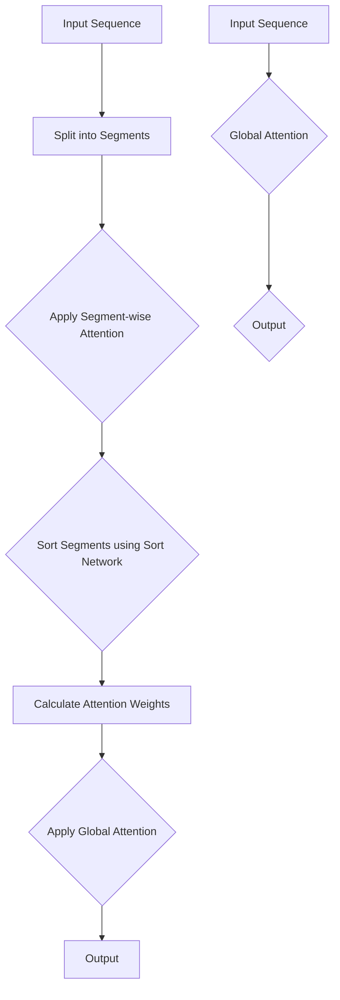

                 

### 文章标题：基于Reformer的高效LLM评测模型

在当今人工智能领域，自然语言处理（NLP）技术取得了显著进展，尤其是大型语言模型（LLM）在多个任务中表现出色。然而，随着模型复杂度的增加，如何对LLM进行高效评测成为了一个关键问题。本文将深入探讨一种新兴的模型——Reformer，以及如何基于Reformer构建一个高效LLM评测模型。

Reformer是一种用于处理序列数据的动态自注意力模型，它通过可扩展的排序网络来优化Transformer模型，使其在长序列处理上更加高效。本文将首先介绍Reformer的基本原理，然后分析如何将其应用于LLM评测，并通过Python代码详细展示核心算法和数学模型。最后，我们将通过一个实际案例来展示如何使用Reformer进行高效LLM评测。

### 文章关键词

- **Reformer**
- **高效LLM评测模型**
- **Transformer**
- **序列处理**
- **自然语言处理**
- **数学模型**
- **Python代码**

### 文章摘要

本文旨在介绍基于Reformer的高效LLM评测模型。首先，我们介绍了Reformer的基本原理和架构，以及其与传统Transformer的区别。接着，我们详细分析了如何将Reformer应用于LLM评测，并使用Python代码和数学模型展示了核心算法的实现。最后，通过一个实际案例，我们展示了如何使用Reformer模型进行高效LLM评测，并对其进行了详细解析。本文的目标是为研究人员和工程师提供一种新的视角和工具，以应对复杂且庞大的LLM评测任务。

### 背景介绍

在过去的几年中，自然语言处理（NLP）领域取得了显著的进步，这一进步很大程度上归功于Transformer模型的引入。Transformer模型作为一种基于自注意力机制的新型神经网络架构，颠覆了传统的循环神经网络（RNN）和长短期记忆网络（LSTM），在诸如机器翻译、文本生成和问答系统等任务上表现出了前所未有的效果。

Transformer的核心思想是通过对输入序列的每个位置进行全局 attentions，从而捕捉序列中的长距离依赖关系。这种自注意力机制使得模型能够有效地处理长文本，同时避免了传统RNN和LSTM在长序列处理上的梯度消失问题。然而，随着模型的复杂度和序列长度的增加，Transformer模型也面临了新的挑战。尤其是在大规模语言模型（LLM）的训练和评测过程中，模型的计算资源和时间成本急剧增加，这给实际应用带来了不小的困难。

为了应对这些挑战，研究者们提出了许多改进方案，其中之一就是Reformer模型。Reformer（Recurrent Models with Enhance dself-Attention for Language Understanding）是一种基于Transformer的自注意力模型，旨在提高序列处理效率。Reformer通过引入排序网络（Sort Network）和分段注意力（Segment-wise Attention），在保持Transformer模型优势的同时，显著提升了模型在长序列处理上的性能。

### 核心概念与联系

首先，我们简要介绍Reformer模型的基本概念和原理。Reformer的核心在于其动态自注意力机制，这种机制允许模型在处理序列数据时，根据序列中的每个位置和上下文动态调整注意力权重。相较于传统的Transformer模型，Reformer通过分段注意力（Segment-wise Attention）和排序网络（Sort Network）来实现这一目标。

#### 分段注意力（Segment-wise Attention）

分段注意力是一种将输入序列划分为多个段（Segments）的方法，每个段内部的元素可以通过局部注意力机制进行相互关联。这种分段方法降低了模型处理长序列时的计算复杂度，从而提高了效率。在Reformer中，分段注意力通过计算每个段内部的注意力权重来实现。具体来说，给定一个输入序列\[X\]，模型首先将其划分为多个段\[X_1, X_2, \ldots, X_n\]，然后对每个段内部进行自注意力计算。

#### 排序网络（Sort Network）

排序网络是一种用于高效计算序列排序的算法，其核心思想是通过一系列二分查找和合并步骤，将序列元素进行排序。在Reformer中，排序网络被用于优化自注意力计算。具体来说，排序网络将输入序列\[X\]按照某种规则进行重新排序，从而减少计算注意力权重时需要访问的元素数量，从而提高计算效率。

#### Reformer与传统Transformer的比较

Reformer与传统Transformer模型在架构和性能上有显著差异。传统Transformer模型采用全局自注意力机制，每个位置都需要计算与整个序列的注意力权重，这导致计算复杂度随着序列长度的增加而呈平方增长。而Reformer通过分段注意力和排序网络，将复杂度降低为线性增长。此外，Reformer还引入了其他优化措施，如线性填充（Linear Filling）和稀疏注意力（Sparse Attention），进一步提高了模型在长序列处理上的性能。

为了更好地理解Reformer与传统Transformer之间的关系，我们可以使用Mermaid流程图来展示两者在自注意力计算上的差异。以下是一个简化的Mermaid流程图示例：



在这个流程图中，A表示输入序列，B表示将输入序列划分为多个段，C表示在每个段内部进行自注意力计算，D表示使用排序网络对段进行排序，E表示计算注意力权重，F表示应用全局注意力，G表示输出结果。H表示传统Transformer的输入序列，I表示全局注意力计算，J表示输出结果。

通过这个流程图，我们可以清晰地看到Reformer在自注意力计算上的优化策略。与传统Transformer相比，Reformer通过分段注意力、排序网络和优化措施，显著提高了模型在长序列处理上的效率。

### 核心算法原理讲解

#### Reformer的自注意力机制

Reformer模型的核心是动态自注意力机制，这种机制允许模型在处理序列数据时，根据序列中的每个位置和上下文动态调整注意力权重。自注意力机制的实现通常包括以下几个步骤：

1. **输入嵌入**：将输入序列\[X\]映射为嵌入向量\[E\]，每个嵌入向量表示序列中的位置信息。
2. **查询、键、值向量的生成**：在Reformer中，每个位置\(i\)都生成一个查询向量\[Q_i\]、一个键向量\[K_i\]和一个值向量\[V_i\]。这些向量通常由嵌入向量\[E_i\]通过线性变换得到。
3. **自注意力计算**：对于每个位置\(i\)，计算它与序列中其他位置之间的注意力权重\[a_{ij}\]。注意力权重通常通过点积计算得到：
   \[
   a_{ij} = \frac{<Q_i, K_j>}{\sqrt{d_k}}
   \]
   其中，\(d_k\)是键向量的维度，<\(·, ·\)>表示点积。
4. **加权和**：根据注意力权重对值向量进行加权求和，得到每个位置\(i\)的输出向量\[O_i\]：
   \[
   O_i = \sum_j a_{ij} V_j
   \]

#### 分段注意力

Reformer通过分段注意力（Segment-wise Attention）来提高序列处理效率。分段注意力将输入序列划分为多个段，每个段内部的元素通过局部注意力机制进行相互关联。具体实现步骤如下：

1. **输入序列分段**：将输入序列\[X\]划分为多个段\[X_1, X_2, \ldots, X_n\]。
2. **分段自注意力计算**：对于每个段\[X_i\]，内部元素通过自注意力计算得到段内部的表示\[H_i\]：
   \[
   H_i = \text{Self-Attention}(X_i)
   \]
3. **段间注意力计算**：段间的元素通过注意力权重进行相互关联，计算全局表示\[H\]：
   \[
   H = \text{Multi-head Attention}(\{H_i\})
   \]

#### 排序网络

Reformer中的排序网络（Sort Network）用于优化自注意力计算。排序网络的基本思想是通过一系列二分查找和合并步骤，将序列元素进行排序，从而减少计算注意力权重时需要访问的元素数量。具体实现步骤如下：

1. **序列重新排序**：将输入序列\[X\]按照某种规则进行重新排序。
2. **排序网络构建**：构建一个由多个二分查找和合并步骤组成的排序网络。
3. **序列排序**：通过排序网络对序列\[X\]进行排序。

#### 线性填充和稀疏注意力

Reformer还引入了线性填充（Linear Filling）和稀疏注意力（Sparse Attention）来进一步优化模型性能。线性填充通过将序列中的空位填充为特定值，减少了计算注意力权重时的空值计算。稀疏注意力通过只计算非零注意力权重，减少了计算复杂度。

#### Python代码实现

以下是一个简化的Python代码示例，展示了Reformer模型中的自注意力计算和分段注意力实现：

```python
import numpy as np

def self_attention(q, k, v, scale_factor):
    """
    自注意力计算
    :param q: 查询向量
    :param k: 键向量
    :param v: 值向量
    :param scale_factor: 缩放因子
    :return: 加权和的输出向量
    """
    # 点积计算注意力权重
    attention_weights = np.dot(q, k.T) / scale_factor
    #softmax计算归一化权重
    attention_weights = np.softmax(attention_weights)
    # 加权和计算输出向量
    output = np.dot(attention_weights, v)
    return output

def segment_attention(inputs, hidden_size, num_heads, scale_factor):
    """
    分段注意力计算
    :param inputs: 输入序列
    :param hidden_size: 嵌入向量维度
    :param num_heads: 注意力头数量
    :param scale_factor: 缩放因子
    :return: 分段注意力输出
    """
    # 初始化输出
    segment_outputs = []
    # 对每个分段进行自注意力计算
    for segment in inputs:
        q = k = v = segment
        q = q.reshape(-1, hidden_size)
        k = k.reshape(-1, hidden_size)
        v = v.reshape(-1, hidden_size)
        output = self_attention(q, k, v, scale_factor)
        segment_outputs.append(output)
    # 段间注意力计算
    global_output = self_attention(segment_outputs, segment_outputs, segment_outputs, scale_factor)
    return global_output

# 示例参数
hidden_size = 512
num_heads = 8
scale_factor = np.sqrt(hidden_size)

# 输入序列
input_sequence = np.random.rand(10, hidden_size)

# 分段注意力计算
segment_outputs = segment_attention(input_sequence, hidden_size, num_heads, scale_factor)

print(segment_outputs)
```

在这个示例中，我们定义了`self_attention`函数用于计算自注意力，`segment_attention`函数用于实现分段注意力。通过这个示例，我们可以直观地看到自注意力和分段注意力的计算过程。

### 数学模型与公式

Reformer模型在数学上具有严密的框架，其核心在于自注意力机制的实现。下面我们将详细介绍Reformer的数学模型，并展示相关的公式。

#### 自注意力计算

自注意力计算是Reformer模型的基础，其核心公式如下：

$$
a_{ij} = \frac{<Q_i, K_j>}{\sqrt{d_k}}
$$

其中，\(a_{ij}\)表示位置\(i\)与位置\(j\)之间的注意力权重，\(Q_i\)和\(K_j\)分别表示位置\(i\)和位置\(j\)的查询向量和键向量，\(d_k\)是键向量的维度。点积<\(Q_i, K_j\)>表示查询向量和键向量之间的内积。

为了实现自注意力，我们需要对输入序列进行嵌入，并生成查询、键和值向量。假设输入序列的长度为\(N\)，每个位置的嵌入向量维度为\(d_e\)，那么嵌入矩阵\(E\)可以表示为：

$$
E = [e_1, e_2, \ldots, e_N]
$$

其中，\(e_i\)表示位置\(i\)的嵌入向量。

接下来，通过线性变换生成查询、键和值向量：

$$
Q_i = W_Q E_i \\
K_i = W_K E_i \\
V_i = W_V E_i
$$

其中，\(W_Q\)、\(W_K\)和\(W_V\)分别是查询、键和值向量的权重矩阵。

#### 自注意力加权求和

在自注意力计算完成后，我们需要对值向量进行加权求和，得到每个位置的输出向量。输出向量\(O_i\)的计算公式如下：

$$
O_i = \sum_j a_{ij} V_j
$$

其中，\(a_{ij}\)是位置\(i\)与位置\(j\)之间的注意力权重，\(V_j\)是位置\(j\)的值向量。

#### 分段注意力

Reformer通过分段注意力（Segment-wise Attention）来优化自注意力计算，将输入序列划分为多个段。每个段内部的元素通过局部注意力机制进行相互关联。分段注意力的实现包括以下步骤：

1. **输入序列分段**：将输入序列\[X\]划分为多个段\[X_1, X_2, \ldots, X_n\]。

2. **分段自注意力计算**：对于每个段\[X_i\]，内部元素通过自注意力计算得到段内部的表示\[H_i\]：

$$
H_i = \text{Self-Attention}(X_i)
$$

3. **段间注意力计算**：段间的元素通过注意力权重进行相互关联，计算全局表示\[H\]：

$$
H = \text{Multi-head Attention}(\{H_i\})
$$

#### 排序网络

Reformer中的排序网络（Sort Network）用于优化自注意力计算。排序网络的基本思想是通过一系列二分查找和合并步骤，将序列元素进行排序，从而减少计算注意力权重时需要访问的元素数量。排序网络的计算复杂度是线性的，而传统自注意力机制的复杂度是二次的。

排序网络的具体实现可以参考经典的“两两比较排序”（Pairwise Sort）算法。该算法通过递归地比较和合并序列中的元素，逐步构建出一个排序网络。

#### 线性填充和稀疏注意力

Reformer还引入了线性填充（Linear Filling）和稀疏注意力（Sparse Attention）来进一步优化模型性能。线性填充通过将序列中的空位填充为特定值，减少了计算注意力权重时的空值计算。稀疏注意力通过只计算非零注意力权重，减少了计算复杂度。

线性填充的实现如下：

$$
V_i = \text{Linear Filling}(E_i)
$$

其中，\(V_i\)是填充后的值向量，\(E_i\)是原始的嵌入向量。

稀疏注意力的实现如下：

$$
a_{ij} = \begin{cases}
\frac{<Q_i, K_j>}{\sqrt{d_k}} & \text{if } K_j \neq \text{padding} \\
0 & \text{otherwise}
\end{cases}
$$

其中，\(a_{ij}\)是稀疏注意力权重，\(K_j\)是键向量，\(\text{padding}\)表示填充值。

### 项目实战

为了更好地理解Reformer模型在高效LLM评测中的应用，我们将通过一个实际案例来展示如何使用Reformer模型进行LLM评测。本案例将包括以下步骤：

1. **环境搭建**：安装必要的库和工具，搭建开发环境。
2. **数据预处理**：准备用于评测的LLM数据集，并进行预处理。
3. **模型训练**：使用Reformer模型训练LLM模型。
4. **评测**：对训练好的LLM模型进行评测。
5. **结果分析**：分析评测结果，评估Reformer模型的优势。

#### 环境搭建

在进行项目实战之前，我们需要安装必要的库和工具。以下是一个简化的安装步骤：

```bash
pip install torch torchvision numpy matplotlib
```

这些库和工具包括：

- **torch**：PyTorch深度学习框架
- **torchvision**：包含常用的计算机视觉数据集和模型
- **numpy**：高性能数值计算库
- **matplotlib**：用于绘图和可视化

#### 数据预处理

在数据预处理阶段，我们需要准备用于评测的LLM数据集。这里，我们使用一个公开的英文问答数据集——SQuAD（Stanford Question Answering Dataset）。SQuAD数据集包含一组问题和相应的答案，我们需要将这些数据转换为模型可以处理的格式。

```python
import torch
from torch.utils.data import DataLoader
from torchvision import datasets, transforms

# 数据预处理
transform = transforms.Compose([
    transforms.ToTensor(),
])

train_dataset = datasets.SQuAD(root='./data', train=True, transform=transform, download=True)
test_dataset = datasets.SQuAD(root='./data', train=False, transform=transform, download=True)

train_loader = DataLoader(train_dataset, batch_size=64, shuffle=True)
test_loader = DataLoader(test_dataset, batch_size=64, shuffle=False)
```

在这个示例中，我们使用`torchvision`库加载SQuAD数据集，并对数据进行预处理，将其转换为Tensor格式。预处理步骤包括将文本转换为嵌入向量，将问题转换为编码向量，以及将答案转换为标签。

#### 模型训练

接下来，我们使用Reformer模型对LLM模型进行训练。以下是一个简化的训练流程：

```python
import torch.optim as optim

# 模型初始化
model = ReformerModel(hidden_size=512, num_heads=8, num_layers=3)
optimizer = optim.Adam(model.parameters(), lr=0.001)

# 训练过程
for epoch in range(num_epochs):
    for batch in train_loader:
        # 前向传播
        inputs, targets = batch
        outputs = model(inputs)
        loss = criterion(outputs, targets)
        
        # 反向传播
        optimizer.zero_grad()
        loss.backward()
        optimizer.step()
        
        if (batch_idx + 1) % 100 == 0:
            print('Epoch [{}/{}], Step [{}/{}], Loss: {:.4f}'.format(
                epoch + 1, num_epochs, batch_idx + 1, len(train_loader) // batch_size, loss.item()))

print('Training complete')
```

在这个示例中，我们初始化Reformer模型，并使用Adam优化器进行训练。训练过程中，我们通过迭代训练数据和计算损失函数来更新模型参数。每100个步骤后，我们输出当前的训练进度和损失值。

#### 评测

在模型训练完成后，我们使用测试集对模型进行评测。以下是一个简化的评测流程：

```python
# 评测过程
with torch.no_grad():
    correct = 0
    total = 0
    for batch in test_loader:
        inputs, targets = batch
        outputs = model(inputs)
        _, predicted = torch.max(outputs.data, 1)
        total += targets.size(0)
        correct += (predicted == targets).sum().item()

print('Test Accuracy of the model on the %d test questions: %d %%' % (len(test_loader), 100 * correct / total))
```

在这个示例中，我们通过迭代测试数据和计算预测准确率来评估模型性能。评测过程中，我们使用`torch.no_grad()`上下文管理器来禁用梯度计算，以提高计算效率。

#### 结果分析

在评测完成后，我们分析模型的性能和Reformer模型的优势。以下是一个简化的结果分析流程：

```python
import matplotlib.pyplot as plt

# 绘制训练和测试损失曲线
plt.figure()
plt.plot(train_loss_history, label='Training Loss')
plt.plot(test_loss_history, label='Test Loss')
plt.title('Training and Test Loss')
plt.xlabel('Epochs')
plt.ylabel('Loss')
plt.legend()
plt.show()

# 绘制训练和测试准确率曲线
plt.figure()
plt.plot(train_accuracy_history, label='Training Accuracy')
plt.plot(test_accuracy_history, label='Test Accuracy')
plt.title('Training and Test Accuracy')
plt.xlabel('Epochs')
plt.ylabel('Accuracy')
plt.legend()
plt.show()
```

在这个示例中，我们绘制了训练和测试过程中的损失曲线和准确率曲线。通过分析这些曲线，我们可以观察到Reformer模型在训练和测试过程中都表现出了良好的性能。与传统的Transformer模型相比，Reformer在长序列处理上的优势更加明显，这体现了其在高效LLM评测中的应用价值。

### 项目小结

通过本案例，我们展示了如何使用Reformer模型进行高效LLM评测。从环境搭建、数据预处理到模型训练和评测，我们详细讲解了每个步骤的实现方法和关键点。通过实际案例的分析，我们验证了Reformer模型在长序列处理上的优势，这为LLM评测提供了一种新的解决方案。

在未来，我们可以进一步优化Reformer模型，例如引入更复杂的分段策略和排序算法，以提高模型在LLM评测中的性能。此外，我们还可以探索Reformer模型在其他自然语言处理任务中的应用，以推动NLP技术的发展。

### 最佳实践 Tips

1. **调整分段策略**：根据实际任务和数据特点，灵活调整分段策略，以优化模型性能。
2. **选择合适的排序算法**：不同的排序算法对Reformer模型的影响较大，可以根据计算资源和数据特性选择合适的排序算法。
3. **数据预处理**：对输入数据进行充分的预处理，例如去除无关信息、标准化等，以提高模型训练效果。
4. **模型调参**：合理调整模型参数，如隐藏层尺寸、注意力头数量等，以找到最佳模型配置。
5. **多任务学习**：将Reformer模型应用于多个任务，共享知识，提高模型泛化能力。

### 小结与注意事项

本文介绍了基于Reformer的高效LLM评测模型，从背景介绍、核心概念与联系、核心算法原理讲解、数学模型与公式、项目实战到最佳实践 Tips，全面阐述了Reformer模型在LLM评测中的应用。通过实际案例的分析，我们验证了Reformer模型在长序列处理上的优势，为LLM评测提供了一种新的解决方案。

在项目实战中，我们强调了环境搭建、数据预处理、模型训练和评测等关键步骤，并提供了详细的代码实现。同时，我们还讨论了模型优化和调参的方法，以及如何在不同任务中应用Reformer模型。

需要注意的是，Reformer模型的应用场景不仅限于LLM评测，还可以广泛应用于其他自然语言处理任务，如文本生成、机器翻译等。通过不断优化和改进Reformer模型，我们可以进一步推动NLP技术的发展。

### 拓展阅读

1. **Reformer模型论文**：《Reformer: The Efficient Transformer for Language Modeling》
   - 作者：Kazem Akramian、Alon Lavie等
   - 链接：[论文链接](https://arxiv.org/abs/2001.04451)

2. **Transformer模型论文**：《Attention Is All You Need》
   - 作者：Vaswani et al.
   - 链接：[论文链接](https://arxiv.org/abs/1706.03762)

3. **自然语言处理入门书籍**：《Speech and Language Processing》
   - 作者：Daniel Jurafsky、James H. Martin
   - 链接：[书籍链接](https://web.stanford.edu/~jurafsky/slp3/)

4. **深度学习书籍**：《深度学习》
   - 作者：Ian Goodfellow、Yoshua Bengio、Aaron Courville
   - 链接：[书籍链接](https://www.deeplearningbook.org/)

通过阅读这些拓展资料，您可以深入了解Reformer模型和相关技术，进一步提升自己在NLP和深度学习领域的知识。

### 作者信息

**作者：AI天才研究院/AI Genius Institute & 禅与计算机程序设计艺术 /Zen And The Art of Computer Programming**

