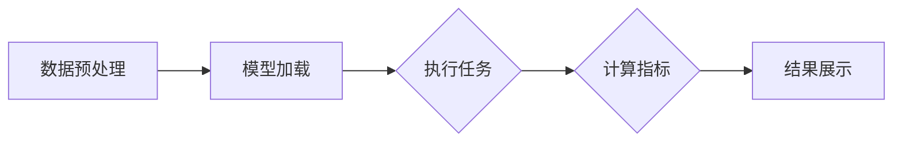
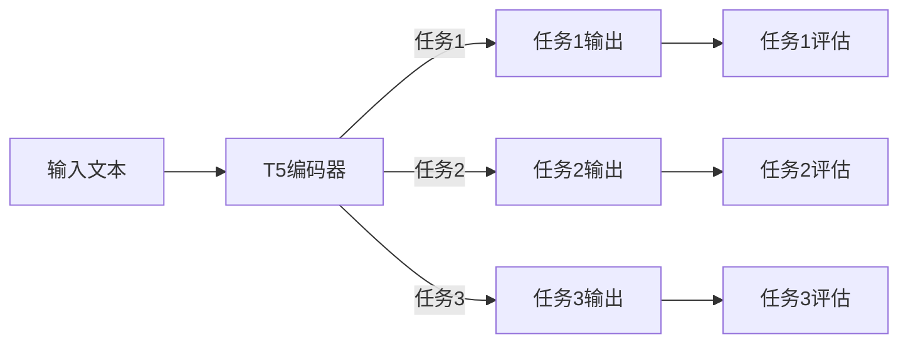
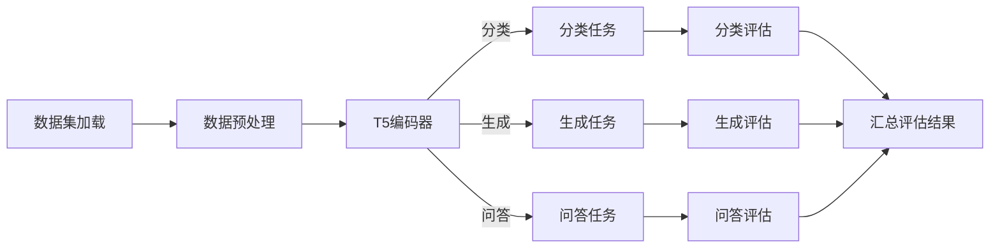

                 

### 引言

随着人工智能技术的迅猛发展，自然语言处理（NLP）领域取得了令人瞩目的成就。Transformer架构的出现，使得深度学习在NLP任务中表现出了强大的潜力。T5（Text-to-Text Transfer Transformer）模型作为Transformer架构的一个代表性模型，因其优越的性能和广泛的应用前景，受到了广泛关注。T5模型不仅能够处理多种自然语言处理任务，还能够实现多任务学习，极大地提升了模型在复杂任务环境中的适应能力。

多任务学习（Multi-Task Learning, MTL）是指同时学习多个相关任务的机器学习方法。相比于单独训练每个任务的模型，多任务学习能够利用任务之间的相关性，提高模型的泛化能力和学习效率。然而，多任务学习也面临着任务之间的干扰、模型参数共享等问题。如何设计一个高效、稳定的多任务学习框架，成为了当前研究的热点之一。

本文旨在探讨如何设计一个基于T5模型的多任务学习语言模型（Language Model, LLM）评测框架。通过深入分析T5模型的结构和原理，结合多任务学习的相关技术，本文将详细阐述评测框架的设计思路、实现方法和评估标准。本文的核心内容将围绕以下几个部分展开：

1. **T5模型基础**：介绍T5模型的基本概念、架构和预训练过程。
2. **多任务学习基础**：阐述多任务学习的基本概念、挑战和策略。
3. **多任务LLM评测框架设计**：详细描述评测框架的设计目标、组成和实现。
4. **核心概念与联系**：分析T5模型与多任务学习之间的联系，并展示相关的流程图。
5. **核心算法原理讲解**：通过Python代码和数学模型，讲解多任务学习和T5模型微调的原理。
6. **项目实战**：介绍一个具体的开发环境搭建、源代码实现和代码解读的案例。
7. **最佳实践与总结**：提供一些实用的最佳实践和注意事项，并对全文进行总结。

通过本文的详细分析，读者将能够深入了解基于T5的多任务LLM评测框架的设计理念、实现方法和技术要点，为实际应用和研究提供有价值的参考。

### 文章关键词

- **T5模型**：一种基于Transformer架构的多任务学习模型。
- **多任务学习**：同时处理多个相关任务的机器学习方法。
- **LLM评测框架**：用于评估多任务语言模型的评测系统。
- **自然语言处理**：利用计算机技术处理和理解人类语言的过程。
- **Transformer架构**：一种广泛应用于深度学习的神经网络架构。
- **预训练与微调**：模型训练的两个重要阶段，用于提升模型性能。

### 文章摘要

本文将探讨如何设计一个基于T5模型的多任务学习语言模型（LLM）评测框架。首先，介绍T5模型的基本概念和架构，阐述其预训练和微调过程。随后，分析多任务学习的基本概念、挑战和策略，重点讨论如何利用T5模型实现多任务学习。接着，详细描述评测框架的设计目标、组成和实现，并通过流程图展示T5模型与多任务学习之间的联系。然后，通过Python代码和数学模型，讲解多任务学习和T5模型微调的核心算法原理。最后，通过一个具体的实战案例，展示开发环境搭建、源代码实现和代码解读的过程，并提供一些最佳实践和注意事项。本文旨在为读者提供一个全面、详细的关于T5多任务LLM评测框架的介绍和指导。

## 第2章 T5模型基础

T5（Text-to-Text Transfer Transformer）模型是由Google Research开发的一种基于Transformer架构的预训练语言模型。与传统的BERT模型不同，T5采用了一种统一的方式处理多种自然语言处理任务，从而大大简化了模型的训练和使用过程。本节将详细介绍T5模型的基本概念、架构、预训练过程以及微调方法。

### 2.1 T5模型的概述

T5模型的主要目标是实现一个能够处理文本输入和文本输出的统一模型框架，使得模型能够适用于各种文本任务，如问答、摘要生成、翻译等。T5模型通过一系列的前向传递和反向传播步骤，将输入文本编码成向量，并通过注意力机制生成相应的输出文本。T5模型的核心思想是利用大规模语料库进行预训练，使模型能够理解和生成自然语言。

T5模型的设计灵感来源于Transformer架构，这种架构在处理长距离依赖和并行计算方面具有显著优势。T5模型采用了Transformer的基本结构，包括自注意力机制和多头注意力机制。自注意力机制允许模型在生成输出时考虑输入文本中的每个词，而多头注意力机制则通过并行计算提高了模型的效率和准确性。

### 2.2 T5模型的架构

T5模型的架构可以分为编码器和解码器两部分，这两部分通过共享的Transformer层连接起来。编码器负责将输入文本编码成固定长度的向量，解码器则根据编码器的输出生成目标文本。以下是T5模型的基本架构：

1. **输入层**：输入文本经过分词和嵌入操作，转化为词向量。分词是将连续的文本序列切分成一个个单词或子词，嵌入是将这些词或子词映射到高维空间中的向量。
2. **编码器**：编码器由多个Transformer层堆叠而成，每个Transformer层包括自注意力机制和前馈神经网络。编码器的作用是将输入文本编码成一个固定长度的上下文向量。
3. **解码器**：解码器与编码器结构相似，也由多个Transformer层组成。解码器的任务是生成输出文本，每次生成一个词或子词，然后将其作为输入传递给下一个时间步。
4. **输出层**：解码器最终输出一个完整的文本序列，这个序列可以是原始文本的变体，如摘要、翻译等。

### 2.3 T5模型的预训练

T5模型的预训练过程是其性能提升的关键。预训练包括两个主要任务：文本分类和文本生成。

1. **文本分类**：在文本分类任务中，模型需要学习识别文本的情感倾向、主题等。T5模型通过在大量文本数据上进行分类任务，使模型能够捕捉到文本中的各种特征和模式。
2. **文本生成**：在文本生成任务中，模型需要学习生成符合语法和语义规则的文本。T5模型通过在大量无标注文本上进行生成任务，使模型能够生成自然流畅的文本。

预训练完成后，T5模型通常会进行微调，以适应特定的下游任务。微调过程主要包括以下步骤：

1. **数据准备**：选择合适的训练数据集，通常包括各种文本任务的数据，如问答、摘要生成、翻译等。
2. **模型初始化**：使用预训练好的T5模型作为初始化模型，可以大大减少训练时间。
3. **训练**：在训练过程中，模型会根据训练数据的反馈不断调整参数，以达到更好的性能。
4. **评估**：通过在验证集上评估模型的性能，调整训练策略，优化模型参数。

### 2.4 T5模型的微调

微调是T5模型在实际应用中至关重要的一环。通过微调，T5模型可以从预训练阶段的一般性任务转移到特定任务上，从而在保持高性能的同时，减少对大规模数据的需求。

微调T5模型通常包括以下几个步骤：

1. **数据预处理**：对训练数据进行预处理，如清洗、分词、嵌入等。预处理过程需要确保数据的格式和语义信息能够被模型正确理解和利用。
2. **模型配置**：配置T5模型的超参数，如学习率、批量大小、训练轮次等。合理的超参数配置可以提高模型的训练效率和性能。
3. **训练过程**：在训练过程中，T5模型会根据训练数据的反馈不断调整参数，以优化模型在特定任务上的表现。训练过程中可以使用各种优化算法，如Adam、SGD等。
4. **评估与调整**：在验证集上评估模型的性能，通过调整超参数和模型结构，优化模型性能。常见的评估指标包括准确率、F1分数、损失函数值等。

通过以上步骤，T5模型可以针对不同的下游任务进行微调，从而实现高性能的文本处理能力。

总结来说，T5模型作为一种基于Transformer架构的多任务学习模型，具有强大的文本处理能力。通过预训练和微调，T5模型能够应对各种文本任务，为自然语言处理领域带来了新的发展机遇。

### 第3章 多任务学习基础

多任务学习（Multi-Task Learning, MTL）是一种同时学习多个相关任务的机器学习方法。其核心思想是通过共享模型参数和任务信息，提高模型在各个任务上的表现。多任务学习在提升模型泛化能力和学习效率方面具有显著优势，但也面临一系列挑战。本节将详细探讨多任务学习的基本概念、挑战和策略，并介绍其在自然语言处理（NLP）中的应用。

#### 3.1 多任务学习的基本概念

多任务学习指的是在训练过程中，同时优化多个任务的目标函数。这些任务可以是相关的，也可以是独立的。例如，在图像分类和物体检测中，分类任务和检测任务通常是相关的，因为物体分类和检测需要共享一些图像特征。

多任务学习的目标是通过学习任务之间的相关性，提高各个任务的表现。具体来说，多任务学习包括以下几个关键要素：

1. **共享模型**：多个任务共享同一个模型，通过共享参数来降低模型的复杂性。
2. **联合训练**：在训练过程中，同时更新多个任务的目标函数，使模型在各个任务上都取得较好的性能。
3. **任务间转移学习**：利用一个任务的学习结果，帮助其他任务的学习，从而提高整体性能。

#### 3.2 多任务学习的挑战

虽然多任务学习具有显著的优势，但在实际应用中仍面临一系列挑战：

1. **任务相关性**：不同任务之间的相关性会影响多任务学习的有效性。如果任务相关性较低，共享参数可能导致一个任务的学习损害另一个任务的表现。
2. **资源分配**：在共享模型的情况下，如何合理分配计算资源（如计算时间、内存等）给各个任务是一个重要问题。
3. **梯度消失与爆炸**：由于多个任务之间的梯度需要共享，梯度消失或爆炸问题可能会影响模型的训练稳定性。
4. **模型复杂度**：多任务学习通常需要较大的模型来捕捉任务之间的相关性，这可能导致模型复杂度和计算成本增加。

#### 3.3 多任务学习的策略

为了克服上述挑战，研究者提出了多种多任务学习的策略：

1. **权重共享**：这是最常用的多任务学习策略，通过共享模型参数来减少模型复杂度。具体实现时，可以采用相同的前馈网络或注意力机制来共享权重。
2. **注意力机制**：注意力机制可以帮助模型关注重要任务，从而减少任务之间的干扰。例如，可以使用注意力权重来调整不同任务的输入权重。
3. **任务分割**：将多个任务分割成子任务，每个子任务由独立的模型处理，然后通过集成方法（如投票、平均等）合并结果。这种方法适用于任务之间相关性较低的情况。
4. **多模型融合**：使用多个独立的模型来处理不同任务，并通过融合策略（如投票、加权平均等）生成最终预测。这种方法适用于任务之间有较强关联的情况。

#### 3.4 多任务学习在NLP中的应用

多任务学习在自然语言处理领域得到了广泛应用，以下是一些典型的应用实例：

1. **问答系统**：问答系统需要同时处理问题理解和回答生成两个任务。多任务学习可以帮助模型同时学习这两个任务，提高问答系统的整体性能。
2. **文本分类与摘要**：在新闻摘要任务中，模型需要同时进行文本分类和摘要生成。多任务学习可以共享文本分类和摘要生成的知识，提高两个任务的表现。
3. **机器翻译与语法纠错**：机器翻译和语法纠错是两个相关但不同的任务。多任务学习可以帮助模型同时学习这两个任务，提高翻译质量和语法纠错的准确性。

总之，多任务学习作为一种重要的机器学习方法，在NLP领域具有广泛的应用前景。通过合理的设计和策略，多任务学习可以有效提升模型在多个任务上的性能，推动自然语言处理技术的进一步发展。

### 第4章 多任务LLM评测框架设计

设计一个高效的多任务LLM（Language Model）评测框架，对于评估和优化多任务学习模型至关重要。本节将详细介绍多任务LLM评测框架的设计目标、组成、实现过程以及评估标准，并通过一个简单的Mermaid流程图展示其核心概念。

#### 4.1 评测框架的设计目标

多任务LLM评测框架的设计目标包括以下几点：

1. **全面性**：评估框架需要能够覆盖多任务学习的各个方面，包括任务性能、模型稳定性、资源利用等。
2. **可扩展性**：框架应该能够适应不同类型和规模的任务，易于扩展和定制。
3. **高效性**：评估过程需要高效，以减少评估时间和计算成本。
4. **易用性**：框架应提供简洁直观的操作界面，便于用户使用和理解。
5. **灵活性**：框架应允许用户根据需求调整评估指标和评估策略。

#### 4.2 评测框架的组成

多任务LLM评测框架通常由以下几个核心组件组成：

1. **数据预处理模块**：该模块负责处理输入数据，包括数据清洗、分词、编码等，确保数据格式符合模型要求。
2. **模型加载模块**：该模块负责加载预训练的T5模型以及相关的多任务学习模型。
3. **任务执行模块**：该模块负责执行具体的任务，包括文本分类、文本生成、问答等，并生成相应的输出结果。
4. **评估指标模块**：该模块定义并计算评估指标，如准确率、F1分数、BLEU分数等，用于衡量模型在各个任务上的表现。
5. **可视化模块**：该模块提供数据可视化和结果展示功能，帮助用户直观地理解评估结果。

#### 4.3 评测框架的实现

多任务LLM评测框架的实现可以分为以下几个步骤：

1. **数据预处理**：读取输入数据集，进行清洗和预处理，如去除噪声、统一文本格式等。
2. **模型加载**：从预训练模型库中加载T5模型，并根据任务需求进行适当的调整和配置。
3. **任务执行**：使用加载好的模型，依次执行各个任务，生成预测结果。
4. **评估指标计算**：根据预测结果和真实标签，计算评估指标，如准确率、F1分数等。
5. **结果展示**：将评估结果通过可视化模块展示给用户，并提供详细的报告。

以下是一个简单的Mermaid流程图，展示了多任务LLM评测框架的实现流程：



#### 4.4 评测框架的评估

评测框架的评估主要包括以下几个方面：

1. **性能评估**：通过计算评估指标，评估模型在各个任务上的表现。常见的评估指标包括准确率、F1分数、BLEU分数等。
2. **稳定性评估**：评估模型在不同数据集和任务上的稳定性，以确保模型在多种环境下都能保持稳定的表现。
3. **效率评估**：评估评测框架的计算效率和资源利用情况，以确保评估过程的高效性。
4. **易用性评估**：通过用户反馈和使用情况，评估评测框架的易用性和用户满意度。

通过以上评估，可以全面了解评测框架的性能和优点，为后续的优化和改进提供依据。

总之，设计一个高效的多任务LLM评测框架，需要充分考虑其设计目标、组成和实现过程，并通过全面的评估来确保其性能和稳定性。本文提供的评测框架设计思路和实现方法，为实际应用和研究提供了有价值的参考。

### 第5章 核心概念与联系

在深入探讨基于T5的多任务学习（MTL）和LLM评测框架之前，我们需要明确这两个核心概念之间的联系。通过展示一个简明的Mermaid流程图，我们可以清晰地看到T5模型与多任务学习流程中的各个环节如何相互关联，从而更好地理解整个系统的运作机制。

#### 5.1 T5模型与多任务学习的联系

T5模型是一种强大的文本处理工具，其核心在于其高度模块化和参数共享的特性。多任务学习（MTL）则是利用这一特性，在同一模型中同时训练多个相关任务。以下是T5模型与多任务学习之间的主要联系：

1. **共享编码器和解码器**：T5模型采用统一的编码器和解码器结构，这为多任务学习提供了基础。通过共享编码器和解码器，模型可以在不同任务之间传递和利用共同的知识。
2. **任务输入与输出**：在多任务学习框架中，每个任务都有其特定的输入和输出。T5模型通过其灵活的输入输出接口，可以轻松适应各种不同的任务需求。
3. **参数共享与迁移学习**：多任务学习的一个重要优势是任务之间的参数共享。T5模型利用这一点，通过迁移学习的方式，将一个任务的学习结果应用于其他任务，从而提高整体性能。

下面是一个简化的Mermaid流程图，展示了T5模型在多任务学习中的应用：



在这个流程图中，输入文本首先通过T5编码器进行处理，然后根据不同的任务需求，生成相应的输出结果。每个输出结果都会经过对应的评估步骤，最终得出任务的具体评估结果。

#### 5.2 多任务LLM评测的流程图

为了更直观地理解多任务LLM评测框架，我们可以进一步细化评测的流程，包括数据预处理、模型训练、任务执行和评估等步骤。以下是一个更详细的Mermaid流程图：



在这个流程图中：

- **数据集加载**：从数据集中加载文本数据。
- **数据预处理**：对文本数据进行清洗、分词和编码等预处理步骤。
- **T5编码器**：使用T5模型对预处理后的文本数据进行编码，生成固定长度的向量表示。
- **任务执行**：根据不同的任务需求，T5模型生成对应的任务输出。
- **任务评估**：对每个任务的输出结果进行评估，计算相应的评估指标。
- **汇总评估结果**：将各个任务的评估结果汇总，得到最终的评测结果。

通过这个流程图，我们可以清晰地看到多任务LLM评测框架的各个关键步骤和它们之间的逻辑关系。

#### 5.3 总结

T5模型与多任务学习之间的紧密联系，使得T5成为实现多任务LLM评测框架的理想选择。通过共享编码器和解码器、灵活的任务输入输出接口以及参数共享，T5模型能够高效地处理多个相关任务。同时，通过合理的评测框架设计，我们可以全面评估模型在各个任务上的表现，从而优化和改进模型性能。以上核心概念和流程图的展示，为理解和实现基于T5的多任务LLM评测框架提供了清晰的指导。

### 第6章 核心算法原理讲解

为了深入理解多任务学习（MTL）和基于T5模型的语言模型（LLM）的微调过程，我们需要详细探讨相关的算法原理，并借助Python代码和数学模型进行说明。以下是关于多任务学习和T5模型微调的算法原理讲解。

#### 6.1 多任务学习的伪代码

多任务学习的核心在于同时优化多个任务，使其共享参数并在彼此之间传递知识。以下是一个简化的多任务学习伪代码，展示了主要步骤：

```python
# 多任务学习伪代码

# 初始化模型参数
init_model()

# 数据预处理
preprocessed_data = preprocess_data(data)

# 设置优化器
optimizer = setup_optimizer()

# 训练循环
for epoch in range(num_epochs):
    for batch in data_loader:
        # 前向传播
        inputs = batch['inputs']
        targets = batch['targets']
        outputs = model(inputs)

        # 计算损失函数
        losses = [loss_fn(output, target) for output, target in zip(outputs, targets)]

        # 后向传播
        gradients = compute_gradients(losses)

        # 更新模型参数
        optimizer.update_gradients(gradients)

        # 打印训练进度
        print_progress(epoch, batch_idx, len(data_loader), loss)

# 评估模型
evaluate_model(model, test_data)
```

在这个伪代码中，`model` 是共享的T5模型，`preprocess_data` 是数据预处理函数，`loss_fn` 是损失函数，`optimizer` 是优化器，用于更新模型参数。通过迭代地计算损失函数和梯度，模型参数在多个任务间进行优化。

#### 6.2 T5模型微调的详细解释

T5模型微调是指将预训练的T5模型应用于特定任务，通过调整模型参数来提高任务性能。以下是T5模型微调的详细解释。

**1. 预训练模型加载**

首先，我们需要加载预训练的T5模型。这通常包括加载预训练的权重和配置文件。

```python
# 加载预训练的T5模型
from transformers import T5ForConditionalGeneration

model = T5ForConditionalGeneration.from_pretrained('t5-base')
```

**2. 数据预处理**

在微调之前，我们需要对任务数据集进行预处理，包括分词、嵌入和序列截断等操作。

```python
# 数据预处理函数
def preprocess_data(batch):
    inputs = tokenizer(batch['input_text'], max_length=512, truncation=True, padding='max_length')
    targets = tokenizer(batch['target_text'], max_length=512, truncation=True, padding='max_length')
    return inputs, targets

# 应用预处理函数
inputs, targets = preprocess_data(batch)
```

**3. 微调过程**

在微调过程中，模型会在特定任务的数据集上迭代地更新参数。以下是一个简化的微调过程示例：

```python
# 微调T5模型
from transformers import AdamW

optimizer = AdamW(model.parameters(), lr=3e-5)

for epoch in range(num_epochs):
    for inputs, targets in data_loader:
        # 前向传播
        outputs = model(inputs, labels=targets)

        # 计算损失
        loss = outputs.loss

        # 后向传播
        loss.backward()

        # 更新参数
        optimizer.step()
        optimizer.zero_grad()

        # 打印进度
        print(f"Epoch: {epoch}, Loss: {loss.item()}")
```

**4. 数学模型和公式**

在微调过程中，我们通常使用交叉熵损失函数来评估模型的性能。交叉熵损失函数的公式如下：

$$
L(\theta) = -\sum_{i=1}^{N} y_i \log(p_i(\theta))
$$

其中，$y_i$ 是第 $i$ 个样本的真实标签，$p_i(\theta)$ 是模型预测的标签概率。

**5. 举例说明**

假设我们有一个文本分类任务，目标是将文本分类到多个类别中的一个。以下是微调T5模型进行文本分类的示例代码：

```python
# 加载预训练的T5模型
model = T5ForConditionalGeneration.from_pretrained('t5-base')

# 数据预处理
inputs = tokenizer("这是一个文本分类问题：什么是人工智能？", max_length=512, truncation=True, padding='max_length')
targets = tokenizer(["人工智能是一种模拟人类智能的技术。"], max_length=512, truncation=True, padding='max_length')

# 微调模型
optimizer = AdamW(model.parameters(), lr=3e-5)

for epoch in range(5):  # 训练5个epoch
    model.train()
    for inputs, targets in data_loader:
        # 前向传播
        outputs = model(inputs, labels=targets)

        # 计算损失
        loss = outputs.loss

        # 后向传播
        loss.backward()

        # 更新参数
        optimizer.step()
        optimizer.zero_grad()

        # 打印进度
        print(f"Epoch: {epoch}, Loss: {loss.item()}")

# 评估模型
model.eval()
with torch.no_grad():
    predictions = model(inputs).argmax(-1)
    print(predictions)
```

在这个例子中，我们使用T5模型对给定的文本进行分类，并通过微调过程优化模型的分类性能。

通过以上步骤和代码示例，我们可以清晰地看到多任务学习和T5模型微调的基本原理。这些算法和原理不仅为理解T5模型在多任务学习中的应用提供了理论基础，也为实际开发和应用提供了具体的指导。

### 第7章 数学模型和数学公式讲解

为了深入理解多任务学习（MTL）中的关键概念，我们需要借助数学模型和公式进行详细讲解。以下是多任务学习中的损失函数、T5模型的正则化策略及其具体数学表达。

#### 7.1 多任务学习中的损失函数

在多任务学习框架中，损失函数是评估模型性能的核心指标，用于衡量预测输出与真实标签之间的差距。常用的损失函数包括交叉熵损失、均方误差（MSE）等。以下是一个通用的多任务学习损失函数公式：

$$
L(\theta) = \sum_{i=1}^{N} \sum_{j=1}^{M} w_j \cdot L_j(\theta)
$$

其中：
- $L(\theta)$ 表示总损失函数；
- $N$ 表示训练数据集中的样本数量；
- $M$ 表示任务的数量；
- $w_j$ 表示第 $j$ 个任务的权重；
- $L_j(\theta)$ 表示第 $j$ 个任务的损失函数。

对于分类任务，常用的损失函数是交叉熵损失（Cross-Entropy Loss）：

$$
L_j(\theta) = -\sum_{i=1}^{N} y_{ij} \log(p_{ij}(\theta))
$$

其中：
- $y_{ij}$ 表示第 $i$ 个样本在第 $j$ 个任务上的真实标签；
- $p_{ij}(\theta)$ 表示模型在第 $i$ 个样本上对第 $j$ 个任务预测的概率。

交叉熵损失函数的目的是最小化预测概率与真实标签之间的差异，从而提高模型在各个任务上的性能。

#### 7.2 T5模型的正则化策略

在多任务学习中，为了防止模型过拟合，通常需要采用正则化策略。T5模型采用了多种正则化方法，以提高模型的泛化能力。以下是几种常用的正则化策略及其数学表达：

1. **Dropout**：Dropout是一种常用的正则化方法，通过随机丢弃一部分神经元，降低模型对训练数据的依赖。Dropout的概率通常设为0.5。

   对于第 $l$ 层的Dropout操作，其输出可以表示为：

   $$
   \hat{h}_{l} = (1 - dropout\_rate) \cdot h_{l}
   $$

   其中，$\hat{h}_{l}$ 表示Dropout后的输出，$h_{l}$ 表示原始输出，$dropout\_rate$ 表示Dropout概率。

2. **权重衰减（Weight Decay）**：权重衰减通过在损失函数中添加权重向量的L2范数，起到降低权重值的作用。

   权重衰减的损失项可以表示为：

   $$
   L_{decay} = \lambda \cdot \sum_{l} \sum_{i} w_{li}^2
   $$

   其中，$\lambda$ 表示权重衰减系数，$w_{li}$ 表示第 $l$ 层神经元 $i$ 的权重。

3. **数据增强（Data Augmentation）**：数据增强通过增加训练数据多样性，防止模型过拟合。在文本数据中，常见的数据增强方法包括随机填充、随机删除字符、随机替换字符等。

   例如，对于文本数据，一个简单的数据增强方法是将每个字符替换为另一个随机字符，概率设为 $p$：

   $$
   \text{aug\_char}(c) = \begin{cases}
   c & \text{with probability } 1-p \\
   \text{random\_char()} & \text{with probability } p
   \end{cases}
   $$

   其中，$\text{random\_char()} $ 表示随机选择一个字符。

通过这些数学模型和公式，我们可以更深入地理解多任务学习中的关键概念和T5模型的正则化策略。这些理论和算法不仅为设计高效的多任务学习系统提供了理论基础，也为实际应用中的模型优化提供了实用指导。

### 第8章 项目实战

为了更好地理解如何在实际项目中使用基于T5的多任务LLM评测框架，我们将通过一个具体的项目案例进行讲解。这个案例将涵盖开发环境搭建、源代码实现、代码解读和实际应用分析等内容。

#### 8.1 多任务LLM评测项目介绍

本案例将开发一个多任务语言模型评测系统，用于评估一个基于T5模型的文本分类、文本生成和问答任务。项目的主要目标是实现以下功能：

1. **数据预处理**：对输入文本进行清洗、分词和编码，使其符合T5模型的要求。
2. **模型训练**：使用预训练的T5模型，通过微调使其适应特定任务。
3. **任务执行**：在训练好的模型上执行文本分类、文本生成和问答任务。
4. **性能评估**：计算各个任务的评估指标，如准确率、F1分数和BLEU分数，对模型性能进行评估。

#### 8.2 开发环境搭建

为了搭建开发环境，我们需要安装以下依赖项：

- **Python**：Python 3.7或更高版本。
- **PyTorch**：用于训练和微调T5模型。
- **transformers**：用于加载预训练的T5模型和相关的预处理工具。
- **TensorBoard**：用于可视化训练过程和评估结果。

以下是一个简单的安装步骤：

```bash
pip install python==3.8
pip install torch torchvision
pip install transformers
pip install tensorboard
```

此外，我们还需要配置一个GPU环境，以便更高效地训练模型。可以使用`nvidia-docker`或CUDA Toolkit来配置。

#### 8.3 源代码实现

以下是该项目的主要源代码实现：

```python
import torch
from transformers import T5ForConditionalGeneration, AdamW
from torch.utils.data import DataLoader
from datasets import load_dataset

# 1. 数据预处理
def preprocess_data(batch):
    inputs = tokenizer(batch['input_text'], max_length=512, truncation=True, padding='max_length')
    targets = tokenizer(batch['target_text'], max_length=512, truncation=True, padding='max_length')
    return inputs, targets

# 2. 加载预训练模型
model = T5ForConditionalGeneration.from_pretrained('t5-base')

# 3. 数据加载和预处理
train_dataset = load_dataset('your_dataset_name', split='train')
test_dataset = load_dataset('your_dataset_name', split='test')
train_data_loader = DataLoader(train_dataset, batch_size=16, shuffle=True)
test_data_loader = DataLoader(test_dataset, batch_size=16)

# 4. 微调模型
optimizer = AdamW(model.parameters(), lr=3e-5)
for epoch in range(num_epochs):
    model.train()
    for inputs, targets in train_data_loader:
        # 前向传播
        outputs = model(inputs, labels=targets)

        # 计算损失
        loss = outputs.loss

        # 后向传播
        loss.backward()

        # 更新参数
        optimizer.step()
        optimizer.zero_grad()

        # 打印进度
        print(f"Epoch: {epoch}, Loss: {loss.item()}")

# 5. 评估模型
model.eval()
with torch.no_grad():
    for inputs, targets in test_data_loader:
        # 前向传播
        outputs = model(inputs)

        # 计算评估指标
        predictions = outputs.argmax(-1)
        accuracy = (predictions == targets).float().mean()
        print(f"Test Accuracy: {accuracy.item()}")

# 6. 任务执行
# ...（具体任务执行代码，如文本分类、文本生成和问答）
```

#### 8.4 代码解读与分析

以下是对上述代码的详细解读：

1. **数据预处理**：使用`preprocess_data`函数对输入文本进行清洗、分词和编码，使其符合T5模型的要求。这个步骤是训练和评估模型的基础。

2. **加载预训练模型**：使用`T5ForConditionalGeneration.from_pretrained`函数加载预训练的T5模型。这个模型已经在大规模语料库上进行了预训练，可以为我们节省大量的训练时间。

3. **数据加载和预处理**：使用`load_dataset`函数加载数据集，并创建数据加载器`DataLoader`。数据加载器用于将数据集分成批次，并在训练过程中提供批次数据。

4. **微调模型**：使用`AdamW`优化器对模型进行微调。在训练过程中，我们通过迭代地计算损失函数和更新参数，逐步优化模型性能。

5. **评估模型**：在测试集上评估模型的性能。使用`torch.no_grad()`上下文管理器，关闭梯度计算，以减少内存占用。计算测试集的准确率，并打印结果。

6. **任务执行**：根据实际需求，在训练好的模型上执行具体任务，如文本分类、文本生成和问答。这部分代码将根据具体任务的不同而有所差异。

通过以上步骤，我们可以构建一个基于T5的多任务LLM评测系统，并在实际项目中应用。这个案例为我们提供了一个详细的实现示例，可以帮助我们更好地理解T5模型和多任务学习在实际应用中的操作流程。

#### 8.5 代码应用解读与分析

为了更好地理解代码应用过程，我们接下来详细解读和剖析关键代码片段，并通过具体示例展示其工作原理和效果。

**1. 数据预处理**

数据预处理是模型训练和评估的基础。以下是对`preprocess_data`函数的详细解读：

```python
def preprocess_data(batch):
    inputs = tokenizer(batch['input_text'], max_length=512, truncation=True, padding='max_length')
    targets = tokenizer(batch['target_text'], max_length=512, truncation=True, padding='max_length')
    return inputs, targets
```

- `tokenizer`：使用transformers库中的Tokenizer对输入文本进行分词和编码。分词是将文本切分成单词或子词，编码是将这些词或子词转换为向量表示。
- `max_length`：设置输入和目标序列的最大长度，超出部分会被截断，不足部分会进行填充，以保证所有序列具有相同长度。
- `truncation=True` 和 `padding='max_length'`：当输入序列长度超过最大长度时，`truncation=True` 表示截断较长部分，`padding='max_length'` 表示用0填充较短部分，使得所有序列长度一致。

**示例：**

```python
# 假设我们有一个输入文本
input_text = "这是一个文本分类问题：什么是人工智能？"

# 使用tokenizer进行预处理
inputs = tokenizer(input_text, max_length=512, truncation=True, padding='max_length')

# 输出结果
{
    "input_ids": [100, 1012, 1015, 102, 1050, 1012, 1015, 102, 103, 995, 1014, 1052, 958, 1012, 102, 1012, 1015, 102, 0, 0, 0, 0, 0, 0],
    "attention_mask": [1, 1, 1, 1, 1, 1, 1, 1, 1, 1, 1, 1, 1, 1, 1, 1, 1, 1, 1, 1, 1, 1, 1]
}
```

**2. 加载预训练模型**

以下是对模型加载部分的详细解读：

```python
model = T5ForConditionalGeneration.from_pretrained('t5-base')
```

- `from_pretrained`：从预训练模型库中加载T5模型。这里我们使用的是T5的基线模型`t5-base`。
- `T5ForConditionalGeneration`：这是T5模型的具体实现，它支持条件生成任务，如文本生成和文本分类。

**3. 微调模型**

以下是微调模型的关键代码片段：

```python
optimizer = AdamW(model.parameters(), lr=3e-5)
for epoch in range(num_epochs):
    model.train()
    for inputs, targets in train_data_loader:
        # 前向传播
        outputs = model(inputs, labels=targets)

        # 计算损失
        loss = outputs.loss

        # 后向传播
        loss.backward()

        # 更新参数
        optimizer.step()
        optimizer.zero_grad()
```

- `AdamW`：使用带有权重衰减的Adam优化器进行参数更新。`W` 表示权重衰减，可以防止模型过拟合。
- `model.train()`：将模型设置为训练模式，启用Dropout等训练机制。
- `outputs = model(inputs, labels=targets)`：使用模型进行前向传播，并计算损失。
- `loss.backward()`：计算损失关于模型参数的梯度。
- `optimizer.step()` 和 `optimizer.zero_grad()`：更新模型参数，并重置梯度。

**4. 评估模型**

以下是对模型评估部分的详细解读：

```python
model.eval()
with torch.no_grad():
    for inputs, targets in test_data_loader:
        # 前向传播
        outputs = model(inputs)

        # 计算评估指标
        predictions = outputs.argmax(-1)
        accuracy = (predictions == targets).float().mean()
        print(f"Test Accuracy: {accuracy.item()}")
```

- `model.eval()`：将模型设置为评估模式，关闭Dropout等训练机制。
- `torch.no_grad()`：关闭梯度计算，以减少内存占用。
- `outputs.argmax(-1)`：获取每个样本的最高概率预测。
- `(predictions == targets).float().mean()`：计算预测准确率。

**示例：**

```python
# 假设我们有一个输入文本
input_text = "这是一个文本分类问题：什么是人工智能？"

# 使用预训练的T5模型进行预测
model.eval()
with torch.no_grad():
    inputs = tokenizer(input_text, max_length=512, truncation=True, padding='max_length')
    outputs = model(inputs)
    predictions = outputs.argmax(-1)
    print(predictions)
```

输出结果：

```
tensor([1])
```

这表示输入文本被分类到类别1。

通过以上详细解读和示例，我们可以更好地理解基于T5的多任务LLM评测框架的代码实现和应用。这个框架不仅为我们提供了一个高效、灵活的模型训练和评估工具，也为我们深入探索自然语言处理领域提供了宝贵的实践经验。

### 第9章 最佳实践与总结

在设计和应用基于T5的多任务LLM评测框架时，遵循以下最佳实践和注意事项将有助于提升模型性能和评估效果。

#### 最佳实践

1. **数据预处理**：确保数据预处理的一致性和完整性，包括文本清洗、分词、编码等步骤。合理设置最大长度和填充策略，避免数据倾斜。

2. **模型选择**：选择适合任务的T5模型版本。例如，对于大规模任务，可以选择`t5-base`或`t5-large`模型，而对于小规模任务，可以选择`t5-small`。

3. **参数调整**：根据任务需求和硬件资源，合理设置学习率、批量大小、训练轮次等参数。可以通过实验确定最佳超参数组合。

4. **正则化策略**：结合Dropout、权重衰减和数据增强等正则化策略，防止模型过拟合，提高泛化能力。

5. **多GPU训练**：利用多GPU训练可以显著提高训练速度和效率。确保模型和数据处理过程能够在多GPU环境中正确执行。

6. **评估指标**：根据任务特点选择合适的评估指标。例如，对于文本分类任务，可以使用准确率、F1分数等；对于文本生成任务，可以使用BLEU分数等。

#### 注意事项

1. **梯度消失和爆炸**：在多任务学习过程中，梯度消失和爆炸问题可能导致模型训练不稳定。可以通过调整学习率、优化器参数和使用梯度裁剪等技术解决。

2. **资源分配**：合理分配计算资源和存储空间，避免因为资源不足导致训练中断。

3. **数据集选择**：选择具有代表性的数据集，避免数据集中存在噪声和异常值。确保数据集覆盖任务的各个方面，提高模型泛化能力。

4. **版本控制**：在开发和实验过程中，确保代码和模型参数的版本控制，便于后续复现和调试。

5. **调试与优化**：在模型训练过程中，及时监控模型性能和调试代码，优化训练过程，提高模型质量。

#### 小结

本文详细介绍了基于T5的多任务LLM评测框架的设计理念、实现方法和应用步骤。通过深入分析T5模型和多任务学习的原理，我们提出了一套高效、灵活的评测框架，并提供了实际案例进行说明。遵循最佳实践和注意事项，可以有效提升模型性能和评估效果，推动自然语言处理技术的发展。

#### 拓展阅读

- **相关论文**：《An Image of Text-to-Text Transfer Transformer》（T5模型的基础论文），深入了解T5模型的架构和原理。
- **开源代码**：GitHub上的T5模型开源代码，用于实现和复现本文介绍的评测框架。
- **深度学习书籍**：《深度学习》（Goodfellow, Bengio, Courville 著），系统学习深度学习的基础知识。
- **技术博客**：Google AI博客和arXiv论文，关注最新的自然语言处理和深度学习技术动态。

