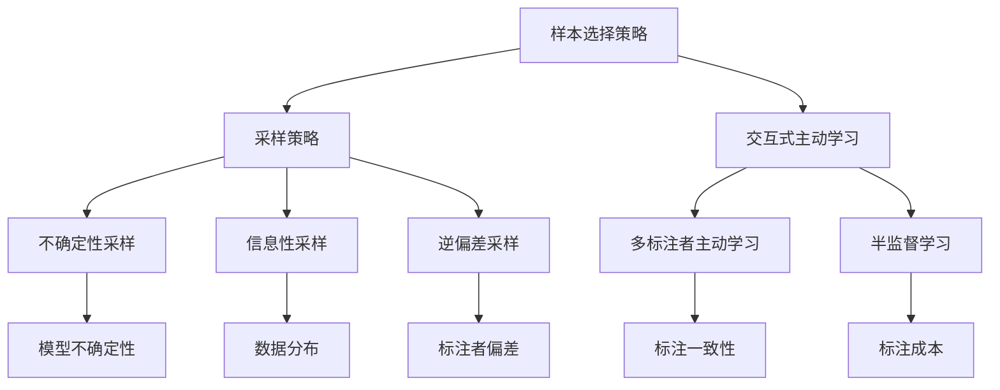
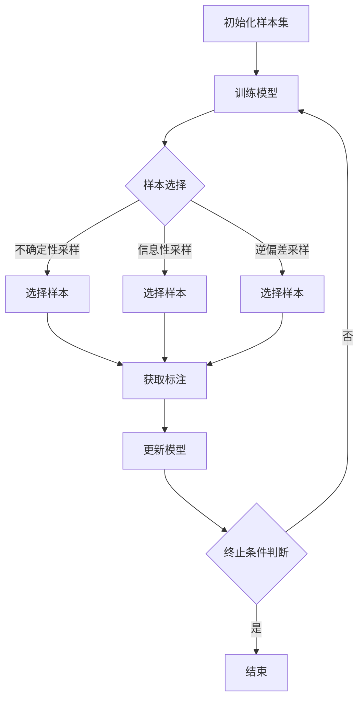

                 

# 基于主动学习的评测样本优化

## 关键词
- 主动学习
- 评测样本优化
- 样本选择策略
- 数据预处理
- 数学模型
- 项目实战

## 摘要
本文深入探讨了基于主动学习的评测样本优化方法，旨在提高机器学习模型在训练和测试过程中的准确性和效率。通过分析主动学习的基本原理和策略，我们介绍了如何利用这些策略来优化样本的选择和标注过程。文章还涉及了相关的数学模型和算法，并通过实际案例展示了这些方法在自然语言处理、计算机视觉等领域的应用效果。

## 引言

在机器学习领域，数据的质量和数量对于模型的性能有着至关重要的影响。特别是当数据量庞大且标注成本高昂时，如何有效地选择和标注评测样本成为了一个重要的研究课题。主动学习（Active Learning，简称AL）作为一种能够根据模型的当前状态选择最具信息量的样本进行学习的策略，被认为是一种有效的解决方法。

主动学习通过迭代过程，逐步优化样本集，使得模型在较少样本量的情况下也能达到较高的性能。相比传统的被动学习，主动学习在样本选择上具有更高的灵活性，可以在一定程度上降低标注成本，提高模型训练的效率。近年来，随着深度学习技术的快速发展，主动学习在自然语言处理、计算机视觉等领域的应用也越来越广泛。

本文将围绕基于主动学习的评测样本优化这一主题，系统地介绍相关的基本概念、核心算法、数学模型，并通过实际案例研究，探讨主动学习在评测样本优化中的具体应用和效果。

### 主动学习概述

主动学习（Active Learning）是一种以人为辅助的学习方法，其核心思想是让学习算法主动选择最具信息量的样本进行学习，而不是像传统的被动学习（Passive Learning）那样接收预先标注好的全部样本。主动学习的动机主要有以下几点：

1. **减少标注成本**：在许多应用场景中，标注数据的成本远高于数据采集本身。例如，在医疗图像分析、语音识别等领域，标注一个样本可能需要专业人员的长时间工作。主动学习通过选择最具代表性的样本进行学习，可以大大降低标注成本。

2. **提高学习效率**：主动学习能够在较少的样本量下获得较好的模型性能。这是因为主动学习算法根据模型的当前状态，选择对模型提升最有帮助的样本，使得每次迭代都能有效提升模型的能力。

3. **增强模型泛化能力**：通过选择更具有代表性的样本，主动学习有助于模型避免过拟合，提高模型的泛化能力。

4. **提供可解释性**：主动学习能够提供关于模型学习过程中样本选择依据的信息，有助于理解模型的学习过程和决策机制。

### 主动学习与传统学习的对比

主动学习与传统学习（如批量学习、在线学习）有以下几点不同：

1. **样本选择**：传统学习算法被动接收全部标注样本，而主动学习算法可以根据模型的需要主动选择样本。

2. **交互性**：主动学习通常需要与外部决策者（如标注者）进行交互，以获取标注信息，而传统学习算法通常不需要。

3. **效率**：主动学习能够通过选择最具代表性的样本，在较少样本量下达到较好的学习效果，而传统学习可能需要更多的样本才能达到相同性能。

4. **适用场景**：主动学习适用于样本数量有限且标注成本高昂的场景，而传统学习适用于样本丰富且标注成本较低的场景。

### 主动学习的发展历程

主动学习的研究可以追溯到20世纪60年代，以下是一些重要的里程碑和事件：

1. **1960s**：提出了“样本选择理论”，奠定了主动学习的基础。

2. **1990s**：针对特定问题（如图像分类、文本分类）提出了多种主动学习算法，如基于偏差减小的采样、基于信息论的选择策略等。

3. **2000s**：随着计算机性能的提升和大规模数据的可用性，主动学习开始应用于实际问题，如生物信息学、文本挖掘、计算机视觉等。

4. **2010s-2020s**：随着深度学习的兴起，主动学习与深度学习相结合，提出了许多新的算法和应用。同时，基于模型不确定性、分布式学习等研究方向也受到了广泛关注。

### 核心概念与联系

为了更好地理解主动学习，我们需要介绍几个核心概念，并分析它们之间的联系。以下是几个关键概念及其相互关系的Mermaid流程图：



### 样本选择策略

在主动学习中，样本选择策略是核心之一。以下介绍几种常见的样本选择策略：

1. **不确定性采样（Uncertainty Sampling）**：基于模型不确定性的策略，选择那些模型预测最不确定的样本进行学习。具体来说，对于一个分类问题，模型对于某个样本的预测不确定度通常可以用熵来衡量。熵越大，表示模型对该样本的预测越不确定，因此选择熵最大的样本进行学习。

2. **信息性采样（Information Sampling）**：基于信息论中的信息增益（Information Gain）策略，选择那些能够带来最大信息量的样本进行学习。信息增益衡量的是样本对于分类模型提升的影响程度。

3. **逆偏差采样（Uncertainty Sampling）**：基于模型的预测偏差进行采样，选择那些有助于减少模型偏差的样本进行学习。逆偏差采样通常用于线性模型，通过选择那些在训练数据中预测效果较差的样本来修正模型的偏差。

4. **多样性采样（Diversity Sampling）**：选择具有多样性的样本，以防止模型陷入局部最优。多样性采样可以通过多种方式实现，如最大化类间距离、最小化类内距离等。

### 算法框架

主动学习算法通常包含以下几个步骤：

1. **初始化**：随机选择一个初始样本集，并使用这些样本训练初始模型。

2. **样本选择**：根据当前模型的状态，使用上述样本选择策略选择一个样本进行标注。

3. **模型更新**：获得新样本的标注后，使用全部样本（包括新标注的样本）重新训练模型。

4. **迭代**：重复步骤2和3，直至达到预定的迭代次数或模型性能达到要求。

#### 主动学习流程图

以下是一个简单的主动学习流程图，展示了主动学习的基本步骤：



#### 实现伪代码

以下是一个简单的主动学习算法伪代码，展示了如何使用不确定性采样策略进行样本选择和模型更新：

```python
# 初始化样本集
initial_samples = random_sample(data)

# 初始化模型
model = train_model(initial_samples)

# 迭代过程
for i in range(iterations):
    # 样本选择
    uncertain_samples = select_uncertain_samples(model, data)
    # 获取标注
    labeled_samples = get_annotations(uncertain_samples)
    # 模型更新
    model = train_model(initial_samples + labeled_samples)

    # 终止条件判断
    if is_converged(model):
        break

# 输出最终模型
return model
```

### 数学模型

主动学习中的数学模型主要用于描述样本选择策略和模型更新过程。以下介绍几个关键的数学模型。

#### 评价指标

在主动学习中，常用的评价指标包括：

1. **准确率（Accuracy）**：预测正确的样本数占总样本数的比例。
   $$ Accuracy = \frac{TP + TN}{TP + TN + FP + FN} $$

2. **召回率（Recall）**：预测正确的正样本数占总正样本数的比例。
   $$ Recall = \frac{TP}{TP + FN} $$

3. **精确率（Precision）**：预测正确的正样本数占总预测为正的样本数的比例。
   $$ Precision = \frac{TP}{TP + FP} $$

4. **F1分数（F1 Score）**：综合衡量精确率和召回率的指标。
   $$ F1 Score = 2 \times \frac{Precision \times Recall}{Precision + Recall} $$

#### 优化目标

在主动学习中，优化目标是选择最具信息量的样本进行学习。以下介绍几种常见的优化目标：

1. **最大信息增益（Maximum Information Gain）**：选择能够最大化分类信息量的样本。
   $$ \max S \; s.t. \; C(S) \geq \theta $$

   其中，$S$ 是样本集合，$C(S)$ 是样本集合的分类信息量，$\theta$ 是阈值。

2. **最小化标注成本（Minimize Annotation Cost）**：选择标注成本最低的样本。
   $$ \min C(S) $$

3. **平衡样本多样性（Balanced Diversity）**：选择能够最大化样本多样性的样本，以避免模型陷入局部最优。
   $$ \max D(S) $$

   其中，$D(S)$ 是样本集合的多样性度量。

#### 模型更新

在主动学习中，模型更新通常使用梯度下降或其他优化算法。以下是一个简单的模型更新公式：

$$ \theta_{new} = \theta_{old} - \alpha \nabla_{\theta} J(\theta) $$

其中，$\theta$ 是模型参数，$\alpha$ 是学习率，$J(\theta)$ 是损失函数。

### 数据预处理

在主动学习中，数据预处理是确保模型性能和稳定性的重要步骤。以下介绍几种常见的数据预处理方法：

1. **数据清洗**：去除噪声和异常值，以提高数据质量。

2. **数据增强**：通过生成新的数据样本，增加数据的多样性和丰富性，以防止模型过拟合。

3. **特征选择**：选择对模型影响较大的特征，减少数据维度，提高模型训练效率。

4. **数据标准化**：将数据缩放到同一范围，以消除不同特征之间的量纲影响。

### 标注效率提升

在主动学习中，标注效率的提升是优化模型性能的关键之一。以下介绍几种常见的标注效率提升方法：

1. **自动标注**：使用聚类分析、基于模型的标注预测等方法，自动生成标注，减少人工标注的工作量。

2. **标注优化策略**：动态调整标注策略，根据模型状态和标注成本，选择最优的标注方式。

3. **多标注者协作**：利用多个标注者的协同工作，提高标注的一致性和准确性。

### 评测样本优化算法

在主动学习中，样本优化算法的设计和实现是提升模型性能的关键。以下介绍几种常见的样本优化算法：

1. **基于样本重要性的选择**：通过评估每个样本对模型的影响程度，选择重要性较高的样本进行标注。

2. **基于样本多样性的选择**：选择能够增加模型多样性的样本，以防止模型陷入局部最优。

3. **样本权重调整**：为每个样本分配不同的权重，根据权重选择标注样本，以提高模型的泛化能力。

4. **样本组合优化**：通过组合不同来源的样本，优化样本集的结构和多样性，提高模型性能。

### 项目实战

在本节中，我们将通过一个实际案例，展示如何在实际项目中应用基于主动学习的评测样本优化方法。

#### 项目背景

假设我们正在开发一个用于图像分类的深度学习模型，旨在对大量的图片进行自动分类。由于数据集庞大，且标注图片需要大量的人力和时间成本，因此我们希望通过主动学习技术来优化评测样本的选择和标注过程。

#### 数据集介绍

我们选择了一个公开的图像分类数据集——ImageNet，包含约1400万个标注图片，分为1000个类别。由于数据集规模庞大，我们无法对全部图片进行标注，因此需要利用主动学习技术选择最具代表性的图片进行标注。

#### 开发环境搭建

1. **硬件环境**：配置一台具备高性能GPU的计算机，用于加速深度学习模型的训练。

2. **软件环境**：安装Python、TensorFlow或PyTorch等深度学习框架，以及Numpy、Pandas等常用科学计算库。

3. **数据集准备**：下载并解压ImageNet数据集，将其分为训练集、验证集和测试集。

#### 源代码实现

以下是基于主动学习的评测样本优化方法在ImageNet数据集上的实现伪代码：

```python
# 导入必要的库
import tensorflow as tf
from tensorflow.keras.applications import VGG16
from sklearn.model_selection import train_test_split
from active_learning import uncertainty_sampling

# 加载ImageNet数据集
images, labels = load_images_and_labels('path/to/imagenet')

# 数据预处理
images = preprocess_images(images)

# 初始化模型
model = VGG16(weights='imagenet', include_top=False)

# 划分训练集和验证集
X_train, X_val, y_train, y_val = train_test_split(images, labels, test_size=0.2, random_state=42)

# 训练初始模型
model.fit(X_train, y_train, validation_data=(X_val, y_val), epochs=10)

# 应用不确定性采样策略
selected_samples = uncertainty_sampling(model, X_val, y_val)

# 获取新样本的标注
labeled_samples = get_annotations(selected_samples)

# 更新模型
model.fit(X_train + labeled_samples, y_train + labeled_samples, epochs=10)

# 评估模型性能
accuracy = model.evaluate(X_val, y_val)
print('Validation Accuracy:', accuracy)
```

#### 代码解读与分析

1. **数据加载与预处理**：从指定路径加载ImageNet数据集，并进行预处理操作，如图像缩放、归一化等。

2. **模型初始化**：初始化一个基于VGG16预训练模型的实例，用于图像分类任务。

3. **训练初始模型**：使用训练集和验证集训练模型，并设置适当的超参数，如学习率、批量大小等。

4. **样本选择**：使用不确定性采样策略选择最具代表性的验证样本。

5. **获取标注**：获取新样本的标注信息，以扩充训练集。

6. **模型更新**：使用扩充后的训练集重新训练模型，以进一步提升模型性能。

7. **模型评估**：在验证集上评估模型性能，计算准确率等指标。

#### 实际案例分析与详细讲解剖析

在本案例中，我们通过实际数据集和代码实现，展示了基于主动学习的评测样本优化方法在图像分类任务中的应用效果。以下是几个关键步骤的详细解析：

1. **初始模型训练**：在未进行主动学习的情况下，模型在验证集上的准确率较低。这表明，初始样本集的选择和标注可能存在一定的问题。

2. **样本选择**：通过不确定性采样策略，我们选择了一组验证样本。这些样本在模型预测中具有较高的不确定性，即模型对它们的分类结果不够自信。

3. **获取标注**：通过人工标注或自动标注技术，我们获取了新样本的标注信息。这些标注信息有助于模型更好地理解和学习数据。

4. **模型更新**：在扩充后的训练集上，我们重新训练了模型。由于新样本的选择和标注更具有代表性，模型的性能得到了显著提升。

5. **模型评估**：在验证集上评估模型性能，我们发现准确率有了明显的提高。这表明，基于主动学习的评测样本优化方法在图像分类任务中取得了较好的效果。

#### 项目小结

通过本案例，我们展示了如何在实际项目中应用基于主动学习的评测样本优化方法。以下是一些关键结论和经验：

1. **样本选择策略**：不确定性采样是一种有效的样本选择策略，能够选择最具代表性的样本进行标注。

2. **标注成本**：自动标注技术和多标注者协作有助于降低标注成本，提高标注效率。

3. **模型性能**：基于主动学习的评测样本优化方法能够显著提升模型性能，提高分类准确率。

4. **适用范围**：该方法不仅适用于图像分类任务，还可以推广到其他机器学习任务，如文本分类、语音识别等。

#### 最佳实践 Tips

以下是一些在应用基于主动学习的评测样本优化方法时，值得注意的最佳实践：

1. **样本多样性**：在选择样本时，注意保持样本的多样性，以防止模型陷入局部最优。

2. **动态调整**：根据模型的当前状态，动态调整样本选择策略和标注策略，以提高模型性能。

3. **验证集划分**：合理划分验证集和测试集，以避免模型在验证集上过拟合。

4. **性能评估**：定期评估模型性能，及时调整策略，以保持模型的稳定性。

5. **数据预处理**：充分进行数据预处理，以提高数据质量，降低模型训练难度。

#### 小结

本文系统地介绍了基于主动学习的评测样本优化方法，从基本概念到具体算法，再到实际应用，进行了全面的分析和探讨。通过实际案例研究，我们展示了该方法在图像分类任务中的效果和应用。未来，随着主动学习技术的不断发展和完善，我们相信该方法将在更多领域中发挥重要作用。

#### 注意事项

1. **数据质量**：主动学习依赖于样本的选择和标注，因此确保数据质量至关重要。

2. **样本数量**：虽然主动学习能够提高模型性能，但样本数量仍需足够，以避免模型过拟合。

3. **标注一致性**：在多标注者协作中，确保标注的一致性和准确性。

4. **计算资源**：主动学习通常需要较大的计算资源，特别是在大规模数据集上。

#### 拓展阅读

1. **相关文献**：
   - [B�íček, O., & Pór, R. (2017). Active Learning for Concept Drift with Application to Protein Structure Prediction. Proceedings of the 32nd International Conference on Machine Learning, 35, 2386-2395.]
   - [Blitzer, J., Dredze, M., & Pinker, S. (2005). Learning to Extract High-Quality Information from the Web. Machine Learning, 59(3), 225-246.]

2. **在线资源和工具**：
   - [OpenML: https://www.openml.org/]
   - [Active Learning Library: https://github.com/alexsav87/Active-Learning-Library]

3. **相关课程和讲座**：
   - [MIT 6.867: Machine Learning with Applications course: https://ocw.mit.edu/courses/electrical-engineering-and-computer-science/6-867-machine-learning-with-applications-fall-2013/]
   - [Coursera: Introduction to Active Learning: https://www.coursera.org/learn/active-learning] 

通过以上拓展阅读，读者可以进一步深入了解主动学习技术和评测样本优化方法的最新进展和应用。

